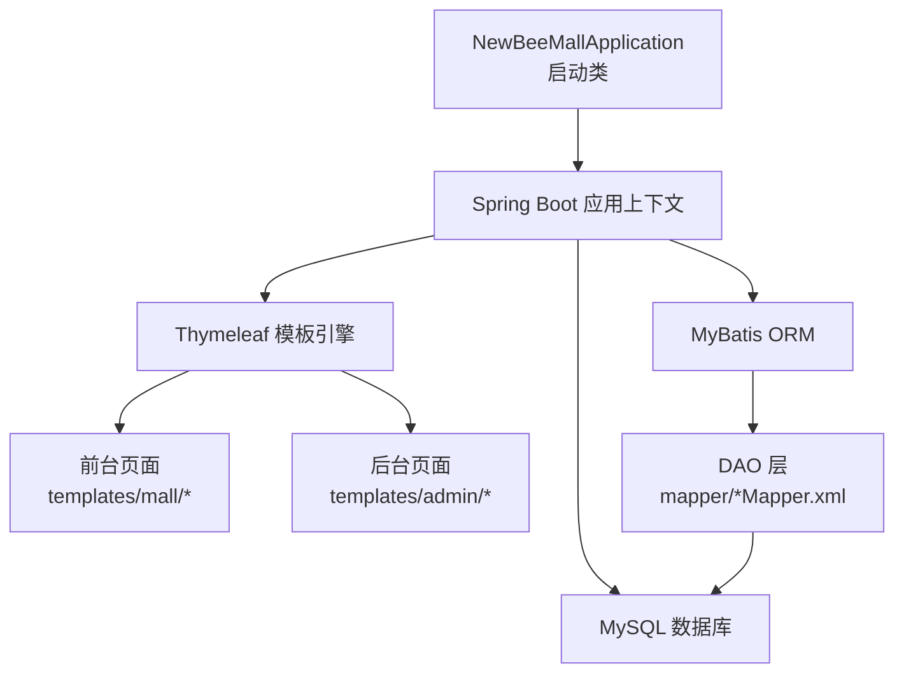
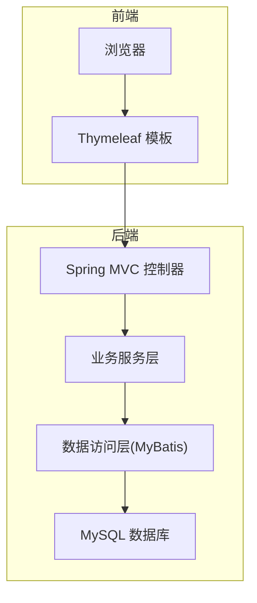
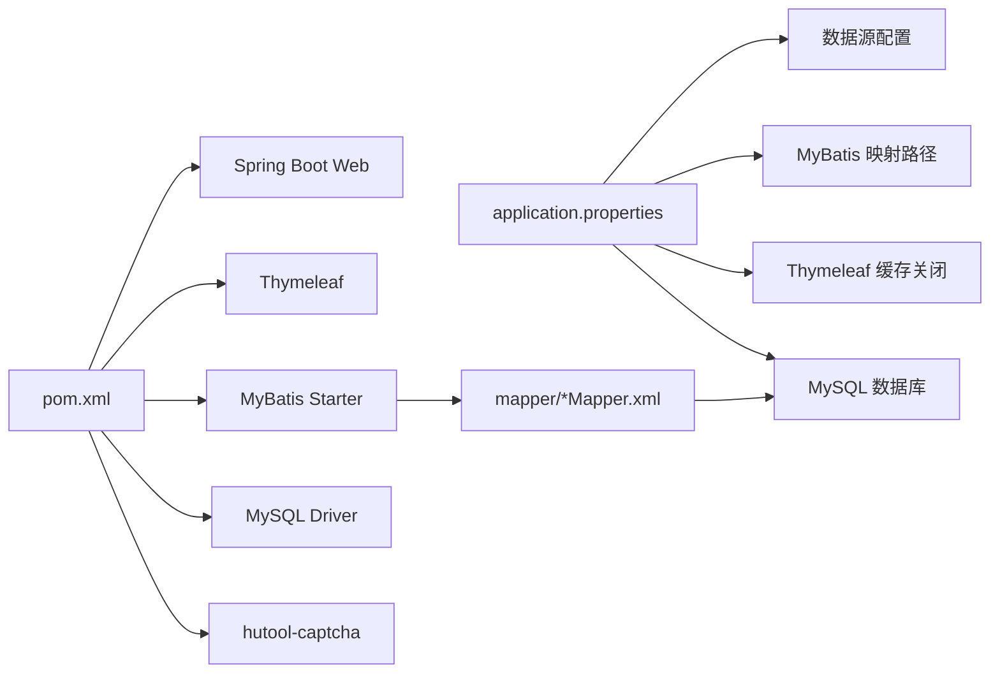

# 快速入门指南

<cite>
**本文引用的文件**
- [DEVELOPMENT.md](file://docs/DEVELOPMENT.md)
- [FAQ.md](file://docs/FAQ.md)
- [pom.xml](file://pom.xml)
- [NewBeeMallApplication.java](file://src/main/java/ltd/newbee/mall/NewBeeMallApplication.java)
- [application.properties](file://src/main/resources/application.properties)
- [newbee_mall_schema.sql](file://src/main/resources/newbee_mall_schema.sql)
</cite>

## 目录
1. [简介](#简介)
2. [项目结构](#项目结构)
3. [核心组件](#核心组件)
4. [架构总览](#架构总览)
5. [详细组件分析](#详细组件分析)
6. [依赖关系分析](#依赖关系分析)
7. [性能与配置建议](#性能与配置建议)
8. [故障排查指南](#故障排查指南)
9. [结论](#结论)
10. [附录](#附录)

## 简介
本指南面向新手开发者，帮助你在本地环境快速搭建并运行 newbee-mall 项目。你将完成环境准备（JDK、Maven、MySQL）、项目导入、数据库初始化、配置文件修改以及启动主类 NewBeeMallApplication 的全流程，并掌握常见问题的排查方法与验证安装成功的步骤。

## 项目结构
newbee-mall 是基于 Spring Boot 的电商系统，包含前台商城与后台管理两部分，采用 Thymeleaf 模板引擎与 MyBatis ORM 框架，使用 MySQL 作为数据存储。

图表来源
- [NewBeeMallApplication.java](file://src/main/java/ltd/newbee/mall/NewBeeMallApplication.java#L1-L28)
- [pom.xml](file://pom.xml#L1-L83)
- [application.properties](file://src/main/resources/application.properties#L1-L22)

章节来源
- [DEVELOPMENT.md](file://docs/DEVELOPMENT.md#L75-L131)

## 核心组件
- 启动类：NewBeeMallApplication，扫描 DAO 包并启动 Spring Boot 应用。
- 配置文件：application.properties，包含数据库连接、端口、MyBatis 映射路径等。
- 数据库脚本：newbee_mall_schema.sql，包含管理员、轮播图、商品分类、商品信息等表结构与初始数据。
- 依赖管理：pom.xml，声明 Spring Boot、Thymeleaf、MyBatis、MySQL 驱动等依赖。

章节来源
- [NewBeeMallApplication.java](file://src/main/java/ltd/newbee/mall/NewBeeMallApplication.java#L1-L28)
- [application.properties](file://src/main/resources/application.properties#L1-L22)
- [pom.xml](file://pom.xml#L1-L83)

## 架构总览
newbee-mall 采用经典的三层架构（Controller/Service/DAO），结合 Spring MVC 与 Thymeleaf 模板渲染，数据持久化通过 MyBatis 实现。

图表来源
- [DEVELOPMENT.md](file://docs/DEVELOPMENT.md#L47-L73)
- [pom.xml](file://pom.xml#L31-L67)

## 详细组件分析

### 环境准备与安装
- JDK 1.8 或以上版本
- Maven 3.x
- MySQL 5.7 或以上版本
- 推荐 IDE：IntelliJ IDEA 或 Eclipse

章节来源
- [DEVELOPMENT.md](file://docs/DEVELOPMENT.md#L135-L179)

### 项目导入与依赖
- 使用 Maven 管理依赖，核心依赖包括：
  - Spring Boot Starter Web
  - Spring Boot Starter Thymeleaf
  - MyBatis Spring Boot Starter
  - MySQL Connector/J
  - hutool-captcha（验证码）

章节来源
- [pom.xml](file://pom.xml#L31-L67)

### 数据库初始化
- 创建数据库 newbee_mall_db（字符集 utf8mb4，排序规则 utf8mb4_unicode_ci）
- 执行 newbee_mall_schema.sql 初始化表结构与初始数据
- 若需要额外数据，可执行 newbee_mall_data.sql（参考 DEVELOPMENT.md）

章节来源
- [DEVELOPMENT.md](file://docs/DEVELOPMENT.md#L167-L194)
- [newbee_mall_schema.sql](file://src/main/resources/newbee_mall_schema.sql#L1-L50)

### 配置文件修改
- 修改 application.properties 中的数据库连接信息（URL、用户名、密码）
- 修改 server.port（默认 28089）
- MyBatis 映射路径：classpath:mapper/*Mapper.xml

章节来源
- [DEVELOPMENT.md](file://docs/DEVELOPMENT.md#L195-L208)
- [application.properties](file://src/main/resources/application.properties#L1-L22)

### 启动项目
- 方式一：在 IDE 中运行 NewBeeMallApplication 主类
- 方式二：Maven 启动 mvn spring-boot:run
- 方式三：打包后命令行运行 java -jar target/newbee-mall-1.0.0-SNAPSHOT.jar

章节来源
- [DEVELOPMENT.md](file://docs/DEVELOPMENT.md#L210-L233)
- [NewBeeMallApplication.java](file://src/main/java/ltd/newbee/mall/NewBeeMallApplication.java#L1-L28)

### 访问验证
- 前台商城：http://localhost:28089
- 后台管理登录页：http://localhost:28089/admin/login

章节来源
- [DEVELOPMENT.md](file://docs/DEVELOPMENT.md#L234-L238)

## 依赖关系分析

图表来源
- [pom.xml](file://pom.xml#L31-L67)
- [application.properties](file://src/main/resources/application.properties#L1-L22)

章节来源
- [pom.xml](file://pom.xml#L1-L83)
- [application.properties](file://src/main/resources/application.properties#L1-L22)

## 性能与配置建议
- 开发期启用 Thymeleaf 缓存关闭（spring.thymeleaf.cache=false），便于模板热更新
- 生产环境建议开启缓存并配置合适的日志级别
- 如需文件上传，可按 FAQ 调整上传大小限制
- 如需后台运行，可使用 nohup 或 systemd 管理

章节来源
- [application.properties](file://src/main/resources/application.properties#L1-L22)
- [FAQ.md](file://docs/FAQ.md#L120-L140)
- [FAQ.md](file://docs/FAQ.md#L172-L178)

## 故障排查指南

### 端口冲突
- 现象：启动时报端口被占用
- 处理：修改 application.properties 中的 server.port，或查找并结束占用端口的进程
- 参考命令：
  - Windows：netstat -ano | findstr 端口号
  - Linux/Mac：lsof -i:端口号

章节来源
- [FAQ.md](file://docs/FAQ.md#L62-L68)

### 数据库连接失败
- 现象：启动时报数据库连接失败
- 处理：确认 MySQL 服务已启动、数据库已创建、初始化脚本已执行、连接信息正确、防火墙未阻断

章节来源
- [FAQ.md](file://docs/FAQ.md#L69-L75)

### Maven 依赖下载失败
- 处理：检查网络、更换镜像源、清理缓存并重新下载依赖

章节来源
- [FAQ.md](file://docs/FAQ.md#L33-L39)

### 管理员默认账号
- 默认管理员账号信息在数据库初始化脚本中，通常包含 admin 用户与默认密码（MD5 加密存储）

章节来源
- [FAQ.md](file://docs/FAQ.md#L83-L87)
- [newbee_mall_schema.sql](file://src/main/resources/newbee_mall_schema.sql#L1-L50)

### 验证安装成功
- 访问前台首页：http://localhost:28089
- 访问后台登录页：http://localhost:28089/admin/login
- 登录后台后进入管理界面，确认数据与功能可用

章节来源
- [DEVELOPMENT.md](file://docs/DEVELOPMENT.md#L234-L238)

## 结论
按照本指南完成环境准备、项目导入、数据库初始化与配置修改后，即可通过 IDE 或 Maven 启动 NewBeeMallApplication 并访问前台与后台页面。遇到常见问题时，可依据 FAQ 进行快速定位与修复。建议在开发阶段开启模板缓存关闭以便热更新，生产阶段再按需调整配置。

## 附录

### 快速操作清单
- 安装 JDK、Maven、MySQL
- 克隆项目并导入
- 创建数据库 newbee_mall_db 并执行 newbee_mall_schema.sql
- 修改 application.properties 中的数据库连接与端口
- 启动 NewBeeMallApplication
- 访问 http://localhost:28089 与 http://localhost:28089/admin/login 验证

章节来源
- [DEVELOPMENT.md](file://docs/DEVELOPMENT.md#L135-L238)
- [application.properties](file://src/main/resources/application.properties#L1-L22)
- [newbee_mall_schema.sql](file://src/main/resources/newbee_mall_schema.sql#L1-L50)