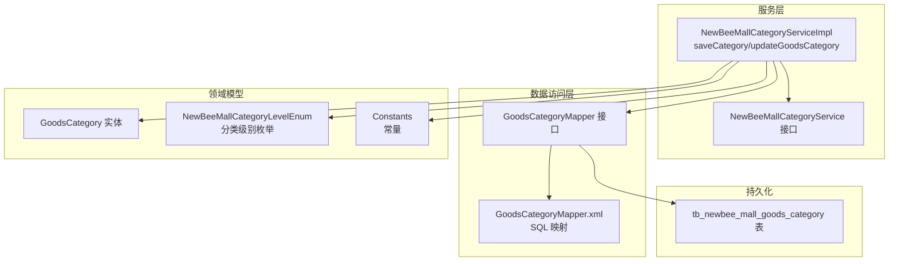
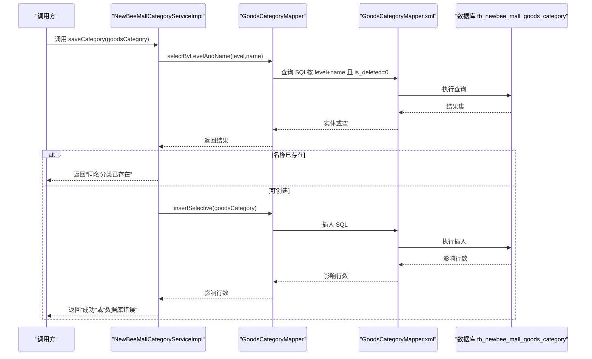
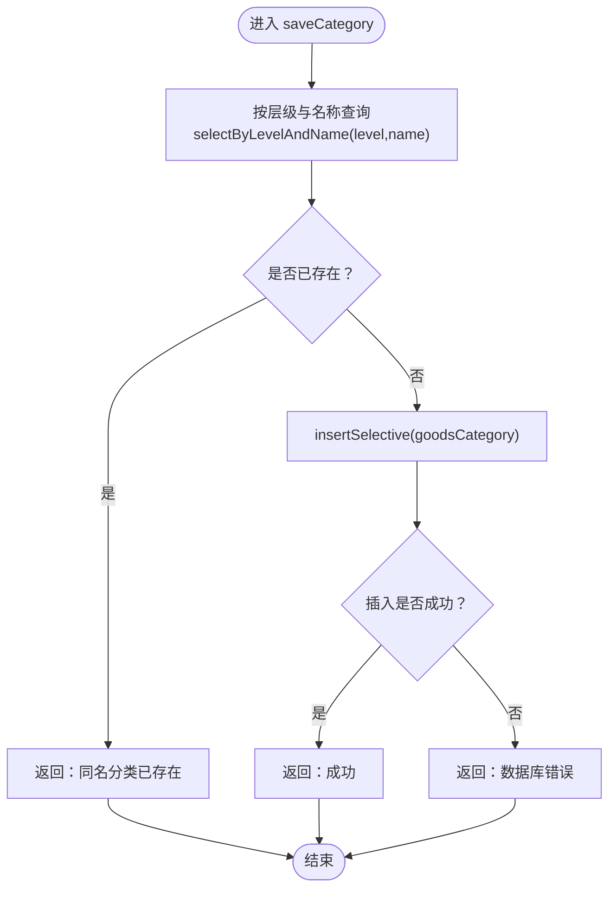
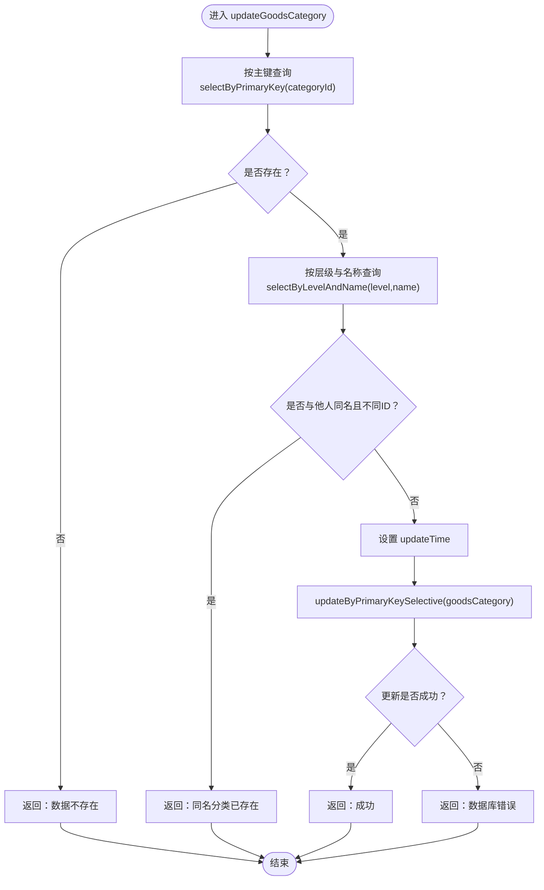
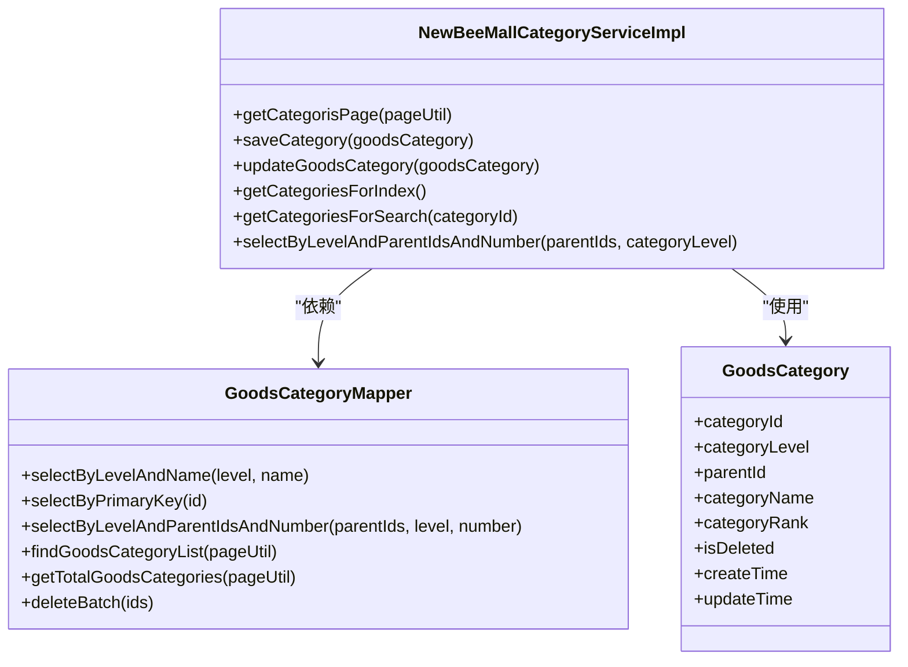

# 业务规则与约束

<cite>
**本文引用的文件**
- [NewBeeMallCategoryServiceImpl.java](file://src/main/java/ltd/newbee/mall/service/impl/NewBeeMallCategoryServiceImpl.java)
- [GoodsCategoryMapper.java](file://src/main/java/ltd/newbee/mall/dao/GoodsCategoryMapper.java)
- [GoodsCategoryMapper.xml](file://src/main/resources/mapper/GoodsCategoryMapper.xml)
- [GoodsCategory.java](file://src/main/java/ltd/newbee/mall/entity/GoodsCategory.java)
- [NewBeeMallCategoryLevelEnum.java](file://src/main/java/ltd/newbee/mall/common/NewBeeMallCategoryLevelEnum.java)
- [Constants.java](file://src/main/java/ltd/newbee/mall/common/Constants.java)
- [NewBeeMallCategoryService.java](file://src/main/java/ltd/newbee/mall/service/NewBeeMallCategoryService.java)
- [newbee_mall_schema.sql](file://src/main/resources/newbee_mall_schema.sql)
- [newbee_mall_category.js](file://src/main/resources/static/admin/dist/js/newbee_mall_category.js)
</cite>

## 目录
1. [引言](#引言)
2. [项目结构](#项目结构)
3. [核心组件](#核心组件)
4. [架构总览](#架构总览)
5. [详细组件分析](#详细组件分析)
6. [依赖关系分析](#依赖关系分析)
7. [性能考量](#性能考量)
8. [故障排查指南](#故障排查指南)
9. [结论](#结论)

## 引言
本文件聚焦于 newbee-mall 商品分类业务的规则与约束，围绕以下关键点展开：
- 分类名称唯一性约束：通过 selectByLevelAndName 实现，确保同一层级下分类名称不可重复。
- 分类排序值 category_rank 的作用与使用场景：决定前台展示顺序，数值越大越靠前。
- 删除状态 is_deleted 的软删除机制：物理删除改为标记删除，避免数据丢失与关联破坏。
- 服务层 saveCategory 与 updateGoodsCategory 的业务逻辑：创建时重复检查、更新时一致性校验。

## 项目结构
分类相关代码主要分布在以下层次：
- 控制器与服务接口：service.NewBeeMallCategoryService
- 服务实现：service.impl.NewBeeMallCategoryServiceImpl
- 数据访问层：dao.GoodsCategoryMapper 及其 MyBatis 映射 GoodsCategoryMapper.xml
- 实体模型：entity.GoodsCategory
- 枚举与常量：common.NewBeeMallCategoryLevelEnum、common.Constants
- 数据库表结构：newbee_mall_schema.sql 中的 tb_newbee_mall_goods_category

图表来源
- [NewBeeMallCategoryServiceImpl.java](file://src/main/java/ltd/newbee/mall/service/impl/NewBeeMallCategoryServiceImpl.java#L1-L168)
- [NewBeeMallCategoryService.java](file://src/main/java/ltd/newbee/mall/service/NewBeeMallCategoryService.java#L1-L60)
- [GoodsCategoryMapper.java](file://src/main/java/ltd/newbee/mall/dao/GoodsCategoryMapper.java#L1-L39)
- [GoodsCategoryMapper.xml](file://src/main/resources/mapper/GoodsCategoryMapper.xml#L1-L212)
- [GoodsCategory.java](file://src/main/java/ltd/newbee/mall/entity/GoodsCategory.java#L1-L137)
- [NewBeeMallCategoryLevelEnum.java](file://src/main/java/ltd/newbee/mall/common/NewBeeMallCategoryLevelEnum.java#L1-L59)
- [Constants.java](file://src/main/java/ltd/newbee/mall/common/Constants.java#L1-L48)
- [newbee_mall_schema.sql](file://src/main/resources/newbee_mall_schema.sql#L72-L87)

章节来源
- [NewBeeMallCategoryServiceImpl.java](file://src/main/java/ltd/newbee/mall/service/impl/NewBeeMallCategoryServiceImpl.java#L1-L168)
- [GoodsCategoryMapper.java](file://src/main/java/ltd/newbee/mall/dao/GoodsCategoryMapper.java#L1-L39)
- [GoodsCategoryMapper.xml](file://src/main/resources/mapper/GoodsCategoryMapper.xml#L1-L212)
- [GoodsCategory.java](file://src/main/java/ltd/newbee/mall/entity/GoodsCategory.java#L1-L137)
- [NewBeeMallCategoryLevelEnum.java](file://src/main/java/ltd/newbee/mall/common/NewBeeMallCategoryLevelEnum.java#L1-L59)
- [Constants.java](file://src/main/java/ltd/newbee/mall/common/Constants.java#L1-L48)
- [NewBeeMallCategoryService.java](file://src/main/java/ltd/newbee/mall/service/NewBeeMallCategoryService.java#L1-L60)
- [newbee_mall_schema.sql](file://src/main/resources/newbee_mall_schema.sql#L72-L87)

## 核心组件
- 分类实体 GoodsCategory：包含分类标识、层级、父级、名称、排序值、删除标记、创建/更新时间与用户等字段。
- 分类服务接口 NewBeeMallCategoryService：定义后台分页、保存、更新、批量删除、首页与搜索页分类数据获取等能力。
- 分类服务实现 NewBeeMallCategoryServiceImpl：实现保存与更新的业务规则，并提供首页与搜索页的树形分类组装。
- 分类映射 GoodsCategoryMapper：定义按层级与名称查询、按层级与父级集合查询、分页查询、统计总数、软删除、批量软删除等方法。
- 分类映射 XML GoodsCategoryMapper.xml：实现上述方法对应的 SQL，含排序、过滤 is_deleted=0、软删除更新为 is_deleted=1 等。
- 分类级别枚举 NewBeeMallCategoryLevelEnum：定义一级、二级、三级分类级别。
- 常量 Constants：定义首页与搜索页分类数量限制等常量。

章节来源
- [GoodsCategory.java](file://src/main/java/ltd/newbee/mall/entity/GoodsCategory.java#L1-L137)
- [NewBeeMallCategoryService.java](file://src/main/java/ltd/newbee/mall/service/NewBeeMallCategoryService.java#L1-L60)
- [NewBeeMallCategoryServiceImpl.java](file://src/main/java/ltd/newbee/mall/service/impl/NewBeeMallCategoryServiceImpl.java#L1-L168)
- [GoodsCategoryMapper.java](file://src/main/java/ltd/newbee/mall/dao/GoodsCategoryMapper.java#L1-L39)
- [GoodsCategoryMapper.xml](file://src/main/resources/mapper/GoodsCategoryMapper.xml#L1-L212)
- [NewBeeMallCategoryLevelEnum.java](file://src/main/java/ltd/newbee/mall/common/NewBeeMallCategoryLevelEnum.java#L1-L59)
- [Constants.java](file://src/main/java/ltd/newbee/mall/common/Constants.java#L1-L48)

## 架构总览
分类业务遵循典型的分层架构：控制器接收请求，服务层执行业务规则，DAO 层负责数据访问，XML 映射 SQL，实体承载数据。

图表来源
- [NewBeeMallCategoryServiceImpl.java](file://src/main/java/ltd/newbee/mall/service/impl/NewBeeMallCategoryServiceImpl.java#L47-L75)
- [GoodsCategoryMapper.java](file://src/main/java/ltd/newbee/mall/dao/GoodsCategoryMapper.java#L24-L27)
- [GoodsCategoryMapper.xml](file://src/main/resources/mapper/GoodsCategoryMapper.xml#L56-L62)
- [GoodsCategory.java](file://src/main/java/ltd/newbee/mall/entity/GoodsCategory.java#L1-L137)

## 详细组件分析

### 1. 分类名称唯一性约束
- 规则说明：同一分类层级内，分类名称必须唯一；跨层级可重名。
- 实现位置：
  - 服务层：NewBeeMallCategoryServiceImpl.saveCategory 在插入前调用 GoodsCategoryMapper.selectByLevelAndName 进行重复检查。
  - DAO 层：GoodsCategoryMapper.selectByLevelAndName 定义了按 level 与 name 查询的方法。
  - XML 层：GoodsCategoryMapper.xml 的 selectByLevelAndName 查询条件包含 is_deleted=0，确保只对未删除记录生效。
- 关键路径参考：
  - 保存流程：[saveCategory 方法](file://src/main/java/ltd/newbee/mall/service/impl/NewBeeMallCategoryServiceImpl.java#L47-L57)
  - 查询唯一性：[selectByLevelAndName 接口](file://src/main/java/ltd/newbee/mall/dao/GoodsCategoryMapper.java#L24-L27)，[XML 实现](file://src/main/resources/mapper/GoodsCategoryMapper.xml#L56-L62)

章节来源
- [NewBeeMallCategoryServiceImpl.java](file://src/main/java/ltd/newbee/mall/service/impl/NewBeeMallCategoryServiceImpl.java#L47-L57)
- [GoodsCategoryMapper.java](file://src/main/java/ltd/newbee/mall/dao/GoodsCategoryMapper.java#L24-L27)
- [GoodsCategoryMapper.xml](file://src/main/resources/mapper/GoodsCategoryMapper.xml#L56-L62)

### 2. 分类排序值 category_rank 的作用与使用场景
- 作用：控制前台展示顺序，数值越大越靠前。
- 使用场景：
  - 后台分页查询：findGoodsCategoryList 按 category_rank 降序排列。
  - 按父级与层级查询：selectByLevelAndParentIdsAndNumber 按 category_rank 降序排列，支持限制数量。
  - 首页与搜索页：首页取固定数量的一级分类，二级与三级分类同样按 rank 降序组织。
- 关键路径参考：
  - 分页排序：[findGoodsCategoryList SQL](file://src/main/resources/mapper/GoodsCategoryMapper.xml#L20-L37)
  - 父级+层级+数量查询：[selectByLevelAndParentIdsAndNumber SQL](file://src/main/resources/mapper/GoodsCategoryMapper.xml#L63-L77)
  - 首页组装逻辑：[getCategoriesForIndex 方法](file://src/main/java/ltd/newbee/mall/service/impl/NewBeeMallCategoryServiceImpl.java#L91-L142)
  - 搜索页组装逻辑：[getCategoriesForSearch 方法](file://src/main/java/ltd/newbee/mall/service/impl/NewBeeMallCategoryServiceImpl.java#L144-L161)

章节来源
- [GoodsCategoryMapper.xml](file://src/main/resources/mapper/GoodsCategoryMapper.xml#L20-L37)
- [GoodsCategoryMapper.xml](file://src/main/resources/mapper/GoodsCategoryMapper.xml#L63-L77)
- [NewBeeMallCategoryServiceImpl.java](file://src/main/java/ltd/newbee/mall/service/impl/NewBeeMallCategoryServiceImpl.java#L91-L161)

### 3. 分类删除状态 is_deleted 的软删除机制
- 规则说明：删除操作不直接物理删除，而是将 is_deleted 设为 1；所有查询均过滤 is_deleted=0。
- 实现位置：
  - 删除接口：GoodsCategoryMapper.deleteByPrimaryKey 与 deleteBatch。
  - XML 实现：deleteByPrimaryKey 与 deleteBatch 均为更新语句，将 is_deleted=1。
  - 其他查询：findGoodsCategoryList、getTotalGoodsCategories、selectByPrimaryKey、selectByLevelAndParentIdsAndNumber、selectByLevelAndName 均包含 and is_deleted=0 条件。
- 关键路径参考：
  - 软删除更新：[deleteByPrimaryKey SQL](file://src/main/resources/mapper/GoodsCategoryMapper.xml#L78-L88)，[deleteBatch SQL](file://src/main/resources/mapper/GoodsCategoryMapper.xml#L82-L88)
  - 查询过滤：[findGoodsCategoryList where 条件](file://src/main/resources/mapper/GoodsCategoryMapper.xml#L24-L31)，[selectByPrimaryKey where 条件](file://src/main/resources/mapper/GoodsCategoryMapper.xml#L50-L55)，[selectByLevelAndName where 条件](file://src/main/resources/mapper/GoodsCategoryMapper.xml#L56-L62)，[selectByLevelAndParentIdsAndNumber where 条件](file://src/main/resources/mapper/GoodsCategoryMapper.xml#L63-L73)

章节来源
- [GoodsCategoryMapper.java](file://src/main/java/ltd/newbee/mall/dao/GoodsCategoryMapper.java#L18-L39)
- [GoodsCategoryMapper.xml](file://src/main/resources/mapper/GoodsCategoryMapper.xml#L50-L88)

### 4. 服务层 saveCategory 业务逻辑
- 主要步骤：
  1) 按层级与名称查询是否存在未删除记录；
  2) 若存在则返回“同名分类已存在”；
  3) 若不存在则执行插入，返回“成功”或“数据库错误”。
- 关键路径参考：
  - 保存逻辑：[saveCategory 方法](file://src/main/java/ltd/newbee/mall/service/impl/NewBeeMallCategoryServiceImpl.java#L47-L57)
  - 唯一性检查：[selectByLevelAndName 接口](file://src/main/java/ltd/newbee/mall/dao/GoodsCategoryMapper.java#L24-L27)，[XML 实现](file://src/main/resources/mapper/GoodsCategoryMapper.xml#L56-L62)
  - 插入执行：[insertSelective 接口](file://src/main/java/ltd/newbee/mall/dao/GoodsCategoryMapper.java#L20-L23)，[XML 实现](file://src/main/resources/mapper/GoodsCategoryMapper.xml#L99-L165)

图表来源
- [NewBeeMallCategoryServiceImpl.java](file://src/main/java/ltd/newbee/mall/service/impl/NewBeeMallCategoryServiceImpl.java#L47-L57)
- [GoodsCategoryMapper.java](file://src/main/java/ltd/newbee/mall/dao/GoodsCategoryMapper.java#L20-L27)
- [GoodsCategoryMapper.xml](file://src/main/resources/mapper/GoodsCategoryMapper.xml#L56-L62)
- [GoodsCategoryMapper.xml](file://src/main/resources/mapper/GoodsCategoryMapper.xml#L99-L165)

章节来源
- [NewBeeMallCategoryServiceImpl.java](file://src/main/java/ltd/newbee/mall/service/impl/NewBeeMallCategoryServiceImpl.java#L47-L57)
- [GoodsCategoryMapper.java](file://src/main/java/ltd/newbee/mall/dao/GoodsCategoryMapper.java#L20-L27)
- [GoodsCategoryMapper.xml](file://src/main/resources/mapper/GoodsCategoryMapper.xml#L56-L62)
- [GoodsCategoryMapper.xml](file://src/main/resources/mapper/GoodsCategoryMapper.xml#L99-L165)

### 5. 服务层 updateGoodsCategory 业务逻辑
- 主要步骤：
  1) 按主键查询目标分类是否存在；
  2) 若不存在返回“数据不存在”；
  3) 按层级与名称检查是否与其他分类冲突（排除自身）；
  4) 若冲突返回“同名分类已存在”；
  5) 更新 updateTime 后执行更新，返回“成功”或“数据库错误”。
- 关键路径参考：
  - 更新逻辑：[updateGoodsCategory 方法](file://src/main/java/ltd/newbee/mall/service/impl/NewBeeMallCategoryServiceImpl.java#L60-L75)
  - 主键查询：[selectByPrimaryKey 接口](file://src/main/java/ltd/newbee/mall/dao/GoodsCategoryMapper.java#L24-L24)，[XML 实现](file://src/main/resources/mapper/GoodsCategoryMapper.xml#L50-L55)
  - 唯一性检查：[selectByLevelAndName 接口](file://src/main/java/ltd/newbee/mall/dao/GoodsCategoryMapper.java#L24-L27)，[XML 实现](file://src/main/resources/mapper/GoodsCategoryMapper.xml#L56-L62)
  - 更新执行：[updateByPrimaryKeySelective 接口](file://src/main/java/ltd/newbee/mall/dao/GoodsCategoryMapper.java#L26-L28)，[XML 实现](file://src/main/resources/mapper/GoodsCategoryMapper.xml#L166-L198)

图表来源
- [NewBeeMallCategoryServiceImpl.java](file://src/main/java/ltd/newbee/mall/service/impl/NewBeeMallCategoryServiceImpl.java#L60-L75)
- [GoodsCategoryMapper.java](file://src/main/java/ltd/newbee/mall/dao/GoodsCategoryMapper.java#L24-L28)
- [GoodsCategoryMapper.xml](file://src/main/resources/mapper/GoodsCategoryMapper.xml#L50-L62)
- [GoodsCategoryMapper.xml](file://src/main/resources/mapper/GoodsCategoryMapper.xml#L166-L198)

章节来源
- [NewBeeMallCategoryServiceImpl.java](file://src/main/java/ltd/newbee/mall/service/impl/NewBeeMallCategoryServiceImpl.java#L60-L75)
- [GoodsCategoryMapper.java](file://src/main/java/ltd/newbee/mall/dao/GoodsCategoryMapper.java#L24-L28)
- [GoodsCategoryMapper.xml](file://src/main/resources/mapper/GoodsCategoryMapper.xml#L50-L62)
- [GoodsCategoryMapper.xml](file://src/main/resources/mapper/GoodsCategoryMapper.xml#L166-L198)

### 6. 分类层级与树形组装
- 层级枚举：NewBeeMallCategoryLevelEnum 提供 LEVEL_ONE、LEVEL_TWO、LEVEL_THREE 三种级别。
- 树形组装：
  - 首页：先取一级分类（固定数量），再取对应二级分类，再取对应三级分类，按 parentId 分组后组装成 VO。
  - 搜索页：从三级分类向上回溯到二级，再取二级下的全部三级分类，形成搜索页分类面包屑与子级列表。
- 关键路径参考：
  - 层级枚举：[NewBeeMallCategoryLevelEnum](file://src/main/java/ltd/newbee/mall/common/NewBeeMallCategoryLevelEnum.java#L1-L59)
  - 首页组装：[getCategoriesForIndex 方法](file://src/main/java/ltd/newbee/mall/service/impl/NewBeeMallCategoryServiceImpl.java#L91-L142)
  - 搜索页组装：[getCategoriesForSearch 方法](file://src/main/java/ltd/newbee/mall/service/impl/NewBeeMallCategoryServiceImpl.java#L144-L161)
  - 常量限制：[Constants](file://src/main/java/ltd/newbee/mall/common/Constants.java#L20-L30)

章节来源
- [NewBeeMallCategoryLevelEnum.java](file://src/main/java/ltd/newbee/mall/common/NewBeeMallCategoryLevelEnum.java#L1-L59)
- [NewBeeMallCategoryServiceImpl.java](file://src/main/java/ltd/newbee/mall/service/impl/NewBeeMallCategoryServiceImpl.java#L91-L161)
- [Constants.java](file://src/main/java/ltd/newbee/mall/common/Constants.java#L20-L30)

## 依赖关系分析
- 服务层依赖 DAO 接口与实体，DAO 依赖 XML 映射与数据库。
- 服务层在 saveCategory 与 updateGoodsCategory 中两次依赖 selectByLevelAndName 实现唯一性约束。
- 服务层在首页与搜索页组装中依赖 selectByLevelAndParentIdsAndNumber 与 selectByPrimaryKey。
- XML 层统一通过 and is_deleted=0 过滤逻辑删除数据，保证查询一致性。

图表来源
- [NewBeeMallCategoryServiceImpl.java](file://src/main/java/ltd/newbee/mall/service/impl/NewBeeMallCategoryServiceImpl.java#L1-L168)
- [GoodsCategoryMapper.java](file://src/main/java/ltd/newbee/mall/dao/GoodsCategoryMapper.java#L1-L39)
- [GoodsCategory.java](file://src/main/java/ltd/newbee/mall/entity/GoodsCategory.java#L1-L137)

章节来源
- [NewBeeMallCategoryServiceImpl.java](file://src/main/java/ltd/newbee/mall/service/impl/NewBeeMallCategoryServiceImpl.java#L1-L168)
- [GoodsCategoryMapper.java](file://src/main/java/ltd/newbee/mall/dao/GoodsCategoryMapper.java#L1-L39)
- [GoodsCategory.java](file://src/main/java/ltd/newbee/mall/entity/GoodsCategory.java#L1-L137)

## 性能考量
- 查询过滤 is_deleted=0：所有查询均带该条件，避免扫描逻辑删除数据，提升查询效率。
- 排序与限制：分页与首页/搜索页查询均按 category_rank 降序，且首页限制数量，减少结果集大小。
- 唯一性检查：saveCategory 与 updateGoodsCategory 均通过 selectByLevelAndName 进行快速冲突检测，避免后续插入/更新异常。
- 建议索引：建议在 (category_level, category_name, is_deleted) 上建立联合索引以优化唯一性检查与查询性能。

[本节为通用性能讨论，无需列出具体文件来源]

## 故障排查指南
- “同名分类已存在”：
  - 检查是否在同一层级下重复命名；确认 is_deleted=0 的记录是否已存在。
  - 参考：[saveCategory 与 updateGoodsCategory 的唯一性检查](file://src/main/java/ltd/newbee/mall/service/impl/NewBeeMallCategoryServiceImpl.java#L47-L75)，[selectByLevelAndName SQL](file://src/main/resources/mapper/GoodsCategoryMapper.xml#L56-L62)
- “数据不存在”：
  - 检查传入的 categoryId 是否有效；确认记录未被逻辑删除。
  - 参考：[selectByPrimaryKey SQL](file://src/main/resources/mapper/GoodsCategoryMapper.xml#L50-L55)
- “数据库错误”：
  - 检查 insertSelective 或 updateByPrimaryKeySelective 的返回影响行数；关注事务与并发。
  - 参考：[insertSelective SQL](file://src/main/resources/mapper/GoodsCategoryMapper.xml#L99-L165)，[updateByPrimaryKeySelective SQL](file://src/main/resources/mapper/GoodsCategoryMapper.xml#L166-L198)
- 删除后仍可见：
  - 确认 is_deleted 字段是否正确更新为 1；确认查询 SQL 是否包含 and is_deleted=0。
  - 参考：[deleteByPrimaryKey SQL](file://src/main/resources/mapper/GoodsCategoryMapper.xml#L78-L88)，[deleteBatch SQL](file://src/main/resources/mapper/GoodsCategoryMapper.xml#L82-L88)

章节来源
- [NewBeeMallCategoryServiceImpl.java](file://src/main/java/ltd/newbee/mall/service/impl/NewBeeMallCategoryServiceImpl.java#L47-L75)
- [GoodsCategoryMapper.xml](file://src/main/resources/mapper/GoodsCategoryMapper.xml#L50-L88)

## 结论
- 分类名称唯一性：通过 selectByLevelAndName 与 is_deleted=0 的组合实现，确保同一层级内名称唯一。
- 排序策略：category_rank 决定前台展示顺序，数值越大越靠前，查询与组装均基于该规则。
- 删除策略：采用 is_deleted=1 的软删除，所有查询自动过滤逻辑删除数据，保障数据一致性与可恢复性。
- 服务层规则：saveCategory 与 updateGoodsCategory 严格遵循“先检查、后变更”的原则，保证业务一致性与用户体验。

[本节为总结性内容，无需列出具体文件来源]