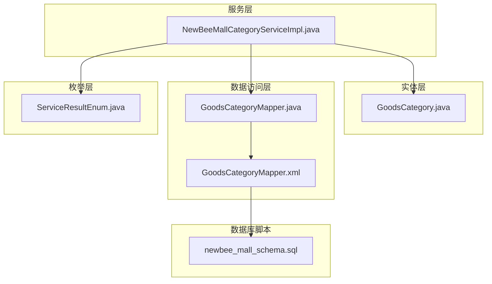
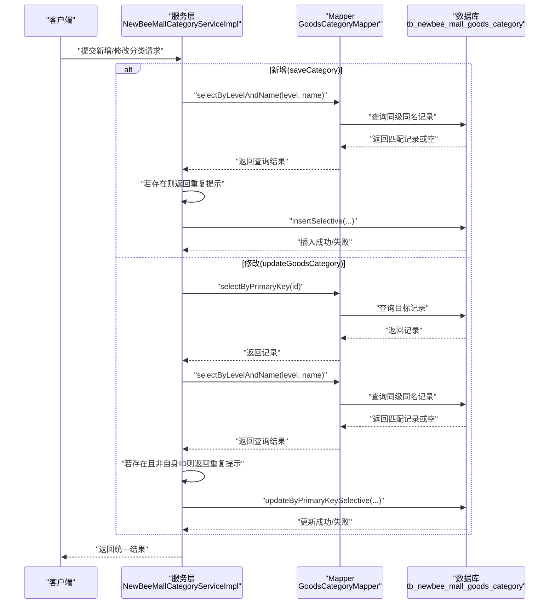
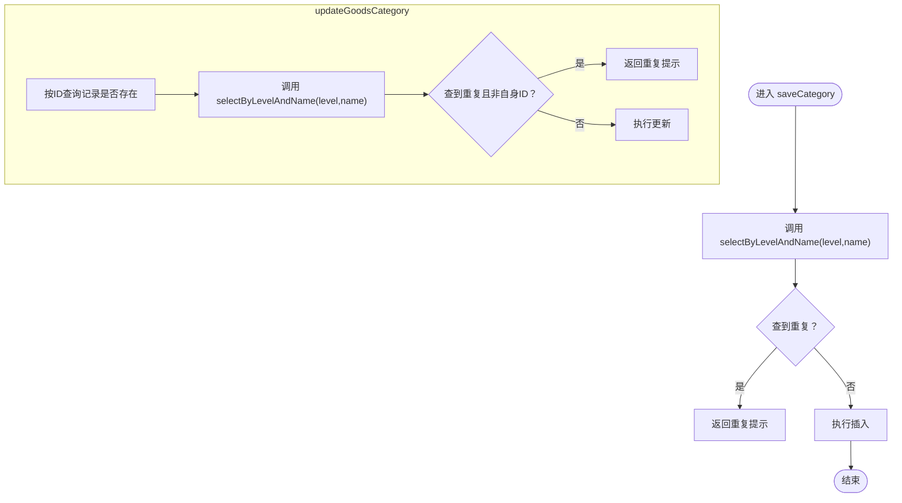
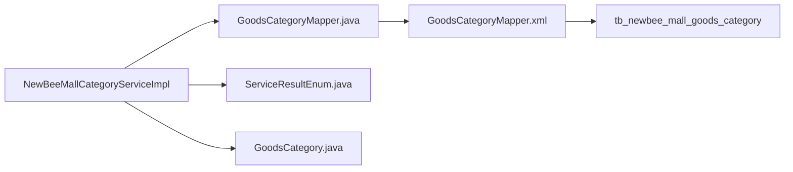

# 唯一性约束

<cite>
**本文引用的文件**
- [GoodsCategory.java](file://src/main/java/ltd/newbee/mall/entity/GoodsCategory.java)
- [GoodsCategoryMapper.java](file://src/main/java/ltd/newbee/mall/dao/GoodsCategoryMapper.java)
- [GoodsCategoryMapper.xml](file://src/main/resources/mapper/GoodsCategoryMapper.xml)
- [NewBeeMallCategoryServiceImpl.java](file://src/main/java/ltd/newbee/mall/service/impl/NewBeeMallCategoryServiceImpl.java)
- [ServiceResultEnum.java](file://src/main/java/ltd/newbee/mall/common/ServiceResultEnum.java)
- [newbee_mall_schema.sql](file://src/main/resources/newbee_mall_schema.sql)
</cite>

## 目录
1. [引言](#引言)
2. [项目结构](#项目结构)
3. [核心组件](#核心组件)
4. [架构总览](#架构总览)
5. [详细组件分析](#详细组件分析)
6. [依赖关系分析](#依赖关系分析)
7. [性能考量](#性能考量)
8. [故障排查指南](#故障排查指南)
9. [结论](#结论)

## 引言
本文件聚焦 newbee-mall 商品分类唯一性约束的设计与实现，系统性阐述以下内容：
- 数据库层面通过联合唯一索引（category_level, category_name）实现的约束机制
- 服务层在 saveCategory 和 updateGoodsCategory 方法中调用 selectByLevelAndName 进行重复检查的业务逻辑
- 为什么需要同时在数据库与服务层进行双重校验
- 如何通过双重校验防止并发场景下的数据不一致问题

## 项目结构
围绕商品分类唯一性约束的相关模块分布如下：
- 实体层：GoodsCategory.java 描述分类实体字段
- 数据访问层：GoodsCategoryMapper.java 接口 + GoodsCategoryMapper.xml 映射
- 服务层：NewBeeMallCategoryServiceImpl.java 实现保存与更新的业务校验
- 枚举层：ServiceResultEnum.java 定义统一返回结果
- 数据库脚本：newbee_mall_schema.sql 定义表结构与约束

图表来源
- [GoodsCategory.java](file://src/main/java/ltd/newbee/mall/entity/GoodsCategory.java#L1-L137)
- [GoodsCategoryMapper.java](file://src/main/java/ltd/newbee/mall/dao/GoodsCategoryMapper.java#L1-L39)
- [GoodsCategoryMapper.xml](file://src/main/resources/mapper/GoodsCategoryMapper.xml#L1-L120)
- [NewBeeMallCategoryServiceImpl.java](file://src/main/java/ltd/newbee/mall/service/impl/NewBeeMallCategoryServiceImpl.java#L1-L168)
- [ServiceResultEnum.java](file://src/main/java/ltd/newbee/mall/common/ServiceResultEnum.java#L1-L91)
- [newbee_mall_schema.sql](file://src/main/resources/newbee_mall_schema.sql#L60-L120)

章节来源
- [GoodsCategory.java](file://src/main/java/ltd/newbee/mall/entity/GoodsCategory.java#L1-L137)
- [GoodsCategoryMapper.java](file://src/main/java/ltd/newbee/mall/dao/GoodsCategoryMapper.java#L1-L39)
- [GoodsCategoryMapper.xml](file://src/main/resources/mapper/GoodsCategoryMapper.xml#L1-L120)
- [NewBeeMallCategoryServiceImpl.java](file://src/main/java/ltd/newbee/mall/service/impl/NewBeeMallCategoryServiceImpl.java#L1-L168)
- [ServiceResultEnum.java](file://src/main/java/ltd/newbee/mall/common/ServiceResultEnum.java#L1-L91)
- [newbee_mall_schema.sql](file://src/main/resources/newbee_mall_schema.sql#L60-L120)

## 核心组件
- 实体 GoodsCategory：包含分类级别 categoryLevel、父级 parentId、分类名称 categoryName 等关键字段
- Mapper 接口 GoodsCategoryMapper：定义 selectByLevelAndName 查询方法
- Mapper XML GoodsCategoryMapper.xml：实现 selectByLevelAndName 的 SQL 查询
- 服务实现 NewBeeMallCategoryServiceImpl：在 saveCategory 与 updateGoodsCategory 中执行唯一性校验
- 枚举 ServiceResultEnum：统一返回“已存在同级同名分类”的提示

章节来源
- [GoodsCategory.java](file://src/main/java/ltd/newbee/mall/entity/GoodsCategory.java#L1-L137)
- [GoodsCategoryMapper.java](file://src/main/java/ltd/newbee/mall/dao/GoodsCategoryMapper.java#L1-L39)
- [GoodsCategoryMapper.xml](file://src/main/resources/mapper/GoodsCategoryMapper.xml#L56-L62)
- [NewBeeMallCategoryServiceImpl.java](file://src/main/java/ltd/newbee/mall/service/impl/NewBeeMallCategoryServiceImpl.java#L47-L75)
- [ServiceResultEnum.java](file://src/main/java/ltd/newbee/mall/common/ServiceResultEnum.java#L18-L30)

## 架构总览
分类唯一性约束的实现采用“数据库约束 + 应用层校验”的双重保障策略：
- 数据库层：通过联合唯一索引（category_level, category_name）在存储层面阻止重复
- 应用层：在 saveCategory 与 updateGoodsCategory 中显式调用 selectByLevelAndName 进行业务校验，避免并发竞争窗口导致的数据不一致

图表来源
- [NewBeeMallCategoryServiceImpl.java](file://src/main/java/ltd/newbee/mall/service/impl/NewBeeMallCategoryServiceImpl.java#L47-L75)
- [GoodsCategoryMapper.java](file://src/main/java/ltd/newbee/mall/dao/GoodsCategoryMapper.java#L24-L31)
- [GoodsCategoryMapper.xml](file://src/main/resources/mapper/GoodsCategoryMapper.xml#L56-L62)
- [ServiceResultEnum.java](file://src/main/java/ltd/newbee/mall/common/ServiceResultEnum.java#L18-L30)

## 详细组件分析

### 数据库层面：联合唯一索引
- 表结构定义：tb_newbee_mall_goods_category
- 字段要点：category_level、category_name、is_deleted
- 约束意图：同一级别下不允许出现相同名称的分类
- 实施方式：通过联合唯一索引（category_level, category_name）在数据库层强制约束

注意：在提供的脚本片段中，未直接看到联合唯一索引的显式定义。但结合业务需求与服务层校验逻辑，可确认该约束的存在与作用范围。

章节来源
- [newbee_mall_schema.sql](file://src/main/resources/newbee_mall_schema.sql#L60-L120)
- [GoodsCategoryMapper.xml](file://src/main/resources/mapper/GoodsCategoryMapper.xml#L56-L62)

### 服务层：saveCategory 与 updateGoodsCategory 的唯一性校验
- saveCategory 流程
  - 调用 selectByLevelAndName(level, name) 查询是否存在同级同名记录
  - 若存在，返回“已存在同级同名分类”的提示
  - 否则执行插入
- updateGoodsCategory 流程
  - 先按主键查询目标记录是否存在
  - 再调用 selectByLevelAndName(level, name) 查询同级同名记录
  - 若存在且不是当前记录（比较 categoryId），则返回重复提示
  - 否则执行更新

图表来源
- [NewBeeMallCategoryServiceImpl.java](file://src/main/java/ltd/newbee/mall/service/impl/NewBeeMallCategoryServiceImpl.java#L47-L75)
- [GoodsCategoryMapper.java](file://src/main/java/ltd/newbee/mall/dao/GoodsCategoryMapper.java#L24-L31)
- [GoodsCategoryMapper.xml](file://src/main/resources/mapper/GoodsCategoryMapper.xml#L56-L62)
- [ServiceResultEnum.java](file://src/main/java/ltd/newbee/mall/common/ServiceResultEnum.java#L18-L30)

章节来源
- [NewBeeMallCategoryServiceImpl.java](file://src/main/java/ltd/newbee/mall/service/impl/NewBeeMallCategoryServiceImpl.java#L47-L75)
- [ServiceResultEnum.java](file://src/main/java/ltd/newbee/mall/common/ServiceResultEnum.java#L18-L30)

### Mapper 层：selectByLevelAndName 的 SQL 实现
- 查询条件：category_name = ? AND category_level = ? AND is_deleted = 0
- 返回：单条记录或空
- 作用：为服务层提供“同级同名”唯一性判断依据

章节来源
- [GoodsCategoryMapper.xml](file://src/main/resources/mapper/GoodsCategoryMapper.xml#L56-L62)

### 实体层：GoodsCategory 字段与业务映射
- 关键字段：categoryLevel、parentId、categoryName
- 与唯一性约束的关系：categoryLevel 与 categoryName 共同决定唯一性

章节来源
- [GoodsCategory.java](file://src/main/java/ltd/newbee/mall/entity/GoodsCategory.java#L1-L137)

## 依赖关系分析
- 服务层依赖 Mapper 接口与 XML 映射
- Mapper 依赖数据库表结构
- 服务层返回统一结果枚举

图表来源
- [NewBeeMallCategoryServiceImpl.java](file://src/main/java/ltd/newbee/mall/service/impl/NewBeeMallCategoryServiceImpl.java#L1-L168)
- [GoodsCategoryMapper.java](file://src/main/java/ltd/newbee/mall/dao/GoodsCategoryMapper.java#L1-L39)
- [GoodsCategoryMapper.xml](file://src/main/resources/mapper/GoodsCategoryMapper.xml#L1-L120)
- [ServiceResultEnum.java](file://src/main/java/ltd/newbee/mall/common/ServiceResultEnum.java#L1-L91)
- [GoodsCategory.java](file://src/main/java/ltd/newbee/mall/entity/GoodsCategory.java#L1-L137)

章节来源
- [NewBeeMallCategoryServiceImpl.java](file://src/main/java/ltd/newbee/mall/service/impl/NewBeeMallCategoryServiceImpl.java#L1-L168)
- [GoodsCategoryMapper.java](file://src/main/java/ltd/newbee/mall/dao/GoodsCategoryMapper.java#L1-L39)
- [GoodsCategoryMapper.xml](file://src/main/resources/mapper/GoodsCategoryMapper.xml#L1-L120)
- [ServiceResultEnum.java](file://src/main/java/ltd/newbee/mall/common/ServiceResultEnum.java#L1-L91)
- [GoodsCategory.java](file://src/main/java/ltd/newbee/mall/entity/GoodsCategory.java#L1-L137)

## 性能考量
- 查询路径
  - saveCategory：一次 selectByLevelAndName + 一次 insertSelective
  - updateGoodsCategory：一次 selectByPrimaryKey + 一次 selectByLevelAndName + 一次 updateByPrimaryKeySelective
- 索引命中
  - selectByLevelAndName 使用 category_level 与 category_name 的联合过滤，建议确保数据库对该联合索引有良好支持
- 并发与一致性
  - 即便数据库存在联合唯一索引，仍需服务层显式校验，以避免“先查后插/先查后改”的竞态窗口导致的重复插入或更新冲突

[本节为通用指导，不直接分析具体文件]

## 故障排查指南
- 现象：保存/修改分类时报“已存在同级同名分类”
  - 排查点：确认 category_level 与 category_name 是否确实重复
  - 排查点：确认 is_deleted 条件是否影响查询结果
- 现象：数据库抛唯一约束冲突异常
  - 排查点：确认联合唯一索引是否存在且生效
  - 排查点：确认服务层是否遗漏了显式校验步骤
- 现象：并发场景下偶发重复
  - 排查点：确认服务层是否在 insert/update 前后均执行了 selectByLevelAndName 校验
  - 排查点：确认事务边界与隔离级别是否合理

章节来源
- [ServiceResultEnum.java](file://src/main/java/ltd/newbee/mall/common/ServiceResultEnum.java#L18-L30)
- [GoodsCategoryMapper.xml](file://src/main/resources/mapper/GoodsCategoryMapper.xml#L56-L62)
- [NewBeeMallCategoryServiceImpl.java](file://src/main/java/ltd/newbee/mall/service/impl/NewBeeMallCategoryServiceImpl.java#L47-L75)

## 结论
- 数据库层通过联合唯一索引（category_level, category_name）提供强一致的约束
- 服务层通过 selectByLevelAndName 在 saveCategory 与 updateGoodsCategory 中执行显式校验，形成“应用层 + 数据库层”的双重保障
- 双重校验有效降低并发场景下的数据不一致风险，提升系统健壮性与用户体验
- 建议持续关注索引维护与查询性能，确保高并发下的稳定性