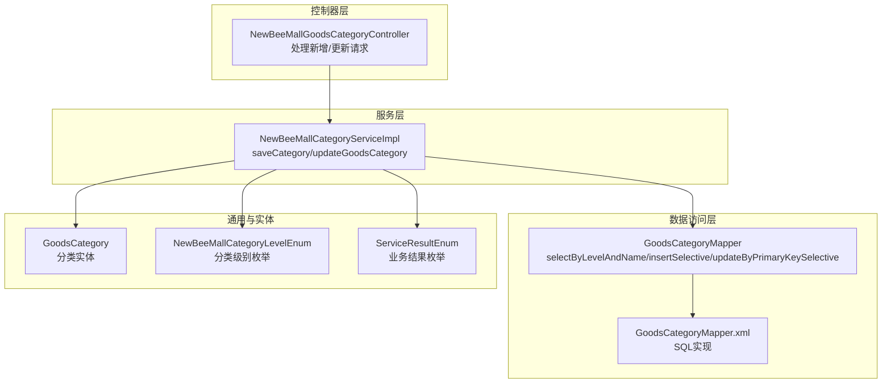
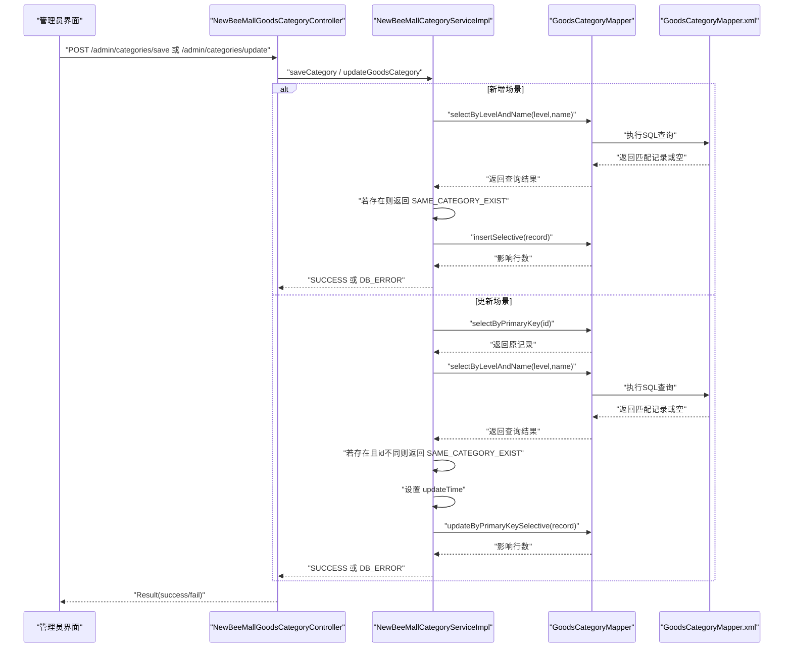
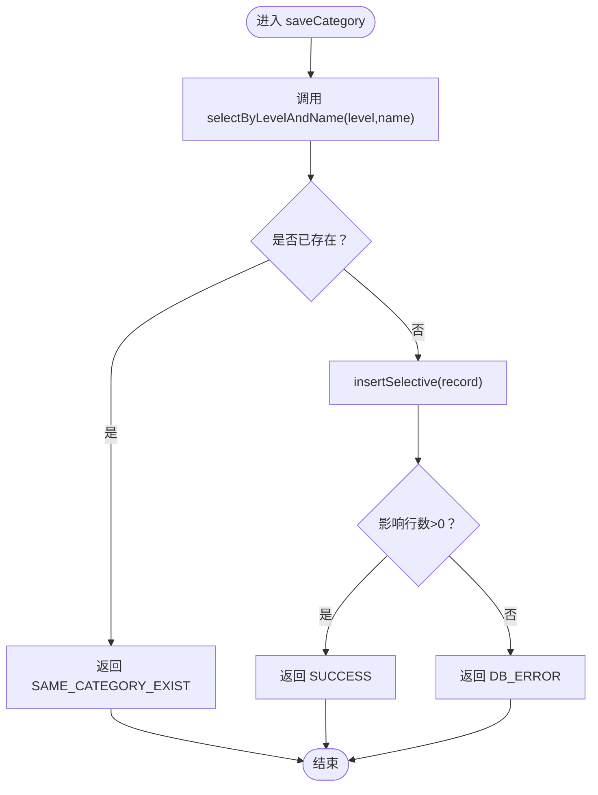
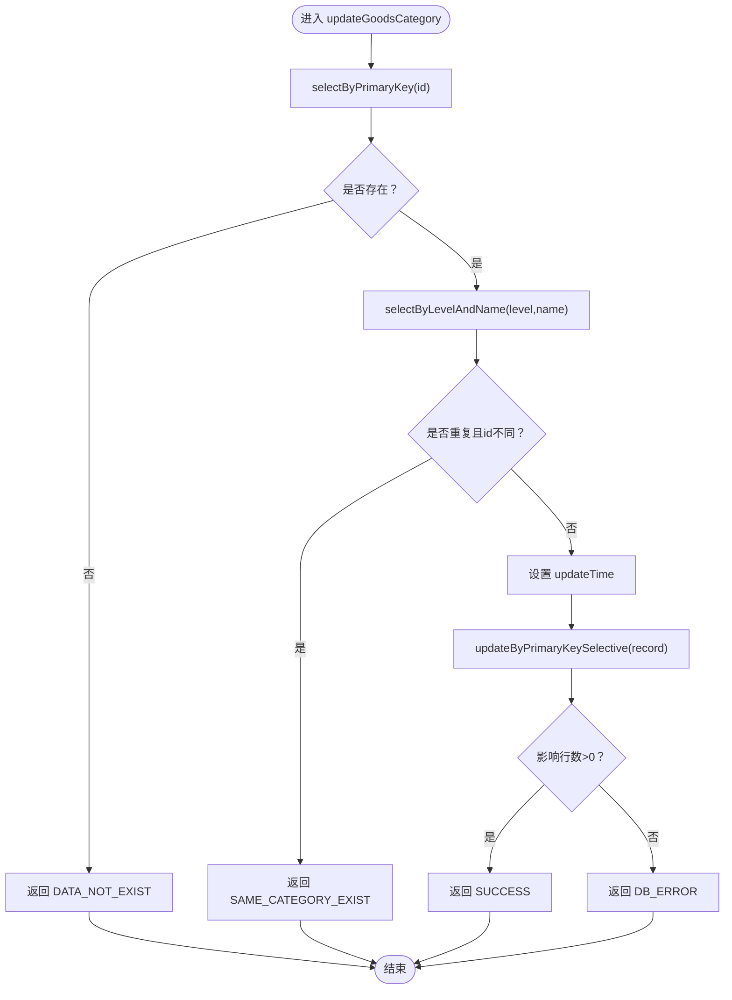
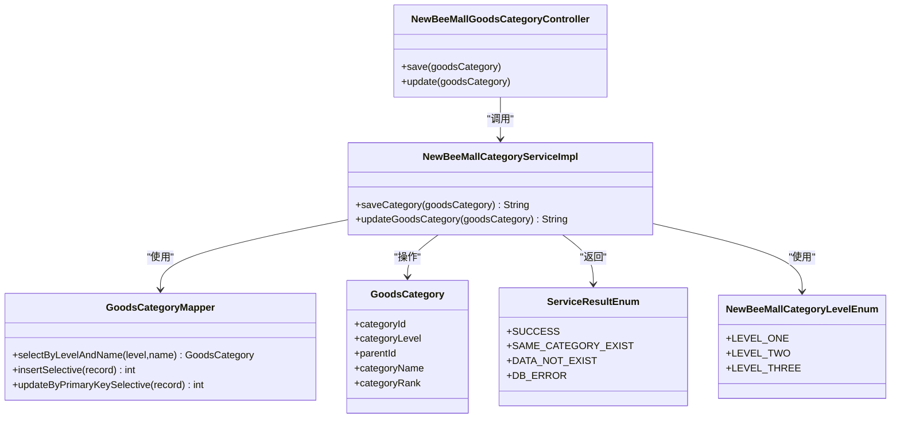

# 应用层校验逻辑

<cite>
**本文引用的文件**
- [NewBeeMallCategoryServiceImpl.java](file://src/main/java/ltd/newbee/mall/service/impl/NewBeeMallCategoryServiceImpl.java)
- [GoodsCategoryMapper.java](file://src/main/java/ltd/newbee/mall/dao/GoodsCategoryMapper.java)
- [GoodsCategoryMapper.xml](file://src/main/resources/mapper/GoodsCategoryMapper.xml)
- [ServiceResultEnum.java](file://src/main/java/ltd/newbee/mall/common/ServiceResultEnum.java)
- [NewBeeMallCategoryLevelEnum.java](file://src/main/java/ltd/newbee/mall/common/NewBeeMallCategoryLevelEnum.java)
- [GoodsCategory.java](file://src/main/java/ltd/newbee/mall/entity/GoodsCategory.java)
- [NewBeeMallGoodsCategoryController.java](file://src/main/java/ltd/newbee/mall/controller/admin/NewBeeMallGoodsCategoryController.java)
</cite>

## 目录
1. [引言](#引言)
2. [项目结构](#项目结构)
3. [核心组件](#核心组件)
4. [架构总览](#架构总览)
5. [详细组件分析](#详细组件分析)
6. [依赖关系分析](#依赖关系分析)
7. [性能考量](#性能考量)
8. [故障排查指南](#故障排查指南)
9. [结论](#结论)

## 引言
本文聚焦于newbee-mall系统中“应用层分类唯一性校验”的实现与设计，重点解析服务层在新增与更新分类前通过selectByLevelAndName进行同级别同名重复检查的业务逻辑，说明为何要在事务提交前进行预校验，以及这种设计如何提升用户体验与系统健壮性。

## 项目结构
围绕分类唯一性校验的相关模块组织如下：
- 控制器层：负责接收请求、参数校验与结果封装
- 服务层：执行业务规则，包括唯一性预校验
- 数据访问层：提供分类查询与持久化能力
- 枚举与实体：定义分类级别、返回结果与数据模型

图表来源
- [NewBeeMallGoodsCategoryController.java](file://src/main/java/ltd/newbee/mall/controller/admin/NewBeeMallGoodsCategoryController.java#L101-L141)
- [NewBeeMallCategoryServiceImpl.java](file://src/main/java/ltd/newbee/mall/service/impl/NewBeeMallCategoryServiceImpl.java#L47-L75)
- [GoodsCategoryMapper.java](file://src/main/java/ltd/newbee/mall/dao/GoodsCategoryMapper.java#L18-L39)
- [GoodsCategoryMapper.xml](file://src/main/resources/mapper/GoodsCategoryMapper.xml#L56-L62)
- [GoodsCategory.java](file://src/main/java/ltd/newbee/mall/entity/GoodsCategory.java#L16-L118)
- [NewBeeMallCategoryLevelEnum.java](file://src/main/java/ltd/newbee/mall/common/NewBeeMallCategoryLevelEnum.java#L18-L59)
- [ServiceResultEnum.java](file://src/main/java/ltd/newbee/mall/common/ServiceResultEnum.java#L17-L40)

章节来源
- [NewBeeMallGoodsCategoryController.java](file://src/main/java/ltd/newbee/mall/controller/admin/NewBeeMallGoodsCategoryController.java#L101-L141)
- [NewBeeMallCategoryServiceImpl.java](file://src/main/java/ltd/newbee/mall/service/impl/NewBeeMallCategoryServiceImpl.java#L47-L75)
- [GoodsCategoryMapper.java](file://src/main/java/ltd/newbee/mall/dao/GoodsCategoryMapper.java#L18-L39)
- [GoodsCategoryMapper.xml](file://src/main/resources/mapper/GoodsCategoryMapper.xml#L56-L62)
- [GoodsCategory.java](file://src/main/java/ltd/newbee/mall/entity/GoodsCategory.java#L16-L118)
- [NewBeeMallCategoryLevelEnum.java](file://src/main/java/ltd/newbee/mall/common/NewBeeMallCategoryLevelEnum.java#L18-L59)
- [ServiceResultEnum.java](file://src/main/java/ltd/newbee/mall/common/ServiceResultEnum.java#L17-L40)

## 核心组件
- 服务实现类：在saveCategory与updateGoodsCategory中分别执行唯一性预校验与更新时间设置
- 数据访问接口与映射：提供按级别与名称查询、插入与选择性更新等能力
- 结果与级别枚举：统一返回值语义与分类层级定义
- 实体类：承载分类字段（级别、父ID、名称、排序等）

章节来源
- [NewBeeMallCategoryServiceImpl.java](file://src/main/java/ltd/newbee/mall/service/impl/NewBeeMallCategoryServiceImpl.java#L47-L75)
- [GoodsCategoryMapper.java](file://src/main/java/ltd/newbee/mall/dao/GoodsCategoryMapper.java#L18-L39)
- [GoodsCategoryMapper.xml](file://src/main/resources/mapper/GoodsCategoryMapper.xml#L56-L62)
- [ServiceResultEnum.java](file://src/main/java/ltd/newbee/mall/common/ServiceResultEnum.java#L17-L40)
- [NewBeeMallCategoryLevelEnum.java](file://src/main/java/ltd/newbee/mall/common/NewBeeMallCategoryLevelEnum.java#L18-L59)
- [GoodsCategory.java](file://src/main/java/ltd/newbee/mall/entity/GoodsCategory.java#L16-L118)

## 架构总览
从控制器到服务再到DAO的调用链路如下：

图表来源
- [NewBeeMallGoodsCategoryController.java](file://src/main/java/ltd/newbee/mall/controller/admin/NewBeeMallGoodsCategoryController.java#L101-L141)
- [NewBeeMallCategoryServiceImpl.java](file://src/main/java/ltd/newbee/mall/service/impl/NewBeeMallCategoryServiceImpl.java#L47-L75)
- [GoodsCategoryMapper.java](file://src/main/java/ltd/newbee/mall/dao/GoodsCategoryMapper.java#L18-L39)
- [GoodsCategoryMapper.xml](file://src/main/resources/mapper/GoodsCategoryMapper.xml#L56-L62)

## 详细组件分析

### 服务层唯一性校验逻辑（saveCategory）
- 预校验策略：在插入前调用selectByLevelAndName(level, name)，仅当同级别同名记录不存在时才允许新增
- 返回值：若重复则返回“已存在同级同名的分类”，否则继续插入并返回成功或数据库错误

图表来源
- [NewBeeMallCategoryServiceImpl.java](file://src/main/java/ltd/newbee/mall/service/impl/NewBeeMallCategoryServiceImpl.java#L47-L57)
- [GoodsCategoryMapper.java](file://src/main/java/ltd/newbee/mall/dao/GoodsCategoryMapper.java#L24-L27)
- [GoodsCategoryMapper.xml](file://src/main/resources/mapper/GoodsCategoryMapper.xml#L56-L62)
- [ServiceResultEnum.java](file://src/main/java/ltd/newbee/mall/common/ServiceResultEnum.java#L17-L40)

章节来源
- [NewBeeMallCategoryServiceImpl.java](file://src/main/java/ltd/newbee/mall/service/impl/NewBeeMallCategoryServiceImpl.java#L47-L57)
- [GoodsCategoryMapper.java](file://src/main/java/ltd/newbee/mall/dao/GoodsCategoryMapper.java#L24-L27)
- [GoodsCategoryMapper.xml](file://src/main/resources/mapper/GoodsCategoryMapper.xml#L56-L62)
- [ServiceResultEnum.java](file://src/main/java/ltd/newbee/mall/common/ServiceResultEnum.java#L17-L40)

### 服务层唯一性校验逻辑（updateGoodsCategory）
- 先查后比：先通过主键查询原始记录；再按级别与名称查询是否存在其他ID的重复项
- 排他条件：只有当查询到的重复记录与当前待更新ID不一致时才判定重复
- 更新时间：命中更新路径时设置更新时间，确保审计字段一致性

图表来源
- [NewBeeMallCategoryServiceImpl.java](file://src/main/java/ltd/newbee/mall/service/impl/NewBeeMallCategoryServiceImpl.java#L59-L75)
- [GoodsCategoryMapper.java](file://src/main/java/ltd/newbee/mall/dao/GoodsCategoryMapper.java#L24-L27)
- [GoodsCategoryMapper.xml](file://src/main/resources/mapper/GoodsCategoryMapper.xml#L56-L62)
- [ServiceResultEnum.java](file://src/main/java/ltd/newbee/mall/common/ServiceResultEnum.java#L17-L40)

章节来源
- [NewBeeMallCategoryServiceImpl.java](file://src/main/java/ltd/newbee/mall/service/impl/NewBeeMallCategoryServiceImpl.java#L59-L75)
- [GoodsCategoryMapper.java](file://src/main/java/ltd/newbee/mall/dao/GoodsCategoryMapper.java#L24-L27)
- [GoodsCategoryMapper.xml](file://src/main/resources/mapper/GoodsCategoryMapper.xml#L56-L62)
- [ServiceResultEnum.java](file://src/main/java/ltd/newbee/mall/common/ServiceResultEnum.java#L17-L40)

### 数据访问层实现要点
- 查询唯一性：selectByLevelAndName按分类名称与级别精确匹配，且只取一条记录，避免重复
- 插入与更新：insertSelective与updateByPrimaryKeySelective支持按需写入字段，减少冗余更新
- 删除策略：采用软删除（标记is_deleted），不影响唯一性约束

章节来源
- [GoodsCategoryMapper.java](file://src/main/java/ltd/newbee/mall/dao/GoodsCategoryMapper.java#L18-L39)
- [GoodsCategoryMapper.xml](file://src/main/resources/mapper/GoodsCategoryMapper.xml#L56-L62)
- [GoodsCategoryMapper.xml](file://src/main/resources/mapper/GoodsCategoryMapper.xml#L78-L88)

### 控制器层对接
- 参数校验：对新增/更新的关键字段进行非空校验
- 结果封装：根据服务层返回字符串与枚举常量判断成功或失败，并返回统一Result

章节来源
- [NewBeeMallGoodsCategoryController.java](file://src/main/java/ltd/newbee/mall/controller/admin/NewBeeMallGoodsCategoryController.java#L101-L141)
- [ServiceResultEnum.java](file://src/main/java/ltd/newbee/mall/common/ServiceResultEnum.java#L17-L40)

## 依赖关系分析
- 服务层依赖数据访问层提供的查询与持久化方法
- 唯一性校验依赖数据库层面的索引与查询条件（级别+名称）
- 控制器层依赖服务层返回的字符串结果与统一枚举

图表来源
- [NewBeeMallGoodsCategoryController.java](file://src/main/java/ltd/newbee/mall/controller/admin/NewBeeMallGoodsCategoryController.java#L101-L141)
- [NewBeeMallCategoryServiceImpl.java](file://src/main/java/ltd/newbee/mall/service/impl/NewBeeMallCategoryServiceImpl.java#L47-L75)
- [GoodsCategoryMapper.java](file://src/main/java/ltd/newbee/mall/dao/GoodsCategoryMapper.java#L18-L39)
- [GoodsCategory.java](file://src/main/java/ltd/newbee/mall/entity/GoodsCategory.java#L16-L118)
- [ServiceResultEnum.java](file://src/main/java/ltd/newbee/mall/common/ServiceResultEnum.java#L17-L40)
- [NewBeeMallCategoryLevelEnum.java](file://src/main/java/ltd/newbee/mall/common/NewBeeMallCategoryLevelEnum.java#L18-L59)

## 性能考量
- 查询复杂度：selectByLevelAndName为O(1)或近似O(1)的等值查询，取决于数据库索引设计
- 事务边界：预校验发生在事务内，避免脏读与并发冲突导致的重复插入
- 优化建议：
  - 确保tb_newbee_mall_goods_category上存在(category_level, category_name)联合索引
  - 在高并发场景下可考虑缓存热点分类名称，降低查询压力
  - 合理设置数据库连接池与超时策略，避免长事务阻塞

[本节为通用性能讨论，无需列出具体文件来源]

## 故障排查指南
- 若返回“已存在同级同名的分类”：
  - 检查输入的分类级别与名称是否正确
  - 确认数据库中是否存在重复记录
  - 如为更新场景，确认被更新记录的ID与重复记录ID是否一致
- 若返回“未查询到记录”：
  - 检查传入的分类ID是否存在
- 若返回“数据库错误”：
  - 检查insertSelective或updateByPrimaryKeySelective的执行情况
  - 关注数据库连接、事务与锁竞争问题

章节来源
- [ServiceResultEnum.java](file://src/main/java/ltd/newbee/mall/common/ServiceResultEnum.java#L17-L40)
- [NewBeeMallCategoryServiceImpl.java](file://src/main/java/ltd/newbee/mall/service/impl/NewBeeMallCategoryServiceImpl.java#L47-L75)
- [GoodsCategoryMapper.java](file://src/main/java/ltd/newbee/mall/dao/GoodsCategoryMapper.java#L18-L39)

## 结论
通过在服务层前置执行selectByLevelAndName进行同级别同名分类的唯一性校验，newbee-mall实现了“在事务提交前发现并阻止重复”的稳健机制。该设计的优势在于：
- 提升用户体验：即时反馈重复错误，避免无效等待与后续异常
- 增强系统健壮性：在应用层拦截重复数据，降低数据库层面的异常传播风险
- 明确职责边界：控制器负责参数与结果封装，服务层负责业务规则与校验，DAO专注数据存取