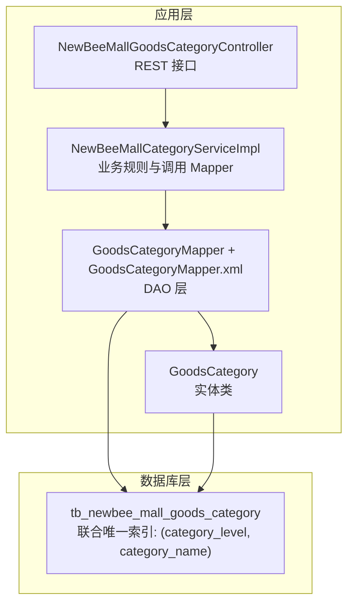
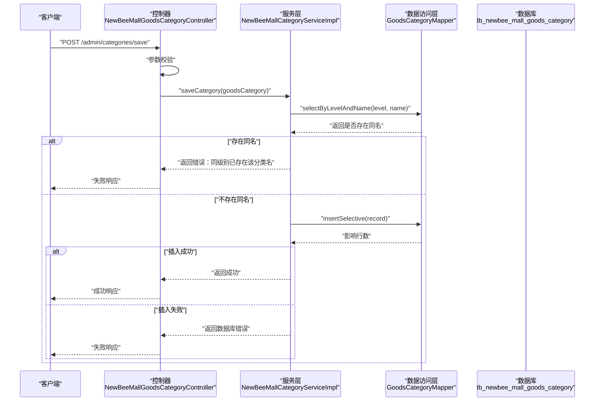
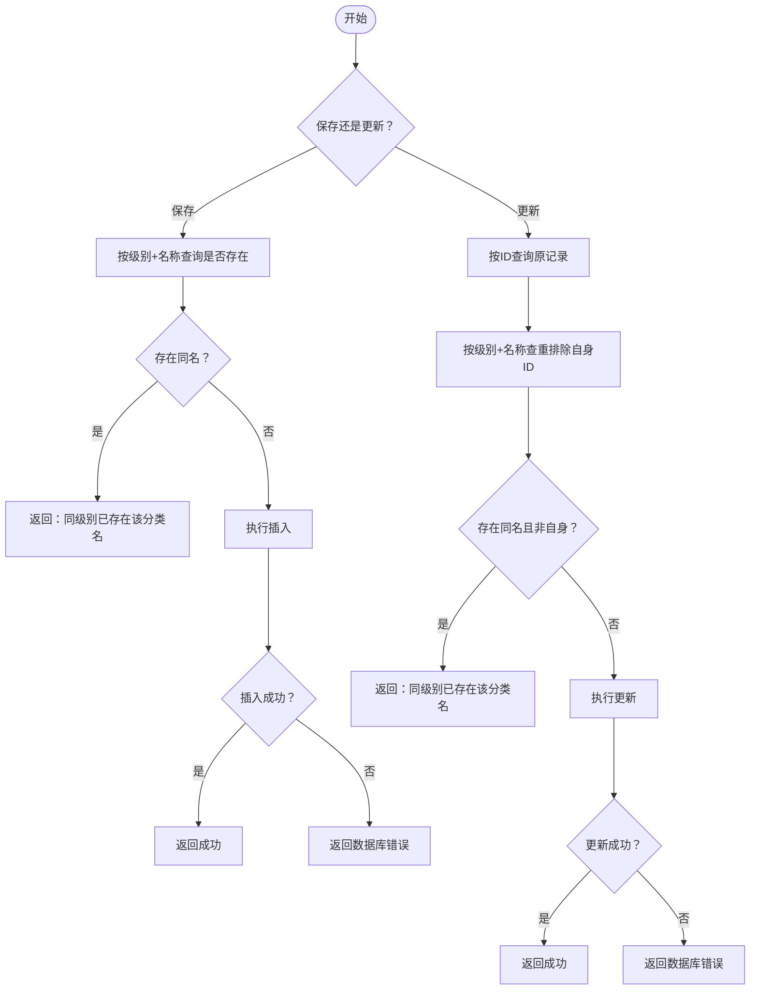
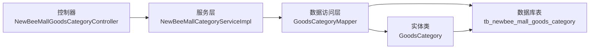

# 数据库层面约束

<cite>
**本文引用的文件**
- [newbee_mall_schema.sql](file://src/main/resources/newbee_mall_schema.sql)
- [GoodsCategory.java](file://src/main/java/ltd/newbee/mall/entity/GoodsCategory.java)
- [GoodsCategoryMapper.java](file://src/main/java/ltd/newbee/mall/dao/GoodsCategoryMapper.java)
- [GoodsCategoryMapper.xml](file://src/main/resources/mapper/GoodsCategoryMapper.xml)
- [NewBeeMallCategoryServiceImpl.java](file://src/main/java/ltd/newbee/mall/service/NewBeeMallCategoryServiceImpl.java)
- [NewBeeMallGoodsCategoryController.java](file://src/main/java/ltd/newbee/mall/controller/admin/NewBeeMallGoodsCategoryController.java)
</cite>

## 目录
1. [引言](#引言)
2. [项目结构](#项目结构)
3. [核心组件](#核心组件)
4. [架构总览](#架构总览)
5. [详细组件分析](#详细组件分析)
6. [依赖分析](#依赖分析)
7. [性能考虑](#性能考虑)
8. [故障排查指南](#故障排查指南)
9. [结论](#结论)

## 引言
本文件聚焦于 newbee-mall 系统中 tb_newbee_mall_goods_category 表的数据库唯一性约束，系统性阐述通过联合唯一索引（category_level, category_name）实现的约束机制，解释其如何在“同一级别分类下”防止同名分类的产生，并分析该约束在高并发场景下的数据一致性保障能力。同时，结合应用层的业务逻辑与数据访问层实现，说明物理约束与应用层协同工作的完整流程。

## 项目结构
围绕分类表的唯一性约束，涉及以下关键文件：
- 数据库脚本：定义表结构与约束
- 实体类：映射 tb_newbee_mall_goods_category 的字段
- 数据访问层：提供按级别与名称查询、插入、更新等能力
- 服务层：封装保存与更新的业务规则，包含应用层唯一性校验
- 控制层：对外暴露新增/修改接口，参数校验与返回结果

图表来源
- [newbee_mall_schema.sql](file://src/main/resources/newbee_mall_schema.sql#L1-L120)
- [GoodsCategory.java](file://src/main/java/ltd/newbee/mall/entity/GoodsCategory.java#L1-L137)
- [GoodsCategoryMapper.java](file://src/main/java/ltd/newbee/mall/dao/GoodsCategoryMapper.java#L1-L39)
- [GoodsCategoryMapper.xml](file://src/main/resources/mapper/GoodsCategoryMapper.xml#L1-L212)
- [NewBeeMallCategoryServiceImpl.java](file://src/main/java/ltd/newbee/mall/service/NewBeeMallCategoryServiceImpl.java#L1-L168)
- [NewBeeMallGoodsCategoryController.java](file://src/main/java/ltd/newbee/mall/controller/admin/NewBeeMallGoodsCategoryController.java#L1-L173)

章节来源
- [newbee_mall_schema.sql](file://src/main/resources/newbee_mall_schema.sql#L1-L120)
- [GoodsCategory.java](file://src/main/java/ltd/newbee/mall/entity/GoodsCategory.java#L1-L137)
- [GoodsCategoryMapper.java](file://src/main/java/ltd/newbee/mall/dao/GoodsCategoryMapper.java#L1-L39)
- [GoodsCategoryMapper.xml](file://src/main/resources/mapper/GoodsCategoryMapper.xml#L1-L212)
- [NewBeeMallCategoryServiceImpl.java](file://src/main/java/ltd/newbee/mall/service/NewBeeMallCategoryServiceImpl.java#L1-L168)
- [NewBeeMallGoodsCategoryController.java](file://src/main/java/ltd/newbee/mall/controller/admin/NewBeeMallGoodsCategoryController.java#L1-L173)

## 核心组件
- 表结构与约束
  - 表：tb_newbee_mall_goods_category
  - 约束：联合唯一索引（category_level, category_name）
  - 作用：在同一级别（category_level）下，禁止出现重复的分类名称（category_name）

- 实体类
  - 字段：categoryId、categoryLevel、parentId、categoryName、categoryRank、isDeleted、createTime、createUser、updateTime、updateUser
  - 用途：Java 层映射数据库字段，参与业务对象组装与持久化

- 数据访问层
  - 查询：按级别与名称查询唯一记录（selectByLevelAndName）
  - 插入/更新：insertSelective、updateByPrimaryKeySelective
  - 辅助：按父级 ID 与级别批量查询（selectByLevelAndParentIdsAndNumber）

- 服务层
  - 保存：先查重（同级别同名），再插入
  - 更新：先查原记录，再查重（排除自身 ID），再更新

- 控制层
  - 参数校验：级别、名称、父级、排序等必填项
  - 返回：成功/失败统一结果封装

章节来源
- [newbee_mall_schema.sql](file://src/main/resources/newbee_mall_schema.sql#L1-L120)
- [GoodsCategory.java](file://src/main/java/ltd/newbee/mall/entity/GoodsCategory.java#L1-L137)
- [GoodsCategoryMapper.java](file://src/main/java/ltd/newbee/mall/dao/GoodsCategoryMapper.java#L1-L39)
- [GoodsCategoryMapper.xml](file://src/main/resources/mapper/GoodsCategoryMapper.xml#L1-L212)
- [NewBeeMallCategoryServiceImpl.java](file://src/main/java/ltd/newbee/mall/service/NewBeeMallCategoryServiceImpl.java#L1-L168)
- [NewBeeMallGoodsCategoryController.java](file://src/main/java/ltd/newbee/mall/controller/admin/NewBeeMallGoodsCategoryController.java#L1-L173)

## 架构总览
数据库唯一性约束与应用层逻辑协同工作，形成“双重保障”：
- 数据库层：联合唯一索引，拒绝违反约束的写入
- 应用层：在写入前进行业务校验，提升用户体验并减少无效写入

图表来源
- [NewBeeMallGoodsCategoryController.java](file://src/main/java/ltd/newbee/mall/controller/admin/NewBeeMallGoodsCategoryController.java#L100-L141)
- [NewBeeMallCategoryServiceImpl.java](file://src/main/java/ltd/newbee/mall/service/NewBeeMallCategoryServiceImpl.java#L47-L75)
- [GoodsCategoryMapper.java](file://src/main/java/ltd/newbee/mall/dao/GoodsCategoryMapper.java#L24-L39)
- [GoodsCategoryMapper.xml](file://src/main/resources/mapper/GoodsCategoryMapper.xml#L56-L62)

## 详细组件分析

### 表结构与联合唯一索引
- 表：tb_newbee_mall_goods_category
- 约束：联合唯一索引（category_level, category_name）
- 语义：在同一级别（category_level）下，category_name 必须唯一
- 作用范围：避免“同一级别下出现重复分类名”的数据脏状态

章节来源
- [newbee_mall_schema.sql](file://src/main/resources/newbee_mall_schema.sql#L1-L120)

### 实体类映射
- 字段覆盖：categoryLevel、parentId、categoryName、categoryRank、isDeleted、createTime、createUser、updateTime、updateUser 等
- 用途：作为 Java 对象承载数据库记录，参与业务对象组装与持久化

章节来源
- [GoodsCategory.java](file://src/main/java/ltd/newbee/mall/entity/GoodsCategory.java#L1-L137)

### 数据访问层（Mapper 与 XML）
- 查询接口：selectByLevelAndName(level, name)
  - 作用：按级别与名称查询唯一记录，用于应用层的同名校验
- 插入接口：insertSelective(record)
  - 作用：按需插入非空字段，避免覆盖默认值
- 更新接口：updateByPrimaryKeySelective(record)
  - 作用：按需更新非空字段，支持并发更新场景

章节来源
- [GoodsCategoryMapper.java](file://src/main/java/ltd/newbee/mall/dao/GoodsCategoryMapper.java#L1-L39)
- [GoodsCategoryMapper.xml](file://src/main/resources/mapper/GoodsCategoryMapper.xml#L56-L62)
- [GoodsCategoryMapper.xml](file://src/main/resources/mapper/GoodsCategoryMapper.xml#L99-L165)
- [GoodsCategoryMapper.xml](file://src/main/resources/mapper/GoodsCategoryMapper.xml#L166-L211)

### 服务层业务规则
- 保存流程
  - 先查重：selectByLevelAndName(level, name)，若存在则返回“同级别已存在该分类名”
  - 再插入：insertSelective(record)，成功返回成功，否则返回数据库错误
- 更新流程
  - 先查询原记录：selectByPrimaryKey(id)
  - 再查重：selectByLevelAndName(level, name)，若存在且 ID 不同则返回冲突
  - 最后更新：updateByPrimaryKeySelective(record)

图表来源
- [NewBeeMallCategoryServiceImpl.java](file://src/main/java/ltd/newbee/mall/service/NewBeeMallCategoryServiceImpl.java#L47-L75)
- [GoodsCategoryMapper.java](file://src/main/java/ltd/newbee/mall/dao/GoodsCategoryMapper.java#L24-L39)
- [GoodsCategoryMapper.xml](file://src/main/resources/mapper/GoodsCategoryMapper.xml#L56-L62)
- [GoodsCategoryMapper.xml](file://src/main/resources/mapper/GoodsCategoryMapper.xml#L166-L211)

章节来源
- [NewBeeMallCategoryServiceImpl.java](file://src/main/java/ltd/newbee/mall/service/NewBeeMallCategoryServiceImpl.java#L1-L168)
- [GoodsCategoryMapper.java](file://src/main/java/ltd/newbee/mall/dao/GoodsCategoryMapper.java#L1-L39)
- [GoodsCategoryMapper.xml](file://src/main/resources/mapper/GoodsCategoryMapper.xml#L1-L212)

### 控制层接口与参数校验
- 新增接口：/admin/categories/save
  - 参数：categoryLevel、categoryName、parentId、categoryRank 等
  - 校验：必填项缺失直接返回参数异常
- 修改接口：/admin/categories/update
  - 参数：categoryId、categoryLevel、categoryName、parentId、categoryRank 等
  - 校验：必填项缺失直接返回参数异常

章节来源
- [NewBeeMallGoodsCategoryController.java](file://src/main/java/ltd/newbee/mall/controller/admin/NewBeeMallGoodsCategoryController.java#L100-L141)

## 依赖分析
- 控制层依赖服务层
- 服务层依赖数据访问层
- 数据访问层依赖数据库表结构与约束
- 实体类作为数据载体贯穿各层

图表来源
- [NewBeeMallGoodsCategoryController.java](file://src/main/java/ltd/newbee/mall/controller/admin/NewBeeMallGoodsCategoryController.java#L1-L173)
- [NewBeeMallCategoryServiceImpl.java](file://src/main/java/ltd/newbee/mall/service/NewBeeMallCategoryServiceImpl.java#L1-L168)
- [GoodsCategoryMapper.java](file://src/main/java/ltd/newbee/mall/dao/GoodsCategoryMapper.java#L1-L39)
- [GoodsCategory.java](file://src/main/java/ltd/newbee/mall/entity/GoodsCategory.java#L1-L137)
- [newbee_mall_schema.sql](file://src/main/resources/newbee_mall_schema.sql#L1-L120)

章节来源
- [NewBeeMallGoodsCategoryController.java](file://src/main/java/ltd/newbee/mall/controller/admin/NewBeeMallGoodsCategoryController.java#L1-L173)
- [NewBeeMallCategoryServiceImpl.java](file://src/main/java/ltd/newbee/mall/service/NewBeeMallCategoryServiceImpl.java#L1-L168)
- [GoodsCategoryMapper.java](file://src/main/java/ltd/newbee/mall/dao/GoodsCategoryMapper.java#L1-L39)
- [GoodsCategory.java](file://src/main/java/ltd/newbee/mall/entity/GoodsCategory.java#L1-L137)
- [newbee_mall_schema.sql](file://src/main/resources/newbee_mall_schema.sql#L1-L120)

## 性能考虑
- 查询路径
  - 同名校验使用 selectByLevelAndName(level, name)，建议确保该查询命中联合索引（category_level, category_name），以降低扫描成本
- 插入/更新
  - insertSelective 与 updateByPrimaryKeySelective 仅更新非空字段，减少不必要的列写入
- 并发场景
  - 应用层在写入前进行同名校验，可显著降低数据库层唯一约束冲突的概率
  - 若并发极高，数据库层的唯一约束仍能兜底，避免脏数据写入

[本节为通用指导，无需列出具体文件来源]

## 故障排查指南
- 现象：保存/更新接口返回“同级别已存在该分类名”
  - 排查：确认 category_level 与 category_name 是否已在同级别下存在
  - 处理：修改分类名称或调整级别
- 现象：保存接口返回参数异常
  - 排查：检查请求体中 categoryLevel、categoryName、parentId、categoryRank 是否为空
  - 处理：补齐必填参数
- 现象：数据库层唯一约束冲突（例如插入时报唯一键冲突）
  - 排查：确认应用层是否遗漏了同名校验或并发竞争导致的竞态
  - 处理：在应用层增加幂等校验与重试策略，或在接口层捕获并友好提示

章节来源
- [NewBeeMallCategoryServiceImpl.java](file://src/main/java/ltd/newbee/mall/service/NewBeeMallCategoryServiceImpl.java#L47-L75)
- [NewBeeMallGoodsCategoryController.java](file://src/main/java/ltd/newbee/mall/controller/admin/NewBeeMallGoodsCategoryController.java#L100-L141)

## 结论
- 联合唯一索引（category_level, category_name）在数据库层确保“同一级别下分类名唯一”，是系统数据一致性的关键防线
- 应用层在保存/更新前进行同名校验，形成“应用层+数据库层”的双重约束，既提升用户体验，又降低数据库冲突概率
- 在高并发场景下，二者协同工作，既能通过应用层校验减少冲突，也能依靠数据库约束兜底，保障数据完整性