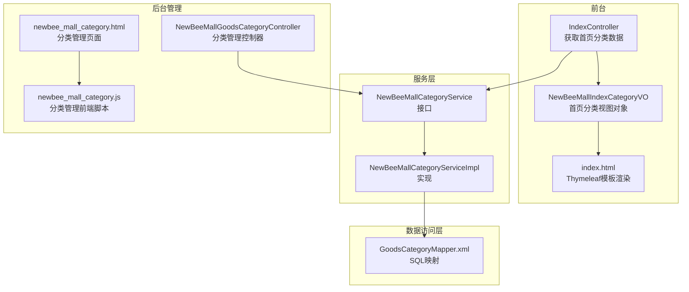
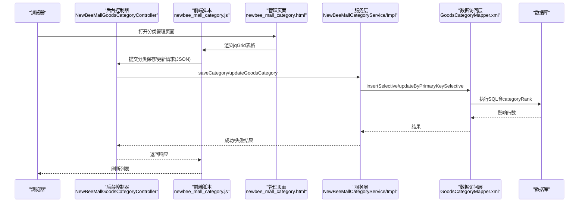
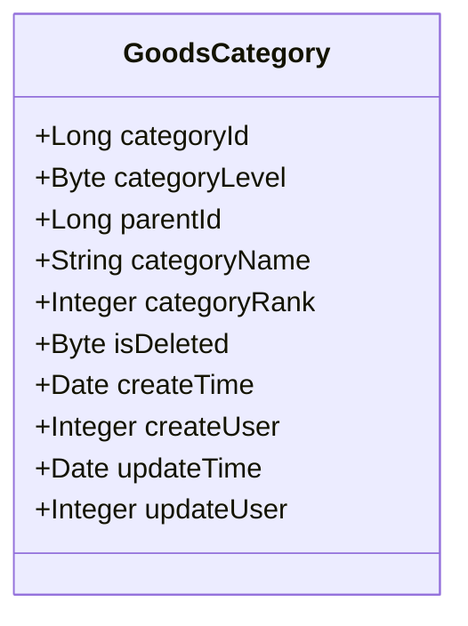
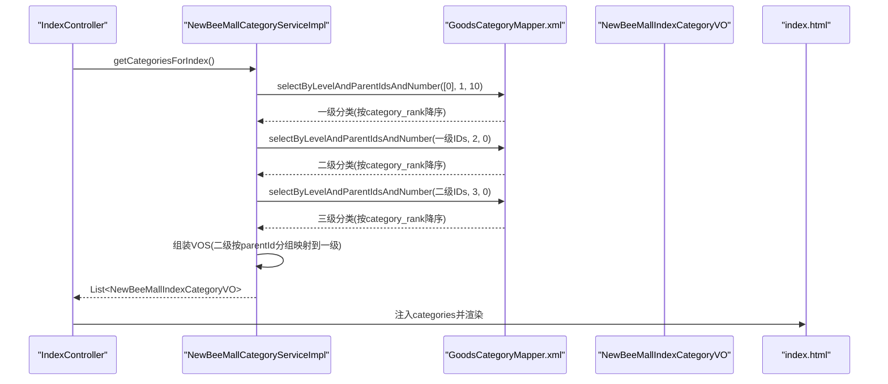
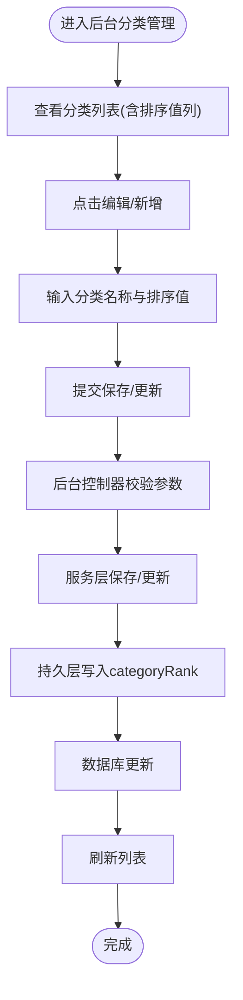
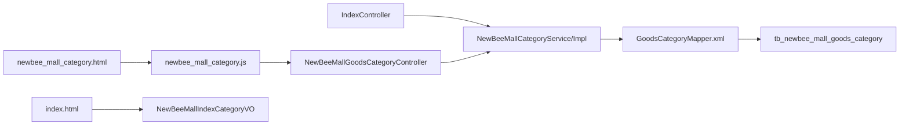

# 排序机制

<cite>
**本文引用的文件**
- [GoodsCategory.java](file://src/main/java/ltd/newbee/mall/entity/GoodsCategory.java)
- [NewBeeMallCategoryService.java](file://src/main/java/ltd/newbee/mall/service/NewBeeMallCategoryService.java)
- [NewBeeMallCategoryServiceImpl.java](file://src/main/java/ltd/newbee/mall/service/impl/NewBeeMallCategoryServiceImpl.java)
- [GoodsCategoryMapper.xml](file://src/main/resources/mapper/GoodsCategoryMapper.xml)
- [IndexController.java](file://src/main/java/ltd/newbee/mall/controller/mall/IndexController.java)
- [NewBeeMallGoodsCategoryController.java](file://src/main/java/ltd/newbee/mall/controller/admin/NewBeeMallGoodsCategoryController.java)
- [Constants.java](file://src/main/java/ltd/newbee/mall/common/Constants.java)
- [NewBeeMallCategoryLevelEnum.java](file://src/main/java/ltd/newbee/mall/common/NewBeeMallCategoryLevelEnum.java)
- [NewBeeMallIndexCategoryVO.java](file://src/main/java/ltd/newbee/mall/controller/vo/NewBeeMallIndexCategoryVO.java)
- [newbee_mall_category.html](file://src/main/resources/templates/admin/newbee_mall_category.html)
- [newbee_mall_category.js](file://src/main/resources/static/admin/dist/js/newbee_mall_category.js)
- [index.html](file://src/main/resources/templates/mall/index.html)
</cite>

## 目录
1. [简介](#简介)
2. [项目结构](#项目结构)
3. [核心组件](#核心组件)
4. [架构总览](#架构总览)
5. [详细组件分析](#详细组件分析)
6. [依赖关系分析](#依赖关系分析)
7. [性能考量](#性能考量)
8. [故障排查指南](#故障排查指南)
9. [结论](#结论)

## 简介
本文件聚焦于newbee-mall系统中“商品分类排序”的实现与使用，重点解释category_rank字段的作用、使用场景及其对前台首页分类展示与后台管理界面排序的影响。通过对服务层、持久层、控制层及前后端模板的综合分析，阐明getCategoriesForIndex方法如何利用category_rank对一级分类进行排序展示，并给出管理员在后台设置排序值的最佳实践建议。

## 项目结构
围绕分类排序的关键文件分布如下：
- 实体与枚举：GoodsCategory、NewBeeMallCategoryLevelEnum
- 服务接口与实现：NewBeeMallCategoryService、NewBeeMallCategoryServiceImpl
- 数据访问层：GoodsCategoryMapper.xml
- 控制层：IndexController（前台）、NewBeeMallGoodsCategoryController（后台）
- 前端模板与脚本：newbee_mall_category.html、newbee_mall_category.js、index.html
- 常量：Constants（包含首页一级分类最大数量等）

图表来源
- [IndexController.java](file://src/main/java/ltd/newbee/mall/controller/mall/IndexController.java#L31-L57)
- [NewBeeMallCategoryService.java](file://src/main/java/ltd/newbee/mall/service/NewBeeMallCategoryService.java#L19-L60)
- [NewBeeMallCategoryServiceImpl.java](file://src/main/java/ltd/newbee/mall/service/impl/NewBeeMallCategoryServiceImpl.java#L91-L167)
- [GoodsCategoryMapper.xml](file://src/main/resources/mapper/GoodsCategoryMapper.xml#L30-L77)
- [NewBeeMallGoodsCategoryController.java](file://src/main/java/ltd/newbee/mall/controller/admin/NewBeeMallGoodsCategoryController.java#L42-L173)
- [newbee_mall_category.html](file://src/main/resources/templates/admin/newbee_mall_category.html#L53-L101)
- [newbee_mall_category.js](file://src/main/resources/static/admin/dist/js/newbee_mall_category.js#L1-L225)
- [index.html](file://src/main/resources/templates/mall/index.html#L10-L33)

章节来源
- [IndexController.java](file://src/main/java/ltd/newbee/mall/controller/mall/IndexController.java#L31-L57)
- [NewBeeMallCategoryService.java](file://src/main/java/ltd/newbee/mall/service/NewBeeMallCategoryService.java#L19-L60)
- [NewBeeMallCategoryServiceImpl.java](file://src/main/java/ltd/newbee/mall/service/impl/NewBeeMallCategoryServiceImpl.java#L91-L167)
- [GoodsCategoryMapper.xml](file://src/main/resources/mapper/GoodsCategoryMapper.xml#L30-L77)
- [NewBeeMallGoodsCategoryController.java](file://src/main/java/ltd/newbee/mall/controller/admin/NewBeeMallGoodsCategoryController.java#L42-L173)
- [newbee_mall_category.html](file://src/main/resources/templates/admin/newbee_mall_category.html#L53-L101)
- [newbee_mall_category.js](file://src/main/resources/static/admin/dist/js/newbee_mall_category.js#L1-L225)
- [index.html](file://src/main/resources/templates/mall/index.html#L10-L33)

## 核心组件
- GoodsCategory实体：包含category_rank字段，用于表示分类的排序权重。
- NewBeeMallCategoryLevelEnum：定义分类层级（一级、二级、三级）。
- NewBeeMallCategoryService：定义分类相关服务接口，包括getCategoriesForIndex。
- NewBeeMallCategoryServiceImpl：实现getCategoriesForIndex，按层级组装首页分类树并利用category_rank排序。
- GoodsCategoryMapper.xml：定义按层级与父节点查询分类的SQL，并以category_rank降序排列。
- IndexController：调用服务获取首页分类数据并渲染模板。
- NewBeeMallGoodsCategoryController：后台管理控制器，提供分类的增删改查与排序值设置。
- newbee_mall_category.html与newbee_mall_category.js：后台分类管理页面与前端交互脚本，支持排序值输入与提交。
- index.html：前台首页模板，遍历categories渲染导航菜单。

章节来源
- [GoodsCategory.java](file://src/main/java/ltd/newbee/mall/entity/GoodsCategory.java#L13-L137)
- [NewBeeMallCategoryLevelEnum.java](file://src/main/java/ltd/newbee/mall/common/NewBeeMallCategoryLevelEnum.java#L18-L59)
- [NewBeeMallCategoryService.java](file://src/main/java/ltd/newbee/mall/service/NewBeeMallCategoryService.java#L19-L60)
- [NewBeeMallCategoryServiceImpl.java](file://src/main/java/ltd/newbee/mall/service/impl/NewBeeMallCategoryServiceImpl.java#L91-L167)
- [GoodsCategoryMapper.xml](file://src/main/resources/mapper/GoodsCategoryMapper.xml#L30-L77)
- [IndexController.java](file://src/main/java/ltd/newbee/mall/controller/mall/IndexController.java#L31-L57)
- [NewBeeMallGoodsCategoryController.java](file://src/main/java/ltd/newbee/mall/controller/admin/NewBeeMallGoodsCategoryController.java#L42-L173)
- [newbee_mall_category.html](file://src/main/resources/templates/admin/newbee_mall_category.html#L53-L101)
- [newbee_mall_category.js](file://src/main/resources/static/admin/dist/js/newbee_mall_category.js#L1-L225)
- [index.html](file://src/main/resources/templates/mall/index.html#L10-L33)

## 架构总览
前台首页分类展示流程：
- IndexController调用NewBeeMallCategoryService.getCategoriesForIndex获取首页分类树。
- 服务层先查询一级分类（限制数量），再查询对应二级、三级分类，按层级组装NewBeeMallIndexCategoryVO。
- 数据库侧通过selectByLevelAndParentIdsAndNumber按parent_id与level过滤，并以category_rank降序排序，同时可限制返回数量。

后台管理排序流程：
- 后台页面newbee_mall_category.html展示分类列表，列含“排序值”。
- newbee_mall_category.js收集用户输入的categoryRank，提交到后台NewBeeMallGoodsCategoryController.save或update。
- 控制器调用服务层持久化categoryRank，最终由GoodsCategoryMapper.xml执行更新。

图表来源
- [NewBeeMallGoodsCategoryController.java](file://src/main/java/ltd/newbee/mall/controller/admin/NewBeeMallGoodsCategoryController.java#L104-L141)
- [newbee_mall_category.js](file://src/main/resources/static/admin/dist/js/newbee_mall_category.js#L100-L158)
- [GoodsCategoryMapper.xml](file://src/main/resources/mapper/GoodsCategoryMapper.xml#L133-L211)
- [NewBeeMallCategoryService.java](file://src/main/java/ltd/newbee/mall/service/NewBeeMallCategoryService.java#L26-L35)

章节来源
- [NewBeeMallGoodsCategoryController.java](file://src/main/java/ltd/newbee/mall/controller/admin/NewBeeMallGoodsCategoryController.java#L104-L141)
- [newbee_mall_category.js](file://src/main/resources/static/admin/dist/js/newbee_mall_category.js#L100-L158)
- [GoodsCategoryMapper.xml](file://src/main/resources/mapper/GoodsCategoryMapper.xml#L133-L211)
- [NewBeeMallCategoryService.java](file://src/main/java/ltd/newbee/mall/service/NewBeeMallCategoryService.java#L26-L35)

## 详细组件分析

### category_rank字段的作用与数据模型
- 字段位置：GoodsCategory实体包含categoryRank属性，用于标识分类的排序权重。
- 字段用途：决定分类在数据库查询与页面渲染中的先后顺序。
- 字段持久化：GoodsCategoryMapper.xml的insertSelective与updateByPrimaryKeySelective均包含categoryRank字段，确保新增与更新时保存排序值。

图表来源
- [GoodsCategory.java](file://src/main/java/ltd/newbee/mall/entity/GoodsCategory.java#L13-L137)
- [GoodsCategoryMapper.xml](file://src/main/resources/mapper/GoodsCategoryMapper.xml#L133-L211)

章节来源
- [GoodsCategory.java](file://src/main/java/ltd/newbee/mall/entity/GoodsCategory.java#L13-L137)
- [GoodsCategoryMapper.xml](file://src/main/resources/mapper/GoodsCategoryMapper.xml#L133-L211)

### 前台首页分类展示：getCategoriesForIndex如何利用category_rank
- 获取一级分类：服务层调用selectByLevelAndParentIdsAndNumber，传入parentIds=[0]、level=1、number=10（常量），并以category_rank降序排序。
- 获取二级/三级分类：基于一级分类ID集合查询二级分类；再基于二级分类ID集合查询三级分类，并按parentId分组。
- 组装视图对象：将二级分类列表按parentId分组映射到一级分类的secondLevelCategoryVOS，形成首页分类树。
- 渲染模板：IndexController将categories注入模板，index.html通过Thymeleaf遍历categories，展示导航菜单。

图表来源
- [IndexController.java](file://src/main/java/ltd/newbee/mall/controller/mall/IndexController.java#L31-L57)
- [NewBeeMallCategoryServiceImpl.java](file://src/main/java/ltd/newbee/mall/service/impl/NewBeeMallCategoryServiceImpl.java#L91-L167)
- [GoodsCategoryMapper.xml](file://src/main/resources/mapper/GoodsCategoryMapper.xml#L63-L77)
- [Constants.java](file://src/main/java/ltd/newbee/mall/common/Constants.java#L22-L31)
- [NewBeeMallCategoryLevelEnum.java](file://src/main/java/ltd/newbee/mall/common/NewBeeMallCategoryLevelEnum.java#L18-L59)
- [NewBeeMallIndexCategoryVO.java](file://src/main/java/ltd/newbee/mall/controller/vo/NewBeeMallIndexCategoryVO.java#L17-L59)
- [index.html](file://src/main/resources/templates/mall/index.html#L10-L33)

章节来源
- [NewBeeMallCategoryServiceImpl.java](file://src/main/java/ltd/newbee/mall/service/impl/NewBeeMallCategoryServiceImpl.java#L91-L167)
- [GoodsCategoryMapper.xml](file://src/main/resources/mapper/GoodsCategoryMapper.xml#L63-L77)
- [Constants.java](file://src/main/java/ltd/newbee/mall/common/Constants.java#L22-L31)
- [NewBeeMallCategoryLevelEnum.java](file://src/main/java/ltd/newbee/mall/common/NewBeeMallCategoryLevelEnum.java#L18-L59)
- [NewBeeMallIndexCategoryVO.java](file://src/main/java/ltd/newbee/mall/controller/vo/NewBeeMallIndexCategoryVO.java#L17-L59)
- [index.html](file://src/main/resources/templates/mall/index.html#L10-L33)

### 后台管理界面：分类列表的排序逻辑
- 页面列定义：newbee_mall_category.html中jqGrid列包含“排序值”，对应categoryRank字段。
- 前端交互：newbee_mall_category.js在保存/更新时收集categoryRank并提交到后台控制器。
- 控制器校验：NewBeeMallGoodsCategoryController.save/update要求categoryRank非空，确保排序值被正确设置。
- 数据持久化：GoodsCategoryMapper.xml的insertSelective/updateByPrimaryKeySelective将categoryRank写入数据库。

图表来源
- [newbee_mall_category.html](file://src/main/resources/templates/admin/newbee_mall_category.html#L53-L101)
- [newbee_mall_category.js](file://src/main/resources/static/admin/dist/js/newbee_mall_category.js#L100-L158)
- [NewBeeMallGoodsCategoryController.java](file://src/main/java/ltd/newbee/mall/controller/admin/NewBeeMallGoodsCategoryController.java#L104-L141)
- [GoodsCategoryMapper.xml](file://src/main/resources/mapper/GoodsCategoryMapper.xml#L133-L211)

章节来源
- [newbee_mall_category.html](file://src/main/resources/templates/admin/newbee_mall_category.html#L53-L101)
- [newbee_mall_category.js](file://src/main/resources/static/admin/dist/js/newbee_mall_category.js#L100-L158)
- [NewBeeMallGoodsCategoryController.java](file://src/main/java/ltd/newbee/mall/controller/admin/NewBeeMallGoodsCategoryController.java#L104-L141)
- [GoodsCategoryMapper.xml](file://src/main/resources/mapper/GoodsCategoryMapper.xml#L133-L211)

### 数据库查询与排序规则
- 查询一级分类：selectByLevelAndParentIdsAndNumber(parentIds=[0], level=1, number=10)，按category_rank降序，限制返回数量。
- 查询二级/三级分类：selectByLevelAndParentIdsAndNumber(parentIds=子级IDs, level=2/3, number=0)，按category_rank降序，不限制数量。
- 公共排序：findGoodsCategoryList也按category_rank降序，配合分页使用。

章节来源
- [GoodsCategoryMapper.xml](file://src/main/resources/mapper/GoodsCategoryMapper.xml#L30-L77)

### 常量与层级定义
- 常量INDEX_CATEGORY_NUMBER=10：限制首页一级分类展示数量。
- 分类层级枚举：LEVEL_ONE=1、LEVEL_TWO=2、LEVEL_THREE=3。

章节来源
- [Constants.java](file://src/main/java/ltd/newbee/mall/common/Constants.java#L22-L31)
- [NewBeeMallCategoryLevelEnum.java](file://src/main/java/ltd/newbee/mall/common/NewBeeMallCategoryLevelEnum.java#L18-L59)

## 依赖关系分析
- IndexController依赖NewBeeMallCategoryService获取首页分类数据。
- NewBeeMallCategoryServiceImpl依赖GoodsCategoryMapper执行数据库查询与组装。
- GoodsCategoryMapper.xml依赖数据库表tb_newbee_mall_goods_category，字段包含category_rank。
- 后台管理页面newbee_mall_category.html与newbee_mall_category.js依赖控制器NewBeeMallGoodsCategoryController进行分类维护。
- 前台index.html依赖NewBeeMallIndexCategoryVO渲染导航菜单。

图表来源
- [IndexController.java](file://src/main/java/ltd/newbee/mall/controller/mall/IndexController.java#L31-L57)
- [NewBeeMallCategoryServiceImpl.java](file://src/main/java/ltd/newbee/mall/service/impl/NewBeeMallCategoryServiceImpl.java#L91-L167)
- [GoodsCategoryMapper.xml](file://src/main/resources/mapper/GoodsCategoryMapper.xml#L30-L77)
- [NewBeeMallGoodsCategoryController.java](file://src/main/java/ltd/newbee/mall/controller/admin/NewBeeMallGoodsCategoryController.java#L42-L173)
- [newbee_mall_category.html](file://src/main/resources/templates/admin/newbee_mall_category.html#L53-L101)
- [newbee_mall_category.js](file://src/main/resources/static/admin/dist/js/newbee_mall_category.js#L1-L225)
- [index.html](file://src/main/resources/templates/mall/index.html#L10-L33)
- [NewBeeMallIndexCategoryVO.java](file://src/main/java/ltd/newbee/mall/controller/vo/NewBeeMallIndexCategoryVO.java#L17-L59)

章节来源
- [IndexController.java](file://src/main/java/ltd/newbee/mall/controller/mall/IndexController.java#L31-L57)
- [NewBeeMallCategoryServiceImpl.java](file://src/main/java/ltd/newbee/mall/service/impl/NewBeeMallCategoryServiceImpl.java#L91-L167)
- [GoodsCategoryMapper.xml](file://src/main/resources/mapper/GoodsCategoryMapper.xml#L30-L77)
- [NewBeeMallGoodsCategoryController.java](file://src/main/java/ltd/newbee/mall/controller/admin/NewBeeMallGoodsCategoryController.java#L42-L173)
- [newbee_mall_category.html](file://src/main/resources/templates/admin/newbee_mall_category.html#L53-L101)
- [newbee_mall_category.js](file://src/main/resources/static/admin/dist/js/newbee_mall_category.js#L1-L225)
- [index.html](file://src/main/resources/templates/mall/index.html#L10-L33)
- [NewBeeMallIndexCategoryVO.java](file://src/main/java/ltd/newbee/mall/controller/vo/NewBeeMallIndexCategoryVO.java#L17-L59)

## 性能考量
- 数据库排序：selectByLevelAndParentIdsAndNumber与findGoodsCategoryList均以category_rank降序，避免应用层二次排序，减少CPU消耗。
- 数量限制：首页仅取一级分类前10个（INDEX_CATEGORY_NUMBER=10），降低渲染与网络传输压力。
- 分组与映射：服务层使用Stream分组与复制映射，复杂度与分类数量线性相关，建议控制分类规模与层级深度。
- 建议：为category_rank建立索引可进一步提升排序查询性能（需结合实际数据库与监控指标评估）。

## 故障排查指南
- 前台分类为空：IndexController在categories为空时抛出异常，检查后台是否正确设置categoryRank并保存分类。
- 排序无效：确认数据库中categoryRank字段已更新，且查询SQL按category_rank降序执行。
- 后台无法保存：检查newbee_mall_category.js是否正确收集categoryRank，NewBeeMallGoodsCategoryController.save/update是否校验categoryRank非空。
- 展示数量不符：确认Constants中的INDEX_CATEGORY_NUMBER与业务需求一致，以及Mapper中number参数是否正确传递。

章节来源
- [IndexController.java](file://src/main/java/ltd/newbee/mall/controller/mall/IndexController.java#L31-L57)
- [NewBeeMallGoodsCategoryController.java](file://src/main/java/ltd/newbee/mall/controller/admin/NewBeeMallGoodsCategoryController.java#L104-L141)
- [newbee_mall_category.js](file://src/main/resources/static/admin/dist/js/newbee_mall_category.js#L100-L158)
- [GoodsCategoryMapper.xml](file://src/main/resources/mapper/GoodsCategoryMapper.xml#L30-L77)
- [Constants.java](file://src/main/java/ltd/newbee/mall/common/Constants.java#L22-L31)

## 结论
- category_rank是newbee-mall系统中商品分类排序的核心字段，贯穿数据库查询、服务层组装与前台模板渲染全过程。
- 前台首页通过getCategoriesForIndex按层级组装分类树，并以category_rank降序展示，首页一级分类数量由常量控制。
- 后台管理通过页面列与前端脚本直接设置categoryRank，控制器与持久层保证排序值的正确保存。
- 管理员应遵循“数值越大越靠前”的原则设置排序值，并结合业务重要性与流量分配合理分配数值，避免出现大量相同值导致排序不稳定。