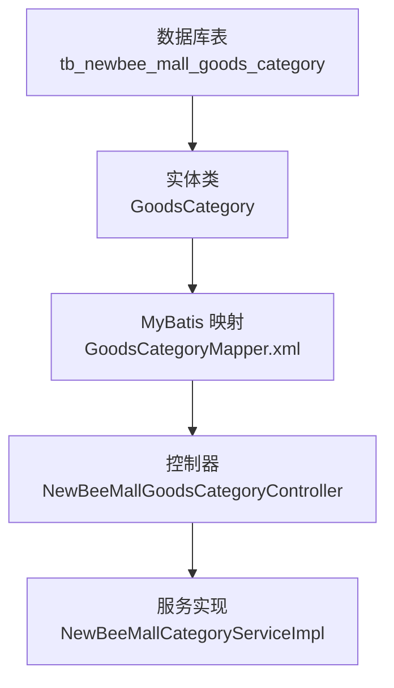
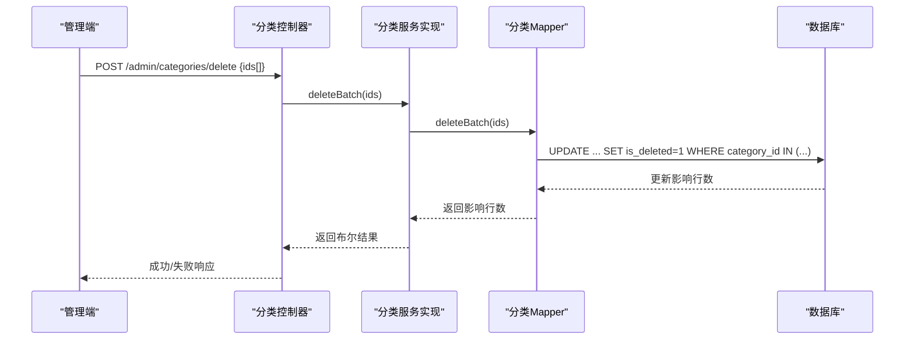
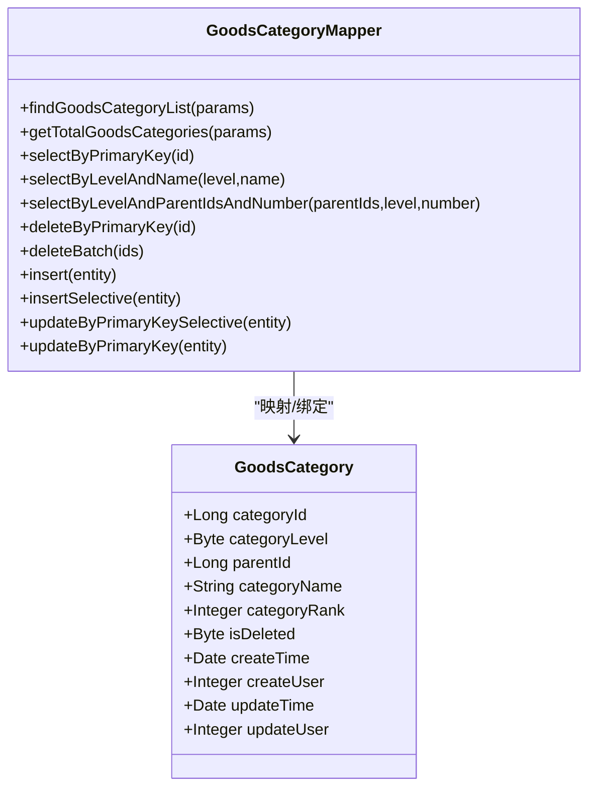
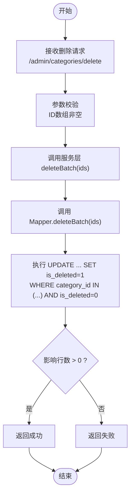

# is_deleted字段定义

<cite>
**本文引用的文件**
- [newbee_mall_schema.sql](file://src/main/resources/newbee_mall_schema.sql)
- [GoodsCategory.java](file://src/main/java/ltd/newbee/mall/entity/GoodsCategory.java)
- [GoodsCategoryMapper.xml](file://src/main/resources/mapper/GoodsCategoryMapper.xml)
- [NewBeeMallGoodsCategoryController.java](file://src/main/java/ltd/newbee/mall/controller/admin/NewBeeMallGoodsCategoryController.java)
- [NewBeeMallCategoryServiceImpl.java](file://src/main/java/ltd/newbee/mall/service/impl/NewBeeMallCategoryServiceImpl.java)
</cite>

## 目录
1. [引言](#引言)
2. [项目结构](#项目结构)
3. [核心组件](#核心组件)
4. [架构总览](#架构总览)
5. [详细组件分析](#详细组件分析)
6. [依赖关系分析](#依赖关系分析)
7. [性能考量](#性能考量)
8. [故障排查指南](#故障排查指南)
9. [结论](#结论)
10. [附录](#附录)

## 引言
本文围绕 tb_newbee_mall_goods_category 表中的 is_deleted 字段展开，系统阐释其设计原理与实现机制，包括字段的数据类型、默认值与注释含义，以及如何通过“软删除”策略替代物理删除，从而在保留数据完整性的同时支持数据恢复、审计追踪与关联数据保护。文中还结合数据库结构与后端代码，给出实际的记录示例与关键流程图，帮助读者全面理解该字段在业务中的作用与价值。

## 项目结构
- 数据库层面：tb_newbee_mall_goods_category 表包含 is_deleted 字段，用于标记记录是否已被删除。
- 后端实体：GoodsCategory 实体映射该字段，便于 Java 层面统一处理。
- 持久化层：MyBatis 映射文件对查询与更新逻辑进行约束，确保默认仅返回未删除记录，并在删除时执行软删除。
- 控制层与服务层：控制器与服务层负责参数校验、调用持久化层并返回结果，删除操作最终落到软删除更新。

图表来源
- [newbee_mall_schema.sql](file://src/main/resources/newbee_mall_schema.sql#L1-L120)
- [GoodsCategory.java](file://src/main/java/ltd/newbee/mall/entity/GoodsCategory.java#L1-L137)
- [GoodsCategoryMapper.xml](file://src/main/resources/mapper/GoodsCategoryMapper.xml#L1-L212)
- [NewBeeMallGoodsCategoryController.java](file://src/main/java/ltd/newbee/mall/controller/admin/NewBeeMallGoodsCategoryController.java#L1-L173)
- [NewBeeMallCategoryServiceImpl.java](file://src/main/java/ltd/newbee/mall/service/impl/NewBeeMallCategoryServiceImpl.java#L1-L168)

章节来源
- [newbee_mall_schema.sql](file://src/main/resources/newbee_mall_schema.sql#L1-L120)
- [GoodsCategory.java](file://src/main/java/ltd/newbee/mall/entity/GoodsCategory.java#L1-L137)
- [GoodsCategoryMapper.xml](file://src/main/resources/mapper/GoodsCategoryMapper.xml#L1-L212)
- [NewBeeMallGoodsCategoryController.java](file://src/main/java/ltd/newbee/mall/controller/admin/NewBeeMallGoodsCategoryController.java#L1-L173)
- [NewBeeMallCategoryServiceImpl.java](file://src/main/java/ltd/newbee/mall/service/impl/NewBeeMallCategoryServiceImpl.java#L1-L168)

## 核心组件
- 数据库表结构：tb_newbee_mall_goods_category 的 is_deleted 字段定义为 tinyint，默认值为 0，注释为“删除标识字段(0-未删除 1-已删除)”。
- 实体映射：GoodsCategory 实体包含 isDeleted 字段，类型与数据库 tinyint 对应，提供 getter/setter。
- MyBatis 查询与更新：
  - 查询默认过滤 is_deleted = 0，确保返回未删除记录。
  - 删除操作通过更新 is_deleted = 1 实现软删除。
- 控制层与服务层：删除接口接收 ID 数组，服务层调用批量软删除，返回成功/失败结果。

章节来源
- [newbee_mall_schema.sql](file://src/main/resources/newbee_mall_schema.sql#L1-L120)
- [GoodsCategory.java](file://src/main/java/ltd/newbee/mall/entity/GoodsCategory.java#L1-L137)
- [GoodsCategoryMapper.xml](file://src/main/resources/mapper/GoodsCategoryMapper.xml#L1-L212)
- [NewBeeMallGoodsCategoryController.java](file://src/main/java/ltd/newbee/mall/controller/admin/NewBeeMallGoodsCategoryController.java#L1-L173)
- [NewBeeMallCategoryServiceImpl.java](file://src/main/java/ltd/newbee/mall/service/impl/NewBeeMallCategoryServiceImpl.java#L1-L168)

## 架构总览
软删除在本项目中的实现路径如下：
- 数据层：数据库表字段 is_deleted = 0 表示未删除；删除时更新为 1。
- 映射层：MyBatis 查询条件默认包含 and is_deleted = 0，避免误查到已删除记录。
- 业务层：删除接口调用批量软删除，返回布尔结果。
- 控制层：接收请求参数，校验后调用服务层，返回统一结果对象。

图表来源
- [NewBeeMallGoodsCategoryController.java](file://src/main/java/ltd/newbee/mall/controller/admin/NewBeeMallGoodsCategoryController.java#L156-L170)
- [NewBeeMallCategoryServiceImpl.java](file://src/main/java/ltd/newbee/mall/service/impl/NewBeeMallCategoryServiceImpl.java#L82-L89)
- [GoodsCategoryMapper.xml](file://src/main/resources/mapper/GoodsCategoryMapper.xml#L82-L88)

## 详细组件分析

### 字段定义与数据类型
- 字段名：is_deleted
- 数据类型：tinyint
- 默认值：0
- 注释：删除标识字段(0-未删除 1-已删除)
- 设计意图：使用最小存储空间的整型位表示删除状态，兼顾性能与可读性。

章节来源
- [newbee_mall_schema.sql](file://src/main/resources/newbee_mall_schema.sql#L1-L120)

### 实体映射与Java类型
- 实体类 GoodsCategory 中对应字段为 isDeleted，类型为 Byte，与数据库 tinyint 一一对应。
- 提供标准的 getter/setter 方法，便于 MyBatis 参数绑定与对象序列化。

章节来源
- [GoodsCategory.java](file://src/main/java/ltd/newbee/mall/entity/GoodsCategory.java#L1-L137)

### 查询与过滤逻辑
- 查询接口默认过滤条件包含 and is_deleted = 0，确保只返回未删除记录。
- 典型查询场景：
  - 分页查询：按 rank 排序，限制起止位置。
  - 按层级与父节点查询：限定 category_level 与 parent_id。
  - 按名称与层级唯一查询：限定 is_deleted = 0。
- 该策略有效避免了误删数据的暴露，保障前台展示与后台管理的一致性。

章节来源
- [GoodsCategoryMapper.xml](file://src/main/resources/mapper/GoodsCategoryMapper.xml#L20-L37)
- [GoodsCategoryMapper.xml](file://src/main/resources/mapper/GoodsCategoryMapper.xml#L38-L49)
- [GoodsCategoryMapper.xml](file://src/main/resources/mapper/GoodsCategoryMapper.xml#L50-L55)
- [GoodsCategoryMapper.xml](file://src/main/resources/mapper/GoodsCategoryMapper.xml#L56-L62)
- [GoodsCategoryMapper.xml](file://src/main/resources/mapper/GoodsCategoryMapper.xml#L63-L77)

### 删除实现与软删除
- 删除接口：
  - 控制器接收 ID 数组，调用服务层 deleteBatch。
  - 服务层调用 Mapper.deleteBatch，执行批量软删除。
- 软删除语义：
  - 将 is_deleted 更新为 1，不物理移除记录。
  - 通过查询过滤避免返回已删除记录，达到“隐藏”效果。
- 事务与幂等：
  - 更新条件包含 is_deleted = 0，避免重复删除导致的副作用。
  - 批量删除时逐条更新，保证幂等性。

章节来源
- [NewBeeMallGoodsCategoryController.java](file://src/main/java/ltd/newbee/mall/controller/admin/NewBeeMallGoodsCategoryController.java#L156-L170)
- [NewBeeMallCategoryServiceImpl.java](file://src/main/java/ltd/newbee/mall/service/impl/NewBeeMallCategoryServiceImpl.java#L82-L89)
- [GoodsCategoryMapper.xml](file://src/main/resources/mapper/GoodsCategoryMapper.xml#L78-L88)

### 关联数据保护与一致性
- 软删除的优势：
  - 商品与分类存在外键关联时，删除分类不会级联删除商品，避免数据链路断裂。
  - 保留历史交易、统计与审计所需的原始数据。
- 业务影响：
  - 查询接口默认过滤 is_deleted = 0，确保前台展示与后台管理一致。
  - 若需恢复，可将 is_deleted 重置为 0，但需谨慎评估数据一致性与业务规则。

章节来源
- [GoodsCategoryMapper.xml](file://src/main/resources/mapper/GoodsCategoryMapper.xml#L20-L37)
- [GoodsCategoryMapper.xml](file://src/main/resources/mapper/GoodsCategoryMapper.xml#L50-L55)

### 实际数据库记录示例
以下示例来自数据库初始化脚本，展示 is_deleted 字段在不同记录中的取值与含义：
- 未删除记录：is_deleted = 0
  - 示例：category_id = 15, category_name = “家电 数码 手机”，is_deleted = 0
  - 示例：category_id = 16, category_name = “女装 男装 穿搭”，is_deleted = 0
- 已删除记录：is_deleted = 1
  - 示例：category_id = 50, category_name = “华为 Mate 20”，is_deleted = 1

章节来源
- [newbee_mall_schema.sql](file://src/main/resources/newbee_mall_schema.sql#L1-L120)

## 依赖关系分析
- 类型依赖：实体 GoodsCategory 的 isDeleted 字段与数据库 tinyint 对应，MyBatis 映射文件将其映射为 TINYINT。
- 查询依赖：多处查询 SQL 显式包含 and is_deleted = 0，形成强约束，确保业务层不会误查到已删除记录。
- 更新依赖：删除接口通过 update 语句将 is_deleted 设置为 1，配合 where 条件避免误删。

图表来源
- [GoodsCategory.java](file://src/main/java/ltd/newbee/mall/entity/GoodsCategory.java#L1-L137)
- [GoodsCategoryMapper.xml](file://src/main/resources/mapper/GoodsCategoryMapper.xml#L1-L212)

章节来源
- [GoodsCategory.java](file://src/main/java/ltd/newbee/mall/entity/GoodsCategory.java#L1-L137)
- [GoodsCategoryMapper.xml](file://src/main/resources/mapper/GoodsCategoryMapper.xml#L1-L212)

## 性能考量
- 存储与索引：
  - tinyint 占用 1 字节，is_deleted 作为过滤条件可配合索引提升查询效率。
  - 建议在 is_deleted 上建立索引，或将其纳入复合索引，以优化按层级与父节点的查询。
- 查询优化：
  - 查询默认过滤 is_deleted = 0，避免扫描全表。
  - 分页查询通过 limit 限制返回数量，降低网络与内存压力。
- 写入优化：
  - 软删除仅更新单列，写入成本低，适合高频删除场景。
  - 批量删除时逐条更新，保证幂等性与一致性。

[本节为通用性能建议，不直接分析具体文件]

## 故障排查指南
- 删除无效或重复删除
  - 现象：调用删除接口后，记录仍出现在查询结果中。
  - 排查要点：确认查询 SQL 是否包含 and is_deleted = 0；检查删除接口是否正确传入 ID 数组；核对数据库中 is_deleted 是否被更新为 1。
  - 参考路径：
    - [GoodsCategoryMapper.xml](file://src/main/resources/mapper/GoodsCategoryMapper.xml#L20-L37)
    - [GoodsCategoryMapper.xml](file://src/main/resources/mapper/GoodsCategoryMapper.xml#L78-L88)
    - [NewBeeMallGoodsCategoryController.java](file://src/main/java/ltd/newbee/mall/controller/admin/NewBeeMallGoodsCategoryController.java#L156-L170)
- 数据恢复
  - 现象：误删后需要恢复数据。
  - 处理建议：将 is_deleted 重置为 0，但需评估业务一致性与关联数据影响。
  - 参考路径：
    - [GoodsCategoryMapper.xml](file://src/main/resources/mapper/GoodsCategoryMapper.xml#L199-L211)
- 审计与追踪
  - 现象：需要追踪删除行为。
  - 处理建议：可在 is_deleted 更新时记录操作日志（如 create_user、update_user、update_time），并在审计报表中筛选 is_deleted = 1 的记录。
  - 参考路径：
    - [GoodsCategory.java](file://src/main/java/ltd/newbee/mall/entity/GoodsCategory.java#L1-L137)
    - [GoodsCategoryMapper.xml](file://src/main/resources/mapper/GoodsCategoryMapper.xml#L199-L211)

章节来源
- [GoodsCategoryMapper.xml](file://src/main/resources/mapper/GoodsCategoryMapper.xml#L20-L37)
- [GoodsCategoryMapper.xml](file://src/main/resources/mapper/GoodsCategoryMapper.xml#L78-L88)
- [GoodsCategoryMapper.xml](file://src/main/resources/mapper/GoodsCategoryMapper.xml#L199-L211)
- [NewBeeMallGoodsCategoryController.java](file://src/main/java/ltd/newbee/mall/controller/admin/NewBeeMallGoodsCategoryController.java#L156-L170)
- [GoodsCategory.java](file://src/main/java/ltd/newbee/mall/entity/GoodsCategory.java#L1-L137)

## 结论
tb_newbee_mall_goods_category 表中的 is_deleted 字段通过 tinyint(默认 0) 的设计，实现了高效的软删除机制。该机制以最小的存储与写入成本，换取了数据恢复、审计追踪与关联数据保护的能力。MyBatis 查询层默认过滤已删除记录，配合删除接口的批量软删除，确保了业务层与数据层的一致性与可维护性。在实际生产中，建议结合索引与日志策略进一步完善，以满足更高性能与合规要求。

[本节为总结性内容，不直接分析具体文件]

## 附录

### 关键流程图：软删除执行流程

图表来源
- [NewBeeMallGoodsCategoryController.java](file://src/main/java/ltd/newbee/mall/controller/admin/NewBeeMallGoodsCategoryController.java#L156-L170)
- [NewBeeMallCategoryServiceImpl.java](file://src/main/java/ltd/newbee/mall/service/impl/NewBeeMallCategoryServiceImpl.java#L82-L89)
- [GoodsCategoryMapper.xml](file://src/main/resources/mapper/GoodsCategoryMapper.xml#L78-L88)