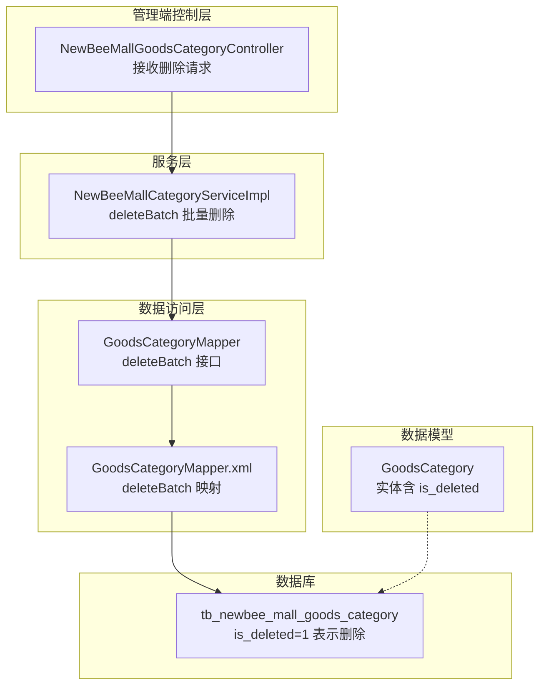
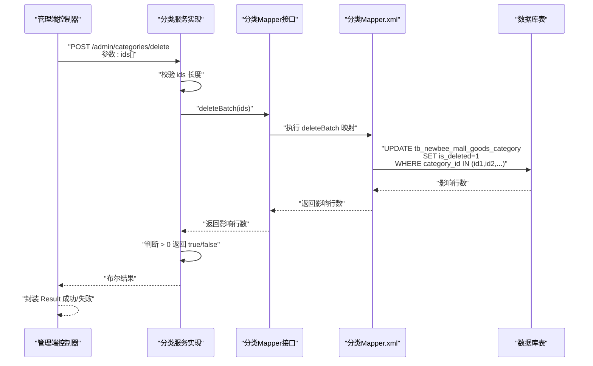
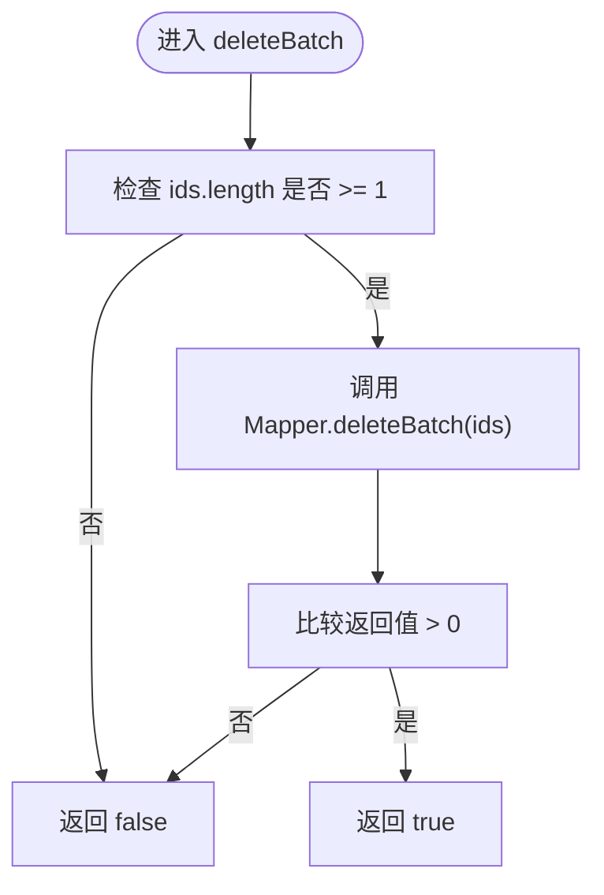
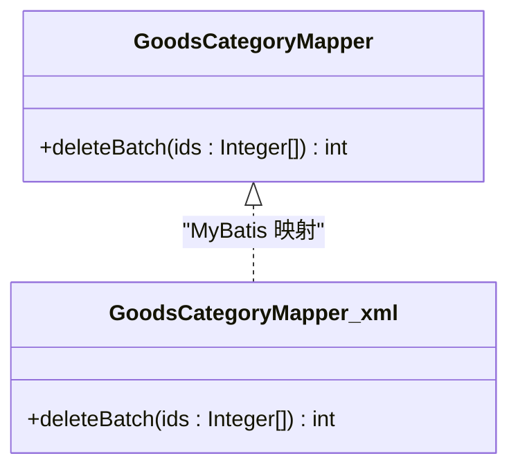
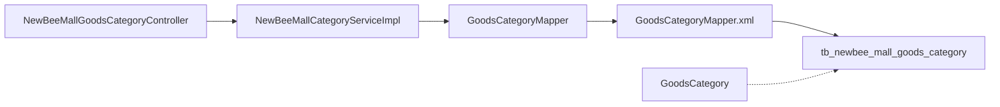

# 删除操作实现

<cite>
**本文引用的文件**
- [NewBeeMallCategoryServiceImpl.java](file://src/main/java/ltd/newbee/mall/service/impl/NewBeeMallCategoryServiceImpl.java)
- [GoodsCategoryMapper.java](file://src/main/java/ltd/newbee/mall/dao/GoodsCategoryMapper.java)
- [GoodsCategoryMapper.xml](file://src/main/resources/mapper/GoodsCategoryMapper.xml)
- [GoodsCategory.java](file://src/main/java/ltd/newbee/mall/entity/GoodsCategory.java)
- [NewBeeMallGoodsCategoryController.java](file://src/main/java/ltd/newbee/mall/controller/admin/NewBeeMallGoodsCategoryController.java)
- [newbee_mall_schema.sql](file://src/main/resources/newbee_mall_schema.sql)
</cite>

## 目录
1. [引言](#引言)
2. [项目结构](#项目结构)
3. [核心组件](#核心组件)
4. [架构总览](#架构总览)
5. [详细组件分析](#详细组件分析)
6. [依赖关系分析](#依赖关系分析)
7. [性能考量](#性能考量)
8. [故障排查指南](#故障排查指南)
9. [结论](#结论)

## 引言
本文聚焦于 NewBeeMallCategoryServiceImpl 类中的 deleteBatch 方法，系统性解析其如何调用 GoodsCategoryMapper 的 deleteBatch 方法执行批量删除。重点说明该操作在 SQL 层面实际执行的是 UPDATE 语句，将 is_deleted 字段更新为 1，而非 DELETE 语句。结合 GoodsCategoryMapper.xml 中的映射配置与 newbee_mall_schema.sql 的表结构，阐明参数处理与返回值验证的实现细节，帮助读者全面理解“软删除”策略在本项目中的落地方式。

## 项目结构
围绕分类删除功能的相关模块分布如下：
- 控制层：Admin 管理端分类控制器负责接收前端请求并调用服务层
- 服务层：分类业务服务实现类提供 deleteBatch 批量删除入口
- 数据访问层：GoodsCategoryMapper 接口定义 deleteBatch 方法
- 持久化映射：GoodsCategoryMapper.xml 中 deleteBatch 对应 UPDATE 语句
- 实体模型：GoodsCategory 实体包含 is_deleted 字段
- 数据库表：newbee_mall_schema.sql 定义 tb_newbee_mall_goods_category 表结构

图表来源
- [NewBeeMallGoodsCategoryController.java](file://src/main/java/ltd/newbee/mall/controller/admin/NewBeeMallGoodsCategoryController.java#L156-L170)
- [NewBeeMallCategoryServiceImpl.java](file://src/main/java/ltd/newbee/mall/service/impl/NewBeeMallCategoryServiceImpl.java#L82-L89)
- [GoodsCategoryMapper.java](file://src/main/java/ltd/newbee/mall/dao/GoodsCategoryMapper.java#L36-L36)
- [GoodsCategoryMapper.xml](file://src/main/resources/mapper/GoodsCategoryMapper.xml#L82-L88)
- [GoodsCategory.java](file://src/main/java/ltd/newbee/mall/entity/GoodsCategory.java#L24-L30)
- [newbee_mall_schema.sql](file://src/main/resources/newbee_mall_schema.sql#L1-L50)

章节来源
- [NewBeeMallGoodsCategoryController.java](file://src/main/java/ltd/newbee/mall/controller/admin/NewBeeMallGoodsCategoryController.java#L156-L170)
- [NewBeeMallCategoryServiceImpl.java](file://src/main/java/ltd/newbee/mall/service/impl/NewBeeMallCategoryServiceImpl.java#L82-L89)
- [GoodsCategoryMapper.java](file://src/main/java/ltd/newbee/mall/dao/GoodsCategoryMapper.java#L36-L36)
- [GoodsCategoryMapper.xml](file://src/main/resources/mapper/GoodsCategoryMapper.xml#L82-L88)
- [GoodsCategory.java](file://src/main/java/ltd/newbee/mall/entity/GoodsCategory.java#L24-L30)
- [newbee_mall_schema.sql](file://src/main/resources/newbee_mall_schema.sql#L1-L50)

## 核心组件
- 控制器：接收删除请求，校验参数，调用服务层 deleteBatch，并封装返回结果
- 服务实现：对传入的 id 数组进行边界检查，调用 Mapper 的 deleteBatch 并基于影响行数判断成功与否
- Mapper 接口：声明 deleteBatch(Integer[] ids)
- Mapper XML：实现 deleteBatch，使用 foreach 遍历数组，构造 IN 条件，执行 UPDATE 设置 is_deleted=1
- 实体：GoodsCategory 含 is_deleted 字段，配合查询条件过滤未删除记录
- 数据库：tb_newbee_mall_goods_category 表含 is_deleted 字段，用于软删除标记

章节来源
- [NewBeeMallGoodsCategoryController.java](file://src/main/java/ltd/newbee/mall/controller/admin/NewBeeMallGoodsCategoryController.java#L156-L170)
- [NewBeeMallCategoryServiceImpl.java](file://src/main/java/ltd/newbee/mall/service/impl/NewBeeMallCategoryServiceImpl.java#L82-L89)
- [GoodsCategoryMapper.java](file://src/main/java/ltd/newbee/mall/dao/GoodsCategoryMapper.java#L36-L36)
- [GoodsCategoryMapper.xml](file://src/main/resources/mapper/GoodsCategoryMapper.xml#L82-L88)
- [GoodsCategory.java](file://src/main/java/ltd/newbee/mall/entity/GoodsCategory.java#L24-L30)
- [newbee_mall_schema.sql](file://src/main/resources/newbee_mall_schema.sql#L1-L50)

## 架构总览
删除流程自上而下贯穿控制层、服务层、数据访问层与数据库，形成清晰的职责分离与调用链路。

图表来源
- [NewBeeMallGoodsCategoryController.java](file://src/main/java/ltd/newbee/mall/controller/admin/NewBeeMallGoodsCategoryController.java#L156-L170)
- [NewBeeMallCategoryServiceImpl.java](file://src/main/java/ltd/newbee/mall/service/impl/NewBeeMallCategoryServiceImpl.java#L82-L89)
- [GoodsCategoryMapper.java](file://src/main/java/ltd/newbee/mall/dao/GoodsCategoryMapper.java#L36-L36)
- [GoodsCategoryMapper.xml](file://src/main/resources/mapper/GoodsCategoryMapper.xml#L82-L88)

## 详细组件分析

### 服务层 deleteBatch 方法实现
- 参数校验：当 ids 长度小于 1 时直接返回 false，避免空数组引发后续异常
- 调用 Mapper：调用 GoodsCategoryMapper.deleteBatch(ids)，并将返回值与 0 比较，大于 0 才视为删除成功
- 返回值：布尔类型，true 表示至少有一条记录被更新，false 表示无记录受影响

图表来源
- [NewBeeMallCategoryServiceImpl.java](file://src/main/java/ltd/newbee/mall/service/impl/NewBeeMallCategoryServiceImpl.java#L82-L89)

章节来源
- [NewBeeMallCategoryServiceImpl.java](file://src/main/java/ltd/newbee/mall/service/impl/NewBeeMallCategoryServiceImpl.java#L82-L89)

### Mapper 接口与 XML 映射
- 接口方法：GoodsCategoryMapper.deleteBatch(Integer[] ids)
- XML 映射：deleteBatch 使用 foreach 遍历数组元素，拼接 IN 条件，执行 UPDATE 设置 is_deleted=1
- 查询过滤：多处查询映射均包含 AND is_deleted=0 条件，确保默认只返回未删除记录

图表来源
- [GoodsCategoryMapper.java](file://src/main/java/ltd/newbee/mall/dao/GoodsCategoryMapper.java#L36-L36)
- [GoodsCategoryMapper.xml](file://src/main/resources/mapper/GoodsCategoryMapper.xml#L82-L88)

章节来源
- [GoodsCategoryMapper.java](file://src/main/java/ltd/newbee/mall/dao/GoodsCategoryMapper.java#L36-L36)
- [GoodsCategoryMapper.xml](file://src/main/resources/mapper/GoodsCategoryMapper.xml#L82-L88)

### SQL 层实现细节与参数处理
- SQL 类型：UPDATE 语句，将目标记录的 is_deleted 字段置为 1
- 参数绑定：通过 foreach 遍历 Integer[] ids，生成逗号分隔的 id 列表，作为 IN 条件
- 条件约束：仅对 is_deleted=0 的记录生效，避免重复删除或误删
- 返回值：MyBatis 将影响的行数返回给服务层，服务层据此判断成功与否

章节来源
- [GoodsCategoryMapper.xml](file://src/main/resources/mapper/GoodsCategoryMapper.xml#L82-L88)

### 数据库表结构与字段含义
- 表名：tb_newbee_mall_goods_category
- 关键字段：category_id、category_level、parent_id、category_name、category_rank、is_deleted、create_time、create_user、update_time、update_user
- 软删除：is_deleted=0 表示未删除，is_deleted=1 表示已删除；查询映射普遍包含 AND is_deleted=0

章节来源
- [newbee_mall_schema.sql](file://src/main/resources/newbee_mall_schema.sql#L1-L50)

### 控制层调用链路
- 控制器接收删除请求，参数为 Integer[] ids
- 校验参数后调用服务层 deleteBatch
- 依据服务层返回的布尔值封装 Result 成功或失败

章节来源
- [NewBeeMallGoodsCategoryController.java](file://src/main/java/ltd/newbee/mall/controller/admin/NewBeeMallGoodsCategoryController.java#L156-L170)

## 依赖关系分析
- 控制层依赖服务层：控制器通过注入的分类服务调用 deleteBatch
- 服务层依赖数据访问层：服务层通过 GoodsCategoryMapper 接口调用 deleteBatch
- 数据访问层依赖映射文件：Mapper 接口方法由 GoodsCategoryMapper.xml 中的 deleteBatch 映射实现
- 实体与数据库：GoodsCategory 实体字段与 tb_newbee_mall_goods_category 表字段一一对应，is_deleted 字段用于软删除

图表来源
- [NewBeeMallGoodsCategoryController.java](file://src/main/java/ltd/newbee/mall/controller/admin/NewBeeMallGoodsCategoryController.java#L156-L170)
- [NewBeeMallCategoryServiceImpl.java](file://src/main/java/ltd/newbee/mall/service/impl/NewBeeMallCategoryServiceImpl.java#L82-L89)
- [GoodsCategoryMapper.java](file://src/main/java/ltd/newbee/mall/dao/GoodsCategoryMapper.java#L36-L36)
- [GoodsCategoryMapper.xml](file://src/main/resources/mapper/GoodsCategoryMapper.xml#L82-L88)
- [GoodsCategory.java](file://src/main/java/ltd/newbee/mall/entity/GoodsCategory.java#L24-L30)
- [newbee_mall_schema.sql](file://src/main/resources/newbee_mall_schema.sql#L1-L50)

## 性能考量
- 批量更新效率：使用单条 UPDATE 语句配合 IN 条件，避免多次往返，提升批量删除性能
- 索引建议：category_id 建议建立索引，IN 条件匹配时可快速定位记录
- 软删除优势：避免全表扫描与数据迁移成本，便于审计与恢复
- 返回值判断：服务层以影响行数 > 0 作为成功判定，避免误判

[本节为通用指导，无需列出具体文件来源]

## 故障排查指南
- 参数为空：当 ids 长度小于 1，服务层直接返回 false，需检查前端传参是否正确
- 无记录受影响：若返回 false，确认 ids 是否存在且 is_deleted=0；检查是否存在已被逻辑删除的记录
- SQL 执行异常：关注 MyBatis 日志，核对 IN 条件生成是否正确；确认数据库连接与权限
- 查询结果为空：多处查询映射包含 AND is_deleted=0，若删除后查询不到数据属预期行为

章节来源
- [NewBeeMallCategoryServiceImpl.java](file://src/main/java/ltd/newbee/mall/service/impl/NewBeeMallCategoryServiceImpl.java#L82-L89)
- [GoodsCategoryMapper.xml](file://src/main/resources/mapper/GoodsCategoryMapper.xml#L82-L88)

## 结论
本项目的分类删除采用“软删除”策略：服务层 deleteBatch 方法通过 GoodsCategoryMapper.deleteBatch 执行 UPDATE 语句，将目标记录的 is_deleted 字段置为 1，从而实现逻辑删除。该设计兼顾数据安全与审计需求，且通过影响行数判断删除结果，流程简洁可靠。结合 GoodsCategoryMapper.xml 的 foreach 参数绑定与 newbee_mall_schema.sql 的表结构，可确保批量删除在 SQL 层面高效、稳定地执行。