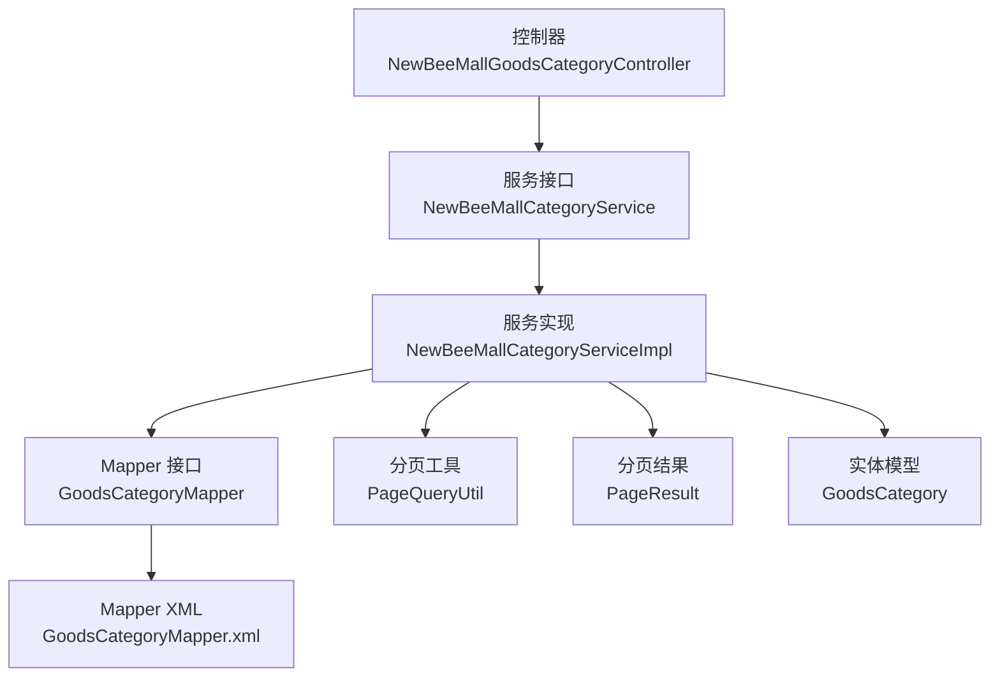
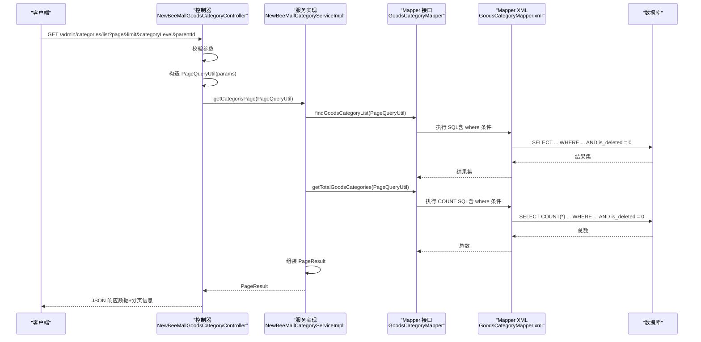
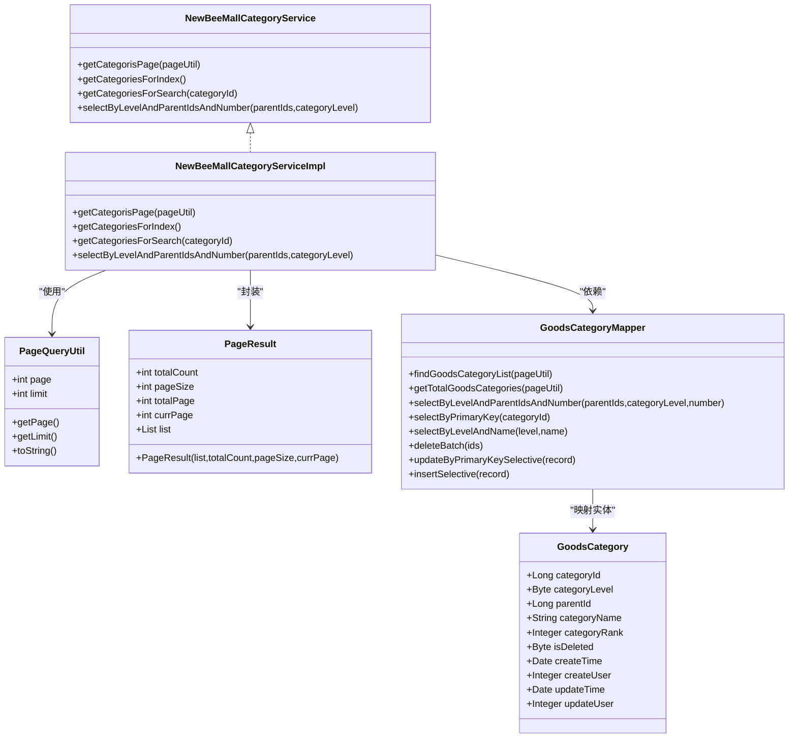
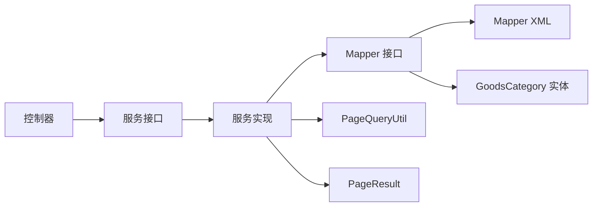

# 查询过滤机制

<cite>
**本文引用的文件**
- [NewBeeMallGoodsCategoryController.java](file://src/main/java/ltd/newbee/mall/controller/admin/NewBeeMallGoodsCategoryController.java)
- [NewBeeMallCategoryService.java](file://src/main/java/ltd/newbee/mall/service/NewBeeMallCategoryService.java)
- [NewBeeMallCategoryServiceImpl.java](file://src/main/java/ltd/newbee/mall/service/impl/NewBeeMallCategoryServiceImpl.java)
- [GoodsCategoryMapper.java](file://src/main/java/ltd/newbee/mall/dao/GoodsCategoryMapper.java)
- [GoodsCategoryMapper.xml](file://src/main/resources/mapper/GoodsCategoryMapper.xml)
- [PageQueryUtil.java](file://src/main/java/ltd/newbee/mall/util/PageQueryUtil.java)
- [PageResult.java](file://src/main/java/ltd/newbee/mall/util/PageResult.java)
- [GoodsCategory.java](file://src/main/java/ltd/newbee/mall/entity/GoodsCategory.java)
</cite>

## 目录
1. [引言](#引言)
2. [项目结构](#项目结构)
3. [核心组件](#核心组件)
4. [架构总览](#架构总览)
5. [详细组件分析](#详细组件分析)
6. [依赖关系分析](#依赖关系分析)
7. [性能考量](#性能考量)
8. [故障排查指南](#故障排查指南)
9. [结论](#结论)

## 引言
本文围绕“查询商品分类数据时如何过滤已删除的记录”这一主题，以 getCategorisPage 方法为例，系统阐述从控制器到服务、再到 Mapper 的完整调用链路，重点说明 PageQueryUtil 如何将查询条件传递给 Mapper 层，以及在 SQL 中通过“is_deleted = 0”的过滤条件确保前端展示的数据始终有效，同时保留已删除数据的可追溯性。

## 项目结构
与“查询过滤机制”直接相关的模块组织如下：
- 控制器层：负责接收请求参数，构造分页查询对象，调用服务层接口
- 服务层：封装业务逻辑，调用持久化层接口，组装分页结果
- 数据访问层（Mapper）：定义查询方法签名，提供 SQL 映射文件
- 实体与工具：实体映射数据库字段，工具类封装分页参数计算

图表来源
- [NewBeeMallGoodsCategoryController.java](file://src/main/java/ltd/newbee/mall/controller/admin/NewBeeMallGoodsCategoryController.java#L57-L65)
- [NewBeeMallCategoryService.java](file://src/main/java/ltd/newbee/mall/service/NewBeeMallCategoryService.java#L26-L26)
- [NewBeeMallCategoryServiceImpl.java](file://src/main/java/ltd/newbee/mall/service/impl/NewBeeMallCategoryServiceImpl.java#L40-L45)
- [GoodsCategoryMapper.java](file://src/main/java/ltd/newbee/mall/dao/GoodsCategoryMapper.java#L32-L33)
- [GoodsCategoryMapper.xml](file://src/main/resources/mapper/GoodsCategoryMapper.xml#L20-L37)
- [PageQueryUtil.java](file://src/main/java/ltd/newbee/mall/util/PageQueryUtil.java#L20-L29)
- [PageResult.java](file://src/main/java/ltd/newbee/mall/util/PageResult.java#L35-L41)
- [GoodsCategory.java](file://src/main/java/ltd/newbee/mall/entity/GoodsCategory.java#L26-L26)

章节来源
- [NewBeeMallGoodsCategoryController.java](file://src/main/java/ltd/newbee/mall/controller/admin/NewBeeMallGoodsCategoryController.java#L57-L65)
- [NewBeeMallCategoryService.java](file://src/main/java/ltd/newbee/mall/service/NewBeeMallCategoryService.java#L26-L26)
- [NewBeeMallCategoryServiceImpl.java](file://src/main/java/ltd/newbee/mall/service/impl/NewBeeMallCategoryServiceImpl.java#L40-L45)
- [GoodsCategoryMapper.java](file://src/main/java/ltd/newbee/mall/dao/GoodsCategoryMapper.java#L32-L33)
- [GoodsCategoryMapper.xml](file://src/main/resources/mapper/GoodsCategoryMapper.xml#L20-L37)
- [PageQueryUtil.java](file://src/main/java/ltd/newbee/mall/util/PageQueryUtil.java#L20-L29)
- [PageResult.java](file://src/main/java/ltd/newbee/mall/util/PageResult.java#L35-L41)
- [GoodsCategory.java](file://src/main/java/ltd/newbee/mall/entity/GoodsCategory.java#L26-L26)

## 核心组件
- 控制器：接收分页参数（page、limit），以及分类层级与父级 ID 等筛选条件，构造 PageQueryUtil 并调用服务层 getCategorisPage
- 服务层：调用 Mapper 的 findGoodsCategoryList 和 getTotalGoodsCategories，封装为 PageResult 返回
- Mapper 接口：定义分页查询方法，传入 PageQueryUtil
- Mapper XML：在 SQL 中使用“and is_deleted = 0”作为默认过滤条件；同时在 count 查询中也应用相同过滤
- PageQueryUtil：解析 page、limit，计算 start 偏移量，并将这些参数注入 Map 供 SQL 使用
- PageResult：封装分页结果集、总数、页码等信息
- 实体 GoodsCategory：包含 isDeleted 字段，用于软删除标记

章节来源
- [NewBeeMallGoodsCategoryController.java](file://src/main/java/ltd/newbee/mall/controller/admin/NewBeeMallGoodsCategoryController.java#L57-L65)
- [NewBeeMallCategoryServiceImpl.java](file://src/main/java/ltd/newbee/mall/service/impl/NewBeeMallCategoryServiceImpl.java#L40-L45)
- [GoodsCategoryMapper.java](file://src/main/java/ltd/newbee/mall/dao/GoodsCategoryMapper.java#L32-L33)
- [GoodsCategoryMapper.xml](file://src/main/resources/mapper/GoodsCategoryMapper.xml#L20-L37)
- [PageQueryUtil.java](file://src/main/java/ltd/newbee/mall/util/PageQueryUtil.java#L20-L29)
- [PageResult.java](file://src/main/java/ltd/newbee/mall/util/PageResult.java#L35-L41)
- [GoodsCategory.java](file://src/main/java/ltd/newbee/mall/entity/GoodsCategory.java#L26-L26)

## 架构总览
下面以序列图展示“后台分类分页列表”的端到端流程，突出 PageQueryUtil 的参数传递与 SQL 过滤条件的应用。

图表来源
- [NewBeeMallGoodsCategoryController.java](file://src/main/java/ltd/newbee/mall/controller/admin/NewBeeMallGoodsCategoryController.java#L57-L65)
- [NewBeeMallCategoryServiceImpl.java](file://src/main/java/ltd/newbee/mall/service/impl/NewBeeMallCategoryServiceImpl.java#L40-L45)
- [GoodsCategoryMapper.java](file://src/main/java/ltd/newbee/mall/dao/GoodsCategoryMapper.java#L32-L33)
- [GoodsCategoryMapper.xml](file://src/main/resources/mapper/GoodsCategoryMapper.xml#L20-L37)

## 详细组件分析

### PageQueryUtil：参数解析与分页偏移
- 负责从请求参数 Map 中提取 page、limit，并计算 start 偏移量，同时将 page、limit、start 注入 Map，供 MyBatis 使用
- 在分类分页查询中，这些键值会被 SQL 的 <where> 条件引用，实现分页与条件过滤

章节来源
- [PageQueryUtil.java](file://src/main/java/ltd/newbee/mall/util/PageQueryUtil.java#L20-L29)

### Mapper XML：统一的“is_deleted = 0”过滤
- 在 findGoodsCategoryList 的查询中，显式添加“and is_deleted = 0”，确保只返回未删除的记录
- 在 getTotalGoodsCategories 的统计中同样应用“and is_deleted = 0”，保证分页总数准确
- 其他查询如按主键、按名称与层级、按父级集合与层级等也均包含“and is_deleted = 0”，形成一致的软删除过滤策略

章节来源
- [GoodsCategoryMapper.xml](file://src/main/resources/mapper/GoodsCategoryMapper.xml#L20-L37)
- [GoodsCategoryMapper.xml](file://src/main/resources/mapper/GoodsCategoryMapper.xml#L38-L49)
- [GoodsCategoryMapper.xml](file://src/main/resources/mapper/GoodsCategoryMapper.xml#L50-L55)
- [GoodsCategoryMapper.xml](file://src/main/resources/mapper/GoodsCategoryMapper.xml#L56-L62)
- [GoodsCategoryMapper.xml](file://src/main/resources/mapper/GoodsCategoryMapper.xml#L63-L77)

### 服务层：调用 Mapper 并组装分页结果
- getCategorisPage 调用 findGoodsCategoryList 获取列表，调用 getTotalGoodsCategories 获取总数，再以 PageResult 封装返回
- 该方法不直接拼接过滤条件，而是依赖 Mapper XML 已内置的“is_deleted = 0”

章节来源
- [NewBeeMallCategoryServiceImpl.java](file://src/main/java/ltd/newbee/mall/service/impl/NewBeeMallCategoryServiceImpl.java#L40-L45)

### 控制器：参数校验与调用
- 在 /admin/categories/list 接口处，对 page、limit、categoryLevel、parentId 进行参数校验
- 将 Map 参数交由 PageQueryUtil 解析后，调用服务层 getCategorisPage，并以 Result 包裹返回

章节来源
- [NewBeeMallGoodsCategoryController.java](file://src/main/java/ltd/newbee/mall/controller/admin/NewBeeMallGoodsCategoryController.java#L57-L65)

### 删除机制与可追溯性
- 删除采用软删除策略：更新 is_deleted=1，而非物理删除
- 删除接口 deleteBatch 会对指定 ID 集合批量设置 is_deleted=1
- 由于查询 SQL 默认包含“and is_deleted = 0”，已删除记录不会出现在查询结果中，但数据仍保留在数据库中，便于审计与回溯

章节来源
- [GoodsCategoryMapper.xml](file://src/main/resources/mapper/GoodsCategoryMapper.xml#L78-L88)

### 类关系图（代码级）

图表来源
- [GoodsCategory.java](file://src/main/java/ltd/newbee/mall/entity/GoodsCategory.java#L16-L137)
- [PageQueryUtil.java](file://src/main/java/ltd/newbee/mall/util/PageQueryUtil.java#L14-L56)
- [PageResult.java](file://src/main/java/ltd/newbee/mall/util/PageResult.java#L14-L84)
- [GoodsCategoryMapper.java](file://src/main/java/ltd/newbee/mall/dao/GoodsCategoryMapper.java#L17-L39)
- [NewBeeMallCategoryService.java](file://src/main/java/ltd/newbee/mall/service/NewBeeMallCategoryService.java#L19-L59)
- [NewBeeMallCategoryServiceImpl.java](file://src/main/java/ltd/newbee/mall/service/impl/NewBeeMallCategoryServiceImpl.java#L33-L167)

## 依赖关系分析
- 控制器依赖服务接口，服务实现依赖 Mapper 接口，Mapper 通过 XML 映射数据库表
- PageQueryUtil 作为跨层参数载体，贯穿控制器到服务再到 Mapper 的调用链
- GoodsCategory 实体映射数据库字段，其中 isDeleted 用于软删除控制

图表来源
- [NewBeeMallGoodsCategoryController.java](file://src/main/java/ltd/newbee/mall/controller/admin/NewBeeMallGoodsCategoryController.java#L57-L65)
- [NewBeeMallCategoryService.java](file://src/main/java/ltd/newbee/mall/service/NewBeeMallCategoryService.java#L26-L26)
- [NewBeeMallCategoryServiceImpl.java](file://src/main/java/ltd/newbee/mall/service/impl/NewBeeMallCategoryServiceImpl.java#L40-L45)
- [GoodsCategoryMapper.java](file://src/main/java/ltd/newbee/mall/dao/GoodsCategoryMapper.java#L32-L33)
- [GoodsCategoryMapper.xml](file://src/main/resources/mapper/GoodsCategoryMapper.xml#L20-L37)
- [PageQueryUtil.java](file://src/main/java/ltd/newbee/mall/util/PageQueryUtil.java#L20-L29)
- [PageResult.java](file://src/main/java/ltd/newbee/mall/util/PageResult.java#L35-L41)
- [GoodsCategory.java](file://src/main/java/ltd/newbee/mall/entity/GoodsCategory.java#L26-L26)

## 性能考量
- 统一的“is_deleted = 0”过滤条件确保查询命中索引（建议在 is_deleted 上建立合适索引或组合索引），避免全表扫描
- 分页查询通过 start 与 limit 控制返回数据量，结合排序字段（如 category_rank）提升用户体验
- 统计总数与列表查询均应用相同过滤条件，避免分页总数与列表不一致导致的错位

## 故障排查指南
- 若发现查询不到数据，检查请求参数是否包含 categoryLevel 与 parentId，以及 page、limit 是否正确传递
- 若分页总数异常，确认 SQL 中是否正确应用“and is_deleted = 0”
- 若删除后仍可见，检查删除接口是否正确执行软删除（is_deleted=1），并确认查询 SQL 是否包含过滤条件

章节来源
- [NewBeeMallGoodsCategoryController.java](file://src/main/java/ltd/newbee/mall/controller/admin/NewBeeMallGoodsCategoryController.java#L57-L65)
- [GoodsCategoryMapper.xml](file://src/main/resources/mapper/GoodsCategoryMapper.xml#L20-L37)
- [GoodsCategoryMapper.xml](file://src/main/resources/mapper/GoodsCategoryMapper.xml#L38-L49)

## 结论
通过 PageQueryUtil 将分页与筛选参数传递至 Mapper 层，配合 Mapper XML 内置的“and is_deleted = 0”过滤条件，实现了对已删除记录的统一屏蔽，确保前端展示的数据始终有效。同时，采用软删除策略保留了历史数据的可追溯性，满足业务审计与回溯需求。该机制在控制器、服务层与持久化层之间形成清晰职责边界，具备良好的扩展性与维护性。