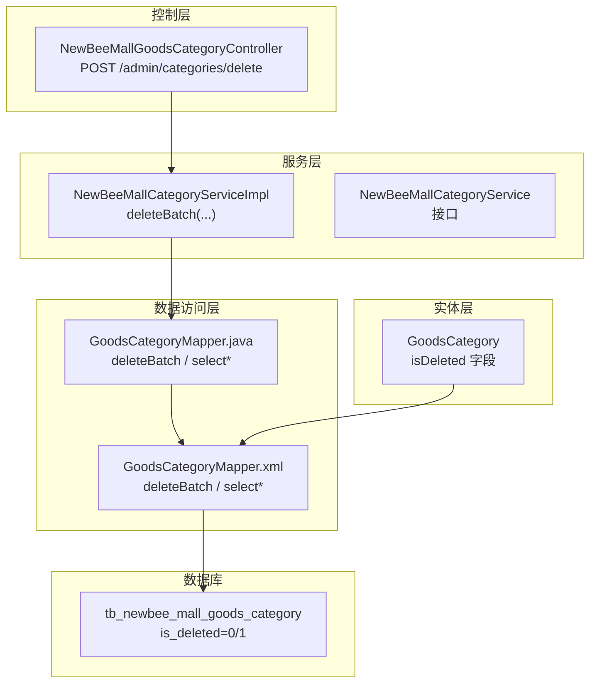
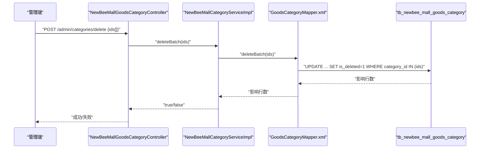
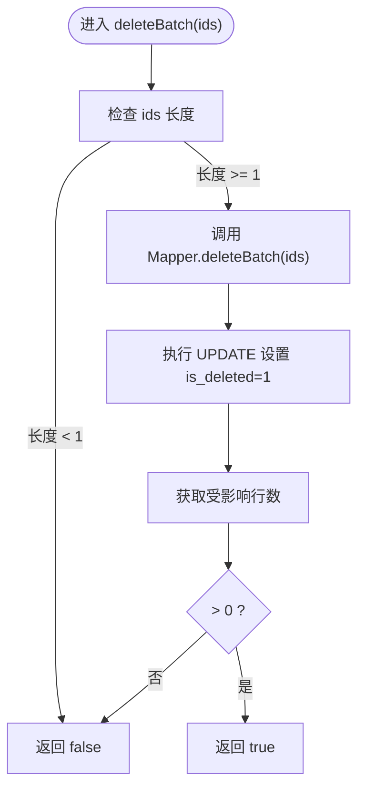
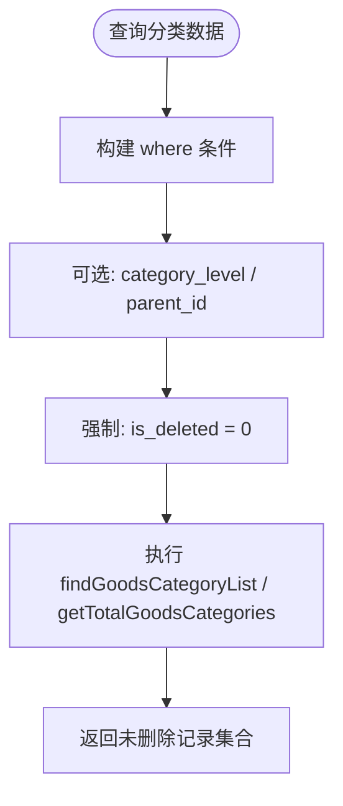
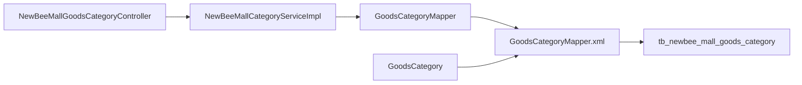

# 软删除机制

<cite>
**本文引用的文件**
- [GoodsCategory.java](file://src/main/java/ltd/newbee/mall/entity/GoodsCategory.java)
- [GoodsCategoryMapper.java](file://src/main/java/ltd/newbee/mall/dao/GoodsCategoryMapper.java)
- [GoodsCategoryMapper.xml](file://src/main/resources/mapper/GoodsCategoryMapper.xml)
- [NewBeeMallCategoryService.java](file://src/main/java/ltd/newbee/mall/service/NewBeeMallCategoryService.java)
- [NewBeeMallCategoryServiceImpl.java](file://src/main/java/ltd/newbee/mall/service/impl/NewBeeMallCategoryServiceImpl.java)
- [NewBeeMallGoodsCategoryController.java](file://src/main/java/ltd/newbee/mall/controller/admin/NewBeeMallGoodsCategoryController.java)
- [newbee_mall_schema.sql](file://src/main/resources/newbee_mall_schema.sql)
- [CarouselMapper.xml](file://src/main/resources/mapper/CarouselMapper.xml)
- [IndexConfigMapper.xml](file://src/main/resources/mapper/IndexConfigMapper.xml)
- [MallUserMapper.xml](file://src/main/resources/mapper/MallUserMapper.xml)
- [NewBeeMallOrderMapper.xml](file://src/main/resources/mapper/NewBeeMallOrderMapper.xml)
- [NewBeeMallShoppingCartItemMapper.xml](file://src/main/resources/mapper/NewBeeMallShoppingCartItemMapper.xml)
</cite>

## 目录
1. [引言](#引言)
2. [项目结构](#项目结构)
3. [核心组件](#核心组件)
4. [架构总览](#架构总览)
5. [详细组件分析](#详细组件分析)
6. [依赖关系分析](#依赖关系分析)
7. [性能考量](#性能考量)
8. [故障排查指南](#故障排查指南)
9. [结论](#结论)
10. [附录](#附录)

## 引言
本文件聚焦于 newbee-mall 商品分类的“软删除”机制，系统性阐述 is_deleted 字段的设计与实现，解释其如何通过标记删除（0-未删除，1-已删除）替代物理删除，从而在保留数据完整性的同时，支持数据恢复、审计追踪与关联数据保护。文档同时解析 deleteBatch 方法的实现逻辑，并说明在查询分类数据（如 getCategorisPage）时如何通过 SQL 条件过滤已删除的分类，最后总结软删除在业务层面的价值与最佳实践。

## 项目结构
围绕商品分类软删除的关键文件组织如下：
- 实体层：GoodsCategory.java 定义 is_deleted 字段及其它元数据
- 数据访问层：GoodsCategoryMapper.java 接口与 GoodsCategoryMapper.xml 映射文件
- 服务层：NewBeeMallCategoryService.java 接口与 NewBeeMallCategoryServiceImpl.java 实现
- 控制层：NewBeeMallGoodsCategoryController.java 提供删除接口
- 数据库脚本：newbee_mall_schema.sql 定义 tb_newbee_mall_goods_category 表结构
- 其他模块的软删除示例：CarouselMapper.xml、IndexConfigMapper.xml、MallUserMapper.xml、NewBeeMallOrderMapper.xml、NewBeeMallShoppingCartItemMapper.xml 展示了 is_deleted 的通用模式

图表来源
- [NewBeeMallGoodsCategoryController.java](file://src/main/java/ltd/newbee/mall/controller/admin/NewBeeMallGoodsCategoryController.java#L156-L170)
- [NewBeeMallCategoryServiceImpl.java](file://src/main/java/ltd/newbee/mall/service/impl/NewBeeMallCategoryServiceImpl.java#L82-L89)
- [GoodsCategoryMapper.java](file://src/main/java/ltd/newbee/mall/dao/GoodsCategoryMapper.java#L36-L39)
- [GoodsCategoryMapper.xml](file://src/main/resources/mapper/GoodsCategoryMapper.xml#L78-L88)
- [GoodsCategory.java](file://src/main/java/ltd/newbee/mall/entity/GoodsCategory.java#L26-L26)
- [newbee_mall_schema.sql](file://src/main/resources/newbee_mall_schema.sql#L72-L87)

章节来源
- [NewBeeMallGoodsCategoryController.java](file://src/main/java/ltd/newbee/mall/controller/admin/NewBeeMallGoodsCategoryController.java#L156-L170)
- [NewBeeMallCategoryServiceImpl.java](file://src/main/java/ltd/newbee/mall/service/impl/NewBeeMallCategoryServiceImpl.java#L82-L89)
- [GoodsCategoryMapper.java](file://src/main/java/ltd/newbee/mall/dao/GoodsCategoryMapper.java#L36-L39)
- [GoodsCategoryMapper.xml](file://src/main/resources/mapper/GoodsCategoryMapper.xml#L78-L88)
- [GoodsCategory.java](file://src/main/java/ltd/newbee/mall/entity/GoodsCategory.java#L26-L26)
- [newbee_mall_schema.sql](file://src/main/resources/newbee_mall_schema.sql#L72-L87)

## 核心组件
- 实体 GoodsCategory：包含 is_deleted 字段，用于标记记录是否被软删除
- Mapper 接口 GoodsCategoryMapper：定义 deleteBatch、selectByPrimaryKey、selectByLevelAndName、selectByLevelAndParentIdsAndNumber 等方法
- Mapper XML GoodsCategoryMapper.xml：实现 deleteBatch、按条件查询等 SQL，统一在查询与更新中加入 is_deleted=0 过滤
- Service 实现 NewBeeMallCategoryServiceImpl：封装业务逻辑，提供 deleteBatch 调用与分页查询
- Controller NewBeeMallGoodsCategoryController：对外暴露删除接口，接收 id 数组并调用服务层

章节来源
- [GoodsCategory.java](file://src/main/java/ltd/newbee/mall/entity/GoodsCategory.java#L26-L26)
- [GoodsCategoryMapper.java](file://src/main/java/ltd/newbee/mall/dao/GoodsCategoryMapper.java#L18-L39)
- [GoodsCategoryMapper.xml](file://src/main/resources/mapper/GoodsCategoryMapper.xml#L30-L88)
- [NewBeeMallCategoryServiceImpl.java](file://src/main/java/ltd/newbee/mall/service/impl/NewBeeMallCategoryServiceImpl.java#L40-L45)
- [NewBeeMallGoodsCategoryController.java](file://src/main/java/ltd/newbee/mall/controller/admin/NewBeeMallGoodsCategoryController.java#L156-L170)

## 架构总览
软删除贯穿“控制层-服务层-数据访问层-数据库”的全链路，确保查询侧默认屏蔽已删除记录，写操作侧通过标记更新替代物理删除。

图表来源
- [NewBeeMallGoodsCategoryController.java](file://src/main/java/ltd/newbee/mall/controller/admin/NewBeeMallGoodsCategoryController.java#L156-L170)
- [NewBeeMallCategoryServiceImpl.java](file://src/main/java/ltd/newbee/mall/service/impl/NewBeeMallCategoryServiceImpl.java#L82-L89)
- [GoodsCategoryMapper.xml](file://src/main/resources/mapper/GoodsCategoryMapper.xml#L82-L88)

## 详细组件分析

### is_deleted 字段设计与业务价值
- 字段定义：实体 GoodsCategory 持有 is_deleted 字段，数据库表 tb_newbee_mall_goods_category 中 is_deleted 默认 0，表示未删除；当执行软删除时置为 1
- 业务价值：
  - 数据完整性：避免级联删除导致的数据丢失，便于后续恢复
  - 审计追踪：保留历史记录，可追溯删除行为
  - 关联保护：与商品、订单等关联表保持一致性，防止外键约束破坏
- 通用模式：项目其他模块（轮播、首页配置、用户、订单、购物车项）均采用相同 is_deleted=0 查询过滤策略，形成一致的软删除规范

章节来源
- [GoodsCategory.java](file://src/main/java/ltd/newbee/mall/entity/GoodsCategory.java#L26-L26)
- [newbee_mall_schema.sql](file://src/main/resources/newbee_mall_schema.sql#L72-L87)
- [CarouselMapper.xml](file://src/main/resources/mapper/CarouselMapper.xml#L22-L30)
- [IndexConfigMapper.xml](file://src/main/resources/mapper/IndexConfigMapper.xml#L29-L42)
- [MallUserMapper.xml](file://src/main/resources/mapper/MallUserMapper.xml#L45-L61)
- [NewBeeMallOrderMapper.xml](file://src/main/resources/mapper/NewBeeMallOrderMapper.xml#L32-L32)
- [NewBeeMallShoppingCartItemMapper.xml](file://src/main/resources/mapper/NewBeeMallShoppingCartItemMapper.xml#L19-L32)

### deleteBatch 方法实现逻辑
- 控制层入口：控制器接收 id 数组，校验后调用服务层 deleteBatch
- 服务层处理：判空后委托 Mapper 执行批量软删除
- 数据访问层：Mapper XML 中 deleteBatch 使用 UPDATE 将 is_deleted 设为 1，范围限定在传入的 id 集合
- 返回语义：基于受影响行数判断是否删除成功

图表来源
- [NewBeeMallGoodsCategoryController.java](file://src/main/java/ltd/newbee/mall/controller/admin/NewBeeMallGoodsCategoryController.java#L156-L170)
- [NewBeeMallCategoryServiceImpl.java](file://src/main/java/ltd/newbee/mall/service/impl/NewBeeMallCategoryServiceImpl.java#L82-L89)
- [GoodsCategoryMapper.xml](file://src/main/resources/mapper/GoodsCategoryMapper.xml#L82-L88)

章节来源
- [NewBeeMallGoodsCategoryController.java](file://src/main/java/ltd/newbee/mall/controller/admin/NewBeeMallGoodsCategoryController.java#L156-L170)
- [NewBeeMallCategoryServiceImpl.java](file://src/main/java/ltd/newbee/mall/service/impl/NewBeeMallCategoryServiceImpl.java#L82-L89)
- [GoodsCategoryMapper.xml](file://src/main/resources/mapper/GoodsCategoryMapper.xml#L82-L88)

### 查询分类数据时的过滤策略
- 分页查询：findGoodsCategoryList 与 getTotalGoodsCategories 在 where 条件中显式添加 and is_deleted = 0，确保仅返回未删除记录
- 单条查询：selectByPrimaryKey 与 selectByLevelAndName 同样带有 is_deleted=0 过滤
- 父子关系查询：selectByLevelAndParentIdsAndNumber 也包含 is_deleted=0 过滤，保证层级关系查询不受已删除节点干扰
- 业务影响：getCategorisPage 通过 Mapper 的分页查询自动应用 is_deleted=0，从而在后台管理界面隐藏已删除分类

图表来源
- [GoodsCategoryMapper.xml](file://src/main/resources/mapper/GoodsCategoryMapper.xml#L20-L37)
- [GoodsCategoryMapper.xml](file://src/main/resources/mapper/GoodsCategoryMapper.xml#L38-L49)
- [GoodsCategoryMapper.xml](file://src/main/resources/mapper/GoodsCategoryMapper.xml#L50-L62)
- [GoodsCategoryMapper.xml](file://src/main/resources/mapper/GoodsCategoryMapper.xml#L63-L77)
- [NewBeeMallCategoryServiceImpl.java](file://src/main/java/ltd/newbee/mall/service/impl/NewBeeMallCategoryServiceImpl.java#L40-L45)

章节来源
- [GoodsCategoryMapper.xml](file://src/main/resources/mapper/GoodsCategoryMapper.xml#L20-L37)
- [GoodsCategoryMapper.xml](file://src/main/resources/mapper/GoodsCategoryMapper.xml#L38-L49)
- [GoodsCategoryMapper.xml](file://src/main/resources/mapper/GoodsCategoryMapper.xml#L50-L62)
- [GoodsCategoryMapper.xml](file://src/main/resources/mapper/GoodsCategoryMapper.xml#L63-L77)
- [NewBeeMallCategoryServiceImpl.java](file://src/main/java/ltd/newbee/mall/service/impl/NewBeeMallCategoryServiceImpl.java#L40-L45)

### 软删除在数据恢复、审计追踪与关联保护中的优势
- 数据恢复：is_deleted=1 的记录仍保留在数据库中，可通过更新将其恢复为未删除状态，避免误删造成不可逆损失
- 审计追踪：保留删除时间、操作人等字段，结合 is_deleted 字段可生成完整的变更日志
- 关联保护：软删除不破坏外键关系，避免因物理删除引发的级联问题，保障商品、订单等业务数据一致性

章节来源
- [GoodsCategory.java](file://src/main/java/ltd/newbee/mall/entity/GoodsCategory.java#L26-L26)
- [newbee_mall_schema.sql](file://src/main/resources/newbee_mall_schema.sql#L72-L87)

## 依赖关系分析
- 控制层依赖服务层：控制器负责参数校验与结果封装，调用服务层执行业务
- 服务层依赖数据访问层：服务层聚合业务规则，委托 Mapper 执行持久化
- 数据访问层依赖数据库：Mapper XML 定义 SQL，统一应用 is_deleted=0 过滤
- 实体依赖映射文件：实体字段与数据库列映射，is_deleted 字段参与查询与更新

图表来源
- [NewBeeMallGoodsCategoryController.java](file://src/main/java/ltd/newbee/mall/controller/admin/NewBeeMallGoodsCategoryController.java#L156-L170)
- [NewBeeMallCategoryServiceImpl.java](file://src/main/java/ltd/newbee/mall/service/impl/NewBeeMallCategoryServiceImpl.java#L82-L89)
- [GoodsCategoryMapper.java](file://src/main/java/ltd/newbee/mall/dao/GoodsCategoryMapper.java#L36-L39)
- [GoodsCategoryMapper.xml](file://src/main/resources/mapper/GoodsCategoryMapper.xml#L78-L88)
- [GoodsCategory.java](file://src/main/java/ltd/newbee/mall/entity/GoodsCategory.java#L26-L26)
- [newbee_mall_schema.sql](file://src/main/resources/newbee_mall_schema.sql#L72-L87)

章节来源
- [NewBeeMallGoodsCategoryController.java](file://src/main/java/ltd/newbee/mall/controller/admin/NewBeeMallGoodsCategoryController.java#L156-L170)
- [NewBeeMallCategoryServiceImpl.java](file://src/main/java/ltd/newbee/mall/service/impl/NewBeeMallCategoryServiceImpl.java#L82-L89)
- [GoodsCategoryMapper.java](file://src/main/java/ltd/newbee/mall/dao/GoodsCategoryMapper.java#L36-L39)
- [GoodsCategoryMapper.xml](file://src/main/resources/mapper/GoodsCategoryMapper.xml#L78-L88)
- [GoodsCategory.java](file://src/main/java/ltd/newbee/mall/entity/GoodsCategory.java#L26-L26)
- [newbee_mall_schema.sql](file://src/main/resources/newbee_mall_schema.sql#L72-L87)

## 性能考量
- 查询过滤成本低：is_deleted=0 的过滤在多处 SQL 中出现，建议在对应列上建立索引以提升查询效率
- 批量更新成本可控：deleteBatch 使用 IN 子句批量更新，合理控制 ids 数量可避免长事务与锁竞争
- 写入路径优化：软删除仅更新 is_deleted 字段，避免重建索引或大表重写

[本节为通用指导，无需列出具体文件来源]

## 故障排查指南
- 删除失败：检查传入 ids 是否为空；确认 Mapper.deleteBatch 返回受影响行数是否大于 0
- 查询不到数据：确认 is_deleted=0 条件是否正确拼接；检查分页参数与层级过滤条件
- 并发冲突：软删除更新包含“and is_deleted=0”，可避免重复删除导致的异常；如需更严格控制，可在业务层增加幂等校验

章节来源
- [NewBeeMallGoodsCategoryController.java](file://src/main/java/ltd/newbee/mall/controller/admin/NewBeeMallGoodsCategoryController.java#L156-L170)
- [NewBeeMallCategoryServiceImpl.java](file://src/main/java/ltd/newbee/mall/service/impl/NewBeeMallCategoryServiceImpl.java#L82-L89)
- [GoodsCategoryMapper.xml](file://src/main/resources/mapper/GoodsCategoryMapper.xml#L78-L88)

## 结论
newbee-mall 商品分类的软删除机制通过 is_deleted 字段实现了“标记删除”而非物理删除，配合查询侧统一的 is_deleted=0 过滤，有效保障了数据完整性、审计可追溯与关联一致性。deleteBatch 方法以最小代价完成批量软删除，配合服务层与控制层的职责划分，形成了清晰、可维护的软删除闭环。建议在生产环境中对相关列建立索引，并在业务层补充必要的幂等与校验逻辑，进一步提升稳定性与可运维性。

[本节为总结性内容，无需列出具体文件来源]

## 附录
- 数据库表结构要点：tb_newbee_mall_goods_category 包含 is_deleted 字段，默认 0，表示未删除
- 其他模块软删除示例：轮播、首页配置、用户、订单、购物车项等均采用相同 is_deleted=0 查询与 is_deleted=1 更新策略

章节来源
- [newbee_mall_schema.sql](file://src/main/resources/newbee_mall_schema.sql#L72-L87)
- [CarouselMapper.xml](file://src/main/resources/mapper/CarouselMapper.xml#L22-L30)
- [IndexConfigMapper.xml](file://src/main/resources/mapper/IndexConfigMapper.xml#L29-L42)
- [MallUserMapper.xml](file://src/main/resources/mapper/MallUserMapper.xml#L45-L61)
- [NewBeeMallOrderMapper.xml](file://src/main/resources/mapper/NewBeeMallOrderMapper.xml#L32-L32)
- [NewBeeMallShoppingCartItemMapper.xml](file://src/main/resources/mapper/NewBeeMallShoppingCartItemMapper.xml#L19-L32)