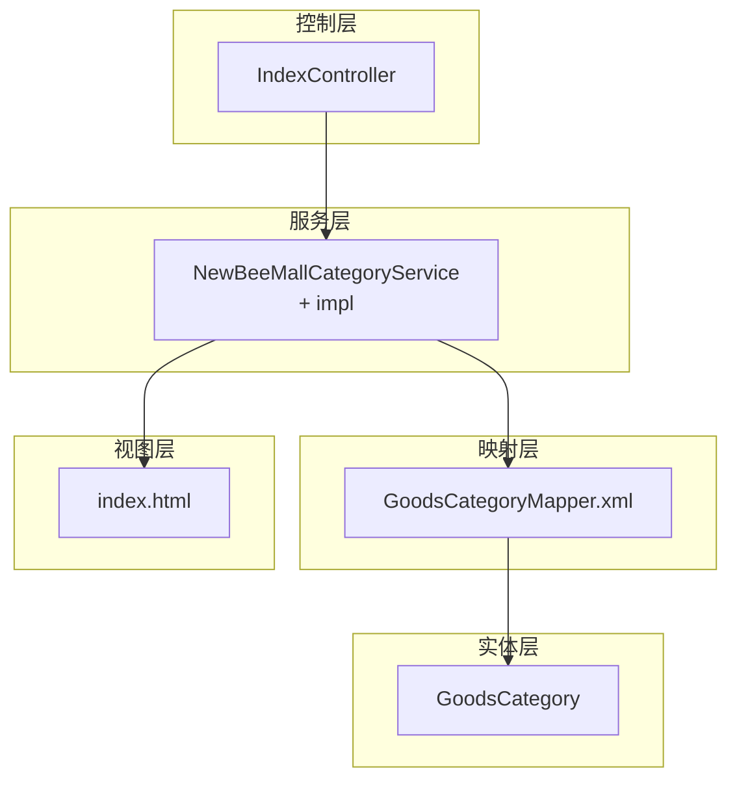
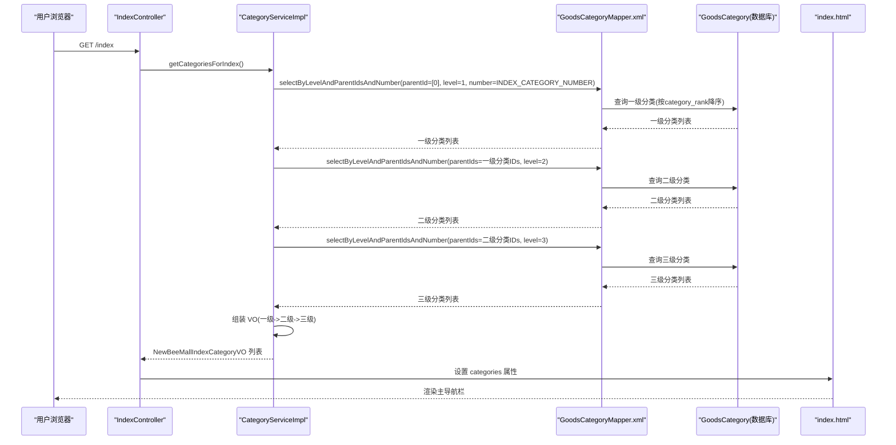
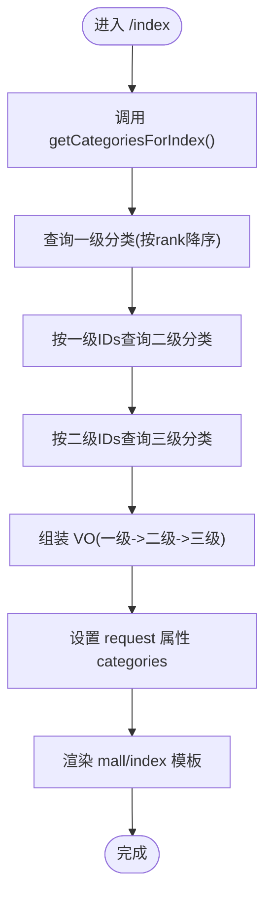
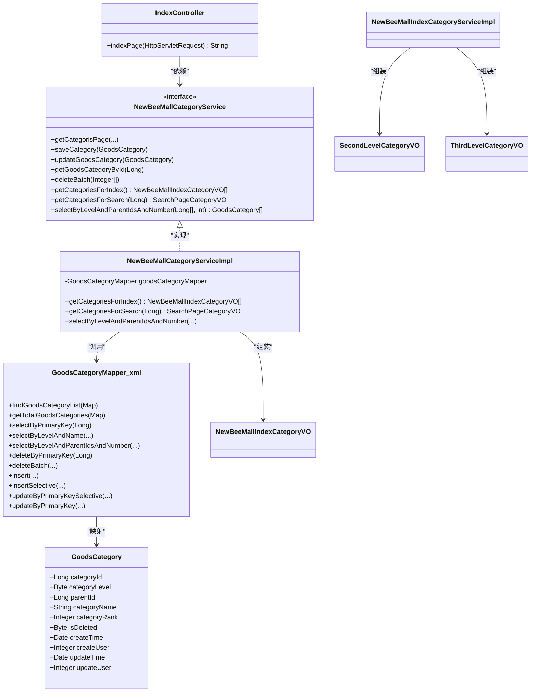

# 一级分类设计

<cite>
**本文引用的文件**
- [GoodsCategory.java](file://src/main/java/ltd/newbee/mall/entity/GoodsCategory.java)
- [NewBeeMallCategoryLevelEnum.java](file://src/main/java/ltd/newbee/mall/common/NewBeeMallCategoryLevelEnum.java)
- [GoodsCategoryMapper.xml](file://src/main/resources/mapper/GoodsCategoryMapper.xml)
- [NewBeeMallCategoryService.java](file://src/main/java/ltd/newbee/mall/service/NewBeeMallCategoryService.java)
- [NewBeeMallCategoryServiceImpl.java](file://src/main/java/ltd/newbee/mall/service/impl/NewBeeMallCategoryServiceImpl.java)
- [IndexController.java](file://src/main/java/ltd/newbee/mall/controller/mall/IndexController.java)
- [NewBeeMallIndexCategoryVO.java](file://src/main/java/ltd/newbee/mall/controller/vo/NewBeeMallIndexCategoryVO.java)
- [SecondLevelCategoryVO.java](file://src/main/java/ltd/newbee/mall/controller/vo/SecondLevelCategoryVO.java)
- [ThirdLevelCategoryVO.java](file://src/main/java/ltd/newbee/mall/controller/vo/ThirdLevelCategoryVO.java)
- [index.html](file://src/main/resources/templates/mall/index.html)
- [newbee_mall_schema.sql](file://src/main/resources/newbee_mall_schema.sql)
</cite>

## 目录
1. [引言](#引言)
2. [项目结构](#项目结构)
3. [核心组件](#核心组件)
4. [架构总览](#架构总览)
5. [详细组件分析](#详细组件分析)
6. [依赖关系分析](#依赖关系分析)
7. [性能考量](#性能考量)
8. [故障排查指南](#故障排查指南)
9. [结论](#结论)
10. [附录](#附录)

## 引言
本设计文档聚焦于 newbee-mall 系统中“商品一级分类”的业务设计与实现，围绕 category_level=1 的数据结构、创建规则、排序机制与状态管理展开，解释其在商城首页主导航栏中的角色，并结合 IndexController 与前端模板 index.html 的实际应用，给出数据库层面的约束说明与最佳实践建议。

## 项目结构
newbee-mall 采用典型的分层架构：
- 实体层：GoodsCategory 描述商品分类的字段与语义
- 映射层：GoodsCategoryMapper.xml 定义 SQL 查询与更新规则
- 服务层：NewBeeMallCategoryService 接口与 NewBeeMallCategoryServiceImpl 实现首页分类聚合逻辑
- 控制层：IndexController 负责首页数据装配与渲染
- 视图层：index.html 使用 Thymeleaf 展示分类导航树
- 枚举与 VO：NewBeeMallCategoryLevelEnum、NewBeeMallIndexCategoryVO、SecondLevelCategoryVO、ThirdLevelCategoryVO 提供分类层级与传输模型

图表来源
- [IndexController.java](file://src/main/java/ltd/newbee/mall/controller/mall/IndexController.java#L1-L58)
- [NewBeeMallCategoryService.java](file://src/main/java/ltd/newbee/mall/service/NewBeeMallCategoryService.java#L1-L60)
- [NewBeeMallCategoryServiceImpl.java](file://src/main/java/ltd/newbee/mall/service/impl/NewBeeMallCategoryServiceImpl.java#L1-L168)
- [GoodsCategoryMapper.xml](file://src/main/resources/mapper/GoodsCategoryMapper.xml#L1-L212)
- [GoodsCategory.java](file://src/main/java/ltd/newbee/mall/entity/GoodsCategory.java#L1-L137)
- [index.html](file://src/main/resources/templates/mall/index.html#L1-L353)

章节来源
- [IndexController.java](file://src/main/java/ltd/newbee/mall/controller/mall/IndexController.java#L1-L58)
- [NewBeeMallCategoryService.java](file://src/main/java/ltd/newbee/mall/service/NewBeeMallCategoryService.java#L1-L60)
- [NewBeeMallCategoryServiceImpl.java](file://src/main/java/ltd/newbee/mall/service/impl/NewBeeMallCategoryServiceImpl.java#L1-L168)
- [GoodsCategoryMapper.xml](file://src/main/resources/mapper/GoodsCategoryMapper.xml#L1-L212)
- [GoodsCategory.java](file://src/main/java/ltd/newbee/mall/entity/GoodsCategory.java#L1-L137)
- [index.html](file://src/main/resources/templates/mall/index.html#L1-L353)

## 核心组件
- 商品分类实体 GoodsCategory：包含 categoryId、categoryLevel、parentId、categoryName、categoryRank、isDeleted、createTime/updateTime、createUser/updateUser 等字段，用于描述分类的唯一标识、层级、父子关系、排序权重与软删除标记。
- 分类层级枚举 NewBeeMallCategoryLevelEnum：定义 LEVEL_ONE、LEVEL_TWO、LEVEL_THREE 三种层级，其中 LEVEL_ONE 对应 category_level=1。
- 分类映射 GoodsCategoryMapper.xml：提供按层级与父 ID 查询、统计、软删除、插入与更新等 SQL。
- 分类服务 NewBeeMallCategoryService/Impl：实现首页分类聚合逻辑，按一级分类固定数量拉取，再联动查询二级与三级分类并组装 VO。
- 控制器 IndexController：调用服务获取首页分类数据，注入模板变量，渲染 index.html。
- 视图模型 VO：NewBeeMallIndexCategoryVO、SecondLevelCategoryVO、ThirdLevelCategoryVO 用于前后端数据传输与模板渲染。

章节来源
- [GoodsCategory.java](file://src/main/java/ltd/newbee/mall/entity/GoodsCategory.java#L1-L137)
- [NewBeeMallCategoryLevelEnum.java](file://src/main/java/ltd/newbee/mall/common/NewBeeMallCategoryLevelEnum.java#L1-L59)
- [GoodsCategoryMapper.xml](file://src/main/resources/mapper/GoodsCategoryMapper.xml#L1-L212)
- [NewBeeMallCategoryService.java](file://src/main/java/ltd/newbee/mall/service/NewBeeMallCategoryService.java#L1-L60)
- [NewBeeMallCategoryServiceImpl.java](file://src/main/java/ltd/newbee/mall/service/impl/NewBeeMallCategoryServiceImpl.java#L1-L168)
- [IndexController.java](file://src/main/java/ltd/newbee/mall/controller/mall/IndexController.java#L1-L58)
- [NewBeeMallIndexCategoryVO.java](file://src/main/java/ltd/newbee/mall/controller/vo/NewBeeMallIndexCategoryVO.java#L1-L59)
- [SecondLevelCategoryVO.java](file://src/main/java/ltd/newbee/mall/controller/vo/SecondLevelCategoryVO.java#L1-L69)
- [ThirdLevelCategoryVO.java](file://src/main/java/ltd/newbee/mall/controller/vo/ThirdLevelCategoryVO.java#L1-L48)

## 架构总览
一级分类在系统中的角色：
- 作为商城首页主导航栏的基础数据源，承载“一级分类”节点，其子节点为二级分类，二级分类的子节点为三级分类。
- 一级分类的 parentId 固定为 0，category_level=1，isDeleted=0 表示启用状态。
- 首页渲染流程：IndexController -> CategoryService.getCategoriesForIndex() -> Mapper 查询 -> VO 组装 -> index.html 渲染。

图表来源
- [IndexController.java](file://src/main/java/ltd/newbee/mall/controller/mall/IndexController.java#L1-L58)
- [NewBeeMallCategoryServiceImpl.java](file://src/main/java/ltd/newbee/mall/service/impl/NewBeeMallCategoryServiceImpl.java#L91-L142)
- [GoodsCategoryMapper.xml](file://src/main/resources/mapper/GoodsCategoryMapper.xml#L63-L77)
- [index.html](file://src/main/resources/templates/mall/index.html#L1-L353)

章节来源
- [IndexController.java](file://src/main/java/ltd/newbee/mall/controller/mall/IndexController.java#L1-L58)
- [NewBeeMallCategoryServiceImpl.java](file://src/main/java/ltd/newbee/mall/service/impl/NewBeeMallCategoryServiceImpl.java#L91-L142)
- [GoodsCategoryMapper.xml](file://src/main/resources/mapper/GoodsCategoryMapper.xml#L63-L77)
- [index.html](file://src/main/resources/templates/mall/index.html#L1-L353)

## 详细组件分析

### 数据结构与业务含义
- 字段语义
  - categoryId：分类唯一标识
  - categoryLevel：分类层级，1=一级，2=二级，3=三级
  - parentId：父分类 ID，一级分类固定为 0
  - categoryName：分类名称
  - categoryRank：排序权重，数值越大越靠前
  - isDeleted：软删除标记，0=未删除，1=已删除
  - createTime/updateTime、createUser/updateUser：审计字段
- 业务含义
  - 一级分类即主导航根节点，承载多个二级分类；二级分类承载多个三级分类；三级分类直接关联商品。
  - 一级分类的排序由 categoryRank 决定，首页按降序排列。
  - 一级分类的父 ID 固定为 0，体现其为树根。

章节来源
- [GoodsCategory.java](file://src/main/java/ltd/newbee/mall/entity/GoodsCategory.java#L1-L137)
- [NewBeeMallCategoryLevelEnum.java](file://src/main/java/ltd/newbee/mall/common/NewBeeMallCategoryLevelEnum.java#L1-L59)

### 创建规则与校验
- 唯一性校验：同层级下不允许重复名称，避免同名冲突。
- 插入流程：通过 Mapper.insertSelective 写入 categoryId、categoryLevel、parentId、categoryName、categoryRank、isDeleted、审计字段。
- 更新流程：按主键更新，支持仅更新变更字段；更新时进行同名冲突校验（排除自身 ID）。

章节来源
- [NewBeeMallCategoryServiceImpl.java](file://src/main/java/ltd/newbee/mall/service/impl/NewBeeMallCategoryServiceImpl.java#L47-L75)
- [GoodsCategoryMapper.xml](file://src/main/resources/mapper/GoodsCategoryMapper.xml#L89-L111)

### 排序机制（categoryRank）
- 一级分类查询时按 category_rank 降序，确保首页主导航顺序可控。
- 二级与三级分类查询时同样遵循降序策略，保证子菜单的展示顺序。

章节来源
- [GoodsCategoryMapper.xml](file://src/main/resources/mapper/GoodsCategoryMapper.xml#L33-L37)
- [NewBeeMallCategoryServiceImpl.java](file://src/main/java/ltd/newbee/mall/service/impl/NewBeeMallCategoryServiceImpl.java#L95-L103)

### 状态管理（isDeleted）
- 删除采用软删除：更新 is_deleted=1，保留数据完整性与审计轨迹。
- 查询时统一过滤 is_deleted=0，确保只返回有效数据。

章节来源
- [GoodsCategoryMapper.xml](file://src/main/resources/mapper/GoodsCategoryMapper.xml#L31-L31)
- [GoodsCategoryMapper.xml](file://src/main/resources/mapper/GoodsCategoryMapper.xml#L78-L88)

### 数据库约束说明
- 主键：category_id
- 约束条件：category_level 取值范围为 1/2/3；parent_id 默认 0；is_deleted 默认 0；category_rank 默认 0
- 索引与查询：按 category_level 与 parent_id 查询，按 category_rank 降序；按名称与层级唯一性校验

章节来源
- [newbee_mall_schema.sql](file://src/main/resources/newbee_mall_schema.sql#L1-L503)
- [GoodsCategoryMapper.xml](file://src/main/resources/mapper/GoodsCategoryMapper.xml#L20-L37)
- [GoodsCategoryMapper.xml](file://src/main/resources/mapper/GoodsCategoryMapper.xml#L56-L62)

### 首页主导航渲染（IndexController 与 index.html）
- 控制器职责：调用 CategoryService.getCategoriesForIndex() 获取 VO 列表，设置 categories 属性，返回模板 mall/index。
- 模板渲染：Thymeleaf 遍历 categories，逐级渲染一级分类标题与二级/三级子菜单，三级分类项绑定到搜索页 URL 参数 goodsCategoryId。

图表来源
- [IndexController.java](file://src/main/java/ltd/newbee/mall/controller/mall/IndexController.java#L1-L58)
- [NewBeeMallCategoryServiceImpl.java](file://src/main/java/ltd/newbee/mall/service/impl/NewBeeMallCategoryServiceImpl.java#L91-L142)
- [index.html](file://src/main/resources/templates/mall/index.html#L1-L353)

章节来源
- [IndexController.java](file://src/main/java/ltd/newbee/mall/controller/mall/IndexController.java#L1-L58)
- [NewBeeMallCategoryServiceImpl.java](file://src/main/java/ltd/newbee/mall/service/impl/NewBeeMallCategoryServiceImpl.java#L91-L142)
- [index.html](file://src/main/resources/templates/mall/index.html#L1-L353)

## 依赖关系分析
- 控制器依赖服务接口，服务实现依赖 Mapper，Mapper 依赖数据库表结构。
- VO 层用于跨层传输，避免直接暴露实体。
- 枚举用于层级常量，提升代码可读性与一致性。

图表来源
- [GoodsCategory.java](file://src/main/java/ltd/newbee/mall/entity/GoodsCategory.java#L1-L137)
- [GoodsCategoryMapper.xml](file://src/main/resources/mapper/GoodsCategoryMapper.xml#L1-L212)
- [NewBeeMallCategoryService.java](file://src/main/java/ltd/newbee/mall/service/NewBeeMallCategoryService.java#L1-L60)
- [NewBeeMallCategoryServiceImpl.java](file://src/main/java/ltd/newbee/mall/service/impl/NewBeeMallCategoryServiceImpl.java#L1-L168)
- [IndexController.java](file://src/main/java/ltd/newbee/mall/controller/mall/IndexController.java#L1-L58)
- [NewBeeMallIndexCategoryVO.java](file://src/main/java/ltd/newbee/mall/controller/vo/NewBeeMallIndexCategoryVO.java#L1-L59)
- [SecondLevelCategoryVO.java](file://src/main/java/ltd/newbee/mall/controller/vo/SecondLevelCategoryVO.java#L1-L69)
- [ThirdLevelCategoryVO.java](file://src/main/java/ltd/newbee/mall/controller/vo/ThirdLevelCategoryVO.java#L1-L48)

章节来源
- [GoodsCategory.java](file://src/main/java/ltd/newbee/mall/entity/GoodsCategory.java#L1-L137)
- [GoodsCategoryMapper.xml](file://src/main/resources/mapper/GoodsCategoryMapper.xml#L1-L212)
- [NewBeeMallCategoryService.java](file://src/main/java/ltd/newbee/mall/service/NewBeeMallCategoryService.java#L1-L60)
- [NewBeeMallCategoryServiceImpl.java](file://src/main/java/ltd/newbee/mall/service/impl/NewBeeMallCategoryServiceImpl.java#L1-L168)
- [IndexController.java](file://src/main/java/ltd/newbee/mall/controller/mall/IndexController.java#L1-L58)
- [NewBeeMallIndexCategoryVO.java](file://src/main/java/ltd/newbee/mall/controller/vo/NewBeeMallIndexCategoryVO.java#L1-L59)
- [SecondLevelCategoryVO.java](file://src/main/java/ltd/newbee/mall/controller/vo/SecondLevelCategoryVO.java#L1-L69)
- [ThirdLevelCategoryVO.java](file://src/main/java/ltd/newbee/mall/controller/vo/ThirdLevelCategoryVO.java#L1-L48)

## 性能考量
- 查询路径
  - 一次性按 parent_id in (...) 批量查询二级与三级分类，减少多次往返。
  - 通过分组 Map 按 parentId 聚合，避免 N+1 查询。
- 排序与限制
  - 一级分类按 rank 降序，首页固定数量限制，降低渲染压力。
- 缓存建议
  - 首页分类数据可考虑缓存，热点场景下减少数据库压力；更新时失效缓存。
- 分页与总数
  - 后台分页接口使用 getTotalGoodsCategories 计算总数，避免全表扫描。

章节来源
- [NewBeeMallCategoryServiceImpl.java](file://src/main/java/ltd/newbee/mall/service/impl/NewBeeMallCategoryServiceImpl.java#L91-L142)
- [GoodsCategoryMapper.xml](file://src/main/resources/mapper/GoodsCategoryMapper.xml#L63-L77)
- [NewBeeMallCategoryService.java](file://src/main/java/ltd/newbee/mall/service/NewBeeMallCategoryService.java#L1-L60)

## 故障排查指南
- 一级分类为空
  - 检查是否存在 category_level=1 且 isDeleted=0 的记录；确认 categoryRank 是否合理。
  - 确认 INDEX_CATEGORY_NUMBER 配置是否过大导致空集。
- 导航不显示
  - 检查 index.html 中 categories 属性是否正确注入；确认模板遍历语法。
- 重复名称冲突
  - 保存/更新时返回同名冲突错误，需调整名称或层级。
- 删除后仍可见
  - 确认 is_deleted=1 的软删除生效；查询条件是否包含 is_deleted=0。

章节来源
- [IndexController.java](file://src/main/java/ltd/newbee/mall/controller/mall/IndexController.java#L1-L58)
- [index.html](file://src/main/resources/templates/mall/index.html#L1-L353)
- [NewBeeMallCategoryServiceImpl.java](file://src/main/java/ltd/newbee/mall/service/impl/NewBeeMallCategoryServiceImpl.java#L47-L75)
- [GoodsCategoryMapper.xml](file://src/main/resources/mapper/GoodsCategoryMapper.xml#L31-L31)

## 结论
一级分类在 newbee-mall 中承担首页主导航的根基，其设计围绕“category_level=1、parentId=0、isDeleted=0、按 category_rank 降序”四个关键点展开。通过服务层的聚合与 VO 组装，配合控制器与模板的协同，实现了清晰、可维护且具备良好扩展性的导航体系。数据库层面的约束与查询策略保障了数据一致性与性能。

## 附录
- 一级分类在首页的展示位置与交互：参见 index.html 中的导航区块与循环渲染。
- 一级分类的创建与编辑入口：参见后台分类管理页面与相关接口（如 /admin/categories/listForSelect）。

章节来源
- [index.html](file://src/main/resources/templates/mall/index.html#L1-L353)
- [NewBeeMallGoodsCategoryController.java](file://src/main/java/ltd/newbee/mall/controller/admin/NewBeeMallGoodsCategoryController.java#L67-L87)