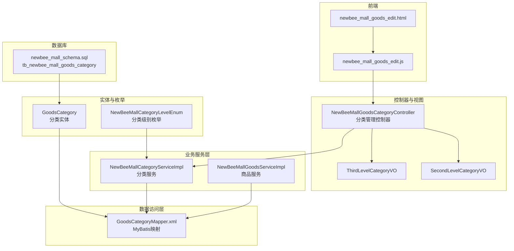
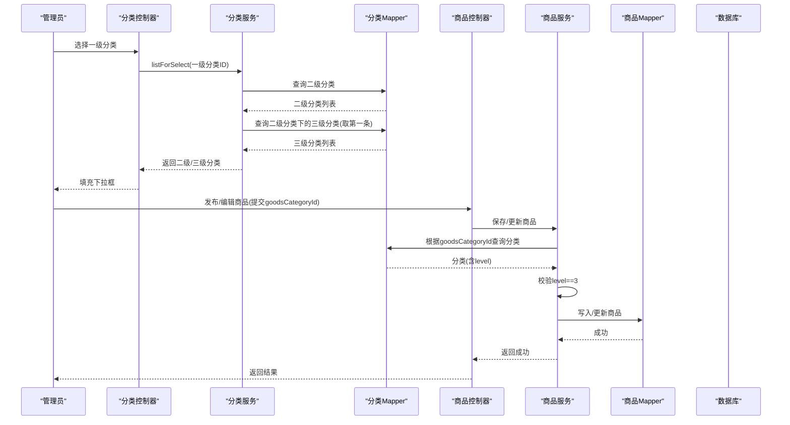
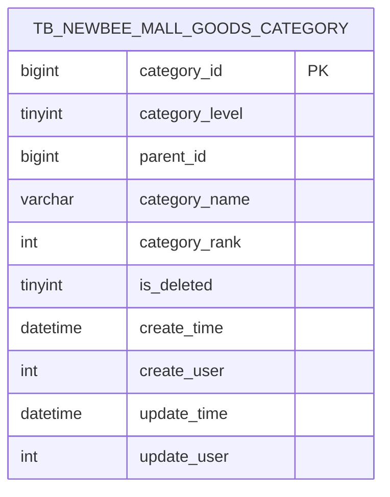
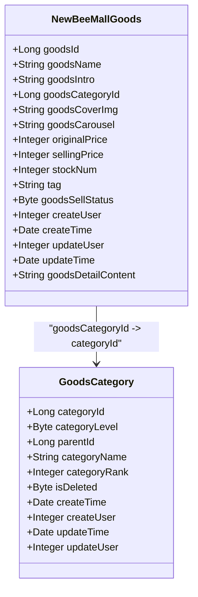
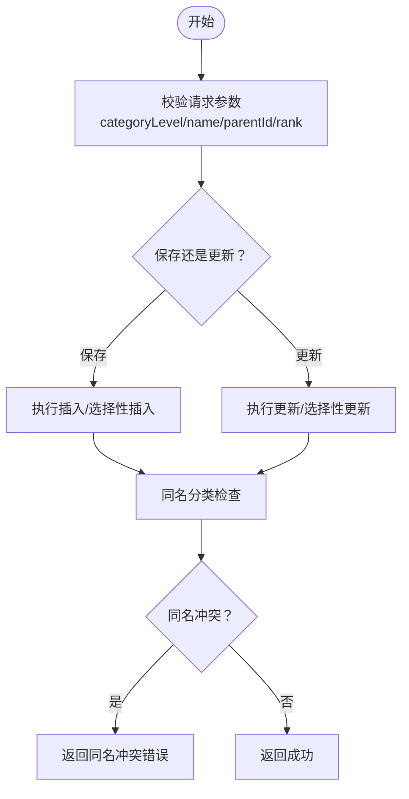
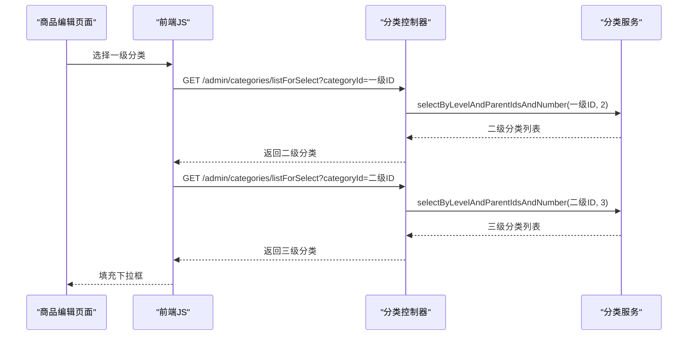
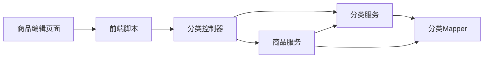

# 三级分类设计

<cite>
**本文引用的文件**
- [GoodsCategory.java](file://src/main/java/ltd/newbee/mall/entity/GoodsCategory.java)
- [NewBeeMallCategoryLevelEnum.java](file://src/main/java/ltd/newbee/mall/common/NewBeeMallCategoryLevelEnum.java)
- [GoodsCategoryMapper.xml](file://src/main/resources/mapper/GoodsCategoryMapper.xml)
- [NewBeeMallGoods.java](file://src/main/java/ltd/newbee/mall/entity/NewBeeMallGoods.java)
- [newbee_mall_schema.sql](file://src/main/resources/newbee_mall_schema.sql)
- [NewBeeMallCategoryServiceImpl.java](file://src/main/java/ltd/newbee/mall/service/impl/NewBeeMallCategoryServiceImpl.java)
- [NewBeeMallGoodsCategoryController.java](file://src/main/java/ltd/newbee/mall/controller/admin/NewBeeMallGoodsCategoryController.java)
- [ThirdLevelCategoryVO.java](file://src/main/java/ltd/newbee/mall/controller/vo/ThirdLevelCategoryVO.java)
- [SecondLevelCategoryVO.java](file://src/main/java/ltd/newbee/mall/controller/vo/SecondLevelCategoryVO.java)
- [NewBeeMallGoodsServiceImpl.java](file://src/main/java/ltd/newbee/mall/service/impl/NewBeeMallGoodsServiceImpl.java)
- [newbee_mall_goods_edit.html](file://src/main/resources/templates/admin/newbee_mall_goods_edit.html)
- [newbee_mall_goods_edit.js](file://src/main/resources/static/admin/dist/js/newbee_mall_goods_edit.js)
</cite>

## 目录
1. [引言](#引言)
2. [项目结构](#项目结构)
3. [核心组件](#核心组件)
4. [架构总览](#架构总览)
5. [详细组件分析](#详细组件分析)
6. [依赖分析](#依赖分析)
7. [性能考虑](#性能考虑)
8. [故障排查指南](#故障排查指南)
9. [结论](#结论)

## 引言
本设计文档聚焦于newbee-mall系统中“商品三级分类”的设计与实现，重点阐述category_level=3时的设计要点、业务规则与数据约束，明确三级分类作为商品直接归属的最小分类单元的职责边界，并说明其与商品实体NewBeeMallGoods的关联关系（通过goodsCategoryId字段）。同时，结合后台管理端的分类维护流程与前端联动逻辑，解释三级分类在商品发布、编辑与前台展示中的关键作用，并给出其在购物车、订单等下游模块中的数据传递方式建议。

## 项目结构
围绕三级分类设计，涉及的主要代码与资源如下：
- 实体与枚举：GoodsCategory、NewBeeMallCategoryLevelEnum
- 数据访问层：GoodsCategoryMapper.xml
- 业务服务层：NewBeeMallCategoryServiceImpl、NewBeeMallGoodsServiceImpl
- 控制器与视图：NewBeeMallGoodsCategoryController、ThirdLevelCategoryVO、SecondLevelCategoryVO
- 前端模板与脚本：newbee_mall_goods_edit.html、newbee_mall_goods_edit.js
- 数据库Schema：newbee_mall_schema.sql

图表来源
- [GoodsCategory.java](file://src/main/java/ltd/newbee/mall/entity/GoodsCategory.java#L1-L137)
- [NewBeeMallCategoryLevelEnum.java](file://src/main/java/ltd/newbee/mall/common/NewBeeMallCategoryLevelEnum.java#L1-L59)
- [GoodsCategoryMapper.xml](file://src/main/resources/mapper/GoodsCategoryMapper.xml#L1-L212)
- [NewBeeMallCategoryServiceImpl.java](file://src/main/java/ltd/newbee/mall/service/impl/NewBeeMallCategoryServiceImpl.java#L1-L168)
- [NewBeeMallGoodsServiceImpl.java](file://src/main/java/ltd/newbee/mall/service/impl/NewBeeMallGoodsServiceImpl.java#L1-L139)
- [NewBeeMallGoodsCategoryController.java](file://src/main/java/ltd/newbee/mall/controller/admin/NewBeeMallGoodsCategoryController.java#L1-L173)
- [ThirdLevelCategoryVO.java](file://src/main/java/ltd/newbee/mall/controller/vo/ThirdLevelCategoryVO.java#L1-L48)
- [SecondLevelCategoryVO.java](file://src/main/java/ltd/newbee/mall/controller/vo/SecondLevelCategoryVO.java#L1-L100)
- [newbee_mall_goods_edit.html](file://src/main/resources/templates/admin/newbee_mall_goods_edit.html#L45-L64)
- [newbee_mall_goods_edit.js](file://src/main/resources/static/admin/dist/js/newbee_mall_goods_edit.js#L292-L357)
- [newbee_mall_schema.sql](file://src/main/resources/newbee_mall_schema.sql#L1-L250)

章节来源
- [GoodsCategory.java](file://src/main/java/ltd/newbee/mall/entity/GoodsCategory.java#L1-L137)
- [GoodsCategoryMapper.xml](file://src/main/resources/mapper/GoodsCategoryMapper.xml#L1-L212)
- [NewBeeMallCategoryServiceImpl.java](file://src/main/java/ltd/newbee/mall/service/impl/NewBeeMallCategoryServiceImpl.java#L1-L168)
- [NewBeeMallGoodsServiceImpl.java](file://src/main/java/ltd/newbee/mall/service/impl/NewBeeMallGoodsServiceImpl.java#L1-L139)
- [NewBeeMallGoodsCategoryController.java](file://src/main/java/ltd/newbee/mall/controller/admin/NewBeeMallGoodsCategoryController.java#L1-L173)
- [newbee_mall_goods_edit.html](file://src/main/resources/templates/admin/newbee_mall_goods_edit.html#L45-L64)
- [newbee_mall_goods_edit.js](file://src/main/resources/static/admin/dist/js/newbee_mall_goods_edit.js#L292-L357)
- [newbee_mall_schema.sql](file://src/main/resources/newbee_mall_schema.sql#L1-L250)

## 核心组件
- GoodsCategory实体：承载分类的主键、级别、父级、名称、排序、软删标记与审计字段。
- NewBeeMallCategoryLevelEnum：定义分类级别常量，其中LEVEL_THREE对应category_level=3。
- GoodsCategoryMapper.xml：提供按级别、父级、名称等条件查询与分页能力，支持软删除。
- NewBeeMallCategoryServiceImpl：提供分类树构建、查询与维护能力，包含三级分类的检索与组装。
- NewBeeMallGoodsServiceImpl：在商品新增/编辑时校验goodsCategoryId必须指向三级分类。
- 控制器与VO：Admin端分类管理接口与前端联动，提供二级/三级联动选择。
- 前端模板与脚本：页面渲染与AJAX联动，动态填充二级/三级分类下拉框。
- 数据库Schema：tb_newbee_mall_goods_category表结构，包含category_level、parent_id、category_name等字段。

章节来源
- [GoodsCategory.java](file://src/main/java/ltd/newbee/mall/entity/GoodsCategory.java#L1-L137)
- [NewBeeMallCategoryLevelEnum.java](file://src/main/java/ltd/newbee/mall/common/NewBeeMallCategoryLevelEnum.java#L1-L59)
- [GoodsCategoryMapper.xml](file://src/main/resources/mapper/GoodsCategoryMapper.xml#L1-L212)
- [NewBeeMallCategoryServiceImpl.java](file://src/main/java/ltd/newbee/mall/service/impl/NewBeeMallCategoryServiceImpl.java#L1-L168)
- [NewBeeMallGoodsServiceImpl.java](file://src/main/java/ltd/newbee/mall/service/impl/NewBeeMallGoodsServiceImpl.java#L1-L139)
- [NewBeeMallGoodsCategoryController.java](file://src/main/java/ltd/newbee/mall/controller/admin/NewBeeMallGoodsCategoryController.java#L1-L173)
- [ThirdLevelCategoryVO.java](file://src/main/java/ltd/newbee/mall/controller/vo/ThirdLevelCategoryVO.java#L1-L48)
- [SecondLevelCategoryVO.java](file://src/main/java/ltd/newbee/mall/controller/vo/SecondLevelCategoryVO.java#L1-L100)
- [newbee_mall_goods_edit.html](file://src/main/resources/templates/admin/newbee_mall_goods_edit.html#L45-L64)
- [newbee_mall_goods_edit.js](file://src/main/resources/static/admin/dist/js/newbee_mall_goods_edit.js#L292-L357)
- [newbee_mall_schema.sql](file://src/main/resources/newbee_mall_schema.sql#L1-L250)

## 架构总览
三级分类在系统中的角色定位：
- 作为商品的直接归属层级，三级分类是商品发布与展示的最小粒度单位。
- 商品实体NewBeeMallGoods通过goodsCategoryId与三级分类建立一对一绑定关系。
- 后台管理端提供分类树的增删改查与联动选择，前端通过AJAX动态加载二级/三级分类。
- 商品服务在保存/更新时强制校验goodsCategoryId必须指向category_level=3的分类。

图表来源
- [NewBeeMallGoodsCategoryController.java](file://src/main/java/ltd/newbee/mall/controller/admin/NewBeeMallGoodsCategoryController.java#L70-L99)
- [NewBeeMallCategoryServiceImpl.java](file://src/main/java/ltd/newbee/mall/service/impl/NewBeeMallCategoryServiceImpl.java#L91-L167)
- [GoodsCategoryMapper.xml](file://src/main/resources/mapper/GoodsCategoryMapper.xml#L63-L77)
- [NewBeeMallGoodsServiceImpl.java](file://src/main/java/ltd/newbee/mall/service/impl/NewBeeMallGoodsServiceImpl.java#L48-L98)
- [newbee_mall_goods_edit.html](file://src/main/resources/templates/admin/newbee_mall_goods_edit.html#L45-L64)
- [newbee_mall_goods_edit.js](file://src/main/resources/static/admin/dist/js/newbee_mall_goods_edit.js#L292-L357)

## 详细组件分析

### 1) 三级分类实体与数据库Schema
- 实体字段要点
  - categoryId：分类主键
  - categoryLevel：分类级别(1/2/3)
  - parentId：父级分类ID，三级分类的parentId必须指向有效的二级分类
  - categoryName：分类名称
  - categoryRank：排序权重
  - isDeleted：软删除标记
  - 审计字段：createTime/updateTime/createUser/updateUser
- 数据库表结构
  - 表tb_newbee_mall_goods_category包含上述字段，其中category_level、parent_id、category_name等为关键索引字段
  - 通过is_deleted=0实现软删除，避免物理删除造成数据关联问题

图表来源
- [newbee_mall_schema.sql](file://src/main/resources/newbee_mall_schema.sql#L1-L250)
- [GoodsCategory.java](file://src/main/java/ltd/newbee/mall/entity/GoodsCategory.java#L1-L137)

章节来源
- [GoodsCategory.java](file://src/main/java/ltd/newbee/mall/entity/GoodsCategory.java#L1-L137)
- [newbee_mall_schema.sql](file://src/main/resources/newbee_mall_schema.sql#L1-L250)

### 2) 三级分类与商品实体的关联关系
- 关联字段：NewBeeMallGoods.goodsCategoryId 指向 GoodsCategory.categoryId
- 业务约束：
  - 新增/编辑商品时，必须传入goodsCategoryId，且该分类必须存在且级别为3
  - 若传入的分类不存在或非三级分类，服务层返回错误提示
- 作用：
  - 三级分类是商品的直接归属，决定商品在前台的展示路径与搜索归类
  - 后续统计、报表、推荐等均可基于三级分类维度聚合

图表来源
- [NewBeeMallGoods.java](file://src/main/java/ltd/newbee/mall/entity/NewBeeMallGoods.java#L1-L202)
- [GoodsCategory.java](file://src/main/java/ltd/newbee/mall/entity/GoodsCategory.java#L1-L137)

章节来源
- [NewBeeMallGoods.java](file://src/main/java/ltd/newbee/mall/entity/NewBeeMallGoods.java#L1-L202)
- [NewBeeMallGoodsServiceImpl.java](file://src/main/java/ltd/newbee/mall/service/impl/NewBeeMallGoodsServiceImpl.java#L48-L98)

### 3) 三级分类的业务规则与校验
- 分类级别枚举：LEVEL_THREE=3，用于服务层判断
- 商品保存/更新校验：
  - 通过GoodsCategoryMapper根据goodsCategoryId查询分类
  - 校验分类存在且categoryLevel==3，否则返回“分类参数错误”
- 分类维护校验：
  - 控制器对新增/修改请求进行参数完整性校验
  - 保存时检查同名分类冲突
  - 更新时排除自身ID的同名冲突

图表来源
- [NewBeeMallGoodsCategoryController.java](file://src/main/java/ltd/newbee/mall/controller/admin/NewBeeMallGoodsCategoryController.java#L101-L141)
- [NewBeeMallCategoryServiceImpl.java](file://src/main/java/ltd/newbee/mall/service/impl/NewBeeMallCategoryServiceImpl.java#L47-L75)
- [GoodsCategoryMapper.xml](file://src/main/resources/mapper/GoodsCategoryMapper.xml#L1-L212)

章节来源
- [NewBeeMallCategoryLevelEnum.java](file://src/main/java/ltd/newbee/mall/common/NewBeeMallCategoryLevelEnum.java#L1-L59)
- [NewBeeMallGoodsCategoryController.java](file://src/main/java/ltd/newbee/mall/controller/admin/NewBeeMallGoodsCategoryController.java#L101-L141)
- [NewBeeMallCategoryServiceImpl.java](file://src/main/java/ltd/newbee/mall/service/impl/NewBeeMallCategoryServiceImpl.java#L47-L75)
- [GoodsCategoryMapper.xml](file://src/main/resources/mapper/GoodsCategoryMapper.xml#L1-L212)

### 4) 前后端联动与三级分类展示
- 前端模板newbee_mall_goods_edit.html提供三级分类下拉框
- newbee_mall_goods_edit.js监听一级/二级分类变更，通过AJAX请求listForSelect接口，动态填充二级/三级分类
- 分类服务NewBeeMallCategoryServiceImpl在getCategoriesForSearch中，当请求为三级分类时，向上回溯二级分类并返回同级三级分类列表，用于搜索页面包屑与同级导航

图表来源
- [newbee_mall_goods_edit.html](file://src/main/resources/templates/admin/newbee_mall_goods_edit.html#L45-L64)
- [newbee_mall_goods_edit.js](file://src/main/resources/static/admin/dist/js/newbee_mall_goods_edit.js#L292-L357)
- [NewBeeMallGoodsCategoryController.java](file://src/main/java/ltd/newbee/mall/controller/admin/NewBeeMallGoodsCategoryController.java#L70-L99)
- [NewBeeMallCategoryServiceImpl.java](file://src/main/java/ltd/newbee/mall/service/impl/NewBeeMallCategoryServiceImpl.java#L144-L167)

章节来源
- [newbee_mall_goods_edit.html](file://src/main/resources/templates/admin/newbee_mall_goods_edit.html#L45-L64)
- [newbee_mall_goods_edit.js](file://src/main/resources/static/admin/dist/js/newbee_mall_goods_edit.js#L292-L357)
- [NewBeeMallGoodsCategoryController.java](file://src/main/java/ltd/newbee/mall/controller/admin/NewBeeMallGoodsCategoryController.java#L70-L99)
- [NewBeeMallCategoryServiceImpl.java](file://src/main/java/ltd/newbee/mall/service/impl/NewBeeMallCategoryServiceImpl.java#L144-L167)

### 5) 三级分类在商品发布/编辑/展示中的关键作用
- 发布/编辑阶段：
  - 必须选择三级分类，否则拒绝保存
  - 三级分类作为商品的最终归属，决定商品在前台的分类路径
- 展示阶段：
  - 搜索页通过三级分类向上回溯二级分类，形成面包屑导航
  - 商品详情页可基于三级分类进行相关推荐与同级商品筛选

章节来源
- [NewBeeMallGoodsServiceImpl.java](file://src/main/java/ltd/newbee/mall/service/impl/NewBeeMallGoodsServiceImpl.java#L48-L98)
- [NewBeeMallCategoryServiceImpl.java](file://src/main/java/ltd/newbee/mall/service/impl/NewBeeMallCategoryServiceImpl.java#L144-L167)

### 6) 三级分类在购物车、订单等下游模块中的数据传递
- 数据传递方式建议：
  - 购物车/订单模块在落单时应持有商品的goodsCategoryId（即三级分类ID）
  - 订单明细中可保留三级分类ID，便于后续按三级分类维度进行销售统计、报表分析与运营决策
- 一致性保障：
  - 若三级分类被删除（软删除），需确保商品仍能正常下单与售后，但不应再出现在前台搜索/展示中
  - 建议在订单模块对三级分类ID进行有效性校验，若不可用则回退到二级分类或统一兜底策略

[本节为通用设计建议，不直接分析具体文件，故无章节来源]

## 依赖分析
- 分类服务依赖分类Mapper进行查询与分页
- 商品服务依赖分类Mapper进行分类有效性校验
- 控制器依赖服务层完成业务处理
- 前端通过AJAX与控制器交互，动态加载二级/三级分类

图表来源
- [NewBeeMallGoodsCategoryController.java](file://src/main/java/ltd/newbee/mall/controller/admin/NewBeeMallGoodsCategoryController.java#L1-L173)
- [NewBeeMallCategoryServiceImpl.java](file://src/main/java/ltd/newbee/mall/service/impl/NewBeeMallCategoryServiceImpl.java#L1-L168)
- [NewBeeMallGoodsServiceImpl.java](file://src/main/java/ltd/newbee/mall/service/impl/NewBeeMallGoodsServiceImpl.java#L1-L139)
- [GoodsCategoryMapper.xml](file://src/main/resources/mapper/GoodsCategoryMapper.xml#L1-L212)
- [newbee_mall_goods_edit.html](file://src/main/resources/templates/admin/newbee_mall_goods_edit.html#L45-L64)
- [newbee_mall_goods_edit.js](file://src/main/resources/static/admin/dist/js/newbee_mall_goods_edit.js#L292-L357)

章节来源
- [NewBeeMallGoodsCategoryController.java](file://src/main/java/ltd/newbee/mall/controller/admin/NewBeeMallGoodsCategoryController.java#L1-L173)
- [NewBeeMallCategoryServiceImpl.java](file://src/main/java/ltd/newbee/mall/service/impl/NewBeeMallCategoryServiceImpl.java#L1-L168)
- [NewBeeMallGoodsServiceImpl.java](file://src/main/java/ltd/newbee/mall/service/impl/NewBeeMallGoodsServiceImpl.java#L1-L139)
- [GoodsCategoryMapper.xml](file://src/main/resources/mapper/GoodsCategoryMapper.xml#L1-L212)
- [newbee_mall_goods_edit.html](file://src/main/resources/templates/admin/newbee_mall_goods_edit.html#L45-L64)
- [newbee_mall_goods_edit.js](file://src/main/resources/static/admin/dist/js/newbee_mall_goods_edit.js#L292-L357)

## 性能考虑
- 分类查询与分页：
  - GoodsCategoryMapper.xml提供按category_level、parent_id、is_deleted过滤的查询与总数统计，支持分页
  - 建议在parent_id与category_level上建立合适索引，提升树形查询效率
- 商品保存/更新校验：
  - 商品服务在保存/更新时仅进行一次分类查询，复杂度O(1)，性能开销较小
- 前端联动：
  - 通过AJAX按需加载二级/三级分类，避免一次性渲染大量选项，降低页面压力

[本节为通用性能建议，不直接分析具体文件，故无章节来源]

## 故障排查指南
- 常见错误与定位
  - 商品保存失败，提示“分类参数错误”：检查传入的goodsCategoryId是否存在且categoryLevel=3
  - 分类保存失败，提示“同名分类已存在”：检查同级别下是否已有同名分类
  - 分类删除失败：确认传入的ids是否为空或数据库执行失败
- 排查步骤
  - 后台接口：核对控制器参数校验与服务层返回结果
  - 数据访问：核对Mapper的SQL条件与返回值
  - 前端联动：检查AJAX请求是否正确，返回数据结构是否符合预期

章节来源
- [NewBeeMallGoodsServiceImpl.java](file://src/main/java/ltd/newbee/mall/service/impl/NewBeeMallGoodsServiceImpl.java#L48-L98)
- [NewBeeMallCategoryServiceImpl.java](file://src/main/java/ltd/newbee/mall/service/impl/NewBeeMallCategoryServiceImpl.java#L47-L75)
- [NewBeeMallGoodsCategoryController.java](file://src/main/java/ltd/newbee/mall/controller/admin/NewBeeMallGoodsCategoryController.java#L101-L141)

## 结论
三级分类在newbee-mall系统中承担商品直接归属的最小粒度职责，其设计要点包括：
- 严格约束：三级分类的parentId必须指向有效的二级分类
- 明确边界：商品只能绑定到三级分类，确保商品与分类的强关联
- 前后端协同：通过Admin端的联动选择与校验，保障数据一致性
- 下游扩展：在购物车、订单等模块中以三级分类ID作为数据传递载体，支撑后续统计与运营分析