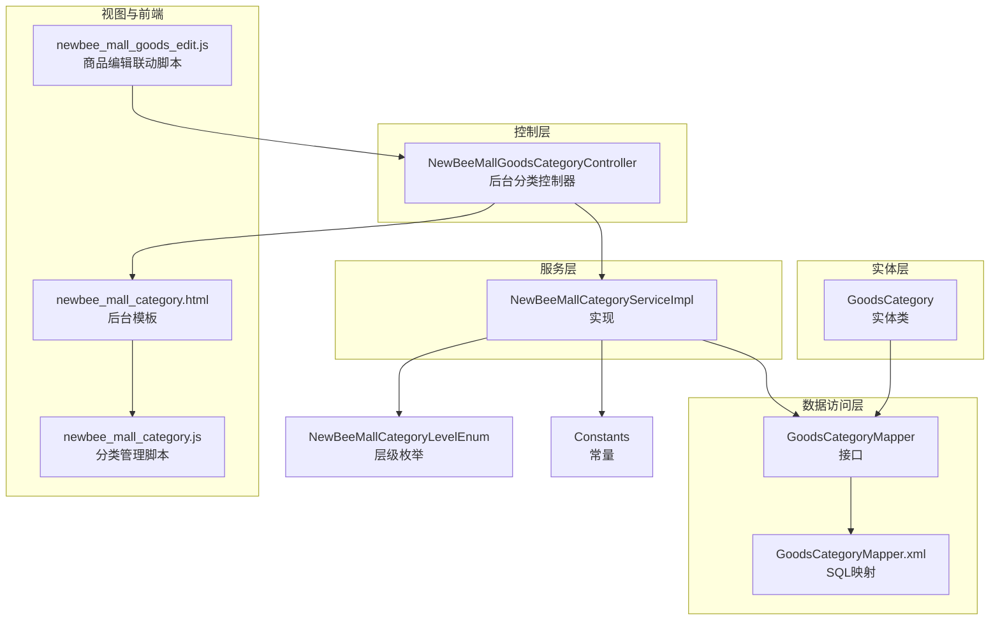
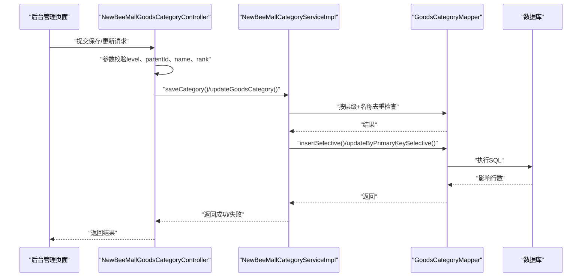
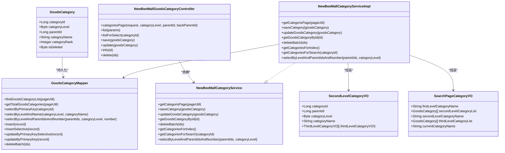
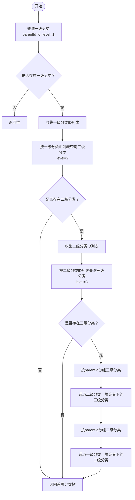
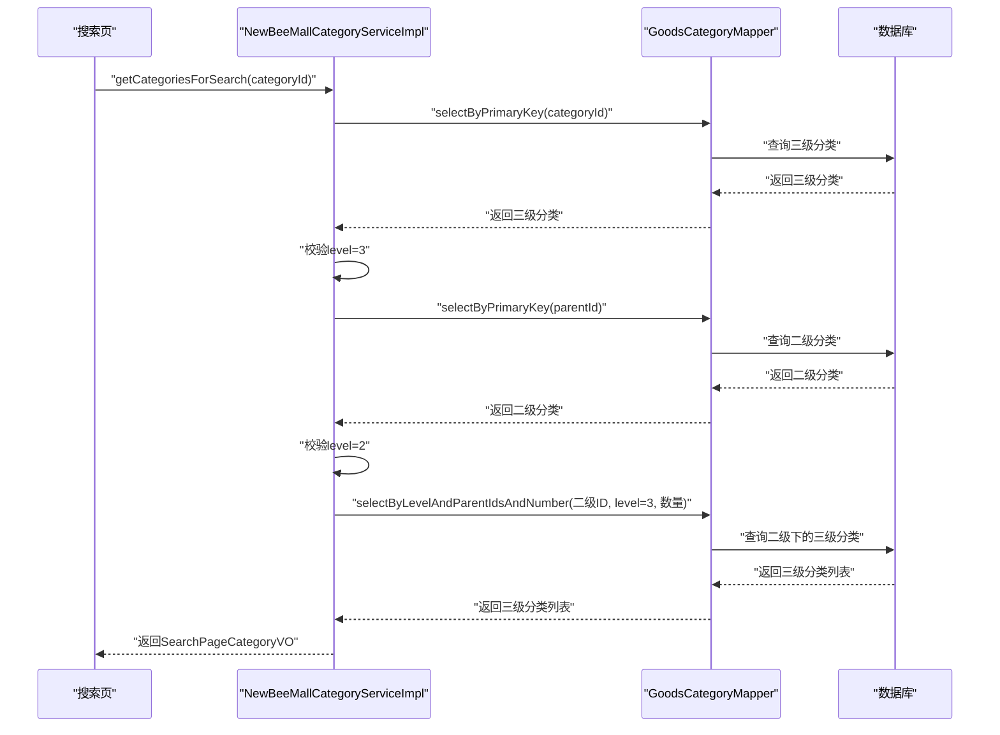
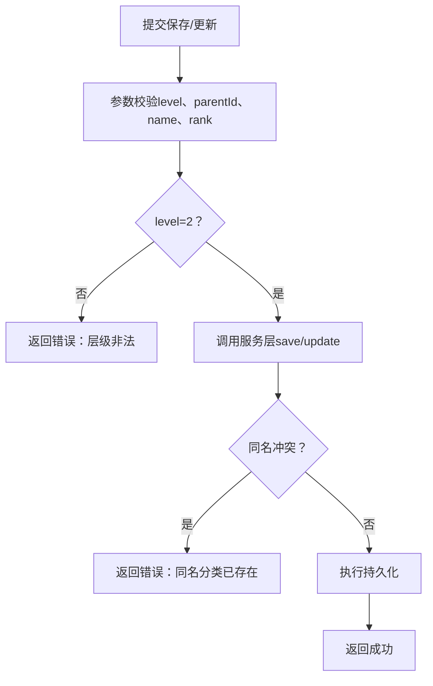
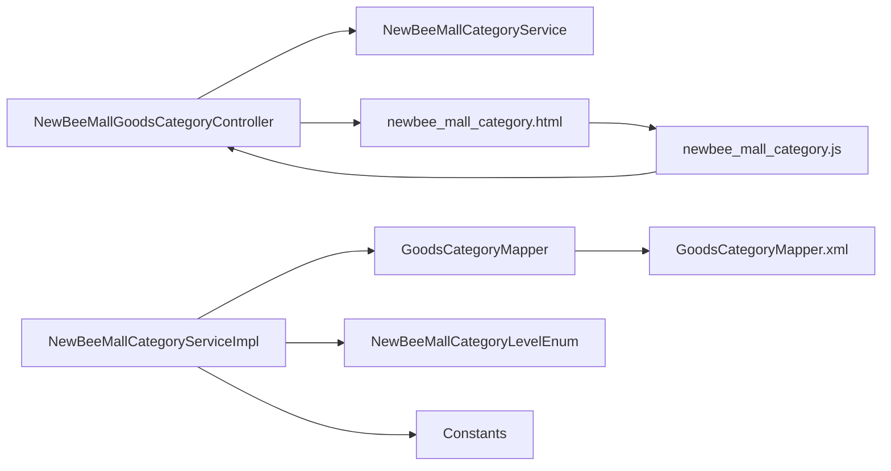

# 二级分类设计

<cite>
**本文引用的文件**
- [GoodsCategory.java](file://src/main/java/ltd/newbee/mall/entity/GoodsCategory.java)
- [NewBeeMallCategoryService.java](file://src/main/java/ltd/newbee/mall/service/NewBeeMallCategoryService.java)
- [NewBeeMallCategoryServiceImpl.java](file://src/main/java/ltd/newbee/mall/service/impl/NewBeeMallCategoryServiceImpl.java)
- [NewBeeMallGoodsCategoryController.java](file://src/main/java/ltd/newbee/mall/controller/admin/NewBeeMallGoodsCategoryController.java)
- [GoodsCategoryMapper.java](file://src/main/java/ltd/newbee/mall/dao/GoodsCategoryMapper.java)
- [GoodsCategoryMapper.xml](file://src/main/resources/mapper/GoodsCategoryMapper.xml)
- [NewBeeMallCategoryLevelEnum.java](file://src/main/java/ltd/newbee/mall/common/NewBeeMallCategoryLevelEnum.java)
- [Constants.java](file://src/main/java/ltd/newbee/mall/common/Constants.java)
- [SecondLevelCategoryVO.java](file://src/main/java/ltd/newbee/mall/controller/vo/SecondLevelCategoryVO.java)
- [SearchPageCategoryVO.java](file://src/main/java/ltd/newbee/mall/controller/vo/SearchPageCategoryVO.java)
- [newbee_mall_category.html](file://src/main/resources/templates/admin/newbee_mall_category.html)
- [newbee_mall_category.js](file://src/main/resources/static/admin/dist/js/newbee_mall_category.js)
- [newbee_mall_goods_edit.js](file://src/main/resources/static/admin/dist/js/newbee_mall_goods_edit.js)
</cite>

## 目录
1. [引言](#引言)
2. [项目结构](#项目结构)
3. [核心组件](#核心组件)
4. [架构总览](#架构总览)
5. [详细组件分析](#详细组件分析)
6. [依赖分析](#依赖分析)
7. [性能考虑](#性能考虑)
8. [故障排查指南](#故障排查指南)
9. [结论](#结论)
10. [附录](#附录)

## 引言
本设计文档聚焦于newbee-mall系统中“商品二级分类”的设计与实现，围绕category_level=2的层级关系、业务逻辑与前后端交互展开。重点说明二级分类如何通过parentId关联到一级分类，形成树状结构；结合GoodsCategory实体类，阐述其在商品导航路径中的作用，以及在首页与搜索页的展示策略；同时明确后台管理中对二级分类的增删改查操作限制，确保其父节点必须为一级分类，并给出服务层NewBeeMallCategoryService的调用示例与关键流程。

## 项目结构
围绕二级分类的关键代码分布在以下层次：
- 实体层：GoodsCategory实体类，承载分类字段与层级标识
- 数据访问层：GoodsCategoryMapper接口与MyBatis映射文件，提供按层级与父ID查询、分页等能力
- 服务层：NewBeeMallCategoryService接口与实现，负责首页与搜索页的分类树构建、后台分页与CRUD
- 控制器层：Admin端分类控制器，提供后台管理界面与API
- 视图与前端：后台分类管理页面与JS交互脚本，支持联动选择与保存更新
- 枚举与常量：NewBeeMallCategoryLevelEnum定义层级枚举，Constants定义首页与搜索页的展示数量

图表来源
- [GoodsCategory.java](file://src/main/java/ltd/newbee/mall/entity/GoodsCategory.java#L1-L137)
- [GoodsCategoryMapper.java](file://src/main/java/ltd/newbee/mall/dao/GoodsCategoryMapper.java#L1-L39)
- [GoodsCategoryMapper.xml](file://src/main/resources/mapper/GoodsCategoryMapper.xml#L1-L212)
- [NewBeeMallCategoryService.java](file://src/main/java/ltd/newbee/mall/service/NewBeeMallCategoryService.java#L1-L60)
- [NewBeeMallCategoryServiceImpl.java](file://src/main/java/ltd/newbee/mall/service/impl/NewBeeMallCategoryServiceImpl.java#L1-L168)
- [NewBeeMallGoodsCategoryController.java](file://src/main/java/ltd/newbee/mall/controller/admin/NewBeeMallGoodsCategoryController.java#L1-L173)
- [NewBeeMallCategoryLevelEnum.java](file://src/main/java/ltd/newbee/mall/common/NewBeeMallCategoryLevelEnum.java#L1-L59)
- [Constants.java](file://src/main/java/ltd/newbee/mall/common/Constants.java#L1-L48)
- [newbee_mall_category.html](file://src/main/resources/templates/admin/newbee_mall_category.html#L1-L124)
- [newbee_mall_category.js](file://src/main/resources/static/admin/dist/js/newbee_mall_category.js#L100-L136)
- [newbee_mall_goods_edit.js](file://src/main/resources/static/admin/dist/js/newbee_mall_goods_edit.js#L292-L357)

章节来源
- [GoodsCategory.java](file://src/main/java/ltd/newbee/mall/entity/GoodsCategory.java#L1-L137)
- [GoodsCategoryMapper.java](file://src/main/java/ltd/newbee/mall/dao/GoodsCategoryMapper.java#L1-L39)
- [GoodsCategoryMapper.xml](file://src/main/resources/mapper/GoodsCategoryMapper.xml#L1-L212)
- [NewBeeMallCategoryService.java](file://src/main/java/ltd/newbee/mall/service/NewBeeMallCategoryService.java#L1-L60)
- [NewBeeMallCategoryServiceImpl.java](file://src/main/java/ltd/newbee/mall/service/impl/NewBeeMallCategoryServiceImpl.java#L1-L168)
- [NewBeeMallGoodsCategoryController.java](file://src/main/java/ltd/newbee/mall/controller/admin/NewBeeMallGoodsCategoryController.java#L1-L173)
- [NewBeeMallCategoryLevelEnum.java](file://src/main/java/ltd/newbee/mall/common/NewBeeMallCategoryLevelEnum.java#L1-L59)
- [Constants.java](file://src/main/java/ltd/newbee/mall/common/Constants.java#L1-L48)
- [newbee_mall_category.html](file://src/main/resources/templates/admin/newbee_mall_category.html#L1-L124)
- [newbee_mall_category.js](file://src/main/resources/static/admin/dist/js/newbee_mall_category.js#L100-L136)
- [newbee_mall_goods_edit.js](file://src/main/resources/static/admin/dist/js/newbee_mall_goods_edit.js#L292-L357)

## 核心组件
- GoodsCategory实体类：包含categoryId、categoryLevel、parentId、categoryName、categoryRank、isDeleted等字段，用于描述分类的唯一标识、层级、父节点、名称、排序与逻辑删除标记
- GoodsCategoryMapper接口与XML映射：提供按层级与父ID集合查询、分页查询、统计总数、按主键查询、批量软删除、插入与更新等能力
- NewBeeMallCategoryService接口与实现：提供后台分页、保存/更新分类、批量删除、首页分类树构建、搜索页分类树构建、按层级与父ID集合查询等方法
- NewBeeMallGoodsCategoryController：后台分类管理的REST接口，负责参数校验、分页查询、保存/更新、详情查询、批量删除、联动选择等
- VO类：SecondLevelCategoryVO用于首页二级分类展示，SearchPageCategoryVO用于搜索页导航路径展示
- 枚举与常量：NewBeeMallCategoryLevelEnum定义LEVEL_ONE/LEVEL_TWO/LEVEL_THREE，Constants定义首页与搜索页的分类展示数量

章节来源
- [GoodsCategory.java](file://src/main/java/ltd/newbee/mall/entity/GoodsCategory.java#L1-L137)
- [GoodsCategoryMapper.java](file://src/main/java/ltd/newbee/mall/dao/GoodsCategoryMapper.java#L1-L39)
- [GoodsCategoryMapper.xml](file://src/main/resources/mapper/GoodsCategoryMapper.xml#L1-L212)
- [NewBeeMallCategoryService.java](file://src/main/java/ltd/newbee/mall/service/NewBeeMallCategoryService.java#L1-L60)
- [NewBeeMallCategoryServiceImpl.java](file://src/main/java/ltd/newbee/mall/service/impl/NewBeeMallCategoryServiceImpl.java#L1-L168)
- [NewBeeMallGoodsCategoryController.java](file://src/main/java/ltd/newbee/mall/controller/admin/NewBeeMallGoodsCategoryController.java#L1-L173)
- [SecondLevelCategoryVO.java](file://src/main/java/ltd/newbee/mall/controller/vo/SecondLevelCategoryVO.java#L1-L69)
- [SearchPageCategoryVO.java](file://src/main/java/ltd/newbee/mall/controller/vo/SearchPageCategoryVO.java#L1-L71)
- [NewBeeMallCategoryLevelEnum.java](file://src/main/java/ltd/newbee/mall/common/NewBeeMallCategoryLevelEnum.java#L1-L59)
- [Constants.java](file://src/main/java/ltd/newbee/mall/common/Constants.java#L1-L48)

## 架构总览
二级分类在系统中的职责与交互如下：
- 层级约束：category_level=2的分类必须由category_level=1的父节点创建与关联，通过parentId指向一级分类
- 数据模型：GoodsCategory作为统一实体，GoodsCategoryMapper提供按层级与父ID集合查询的能力，支撑首页与搜索页的树形结构
- 服务编排：NewBeeMallCategoryServiceImpl在首页构建时先取一级分类，再取二级分类，再取三级分类，组装成树；在搜索页根据当前三级分类向上回溯至二级分类，并列出二级分类下的三级分类
- 后台管理：Admin端控制器负责参数校验、分页、保存/更新、删除与联动选择，确保新增/修改时category_level与parentId合法

图表来源
- [NewBeeMallGoodsCategoryController.java](file://src/main/java/ltd/newbee/mall/controller/admin/NewBeeMallGoodsCategoryController.java#L100-L141)
- [NewBeeMallCategoryServiceImpl.java](file://src/main/java/ltd/newbee/mall/service/impl/NewBeeMallCategoryServiceImpl.java#L47-L75)
- [GoodsCategoryMapper.xml](file://src/main/resources/mapper/GoodsCategoryMapper.xml#L56-L62)
- [GoodsCategoryMapper.xml](file://src/main/resources/mapper/GoodsCategoryMapper.xml#L166-L198)

## 详细组件分析

### GoodsCategory实体类与树状结构
- 字段说明
  - categoryId：分类唯一标识
  - categoryLevel：分类层级（1/2/3）
  - parentId：父分类ID，二级分类的父节点必须为一级分类
  - categoryName：分类名称
  - categoryRank：排序权重，用于首页与搜索页的排序
  - isDeleted：逻辑删除标记
- 树状关系
  - 一级分类：parentId=0
  - 二级分类：categoryLevel=2，parentId指向某一个一级分类
  - 三级分类：categoryLevel=3，parentId指向某一个二级分类
- 导航路径作用
  - 在首页：先取一级分类，再取对应二级分类，再取对应三级分类，形成“一级→二级→三级”的导航树
  - 在搜索页：当用户点击三级分类时，向上回溯到二级分类，并列出该二级分类下的所有三级分类，形成“当前三级→所属二级→二级下全部三级”的导航路径

图表来源
- [GoodsCategory.java](file://src/main/java/ltd/newbee/mall/entity/GoodsCategory.java#L1-L137)
- [GoodsCategoryMapper.java](file://src/main/java/ltd/newbee/mall/dao/GoodsCategoryMapper.java#L1-L39)
- [GoodsCategoryMapper.xml](file://src/main/resources/mapper/GoodsCategoryMapper.xml#L1-L212)
- [NewBeeMallCategoryService.java](file://src/main/java/ltd/newbee/mall/service/NewBeeMallCategoryService.java#L1-L60)
- [NewBeeMallCategoryServiceImpl.java](file://src/main/java/ltd/newbee/mall/service/impl/NewBeeMallCategoryServiceImpl.java#L1-L168)
- [NewBeeMallGoodsCategoryController.java](file://src/main/java/ltd/newbee/mall/controller/admin/NewBeeMallGoodsCategoryController.java#L1-L173)
- [SecondLevelCategoryVO.java](file://src/main/java/ltd/newbee/mall/controller/vo/SecondLevelCategoryVO.java#L1-L69)
- [SearchPageCategoryVO.java](file://src/main/java/ltd/newbee/mall/controller/vo/SearchPageCategoryVO.java#L1-L71)

章节来源
- [GoodsCategory.java](file://src/main/java/ltd/newbee/mall/entity/GoodsCategory.java#L1-L137)
- [GoodsCategoryMapper.xml](file://src/main/resources/mapper/GoodsCategoryMapper.xml#L63-L77)
- [NewBeeMallCategoryServiceImpl.java](file://src/main/java/ltd/newbee/mall/service/impl/NewBeeMallCategoryServiceImpl.java#L91-L161)
- [SecondLevelCategoryVO.java](file://src/main/java/ltd/newbee/mall/controller/vo/SecondLevelCategoryVO.java#L1-L69)
- [SearchPageCategoryVO.java](file://src/main/java/ltd/newbee/mall/controller/vo/SearchPageCategoryVO.java#L1-L71)

### 首页分类树构建（含二级分类）
- 一级分类：按category_level=1且parentId=0，取固定数量（由常量定义），用于首页展示
- 二级分类：按每个一级分类的categoryId作为parent_id，取全部二级分类
- 三级分类：按每个二级分类的categoryId作为parent_id，取全部三级分类
- 组装逻辑：以一级分类为根，挂载对应的二级分类；每个二级分类挂载其下的三级分类，最终形成“一级→二级→三级”的树

图表来源
- [NewBeeMallCategoryServiceImpl.java](file://src/main/java/ltd/newbee/mall/service/impl/NewBeeMallCategoryServiceImpl.java#L91-L142)
- [Constants.java](file://src/main/java/ltd/newbee/mall/common/Constants.java#L24-L24)

章节来源
- [NewBeeMallCategoryServiceImpl.java](file://src/main/java/ltd/newbee/mall/service/impl/NewBeeMallCategoryServiceImpl.java#L91-L142)
- [Constants.java](file://src/main/java/ltd/newbee/mall/common/Constants.java#L24-L24)

### 搜索页导航路径（含二级分类）
- 输入：当前三级分类的categoryId
- 处理：先按categoryId查询三级分类，确认其level=3；再按parentId查询二级分类，确认其level=2；最后按二级分类的categoryId查询其下的三级分类（限定数量）
- 输出：当前三级分类名、所属二级分类名、二级分类下的三级分类列表

图表来源
- [NewBeeMallCategoryServiceImpl.java](file://src/main/java/ltd/newbee/mall/service/impl/NewBeeMallCategoryServiceImpl.java#L144-L161)
- [GoodsCategoryMapper.xml](file://src/main/resources/mapper/GoodsCategoryMapper.xml#L63-L77)
- [GoodsCategoryMapper.xml](file://src/main/resources/mapper/GoodsCategoryMapper.xml#L63-L77)

章节来源
- [NewBeeMallCategoryServiceImpl.java](file://src/main/java/ltd/newbee/mall/service/impl/NewBeeMallCategoryServiceImpl.java#L144-L161)
- [SearchPageCategoryVO.java](file://src/main/java/ltd/newbee/mall/controller/vo/SearchPageCategoryVO.java#L1-L71)

### 后台管理：二级分类的增删改查与父子关系约束
- 新增/修改
  - 参数校验：categoryLevel、categoryName、parentId、categoryRank均不能为空
  - 保存：调用服务层saveCategory，内部进行同名去重检查（按层级+名称）
  - 更新：调用服务层updateGoodsCategory，先按主键查询存在性，再进行同名去重检查
- 删除
  - 批量删除：调用服务层deleteBatch，底层执行软删除（is_deleted置1）
- 联动选择
  - 当选择一级分类时，返回该一级分类下的全部二级分类，以及二级分类列表中第一条数据下的全部三级分类
  - 当选择二级分类时，返回该二级分类下的全部三级分类
- 父子关系约束
  - 新增/修改时，parentId必须指向一个存在的分类；在控制器层面，listForSelect会拒绝三级分类作为父节点
  - 服务层在首页与搜索页的查询中，严格按层级与父ID集合进行过滤，确保树状关系正确

图表来源
- [NewBeeMallGoodsCategoryController.java](file://src/main/java/ltd/newbee/mall/controller/admin/NewBeeMallGoodsCategoryController.java#L100-L141)
- [NewBeeMallCategoryServiceImpl.java](file://src/main/java/ltd/newbee/mall/service/impl/NewBeeMallCategoryServiceImpl.java#L47-L75)
- [GoodsCategoryMapper.xml](file://src/main/resources/mapper/GoodsCategoryMapper.xml#L56-L62)

章节来源
- [NewBeeMallGoodsCategoryController.java](file://src/main/java/ltd/newbee/mall/controller/admin/NewBeeMallGoodsCategoryController.java#L42-L171)
- [NewBeeMallCategoryServiceImpl.java](file://src/main/java/ltd/newbee/mall/service/impl/NewBeeMallCategoryServiceImpl.java#L47-L75)
- [GoodsCategoryMapper.xml](file://src/main/resources/mapper/GoodsCategoryMapper.xml#L56-L62)

### 前端交互与展示策略
- 后台分类管理页面
  - 页面模板包含隐藏字段categoryLevel、parentId、backParentId，用于区分当前层级与父节点
  - 保存按钮触发AJAX请求，向后台提交categoryLevel、parentId、categoryRank等
- 商品编辑联动
  - 选择一级分类后，自动加载该一级分类下的全部二级分类与二级分类下第一条的全部三级分类
  - 选择二级分类后，自动加载该二级分类下的全部三级分类
- 展示策略
  - 首页：按常量定义的一级分类最大数量展示一级分类，每个一级分类下展示其对应的二级分类及二级分类下的三级分类
  - 搜索页：当用户进入某三级分类时，展示“当前三级→所属二级→二级下全部三级”的导航路径

章节来源
- [newbee_mall_category.html](file://src/main/resources/templates/admin/newbee_mall_category.html#L72-L98)
- [newbee_mall_category.js](file://src/main/resources/static/admin/dist/js/newbee_mall_category.js#L100-L136)
- [newbee_mall_goods_edit.js](file://src/main/resources/static/admin/dist/js/newbee_mall_goods_edit.js#L292-L357)
- [Constants.java](file://src/main/java/ltd/newbee/mall/common/Constants.java#L24-L24)

## 依赖分析
- 组件耦合
  - 控制器依赖服务层接口，服务层依赖数据访问层接口
  - 服务层实现依赖枚举与常量，用于层级判断与数量限制
  - 实体类与Mapper映射文件强耦合，通过XML中的SQL实现按层级与父ID集合查询
- 外部依赖
  - MyBatis作为ORM框架，GoodsCategoryMapper.xml提供SQL映射
  - Thymeleaf模板引擎渲染后台管理页面
  - 前端使用jQuery、SweetAlert2、jqGrid等库

图表来源
- [NewBeeMallGoodsCategoryController.java](file://src/main/java/ltd/newbee/mall/controller/admin/NewBeeMallGoodsCategoryController.java#L1-L173)
- [NewBeeMallCategoryService.java](file://src/main/java/ltd/newbee/mall/service/NewBeeMallCategoryService.java#L1-L60)
- [NewBeeMallCategoryServiceImpl.java](file://src/main/java/ltd/newbee/mall/service/impl/NewBeeMallCategoryServiceImpl.java#L1-L168)
- [GoodsCategoryMapper.java](file://src/main/java/ltd/newbee/mall/dao/GoodsCategoryMapper.java#L1-L39)
- [GoodsCategoryMapper.xml](file://src/main/resources/mapper/GoodsCategoryMapper.xml#L1-L212)
- [NewBeeMallCategoryLevelEnum.java](file://src/main/java/ltd/newbee/mall/common/NewBeeMallCategoryLevelEnum.java#L1-L59)
- [Constants.java](file://src/main/java/ltd/newbee/mall/common/Constants.java#L1-L48)
- [newbee_mall_category.html](file://src/main/resources/templates/admin/newbee_mall_category.html#L1-L124)
- [newbee_mall_category.js](file://src/main/resources/static/admin/dist/js/newbee_mall_category.js#L100-L136)

章节来源
- [NewBeeMallGoodsCategoryController.java](file://src/main/java/ltd/newbee/mall/controller/admin/NewBeeMallGoodsCategoryController.java#L1-L173)
- [NewBeeMallCategoryServiceImpl.java](file://src/main/java/ltd/newbee/mall/service/impl/NewBeeMallCategoryServiceImpl.java#L1-L168)
- [GoodsCategoryMapper.xml](file://src/main/resources/mapper/GoodsCategoryMapper.xml#L1-L212)

## 性能考虑
- 查询优化
  - 使用selectByLevelAndParentIdsAndNumber按层级与父ID集合一次性查询，减少多次往返
  - 通过order by category_rank desc与可选limit控制排序与数量，避免全表扫描
- 缓存建议
  - 首页分类树可考虑缓存，降低频繁查询数据库的压力
- 分页与数量限制
  - 后台分页查询与首页/搜索页的数量限制，避免一次性加载过多数据

## 故障排查指南
- 常见问题
  - 新增/修改失败：检查参数是否完整（level、parentId、name、rank），确认同名分类是否已存在
  - 父节点无效：确认parentId指向的父节点层级是否为一级分类
  - 删除失败：确认传入的ids是否为空或不存在
- 排查步骤
  - 查看控制器参数校验与服务层返回结果
  - 检查Mapper的SQL映射是否正确执行
  - 核对枚举与常量定义是否一致

章节来源
- [NewBeeMallGoodsCategoryController.java](file://src/main/java/ltd/newbee/mall/controller/admin/NewBeeMallGoodsCategoryController.java#L100-L171)
- [NewBeeMallCategoryServiceImpl.java](file://src/main/java/ltd/newbee/mall/service/impl/NewBeeMallCategoryServiceImpl.java#L47-L75)
- [GoodsCategoryMapper.xml](file://src/main/resources/mapper/GoodsCategoryMapper.xml#L56-L62)

## 结论
newbee-mall系统通过GoodsCategory实体与GoodsCategoryMapper实现了清晰的三级分类树状结构，其中二级分类通过parentId严格关联到一级分类。服务层在首页与搜索页分别承担了树形结构构建与导航路径生成的任务，后台管理提供了完善的增删改查与联动选择能力，确保二级分类的父子关系与业务规则得到严格执行。通过枚举与常量的配合，系统在展示策略与性能方面也具备良好的可维护性与扩展性。

## 附录
- 服务层调用示例（路径参考）
  - 保存分类：POST /admin/categories/save（Body包含categoryLevel、parentId、categoryName、categoryRank）
  - 更新分类：POST /admin/categories/update（Body包含categoryId、categoryLevel、parentId、categoryName、categoryRank）
  - 获取二级/三级联动数据：GET /admin/categories/listForSelect?categoryId={id}
  - 分页查询：GET /admin/categories/list?page=&limit=&categoryLevel=&parentId=
  - 详情查询：GET /admin/categories/info/{id}
  - 批量删除：POST /admin/categories/delete（Body为id数组）

章节来源
- [NewBeeMallGoodsCategoryController.java](file://src/main/java/ltd/newbee/mall/controller/admin/NewBeeMallGoodsCategoryController.java#L54-L171)
- [NewBeeMallCategoryServiceImpl.java](file://src/main/java/ltd/newbee/mall/service/impl/NewBeeMallCategoryServiceImpl.java#L91-L161)
- [GoodsCategoryMapper.xml](file://src/main/resources/mapper/GoodsCategoryMapper.xml#L63-L77)