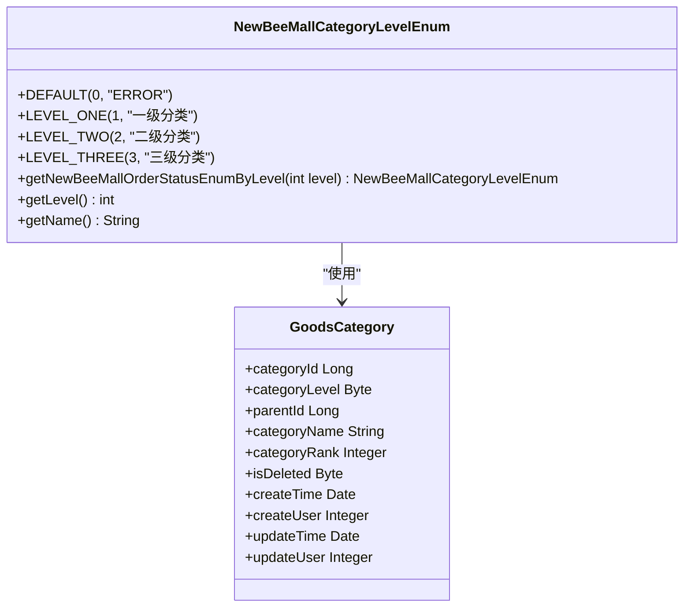
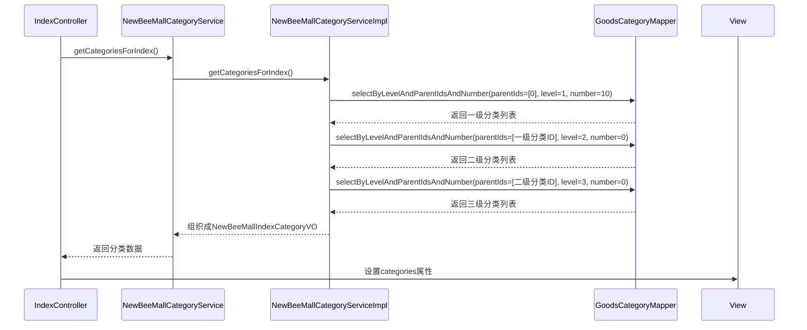
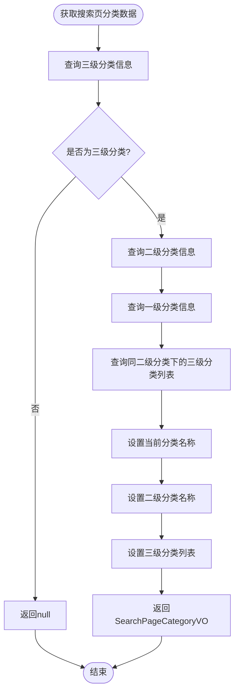
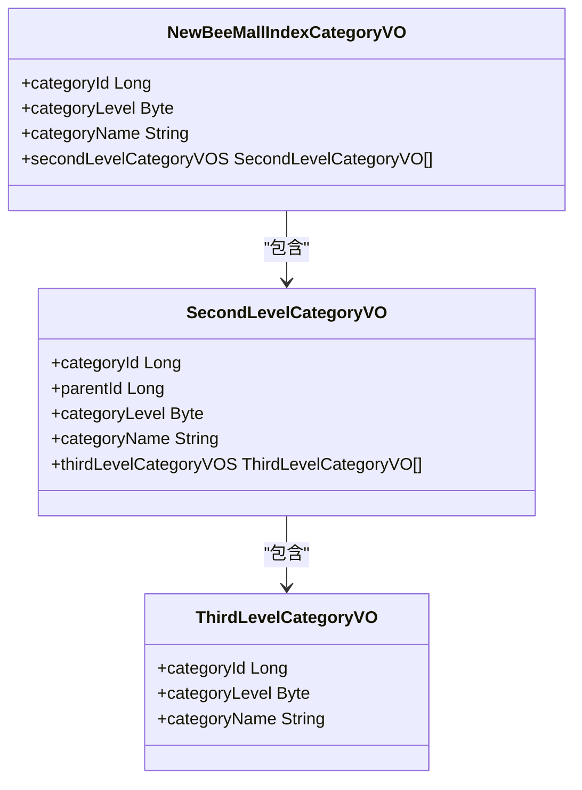

# 分类层级设计

<cite>
**本文档引用的文件**   
- [GoodsCategory.java](file://src/main/java/ltd/newbee/mall/entity/GoodsCategory.java)
- [NewBeeMallCategoryLevelEnum.java](file://src/main/java/ltd/newbee/mall/common/NewBeeMallCategoryLevelEnum.java)
- [GoodsCategoryMapper.java](file://src/main/java/ltd/newbee/mall/dao/GoodsCategoryMapper.java)
- [GoodsCategoryMapper.xml](file://src/main/resources/mapper/GoodsCategoryMapper.xml)
- [NewBeeMallCategoryService.java](file://src/main/java/ltd/newbee/mall/service/NewBeeMallCategoryService.java)
- [NewBeeMallCategoryServiceImpl.java](file://src/main/java/ltd/newbee/mall/service/impl/NewBeeMallCategoryServiceImpl.java)
- [NewBeeMallIndexCategoryVO.java](file://src/main/java/ltd/newbee/mall/controller/vo/NewBeeMallIndexCategoryVO.java)
- [SearchPageCategoryVO.java](file://src/main/java/ltd/newbee/mall/controller/vo/SearchPageCategoryVO.java)
- [SecondLevelCategoryVO.java](file://src/main/java/ltd/newbee/mall/controller/vo/SecondLevelCategoryVO.java)
- [ThirdLevelCategoryVO.java](file://src/main/java/ltd/newbee/mall/controller/vo/ThirdLevelCategoryVO.java)
- [Constants.java](file://src/main/java/ltd/newbee/mall/common/Constants.java)
- [NewBeeMallGoodsCategoryController.java](file://src/main/java/ltd/newbee/mall/controller/admin/NewBeeMallGoodsCategoryController.java)
- [IndexController.java](file://src/main/java/ltd/newbee/mall/controller/mall/IndexController.java)
- [newbee_mall_schema.sql](file://src/main/resources/newbee_mall_schema.sql)
</cite>

## 目录
1. [三级分类体系设计原理](#三级分类体系设计原理)
2. [category_level字段取值规则](#category_level字段取值规则)
3. [不同层级分类的展示逻辑](#不同层级分类的展示逻辑)
4. [分类层级数据结构](#分类层级数据结构)

## 三级分类体系设计原理

newbee-mall系统采用三级分类体系（一级、二级、三级）来组织商品分类，这种设计能够提供清晰的分类层次结构，便于用户浏览和查找商品。系统通过`tb_newbee_mall_goods_category`表中的`category_level`字段来标识分类的层级，其中1表示一级分类，2表示二级分类，3表示三级分类。

分类体系采用树形结构，通过`parent_id`字段建立父子关系。一级分类的`parent_id`为0，表示根节点；二级分类的`parent_id`指向对应的一级分类ID；三级分类的`parent_id`指向对应的二级分类ID。这种设计使得分类结构清晰，易于维护和扩展。

系统在设计上充分考虑了商城的业务需求，一级分类通常代表大的商品类别（如"家电 数码 手机"、"女装 男装 穿搭"），二级分类是对一级分类的细分（如"家电"、"数码"、"手机"），而三级分类则是最具体的商品类别（如"生活电器"、"厨房电器"、"扫地机器人"）。这种三级结构既不会过于复杂影响用户体验，又能提供足够的分类粒度来组织商品。

**Section sources**
- [newbee_mall_schema.sql](file://src/main/resources/newbee_mall_schema.sql#L1-L1024)
- [GoodsCategory.java](file://src/main/java/ltd/newbee/mall/entity/GoodsCategory.java#L1-L137)

## category_level字段取值规则

`tb_newbee_mall_goods_category`表中的`category_level`字段采用数值类型（TINYINT），其取值规则如下：
- 1：表示一级分类
- 2：表示二级分类  
- 3：表示三级分类

在Java实体类`GoodsCategory`中，`categoryLevel`属性为`Byte`类型，与数据库字段对应。系统通过`NewBeeMallCategoryLevelEnum`枚举类来定义和管理分类级别，该枚举类包含以下常量：
- `LEVEL_ONE(1, "一级分类")`
- `LEVEL_TWO(2, "二级分类")`
- `LEVEL_THREE(3, "三级分类")`

这种设计通过枚举类提供了类型安全和可读性，避免了直接使用魔法数字。在代码中，可以通过`NewBeeMallCategoryLevelEnum.getNewBeeMallOrderStatusEnumByLevel(level)`方法根据级别值获取对应的枚举实例。

数据库层面，`category_level`字段有默认值0和NOT NULL约束，确保每个分类都有明确的层级。在业务逻辑中，系统会对分类级别的合法性进行验证，例如在`NewBeeMallGoodsCategoryController`中，当获取分类列表时会检查`categoryLevel`参数是否在1-3范围内。

**Diagram sources**
- [NewBeeMallCategoryLevelEnum.java](file://src/main/java/ltd/newbee/mall/common/NewBeeMallCategoryLevelEnum.java#L1-L59)
- [GoodsCategory.java](file://src/main/java/ltd/newbee/mall/entity/GoodsCategory.java#L1-L137)

**Section sources**
- [NewBeeMallCategoryLevelEnum.java](file://src/main/java/ltd/newbee/mall/common/NewBeeMallCategoryLevelEnum.java#L1-L59)
- [GoodsCategory.java](file://src/main/java/ltd/newbee/mall/entity/GoodsCategory.java#L1-L137)
- [newbee_mall_schema.sql](file://src/main/resources/newbee_mall_schema.sql#L1-L1024)

## 不同层级分类的展示逻辑

### 首页导航栏展示逻辑

在商城首页，一级分类在导航栏中展示。`IndexController`通过调用`newBeeMallCategoryService.getCategoriesForIndex()`方法获取首页分类数据。该方法从数据库中查询一级分类（`category_level=1`），然后根据一级分类ID查询其下的二级分类，再根据二级分类ID查询其下的三级分类。

系统通过`Constants.INDEX_CATEGORY_NUMBER`常量（值为10）限制首页展示的一级分类数量，确保导航栏不会过于拥挤。查询结果被组织成`NewBeeMallIndexCategoryVO`对象，其中包含一级分类信息及其子分类的层级结构。

**Diagram sources**
- [IndexController.java](file://src/main/java/ltd/newbee/mall/controller/mall/IndexController.java#L1-L58)
- [NewBeeMallCategoryServiceImpl.java](file://src/main/java/ltd/newbee/mall/service/impl/NewBeeMallCategoryServiceImpl.java#L1-L168)
- [GoodsCategoryMapper.java](file://src/main/java/ltd/newbee/mall/dao/GoodsCategoryMapper.java#L1-L39)

### 商品搜索页展示逻辑

在商品搜索页，当用户选择某个三级分类进行搜索时，系统会显示该分类的完整路径。`NewBeeMallCategoryService.getCategoriesForSearch()`方法根据三级分类ID获取其对应的二级和一级分类信息。

该方法首先查询指定ID的分类，验证其是否为三级分类，然后通过`parent_id`查询其父级（二级分类），再查询二级分类的父级（一级分类）。同时，系统会查询该二级分类下的所有三级分类，以便在搜索页提供分类筛选功能。

系统通过`Constants.SEARCH_CATEGORY_NUMBER`常量（值为8）限制搜索页展示的三级分类数量。返回的`SearchPageCategoryVO`对象包含当前分类名称、二级分类名称和一级分类名称，以及同级的其他三级分类列表。

**Diagram sources**
- [NewBeeMallCategoryServiceImpl.java](file://src/main/java/ltd/newbee/mall/service/impl/NewBeeMallCategoryServiceImpl.java#L1-L168)
- [SearchPageCategoryVO.java](file://src/main/java/ltd/newbee/mall/controller/vo/SearchPageCategoryVO.java#L1-L71)

### 三级分类与商品的直接关联

在数据库设计中，商品与分类的关联是通过`tb_newbee_mall_goods_info`表的`goods_category_id`字段实现的，该字段直接关联到`tb_newbee_mall_goods_category`表的`category_id`。值得注意的是，商品是直接关联到三级分类的，而不是更高级别的分类。

这种设计确保了商品分类的精确性，每个商品都属于一个具体的三级分类。当需要查询某个一级或二级分类下的所有商品时，系统需要先获取该分类下的所有三级分类ID，然后查询这些三级分类下的商品。

在`NewBeeMallGoodsCategoryController`中，提供了`listForSelect`接口，用于在后台管理界面选择分类时展示层级结构。当选择一级分类时，会显示该一级分类下的所有二级分类，以及第一个二级分类下的所有三级分类；当选择二级分类时，会显示该二级分类下的所有三级分类。

**Section sources**
- [IndexController.java](file://src/main/java/ltd/newbee/mall/controller/mall/IndexController.java#L1-L58)
- [NewBeeMallCategoryServiceImpl.java](file://src/main/java/ltd/newbee/mall/service/impl/NewBeeMallCategoryServiceImpl.java#L1-L168)
- [NewBeeMallGoodsCategoryController.java](file://src/main/java/ltd/newbee/mall/controller/admin/NewBeeMallGoodsCategoryController.java#L1-L173)
- [SearchPageCategoryVO.java](file://src/main/java/ltd/newbee/mall/controller/vo/SearchPageCategoryVO.java#L1-L71)
- [newbee_mall_schema.sql](file://src/main/resources/newbee_mall_schema.sql#L1-L1024)

## 分类层级数据结构

系统通过一系列VO（View Object）类来组织和传输分类层级数据，这些类反映了分类的树形结构：

**Diagram sources**
- [NewBeeMallIndexCategoryVO.java](file://src/main/java/ltd/newbee/mall/controller/vo/NewBeeMallIndexCategoryVO.java#L1-L59)
- [SecondLevelCategoryVO.java](file://src/main/java/ltd/newbee/mall/controller/vo/SecondLevelCategoryVO.java#L1-L69)
- [ThirdLevelCategoryVO.java](file://src/main/java/ltd/newbee/mall/controller/vo/ThirdLevelCategoryVO.java#L1-L48)

**Section sources**
- [NewBeeMallIndexCategoryVO.java](file://src/main/java/ltd/newbee/mall/controller/vo/NewBeeMallIndexCategoryVO.java#L1-L59)
- [SecondLevelCategoryVO.java](file://src/main/java/ltd/newbee/mall/controller/vo/SecondLevelCategoryVO.java#L1-L69)
- [ThirdLevelCategoryVO.java](file://src/main/java/ltd/newbee/mall/controller/vo/ThirdLevelCategoryVO.java#L1-L48)