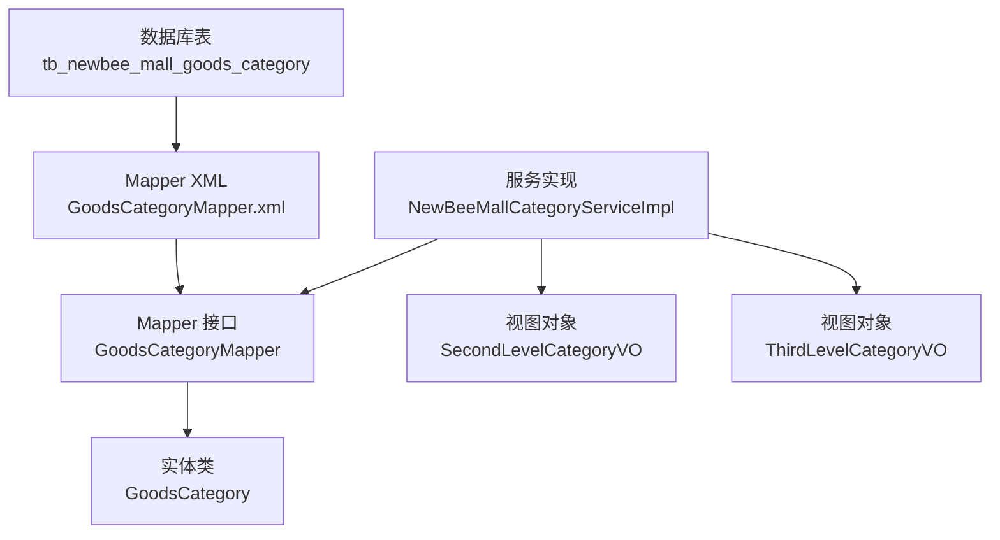
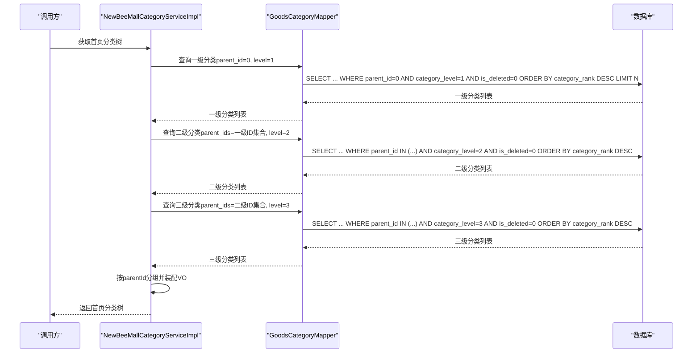
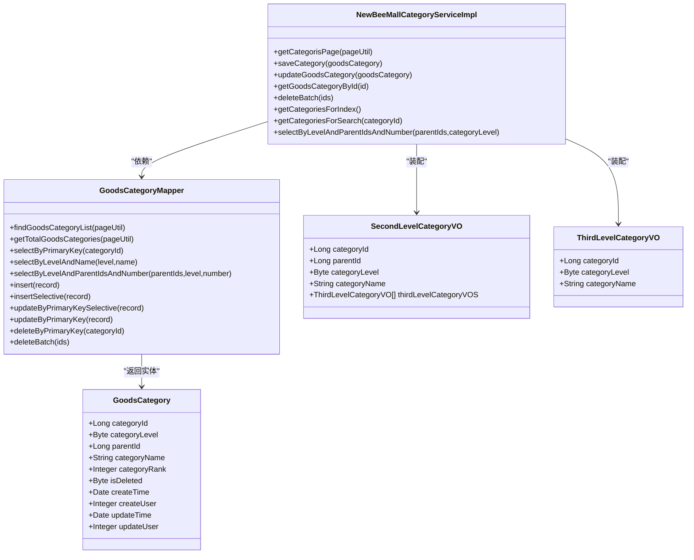
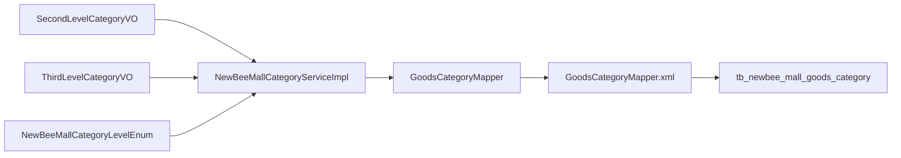

# 商品分类实体模型

<cite>
**本文引用的文件列表**
- [GoodsCategory.java](file://src/main/java/ltd/newbee/mall/entity/GoodsCategory.java)
- [GoodsCategoryMapper.java](file://src/main/java/ltd/newbee/mall/dao/GoodsCategoryMapper.java)
- [GoodsCategoryMapper.xml](file://src/main/resources/mapper/GoodsCategoryMapper.xml)
- [newbee_mall_schema.sql](file://src/main/resources/newbee_mall_schema.sql)
- [NewBeeMallCategoryLevelEnum.java](file://src/main/java/ltd/newbee/mall/common/NewBeeMallCategoryLevelEnum.java)
- [NewBeeMallCategoryServiceImpl.java](file://src/main/java/ltd/newbee/mall/service/impl/NewBeeMallCategoryServiceImpl.java)
- [SecondLevelCategoryVO.java](file://src/main/java/ltd/newbee/mall/controller/vo/SecondLevelCategoryVO.java)
- [ThirdLevelCategoryVO.java](file://src/main/java/ltd/newbee/mall/controller/vo/ThirdLevelCategoryVO.java)
</cite>

## 目录
1. [引言](#引言)
2. [项目结构](#项目结构)
3. [核心组件](#核心组件)
4. [架构总览](#架构总览)
5. [详细组件分析](#详细组件分析)
6. [依赖关系分析](#依赖关系分析)
7. [性能考量](#性能考量)
8. [故障排查指南](#故障排查指南)
9. [结论](#结论)

## 引言
本文件围绕 newbee-mall 系统的商品分类实体模型展开，基于数据库表 tb_newbee_mall_goods_category 的结构，结合 Java 实体类 GoodsCategory、MyBatis 映射 GoodsCategoryMapper 与 XML，以及服务层 NewBeeMallCategoryServiceImpl 的树形查询逻辑，系统化阐述三级分类体系（一级、二级、三级）的设计原理、父子关系维护与排序机制，并给出分类实体关系图与典型调用流程图，帮助开发者快速理解并正确使用分类模块。

## 项目结构
- 数据库层：tb_newbee_mall_goods_category 表定义了分类字段、约束与索引策略
- ORM 层：GoodsCategory 实体类与 GoodsCategoryMapper 接口及 XML 映射
- 业务层：NewBeeMallCategoryServiceImpl 提供首页与搜索页的树形分类组装能力
- 视图层：SecondLevelCategoryVO、ThirdLevelCategoryVO 作为前端展示的树形节点载体

图表来源
- [newbee_mall_schema.sql](file://src/main/resources/newbee_mall_schema.sql#L1-L120)
- [GoodsCategory.java](file://src/main/java/ltd/newbee/mall/entity/GoodsCategory.java#L1-L137)
- [GoodsCategoryMapper.java](file://src/main/java/ltd/newbee/mall/dao/GoodsCategoryMapper.java#L1-L39)
- [GoodsCategoryMapper.xml](file://src/main/resources/mapper/GoodsCategoryMapper.xml#L1-L212)
- [NewBeeMallCategoryServiceImpl.java](file://src/main/java/ltd/newbee/mall/service/impl/NewBeeMallCategoryServiceImpl.java#L1-L168)
- [SecondLevelCategoryVO.java](file://src/main/java/ltd/newbee/mall/controller/vo/SecondLevelCategoryVO.java#L1-L69)
- [ThirdLevelCategoryVO.java](file://src/main/java/ltd/newbee/mall/controller/vo/ThirdLevelCategoryVO.java#L1-L48)

章节来源
- [newbee_mall_schema.sql](file://src/main/resources/newbee_mall_schema.sql#L1-L120)
- [GoodsCategory.java](file://src/main/java/ltd/newbee/mall/entity/GoodsCategory.java#L1-L137)
- [GoodsCategoryMapper.java](file://src/main/java/ltd/newbee/mall/dao/GoodsCategoryMapper.java#L1-L39)
- [GoodsCategoryMapper.xml](file://src/main/resources/mapper/GoodsCategoryMapper.xml#L1-L212)
- [NewBeeMallCategoryServiceImpl.java](file://src/main/java/ltd/newbee/mall/service/impl/NewBeeMallCategoryServiceImpl.java#L1-L168)
- [SecondLevelCategoryVO.java](file://src/main/java/ltd/newbee/mall/controller/vo/SecondLevelCategoryVO.java#L1-L69)
- [ThirdLevelCategoryVO.java](file://src/main/java/ltd/newbee/mall/controller/vo/ThirdLevelCategoryVO.java#L1-L48)

## 核心组件
- 数据库表：tb_newbee_mall_goods_category
  - 字段与约束：主键、分类级别、父分类ID、分类名称、排序值、软删除标记、创建/更新时间与人员
  - 索引策略：主键索引；查询条件包含 is_deleted、category_level、parent_id 的 where 条件在 XML 中均有体现，建议在 parent_id、category_level 上建立复合索引以提升树形查询性能
- 实体类 GoodsCategory：与表字段一一对应，包含时间戳与创建/更新人员字段
- Mapper 接口与 XML：提供分页查询、总数统计、按级别与父ID批量查询、软删除更新、插入/更新等操作
- 服务实现 NewBeeMallCategoryServiceImpl：按首页与搜索页需求，组装三级分类树形结构
- 视图对象 VO：SecondLevelCategoryVO、ThirdLevelCategoryVO 用于前端渲染

章节来源
- [newbee_mall_schema.sql](file://src/main/resources/newbee_mall_schema.sql#L1-L120)
- [GoodsCategory.java](file://src/main/java/ltd/newbee/mall/entity/GoodsCategory.java#L1-L137)
- [GoodsCategoryMapper.java](file://src/main/java/ltd/newbee/mall/dao/GoodsCategoryMapper.java#L1-L39)
- [GoodsCategoryMapper.xml](file://src/main/resources/mapper/GoodsCategoryMapper.xml#L1-L212)
- [NewBeeMallCategoryServiceImpl.java](file://src/main/java/ltd/newbee/mall/service/impl/NewBeeMallCategoryServiceImpl.java#L90-L167)
- [SecondLevelCategoryVO.java](file://src/main/java/ltd/newbee/mall/controller/vo/SecondLevelCategoryVO.java#L1-L69)
- [ThirdLevelCategoryVO.java](file://src/main/java/ltd/newbee/mall/controller/vo/ThirdLevelCategoryVO.java#L1-L48)

## 架构总览
分类模块遵循经典的分层架构：DAO 层负责数据存取，Service 层负责业务编排，Controller 层负责对外暴露接口，VO 层负责跨层传输。树形结构的组装由服务层完成，先查一级，再查二级，最后查三级，然后按 parentId 进行分组与装配。

图表来源
- [NewBeeMallCategoryServiceImpl.java](file://src/main/java/ltd/newbee/mall/service/impl/NewBeeMallCategoryServiceImpl.java#L92-L142)
- [GoodsCategoryMapper.xml](file://src/main/resources/mapper/GoodsCategoryMapper.xml#L1-L212)

章节来源
- [NewBeeMallCategoryServiceImpl.java](file://src/main/java/ltd/newbee/mall/service/impl/NewBeeMallCategoryServiceImpl.java#L92-L142)
- [GoodsCategoryMapper.xml](file://src/main/resources/mapper/GoodsCategoryMapper.xml#L1-L212)

## 详细组件分析

### 数据库表结构与字段说明（tb_newbee_mall_goods_category）
- 主键：category_id（自增）
- 分类级别：category_level（1-一级，2-二级，3-三级）
- 父分类：parent_id（0表示顶级）
- 名称：category_name（唯一性校验通过 level+name）
- 排序：category_rank（数值越大越靠前）
- 软删除：is_deleted（0未删除，1已删除）
- 时间与人员：create_time/update_time/create_user/update_user

索引与约束建议
- 建议在 (category_level, parent_id) 上建立复合索引，以加速树形查询
- 建议在 (category_level, category_rank) 上建立复合索引，以加速首页展示排序
- 建议在 (category_level, category_name) 上建立唯一索引，避免同级重复名称

章节来源
- [newbee_mall_schema.sql](file://src/main/resources/newbee_mall_schema.sql#L1-L120)

### Java 实体类 GoodsCategory
- 字段映射：与表字段一一对应，包含时间戳与人员字段
- 设计要点：字段类型与数据库类型匹配；字符串字段提供 trim 处理；时间字段使用 JSON 序列化格式化输出

章节来源
- [GoodsCategory.java](file://src/main/java/ltd/newbee/mall/entity/GoodsCategory.java#L1-L137)

### Mapper 接口与 XML 映射
- 基础 CRUD：insert、insertSelective、updateByPrimaryKey、updateByPrimaryKeySelective、deleteByPrimaryKey（软删除）、deleteBatch
- 分页与统计：findGoodsCategoryList、getTotalGoodsCategories
- 树形查询：selectByLevelAndParentIdsAndNumber（按级别与父ID集合查询，支持限制数量）
- 唯一性校验：selectByLevelAndName（按级别与名称查询）

SQL 关键点
- 软删除：deleteByPrimaryKey 与 deleteBatch 更新 is_deleted=1
- 排序：首页与树形查询均按 category_rank 降序
- 条件过滤：XML 中对 category_level、parent_id、is_deleted 进行动态拼接

章节来源
- [GoodsCategoryMapper.java](file://src/main/java/ltd/newbee/mall/dao/GoodsCategoryMapper.java#L1-L39)
- [GoodsCategoryMapper.xml](file://src/main/resources/mapper/GoodsCategoryMapper.xml#L1-L212)

### 服务层：树形组装与排序
- 首页分类树：先查一级（固定数量），再查二级与三级，按 parentId 分组装配
- 搜索页分类树：从三级分类向上回溯到二级与一级，再列出二级下的三级分类
- 排序：统一按 category_rank 降序
- 唯一性：保存/更新时按 level+name 唯一性校验

章节来源
- [NewBeeMallCategoryServiceImpl.java](file://src/main/java/ltd/newbee/mall/service/impl/NewBeeMallCategoryServiceImpl.java#L92-L167)
- [NewBeeMallCategoryLevelEnum.java](file://src/main/java/ltd/newbee/mall/common/NewBeeMallCategoryLevelEnum.java#L1-L59)

### 视图对象：SecondLevelCategoryVO 与 ThirdLevelCategoryVO
- 作用：承载树形节点信息，便于前端渲染
- 关系：二级节点包含三级节点列表

章节来源
- [SecondLevelCategoryVO.java](file://src/main/java/ltd/newbee/mall/controller/vo/SecondLevelCategoryVO.java#L1-L69)
- [ThirdLevelCategoryVO.java](file://src/main/java/ltd/newbee/mall/controller/vo/ThirdLevelCategoryVO.java#L1-L48)

### 分类实体关系图

图表来源
- [GoodsCategory.java](file://src/main/java/ltd/newbee/mall/entity/GoodsCategory.java#L1-L137)
- [GoodsCategoryMapper.java](file://src/main/java/ltd/newbee/mall/dao/GoodsCategoryMapper.java#L1-L39)
- [NewBeeMallCategoryServiceImpl.java](file://src/main/java/ltd/newbee/mall/service/impl/NewBeeMallCategoryServiceImpl.java#L1-L168)
- [SecondLevelCategoryVO.java](file://src/main/java/ltd/newbee/mall/controller/vo/SecondLevelCategoryVO.java#L1-L69)
- [ThirdLevelCategoryVO.java](file://src/main/java/ltd/newbee/mall/controller/vo/ThirdLevelCategoryVO.java#L1-L48)

## 依赖关系分析
- 服务层依赖 Mapper 接口，Mapper 通过 XML 与数据库交互
- 服务层在首页与搜索页场景中，多次调用 selectByLevelAndParentIdsAndNumber 实现树形查询
- VO 层仅用于传输，不参与业务逻辑
- 枚举 NewBeeMallCategoryLevelEnum 提供级别常量，避免魔法数字

图表来源
- [NewBeeMallCategoryServiceImpl.java](file://src/main/java/ltd/newbee/mall/service/impl/NewBeeMallCategoryServiceImpl.java#L1-L168)
- [GoodsCategoryMapper.java](file://src/main/java/ltd/newbee/mall/dao/GoodsCategoryMapper.java#L1-L39)
- [GoodsCategoryMapper.xml](file://src/main/resources/mapper/GoodsCategoryMapper.xml#L1-L212)
- [NewBeeMallCategoryLevelEnum.java](file://src/main/java/ltd/newbee/mall/common/NewBeeMallCategoryLevelEnum.java#L1-L59)
- [SecondLevelCategoryVO.java](file://src/main/java/ltd/newbee/mall/controller/vo/SecondLevelCategoryVO.java#L1-L69)
- [ThirdLevelCategoryVO.java](file://src/main/java/ltd/newbee/mall/controller/vo/ThirdLevelCategoryVO.java#L1-L48)

章节来源
- [NewBeeMallCategoryServiceImpl.java](file://src/main/java/ltd/newbee/mall/service/impl/NewBeeMallCategoryServiceImpl.java#L1-L168)
- [GoodsCategoryMapper.java](file://src/main/java/ltd/newbee/mall/dao/GoodsCategoryMapper.java#L1-L39)
- [GoodsCategoryMapper.xml](file://src/main/resources/mapper/GoodsCategoryMapper.xml#L1-L212)
- [NewBeeMallCategoryLevelEnum.java](file://src/main/java/ltd/newbee/mall/common/NewBeeMallCategoryLevelEnum.java#L1-L59)
- [SecondLevelCategoryVO.java](file://src/main/java/ltd/newbee/mall/controller/vo/SecondLevelCategoryVO.java#L1-L69)
- [ThirdLevelCategoryVO.java](file://src/main/java/ltd/newbee/mall/controller/vo/ThirdLevelCategoryVO.java#L1-L48)

## 性能考量
- SQL 排序：首页与树形查询均按 category_rank 降序，建议在 (category_level, category_rank) 建立索引
- 树形查询：按 parent_id 与 category_level 过滤，建议在 (category_level, parent_id) 建立复合索引
- 分页：findGoodsCategoryList 支持 start/limit，建议结合索引避免全表扫描
- 软删除：deleteByPrimaryKey 与 deleteBatch 使用 is_deleted 标记，避免物理删除带来的索引维护成本

章节来源
- [GoodsCategoryMapper.xml](file://src/main/resources/mapper/GoodsCategoryMapper.xml#L1-L212)

## 故障排查指南
- 同级重复名称：保存/更新时按 level+name 唯一性校验，若提示相同分类已存在，请检查级别与名称组合
- 树形为空：确认 parent_id 是否为 0（一级）、category_level 是否正确、is_deleted 是否为 0
- 排序异常：确认 category_rank 是否按预期设置，SQL 中已按降序排序
- 删除失败：确认传入的 ids 是否为空，deleteBatch 会对数组元素逐个更新 is_deleted

章节来源
- [NewBeeMallCategoryServiceImpl.java](file://src/main/java/ltd/newbee/mall/service/impl/NewBeeMallCategoryServiceImpl.java#L47-L89)
- [GoodsCategoryMapper.xml](file://src/main/resources/mapper/GoodsCategoryMapper.xml#L1-L212)

## 结论
本分类实体模型以三级分类为核心，通过数据库表结构、实体类、Mapper/XML 映射与服务层的协同，实现了高效的树形查询与排序展示。建议在生产环境中补充复合索引以优化查询性能，并严格遵守级别与父ID的约束，确保树形结构的完整性与一致性。