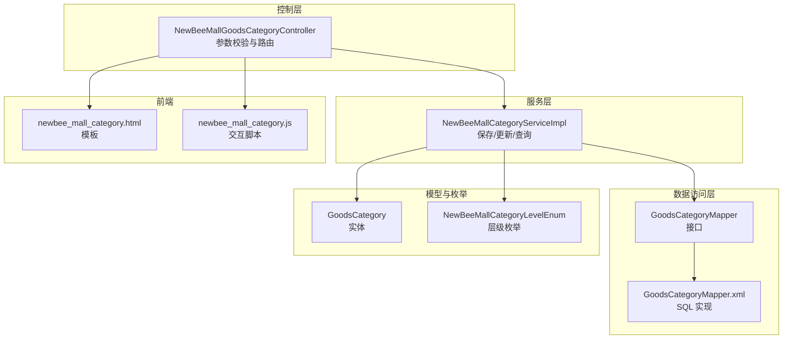
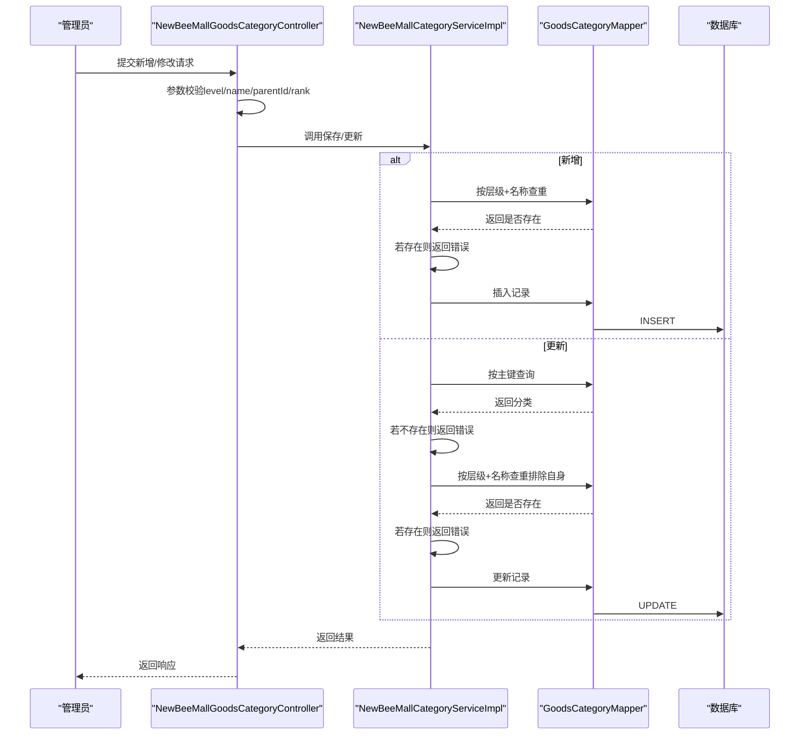
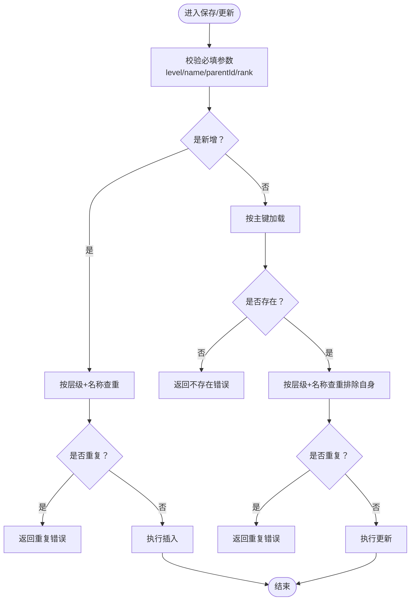
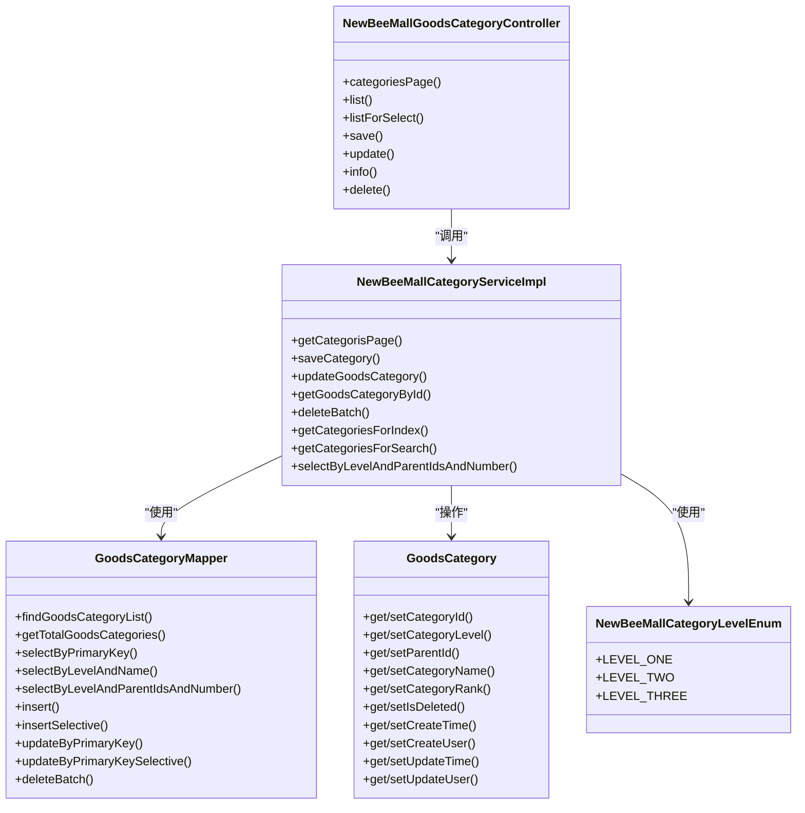

# 业务约束与规则

<cite>
**本文引用的文件**
- [NewBeeMallCategoryServiceImpl.java](file://src/main/java/ltd/newbee/mall/service/impl/NewBeeMallCategoryServiceImpl.java)
- [NewBeeMallGoodsCategoryController.java](file://src/main/java/ltd/newbee/mall/controller/admin/NewBeeMallGoodsCategoryController.java)
- [GoodsCategory.java](file://src/main/java/ltd/newbee/mall/entity/GoodsCategory.java)
- [NewBeeMallCategoryLevelEnum.java](file://src/main/java/ltd/newbee/mall/common/NewBeeMallCategoryLevelEnum.java)
- [GoodsCategoryMapper.java](file://src/main/java/ltd/newbee/mall/dao/GoodsCategoryMapper.java)
- [GoodsCategoryMapper.xml](file://src/main/resources/mapper/GoodsCategoryMapper.xml)
- [newbee_mall_category.html](file://src/main/resources/templates/admin/newbee_mall_category.html)
- [newbee_mall_category.js](file://src/main/resources/static/admin/dist/js/newbee_mall_category.js)
- [newbee_mall_schema.sql](file://src/main/resources/newbee_mall_schema.sql)
</cite>

## 目录
1. [引言](#引言)
2. [项目结构](#项目结构)
3. [核心组件](#核心组件)
4. [架构总览](#架构总览)
5. [详细组件分析](#详细组件分析)
6. [依赖分析](#依赖分析)
7. [性能考虑](#性能考虑)
8. [故障排查指南](#故障排查指南)
9. [结论](#结论)

## 引言
本文件聚焦于 newbee-mall 商品分类业务的约束与规则，围绕“新增/修改分类时 parent_id 的有效性校验”和“category_level 与父分类层级关系一致性校验”展开，结合服务层 NewBeeMallCategoryServiceImpl 的保存与更新流程，解释如何通过代码逻辑防止层级错乱与环状引用，并给出可操作的业务约束清单与排障建议。

## 项目结构
分类相关的关键代码分布在以下层次：
- 控制层：负责参数校验、请求转发与结果封装
- 服务层：负责业务规则与持久化调用
- 数据访问层：MyBatis 映射器与 SQL
- 实体与枚举：模型定义与层级枚举
- 前端模板与脚本：页面交互与提交数据

图表来源
- [NewBeeMallGoodsCategoryController.java](file://src/main/java/ltd/newbee/mall/controller/admin/NewBeeMallGoodsCategoryController.java#L1-L173)
- [NewBeeMallCategoryServiceImpl.java](file://src/main/java/ltd/newbee/mall/service/impl/NewBeeMallCategoryServiceImpl.java#L1-L168)
- [GoodsCategoryMapper.java](file://src/main/java/ltd/newbee/mall/dao/GoodsCategoryMapper.java#L1-L39)
- [GoodsCategoryMapper.xml](file://src/main/resources/mapper/GoodsCategoryMapper.xml#L1-L212)
- [GoodsCategory.java](file://src/main/java/ltd/newbee/mall/entity/GoodsCategory.java#L1-L137)
- [NewBeeMallCategoryLevelEnum.java](file://src/main/java/ltd/newbee/mall/common/NewBeeMallCategoryLevelEnum.java#L1-L59)
- [newbee_mall_category.html](file://src/main/resources/templates/admin/newbee_mall_category.html#L79-L96)
- [newbee_mall_category.js](file://src/main/resources/static/admin/dist/js/newbee_mall_category.js#L100-L136)

章节来源
- [NewBeeMallGoodsCategoryController.java](file://src/main/java/ltd/newbee/mall/controller/admin/NewBeeMallGoodsCategoryController.java#L1-L173)
- [NewBeeMallCategoryServiceImpl.java](file://src/main/java/ltd/newbee/mall/service/impl/NewBeeMallCategoryServiceImpl.java#L1-L168)
- [GoodsCategoryMapper.java](file://src/main/java/ltd/newbee/mall/dao/GoodsCategoryMapper.java#L1-L39)
- [GoodsCategoryMapper.xml](file://src/main/resources/mapper/GoodsCategoryMapper.xml#L1-L212)
- [GoodsCategory.java](file://src/main/java/ltd/newbee/mall/entity/GoodsCategory.java#L1-L137)
- [NewBeeMallCategoryLevelEnum.java](file://src/main/java/ltd/newbee/mall/common/NewBeeMallCategoryLevelEnum.java#L1-L59)
- [newbee_mall_category.html](file://src/main/resources/templates/admin/newbee_mall_category.html#L79-L96)
- [newbee_mall_category.js](file://src/main/resources/static/admin/dist/js/newbee_mall_category.js#L100-L136)

## 核心组件
- 控制层控制器负责接收请求、进行基础参数校验，并调用服务层执行业务逻辑。
- 服务层实现保存与更新的业务规则，包括同名校验、存在性校验等。
- 数据访问层提供按层级与父节点查询、插入与更新能力。
- 实体与枚举定义了分类的字段与层级枚举常量。

章节来源
- [NewBeeMallGoodsCategoryController.java](file://src/main/java/ltd/newbee/mall/controller/admin/NewBeeMallGoodsCategoryController.java#L101-L141)
- [NewBeeMallCategoryServiceImpl.java](file://src/main/java/ltd/newbee/mall/service/impl/NewBeeMallCategoryServiceImpl.java#L47-L75)
- [GoodsCategoryMapper.java](file://src/main/java/ltd/newbee/mall/dao/GoodsCategoryMapper.java#L24-L39)
- [GoodsCategory.java](file://src/main/java/ltd/newbee/mall/entity/GoodsCategory.java#L16-L68)
- [NewBeeMallCategoryLevelEnum.java](file://src/main/java/ltd/newbee/mall/common/NewBeeMallCategoryLevelEnum.java#L18-L59)

## 架构总览
从“新增/修改分类”的视角看，整体流程如下：
- 控制层接收请求，校验必填字段与参数范围
- 服务层执行业务规则（同名冲突、存在性、层级一致性）
- 数据访问层执行持久化操作
- 前端模板与脚本负责用户交互与数据提交

图表来源
- [NewBeeMallGoodsCategoryController.java](file://src/main/java/ltd/newbee/mall/controller/admin/NewBeeMallGoodsCategoryController.java#L101-L141)
- [NewBeeMallCategoryServiceImpl.java](file://src/main/java/ltd/newbee/mall/service/impl/NewBeeMallCategoryServiceImpl.java#L47-L75)
- [GoodsCategoryMapper.java](file://src/main/java/ltd/newbee/mall/dao/GoodsCategoryMapper.java#L24-L39)
- [GoodsCategoryMapper.xml](file://src/main/resources/mapper/GoodsCategoryMapper.xml#L56-L77)

## 详细组件分析

### 业务约束清单
针对 parent_id 有效性与 category_level 层级一致性，当前代码实现具备以下约束与限制：
- 新增时，按“层级 + 名称”进行唯一性校验，避免同层级同名分类重复
- 更新时，先按主键查询确认存在性；再按“层级 + 名称”查重（排除自身）
- 控制层对关键字段进行必填校验（层级、名称、父ID、排序值）
- 数据库表结构定义了 parent_id 默认值与层级枚举常量

注意：当前服务层未显式校验“parent_id 必须指向存在的分类或为 0”，也未显式校验“category_level 与父分类层级的关系”。这些约束在数据库层面由表结构与枚举常量提供基础保障，但服务层未做显式的层级关系校验。

章节来源
- [NewBeeMallCategoryServiceImpl.java](file://src/main/java/ltd/newbee/mall/service/impl/NewBeeMallCategoryServiceImpl.java#L47-L75)
- [NewBeeMallGoodsCategoryController.java](file://src/main/java/ltd/newbee/mall/controller/admin/NewBeeMallGoodsCategoryController.java#L101-L141)
- [GoodsCategoryMapper.xml](file://src/main/resources/mapper/GoodsCategoryMapper.xml#L72-L77)
- [NewBeeMallCategoryLevelEnum.java](file://src/main/java/ltd/newbee/mall/common/NewBeeMallCategoryLevelEnum.java#L18-L59)
- [newbee_mall_schema.sql](file://src/main/resources/newbee_mall_schema.sql#L72-L87)

### 保存与更新流程的代码级分析
- 新增保存
  - 先按“层级 + 名称”查重，避免同层级重复名称
  - 成功后执行插入
- 更新保存
  - 先按主键查询确认存在性
  - 再按“层级 + 名称”查重（排除自身）
  - 成功后执行更新

图表来源
- [NewBeeMallGoodsCategoryController.java](file://src/main/java/ltd/newbee/mall/controller/admin/NewBeeMallGoodsCategoryController.java#L101-L141)
- [NewBeeMallCategoryServiceImpl.java](file://src/main/java/ltd/newbee/mall/service/impl/NewBeeMallCategoryServiceImpl.java#L47-L75)
- [GoodsCategoryMapper.java](file://src/main/java/ltd/newbee/mall/dao/GoodsCategoryMapper.java#L24-L39)

章节来源
- [NewBeeMallCategoryServiceImpl.java](file://src/main/java/ltd/newbee/mall/service/impl/NewBeeMallCategoryServiceImpl.java#L47-L75)
- [GoodsCategoryMapper.java](file://src/main/java/ltd/newbee/mall/dao/GoodsCategoryMapper.java#L24-L39)

### parent_id 有效性与层级关系校验现状
- parent_id 有效性
  - 控制层未对 parent_id 进行存在性校验
  - 服务层未对 parent_id 是否指向有效分类进行校验
  - 数据库表结构允许 parent_id 为 0（根节点），但未强制外键约束
- category_level 与父层级关系
  - 控制层未校验 level 与父层级的对应关系
  - 服务层未显式校验 level 与父分类层级的一致性
  - 枚举提供了层级常量，但未在服务层进行强制校验

建议补充的校验点（基于现有代码结构）：
- 新增/更新时，若 parent_id != 0，则需查询父分类并校验其存在性
- 新增/更新时，校验 category_level 与父分类层级的层级关系（例如：二级分类的父必须为一级分类，三级分类的父必须为二级分类）

章节来源
- [NewBeeMallGoodsCategoryController.java](file://src/main/java/ltd/newbee/mall/controller/admin/NewBeeMallGoodsCategoryController.java#L101-L141)
- [NewBeeMallCategoryServiceImpl.java](file://src/main/java/ltd/newbee/mall/service/impl/NewBeeMallCategoryServiceImpl.java#L47-L75)
- [GoodsCategoryMapper.java](file://src/main/java/ltd/newbee/mall/dao/GoodsCategoryMapper.java#L24-L39)
- [GoodsCategoryMapper.xml](file://src/main/resources/mapper/GoodsCategoryMapper.xml#L56-L77)
- [NewBeeMallCategoryLevelEnum.java](file://src/main/java/ltd/newbee/mall/common/NewBeeMallCategoryLevelEnum.java#L18-L59)
- [newbee_mall_schema.sql](file://src/main/resources/newbee_mall_schema.sql#L72-L87)

### 前端交互与数据提交
- 模板页面隐藏域传递 categoryLevel、parentId、backParentId
- JS 脚本收集表单数据，区分新增与更新场景，统一提交到后端接口

章节来源
- [newbee_mall_category.html](file://src/main/resources/templates/admin/newbee_mall_category.html#L79-L96)
- [newbee_mall_category.js](file://src/main/resources/static/admin/dist/js/newbee_mall_category.js#L100-L136)

## 依赖分析
- 控制层依赖服务层接口
- 服务层依赖数据访问层接口与枚举
- 数据访问层依赖 MyBatis 映射器与 SQL
- 实体类承载字段与基本方法

图表来源
- [NewBeeMallGoodsCategoryController.java](file://src/main/java/ltd/newbee/mall/controller/admin/NewBeeMallGoodsCategoryController.java#L1-L173)
- [NewBeeMallCategoryServiceImpl.java](file://src/main/java/ltd/newbee/mall/service/impl/NewBeeMallCategoryServiceImpl.java#L1-L168)
- [GoodsCategoryMapper.java](file://src/main/java/ltd/newbee/mall/dao/GoodsCategoryMapper.java#L1-L39)
- [GoodsCategory.java](file://src/main/java/ltd/newbee/mall/entity/GoodsCategory.java#L1-L137)
- [NewBeeMallCategoryLevelEnum.java](file://src/main/java/ltd/newbee/mall/common/NewBeeMallCategoryLevelEnum.java#L18-L59)

## 性能考虑
- 查询与更新均采用按主键或按层级+名称的条件，建议在数据库层面为相关列建立索引以提升查询效率
- 分页查询与批量删除操作应配合合适的分页大小与事务策略，避免长事务阻塞
- 前端交互脚本与模板渲染应避免重复请求，减少不必要的网络往返

[本节为通用建议，不直接分析具体文件]

## 故障排查指南
- 参数异常
  - 控制层对关键字段进行必填校验，若缺失会返回参数异常
- 数据不存在
  - 更新时若按主键查不到记录，返回不存在
- 同名冲突
  - 新增/更新时若发现同层级同名且非自身，返回重复错误
- 数据库错误
  - 插入/更新返回受影响行数小于等于 0 时，返回数据库错误

章节来源
- [NewBeeMallGoodsCategoryController.java](file://src/main/java/ltd/newbee/mall/controller/admin/NewBeeMallGoodsCategoryController.java#L101-L141)
- [NewBeeMallCategoryServiceImpl.java](file://src/main/java/ltd/newbee/mall/service/impl/NewBeeMallCategoryServiceImpl.java#L47-L75)

## 结论
- 当前实现已覆盖“同层级同名不可重复”的基础约束，并对关键字段进行了必填校验
- 对 parent_id 的存在性与 category_level 与父层级关系的显式校验尚未在服务层实现
- 建议在服务层补充 parent_id 存在性校验与层级关系一致性校验，以彻底防止层级错乱与潜在的环状引用风险
- 在数据库层面可考虑增加外键约束与索引优化，进一步提升一致性与性能