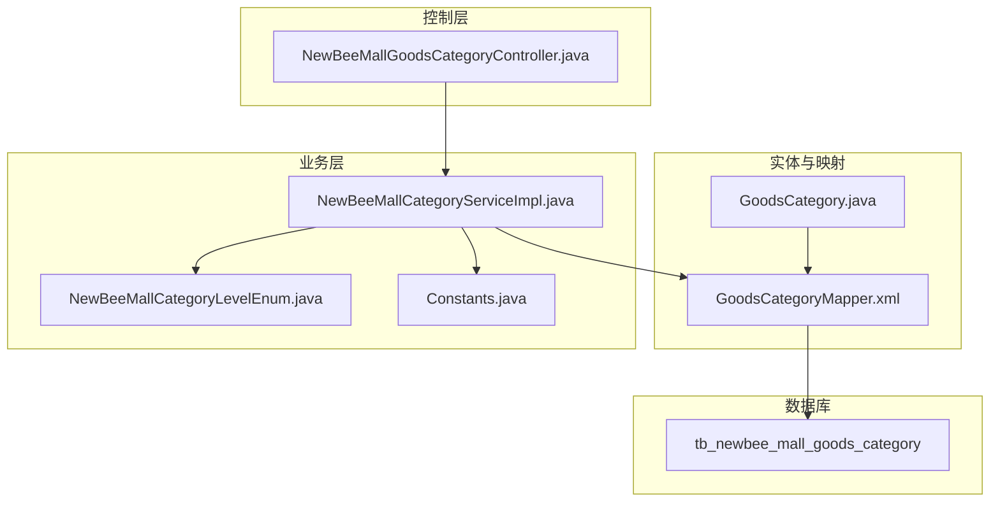
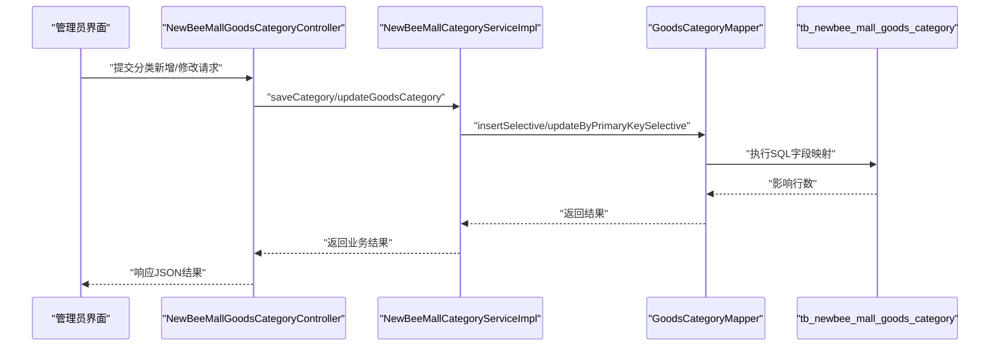
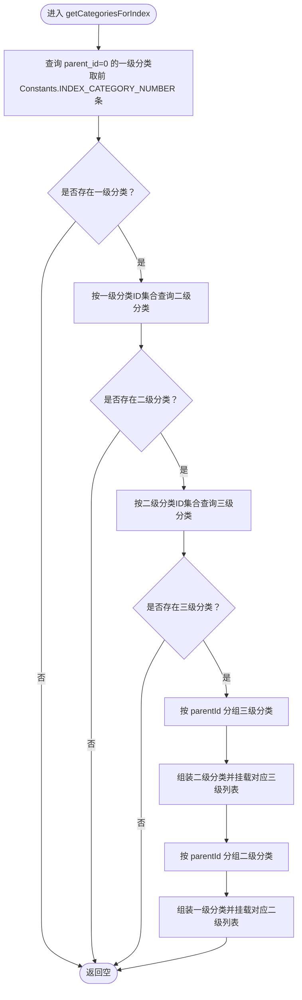
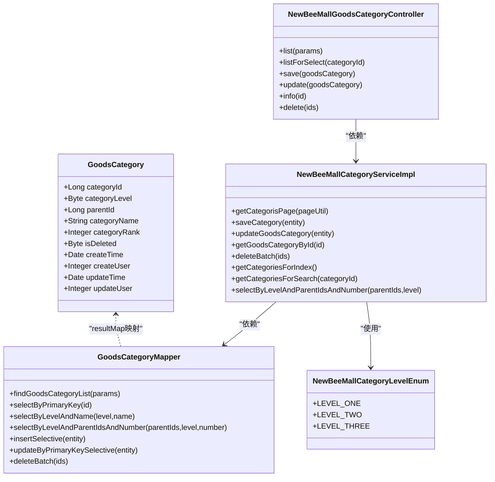

# 数据结构设计

<cite>
**本文引用的文件**
- [GoodsCategory.java](file://src/main/java/ltd/newbee/mall/entity/GoodsCategory.java)
- [GoodsCategoryMapper.xml](file://src/main/resources/mapper/GoodsCategoryMapper.xml)
- [newbee_mall_schema.sql](file://src/main/resources/newbee_mall_schema.sql)
- [NewBeeMallCategoryLevelEnum.java](file://src/main/java/ltd/newbee/mall/common/NewBeeMallCategoryLevelEnum.java)
- [NewBeeMallCategoryServiceImpl.java](file://src/main/java/ltd/newbee/mall/service/impl/NewBeeMallCategoryServiceImpl.java)
- [NewBeeMallGoodsCategoryController.java](file://src/main/java/ltd/newbee/mall/controller/admin/NewBeeMallGoodsCategoryController.java)
- [Constants.java](file://src/main/java/ltd/newbee/mall/common/Constants.java)
</cite>

## 目录
1. [简介](#简介)
2. [项目结构](#项目结构)
3. [核心组件](#核心组件)
4. [架构总览](#架构总览)
5. [详细组件分析](#详细组件分析)
6. [依赖关系分析](#依赖关系分析)
7. [性能考量](#性能考量)
8. [故障排查指南](#故障排查指南)
9. [结论](#结论)

## 简介
本文件聚焦于 newbee-mall 商品分类数据结构，围绕数据库表 tb_newbee_mall_goods_category 的字段设计与 Java 实体 GoodsCategory 的映射关系展开，重点解释以下要点：
- 主键：category_id
- 父子关系：parent_id 指向父分类；parent_id 为 0 表示根节点
- 分类层级：category_level（1-一级，2-二级，3-三级）
- 名称与排序：category_name 为分类名称；category_rank 为排序值（数值越大越靠前）
- 软删除：is_deleted 标识是否删除
- 时间与用户追踪：create_time、create_user、update_time、update_user

同时，结合 GoodsCategory 实体类的 Java 类型映射与业务含义，说明 parent_id 为 0 的根节点设计原理，并通过服务层与控制器层的调用链路展示这些字段在系统中的使用方式。

## 项目结构
与商品分类数据结构直接相关的模块分布如下：
- 实体层：GoodsCategory.java 定义了分类实体的 Java 字段
- 映射层：GoodsCategoryMapper.xml 定义了与 tb_newbee_mall_goods_category 的字段映射及常用查询
- 数据库脚本：newbee_mall_schema.sql 定义了表结构与约束
- 枚举层：NewBeeMallCategoryLevelEnum.java 提供分类级别的语义化枚举
- 服务层：NewBeeMallCategoryServiceImpl.java 展示了按层级与父 ID 查询、首页分类构建等业务逻辑
- 控制器层：NewBeeMallGoodsCategoryController.java 展示了分类管理接口对字段的使用

图表来源
- [GoodsCategory.java](file://src/main/java/ltd/newbee/mall/entity/GoodsCategory.java#L1-L137)
- [GoodsCategoryMapper.xml](file://src/main/resources/mapper/GoodsCategoryMapper.xml#L1-L212)
- [newbee_mall_schema.sql](file://src/main/resources/newbee_mall_schema.sql#L67-L87)
- [NewBeeMallCategoryLevelEnum.java](file://src/main/java/ltd/newbee/mall/common/NewBeeMallCategoryLevelEnum.java#L1-L59)
- [NewBeeMallCategoryServiceImpl.java](file://src/main/java/ltd/newbee/mall/service/impl/NewBeeMallCategoryServiceImpl.java#L1-L168)
- [NewBeeMallGoodsCategoryController.java](file://src/main/java/ltd/newbee/mall/controller/admin/NewBeeMallGoodsCategoryController.java#L1-L173)
- [Constants.java](file://src/main/java/ltd/newbee/mall/common/Constants.java#L1-L48)

章节来源
- [GoodsCategory.java](file://src/main/java/ltd/newbee/mall/entity/GoodsCategory.java#L1-L137)
- [GoodsCategoryMapper.xml](file://src/main/resources/mapper/GoodsCategoryMapper.xml#L1-L212)
- [newbee_mall_schema.sql](file://src/main/resources/newbee_mall_schema.sql#L67-L87)
- [NewBeeMallCategoryLevelEnum.java](file://src/main/java/ltd/newbee/mall/common/NewBeeMallCategoryLevelEnum.java#L1-L59)
- [NewBeeMallCategoryServiceImpl.java](file://src/main/java/ltd/newbee/mall/service/impl/NewBeeMallCategoryServiceImpl.java#L1-L168)
- [NewBeeMallGoodsCategoryController.java](file://src/main/java/ltd/newbee/mall/controller/admin/NewBeeMallGoodsCategoryController.java#L1-L173)
- [Constants.java](file://src/main/java/ltd/newbee/mall/common/Constants.java#L1-L48)

## 核心组件
- 数据库表：tb_newbee_mall_goods_category
  - 主键：category_id（自增）
  - 分类层级：category_level（1-一级，2-二级，3-三级）
  - 父子关系：parent_id（0 表示根节点）
  - 名称与排序：category_name、category_rank（越大越靠前）
  - 软删除：is_deleted（0 未删除，1 已删除）
  - 时间与用户：create_time、create_user、update_time、update_user

- 实体类：GoodsCategory
  - Java 类型映射：Long categoryId、Byte categoryLevel、Long parentId、String categoryName、Integer categoryRank、Byte isDeleted、Date createTime、Integer createUser、Date updateTime、Integer updateUser
  - 业务含义：承载分类的持久化对象，配合 MyBatis 映射到数据库字段

- 枚举：NewBeeMallCategoryLevelEnum
  - 提供 LEVEL_ONE、LEVEL_TWO、LEVEL_THREE 的语义化映射，便于业务层统一处理层级

- 服务层：NewBeeMallCategoryServiceImpl
  - 首页分类构建时使用 parent_id=0 获取一级分类
  - 按层级与父 ID 查询分类列表
  - 维护排序与软删除策略

- 控制层：NewBeeMallGoodsCategoryController
  - 提供分类列表、新增、修改、详情、批量删除等接口
  - 参数校验包含 category_level、category_name、parent_id、category_rank 等关键字段

章节来源
- [newbee_mall_schema.sql](file://src/main/resources/newbee_mall_schema.sql#L67-L87)
- [GoodsCategory.java](file://src/main/java/ltd/newbee/mall/entity/GoodsCategory.java#L1-L137)
- [NewBeeMallCategoryLevelEnum.java](file://src/main/java/ltd/newbee/mall/common/NewBeeMallCategoryLevelEnum.java#L1-L59)
- [NewBeeMallCategoryServiceImpl.java](file://src/main/java/ltd/newbee/mall/service/impl/NewBeeMallCategoryServiceImpl.java#L92-L142)
- [NewBeeMallGoodsCategoryController.java](file://src/main/java/ltd/newbee/mall/controller/admin/NewBeeMallGoodsCategoryController.java#L101-L141)

## 架构总览
商品分类数据结构在系统中的流转路径如下：
- 控制器接收请求并校验参数
- 服务层根据层级与父 ID 查询分类
- 映射层将结果映射到 GoodsCategory 实体
- 实体类提供字段访问器，支撑业务逻辑

图表来源
- [NewBeeMallGoodsCategoryController.java](file://src/main/java/ltd/newbee/mall/controller/admin/NewBeeMallGoodsCategoryController.java#L101-L141)
- [NewBeeMallCategoryServiceImpl.java](file://src/main/java/ltd/newbee/mall/service/impl/NewBeeMallCategoryServiceImpl.java#L48-L75)
- [GoodsCategoryMapper.xml](file://src/main/resources/mapper/GoodsCategoryMapper.xml#L99-L165)

## 详细组件分析

### 数据库表 tb_newbee_mall_goods_category 字段设计
- 主键：category_id（自增，唯一标识分类记录）
- 分类层级：category_level（1-一级，2-二级，3-三级）
- 父子关系：parent_id（0 表示根节点，非 0 指向上级分类）
- 名称与排序：category_name（分类名称），category_rank（排序值，越大越靠前）
- 软删除：is_deleted（0 未删除，1 已删除）
- 时间与用户：create_time、create_user、update_time、update_user

字段映射与约束来源于数据库脚本与 MyBatis 映射文件：
- 字段映射：GoodsCategoryMapper.xml 中的 result 元素将数据库列映射到实体属性
- 查询条件：按层级与父 ID 过滤，使用 is_deleted=0 进行软删除过滤
- 排序规则：按 category_rank 降序

章节来源
- [newbee_mall_schema.sql](file://src/main/resources/newbee_mall_schema.sql#L67-L87)
- [GoodsCategoryMapper.xml](file://src/main/resources/mapper/GoodsCategoryMapper.xml#L1-L212)

### 实体类 GoodsCategory 的 Java 类型映射与业务含义
- Java 类型映射（MyBatis JDBC 类型）：
  - categoryId -> BIGINT
  - categoryLevel -> TINYINT
  - parentId -> BIGINT
  - categoryName -> VARCHAR
  - categoryRank -> INTEGER
  - isDeleted -> TINYINT
  - createTime、updateTime -> TIMESTAMP
  - createUser、updateUser -> INTEGER

- 业务含义：
  - categoryId：分类唯一标识，主键
  - categoryLevel：分类层级（1-一级，2-二级，3-三级）
  - parentId：父分类 ID；当为 0 时表示根节点
  - categoryName：分类名称
  - categoryRank：排序权重，数值越大越靠前
  - isDeleted：软删除标志
  - createTime/createUser/updateTime/updateUser：时间与用户追踪

- 设计要点：
  - parent_id 为 0 表示根节点，服务层首页构建时以 parent_id=0 查询一级分类
  - category_rank 用于首页与搜索页的排序展示
  - is_deleted=0 的查询条件贯穿多个 Mapper 查询，确保软删除可见性

章节来源
- [GoodsCategory.java](file://src/main/java/ltd/newbee/mall/entity/GoodsCategory.java#L1-L137)
- [GoodsCategoryMapper.xml](file://src/main/resources/mapper/GoodsCategoryMapper.xml#L1-L212)

### 分类层级枚举 NewBeeMallCategoryLevelEnum
- 提供 LEVEL_ONE、LEVEL_TWO、LEVEL_THREE 的语义化映射
- 服务层与控制器层通过该枚举统一处理层级判断与查询

章节来源
- [NewBeeMallCategoryLevelEnum.java](file://src/main/java/ltd/newbee/mall/common/NewBeeMallCategoryLevelEnum.java#L1-L59)

### 服务层：按层级与父 ID 查询与首页构建
- 首页分类构建：
  - 使用 parent_id=0 查询一级分类（Constants 中定义首页一级分类最大数量）
  - 依据一级分类 ID 查询二级分类，再依据二级分类 ID 查询三级分类
  - 通过 Map 按 parentId 分组组织二级与三级分类
- 按层级与父 ID 查询：
  - 支持传入 parentIds 列表与 categoryLevel 查询
  - 支持限制返回数量（number=0 表示不限制）

图表来源
- [NewBeeMallCategoryServiceImpl.java](file://src/main/java/ltd/newbee/mall/service/impl/NewBeeMallCategoryServiceImpl.java#L92-L142)
- [Constants.java](file://src/main/java/ltd/newbee/mall/common/Constants.java#L24-L24)

章节来源
- [NewBeeMallCategoryServiceImpl.java](file://src/main/java/ltd/newbee/mall/service/impl/NewBeeMallCategoryServiceImpl.java#L92-L142)
- [Constants.java](file://src/main/java/ltd/newbee/mall/common/Constants.java#L24-L24)

### 控制层：分类管理接口与字段校验
- 新增/修改接口：
  - 校验参数：category_level、category_name、parent_id、category_rank
  - 通过服务层保存或更新分类
- 列表接口：
  - 支持按层级与父 ID 过滤，按 category_rank 降序分页
- 删除接口：
  - 批量软删除（is_deleted=1）

章节来源
- [NewBeeMallGoodsCategoryController.java](file://src/main/java/ltd/newbee/mall/controller/admin/NewBeeMallGoodsCategoryController.java#L101-L141)
- [GoodsCategoryMapper.xml](file://src/main/resources/mapper/GoodsCategoryMapper.xml#L20-L37)

## 依赖关系分析
- 实体与映射：
  - GoodsCategory.java 与 GoodsCategoryMapper.xml 通过 resultMap 完成字段映射
- 服务与映射：
  - NewBeeMallCategoryServiceImpl.java 通过 GoodsCategoryMapper 调用数据库
- 控制与服务：
  - NewBeeMallGoodsCategoryController.java 调用服务层完成分类管理
- 枚举与服务：
  - NewBeeMallCategoryLevelEnum.java 为服务层提供层级语义

图表来源
- [GoodsCategory.java](file://src/main/java/ltd/newbee/mall/entity/GoodsCategory.java#L1-L137)
- [GoodsCategoryMapper.xml](file://src/main/resources/mapper/GoodsCategoryMapper.xml#L1-L212)
- [NewBeeMallCategoryServiceImpl.java](file://src/main/java/ltd/newbee/mall/service/impl/NewBeeMallCategoryServiceImpl.java#L1-L168)
- [NewBeeMallGoodsCategoryController.java](file://src/main/java/ltd/newbee/mall/controller/admin/NewBeeMallGoodsCategoryController.java#L1-L173)
- [NewBeeMallCategoryLevelEnum.java](file://src/main/java/ltd/newbee/mall/common/NewBeeMallCategoryLevelEnum.java#L1-L59)

章节来源
- [GoodsCategory.java](file://src/main/java/ltd/newbee/mall/entity/GoodsCategory.java#L1-L137)
- [GoodsCategoryMapper.xml](file://src/main/resources/mapper/GoodsCategoryMapper.xml#L1-L212)
- [NewBeeMallCategoryServiceImpl.java](file://src/main/java/ltd/newbee/mall/service/impl/NewBeeMallCategoryServiceImpl.java#L1-L168)
- [NewBeeMallGoodsCategoryController.java](file://src/main/java/ltd/newbee/mall/controller/admin/NewBeeMallGoodsCategoryController.java#L1-L173)
- [NewBeeMallCategoryLevelEnum.java](file://src/main/java/ltd/newbee/mall/common/NewBeeMallCategoryLevelEnum.java#L1-L59)

## 性能考量
- 查询优化：
  - 按层级与父 ID 查询时建议在 parent_id 与 category_level 上建立联合索引，以提升范围查询效率
  - 排序使用 category_rank 降序，建议在该列建立索引以减少排序成本
- 软删除：
  - is_deleted=0 的过滤条件贯穿查询，建议在该列建立索引以加速过滤
- 分页与数量限制：
  - 服务层首页构建时使用 Constants 中的常量限制一级分类数量，避免一次性加载过多数据
- 批量操作：
  - 批量删除采用批量更新（is_deleted=1），减少事务开销

[本节为通用性能建议，无需特定文件引用]

## 故障排查指南
- 新增/修改失败：
  - 检查参数校验：category_level、category_name、parent_id、category_rank 是否为空
  - 检查同名冲突：同一层级下不允许重复名称
- 查询不到数据：
  - 确认 is_deleted=0 的过滤条件是否生效
  - 确认 parent_id 与 category_level 的组合是否正确
- 排序异常：
  - 确认 category_rank 是否按预期更新
  - 确认查询是否按 category_rank 降序排列
- 删除后仍显示：
  - 确认删除接口是否执行批量软删除（is_deleted=1）
  - 确认查询是否包含 is_deleted=0 的过滤条件

章节来源
- [NewBeeMallGoodsCategoryController.java](file://src/main/java/ltd/newbee/mall/controller/admin/NewBeeMallGoodsCategoryController.java#L101-L141)
- [GoodsCategoryMapper.xml](file://src/main/resources/mapper/GoodsCategoryMapper.xml#L20-L37)

## 结论
- tb_newbee_mall_goods_category 采用三层分类模型，通过 parent_id=0 表示根节点，形成清晰的树形结构
- GoodsCategory 实体与 GoodsCategoryMapper.xml 的字段映射完整覆盖数据库表结构，配合枚举与服务层实现层级化查询与首页构建
- category_rank 作为排序字段，配合 is_deleted 软删除机制，满足前端展示与维护需求
- 控制层接口对关键字段进行严格校验，保障数据一致性与业务正确性