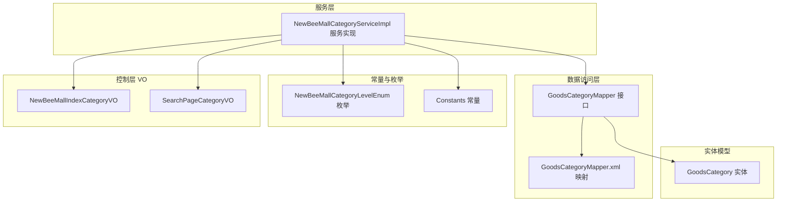
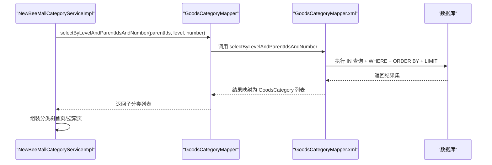
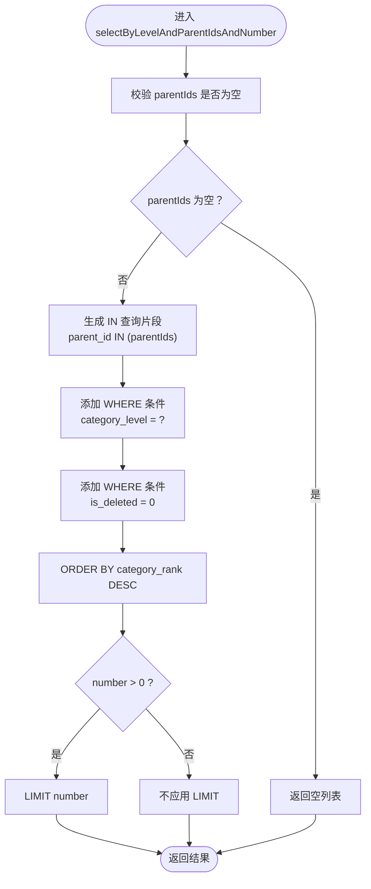
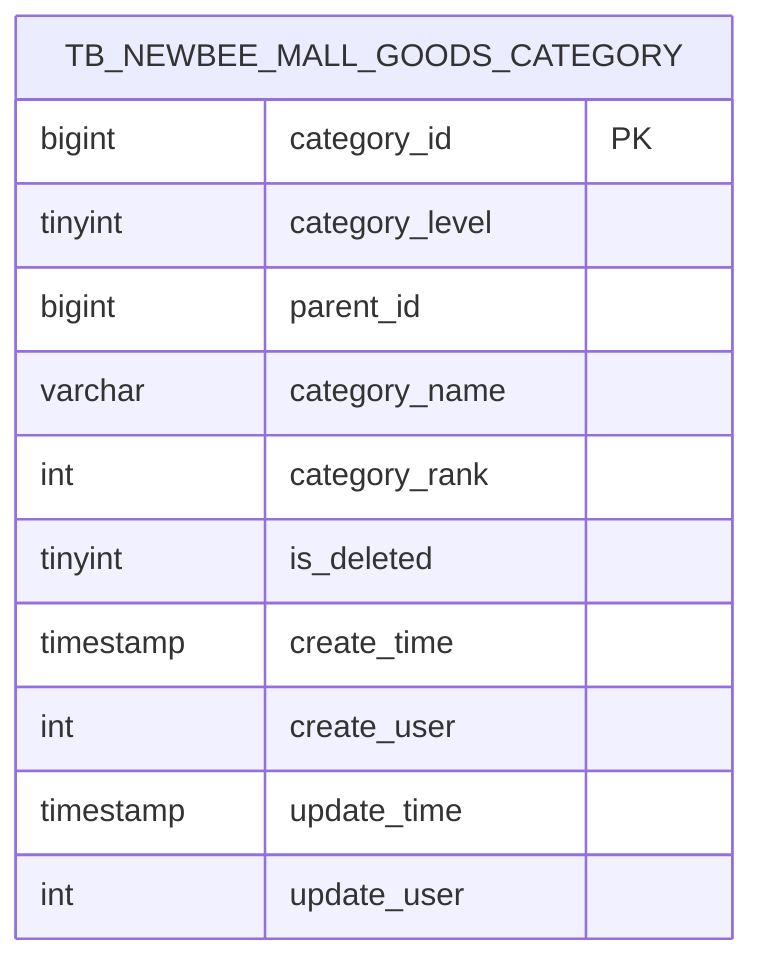
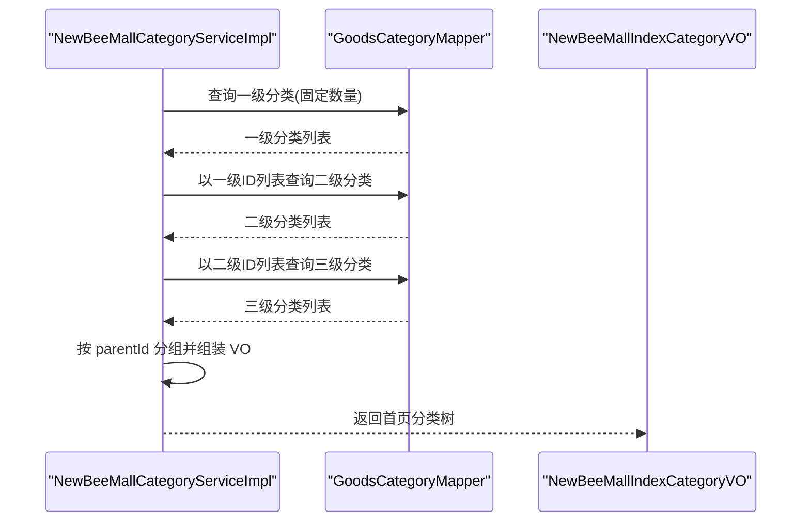
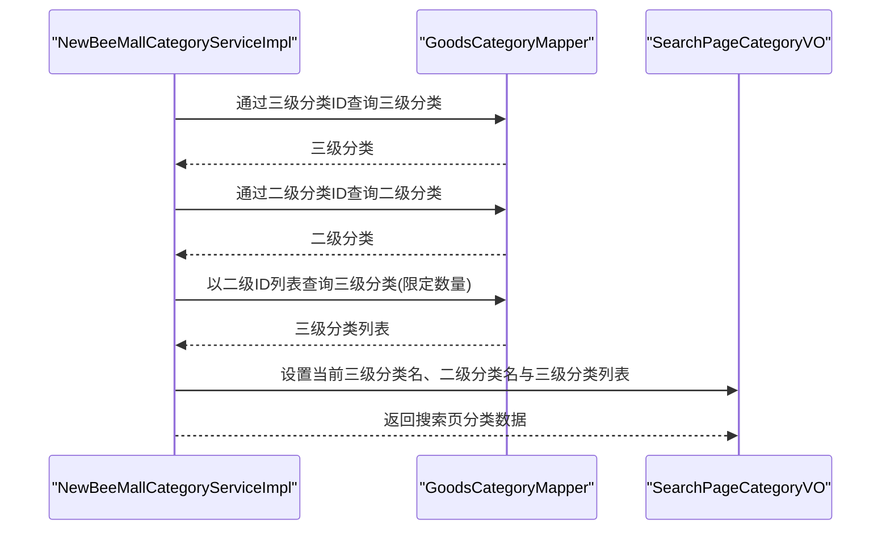
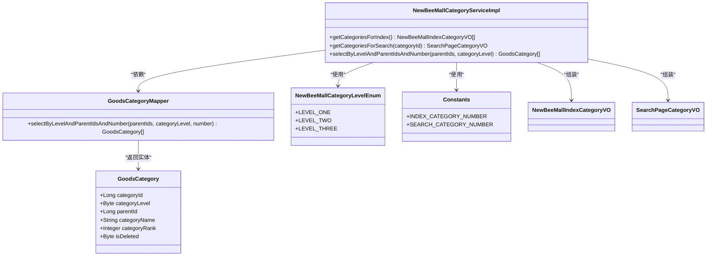
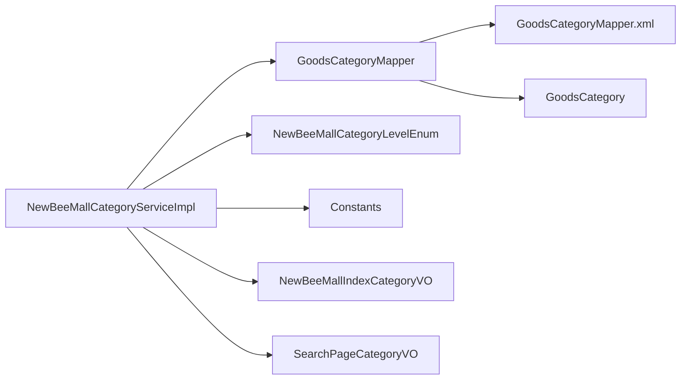

# 查询方法实现

<cite>
**本文引用的文件**
- [GoodsCategoryMapper.java](file://src/main/java/ltd/newbee/mall/dao/GoodsCategoryMapper.java)
- [GoodsCategoryMapper.xml](file://src/main/resources/mapper/GoodsCategoryMapper.xml)
- [GoodsCategory.java](file://src/main/java/ltd/newbee/mall/entity/GoodsCategory.java)
- [NewBeeMallCategoryServiceImpl.java](file://src/main/java/ltd/newbee/mall/service/impl/NewBeeMallCategoryServiceImpl.java)
- [NewBeeMallCategoryLevelEnum.java](file://src/main/java/ltd/newbee/mall/common/NewBeeMallCategoryLevelEnum.java)
- [Constants.java](file://src/main/java/ltd/newbee/mall/common/Constants.java)
- [newbee_mall_schema.sql](file://src/main/resources/newbee_mall_schema.sql)
- [NewBeeMallIndexCategoryVO.java](file://src/main/java/ltd/newbee/mall/controller/vo/NewBeeMallIndexCategoryVO.java)
- [SearchPageCategoryVO.java](file://src/main/java/ltd/newbee/mall/controller/vo/SearchPageCategoryVO.java)
</cite>

## 目录
1. [引言](#引言)
2. [项目结构](#项目结构)
3. [核心组件](#核心组件)
4. [架构总览](#架构总览)
5. [详细组件分析](#详细组件分析)
6. [依赖分析](#依赖分析)
7. [性能考量](#性能考量)
8. [故障排查指南](#故障排查指南)
9. [结论](#结论)

## 引言
本文件围绕商品分类父子关系的查询实现展开，重点解析 GoodsCategoryMapper 接口中的 selectByLevelAndParentIdsAndNumber 方法。该方法通过 parentIds 列表、categoryLevel 级别与 number 数量参数，实现按层级和父 ID 批量查询子分类，并在 MyBatis XML 映射文件中使用 IN 查询与 LIMIT 进行高效检索。同时，文档阐述该方法在构建首页分类树与搜索页分类树中的应用场景与调用链路。

## 项目结构
- 数据访问层：GoodsCategoryMapper 接口与对应的 MyBatis XML 映射文件
- 实体模型：GoodsCategory 表示分类实体
- 服务层：NewBeeMallCategoryServiceImpl 使用 Mapper 构建分类树
- 常量与枚举：分类级别枚举与业务常量
- 控制层 VO：首页与搜索页分类展示 VO

图表来源
- [GoodsCategoryMapper.java](file://src/main/java/ltd/newbee/mall/dao/GoodsCategoryMapper.java#L1-L39)
- [GoodsCategoryMapper.xml](file://src/main/resources/mapper/GoodsCategoryMapper.xml#L63-L77)
- [GoodsCategory.java](file://src/main/java/ltd/newbee/mall/entity/GoodsCategory.java#L1-L137)
- [NewBeeMallCategoryServiceImpl.java](file://src/main/java/ltd/newbee/mall/service/impl/NewBeeMallCategoryServiceImpl.java#L91-L167)
- [NewBeeMallCategoryLevelEnum.java](file://src/main/java/ltd/newbee/mall/common/NewBeeMallCategoryLevelEnum.java#L1-L59)
- [Constants.java](file://src/main/java/ltd/newbee/mall/common/Constants.java#L1-L48)
- [NewBeeMallIndexCategoryVO.java](file://src/main/java/ltd/newbee/mall/controller/vo/NewBeeMallIndexCategoryVO.java#L1-L59)
- [SearchPageCategoryVO.java](file://src/main/java/ltd/newbee/mall/controller/vo/SearchPageCategoryVO.java#L1-L71)

章节来源
- [GoodsCategoryMapper.java](file://src/main/java/ltd/newbee/mall/dao/GoodsCategoryMapper.java#L1-L39)
- [GoodsCategoryMapper.xml](file://src/main/resources/mapper/GoodsCategoryMapper.xml#L63-L77)
- [GoodsCategory.java](file://src/main/java/ltd/newbee/mall/entity/GoodsCategory.java#L1-L137)
- [NewBeeMallCategoryServiceImpl.java](file://src/main/java/ltd/newbee/mall/service/impl/NewBeeMallCategoryServiceImpl.java#L91-L167)
- [NewBeeMallCategoryLevelEnum.java](file://src/main/java/ltd/newbee/mall/common/NewBeeMallCategoryLevelEnum.java#L1-L59)
- [Constants.java](file://src/main/java/ltd/newbee/mall/common/Constants.java#L1-L48)
- [NewBeeMallIndexCategoryVO.java](file://src/main/java/ltd/newbee/mall/controller/vo/NewBeeMallIndexCategoryVO.java#L1-L59)
- [SearchPageCategoryVO.java](file://src/main/java/ltd/newbee/mall/controller/vo/SearchPageCategoryVO.java#L1-L71)

## 核心组件
- GoodsCategoryMapper 接口：定义分类查询能力，其中 selectByLevelAndParentIdsAndNumber 支持按父 ID 列表与层级批量查询，并可限制返回数量
- GoodsCategoryMapper.xml：提供 SQL 实现，包含 IN 查询与 LIMIT 条件
- GoodsCategory 实体：映射 tb_newbee_mall_goods_category 表结构
- NewBeeMallCategoryServiceImpl：服务实现，负责组织分类树（首页与搜索页）
- NewBeeMallCategoryLevelEnum：分类级别枚举（一级、二级、三级）
- Constants：业务常量（如首页分类数量、搜索页分类数量）

章节来源
- [GoodsCategoryMapper.java](file://src/main/java/ltd/newbee/mall/dao/GoodsCategoryMapper.java#L32-L39)
- [GoodsCategoryMapper.xml](file://src/main/resources/mapper/GoodsCategoryMapper.xml#L63-L77)
- [GoodsCategory.java](file://src/main/java/ltd/newbee/mall/entity/GoodsCategory.java#L1-L137)
- [NewBeeMallCategoryServiceImpl.java](file://src/main/java/ltd/newbee/mall/service/impl/NewBeeMallCategoryServiceImpl.java#L91-L167)
- [NewBeeMallCategoryLevelEnum.java](file://src/main/java/ltd/newbee/mall/common/NewBeeMallCategoryLevelEnum.java#L1-L59)
- [Constants.java](file://src/main/java/ltd/newbee/mall/common/Constants.java#L18-L48)

## 架构总览
selectByLevelAndParentIdsAndNumber 在服务层被用于构建分类树：
- 首页：先查一级分类（固定数量），再按一级分类 ID 列表查二级分类，再按二级分类 ID 列表查三级分类，最终组装成 NewBeeMallIndexCategoryVO
- 搜索页：从三级分类回溯到二级与一级，按二级分类查其下的三级分类（限定数量）

图表来源
- [NewBeeMallCategoryServiceImpl.java](file://src/main/java/ltd/newbee/mall/service/impl/NewBeeMallCategoryServiceImpl.java#L91-L167)
- [GoodsCategoryMapper.java](file://src/main/java/ltd/newbee/mall/dao/GoodsCategoryMapper.java#L32-L39)
- [GoodsCategoryMapper.xml](file://src/main/resources/mapper/GoodsCategoryMapper.xml#L63-L77)

## 详细组件分析

### GoodsCategoryMapper 接口与 XML 实现
- 接口方法：selectByLevelAndParentIdsAndNumber(List<Long> parentIds, int categoryLevel, int number)
- XML SQL 关键点：
  - 使用 parent_id IN (...) 批量匹配父节点
  - 通过 category_level 精确限定层级
  - 通过 ORDER BY category_rank desc 实现排序
  - 通过 <if test="number>0"> limit #{number} 实现数量限制
- 适用场景：首页与搜索页的“按父 ID 列表批量查询子分类”需求

图表来源
- [GoodsCategoryMapper.xml](file://src/main/resources/mapper/GoodsCategoryMapper.xml#L63-L77)

章节来源
- [GoodsCategoryMapper.java](file://src/main/java/ltd/newbee/mall/dao/GoodsCategoryMapper.java#L32-L39)
- [GoodsCategoryMapper.xml](file://src/main/resources/mapper/GoodsCategoryMapper.xml#L63-L77)

### 数据库表结构与父子关系
- 表：tb_newbee_mall_goods_category
- 字段关键点：
  - category_id：主键
  - parent_id：父分类 ID，0 表示一级分类
  - category_level：分类级别（1/2/3）
  - category_rank：排序权重
  - is_deleted：软删除标志
- 父子关系：通过 parent_id 与 category_level 组合表达层级树

图表来源
- [newbee_mall_schema.sql](file://src/main/resources/newbee_mall_schema.sql#L72-L87)

章节来源
- [newbee_mall_schema.sql](file://src/main/resources/newbee_mall_schema.sql#L72-L87)

### 服务层分类树构建（首页）
- 步骤：
  1) 获取一级分类（固定数量）：selectByLevelAndParentIdsAndNumber([0], 1, INDEX_CATEGORY_NUMBER)
  2) 以一级分类 ID 列表查询二级分类：selectByLevelAndParentIdsAndNumber(firstLevelIds, 2, 0)
  3) 以二级分类 ID 列表查询三级分类：selectByLevelAndParentIdsAndNumber(secondLevelIds, 3, 0)
  4) 按 parentId 分组组装为 NewBeeMallIndexCategoryVO
- 作用：为首页展示“一级 -> 二级 -> 三级”的完整分类树

图表来源
- [NewBeeMallCategoryServiceImpl.java](file://src/main/java/ltd/newbee/mall/service/impl/NewBeeMallCategoryServiceImpl.java#L91-L142)
- [NewBeeMallIndexCategoryVO.java](file://src/main/java/ltd/newbee/mall/controller/vo/NewBeeMallIndexCategoryVO.java#L1-L59)
- [Constants.java](file://src/main/java/ltd/newbee/mall/common/Constants.java#L20-L26)

章节来源
- [NewBeeMallCategoryServiceImpl.java](file://src/main/java/ltd/newbee/mall/service/impl/NewBeeMallCategoryServiceImpl.java#L91-L142)
- [NewBeeMallIndexCategoryVO.java](file://src/main/java/ltd/newbee/mall/controller/vo/NewBeeMallIndexCategoryVO.java#L1-L59)
- [Constants.java](file://src/main/java/ltd/newbee/mall/common/Constants.java#L20-L26)

### 服务层分类树构建（搜索页）
- 步骤：
  1) 从三级分类回溯到二级与一级
  2) 以二级分类 ID 查询其下的三级分类（限定数量）
  3) 组装 SearchPageCategoryVO，包含当前三级分类名、二级分类名与三级分类列表
- 作用：为搜索页提供“当前三级分类所在二级分类下的三级分类集合”

图表来源
- [NewBeeMallCategoryServiceImpl.java](file://src/main/java/ltd/newbee/mall/service/impl/NewBeeMallCategoryServiceImpl.java#L144-L161)
- [SearchPageCategoryVO.java](file://src/main/java/ltd/newbee/mall/controller/vo/SearchPageCategoryVO.java#L1-L71)
- [Constants.java](file://src/main/java/ltd/newbee/mall/common/Constants.java#L24-L27)

章节来源
- [NewBeeMallCategoryServiceImpl.java](file://src/main/java/ltd/newbee/mall/service/impl/NewBeeMallCategoryServiceImpl.java#L144-L161)
- [SearchPageCategoryVO.java](file://src/main/java/ltd/newbee/mall/controller/vo/SearchPageCategoryVO.java#L1-L71)
- [Constants.java](file://src/main/java/ltd/newbee/mall/common/Constants.java#L24-L27)

### 类关系与职责

图表来源
- [GoodsCategoryMapper.java](file://src/main/java/ltd/newbee/mall/dao/GoodsCategoryMapper.java#L32-L39)
- [GoodsCategory.java](file://src/main/java/ltd/newbee/mall/entity/GoodsCategory.java#L1-L137)
- [NewBeeMallCategoryServiceImpl.java](file://src/main/java/ltd/newbee/mall/service/impl/NewBeeMallCategoryServiceImpl.java#L91-L167)
- [NewBeeMallCategoryLevelEnum.java](file://src/main/java/ltd/newbee/mall/common/NewBeeMallCategoryLevelEnum.java#L1-L59)
- [Constants.java](file://src/main/java/ltd/newbee/mall/common/Constants.java#L20-L27)
- [NewBeeMallIndexCategoryVO.java](file://src/main/java/ltd/newbee/mall/controller/vo/NewBeeMallIndexCategoryVO.java#L1-L59)
- [SearchPageCategoryVO.java](file://src/main/java/ltd/newbee/mall/controller/vo/SearchPageCategoryVO.java#L1-L71)

## 依赖分析
- Mapper 与 XML 的耦合：selectByLevelAndParentIdsAndNumber 的 SQL 由 XML 提供，Mapper 仅定义方法签名
- 服务层对 Mapper 的依赖：服务层通过 Mapper 执行批量查询，再进行分组与组装
- 与枚举和常量的耦合：服务层使用枚举确定层级，使用常量控制首页与搜索页的数量
- 与 VO 的耦合：服务层将查询结果映射为 VO，用于前端渲染

图表来源
- [GoodsCategoryMapper.java](file://src/main/java/ltd/newbee/mall/dao/GoodsCategoryMapper.java#L32-L39)
- [GoodsCategoryMapper.xml](file://src/main/resources/mapper/GoodsCategoryMapper.xml#L63-L77)
- [NewBeeMallCategoryServiceImpl.java](file://src/main/java/ltd/newbee/mall/service/impl/NewBeeMallCategoryServiceImpl.java#L91-L167)
- [NewBeeMallCategoryLevelEnum.java](file://src/main/java/ltd/newbee/mall/common/NewBeeMallCategoryLevelEnum.java#L1-L59)
- [Constants.java](file://src/main/java/ltd/newbee/mall/common/Constants.java#L20-L27)
- [NewBeeMallIndexCategoryVO.java](file://src/main/java/ltd/newbee/mall/controller/vo/NewBeeMallIndexCategoryVO.java#L1-L59)
- [SearchPageCategoryVO.java](file://src/main/java/ltd/newbee/mall/controller/vo/SearchPageCategoryVO.java#L1-L71)

## 性能考量
- IN 查询优化：通过 parentIds 列表一次性传入，减少多次往返；建议确保 parentIds 合理大小，避免过长 IN 列表导致 SQL 解析开销
- LIMIT 控制：number 参数为 0 时表示不限制；首页与搜索页分别使用常量控制数量，避免全量扫描
- 排序与索引：ORDER BY category_rank desc 需要合理索引支持；建议在 category_rank 上建立索引以提升排序效率
- 软删除过滤：is_deleted = 0 已内置，避免无用数据参与查询
- 分页与批量：服务层按层级分批查询，避免一次性拉取大量数据

## 故障排查指南
- 查询无结果
  - 检查 parentIds 是否为空或包含不存在的 ID
  - 确认 categoryLevel 与 parent_id 组合是否正确
  - 核对 is_deleted 是否为 0
- 数量不符合预期
  - number 为 0 表示不限制；如需限制，请传入正整数
  - 首页与搜索页数量由 Constants 控制，确认是否被覆盖
- 排序异常
  - 确认 category_rank 字段是否正确更新
  - 检查是否存在 NULL 或重复值影响排序
- 分组组装错误
  - 确保 parentId 与子分类 ID 匹配
  - 检查分组逻辑与 VO 字段映射

章节来源
- [GoodsCategoryMapper.xml](file://src/main/resources/mapper/GoodsCategoryMapper.xml#L63-L77)
- [NewBeeMallCategoryServiceImpl.java](file://src/main/java/ltd/newbee/mall/service/impl/NewBeeMallCategoryServiceImpl.java#L91-L167)
- [Constants.java](file://src/main/java/ltd/newbee/mall/common/Constants.java#L20-L27)

## 结论
selectByLevelAndParentIdsAndNumber 通过 IN 查询与 LIMIT 的组合，实现了按层级与父 ID 列表的高效批量查询。配合服务层的分层级查询与分组组装，成功支撑首页与搜索页的分类树构建。通过合理使用枚举与常量，系统在功能与性能之间取得平衡，满足多层级分类场景下的数据检索需求。