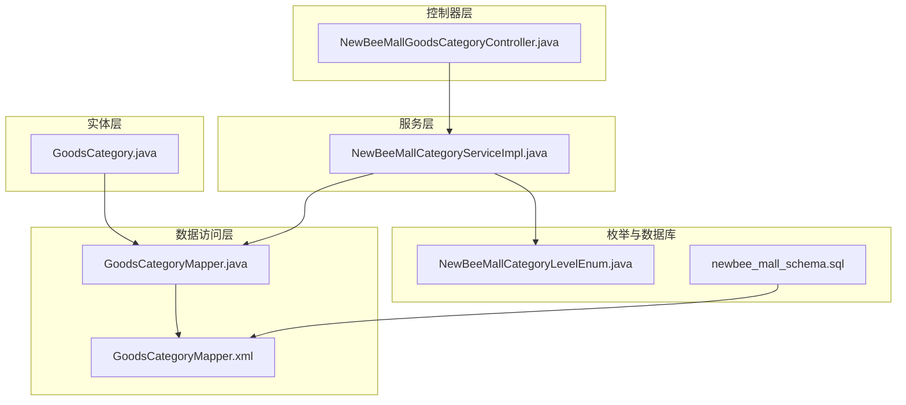
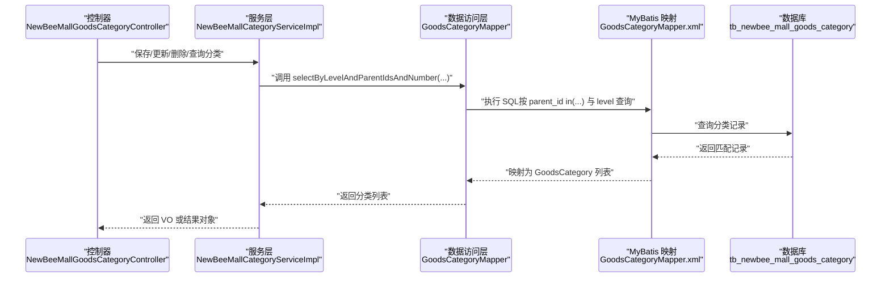
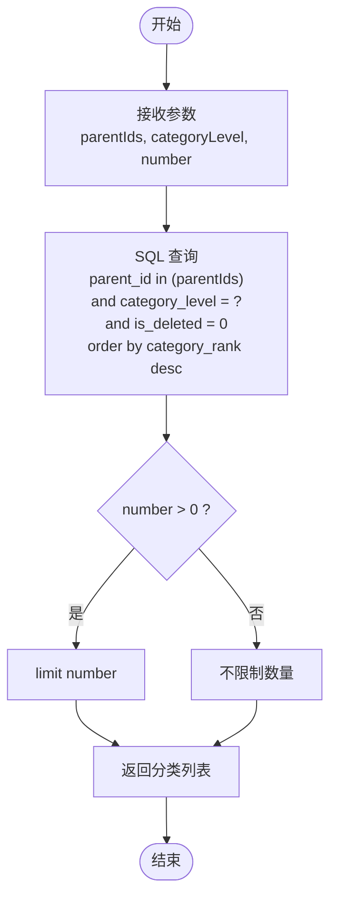
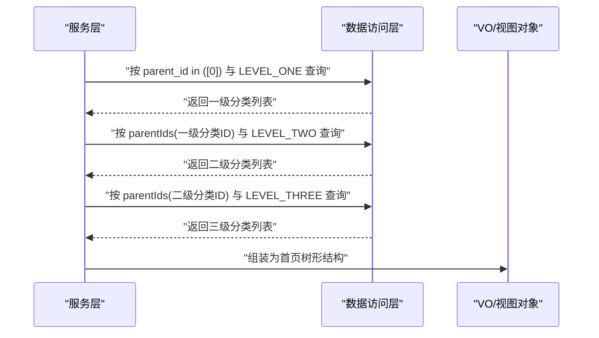
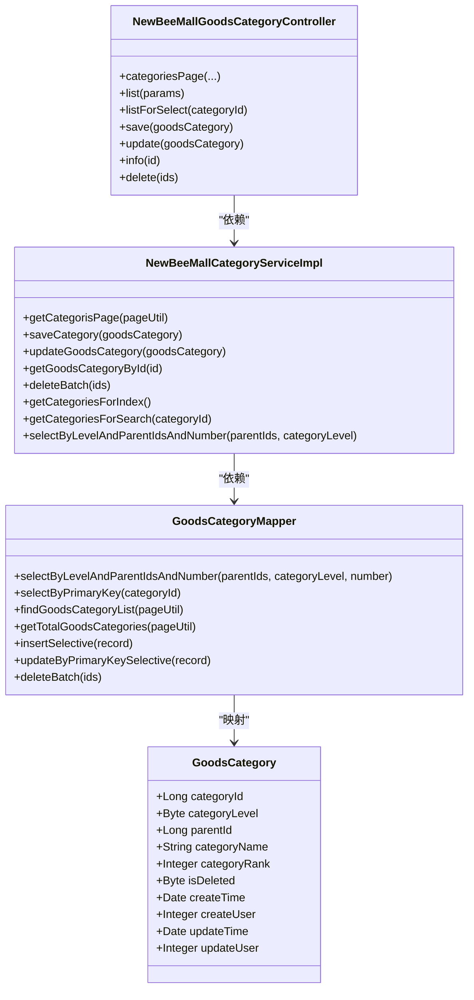

# 父子关系维护

<cite>
**本文引用的文件**
- [GoodsCategory.java](file://src/main/java/ltd/newbee/mall/entity/GoodsCategory.java)
- [GoodsCategoryMapper.java](file://src/main/java/ltd/newbee/mall/dao/GoodsCategoryMapper.java)
- [GoodsCategoryMapper.xml](file://src/main/resources/mapper/GoodsCategoryMapper.xml)
- [NewBeeMallCategoryServiceImpl.java](file://src/main/java/ltd/newbee/mall/service/impl/NewBeeMallCategoryServiceImpl.java)
- [NewBeeMallGoodsCategoryController.java](file://src/main/java/ltd/newbee/mall/controller/admin/NewBeeMallGoodsCategoryController.java)
- [NewBeeMallCategoryLevelEnum.java](file://src/main/java/ltd/newbee/mall/common/NewBeeMallCategoryLevelEnum.java)
- [newbee_mall_schema.sql](file://src/main/resources/newbee_mall_schema.sql)
</cite>

## 目录
1. [引言](#引言)
2. [项目结构](#项目结构)
3. [核心组件](#核心组件)
4. [架构总览](#架构总览)
5. [详细组件分析](#详细组件分析)
6. [依赖关系分析](#依赖关系分析)
7. [性能考量](#性能考量)
8. [故障排查指南](#故障排查指南)
9. [结论](#结论)

## 引言
本文件围绕 newbee-mall 商品分类的父子关系维护展开，聚焦于数据库表 tb_newbee_mall_goods_category 中 parent_id 字段如何建立树形层级关系，以及在 Java 层通过 GoodsCategory 实体、GoodsCategoryMapper 接口与 MyBatis 映射、Service 与 Controller 的协作，完成分类的新增、查询、更新与删除流程。重点说明：
- parent_id 指向父分类的 category_id，根节点（一级分类）的 parent_id 设计为 0。
- 通过 GoodsCategory 的 parentId 属性与 GoodsCategoryMapper 的 selectByLevelAndParentIdsAndNumber 方法，实现按层级与父节点集合批量查询。
- 服务层与控制器层如何组织父子关系的业务逻辑与前端交互。

## 项目结构
与分类父子关系直接相关的模块与文件如下：
- 实体层：GoodsCategory.java
- 数据访问层：GoodsCategoryMapper.java、GoodsCategoryMapper.xml
- 服务层：NewBeeMallCategoryServiceImpl.java
- 控制器层：NewBeeMallGoodsCategoryController.java
- 枚举：NewBeeMallCategoryLevelEnum.java
- 数据库：newbee_mall_schema.sql（包含 tb_newbee_mall_goods_category 表结构）

图表来源
- [GoodsCategory.java](file://src/main/java/ltd/newbee/mall/entity/GoodsCategory.java#L1-L137)
- [GoodsCategoryMapper.java](file://src/main/java/ltd/newbee/mall/dao/GoodsCategoryMapper.java#L1-L39)
- [GoodsCategoryMapper.xml](file://src/main/resources/mapper/GoodsCategoryMapper.xml#L1-L212)
- [NewBeeMallCategoryServiceImpl.java](file://src/main/java/ltd/newbee/mall/service/impl/NewBeeMallCategoryServiceImpl.java#L1-L168)
- [NewBeeMallGoodsCategoryController.java](file://src/main/java/ltd/newbee/mall/controller/admin/NewBeeMallGoodsCategoryController.java#L1-L173)
- [NewBeeMallCategoryLevelEnum.java](file://src/main/java/ltd/newbee/mall/common/NewBeeMallCategoryLevelEnum.java#L1-L59)
- [newbee_mall_schema.sql](file://src/main/resources/newbee_mall_schema.sql#L67-L86)

章节来源
- [GoodsCategory.java](file://src/main/java/ltd/newbee/mall/entity/GoodsCategory.java#L1-L137)
- [GoodsCategoryMapper.java](file://src/main/java/ltd/newbee/mall/dao/GoodsCategoryMapper.java#L1-L39)
- [GoodsCategoryMapper.xml](file://src/main/resources/mapper/GoodsCategoryMapper.xml#L1-L212)
- [NewBeeMallCategoryServiceImpl.java](file://src/main/java/ltd/newbee/mall/service/impl/NewBeeMallCategoryServiceImpl.java#L1-L168)
- [NewBeeMallGoodsCategoryController.java](file://src/main/java/ltd/newbee/mall/controller/admin/NewBeeMallGoodsCategoryController.java#L1-L173)
- [NewBeeMallCategoryLevelEnum.java](file://src/main/java/ltd/newbee/mall/common/NewBeeMallCategoryLevelEnum.java#L1-L59)
- [newbee_mall_schema.sql](file://src/main/resources/newbee_mall_schema.sql#L67-L86)

## 核心组件
- GoodsCategory 实体：包含 categoryId、categoryLevel、parentId、categoryName、categoryRank、isDeleted、createTime、createUser、updateTime、updateUser 等字段，其中 parentId 即为父分类标识。
- GoodsCategoryMapper 接口：定义了按层级与父节点集合查询的方法 selectByLevelAndParentIdsAndNumber，以及通用的 CRUD 与分页查询方法。
- GoodsCategoryMapper.xml：MyBatis 映射文件，将 SQL 查询与 GoodsCategory 实体映射，实现按 parent_id in (...) 的批量查询。
- NewBeeMallCategoryServiceImpl：服务层实现，封装分类的保存、更新、删除、分页查询、首页与搜索页的树形结构构建逻辑，使用 GoodsCategoryMapper 完成数据库操作。
- NewBeeMallGoodsCategoryController：管理端控制器，提供分类列表、保存、更新、删除、详情等接口，接收前端请求并调用服务层。
- NewBeeMallCategoryLevelEnum：分类层级枚举，定义 LEVEL_ONE、LEVEL_TWO、LEVEL_THREE 三种层级，配合 Service 层构建树形结构。
- newbee_mall_schema.sql：数据库表结构定义，明确 parent_id 默认值为 0，表示一级分类的父节点为空。

章节来源
- [GoodsCategory.java](file://src/main/java/ltd/newbee/mall/entity/GoodsCategory.java#L1-L137)
- [GoodsCategoryMapper.java](file://src/main/java/ltd/newbee/mall/dao/GoodsCategoryMapper.java#L1-L39)
- [GoodsCategoryMapper.xml](file://src/main/resources/mapper/GoodsCategoryMapper.xml#L1-L212)
- [NewBeeMallCategoryServiceImpl.java](file://src/main/java/ltd/newbee/mall/service/impl/NewBeeMallCategoryServiceImpl.java#L1-L168)
- [NewBeeMallGoodsCategoryController.java](file://src/main/java/ltd/newbee/mall/controller/admin/NewBeeMallGoodsCategoryController.java#L1-L173)
- [NewBeeMallCategoryLevelEnum.java](file://src/main/java/ltd/newbee/mall/common/NewBeeMallCategoryLevelEnum.java#L1-L59)
- [newbee_mall_schema.sql](file://src/main/resources/newbee_mall_schema.sql#L67-L86)

## 架构总览
分类父子关系在系统中的流转路径如下：
- 控制器接收请求，校验参数后调用服务层。
- 服务层通过 GoodsCategoryMapper 访问数据库，依据 parent_id 与 category_level 构建树形结构。
- 实体层 GoodsCategory 作为数据载体，承载 parentId 父子关系字段。
- 枚举 NewBeeMallCategoryLevelEnum 为层级判断提供统一常量。

图表来源
- [NewBeeMallGoodsCategoryController.java](file://src/main/java/ltd/newbee/mall/controller/admin/NewBeeMallGoodsCategoryController.java#L1-L173)
- [NewBeeMallCategoryServiceImpl.java](file://src/main/java/ltd/newbee/mall/service/impl/NewBeeMallCategoryServiceImpl.java#L1-L168)
- [GoodsCategoryMapper.java](file://src/main/java/ltd/newbee/mall/dao/GoodsCategoryMapper.java#L1-L39)
- [GoodsCategoryMapper.xml](file://src/main/resources/mapper/GoodsCategoryMapper.xml#L63-L77)
- [newbee_mall_schema.sql](file://src/main/resources/newbee_mall_schema.sql#L67-L86)

## 详细组件分析

### GoodsCategory 实体与 parent_id 字段
- GoodsCategory 中的 parentId 字段即为父分类标识，与数据库表的 parent_id 字段一一对应。
- 根节点（一级分类）的 parentId 设计为 0，用于区分一级分类与其他层级分类。
- 实体还包含 categoryLevel、categoryName、categoryRank 等字段，用于层级判断与排序展示。

章节来源
- [GoodsCategory.java](file://src/main/java/ltd/newbee/mall/entity/GoodsCategory.java#L1-L137)
- [newbee_mall_schema.sql](file://src/main/resources/newbee_mall_schema.sql#L67-L86)

### GoodsCategoryMapper 接口与 selectByLevelAndParentIdsAndNumber
- 接口方法 selectByLevelAndParentIdsAndNumber 接收 parentIds（父节点 ID 集合）、categoryLevel（目标层级）、number（限制数量）三个参数。
- 该方法在 XML 中通过 parent_id in (...) 实现批量查询，支持一次性获取多个父节点下的子节点列表。
- 该方法是构建树形结构的关键，服务层通过传入不同层级的父节点集合，逐步拉取二级、三级分类。

图表来源
- [GoodsCategoryMapper.java](file://src/main/java/ltd/newbee/mall/dao/GoodsCategoryMapper.java#L36-L39)
- [GoodsCategoryMapper.xml](file://src/main/resources/mapper/GoodsCategoryMapper.xml#L63-L77)

章节来源
- [GoodsCategoryMapper.java](file://src/main/java/ltd/newbee/mall/dao/GoodsCategoryMapper.java#L1-L39)
- [GoodsCategoryMapper.xml](file://src/main/resources/mapper/GoodsCategoryMapper.xml#L63-L77)

### 服务层 NewBeeMallCategoryServiceImpl 的树形构建
- 首页树形构建：先按 parent_id = 0 与 LEVEL_ONE 获取一级分类，再以一级分类的 categoryId 作为 parentIds 查询 LEVEL_TWO，再以二级分类的 categoryId 作为 parentIds 查询 LEVEL_THREE，最终组装为三层树形结构。
- 搜索页树形构建：根据三级分类向上回溯，获取其二级与一级分类，并查询二级分类下的三级分类列表。
- 通用查询：selectByLevelAndParentIdsAndNumber 封装了按层级与父节点集合的查询，便于复用。

图表来源
- [NewBeeMallCategoryServiceImpl.java](file://src/main/java/ltd/newbee/mall/service/impl/NewBeeMallCategoryServiceImpl.java#L92-L142)
- [NewBeeMallCategoryServiceImpl.java](file://src/main/java/ltd/newbee/mall/service/impl/NewBeeMallCategoryServiceImpl.java#L144-L167)

章节来源
- [NewBeeMallCategoryServiceImpl.java](file://src/main/java/ltd/newbee/mall/service/impl/NewBeeMallCategoryServiceImpl.java#L92-L167)

### 控制器层 NewBeeMallGoodsCategoryController 的参数与调用
- 控制器接收分类层级与父节点参数，校验参数合法性后调用服务层。
- 提供保存、更新、删除、详情、列表等接口，参数中包含 categoryLevel、parentId、categoryRank 等关键字段，确保父子关系与层级正确。
- 选择联动接口 listForSelect：根据当前分类（一级或二级）返回其子节点集合，用于前端级联选择。

章节来源
- [NewBeeMallGoodsCategoryController.java](file://src/main/java/ltd/newbee/mall/controller/admin/NewBeeMallGoodsCategoryController.java#L42-L173)

### 数据库表结构与 parent_id 设计
- 表结构定义中，parent_id 默认值为 0，表示一级分类的父节点为空。
- is_deleted 字段用于软删除，查询时默认过滤 is_deleted = 0。
- category_rank 用于排序，查询时按降序排列。

章节来源
- [newbee_mall_schema.sql](file://src/main/resources/newbee_mall_schema.sql#L67-L86)
- [GoodsCategoryMapper.xml](file://src/main/resources/mapper/GoodsCategoryMapper.xml#L20-L37)
- [GoodsCategoryMapper.xml](file://src/main/resources/mapper/GoodsCategoryMapper.xml#L38-L49)

## 依赖关系分析
- GoodsCategory 实体与 GoodsCategoryMapper 的映射关系：GoodsCategoryMapper.xml 中的 result map 将数据库列映射到 GoodsCategory 的属性，包括 parentId。
- 服务层依赖数据访问层，控制器依赖服务层，形成清晰的分层依赖。
- 枚举 NewBeeMallCategoryLevelEnum 为服务层的树形构建提供层级常量。

图表来源
- [GoodsCategory.java](file://src/main/java/ltd/newbee/mall/entity/GoodsCategory.java#L1-L137)
- [GoodsCategoryMapper.java](file://src/main/java/ltd/newbee/mall/dao/GoodsCategoryMapper.java#L1-L39)
- [GoodsCategoryMapper.xml](file://src/main/resources/mapper/GoodsCategoryMapper.xml#L1-L212)
- [NewBeeMallCategoryServiceImpl.java](file://src/main/java/ltd/newbee/mall/service/impl/NewBeeMallCategoryServiceImpl.java#L1-L168)
- [NewBeeMallGoodsCategoryController.java](file://src/main/java/ltd/newbee/mall/controller/admin/NewBeeMallGoodsCategoryController.java#L1-L173)

章节来源
- [GoodsCategory.java](file://src/main/java/ltd/newbee/mall/entity/GoodsCategory.java#L1-L137)
- [GoodsCategoryMapper.java](file://src/main/java/ltd/newbee/mall/dao/GoodsCategoryMapper.java#L1-L39)
- [GoodsCategoryMapper.xml](file://src/main/resources/mapper/GoodsCategoryMapper.xml#L1-L212)
- [NewBeeMallCategoryServiceImpl.java](file://src/main/java/ltd/newbee/mall/service/impl/NewBeeMallCategoryServiceImpl.java#L1-L168)
- [NewBeeMallGoodsCategoryController.java](file://src/main/java/ltd/newbee/mall/controller/admin/NewBeeMallGoodsCategoryController.java#L1-L173)

## 性能考量
- 批量查询优化：selectByLevelAndParentIdsAndNumber 使用 parent_id in (...)，避免多次往返数据库，提升批量拉取子节点的效率。
- 排序与限制：按 category_rank 降序排序，结合 number 参数限制返回数量，有助于首页与搜索页的性能与用户体验。
- 软删除策略：is_deleted = 0 的过滤条件在查询中统一生效，避免冗余数据影响性能。
- 分页查询：findGoodsCategoryList 与 getTotalGoodsCategories 支持分页，降低一次性加载大量数据的压力。

章节来源
- [GoodsCategoryMapper.xml](file://src/main/resources/mapper/GoodsCategoryMapper.xml#L20-L37)
- [GoodsCategoryMapper.xml](file://src/main/resources/mapper/GoodsCategoryMapper.xml#L38-L49)
- [GoodsCategoryMapper.xml](file://src/main/resources/mapper/GoodsCategoryMapper.xml#L63-L77)
- [NewBeeMallCategoryServiceImpl.java](file://src/main/java/ltd/newbee/mall/service/impl/NewBeeMallCategoryServiceImpl.java#L1-L168)

## 故障排查指南
- 保存失败：检查保存接口参数是否包含 categoryLevel、parentId、categoryName、categoryRank 等关键字段，服务层会进行参数校验与重复性校验。
- 更新失败：确认 categoryId 存在且未被软删除，服务层会先查询是否存在再进行更新。
- 删除失败：确认传入的 ids 非空，服务层执行软删除（is_deleted=1），不会物理删除。
- 查询不到父子关系：确认传入的 parentIds 是否正确，以及 categoryLevel 是否与预期一致；检查数据库中 parent_id 是否为 0（一级分类）或指向正确的父节点。
- 首页树形结构为空：检查一级分类 parent_id 是否为 0，以及是否存在 is_deleted=0 的记录；确认服务层按层级顺序查询的逻辑是否正确。

章节来源
- [NewBeeMallGoodsCategoryController.java](file://src/main/java/ltd/newbee/mall/controller/admin/NewBeeMallGoodsCategoryController.java#L101-L173)
- [NewBeeMallCategoryServiceImpl.java](file://src/main/java/ltd/newbee/mall/service/impl/NewBeeMallCategoryServiceImpl.java#L47-L91)
- [GoodsCategoryMapper.xml](file://src/main/resources/mapper/GoodsCategoryMapper.xml#L78-L88)

## 结论
newbee-mall 的商品分类父子关系通过 parent_id 字段与层级枚举实现清晰的树形结构。GoodsCategory 实体承载 parentId，GoodsCategoryMapper 提供按父节点集合的批量查询能力，服务层据此构建首页与搜索页的三层树形结构，控制器负责参数校验与接口调用。数据库层以 parent_id 默认 0 表示一级分类，配合 is_deleted 软删除与 category_rank 排序，形成完整的父子关系维护体系。该设计具备良好的扩展性与性能表现，适合多层级分类场景。