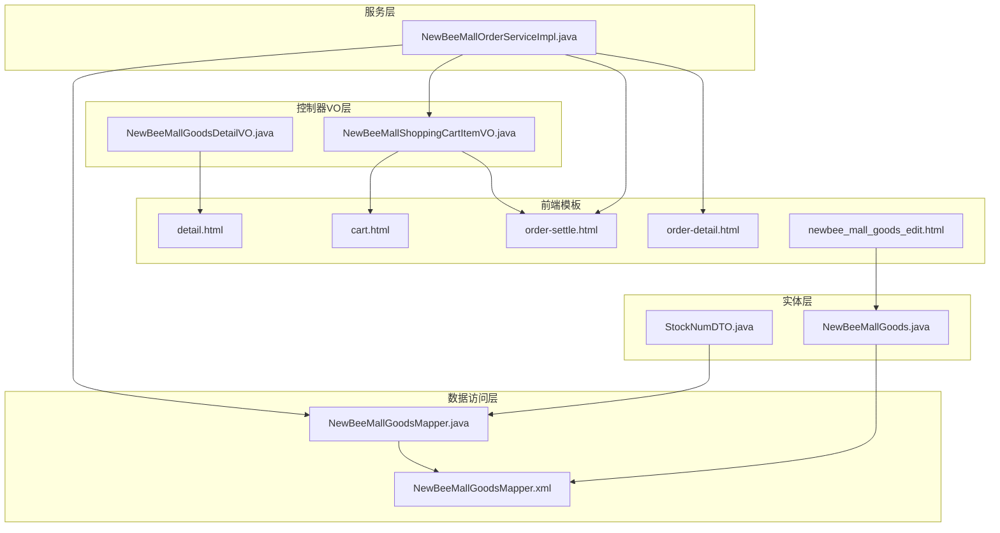
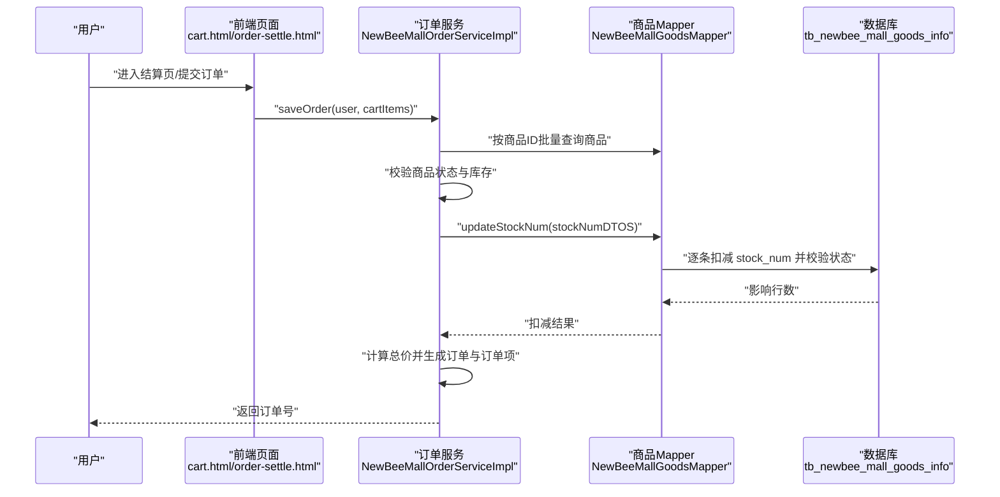
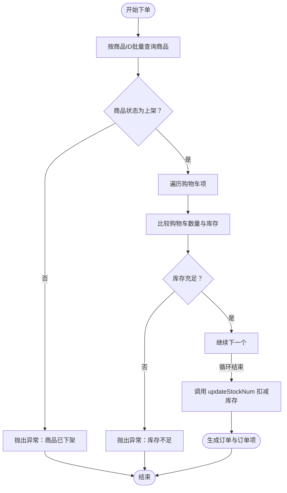
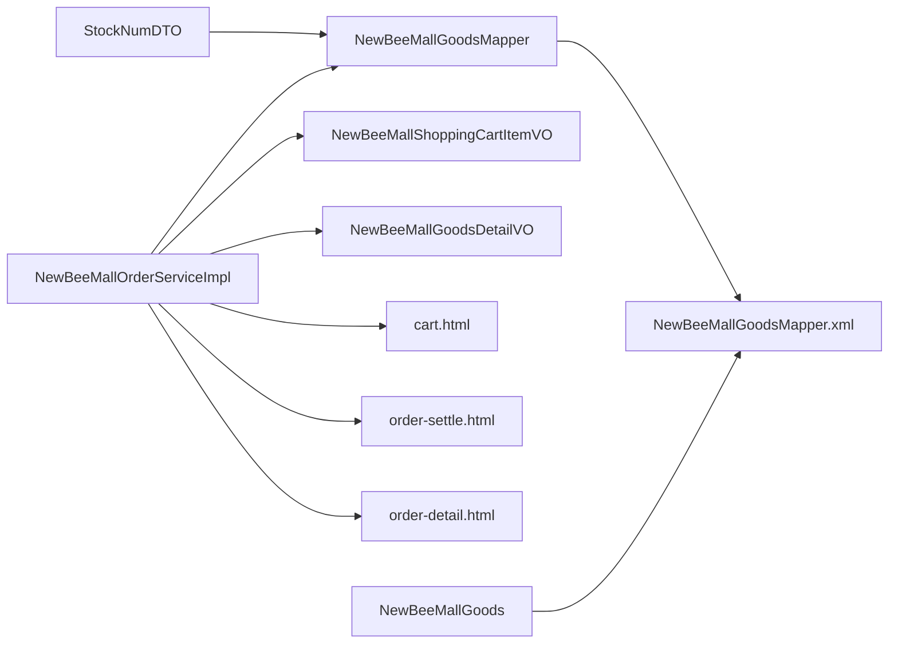

# 价格与库存管理

<cite>
**本文引用的文件**
- [NewBeeMallGoods.java](file://src/main/java/ltd/newbee/mall/entity/NewBeeMallGoods.java)
- [NewBeeMallGoodsMapper.java](file://src/main/java/ltd/newbee/mall/dao/NewBeeMallGoodsMapper.java)
- [NewBeeMallGoodsMapper.xml](file://src/main/resources/mapper/NewBeeMallGoodsMapper.xml)
- [StockNumDTO.java](file://src/main/java/ltd/newbee/mall/entity/StockNumDTO.java)
- [NewBeeMallOrderServiceImpl.java](file://src/main/java/ltd/newbee/mall/service/impl/NewBeeMallOrderServiceImpl.java)
- [NewBeeMallShoppingCartItemVO.java](file://src/main/java/ltd/newbee/mall/controller/vo/NewBeeMallShoppingCartItemVO.java)
- [NewBeeMallGoodsDetailVO.java](file://src/main/java/ltd/newbee/mall/controller/vo/NewBeeMallGoodsDetailVO.java)
- [detail.html](file://src/main/resources/templates/mall/detail.html)
- [cart.html](file://src/main/resources/templates/mall/cart.html)
- [order-settle.html](file://src/main/resources/templates/mall/order-settle.html)
- [order-detail.html](file://src/main/resources/templates/mall/order-detail.html)
- [newbee_mall_goods_edit.html](file://src/main/resources/templates/admin/newbee_mall_goods_edit.html)
- [newbee_mall_goods_edit.js](file://src/main/resources/static/admin/dist/js/newbee_mall_goods_edit.js)
- [Constants.java](file://src/main/java/ltd/newbee/mall/common/Constants.java)
</cite>

## 目录
1. [引言](#引言)
2. [项目结构](#项目结构)
3. [核心组件](#核心组件)
4. [架构总览](#架构总览)
5. [详细组件分析](#详细组件分析)
6. [依赖关系分析](#依赖关系分析)
7. [性能考量](#性能考量)
8. [故障排查指南](#故障排查指南)
9. [结论](#结论)

## 引言
本文件聚焦于 newbee-mall 系统的商品价格与库存管理，围绕以下目标展开：
- 解释商品实体中的价格体系：原价 originalPrice 与售价 sellingPrice 的含义与用途
- 说明库存字段 stockNum 的作用与约束
- 描述数据库层字段定义与 Java 实体映射
- 详述下单流程中的库存校验与扣减逻辑
- 展示价格与库存在商品详情页、购物车、订单中的呈现与使用

## 项目结构
与价格与库存相关的关键模块分布如下：
- 实体层：商品实体 NewBeeMallGoods，库存 DTO StockNumDTO
- 数据访问层：NewBeeMallGoodsMapper 接口及其 MyBatis 映射文件
- 服务层：NewBeeMallOrderServiceImpl 中的下单流程与库存处理
- 控制器 VO 层：购物车项 VO NewBeeMallShoppingCartItemVO、商品详情 VO NewBeeMallGoodsDetailVO
- 前端模板：商品详情、购物车、订单结算与详情页面
- 后台编辑页面：商品新增/编辑时的价格与库存输入校验

图表来源
- [NewBeeMallGoods.java](file://src/main/java/ltd/newbee/mall/entity/NewBeeMallGoods.java#L1-L202)
- [NewBeeMallGoodsMapper.java](file://src/main/java/ltd/newbee/mall/dao/NewBeeMallGoodsMapper.java#L1-L53)
- [NewBeeMallGoodsMapper.xml](file://src/main/resources/mapper/NewBeeMallGoodsMapper.xml#L1-L391)
- [StockNumDTO.java](file://src/main/java/ltd/newbee/mall/entity/StockNumDTO.java#L1-L35)
- [NewBeeMallOrderServiceImpl.java](file://src/main/java/ltd/newbee/mall/service/impl/NewBeeMallOrderServiceImpl.java#L1-L429)
- [NewBeeMallShoppingCartItemVO.java](file://src/main/java/ltd/newbee/mall/controller/vo/NewBeeMallShoppingCartItemVO.java#L1-L78)
- [NewBeeMallGoodsDetailVO.java](file://src/main/java/ltd/newbee/mall/controller/vo/NewBeeMallGoodsDetailVO.java#L1-L99)
- [detail.html](file://src/main/resources/templates/mall/detail.html#L1-L166)
- [cart.html](file://src/main/resources/templates/mall/cart.html#L1-L210)
- [order-settle.html](file://src/main/resources/templates/mall/order-settle.html#L1-L243)
- [order-detail.html](file://src/main/resources/templates/mall/order-detail.html#L1-L288)
- [newbee_mall_goods_edit.html](file://src/main/resources/templates/admin/newbee_mall_goods_edit.html#L80-L98)

章节来源
- [NewBeeMallGoods.java](file://src/main/java/ltd/newbee/mall/entity/NewBeeMallGoods.java#L1-L202)
- [NewBeeMallGoodsMapper.java](file://src/main/java/ltd/newbee/mall/dao/NewBeeMallGoodsMapper.java#L1-L53)
- [NewBeeMallGoodsMapper.xml](file://src/main/resources/mapper/NewBeeMallGoodsMapper.xml#L1-L391)
- [NewBeeMallOrderServiceImpl.java](file://src/main/java/ltd/newbee/mall/service/impl/NewBeeMallOrderServiceImpl.java#L1-L429)
- [NewBeeMallShoppingCartItemVO.java](file://src/main/java/ltd/newbee/mall/controller/vo/NewBeeMallShoppingCartItemVO.java#L1-L78)
- [NewBeeMallGoodsDetailVO.java](file://src/main/java/ltd/newbee/mall/controller/vo/NewBeeMallGoodsDetailVO.java#L1-L99)
- [detail.html](file://src/main/resources/templates/mall/detail.html#L1-L166)
- [cart.html](file://src/main/resources/templates/mall/cart.html#L1-L210)
- [order-settle.html](file://src/main/resources/templates/mall/order-settle.html#L1-L243)
- [order-detail.html](file://src/main/resources/templates/mall/order-detail.html#L1-L288)
- [newbee_mall_goods_edit.html](file://src/main/resources/templates/admin/newbee_mall_goods_edit.html#L80-L98)

## 核心组件
- 商品实体 NewBeeMallGoods：包含原价 originalPrice、售价 sellingPrice、库存 stockNum 等关键字段
- 库存 DTO StockNumDTO：用于批量扣减/恢复库存的数据传输对象
- 商品 Mapper：提供按主键查询、批量查询、库存扣减与恢复等能力
- 订单服务实现 NewBeeMallOrderServiceImpl：下单时校验库存并扣减库存，取消/关闭订单时恢复库存
- 控制器 VO：购物车项 VO 与商品详情 VO 传递价格与库存信息给前端
- 前端模板：在商品详情、购物车、订单结算与详情页展示价格与库存

章节来源
- [NewBeeMallGoods.java](file://src/main/java/ltd/newbee/mall/entity/NewBeeMallGoods.java#L1-L202)
- [StockNumDTO.java](file://src/main/java/ltd/newbee/mall/entity/StockNumDTO.java#L1-L35)
- [NewBeeMallGoodsMapper.java](file://src/main/java/ltd/newbee/mall/dao/NewBeeMallGoodsMapper.java#L1-L53)
- [NewBeeMallOrderServiceImpl.java](file://src/main/java/ltd/newbee/mall/service/impl/NewBeeMallOrderServiceImpl.java#L185-L263)

## 架构总览
价格与库存管理贯穿“前端展示—服务层校验—数据库扣减”的闭环流程。下单时先校验商品状态与库存，再扣减库存，最后生成订单与订单项；取消/关闭订单时恢复库存。

图表来源
- [NewBeeMallOrderServiceImpl.java](file://src/main/java/ltd/newbee/mall/service/impl/NewBeeMallOrderServiceImpl.java#L185-L263)
- [NewBeeMallGoodsMapper.java](file://src/main/java/ltd/newbee/mall/dao/NewBeeMallGoodsMapper.java#L45-L50)
- [NewBeeMallGoodsMapper.xml](file://src/main/resources/mapper/NewBeeMallGoodsMapper.xml#L59-L70)

## 详细组件分析

### 商品实体与数据库映射
- 字段定义
  - 原价 originalPrice：整型，用于展示与对比
  - 售价 sellingPrice：整型，用于实际结算
  - 库存 stockNum：整型，用于库存控制
- 数据库映射
  - MyBatis 结果映射 BaseResultMap 将数据库列 original_price、selling_price、stock_num 映射到 Java 实体
  - 批量查询与排序等 SQL 使用上述列名
- 前端展示
  - 商品详情页 detail.html 展示 sellingPrice 与 originalPrice，并以“现价/原价”形式呈现
  - 后台编辑页 newbee_mall_goods_edit.html 支持 originalPrice、sellingPrice、stockNum 的录入与校验

章节来源
- [NewBeeMallGoods.java](file://src/main/java/ltd/newbee/mall/entity/NewBeeMallGoods.java#L28-L32)
- [NewBeeMallGoodsMapper.xml](file://src/main/resources/mapper/NewBeeMallGoodsMapper.xml#L1-L31)
- [detail.html](file://src/main/resources/templates/mall/detail.html#L29-L34)
- [newbee_mall_goods_edit.html](file://src/main/resources/templates/admin/newbee_mall_goods_edit.html#L80-L98)

### 库存管理机制
- 下单前库存校验
  - 服务实现中按购物车项中的商品 ID 批量查询商品，校验商品状态为“上架”，并逐项比较购物车数量与商品库存
  - 若任一商品库存不足，则抛出异常，阻止下单
- 扣减库存
  - 成功校验后，将购物车项转换为 StockNumDTO 列表，调用 updateStockNum
  - MyBatis 通过 foreach 循环逐条执行扣减，同时校验商品状态为“上架”
- 取消/关闭订单恢复库存
  - 通过 recoverStockNum 将订单项中的数量加回到对应商品库存
  - 同样在校验商品状态为“上架”的前提下进行

图表来源
- [NewBeeMallOrderServiceImpl.java](file://src/main/java/ltd/newbee/mall/service/impl/NewBeeMallOrderServiceImpl.java#L185-L263)
- [NewBeeMallGoodsMapper.xml](file://src/main/resources/mapper/NewBeeMallGoodsMapper.xml#L59-L70)

章节来源
- [NewBeeMallOrderServiceImpl.java](file://src/main/java/ltd/newbee/mall/service/impl/NewBeeMallOrderServiceImpl.java#L185-L263)
- [NewBeeMallGoodsMapper.xml](file://src/main/resources/mapper/NewBeeMallGoodsMapper.xml#L59-L70)

### 价格与库存在各页面的展示与使用
- 商品详情页
  - 展示 sellingPrice 与 originalPrice，体现促销价格与原价对比
  - 用于“立即选购/加入购物车”的交互入口
- 购物车页
  - 展示商品名称、单价（sellingPrice）、数量与小计（单价×数量）
  - 提交订单时携带购物车项，服务层据此计算总价并校验库存
- 订单结算页
  - 展示订单项明细（商品名、单价×数量）
  - 展示应付金额（priceTotal），由服务层计算
- 订单详情页
  - 展示订单项明细与应付金额（totalPrice）
  - 展示订单状态与支付信息

章节来源
- [detail.html](file://src/main/resources/templates/mall/detail.html#L29-L34)
- [cart.html](file://src/main/resources/templates/mall/cart.html#L46-L64)
- [order-settle.html](file://src/main/resources/templates/mall/order-settle.html#L63-L87)
- [order-detail.html](file://src/main/resources/templates/mall/order-detail.html#L134-L160)

### 后台商品编辑与校验
- 后台编辑页支持 originalPrice、sellingPrice、stockNum 的录入
- JS 校验确保价格与库存为有效数值，避免无效数据入库

章节来源
- [newbee_mall_goods_edit.html](file://src/main/resources/templates/admin/newbee_mall_goods_edit.html#L80-L98)
- [newbee_mall_goods_edit.js](file://src/main/resources/static/admin/dist/js/newbee_mall_goods_edit.js#L170-L190)

## 依赖关系分析
- 服务层依赖
  - NewBeeMallOrderServiceImpl 依赖 NewBeeMallGoodsMapper 完成库存扣减/恢复
  - 依赖购物车项 VO NewBeeMallShoppingCartItemVO 与商品详情 VO NewBeeMallGoodsDetailVO 传递价格与数量信息
- 数据层依赖
  - NewBeeMallGoodsMapper.xml 中的 updateStockNum/recoverStockNum 使用 foreach 循环逐条更新库存
  - 查询与排序等 SQL 依赖数据库列名 original_price、selling_price、stock_num
- 前端依赖
  - 页面模板通过 Thymeleaf 绑定 VO 字段，渲染价格与库存

图表来源
- [NewBeeMallOrderServiceImpl.java](file://src/main/java/ltd/newbee/mall/service/impl/NewBeeMallOrderServiceImpl.java#L1-L429)
- [NewBeeMallGoodsMapper.java](file://src/main/java/ltd/newbee/mall/dao/NewBeeMallGoodsMapper.java#L1-L53)
- [NewBeeMallGoodsMapper.xml](file://src/main/resources/mapper/NewBeeMallGoodsMapper.xml#L1-L391)
- [NewBeeMallShoppingCartItemVO.java](file://src/main/java/ltd/newbee/mall/controller/vo/NewBeeMallShoppingCartItemVO.java#L1-L78)
- [NewBeeMallGoodsDetailVO.java](file://src/main/java/ltd/newbee/mall/controller/vo/NewBeeMallGoodsDetailVO.java#L1-L99)
- [cart.html](file://src/main/resources/templates/mall/cart.html#L1-L210)
- [order-settle.html](file://src/main/resources/templates/mall/order-settle.html#L1-L243)
- [order-detail.html](file://src/main/resources/templates/mall/order-detail.html#L1-L288)

## 性能考量
- 批量查询与扣减
  - 服务层按商品 ID 批量查询商品，减少多次往返
  - 扣减与恢复库存采用 foreach 循环逐条执行，SQL 层同时校验商品状态，避免并发超卖风险
- 事务与一致性
  - 下单流程使用事务，保证库存扣减与订单生成的一致性
- 前端展示
  - 页面仅展示整数价格，避免前端复杂格式化开销

[本节为通用建议，无需列出具体文件来源]

## 故障排查指南
- “库存不足”异常
  - 触发点：下单时购物车数量超过商品库存
  - 处理：检查商品库存字段与购物车数量，确保库存充足
- “商品已下架”异常
  - 触发点：下单时发现商品状态非上架
  - 处理：将商品状态调整为上架后再尝试下单
- “扣减失败”异常
  - 触发点：updateStockNum 影响行数小于 1
  - 处理：确认商品状态为上架且库存足够；检查商品 ID 是否正确
- “恢复库存失败”异常
  - 触发点：取消/关闭订单时 recoverStockNum 影响行数小于 1
  - 处理：确认订单项与库存一致，检查商品状态

章节来源
- [NewBeeMallOrderServiceImpl.java](file://src/main/java/ltd/newbee/mall/service/impl/NewBeeMallOrderServiceImpl.java#L185-L263)
- [NewBeeMallGoodsMapper.xml](file://src/main/resources/mapper/NewBeeMallGoodsMapper.xml#L59-L70)

## 结论
newbee-mall 的价格与库存管理以清晰的实体与映射为基础，结合服务层严格的下单校验与数据库层面的安全扣减/恢复，实现了从前端展示到订单生成的完整闭环。商品详情页突出 sellingPrice 与 originalPrice 的对比，购物车与订单页以 sellingPrice 与数量计算总价，确保价格与库存信息在业务全流程中保持一致与准确。