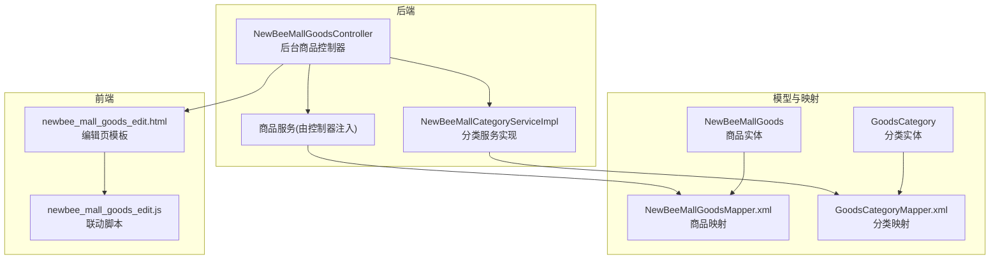
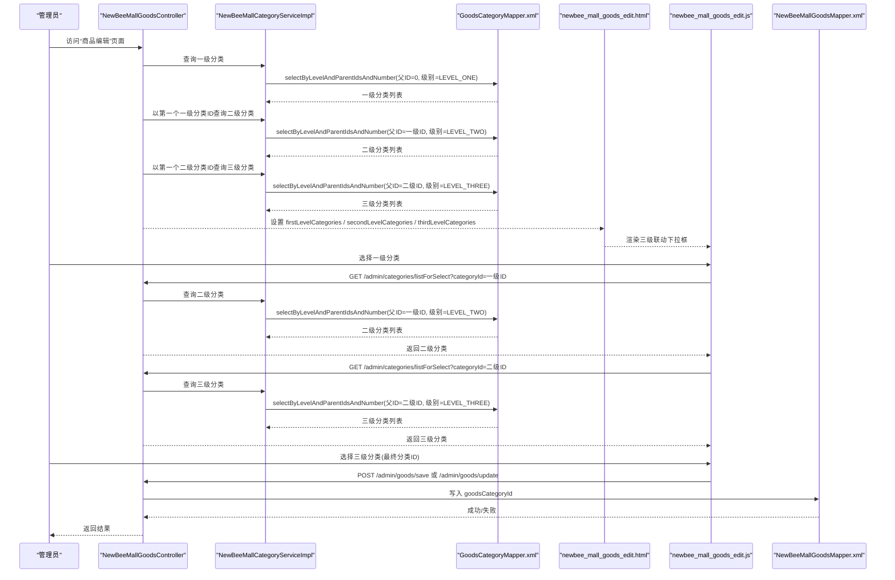
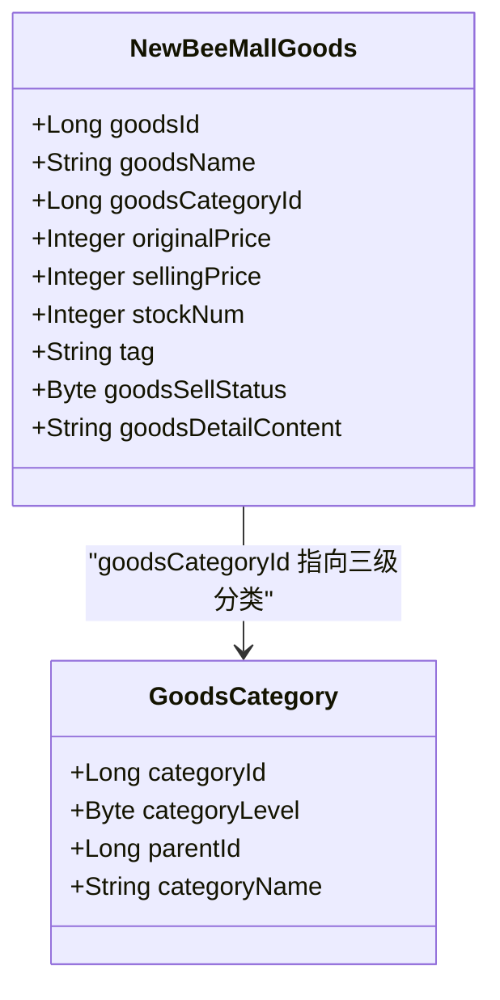
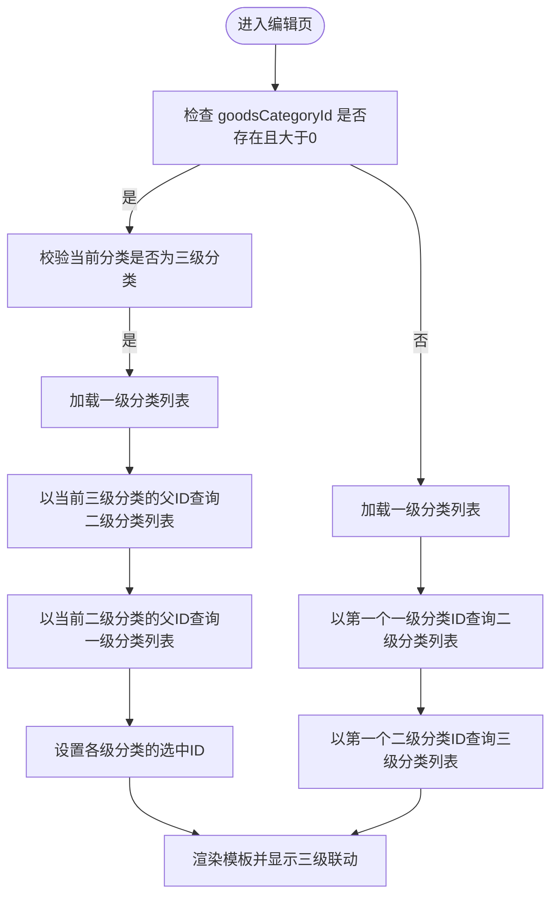
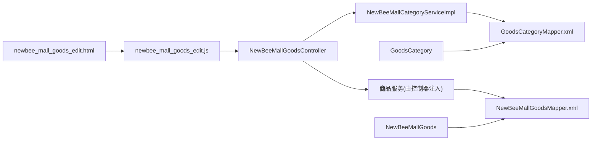

# 分类关联管理

<cite>
**本文引用的文件**
- [NewBeeMallGoods.java](file://src/main/java/ltd/newbee/mall/entity/NewBeeMallGoods.java)
- [NewBeeMallGoodsController.java](file://src/main/java/ltd/newbee/mall/controller/admin/NewBeeMallGoodsController.java)
- [NewBeeMallCategoryServiceImpl.java](file://src/main/java/ltd/newbee/mall/service/impl/NewBeeMallCategoryServiceImpl.java)
- [GoodsCategory.java](file://src/main/java/ltd/newbee/mall/entity/GoodsCategory.java)
- [NewBeeMallCategoryLevelEnum.java](file://src/main/java/ltd/newbee/mall/common/NewBeeMallCategoryLevelEnum.java)
- [GoodsCategoryMapper.xml](file://src/main/resources/mapper/GoodsCategoryMapper.xml)
- [NewBeeMallGoodsMapper.xml](file://src/main/resources/mapper/NewBeeMallGoodsMapper.xml)
- [newbee_mall_goods_edit.html](file://src/main/resources/templates/admin/newbee_mall_goods_edit.html)
- [newbee_mall_goods_edit.js](file://src/main/resources/static/admin/dist/js/newbee_mall_goods_edit.js)
- [newbee_mall_schema.sql](file://src/main/resources/newbee_mall_schema.sql)
</cite>

## 目录
1. [引言](#引言)
2. [项目结构](#项目结构)
3. [核心组件](#核心组件)
4. [架构总览](#架构总览)
5. [详细组件分析](#详细组件分析)
6. [依赖关系分析](#依赖关系分析)
7. [性能考量](#性能考量)
8. [故障排查指南](#故障排查指南)
9. [结论](#结论)
10. [附录](#附录)

## 引言
本文件聚焦于 newbee-mall 系统中“商品分类关联”的实现与使用，围绕商品实体中的分类 ID 字段 goodsCategoryId 展开，解释其在数据库表 tb_newbee_mall_goods_info 中的定义、在 Java 实体 NewBeeMallGoods 中的映射、以及在后台商品编辑流程中的三级联动逻辑与前端展示。文档旨在帮助开发者与维护者快速理解并正确使用三级分类体系，避免错误的分类引用导致的商品展示与检索问题。

## 项目结构
- 后台商品控制器：负责商品编辑页面渲染与保存更新逻辑
- 商品服务层：封装商品增删改查与业务规则
- 分类服务层：提供分类树查询、按层级与父节点查询等能力
- 实体与映射：商品实体 NewBeeMallGoods 与 MyBatis 映射文件
- 前端模板与脚本：商品编辑页模板与联动脚本
- 数据库模式：商品与分类表结构定义

图表来源
- [NewBeeMallGoodsController.java](file://src/main/java/ltd/newbee/mall/controller/admin/NewBeeMallGoodsController.java#L1-L228)
- [NewBeeMallCategoryServiceImpl.java](file://src/main/java/ltd/newbee/mall/service/impl/NewBeeMallCategoryServiceImpl.java#L1-L168)
- [NewBeeMallGoods.java](file://src/main/java/ltd/newbee/mall/entity/NewBeeMallGoods.java#L1-L202)
- [GoodsCategory.java](file://src/main/java/ltd/newbee/mall/entity/GoodsCategory.java#L1-L137)
- [NewBeeMallGoodsMapper.xml](file://src/main/resources/mapper/NewBeeMallGoodsMapper.xml#L1-L391)
- [GoodsCategoryMapper.xml](file://src/main/resources/mapper/GoodsCategoryMapper.xml#L1-L212)
- [newbee_mall_goods_edit.html](file://src/main/resources/templates/admin/newbee_mall_goods_edit.html#L1-L174)
- [newbee_mall_goods_edit.js](file://src/main/resources/static/admin/dist/js/newbee_mall_goods_edit.js#L1-L358)

章节来源
- [NewBeeMallGoodsController.java](file://src/main/java/ltd/newbee/mall/controller/admin/NewBeeMallGoodsController.java#L1-L228)
- [NewBeeMallCategoryServiceImpl.java](file://src/main/java/ltd/newbee/mall/service/impl/NewBeeMallCategoryServiceImpl.java#L1-L168)
- [NewBeeMallGoods.java](file://src/main/java/ltd/newbee/mall/entity/NewBeeMallGoods.java#L1-L202)
- [GoodsCategory.java](file://src/main/java/ltd/newbee/mall/entity/GoodsCategory.java#L1-L137)
- [NewBeeMallGoodsMapper.xml](file://src/main/resources/mapper/NewBeeMallGoodsMapper.xml#L1-L391)
- [GoodsCategoryMapper.xml](file://src/main/resources/mapper/GoodsCategoryMapper.xml#L1-L212)
- [newbee_mall_goods_edit.html](file://src/main/resources/templates/admin/newbee_mall_goods_edit.html#L1-L174)
- [newbee_mall_goods_edit.js](file://src/main/resources/static/admin/dist/js/newbee_mall_goods_edit.js#L1-L358)

## 核心组件
- 商品实体 NewBeeMallGoods：包含 goodsCategoryId 字段，用于绑定三级分类
- 分类实体 GoodsCategory：包含 categoryLevel、parentId 等，用于构建三级分类树
- 分类服务 NewBeeMallCategoryServiceImpl：提供按层级与父节点查询分类的能力
- 商品控制器 NewBeeMallGoodsController：负责后台商品编辑页的渲染与保存
- 前端模板与脚本：提供三级联动选择与提交

章节来源
- [NewBeeMallGoods.java](file://src/main/java/ltd/newbee/mall/entity/NewBeeMallGoods.java#L1-L202)
- [GoodsCategory.java](file://src/main/java/ltd/newbee/mall/entity/GoodsCategory.java#L1-L137)
- [NewBeeMallCategoryLevelEnum.java](file://src/main/java/ltd/newbee/mall/common/NewBeeMallCategoryLevelEnum.java#L1-L59)
- [NewBeeMallCategoryServiceImpl.java](file://src/main/java/ltd/newbee/mall/service/impl/NewBeeMallCategoryServiceImpl.java#L1-L168)
- [NewBeeMallGoodsController.java](file://src/main/java/ltd/newbee/mall/controller/admin/NewBeeMallGoodsController.java#L1-L228)
- [newbee_mall_goods_edit.html](file://src/main/resources/templates/admin/newbee_mall_goods_edit.html#L1-L174)
- [newbee_mall_goods_edit.js](file://src/main/resources/static/admin/dist/js/newbee_mall_goods_edit.js#L1-L358)

## 架构总览
商品分类关联贯穿“控制器 -> 服务 -> 映射 -> 数据库”的链路，同时在前端通过联动脚本完成用户体验优化。

图表来源
- [NewBeeMallGoodsController.java](file://src/main/java/ltd/newbee/mall/controller/admin/NewBeeMallGoodsController.java#L56-L129)
- [NewBeeMallCategoryServiceImpl.java](file://src/main/java/ltd/newbee/mall/service/impl/NewBeeMallCategoryServiceImpl.java#L163-L167)
- [GoodsCategoryMapper.xml](file://src/main/resources/mapper/GoodsCategoryMapper.xml#L63-L77)
- [NewBeeMallGoodsMapper.xml](file://src/main/resources/mapper/NewBeeMallGoodsMapper.xml#L305-L355)
- [newbee_mall_goods_edit.html](file://src/main/resources/templates/admin/newbee_mall_goods_edit.html#L26-L64)
- [newbee_mall_goods_edit.js](file://src/main/resources/static/admin/dist/js/newbee_mall_goods_edit.js#L292-L358)

## 详细组件分析

### 商品实体与数据库字段定义
- 商品实体 NewBeeMallGoods 的 goodsCategoryId 字段用于绑定三级分类 ID
- 数据库表 tb_newbee_mall_goods_info 的 goods_category_id 字段定义为 BIGINT NOT NULL DEFAULT 0
- MyBatis 映射文件 NewBeeMallGoodsMapper.xml 将 goods_category_id 与实体属性映射，并在批量插入、更新等场景中使用该字段

图表来源
- [NewBeeMallGoods.java](file://src/main/java/ltd/newbee/mall/entity/NewBeeMallGoods.java#L1-L202)
- [GoodsCategory.java](file://src/main/java/ltd/newbee/mall/entity/GoodsCategory.java#L1-L137)
- [NewBeeMallGoodsMapper.xml](file://src/main/resources/mapper/NewBeeMallGoodsMapper.xml#L1-L30)
- [newbee_mall_schema.sql](file://src/main/resources/newbee_mall_schema.sql#L1-L503)

章节来源
- [NewBeeMallGoods.java](file://src/main/java/ltd/newbee/mall/entity/NewBeeMallGoods.java#L1-L202)
- [NewBeeMallGoodsMapper.xml](file://src/main/resources/mapper/NewBeeMallGoodsMapper.xml#L1-L30)
- [newbee_mall_schema.sql](file://src/main/resources/newbee_mall_schema.sql#L1-L503)

### 三级分类结构与枚举
- 分类级别枚举 NewBeeMallCategoryLevelEnum 定义了 LEVEL_ONE、LEVEL_TWO、LEVEL_THREE
- 分类实体 GoodsCategory 包含 categoryLevel、parentId 等关键字段，支撑三级树结构
- 分类服务 NewBeeMallCategoryServiceImpl 提供按层级与父节点查询分类的方法

章节来源
- [NewBeeMallCategoryLevelEnum.java](file://src/main/java/ltd/newbee/mall/common/NewBeeMallCategoryLevelEnum.java#L1-L59)
- [GoodsCategory.java](file://src/main/java/ltd/newbee/mall/entity/GoodsCategory.java#L1-L137)
- [NewBeeMallCategoryServiceImpl.java](file://src/main/java/ltd/newbee/mall/service/impl/NewBeeMallCategoryServiceImpl.java#L143-L167)

### 后台商品编辑页的三级联动逻辑
- 新建商品时：控制器先查询一级分类，再以第一个一级分类查询二级分类，再以第一个二级分类查询三级分类，将三组数据写入 request，供模板渲染
- 编辑商品时：若商品已有 goodsCategoryId，控制器会校验该分类是否为三级分类，若是则回显三级分类对应的各级父分类，并设置三级分类的选中状态
- 若 goodsCategoryId 为 0 或为空，则按新建流程初始化联动数据

图表来源
- [NewBeeMallGoodsController.java](file://src/main/java/ltd/newbee/mall/controller/admin/NewBeeMallGoodsController.java#L78-L129)

章节来源
- [NewBeeMallGoodsController.java](file://src/main/java/ltd/newbee/mall/controller/admin/NewBeeMallGoodsController.java#L56-L129)

### 前端模板与脚本的联动实现
- 模板 newbee_mall_goods_edit.html 提供三个 select 下拉框：一级、二级、三级分类
- 脚本 newbee_mall_goods_edit.js 在用户切换一级或二级分类时，通过 AJAX 请求 /admin/categories/listForSelect 获取对应子级分类，并动态刷新下拉框
- 表单提交时，脚本从三级下拉框取值作为 goodsCategoryId，提交到 /admin/goods/save 或 /admin/goods/update

章节来源
- [newbee_mall_goods_edit.html](file://src/main/resources/templates/admin/newbee_mall_goods_edit.html#L26-L64)
- [newbee_mall_goods_edit.js](file://src/main/resources/static/admin/dist/js/newbee_mall_goods_edit.js#L292-L358)

### 数据持久化与查询
- MyBatis 映射文件 NewBeeMallGoodsMapper.xml 在 insertSelective、updateByPrimaryKeySelective 等语句中使用 goods_category_id 字段
- 商品列表查询与搜索也支持按 goods_category_id 过滤

章节来源
- [NewBeeMallGoodsMapper.xml](file://src/main/resources/mapper/NewBeeMallGoodsMapper.xml#L202-L355)

## 依赖关系分析
- 控制器依赖分类服务与商品服务
- 分类服务依赖分类映射
- 商品实体与映射文件相互绑定
- 前端模板依赖脚本，脚本依赖控制器提供的分类接口

图表来源
- [NewBeeMallGoodsController.java](file://src/main/java/ltd/newbee/mall/controller/admin/NewBeeMallGoodsController.java#L1-L228)
- [NewBeeMallCategoryServiceImpl.java](file://src/main/java/ltd/newbee/mall/service/impl/NewBeeMallCategoryServiceImpl.java#L1-L168)
- [NewBeeMallGoods.java](file://src/main/java/ltd/newbee/mall/entity/NewBeeMallGoods.java#L1-L202)
- [GoodsCategory.java](file://src/main/java/ltd/newbee/mall/entity/GoodsCategory.java#L1-L137)
- [NewBeeMallGoodsMapper.xml](file://src/main/resources/mapper/NewBeeMallGoodsMapper.xml#L1-L391)
- [GoodsCategoryMapper.xml](file://src/main/resources/mapper/GoodsCategoryMapper.xml#L1-L212)
- [newbee_mall_goods_edit.html](file://src/main/resources/templates/admin/newbee_mall_goods_edit.html#L1-L174)
- [newbee_mall_goods_edit.js](file://src/main/resources/static/admin/dist/js/newbee_mall_goods_edit.js#L1-L358)

章节来源
- [NewBeeMallGoodsController.java](file://src/main/java/ltd/newbee/mall/controller/admin/NewBeeMallGoodsController.java#L1-L228)
- [NewBeeMallCategoryServiceImpl.java](file://src/main/java/ltd/newbee/mall/service/impl/NewBeeMallCategoryServiceImpl.java#L1-L168)
- [NewBeeMallGoods.java](file://src/main/java/ltd/newbee/mall/entity/NewBeeMallGoods.java#L1-L202)
- [GoodsCategory.java](file://src/main/java/ltd/newbee/mall/entity/GoodsCategory.java#L1-L137)
- [NewBeeMallGoodsMapper.xml](file://src/main/resources/mapper/NewBeeMallGoodsMapper.xml#L1-L391)
- [GoodsCategoryMapper.xml](file://src/main/resources/mapper/GoodsCategoryMapper.xml#L1-L212)
- [newbee_mall_goods_edit.html](file://src/main/resources/templates/admin/newbee_mall_goods_edit.html#L1-L174)
- [newbee_mall_goods_edit.js](file://src/main/resources/static/admin/dist/js/newbee_mall_goods_edit.js#L1-L358)

## 性能考量
- 分类查询：按层级与父节点查询分类时，建议在数据库层面建立合适的索引（如 category_level、parent_id），以降低查询成本
- 前端联动：AJAX 请求应尽量复用，避免重复请求同一父节点下的子级分类
- 商品列表与搜索：按 goods_category_id 查询时，确保商品表上存在对应索引，提升筛选效率

## 故障排查指南
- 分类数据不完善：当控制器无法加载到任何一级分类或二级分类时，会抛出异常提示“分类数据不完善”，需检查分类表数据是否完整
- 三级分类校验：编辑商品时若 goodsCategoryId 指向非三级分类，控制器会拒绝该数据，需确保商品绑定的是三级分类
- 前端联动失效：若切换一级或二级分类后三级下拉框未刷新，检查 /admin/categories/listForSelect 接口是否返回正确数据，以及脚本中 AJAX 回调逻辑

章节来源
- [NewBeeMallGoodsController.java](file://src/main/java/ltd/newbee/mall/controller/admin/NewBeeMallGoodsController.java#L56-L129)
- [newbee_mall_goods_edit.js](file://src/main/resources/static/admin/dist/js/newbee_mall_goods_edit.js#L292-L358)

## 结论
- 商品实体中的 goodsCategoryId 必须指向三级分类，这是系统对商品分类绑定的约束
- 后台编辑页通过控制器与服务层的协作，实现了完整的三级联动选择体验
- 前端脚本负责实时刷新子级分类，确保用户选择的始终是有效的三级分类
- 数据库层通过映射文件将 goods_category_id 与实体绑定，保障数据一致性

## 附录
- 数据库表结构参考：商品表与分类表的字段定义与约束
- 常见问题：确认 goods_category_id 是否为三级分类、检查分类数据完整性、验证前端联动脚本与接口返回

章节来源
- [newbee_mall_schema.sql](file://src/main/resources/newbee_mall_schema.sql#L1-L503)