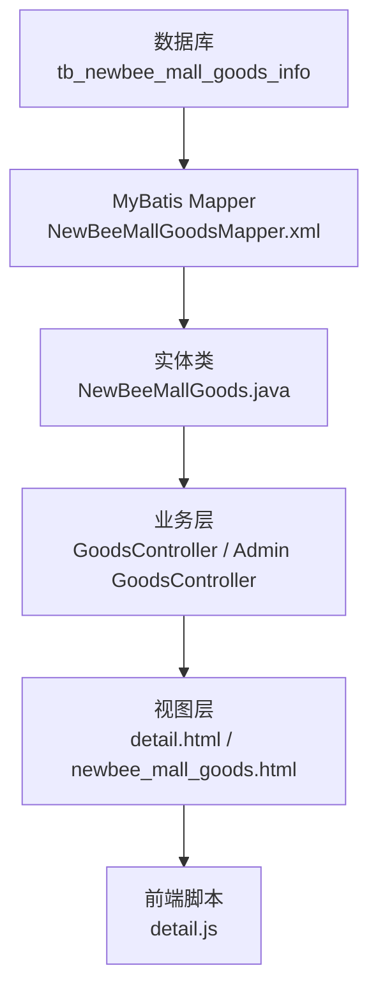
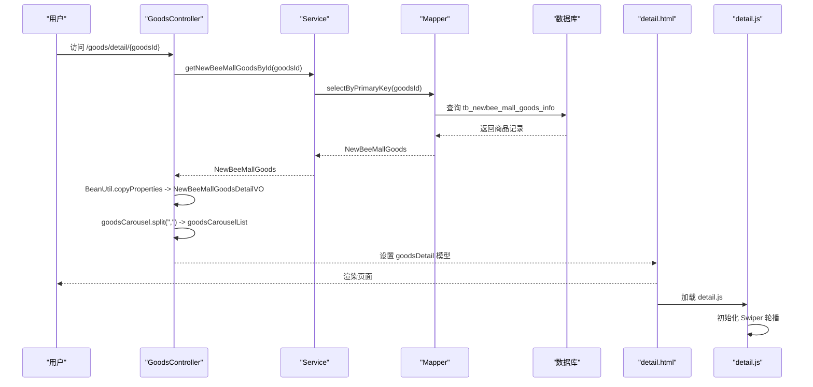
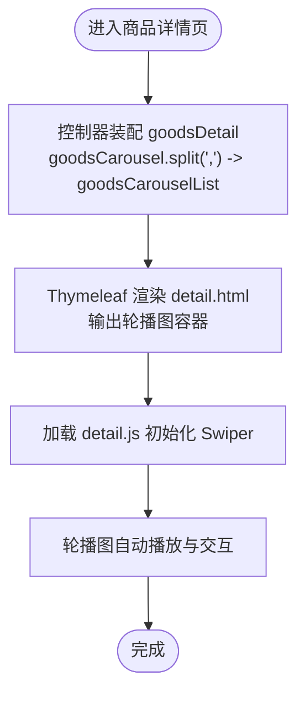
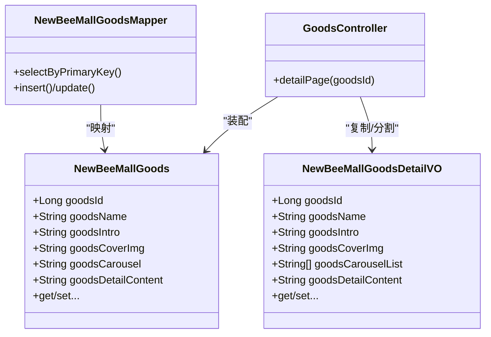

# 商品基本信息

<cite>
**本文引用的文件**
- [NewBeeMallGoods.java](file://src/main/java/ltd/newbee/mall/entity/NewBeeMallGoods.java)
- [NewBeeMallGoodsMapper.xml](file://src/main/resources/mapper/NewBeeMallGoodsMapper.xml)
- [newbee_mall_schema.sql](file://src/main/resources/newbee_mall_schema.sql)
- [GoodsController.java](file://src/main/java/ltd/newbee/mall/controller/mall/GoodsController.java)
- [NewBeeMallGoodsController.java](file://src/main/java/ltd/newbee/mall/controller/admin/NewBeeMallGoodsController.java)
- [NewBeeMallGoodsDetailVO.java](file://src/main/java/ltd/newbee/mall/controller/vo/NewBeeMallGoodsDetailVO.java)
- [detail.html](file://src/main/resources/templates/mall/detail.html)
- [newbee_mall_goods.html](file://src/main/resources/templates/admin/newbee_mall_goods.html)
- [detail.js](file://src/main/resources/static/mall/js/detail.js)
</cite>

## 目录
1. [引言](#引言)
2. [项目结构](#项目结构)
3. [核心组件](#核心组件)
4. [架构总览](#架构总览)
5. [详细组件分析](#详细组件分析)
6. [依赖关系分析](#依赖关系分析)
7. [性能考量](#性能考量)
8. [故障排查指南](#故障排查指南)
9. [结论](#结论)
10. [附录](#附录)

## 引言
本文件聚焦于 newbee-mall 系统的商品基本信息，围绕商品实体中的关键字段：商品ID（goodsId）、商品名称（goodsName）、商品简介（goodsIntro）、主图（goodsCoverImg）、轮播图（goodsCarousel）展开，结合数据库表结构、Java 实体类、MyBatis 映射、前后端模板与脚本，系统化说明这些字段在数据库中的定义、Java 实体类的 getter/setter 实现、以及在前台商品详情页与后台商品管理页的展示与交互方式。

## 项目结构
- 数据库层：商品信息存储于 tb_newbee_mall_goods_info 表，包含 goods_id、goods_name、goods_intro、goods_cover_img、goods_carousel、goods_detail_content 等字段。
- 映射层：MyBatis Mapper 将数据库列映射到 NewBeeMallGoods 实体类属性。
- 业务层：GoodsController 提供前台详情页路由与数据装配；Admin GoodsController 提供后台商品管理接口与校验。
- 视图层：前台 detail.html 展示商品名称、简介、主图与详情内容；后台 newbee_mall_goods.html 作为商品管理页面入口。
- 前端脚本：detail.js 初始化商品轮播图组件。

图表来源
- [NewBeeMallGoodsMapper.xml](file://src/main/resources/mapper/NewBeeMallGoodsMapper.xml#L1-L40)
- [NewBeeMallGoods.java](file://src/main/java/ltd/newbee/mall/entity/NewBeeMallGoods.java#L1-L202)
- [GoodsController.java](file://src/main/java/ltd/newbee/mall/controller/mall/GoodsController.java#L74-L88)
- [NewBeeMallGoodsController.java](file://src/main/java/ltd/newbee/mall/controller/admin/NewBeeMallGoodsController.java#L148-L197)
- [detail.html](file://src/main/resources/templates/mall/detail.html#L20-L65)
- [newbee_mall_goods.html](file://src/main/resources/templates/admin/newbee_mall_goods.html#L1-L88)
- [detail.js](file://src/main/resources/static/mall/js/detail.js#L1-L18)

章节来源
- [NewBeeMallGoods.java](file://src/main/java/ltd/newbee/mall/entity/NewBeeMallGoods.java#L1-L202)
- [NewBeeMallGoodsMapper.xml](file://src/main/resources/mapper/NewBeeMallGoodsMapper.xml#L1-L40)
- [newbee_mall_schema.sql](file://src/main/resources/newbee_mall_schema.sql#L196-L208)
- [GoodsController.java](file://src/main/java/ltd/newbee/mall/controller/mall/GoodsController.java#L74-L88)
- [NewBeeMallGoodsController.java](file://src/main/java/ltd/newbee/mall/controller/admin/NewBeeMallGoodsController.java#L148-L197)
- [detail.html](file://src/main/resources/templates/mall/detail.html#L20-L65)
- [newbee_mall_goods.html](file://src/main/resources/templates/admin/newbee_mall_goods.html#L1-L88)
- [detail.js](file://src/main/resources/static/mall/js/detail.js#L1-L18)

## 核心组件
- 商品实体 NewBeeMallGoods：包含 goodsId、goodsName、goodsIntro、goodsCoverImg、goodsCarousel、goodsDetailContent 等属性及其对应的 getter/setter 方法。
- MyBatis 映射 NewBeeMallGoodsMapper：将数据库列映射到实体属性，并提供插入、更新、查询等 SQL。
- 数据库表结构 newbee_mall_schema：定义 goods_name、goods_intro、goods_cover_img、goods_carousel 等字段的类型与约束。
- 前台控制器 GoodsController：组装商品详情 VO，将 goodsCarousel 按逗号分割为数组传入模板。
- 后台控制器 NewBeeMallGoodsController：提供商品列表、保存、更新、状态变更等接口，并对关键字段进行参数校验。
- 前台模板 detail.html：渲染商品名称、简介、主图、详情内容与轮播图容器。
- 前端脚本 detail.js：初始化 Swiper 轮播组件，消费 goodsCarouselList。

章节来源
- [NewBeeMallGoods.java](file://src/main/java/ltd/newbee/mall/entity/NewBeeMallGoods.java#L1-L202)
- [NewBeeMallGoodsMapper.xml](file://src/main/resources/mapper/NewBeeMallGoodsMapper.xml#L1-L40)
- [newbee_mall_schema.sql](file://src/main/resources/newbee_mall_schema.sql#L196-L208)
- [GoodsController.java](file://src/main/java/ltd/newbee/mall/controller/mall/GoodsController.java#L74-L88)
- [NewBeeMallGoodsController.java](file://src/main/java/ltd/newbee/mall/controller/admin/NewBeeMallGoodsController.java#L148-L197)
- [detail.html](file://src/main/resources/templates/mall/detail.html#L20-L65)
- [detail.js](file://src/main/resources/static/mall/js/detail.js#L1-L18)

## 架构总览
商品基本信息在系统中的流转路径如下：
- 数据库层：tb_newbee_mall_goods_info 存储商品数据。
- 映射层：MyBatis Mapper 将数据库列映射到 NewBeeMallGoods。
- 控制器层：GoodsController 获取商品并装配 NewBeeMallGoodsDetailVO，其中 goodsCarouselList 由 goodsCarousel 按逗号分割而来。
- 视图层：detail.html 使用 Thymeleaf 渲染商品名称、简介、主图、详情内容与轮播图容器。
- 前端脚本：detail.js 初始化 Swiper，消费 goodsCarouselList 渲染轮播图。

图表来源
- [GoodsController.java](file://src/main/java/ltd/newbee/mall/controller/mall/GoodsController.java#L74-L88)
- [NewBeeMallGoodsMapper.xml](file://src/main/resources/mapper/NewBeeMallGoodsMapper.xml#L43-L51)
- [detail.html](file://src/main/resources/templates/mall/detail.html#L20-L65)
- [detail.js](file://src/main/resources/static/mall/js/detail.js#L1-L18)

章节来源
- [GoodsController.java](file://src/main/java/ltd/newbee/mall/controller/mall/GoodsController.java#L74-L88)
- [NewBeeMallGoodsMapper.xml](file://src/main/resources/mapper/NewBeeMallGoodsMapper.xml#L43-L51)
- [detail.html](file://src/main/resources/templates/mall/detail.html#L20-L65)
- [detail.js](file://src/main/resources/static/mall/js/detail.js#L1-L18)

## 详细组件分析

### 商品实体与字段定义
- 商品ID（goodsId）
  - Java 类型：Long
  - MyBatis 映射：goods_id -> property="goodsId"
  - 数据库约束：主键，自增
- 商品名称（goodsName）
  - Java 类型：String
  - MyBatis 映射：goods_name -> property="goodsName"
  - 数据库类型：varchar(200)，NOT NULL，默认空字符串
  - Java setter：去除前后空白
- 商品简介（goodsIntro）
  - Java 类型：String
  - MyBatis 映射：goods_intro -> property="goodsIntro"
  - 数据库类型：varchar(200)，NOT NULL，默认空字符串
  - Java setter：去除前后空白
- 主图（goodsCoverImg）
  - Java 类型：String
  - MyBatis 映射：goods_cover_img -> property="goodsCoverImg"
  - 数据库类型：varchar(200)，NOT NULL，默认 '/admin/dist/img/no-img.png'
  - Java setter：去除前后空白
- 轮播图（goodsCarousel）
  - Java 类型：String
  - MyBatis 映射：goods_carousel -> property="goodsCarousel"
  - 数据库类型：varchar(500)，NOT NULL，默认 '/admin/dist/img/no-img.png'
  - Java setter：去除前后空白
- 详情内容（goodsDetailContent）
  - Java 类型：String
  - MyBatis 映射：goods_detail_content -> property="goodsDetailContent"
  - 数据库类型：text，NOT NULL
  - Java setter：去除前后空白

章节来源
- [NewBeeMallGoods.java](file://src/main/java/ltd/newbee/mall/entity/NewBeeMallGoods.java#L1-L202)
- [NewBeeMallGoodsMapper.xml](file://src/main/resources/mapper/NewBeeMallGoodsMapper.xml#L1-L23)
- [newbee_mall_schema.sql](file://src/main/resources/newbee_mall_schema.sql#L196-L208)

### 数据库表结构与字段约束
- 表：tb_newbee_mall_goods_info
- 关键字段与约束（节选）：
  - goods_name：varchar(200) NOT NULL DEFAULT ''
  - goods_intro：varchar(200) NOT NULL DEFAULT ''
  - goods_cover_img：varchar(200) NOT NULL DEFAULT '/admin/dist/img/no-img.png'
  - goods_carousel：varchar(500) NOT NULL DEFAULT '/admin/dist/img/no-img.png'
  - goods_detail_content：text NOT NULL
  - goods_id：主键，自增

章节来源
- [newbee_mall_schema.sql](file://src/main/resources/newbee_mall_schema.sql#L196-L208)

### Java 实体类与 MyBatis 映射
- 实体类 NewBeeMallGoods
  - getter/setter：提供 goodsId、goodsName、goodsIntro、goodsCoverImg、goodsCarousel、goodsDetailContent 等属性的访问方法
  - trim 处理：在 setter 中统一去除前后空白，避免冗余空格影响展示与比较
- MyBatis Mapper
  - BaseResultMap：将 goods_name、goods_intro、goods_cover_img、goods_carousel 等列映射到实体属性
  - ResultMapWithBLOBs：额外映射 goods_detail_content（LONGVARCHAR）
  - 插入/更新语句：覆盖 goods_name、goods_intro、goods_cover_img、goods_carousel、goods_detail_content 等字段

章节来源
- [NewBeeMallGoods.java](file://src/main/java/ltd/newbee/mall/entity/NewBeeMallGoods.java#L1-L202)
- [NewBeeMallGoodsMapper.xml](file://src/main/resources/mapper/NewBeeMallGoodsMapper.xml#L1-L23)
- [NewBeeMallGoodsMapper.xml](file://src/main/resources/mapper/NewBeeMallGoodsMapper.xml#L188-L201)
- [NewBeeMallGoodsMapper.xml](file://src/main/resources/mapper/NewBeeMallGoodsMapper.xml#L305-L355)

### 前台商品详情页展示
- 页面模板：detail.html
  - 商品名称：th:text="${goodsDetail.goodsName}"
  - 商品简介：th:text="${goodsDetail.goodsIntro}"
  - 主图：th:src="@{${goodsDetail.goodsCoverImg}}"
  - 详情内容：th:utext="${goodsDetail.goodsDetailContent}"（支持 HTML）
  - 轮播图容器：页面包含轮播图结构，具体图片由 goodsCarouselList 渲染
- 控制器装配：
  - GoodsController 在 detailPage 中将 NewBeeMallGoods 转换为 NewBeeMallGoodsDetailVO，并将 goodsCarousel 按逗号分割为数组（goodsCarouselList）

章节来源
- [detail.html](file://src/main/resources/templates/mall/detail.html#L20-L65)
- [GoodsController.java](file://src/main/java/ltd/newbee/mall/controller/mall/GoodsController.java#L74-L88)
- [NewBeeMallGoodsDetailVO.java](file://src/main/java/ltd/newbee/mall/controller/vo/NewBeeMallGoodsDetailVO.java#L91-L98)

### 后台商品管理页展示
- 页面模板：newbee_mall_goods.html
  - 作为商品管理入口，承载商品列表与操作按钮（添加、修改、上架、下架）
  - 与商品详情页不同，该页面不直接展示商品名称、简介、主图等字段，而是通过列表与编辑页进行维护
- 后台接口：
  - 新增/修改：NewBeeMallGoodsController.save/update 对关键字段进行参数校验（如 goodsName、goodsIntro、goodsCoverImg、goodsDetailContent 等）
  - 列表：/admin/goods/list 返回分页商品数据
  - 状态变更：/admin/goods/status/{sellStatus} 批量修改销售状态

章节来源
- [newbee_mall_goods.html](file://src/main/resources/templates/admin/newbee_mall_goods.html#L1-L88)
- [NewBeeMallGoodsController.java](file://src/main/java/ltd/newbee/mall/controller/admin/NewBeeMallGoodsController.java#L132-L197)

### 轮播图与前端交互
- 数据来源：goodsCarousel（数据库字段）在控制器中按逗号分割为 goodsCarouselList（VO 属性）
- 前端渲染：detail.html 中包含轮播图结构，配合 detail.js 初始化 Swiper
- Swiper 配置：自动播放、无限循环、分页器与导航按钮

图表来源
- [GoodsController.java](file://src/main/java/ltd/newbee/mall/controller/mall/GoodsController.java#L74-L88)
- [NewBeeMallGoodsDetailVO.java](file://src/main/java/ltd/newbee/mall/controller/vo/NewBeeMallGoodsDetailVO.java#L91-L98)
- [detail.html](file://src/main/resources/templates/mall/detail.html#L20-L65)
- [detail.js](file://src/main/resources/static/mall/js/detail.js#L1-L18)

章节来源
- [GoodsController.java](file://src/main/java/ltd/newbee/mall/controller/mall/GoodsController.java#L74-L88)
- [NewBeeMallGoodsDetailVO.java](file://src/main/java/ltd/newbee/mall/controller/vo/NewBeeMallGoodsDetailVO.java#L91-L98)
- [detail.html](file://src/main/resources/templates/mall/detail.html#L20-L65)
- [detail.js](file://src/main/resources/static/mall/js/detail.js#L1-L18)

### 文本长度限制与前端展示
- 商品名称与简介
  - 数据库长度：varchar(200)
  - Java setter：统一 trim，避免前后空白
  - 前端展示：detail.html 使用 th:text 输出，未见显式的截断逻辑
- 主图与轮播图
  - 数据库长度：主图 varchar(200)，轮播图 varchar(500)
  - 前端展示：detail.html 使用 th:src 输出图片地址
- 详情内容
  - 数据库类型：text
  - 前端展示：detail.html 使用 th:utext 输出 HTML 内容

说明：仓库中未发现针对 goodsName 与 goodsIntro 的显式字符串截断逻辑。若需截断展示，可在模板层或控制器层增加相应处理（例如使用 Thymeleaf 的字符串截断函数或在 VO 中预处理）。

章节来源
- [newbee_mall_schema.sql](file://src/main/resources/newbee_mall_schema.sql#L196-L208)
- [NewBeeMallGoods.java](file://src/main/java/ltd/newbee/mall/entity/NewBeeMallGoods.java#L58-L96)
- [detail.html](file://src/main/resources/templates/mall/detail.html#L20-L65)

## 依赖关系分析
- 实体类与映射
  - NewBeeMallGoods 与 NewBeeMallGoodsMapper.xml 通过 BaseResultMap/ResultMapWithBLOBs 建立列与属性的映射关系
- 控制器与实体/VO
  - GoodsController 通过 BeanUtil 将实体复制到 NewBeeMallGoodsDetailVO，并将 goodsCarousel 分割为 goodsCarouselList
- 前端与后端
  - detail.html 依赖 goodsDetail 模型中的 goodsName、goodsIntro、goodsCoverImg、goodsDetailContent、goodsCarouselList
  - detail.js 依赖 goodsCarouselList 进行轮播图初始化

图表来源
- [NewBeeMallGoods.java](file://src/main/java/ltd/newbee/mall/entity/NewBeeMallGoods.java#L1-L202)
- [NewBeeMallGoodsDetailVO.java](file://src/main/java/ltd/newbee/mall/controller/vo/NewBeeMallGoodsDetailVO.java#L1-L99)
- [GoodsController.java](file://src/main/java/ltd/newbee/mall/controller/mall/GoodsController.java#L74-L88)
- [NewBeeMallGoodsMapper.xml](file://src/main/resources/mapper/NewBeeMallGoodsMapper.xml#L1-L40)

章节来源
- [NewBeeMallGoods.java](file://src/main/java/ltd/newbee/mall/entity/NewBeeMallGoods.java#L1-L202)
- [NewBeeMallGoodsDetailVO.java](file://src/main/java/ltd/newbee/mall/controller/vo/NewBeeMallGoodsDetailVO.java#L1-L99)
- [GoodsController.java](file://src/main/java/ltd/newbee/mall/controller/mall/GoodsController.java#L74-L88)
- [NewBeeMallGoodsMapper.xml](file://src/main/resources/mapper/NewBeeMallGoodsMapper.xml#L1-L40)

## 性能考量
- 数据库层面
  - goods_name、goods_intro、goods_cover_img、goods_carousel 均为较短字符串，索引策略可按业务查询条件评估（如按名称模糊查询、分类筛选）
- 映射与序列化
  - goods_detail_content 为 text，查询时建议仅在详情页按需加载，避免在列表页重复传输大字段
- 前端渲染
  - 轮播图图片数量较多时，建议在后台存储时规范图片尺寸与格式，减少前端渲染压力
- 参数校验
  - 后台保存/更新接口对关键字段进行非空校验，有助于减少无效数据写入数据库

[本节为通用指导，无需特定文件引用]

## 故障排查指南
- 商品名称/简介为空或显示异常
  - 检查数据库字段是否为空或全为空白字符
  - 检查 Java setter 是否正确 trim
  - 检查模板 th:text 是否正确绑定
- 主图/轮播图不显示
  - 检查 goodsCoverImg/goodsCarousel 是否为有效 URL 或相对路径
  - 检查 detail.html 中 th:src 是否正确输出
- 轮播图不播放
  - 检查 goodsCarousel 是否为逗号分隔的多图地址
  - 检查 goodsCarouselList 是否正确传入模板
  - 检查 detail.js 是否加载并初始化 Swiper
- 后台保存失败
  - 检查 NewBeeMallGoodsController.save/update 的参数校验逻辑，确认必填字段均已填写

章节来源
- [NewBeeMallGoodsController.java](file://src/main/java/ltd/newbee/mall/controller/admin/NewBeeMallGoodsController.java#L148-L197)
- [detail.html](file://src/main/resources/templates/mall/detail.html#L20-L65)
- [detail.js](file://src/main/resources/static/mall/js/detail.js#L1-L18)

## 结论
本文件系统梳理了 newbee-mall 商品基本信息的关键字段：goodsId、goodsName、goodsIntro、goodsCoverImg、goodsCarousel。基于数据库表结构、Java 实体类与 MyBatis 映射、控制器装配与模板渲染，明确了字段在系统中的定义、映射与展示路径。前台详情页通过 Thymeleaf 输出商品名称、简介、主图与详情内容，并借助 detail.js 初始化轮播图；后台管理页提供商品列表与编辑能力。若需对商品名称与简介进行截断展示，可在模板或控制器层增加相应处理。

[本节为总结，无需特定文件引用]

## 附录
- 数据库字段与类型对照
  - goods_name：varchar(200)，NOT NULL，默认空字符串
  - goods_intro：varchar(200)，NOT NULL，默认空字符串
  - goods_cover_img：varchar(200)，NOT NULL，默认 '/admin/dist/img/no-img.png'
  - goods_carousel：varchar(500)，NOT NULL，默认 '/admin/dist/img/no-img.png'
  - goods_detail_content：text，NOT NULL

章节来源
- [newbee_mall_schema.sql](file://src/main/resources/newbee_mall_schema.sql#L196-L208)