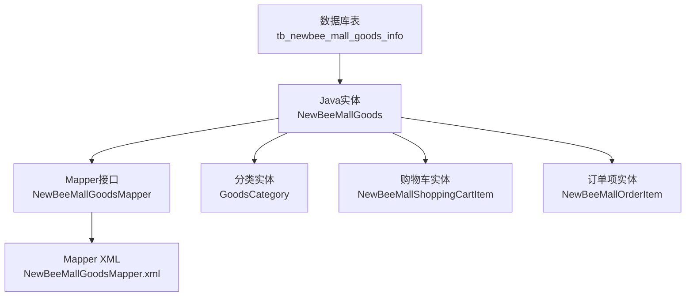
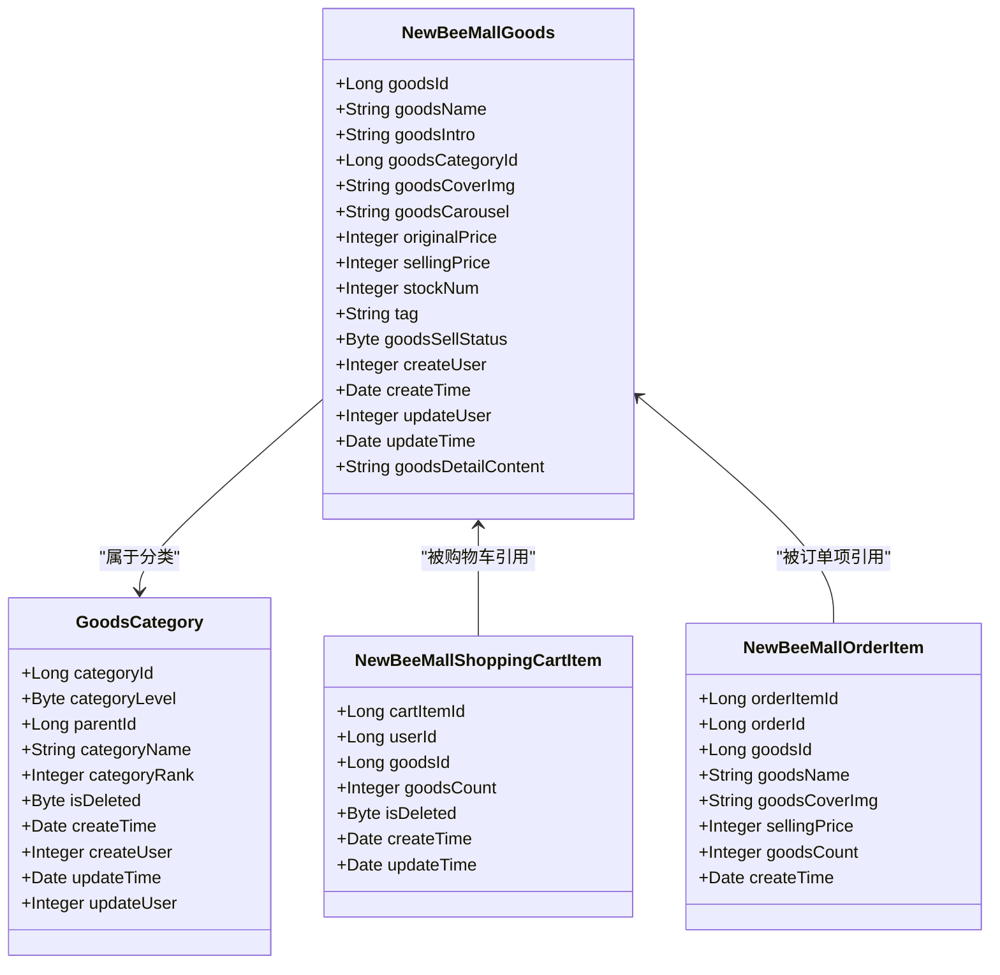
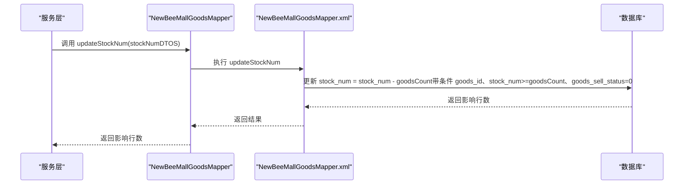
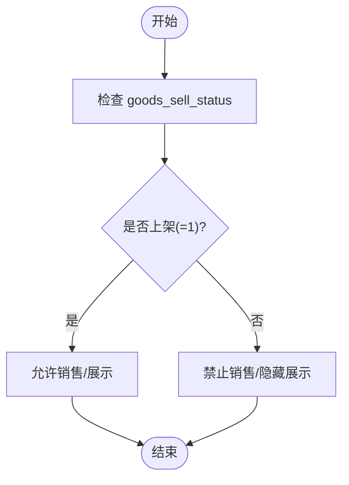
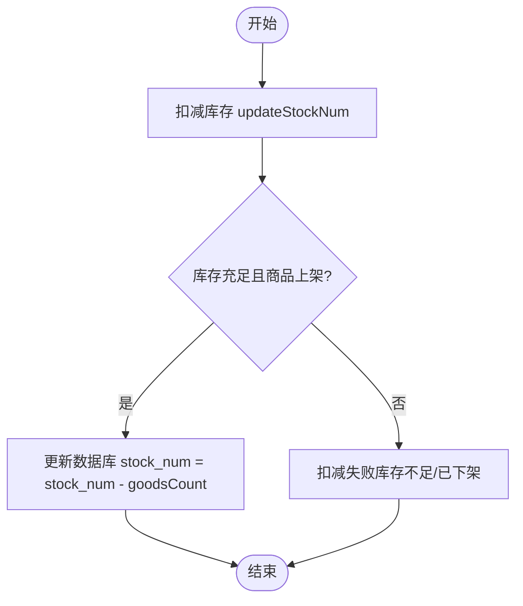
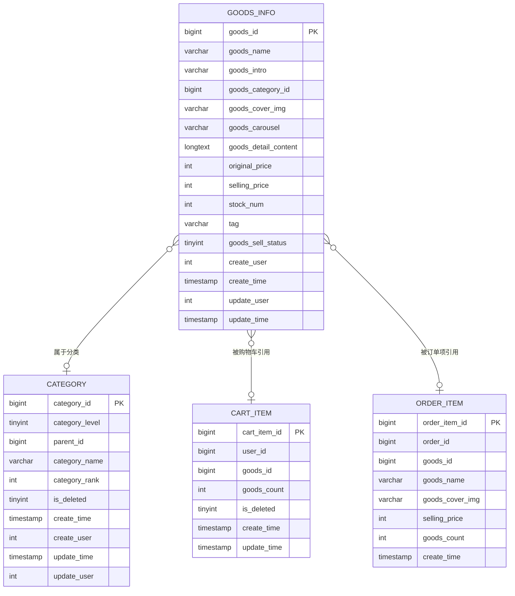

# 商品实体模型

<cite>
**本文引用的文件**
- [newbee_mall_schema.sql](file://src/main/resources/newbee_mall_schema.sql)
- [NewBeeMallGoods.java](file://src/main/java/ltd/newbee/mall/entity/NewBeeMallGoods.java)
- [NewBeeMallGoodsMapper.java](file://src/main/java/ltd/newbee/mall/dao/NewBeeMallGoodsMapper.java)
- [NewBeeMallGoodsMapper.xml](file://src/main/resources/mapper/NewBeeMallGoodsMapper.xml)
- [GoodsCategory.java](file://src/main/java/ltd/newbee/mall/entity/GoodsCategory.java)
- [NewBeeMallShoppingCartItem.java](file://src/main/java/ltd/newbee/mall/entity/NewBeeMallShoppingCartItem.java)
- [NewBeeMallOrderItem.java](file://src/main/java/ltd/newbee/mall/entity/NewBeeMallOrderItem.java)
</cite>

## 目录
1. [引言](#引言)
2. [项目结构](#项目结构)
3. [核心组件](#核心组件)
4. [架构总览](#架构总览)
5. [详细组件分析](#详细组件分析)
6. [依赖关系分析](#依赖关系分析)
7. [性能考量](#性能考量)
8. [故障排查指南](#故障排查指南)
9. [结论](#结论)
10. [附录](#附录)

## 引言
本文件围绕 newbee-mall 系统的商品实体模型展开，基于数据库表 tb_newbee_mall_goods_info 的结构设计，结合 Java 实体类 NewBeeMallGoods 与其 MyBatis 映射 NewBeeMallGoodsMapper/Xml，系统化阐述商品字段定义、数据类型、约束与索引策略，以及与商品分类、购物车、订单项等实体的关系。重点覆盖商品状态管理（上架/下架）、价格体系（原价/售价）与库存管理机制，并提供实体关系图与关键流程图示，帮助开发者与非技术读者快速理解与使用。

## 项目结构
- 数据库层：newbee_mall_schema.sql 中定义了 tb_newbee_mall_goods_info 表及其字段、约束与默认值。
- 实体层：NewBeeMallGoods.java 对应 tb_newbee_mall_goods_info 的 Java 实体类。
- 映射层：NewBeeMallGoodsMapper.java 接口与 NewBeeMallGoodsMapper.xml 映射文件，完成 ORM 操作。
- 关联实体：GoodsCategory（商品分类）、NewBeeMallShoppingCartItem（购物车）、NewBeeMallOrderItem（订单项）。

图表来源
- [newbee_mall_schema.sql](file://src/main/resources/newbee_mall_schema.sql#L1-L200)
- [NewBeeMallGoods.java](file://src/main/java/ltd/newbee/mall/entity/NewBeeMallGoods.java#L1-L202)
- [NewBeeMallGoodsMapper.java](file://src/main/java/ltd/newbee/mall/dao/NewBeeMallGoodsMapper.java#L1-L53)
- [NewBeeMallGoodsMapper.xml](file://src/main/resources/mapper/NewBeeMallGoodsMapper.xml#L1-L391)
- [GoodsCategory.java](file://src/main/java/ltd/newbee/mall/entity/GoodsCategory.java#L1-L137)
- [NewBeeMallShoppingCartItem.java](file://src/main/java/ltd/newbee/mall/entity/NewBeeMallShoppingCartItem.java#L1-L100)
- [NewBeeMallOrderItem.java](file://src/main/java/ltd/newbee/mall/entity/NewBeeMallOrderItem.java#L1-L111)

章节来源
- [newbee_mall_schema.sql](file://src/main/resources/newbee_mall_schema.sql#L1-L200)
- [NewBeeMallGoods.java](file://src/main/java/ltd/newbee/mall/entity/NewBeeMallGoods.java#L1-L202)
- [NewBeeMallGoodsMapper.java](file://src/main/java/ltd/newbee/mall/dao/NewBeeMallGoodsMapper.java#L1-L53)
- [NewBeeMallGoodsMapper.xml](file://src/main/resources/mapper/NewBeeMallGoodsMapper.xml#L1-L391)

## 核心组件
- 数据库表 tb_newbee_mall_goods_info：承载商品基本信息、价格、库存、状态与详情内容。
- Java 实体 NewBeeMallGoods：与数据库表字段一一对应，提供 getter/setter 与字符串表示。
- Mapper 接口与 XML：定义 CRUD、列表查询、分页统计、批量更新、库存扣减/恢复、上下架状态批量更新等操作。

章节来源
- [newbee_mall_schema.sql](file://src/main/resources/newbee_mall_schema.sql#L1-L200)
- [NewBeeMallGoods.java](file://src/main/java/ltd/newbee/mall/entity/NewBeeMallGoods.java#L1-L202)
- [NewBeeMallGoodsMapper.java](file://src/main/java/ltd/newbee/mall/dao/NewBeeMallGoodsMapper.java#L1-L53)
- [NewBeeMallGoodsMapper.xml](file://src/main/resources/mapper/NewBeeMallGoodsMapper.xml#L1-L391)

## 架构总览
商品实体模型在系统中的位置如下：
- 数据库层：tb_newbee_mall_goods_info 定义商品主键、名称、简介、分类、封面图、轮播图、详情、价格、库存、标签、上下架状态与时间戳。
- 映射层：MyBatis 通过 NewBeeMallGoodsMapper 接口与 XML 文件将 SQL 与实体类绑定，支持按主键、关键字、分类、状态、时间范围等条件查询与分页。
- 业务层：通过服务层调用 Mapper 完成商品增删改查、库存扣减/恢复、批量上下架等操作。
- 关联实体：商品与分类（一对多）、购物车（一对多）、订单项（一对多）。

图表来源
- [NewBeeMallGoods.java](file://src/main/java/ltd/newbee/mall/entity/NewBeeMallGoods.java#L1-L202)
- [GoodsCategory.java](file://src/main/java/ltd/newbee/mall/entity/GoodsCategory.java#L1-L137)
- [NewBeeMallShoppingCartItem.java](file://src/main/java/ltd/newbee/mall/entity/NewBeeMallShoppingCartItem.java#L1-L100)
- [NewBeeMallOrderItem.java](file://src/main/java/ltd/newbee/mall/entity/NewBeeMallOrderItem.java#L1-L111)

## 详细组件分析

### 数据库表结构与字段详解（tb_newbee_mall_goods_info）
- 主键与自增：goods_id（bigint, unsigned, 主键）
- 名称与简介：goods_name（varchar）、goods_intro（varchar）
- 分类关联：goods_category_id（bigint）
- 图片资源：goods_cover_img（varchar，主图默认值）、goods_carousel（varchar，轮播图默认值）
- 详情内容：goods_detail_content（text，BLOB 字段）
- 价格体系：original_price（int，默认1）、selling_price（int，默认1）
- 库存数量：stock_num（int，默认0）
- 标签：tag（varchar，默认空）
- 上下架状态：goods_sell_status（tinyint，默认0，0-下架，1-上架）
- 时间与用户：create_user、create_time、update_user、update_time（timestamp 默认当前时间）

索引与约束策略建议（基于现有结构）：
- 主键索引：goods_id（已定义）
- 建议复合索引：(goods_category_id, goods_sell_status, stock_num)，用于按分类筛选、状态过滤与库存排序
- 建议全文/模糊索引：goods_name、goods_intro（如需关键词检索，可考虑全文索引或 LIKE 索引优化）
- 建议时间索引：create_time（用于按时间范围筛选）

章节来源
- [newbee_mall_schema.sql](file://src/main/resources/newbee_mall_schema.sql#L1-L200)

### Java 实体类 NewBeeMallGoods 映射
- 字段与类型：与数据库表字段严格对应，如 goodsId、goodsName、goodsIntro、goodsCategoryId、goodsCoverImg、goodsCarousel、originalPrice、sellingPrice、stockNum、tag、goodsSellStatus、createUser、createTime、updateUser、updateTime、goodsDetailContent。
- 约束与默认值：实体类未直接体现数据库默认值，但可通过构造函数或服务层赋值保证一致性。
- JSON 时间格式：部分字段使用@JsonFormat注解，便于前端序列化输出。

章节来源
- [NewBeeMallGoods.java](file://src/main/java/ltd/newbee/mall/entity/NewBeeMallGoods.java#L1-L202)

### MyBatis 映射与 ORM 操作
- ResultMap 映射：BaseResultMap 映射基础字段；ResultMapWithBLOBs 映射 goods_detail_content（LONGVARCHAR）。
- 常用操作：
  - 按主键查询与更新：selectByPrimaryKey、updateByPrimaryKey、updateByPrimaryKeyWithBLOBs
  - 条件查询与分页：findNewBeeMallGoodsList、findNewBeeMallGoodsListBySearch、getTotalNewBeeMallGoods、getTotalNewBeeMallGoodsBySearch
  - 批量插入：batchInsert
  - 库存管理：updateStockNum（扣减）、recoverStockNum（恢复）
  - 批量上下架：batchUpdateSellStatus
  - 其他：selectByPrimaryKeys、selectByCategoryIdAndName、deleteByPrimaryKey、insert、insertSelective、updateByPrimaryKeySelective

图表来源
- [NewBeeMallGoodsMapper.java](file://src/main/java/ltd/newbee/mall/dao/NewBeeMallGoodsMapper.java#L1-L53)
- [NewBeeMallGoodsMapper.xml](file://src/main/resources/mapper/NewBeeMallGoodsMapper.xml#L1-L391)

章节来源
- [NewBeeMallGoodsMapper.java](file://src/main/java/ltd/newbee/mall/dao/NewBeeMallGoodsMapper.java#L1-L53)
- [NewBeeMallGoodsMapper.xml](file://src/main/resources/mapper/NewBeeMallGoodsMapper.xml#L1-L391)

### 商品状态管理（上架/下架）
- 字段：goods_sell_status（tinyint，默认0，0-下架，1-上架）
- 批量更新：batchUpdateSellStatus 支持按 goods_id 列表批量更新状态并写入更新时间
- 查询过滤：findNewBeeMallGoodsList、findNewBeeMallGoodsListBySearch 支持按 goods_sell_status 过滤

图表来源
- [NewBeeMallGoodsMapper.xml](file://src/main/resources/mapper/NewBeeMallGoodsMapper.xml#L1-L391)

章节来源
- [NewBeeMallGoodsMapper.xml](file://src/main/resources/mapper/NewBeeMallGoodsMapper.xml#L1-L391)

### 价格体系（原价/售价）
- 字段：original_price（int，默认1）、selling_price（int，默认1）
- 使用建议：
  - 原价用于展示历史折扣或对比，售价为当前销售价格
  - 建议在业务层统一以“分”为单位存储整数，避免浮点误差
  - 售价不应大于原价（可在服务层校验）

章节来源
- [newbee_mall_schema.sql](file://src/main/resources/newbee_mall_schema.sql#L1-L200)

### 库存管理机制
- 字段：stock_num（int，默认0）
- 扣减库存：updateStockNum（逐条执行，带条件校验：库存充足且商品处于上架状态）
- 恢复库存：recoverStockNum（下单失败或取消订单时恢复）
- 批量操作：支持传入 List<StockNumDTO>，逐条更新

图表来源
- [NewBeeMallGoodsMapper.xml](file://src/main/resources/mapper/NewBeeMallGoodsMapper.xml#L1-L391)

章节来源
- [NewBeeMallGoodsMapper.xml](file://src/main/resources/mapper/NewBeeMallGoodsMapper.xml#L1-L391)

### 实体关系图（商品与分类、购物车、订单项）
- 商品与分类：一对多（一个分类包含多个商品）
- 商品与购物车：一对多（一个商品可被多个用户加入购物车）
- 商品与订单项：一对多（一个商品可出现在多个订单项中）

图表来源
- [newbee_mall_schema.sql](file://src/main/resources/newbee_mall_schema.sql#L1-L200)
- [GoodsCategory.java](file://src/main/java/ltd/newbee/mall/entity/GoodsCategory.java#L1-L137)
- [NewBeeMallShoppingCartItem.java](file://src/main/java/ltd/newbee/mall/entity/NewBeeMallShoppingCartItem.java#L1-L100)
- [NewBeeMallOrderItem.java](file://src/main/java/ltd/newbee/mall/entity/NewBeeMallOrderItem.java#L1-L111)

章节来源
- [GoodsCategory.java](file://src/main/java/ltd/newbee/mall/entity/GoodsCategory.java#L1-L137)
- [NewBeeMallShoppingCartItem.java](file://src/main/java/ltd/newbee/mall/entity/NewBeeMallShoppingCartItem.java#L1-L100)
- [NewBeeMallOrderItem.java](file://src/main/java/ltd/newbee/mall/entity/NewBeeMallOrderItem.java#L1-L111)

## 依赖关系分析
- NewBeeMallGoodsMapper 依赖 MyBatis 框架与数据库连接池，通过命名空间与 XML 中的 SQL 映射实现 CRUD。
- NewBeeMallGoods 作为实体类，被 Mapper XML 中的 resultType/resultMap 映射使用。
- 业务层通过调用 Mapper 完成库存扣减、上下架批量更新等操作，间接依赖数据库事务与并发控制。

图表来源
- [NewBeeMallGoodsMapper.java](file://src/main/java/ltd/newbee/mall/dao/NewBeeMallGoodsMapper.java#L1-L53)
- [NewBeeMallGoodsMapper.xml](file://src/main/resources/mapper/NewBeeMallGoodsMapper.xml#L1-L391)
- [NewBeeMallGoods.java](file://src/main/java/ltd/newbee/mall/entity/NewBeeMallGoods.java#L1-L202)

章节来源
- [NewBeeMallGoodsMapper.java](file://src/main/java/ltd/newbee/mall/dao/NewBeeMallGoodsMapper.java#L1-L53)
- [NewBeeMallGoodsMapper.xml](file://src/main/resources/mapper/NewBeeMallGoodsMapper.xml#L1-L391)
- [NewBeeMallGoods.java](file://src/main/java/ltd/newbee/mall/entity/NewBeeMallGoods.java#L1-L202)

## 性能考量
- 查询性能
  - 建议在 goods_category_id、goods_sell_status、stock_num 上建立复合索引，提升按分类、状态与库存排序的查询效率。
  - 对 goods_name、goods_intro 的模糊查询建议使用 LIKE 或全文索引，避免全表扫描。
- 写入性能
  - 批量插入使用 foreach 批量提交，减少网络往返。
  - 库存扣减与恢复采用逐条更新，建议在服务层进行幂等校验与事务控制，避免重复扣减。
- 缓存策略
  - 商品详情（goods_detail_content）为大文本，建议在缓存层进行热点命中与过期策略管理。
- 分页与排序
  - 分页查询支持按 create_time、selling_price、stock_num 排序，建议在高并发场景下对排序字段建立索引。

[本节为通用指导，无需特定文件引用]

## 故障排查指南
- 库存扣减失败
  - 现象：扣减返回 0 或异常
  - 排查要点：确认商品是否上架（goods_sell_status=1）、库存是否充足（stock_num >= goodsCount）、SQL 条件是否匹配
  - 参考路径：[库存扣减 SQL](file://src/main/resources/mapper/NewBeeMallGoodsMapper.xml#L1-L391)
- 批量上下架无效
  - 现象：批量更新后状态未变化
  - 排查要点：确认 goods_id 列表是否正确、sellStatus 参数是否传入
  - 参考路径：[批量上下架 SQL](file://src/main/resources/mapper/NewBeeMallGoodsMapper.xml#L1-L391)
- 查询结果为空
  - 现象：按分类/状态/关键字查询为空
  - 排查要点：确认查询参数是否为空、索引是否生效、LIKE 语句是否正确
  - 参考路径：[列表查询与分页 SQL](file://src/main/resources/mapper/NewBeeMallGoodsMapper.xml#L1-L391)

章节来源
- [NewBeeMallGoodsMapper.xml](file://src/main/resources/mapper/NewBeeMallGoodsMapper.xml#L1-L391)

## 结论
本文基于数据库表 tb_newbee_mall_goods_info 与 Java 实体 NewBeeMallGoods，系统梳理了商品实体模型的字段定义、数据类型、约束与索引策略，并结合 MyBatis 映射文件展示了 ORM 操作与关键业务流程（库存扣减、恢复、批量上下架）。通过商品与分类、购物车、订单项的实体关系图，明确了商品在系统中的角色与依赖。建议在生产环境中完善索引、缓存与事务控制，确保查询与写入性能与一致性。

[本节为总结性内容，无需特定文件引用]

## 附录
- 关键字段一览
  - 商品标识：goods_id（主键）
  - 基本信息：goods_name、goods_intro、goods_category_id
  - 图片资源：goods_cover_img、goods_carousel
  - 详情内容：goods_detail_content（BLOB）
  - 价格体系：original_price、selling_price
  - 库存数量：stock_num
  - 标签与状态：tag、goods_sell_status
  - 时间与用户：create_user、create_time、update_user、update_time

章节来源
- [newbee_mall_schema.sql](file://src/main/resources/newbee_mall_schema.sql#L1-L200)
- [NewBeeMallGoods.java](file://src/main/java/ltd/newbee/mall/entity/NewBeeMallGoods.java#L1-L202)