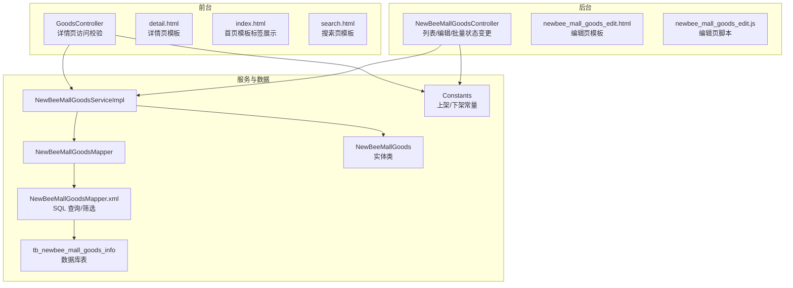
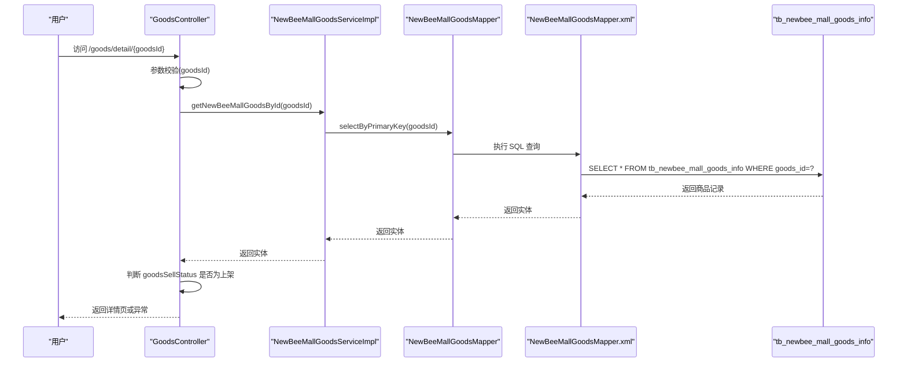
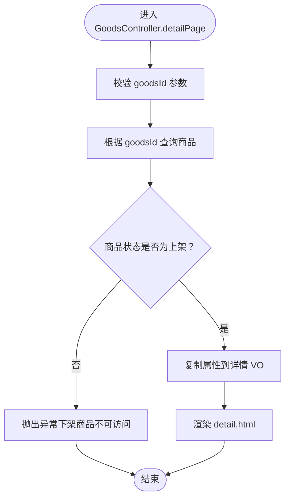
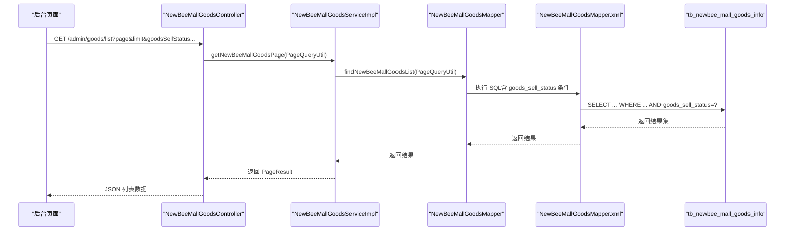
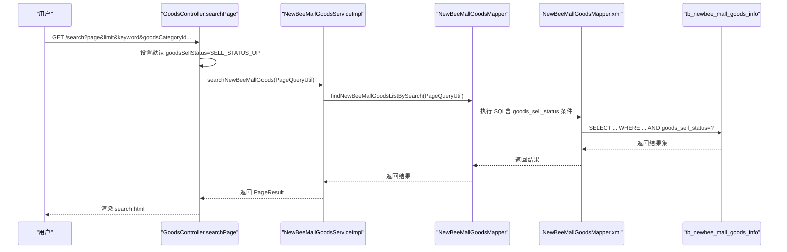
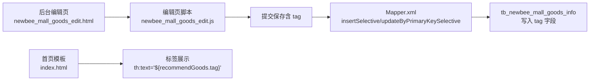
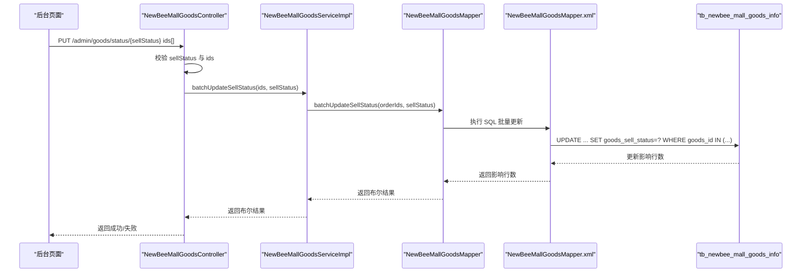
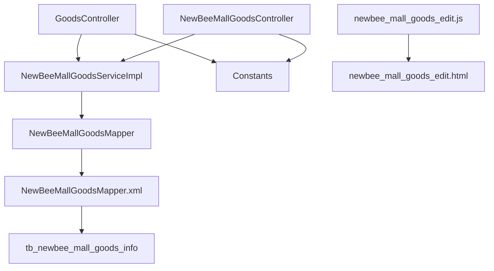

# 状态与标签管理

<cite>
**本文引用的文件**
- [NewBeeMallGoods.java](file://src/main/java/ltd/newbee/mall/entity/NewBeeMallGoods.java)
- [GoodsController.java](file://src/main/java/ltd/newbee/mall/controller/mall/GoodsController.java)
- [Constants.java](file://src/main/java/ltd/newbee/mall/common/Constants.java)
- [NewBeeMallGoodsServiceImpl.java](file://src/main/java/ltd/newbee/mall/service/impl/NewBeeMallGoodsServiceImpl.java)
- [NewBeeMallGoodsMapper.java](file://src/main/java/ltd/newbee/mall/dao/NewBeeMallGoodsMapper.java)
- [NewBeeMallGoodsMapper.xml](file://src/main/resources/mapper/NewBeeMallGoodsMapper.xml)
- [NewBeeMallGoodsController.java](file://src/main/java/ltd/newbee/mall/controller/admin/NewBeeMallGoodsController.java)
- [newbee_mall_schema.sql](file://src/main/resources/newbee_mall_schema.sql)
- [index.html](file://src/main/resources/templates/mall/index.html)
- [search.html](file://src/main/resources/templates/mall/search.html)
- [detail.html](file://src/main/resources/templates/mall/detail.html)
- [newbee_mall_goods_edit.html](file://src/main/resources/templates/admin/newbee_mall_goods_edit.html)
- [newbee_mall_goods_edit.js](file://src/main/resources/static/admin/dist/js/newbee_mall_goods_edit.js)
</cite>

## 目录
1. [引言](#引言)
2. [项目结构](#项目结构)
3. [核心组件](#核心组件)
4. [架构总览](#架构总览)
5. [详细组件分析](#详细组件分析)
6. [依赖关系分析](#依赖关系分析)
7. [性能考量](#性能考量)
8. [故障排查指南](#故障排查指南)
9. [结论](#结论)
10. [附录](#附录)

## 引言
本文件聚焦于 newbee-mall 系统的商品状态与标签管理，围绕以下目标展开：
- 明确数据库中商品状态字段 goods_sell_status 的定义与含义
- 解释 Java 实体类中 goodsSellStatus 字段的映射与类型
- 详述商品状态的业务规则（上架/下架）
- 描述在商品详情页访问时的状态校验流程
- 说明标签字段 tag 的用途与前端展示方式
- 给出后台商品列表筛选与前台详情页访问控制的实践示例

## 项目结构
与“状态与标签管理”直接相关的模块与文件分布如下：
- 数据模型与持久化：实体类 NewBeeMallGoods、DAO 接口 NewBeeMallGoodsMapper、XML 映射 NewBeeMallGoodsMapper.xml
- 业务服务：NewBeeMallGoodsServiceImpl
- 控制器：
  - 前台：GoodsController（详情页访问校验）
  - 后台：NewBeeMallGoodsController（列表、编辑、批量状态变更）
- 常量：Constants（定义上架/下架常量）
- 数据库：newbee_mall_schema.sql（定义 tb_newbee_mall_goods_info 表结构）
- 前端模板与脚本：index.html、search.html、detail.html、newbee_mall_goods_edit.html、newbee_mall_goods_edit.js

图表来源
- [GoodsController.java](file://src/main/java/ltd/newbee/mall/controller/mall/GoodsController.java#L74-L91)
- [NewBeeMallGoodsController.java](file://src/main/java/ltd/newbee/mall/controller/admin/NewBeeMallGoodsController.java#L132-L228)
- [NewBeeMallGoodsServiceImpl.java](file://src/main/java/ltd/newbee/mall/service/impl/NewBeeMallGoodsServiceImpl.java#L40-L137)
- [NewBeeMallGoodsMapper.java](file://src/main/java/ltd/newbee/mall/dao/NewBeeMallGoodsMapper.java#L18-L53)
- [NewBeeMallGoodsMapper.xml](file://src/main/resources/mapper/NewBeeMallGoodsMapper.xml#L80-L151)
- [NewBeeMallGoods.java](file://src/main/java/ltd/newbee/mall/entity/NewBeeMallGoods.java#L34-L36)
- [Constants.java](file://src/main/java/ltd/newbee/mall/common/Constants.java#L44-L46)
- [newbee_mall_schema.sql](file://src/main/resources/newbee_mall_schema.sql#L1-L503)

章节来源
- [GoodsController.java](file://src/main/java/ltd/newbee/mall/controller/mall/GoodsController.java#L74-L91)
- [NewBeeMallGoodsController.java](file://src/main/java/ltd/newbee/mall/controller/admin/NewBeeMallGoodsController.java#L132-L228)
- [NewBeeMallGoodsServiceImpl.java](file://src/main/java/ltd/newbee/mall/service/impl/NewBeeMallGoodsServiceImpl.java#L40-L137)
- [NewBeeMallGoodsMapper.java](file://src/main/java/ltd/newbee/mall/dao/NewBeeMallGoodsMapper.java#L18-L53)
- [NewBeeMallGoodsMapper.xml](file://src/main/resources/mapper/NewBeeMallGoodsMapper.xml#L80-L151)
- [NewBeeMallGoods.java](file://src/main/java/ltd/newbee/mall/entity/NewBeeMallGoods.java#L34-L36)
- [Constants.java](file://src/main/java/ltd/newbee/mall/common/Constants.java#L44-L46)
- [newbee_mall_schema.sql](file://src/main/resources/newbee_mall_schema.sql#L1-L503)

## 核心组件
- 数据库表结构
  - 表名：tb_newbee_mall_goods_info
  - 字段：goods_sell_status（TINYINT NOT NULL DEFAULT 0）、tag（VARCHAR(20) NOT NULL DEFAULT ''）
- Java 实体类字段
  - goodsSellStatus（Byte 类型）
  - tag（String 类型）
- 常量定义
  - SELL_STATUS_UP = 0（上架）
  - SELL_STATUS_DOWN = 1（下架）

章节来源
- [newbee_mall_schema.sql](file://src/main/resources/newbee_mall_schema.sql#L1-L503)
- [NewBeeMallGoods.java](file://src/main/java/ltd/newbee/mall/entity/NewBeeMallGoods.java#L34-L36)
- [Constants.java](file://src/main/java/ltd/newbee/mall/common/Constants.java#L44-L46)

## 架构总览
商品状态与标签管理贯穿“前台访问校验—后台编辑/筛选—数据库持久化”的完整链路。关键流程：
- 前台详情页访问：控制器在加载详情前校验商品状态，仅允许上架商品进入详情页
- 后台列表筛选：支持按 goods_sell_status 进行筛选；支持按 tag 进行模糊匹配（搜索页）
- 数据持久化：新增/更新商品时，将 tag 与 goods_sell_status 写入数据库

图表来源
- [GoodsController.java](file://src/main/java/ltd/newbee/mall/controller/mall/GoodsController.java#L74-L91)
- [NewBeeMallGoodsServiceImpl.java](file://src/main/java/ltd/newbee/mall/service/impl/NewBeeMallGoodsServiceImpl.java#L100-L107)
- [NewBeeMallGoodsMapper.java](file://src/main/java/ltd/newbee/mall/dao/NewBeeMallGoodsMapper.java#L25-L30)
- [NewBeeMallGoodsMapper.xml](file://src/main/resources/mapper/NewBeeMallGoodsMapper.xml#L102-L136)
- [newbee_mall_schema.sql](file://src/main/resources/newbee_mall_schema.sql#L1-L503)

## 详细组件分析

### 数据库与实体映射
- 数据库字段
  - goods_sell_status：TINYINT NOT NULL DEFAULT 0，0 表示下架，1 表示上架
  - tag：VARCHAR(20) NOT NULL DEFAULT ''，用于商品小标签
- Java 实体映射
  - goodsSellStatus：Byte 类型，对应数据库 TINYINT
  - tag：String 类型，对应数据库 VARCHAR(20)
- 常量约定
  - Constants.SELL_STATUS_UP = 0
  - Constants.SELL_STATUS_DOWN = 1

章节来源
- [newbee_mall_schema.sql](file://src/main/resources/newbee_mall_schema.sql#L1-L503)
- [NewBeeMallGoods.java](file://src/main/java/ltd/newbee/mall/entity/NewBeeMallGoods.java#L34-L36)
- [Constants.java](file://src/main/java/ltd/newbee/mall/common/Constants.java#L44-L46)

### 前台详情页访问控制
- 访问入口：/goods/detail/{goodsId}
- 校验逻辑：
  - 若 goodsId 非法，抛出异常
  - 获取商品后，若 goodsSellStatus != SELL_STATUS_UP（即为下架），抛出异常
  - 成功则装配 VO 并渲染 detail.html
- 业务意义：确保只有上架商品才能被访问，避免用户看到已下架商品的详情

图表来源
- [GoodsController.java](file://src/main/java/ltd/newbee/mall/controller/mall/GoodsController.java#L74-L91)

章节来源
- [GoodsController.java](file://src/main/java/ltd/newbee/mall/controller/mall/GoodsController.java#L74-L91)

### 后台商品列表筛选（按状态）
- 列表接口：/admin/goods/list
- 筛选条件：
  - goods_sell_status（上架/下架）
  - goodsName（名称模糊）
  - startTime/endTime（时间范围）
- SQL 映射：
  - Mapper.xml 中包含对 goods_sell_status 的 where 条件
  - 支持分页与排序

图表来源
- [NewBeeMallGoodsController.java](file://src/main/java/ltd/newbee/mall/controller/admin/NewBeeMallGoodsController.java#L132-L143)
- [NewBeeMallGoodsServiceImpl.java](file://src/main/java/ltd/newbee/mall/service/impl/NewBeeMallGoodsServiceImpl.java#L40-L46)
- [NewBeeMallGoodsMapper.java](file://src/main/java/ltd/newbee/mall/dao/NewBeeMallGoodsMapper.java#L35-L41)
- [NewBeeMallGoodsMapper.xml](file://src/main/resources/mapper/NewBeeMallGoodsMapper.xml#L80-L100)

章节来源
- [NewBeeMallGoodsController.java](file://src/main/java/ltd/newbee/mall/controller/admin/NewBeeMallGoodsController.java#L132-L143)
- [NewBeeMallGoodsServiceImpl.java](file://src/main/java/ltd/newbee/mall/service/impl/NewBeeMallGoodsServiceImpl.java#L40-L46)
- [NewBeeMallGoodsMapper.xml](file://src/main/resources/mapper/NewBeeMallGoodsMapper.xml#L80-L100)

### 前台搜索页筛选（按状态）
- 搜索入口：/search 或 /search.html
- 筛选条件：
  - goods_sell_status = SELL_STATUS_UP（默认只展示上架商品）
  - keyword（名称/简介模糊）
  - goodsCategoryId（分类）
- SQL 映射：
  - Mapper.xml 中对 goods_sell_status 的 where 条件
  - 支持 orderBy（new/price/default）

图表来源
- [GoodsController.java](file://src/main/java/ltd/newbee/mall/controller/mall/GoodsController.java#L40-L72)
- [NewBeeMallGoodsServiceImpl.java](file://src/main/java/ltd/newbee/mall/service/impl/NewBeeMallGoodsServiceImpl.java#L115-L137)
- [NewBeeMallGoodsMapper.xml](file://src/main/resources/mapper/NewBeeMallGoodsMapper.xml#L102-L136)

章节来源
- [GoodsController.java](file://src/main/java/ltd/newbee/mall/controller/mall/GoodsController.java#L40-L72)
- [NewBeeMallGoodsServiceImpl.java](file://src/main/java/ltd/newbee/mall/service/impl/NewBeeMallGoodsServiceImpl.java#L115-L137)
- [NewBeeMallGoodsMapper.xml](file://src/main/resources/mapper/NewBeeMallGoodsMapper.xml#L102-L136)

### 标签字段 tag 的用途与前端展示
- 用途
  - 商品小标签，用于首页“为你推荐”等区域的装饰性文案
- 前端展示
  - 首页模板 index.html 中，推荐位商品的标签通过 th:text="${recommendGoods.tag}" 输出
  - 搜索页与详情页不直接展示 tag，但 tag 作为商品属性参与搜索与筛选
- 编辑与保存
  - 后台编辑页 newbee_mall_goods_edit.html 提供 tag 输入框
  - newbee_mall_goods_edit.js 对 tag 进行前端校验（非空、长度限制）

图表来源
- [newbee_mall_goods_edit.html](file://src/main/resources/templates/admin/newbee_mall_goods_edit.html#L98-L114)
- [newbee_mall_goods_edit.js](file://src/main/resources/static/admin/dist/js/newbee_mall_goods_edit.js#L109-L151)
- [NewBeeMallGoodsMapper.xml](file://src/main/resources/mapper/NewBeeMallGoodsMapper.xml#L202-L253)
- [index.html](file://src/main/resources/templates/mall/index.html#L163-L186)

章节来源
- [newbee_mall_goods_edit.html](file://src/main/resources/templates/admin/newbee_mall_goods_edit.html#L98-L114)
- [newbee_mall_goods_edit.js](file://src/main/resources/static/admin/dist/js/newbee_mall_goods_edit.js#L109-L151)
- [NewBeeMallGoodsMapper.xml](file://src/main/resources/mapper/NewBeeMallGoodsMapper.xml#L202-L253)
- [index.html](file://src/main/resources/templates/mall/index.html#L163-L186)

### 后台批量状态变更
- 接口：PUT /admin/goods/status/{sellStatus}
- 参数：ids[]（商品 ID 数组）、sellStatus（0 上架 / 1 下架）
- 业务校验：sellStatus 必须为 SELL_STATUS_UP 或 SELL_STATUS_DOWN
- 执行：service 层调用 Mapper 批量更新 goods_sell_status

图表来源
- [NewBeeMallGoodsController.java](file://src/main/java/ltd/newbee/mall/controller/admin/NewBeeMallGoodsController.java#L210-L226)
- [NewBeeMallGoodsServiceImpl.java](file://src/main/java/ltd/newbee/mall/service/impl/NewBeeMallGoodsServiceImpl.java#L110-L112)
- [NewBeeMallGoodsMapper.java](file://src/main/java/ltd/newbee/mall/dao/NewBeeMallGoodsMapper.java#L50-L51)
- [NewBeeMallGoodsMapper.xml](file://src/main/resources/mapper/NewBeeMallGoodsMapper.xml#L1-L200)

章节来源
- [NewBeeMallGoodsController.java](file://src/main/java/ltd/newbee/mall/controller/admin/NewBeeMallGoodsController.java#L210-L226)
- [NewBeeMallGoodsServiceImpl.java](file://src/main/java/ltd/newbee/mall/service/impl/NewBeeMallGoodsServiceImpl.java#L110-L112)
- [NewBeeMallGoodsMapper.java](file://src/main/java/ltd/newbee/mall/dao/NewBeeMallGoodsMapper.java#L50-L51)
- [NewBeeMallGoodsMapper.xml](file://src/main/resources/mapper/NewBeeMallGoodsMapper.xml#L1-L200)

## 依赖关系分析
- 控制器依赖服务层，服务层依赖 DAO，DAO 依赖 XML 映射，最终访问数据库
- 前台访问校验依赖常量定义的上架/下架枚举值
- 后台编辑页依赖前端脚本进行输入校验与提交

图表来源
- [GoodsController.java](file://src/main/java/ltd/newbee/mall/controller/mall/GoodsController.java#L74-L91)
- [NewBeeMallGoodsController.java](file://src/main/java/ltd/newbee/mall/controller/admin/NewBeeMallGoodsController.java#L132-L226)
- [NewBeeMallGoodsServiceImpl.java](file://src/main/java/ltd/newbee/mall/service/impl/NewBeeMallGoodsServiceImpl.java#L40-L137)
- [NewBeeMallGoodsMapper.java](file://src/main/java/ltd/newbee/mall/dao/NewBeeMallGoodsMapper.java#L18-L53)
- [NewBeeMallGoodsMapper.xml](file://src/main/resources/mapper/NewBeeMallGoodsMapper.xml#L80-L151)
- [Constants.java](file://src/main/java/ltd/newbee/mall/common/Constants.java#L44-L46)
- [newbee_mall_goods_edit.html](file://src/main/resources/templates/admin/newbee_mall_goods_edit.html#L98-L114)
- [newbee_mall_goods_edit.js](file://src/main/resources/static/admin/dist/js/newbee_mall_goods_edit.js#L109-L151)

章节来源
- [GoodsController.java](file://src/main/java/ltd/newbee/mall/controller/mall/GoodsController.java#L74-L91)
- [NewBeeMallGoodsController.java](file://src/main/java/ltd/newbee/mall/controller/admin/NewBeeMallGoodsController.java#L132-L226)
- [NewBeeMallGoodsServiceImpl.java](file://src/main/java/ltd/newbee/mall/service/impl/NewBeeMallGoodsServiceImpl.java#L40-L137)
- [NewBeeMallGoodsMapper.java](file://src/main/java/ltd/newbee/mall/dao/NewBeeMallGoodsMapper.java#L18-L53)
- [NewBeeMallGoodsMapper.xml](file://src/main/resources/mapper/NewBeeMallGoodsMapper.xml#L80-L151)
- [Constants.java](file://src/main/java/ltd/newbee/mall/common/Constants.java#L44-L46)
- [newbee_mall_goods_edit.html](file://src/main/resources/templates/admin/newbee_mall_goods_edit.html#L98-L114)
- [newbee_mall_goods_edit.js](file://src/main/resources/static/admin/dist/js/newbee_mall_goods_edit.js#L109-L151)

## 性能考量
- 列表与搜索接口均支持分页与条件过滤，建议合理设置分页大小与索引
- goods_sell_status 与 tag 字段在搜索与筛选中频繁使用，建议在数据库层面建立合适索引以提升查询效率
- 前台详情页访问校验仅涉及一次主键查询，成本较低；批量状态变更使用批量更新语句，减少往返次数

## 故障排查指南
- 详情页访问异常
  - 现象：访问 /goods/detail/{goodsId} 返回异常
  - 排查：确认 goodsId 是否合法；确认 goodsSellStatus 是否为上架（0）
  - 参考路径：[GoodsController.detailPage](file://src/main/java/ltd/newbee/mall/controller/mall/GoodsController.java#L74-L91)
- 后台列表筛选无效
  - 现象：传入 goods_sell_status 未生效
  - 排查：确认请求参数是否正确传递；确认 Mapper.xml 中 goods_sell_status 条件是否启用
  - 参考路径：[NewBeeMallGoodsMapper.xml](file://src/main/resources/mapper/NewBeeMallGoodsMapper.xml#L80-L100)
- 标签未显示
  - 现象：首页推荐位未显示标签
  - 排查：确认商品 tag 是否填写；确认模板中 th:text 是否正确绑定
  - 参考路径：[index.html](file://src/main/resources/templates/mall/index.html#L163-L186)
- 批量状态变更失败
  - 现象：PUT /admin/goods/status/{sellStatus} 返回失败
  - 排查：确认 sellStatus 是否为 0 或 1；确认 ids 数组是否为空
  - 参考路径：[NewBeeMallGoodsController](file://src/main/java/ltd/newbee/mall/controller/admin/NewBeeMallGoodsController.java#L210-L226)

章节来源
- [GoodsController.java](file://src/main/java/ltd/newbee/mall/controller/mall/GoodsController.java#L74-L91)
- [NewBeeMallGoodsMapper.xml](file://src/main/resources/mapper/NewBeeMallGoodsMapper.xml#L80-L100)
- [index.html](file://src/main/resources/templates/mall/index.html#L163-L186)
- [NewBeeMallGoodsController.java](file://src/main/java/ltd/newbee/mall/controller/admin/NewBeeMallGoodsController.java#L210-L226)

## 结论
- 商品状态字段 goods_sell_status 在数据库中以 TINYINT 存储，0 表示下架，1 表示上架；Java 实体映射为 Byte
- 前台详情页访问严格校验商品状态，仅允许上架商品进入详情页
- 后台支持按 goods_sell_status 进行商品列表筛选，并提供批量状态变更能力
- 标签字段 tag 用于前端装饰展示，编辑页提供输入与校验，模板中通过 th:text 输出
- 建议在数据库层面为常用筛选字段建立索引，以提升查询性能

## 附录
- 数据库表定义参考：[newbee_mall_schema.sql](file://src/main/resources/newbee_mall_schema.sql#L1-L503)
- 前台详情页模板：[detail.html](file://src/main/resources/templates/mall/detail.html#L58-L65)
- 前台搜索页模板：[search.html](file://src/main/resources/templates/mall/search.html#L58-L80)
- 后台编辑页模板与脚本：
  - [newbee_mall_goods_edit.html](file://src/main/resources/templates/admin/newbee_mall_goods_edit.html#L98-L114)
  - [newbee_mall_goods_edit.js](file://src/main/resources/static/admin/dist/js/newbee_mall_goods_edit.js#L109-L151)