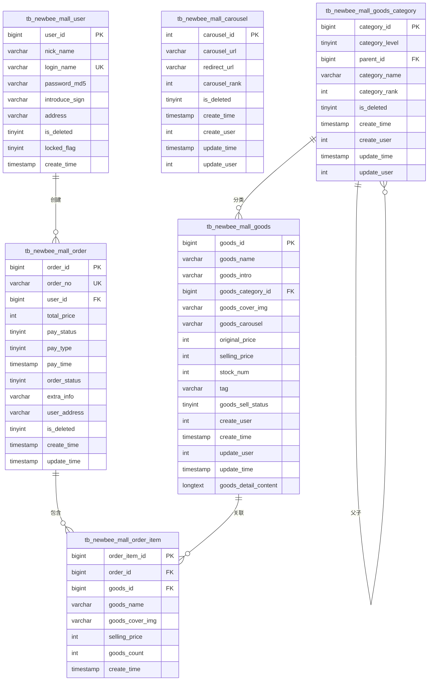

# 数据模型与数据库设计

<cite>
**本文档引用的文件**  
- [newbee_mall_schema.sql](file://src/main/resources/newbee_mall_schema.sql)
- [MallUser.java](file://src/main/java/ltd/newbee/mall/entity/MallUser.java)
- [NewBeeMallGoods.java](file://src/main/java/ltd/newbee/mall/entity/NewBeeMallGoods.java)
- [NewBeeMallOrder.java](file://src/main/java/ltd/newbee/mall/entity/NewBeeMallOrder.java)
- [NewBeeMallOrderItem.java](file://src/main/java/ltd/newbee/mall/entity/NewBeeMallOrderItem.java)
- [Carousel.java](file://src/main/java/ltd/newbee/mall/entity/Carousel.java)
- [GoodsCategory.java](file://src/main/java/ltd/newbee/mall/entity/GoodsCategory.java)
- [NewBeeMallOrderStatusEnum.java](file://src/main/java/ltd/newbee/mall/common/NewBeeMallOrderStatusEnum.java)
- [NewBeeMallGoodsMapper.xml](file://src/main/resources/mapper/NewBeeMallGoodsMapper.xml)
- [NewBeeMallOrderMapper.xml](file://src/main/resources/mapper/NewBeeMallOrderMapper.xml)
- [NewBeeMallOrderItemMapper.xml](file://src/main/resources/mapper/NewBeeMallOrderItemMapper.xml)
- [CarouselMapper.xml](file://src/main/resources/mapper/CarouselMapper.xml)
- [GoodsCategoryMapper.xml](file://src/main/resources/mapper/GoodsCategoryMapper.xml)
</cite>

## 目录
1. [引言](#引言)
2. [核心实体表结构](#核心实体表结构)
   - [用户表 (tb_newbee_mall_user)](#用户表-tb_newbee_mall_user)
   - [商品表 (tb_newbee_mall_goods)](#商品表-tb_newbee_mall_goods)
   - [订单表 (tb_newbee_mall_order)](#订单表-tb_newbee_mall_order)
   - [订单项表 (tb_newbee_mall_order_item)](#订单项表-tb_newbee_mall_order_item)
   - [轮播图表 (tb_newbee_mall_carousel)](#轮播图表-tb_newbee_mall_carousel)
   - [商品分类表 (tb_newbee_mall_goods_category)](#商品分类表-tb_newbee_mall_goods_category)
3. [实体关系图 (ERD)](#实体关系图-erd)
4. [Java实体类与数据库映射](#java实体类与数据库映射)
5. [MyBatis ORM实现机制](#mybatis-orm实现机制)
6. [业务状态枚举类应用](#业务状态枚举类应用)
7. [数据一致性保障机制](#数据一致性保障机制)
8. [结论](#结论)

## 引言
本文档详细描述了newbee-mall系统的数据模型设计，基于`newbee_mall_schema.sql`文件分析核心数据库表结构。文档将逐一解释核心实体表的字段含义、主外键关系、索引策略和约束条件，展示Java实体类与数据库表的映射关系，并说明MyBatis如何通过Mapper接口和XML文件实现ORM操作。同时，文档将绘制实体关系图以可视化表间关联，解释枚举类在业务状态管理中的应用，并说明数据一致性保障机制。

## 核心实体表结构

### 用户表 (tb_newbee_mall_user)
用户表存储系统注册用户的基本信息，是系统的核心基础表之一。

**字段说明**：
- `user_id`：用户ID，主键，自增，唯一标识用户
- `nick_name`：用户昵称，用于前端展示
- `login_name`：登录名，用户登录系统的唯一凭证
- `password_md5`：密码MD5值，存储加密后的密码
- `introduce_sign`：个性签名，用户自定义的简介
- `address`：默认收货地址
- `is_deleted`：逻辑删除标志，0表示未删除，1表示已删除
- `locked_flag`：账户锁定标志，0表示正常，1表示锁定
- `create_time`：账户创建时间，自动记录

**主外键关系**：
- 主键：`user_id`
- 无外键引用

**索引策略**：
- 主键索引：`user_id`
- 唯一索引：`login_name`，确保登录名唯一性

**约束条件**：
- `login_name`字段必须唯一
- `password_md5`不能为空
- `create_time`为非空字段，自动填充创建时间

**Section sources**
- [newbee_mall_schema.sql](file://src/main/resources/newbee_mall_schema.sql)
- [MallUser.java](file://src/main/java/ltd/newbee/mall/entity/MallUser.java)

### 商品表 (tb_newbee_mall_goods)
商品表存储商城所有商品的详细信息，是商品管理的核心表。

**字段说明**：
- `goods_id`：商品ID，主键，唯一标识商品
- `goods_name`：商品名称，用于展示
- `goods_intro`：商品简介，简要描述商品特点
- `goods_category_id`：商品分类ID，外键关联商品分类表
- `goods_cover_img`：商品封面图，用于列表展示
- `goods_carousel`：商品轮播图，存储多张图片的URL
- `original_price`：原价，商品标价
- `selling_price`：销售价，实际销售价格
- `stock_num`：库存数量，实时库存
- `tag`：商品标签，如"新品"、"热销"等
- `goods_sell_status`：商品销售状态，0表示上架，1表示下架
- `create_user`：创建人ID，记录创建商品的管理员
- `create_time`：创建时间
- `update_user`：更新人ID，记录最后修改商品的管理员
- `update_time`：更新时间
- `goods_detail_content`：商品详情内容，存储HTML格式的详细描述

**主外键关系**：
- 主键：`goods_id`
- 外键：`goods_category_id` → `tb_newbee_mall_goods_category.category_id`

**索引策略**：
- 主键索引：`goods_id`
- 普通索引：`goods_category_id`，提高按分类查询效率
- 普通索引：`goods_sell_status`，提高按销售状态查询效率
- 组合索引：`(goods_name, goods_category_id)`，支持按名称和分类联合查询

**约束条件**：
- `original_price`和`selling_price`必须大于0
- `stock_num`不能为负数
- `goods_sell_status`只能为0或1

**Section sources**
- [newbee_mall_schema.sql](file://src/main/resources/newbee_mall_schema.sql)
- [NewBeeMallGoods.java](file://src/main/java/ltd/newbee/mall/entity/NewBeeMallGoods.java)

### 订单表 (tb_newbee_mall_order)
订单表存储用户下单的订单信息，是交易系统的核心表。

**字段说明**：
- `order_id`：订单ID，主键，唯一标识订单
- `order_no`：订单号，业务唯一标识，通常为时间戳+随机数
- `user_id`：用户ID，外键关联用户表
- `total_price`：订单总价，所有商品总价
- `pay_status`：支付状态，0表示未支付，1表示已支付
- `pay_type`：支付方式，1表示微信支付，2表示支付宝支付
- `pay_time`：支付时间，记录支付完成时间
- `order_status`：订单状态，使用枚举值表示订单生命周期
- `extra_info`：额外信息，存储支付回调等附加信息
- `user_address`：收货地址，下单时的地址快照
- `is_deleted`：逻辑删除标志，0表示未删除，1表示已删除
- `create_time`：订单创建时间
- `update_time`：订单更新时间

**主外键关系**：
- 主键：`order_id`
- 外键：`user_id` → `tb_newbee_mall_user.user_id`

**索引策略**：
- 主键索引：`order_id`
- 唯一索引：`order_no`，确保订单号唯一性
- 普通索引：`user_id`，提高按用户查询订单效率
- 普通索引：`order_status`，提高按订单状态查询效率
- 普通索引：`pay_status`，提高按支付状态查询效率

**约束条件**：
- `total_price`必须大于0
- `order_status`有明确的枚举值范围
- `create_time`为非空字段

**Section sources**
- [newbee_mall_schema.sql](file://src/main/resources/newbee_mall_schema.sql)
- [NewBeeMallOrder.java](file://src/main/java/ltd/newbee/mall/entity/NewBeeMallOrder.java)

### 订单项表 (tb_newbee_mall_order_item)
订单项表存储订单中包含的具体商品信息，是订单表的从表。

**字段说明**：
- `order_item_id`：订单项ID，主键，唯一标识订单项
- `order_id`：订单ID，外键关联订单表
- `goods_id`：商品ID，外键关联商品表
- `goods_name`：商品名称，下单时的商品名称快照
- `goods_cover_img`：商品封面图，下单时的商品图片快照
- `selling_price`：销售价格，下单时的商品价格快照
- `goods_count`：商品数量，购买数量
- `create_time`：创建时间

**主外键关系**：
- 主键：`order_item_id`
- 外键：`order_id` → `tb_newbee_mall_order.order_id`
- 外键：`goods_id` → `tb_newbee_mall_goods.goods_id`

**索引策略**：
- 主键索引：`order_item_id`
- 普通索引：`order_id`，提高按订单查询订单项效率
- 普通索引：`goods_id`，提高按商品查询订单项效率

**约束条件**：
- `goods_count`必须大于0
- `selling_price`必须大于0
- 同一订单中不能有重复的商品

**Section sources**
- [newbee_mall_schema.sql](file://src/main/resources/newbee_mall_schema.sql)
- [NewBeeMallOrderItem.java](file://src/main/java/ltd/newbee/mall/entity/NewBeeMallOrderItem.java)

### 轮播图表 (tb_newbee_mall_carousel)
轮播图表存储首页轮播图的配置信息。

**字段说明**：
- `carousel_id`：轮播图ID，主键，唯一标识轮播图
- `carousel_url`：轮播图URL，存储图片地址
- `redirect_url`：跳转链接，点击轮播图后的跳转地址
- `carousel_rank`：轮播图排序，数值越大越靠前
- `is_deleted`：逻辑删除标志，0表示显示，1表示隐藏
- `create_time`：创建时间
- `create_user`：创建人ID
- `update_time`：更新时间
- `update_user`：更新人ID

**主外键关系**：
- 主键：`carousel_id`
- 无外键引用

**索引策略**：
- 主键索引：`carousel_id`
- 普通索引：`carousel_rank`，按排序查询
- 普通索引：`is_deleted`，按显示状态查询

**约束条件**：
- `carousel_rank`不能为负数
- `carousel_url`不能为空

**Section sources**
- [newbee_mall_schema.sql](file://src/main/resources/newbee_mall_schema.sql)
- [Carousel.java](file://src/main/java/ltd/newbee/mall/entity/Carousel.java)

### 商品分类表 (tb_newbee_mall_goods_category)
商品分类表存储商品的分类信息，支持多级分类。

**字段说明**：
- `category_id`：分类ID，主键，唯一标识分类
- `category_level`：分类级别，1表示一级分类，2表示二级分类，3表示三级分类
- `parent_id`：父分类ID，外键自关联，一级分类的父ID为0
- `category_name`：分类名称
- `category_rank`：分类排序，数值越大越靠前
- `is_deleted`：逻辑删除标志，0表示有效，1表示删除
- `create_time`：创建时间
- `create_user`：创建人ID
- `update_time`：更新时间
- `update_user`：更新人ID

**主外键关系**：
- 主键：`category_id`
- 外键：`parent_id` → `tb_newbee_mall_goods_category.category_id`（自关联）

**索引策略**：
- 主键索引：`category_id`
- 普通索引：`parent_id`，提高按父分类查询子分类效率
- 普通索引：`category_level`，按分类级别查询
- 组合索引：`(parent_id, category_level)`，支持按父分类和级别联合查询

**约束条件**：
- `category_level`只能为1、2或3
- `category_rank`不能为负数
- 一级分类的`parent_id`必须为0

**Section sources**
- [newbee_mall_schema.sql](file://src/main/resources/newbee_mall_schema.sql)
- [GoodsCategory.java](file://src/main/java/ltd/newbee/mall/entity/GoodsCategory.java)

## 实体关系图 (ERD)

**Diagram sources**
- [newbee_mall_schema.sql](file://src/main/resources/newbee_mall_schema.sql)

## Java实体类与数据库映射
系统采用MyBatis框架实现ORM映射，Java实体类与数据库表字段一一对应。

**映射特点**：
- 采用驼峰命名法到下划线命名法的自动转换
- 实体类字段与数据库字段类型对应
- 使用`@JsonFormat`注解处理日期时间格式化
- 所有实体类遵循JavaBean规范，提供getter和setter方法

**字段映射示例**：
- `tb_newbee_mall_user.login_name` ↔ `MallUser.loginName`
- `tb_newbee_mall_goods.goods_name` ↔ `NewBeeMallGoods.goodsName`
- `tb_newbee_mall_order.order_no` ↔ `NewBeeMallOrder.orderNo`
- `tb_newbee_mall_order_item.goods_count` ↔ `NewBeeMallOrderItem.goodsCount`
- `tb_newbee_mall_carousel.carousel_rank` ↔ `Carousel.carouselRank`
- `tb_newbee_mall_goods_category.category_level` ↔ `GoodsCategory.categoryLevel`

**Section sources**
- [MallUser.java](file://src/main/java/ltd/newbee/mall/entity/MallUser.java)
- [NewBeeMallGoods.java](file://src/main/java/ltd/newbee/mall/entity/NewBeeMallGoods.java)
- [NewBeeMallOrder.java](file://src/main/java/ltd/newbee/mall/entity/NewBeeMallOrder.java)
- [NewBeeMallOrderItem.java](file://src/main/java/ltd/newbee/mall/entity/NewBeeMallOrderItem.java)
- [Carousel.java](file://src/main/java/ltd/newbee/mall/entity/Carousel.java)
- [GoodsCategory.java](file://src/main/java/ltd/newbee/mall/entity/GoodsCategory.java)

## MyBatis ORM实现机制
系统通过MyBatis的Mapper接口和XML文件实现数据库操作。

**Mapper接口设计**：
- 每个实体表对应一个Mapper接口
- 接口位于`ltd.newbee.mall.dao`包下
- 方法命名遵循CRUD操作规范

**XML映射文件特点**：
- 使用`resultMap`定义字段映射关系
- 支持动态SQL，使用`<if>`、`<foreach>`等标签
- 实现批量操作，如`batchInsert`、`batchUpdateSellStatus`
- 支持分页查询，通过`start`和`limit`参数实现

**关键操作示例**：
- 商品库存更新：`updateStockNum`方法使用`<foreach>`实现批量更新
- 订单状态变更：`checkDone`、`checkOut`、`closeOrder`方法批量更新订单状态
- 条件查询：使用`<where>`和`<if>`标签构建动态查询条件
- 排序控制：`findNewBeeMallGoodsListBySearch`方法根据`orderBy`参数动态选择排序方式

**Section sources**
- [NewBeeMallGoodsMapper.xml](file://src/main/resources/mapper/NewBeeMallGoodsMapper.xml)
- [NewBeeMallOrderMapper.xml](file://src/main/resources/mapper/NewBeeMallOrderMapper.xml)
- [NewBeeMallOrderItemMapper.xml](file://src/main/resources/mapper/NewBeeMallOrderItemMapper.xml)
- [CarouselMapper.xml](file://src/main/resources/mapper/CarouselMapper.xml)
- [GoodsCategoryMapper.xml](file://src/main/resources/mapper/GoodsCategoryMapper.xml)

## 业务状态枚举类应用
系统使用枚举类管理业务状态，提高代码可读性和维护性。

**NewBeeMallOrderStatusEnum**：
- 定义了订单状态的完整生命周期
- 包含：待支付(0)、已支付(1)、配货完成(2)、出库成功(3)、交易成功(4)
- 包含关闭状态：手动关闭(-1)、超时关闭(-2)、商家关闭(-3)
- 提供`getNewBeeMallOrderStatusEnumByStatus`静态方法，根据状态值获取枚举实例

**其他相关枚举**：
- `PayTypeEnum`：支付方式枚举
- `PayStatusEnum`：支付状态枚举
- `NewBeeMallCategoryLevelEnum`：商品分类级别枚举

**应用优势**：
- 避免魔法值，提高代码可读性
- 集中管理状态值，便于维护和扩展
- 提供类型安全，避免状态值错误
- 支持状态描述的国际化

**Section sources**
- [NewBeeMallOrderStatusEnum.java](file://src/main/java/ltd/newbee/mall/common/NewBeeMallOrderStatusEnum.java)

## 数据一致性保障机制
系统通过多种机制保障数据一致性。

**库存一致性**：
- 下单时检查库存：`updateStockNum`方法在更新库存时检查`stock_num>=#{stockNumDTO.goodsCount}`
- 支付超时或订单关闭时恢复库存：`recoverStockNum`方法
- 使用数据库事务确保库存更新的原子性

**订单状态机**：
- 严格的订单状态流转控制
- 状态变更通过专用方法实现，如`checkDone`、`checkOut`
- 防止非法状态跳转

**逻辑删除**：
- 使用`is_deleted`字段实现软删除
- 查询时默认过滤已删除记录
- 保留数据完整性，便于数据恢复和审计

**外键约束**：
- 通过外键确保引用完整性
- 如订单项必须关联存在的订单和商品

**Section sources**
- [NewBeeMallGoodsMapper.xml](file://src/main/resources/mapper/NewBeeMallGoodsMapper.xml)
- [NewBeeMallOrderMapper.xml](file://src/main/resources/mapper/NewBeeMallOrderMapper.xml)

## 结论
newbee-mall系统的数据模型设计合理，充分考虑了电商系统的业务需求。通过规范的表结构设计、清晰的实体关系、完善的索引策略和约束条件，确保了数据的完整性和查询效率。Java实体类与数据库表的映射清晰，MyBatis的ORM实现灵活高效。枚举类的应用提高了代码的可维护性，多种数据一致性保障机制确保了系统的稳定运行。整体设计体现了良好的软件工程实践，为系统的可扩展性和可维护性奠定了坚实基础。