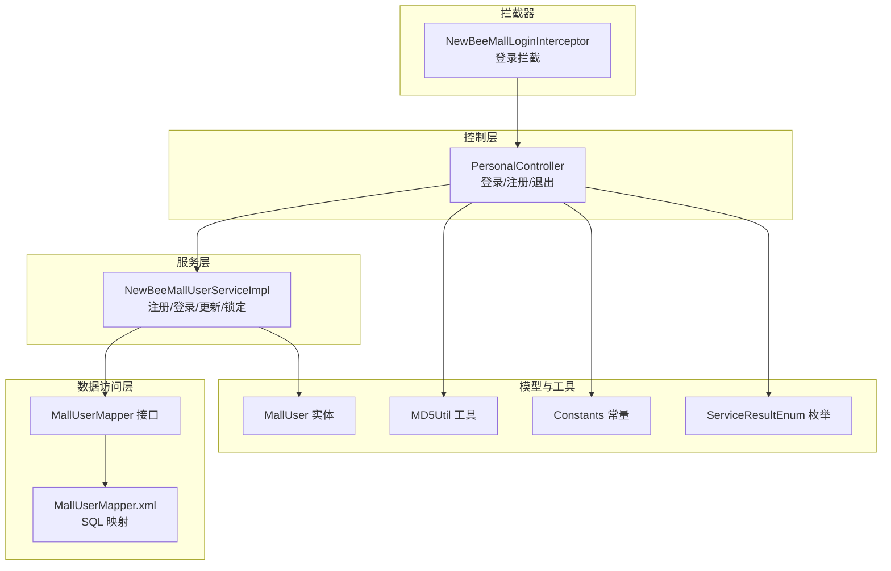
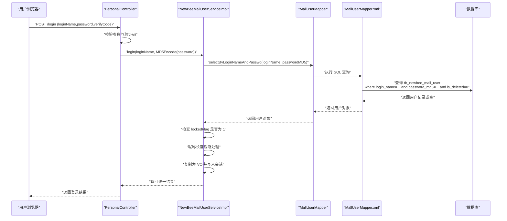
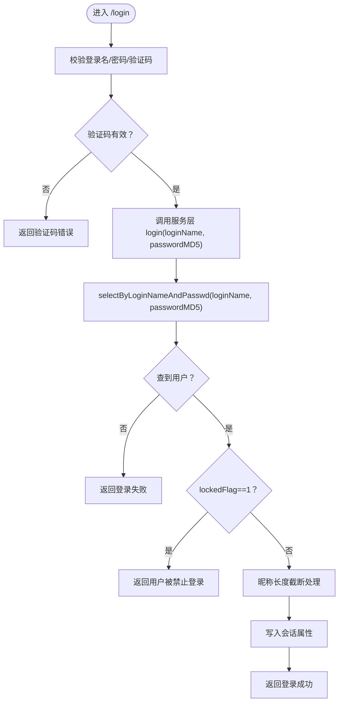
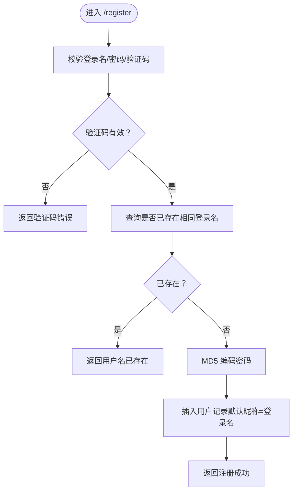
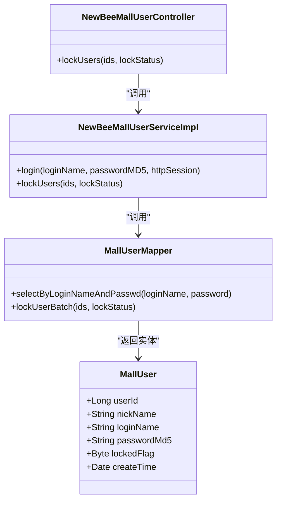
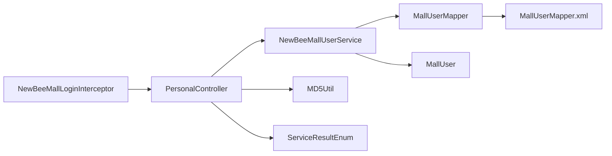

# 用户安全机制

<cite>
**本文引用的文件**
- [MallUserMapper.java](file://src/main/java/ltd/newbee/mall/dao/MallUserMapper.java)
- [MallUserMapper.xml](file://src/main/resources/mapper/MallUserMapper.xml)
- [NewBeeMallUserServiceImpl.java](file://src/main/java/ltd/newbee/mall/service/impl/NewBeeMallUserServiceImpl.java)
- [NewBeeMallUserService.java](file://src/main/java/ltd/newbee/mall/service/NewBeeMallUserService.java)
- [MallUser.java](file://src/main/java/ltd/newbee/mall/entity/MallUser.java)
- [MD5Util.java](file://src/main/java/ltd/newbee/mall/util/MD5Util.java)
- [PersonalController.java](file://src/main/java/ltd/newbee/mall/controller/mall/PersonalController.java)
- [NewBeeMallLoginInterceptor.java](file://src/main/java/ltd/newbee/mall/interceptor/NewBeeMallLoginInterceptor.java)
- [Constants.java](file://src/main/java/ltd/newbee/mall/common/Constants.java)
- [ServiceResultEnum.java](file://src/main/java/ltd/newbee/mall/common/ServiceResultEnum.java)
- [NewBeeMallUserController.java](file://src/main/java/ltd/newbee/mall/controller/admin/NewBeeMallUserController.java)
</cite>

## 目录
1. [简介](#简介)
2. [项目结构](#项目结构)
3. [核心组件](#核心组件)
4. [架构总览](#架构总览)
5. [详细组件分析](#详细组件分析)
6. [依赖关系分析](#依赖关系分析)
7. [性能考量](#性能考量)
8. [故障排查指南](#故障排查指南)
9. [结论](#结论)

## 简介
本文件聚焦于 newbee-mall 系统的用户安全机制，围绕用户注册、登录与账户锁定展开，基于 MallUserMapper 接口与 NewBeeMallUserServiceImpl 服务类，系统性说明以下关键点：
- 使用 selectByLoginNameAndPasswd 实现安全登录验证
- 密码 MD5 加密存储机制
- 注册时重复登录名校验
- 账户锁定功能（lockedFlag 字段）与登录拦截
- Service 层登录会话处理：锁定状态检查、昵称长度截断、会话属性设置
- 完整安全流程：从前端输入到数据库验证再到会话创建

## 项目结构
与用户安全直接相关的模块分布如下：
- 控制层：PersonalController 提供登录/注册接口与会话管理
- 服务层：NewBeeMallUserServiceImpl 实现注册、登录、用户信息更新与批量锁定
- 数据访问层：MallUserMapper 接口及对应的 XML 映射
- 实体模型：MallUser 包含登录名、密码MD5、锁定标志等字段
- 工具与常量：MD5Util 提供 MD5 编码；Constants 定义会话键；ServiceResultEnum 统一结果枚举
- 拦截器：NewBeeMallLoginInterceptor 在访问受保护资源前进行登录态校验

图表来源
- [PersonalController.java](file://src/main/java/ltd/newbee/mall/controller/mall/PersonalController.java#L62-L91)
- [NewBeeMallUserServiceImpl.java](file://src/main/java/ltd/newbee/mall/service/impl/NewBeeMallUserServiceImpl.java#L40-L74)
- [MallUserMapper.java](file://src/main/java/ltd/newbee/mall/dao/MallUserMapper.java#L26-L28)
- [MallUserMapper.xml](file://src/main/resources/mapper/MallUserMapper.xml#L54-L59)
- [MallUser.java](file://src/main/java/ltd/newbee/mall/entity/MallUser.java#L16-L31)
- [MD5Util.java](file://src/main/java/ltd/newbee/mall/util/MD5Util.java#L30-L44)
- [Constants.java](file://src/main/java/ltd/newbee/mall/common/Constants.java#L36-L39)
- [ServiceResultEnum.java](file://src/main/java/ltd/newbee/mall/common/ServiceResultEnum.java#L18-L27)
- [NewBeeMallLoginInterceptor.java](file://src/main/java/ltd/newbee/mall/interceptor/NewBeeMallLoginInterceptor.java#L30-L38)

章节来源
- [PersonalController.java](file://src/main/java/ltd/newbee/mall/controller/mall/PersonalController.java#L62-L91)
- [NewBeeMallUserServiceImpl.java](file://src/main/java/ltd/newbee/mall/service/impl/NewBeeMallUserServiceImpl.java#L40-L74)
- [MallUserMapper.java](file://src/main/java/ltd/newbee/mall/dao/MallUserMapper.java#L26-L28)
- [MallUserMapper.xml](file://src/main/resources/mapper/MallUserMapper.xml#L54-L59)
- [MallUser.java](file://src/main/java/ltd/newbee/mall/entity/MallUser.java#L16-L31)
- [MD5Util.java](file://src/main/java/ltd/newbee/mall/util/MD5Util.java#L30-L44)
- [Constants.java](file://src/main/java/ltd/newbee/mall/common/Constants.java#L36-L39)
- [ServiceResultEnum.java](file://src/main/java/ltd/newbee/mall/common/ServiceResultEnum.java#L18-L27)
- [NewBeeMallLoginInterceptor.java](file://src/main/java/ltd/newbee/mall/interceptor/NewBeeMallLoginInterceptor.java#L30-L38)

## 核心组件
- 登录验证入口：PersonalController 的 POST /login 接口负责接收登录名、验证码与密码，调用服务层登录方法
- 服务层登录逻辑：NewBeeMallUserServiceImpl.login 使用 MallUserMapper.selectByLoginNameAndPasswd 进行数据库匹配，并在会话中设置用户信息
- 数据库映射：MallUserMapper.xml 中的 selectByLoginNameAndPasswd SQL 查询包含登录名、密码MD5与未删除条件
- 密码存储：注册时使用 MD5Util 对明文密码进行编码后存入 password_md5 字段
- 账户锁定：实体 MallUser 的 lockedFlag 字段用于标识锁定状态；服务层在登录时检查该标志；管理员可通过后台接口批量锁定/解锁

章节来源
- [PersonalController.java](file://src/main/java/ltd/newbee/mall/controller/mall/PersonalController.java#L62-L91)
- [NewBeeMallUserServiceImpl.java](file://src/main/java/ltd/newbee/mall/service/impl/NewBeeMallUserServiceImpl.java#L55-L74)
- [MallUserMapper.xml](file://src/main/resources/mapper/MallUserMapper.xml#L54-L59)
- [MD5Util.java](file://src/main/java/ltd/newbee/mall/util/MD5Util.java#L30-L44)
- [MallUser.java](file://src/main/java/ltd/newbee/mall/entity/MallUser.java#L16-L31)

## 架构总览
下图展示了从用户输入到数据库验证再到会话创建的完整安全流程。

图表来源
- [PersonalController.java](file://src/main/java/ltd/newbee/mall/controller/mall/PersonalController.java#L62-L91)
- [NewBeeMallUserServiceImpl.java](file://src/main/java/ltd/newbee/mall/service/impl/NewBeeMallUserServiceImpl.java#L55-L74)
- [MallUserMapper.java](file://src/main/java/ltd/newbee/mall/dao/MallUserMapper.java#L26-L28)
- [MallUserMapper.xml](file://src/main/resources/mapper/MallUserMapper.xml#L54-L59)

## 详细组件分析

### 组件A：登录流程与安全校验
- 输入校验：PersonalController 在 /login 接口处对登录名、密码与验证码进行非空校验，并验证验证码有效性
- 密码编码：使用 MD5Util 将明文密码编码为固定长度字符串后再传入服务层
- 数据库验证：服务层调用 MallUserMapper.selectByLoginNameAndPasswd，SQL 条件包含登录名、密码MD5与未删除标记
- 锁定检查：若用户 lockedFlag=1，则返回“用户已被禁止登录”的统一错误码
- 会话设置：成功登录后，将用户信息封装为 VO 并写入 HttpSession，键值由 Constants.MALL_USER_SESSION_KEY 定义
- 显示优化：当用户昵称过长时，服务层进行截断处理，避免前端显示异常

图表来源
- [PersonalController.java](file://src/main/java/ltd/newbee/mall/controller/mall/PersonalController.java#L62-L91)
- [NewBeeMallUserServiceImpl.java](file://src/main/java/ltd/newbee/mall/service/impl/NewBeeMallUserServiceImpl.java#L55-L74)
- [MallUserMapper.xml](file://src/main/resources/mapper/MallUserMapper.xml#L54-L59)
- [Constants.java](file://src/main/java/ltd/newbee/mall/common/Constants.java#L36-L39)
- [ServiceResultEnum.java](file://src/main/java/ltd/newbee/mall/common/ServiceResultEnum.java#L50-L52)

章节来源
- [PersonalController.java](file://src/main/java/ltd/newbee/mall/controller/mall/PersonalController.java#L62-L91)
- [NewBeeMallUserServiceImpl.java](file://src/main/java/ltd/newbee/mall/service/impl/NewBeeMallUserServiceImpl.java#L55-L74)
- [MallUserMapper.xml](file://src/main/resources/mapper/MallUserMapper.xml#L54-L59)
- [Constants.java](file://src/main/java/ltd/newbee/mall/common/Constants.java#L36-L39)
- [ServiceResultEnum.java](file://src/main/java/ltd/newbee/mall/common/ServiceResultEnum.java#L50-L52)

### 组件B：注册流程与重复校验
- 重复登录名校验：服务层先通过 MallUserMapper.selectByLoginName 检查是否存在相同登录名，若存在则返回“用户名已存在”
- 密码加密：使用 MD5Util 对明文密码进行编码后存入 password_md5 字段
- 默认昵称：注册时将 nickName 初始化为 loginName
- 成功入库：insertSelective 返回大于 0 表示注册成功

图表来源
- [PersonalController.java](file://src/main/java/ltd/newbee/mall/controller/mall/PersonalController.java#L93-L121)
- [NewBeeMallUserServiceImpl.java](file://src/main/java/ltd/newbee/mall/service/impl/NewBeeMallUserServiceImpl.java#L40-L53)
- [MallUserMapper.xml](file://src/main/resources/mapper/MallUserMapper.xml#L74-L116)
- [MD5Util.java](file://src/main/java/ltd/newbee/mall/util/MD5Util.java#L30-L44)

章节来源
- [PersonalController.java](file://src/main/java/ltd/newbee/mall/controller/mall/PersonalController.java#L93-L121)
- [NewBeeMallUserServiceImpl.java](file://src/main/java/ltd/newbee/mall/service/impl/NewBeeMallUserServiceImpl.java#L40-L53)
- [MallUserMapper.xml](file://src/main/resources/mapper/MallUserMapper.xml#L74-L116)
- [MD5Util.java](file://src/main/java/ltd/newbee/mall/util/MD5Util.java#L30-L44)

### 组件C：账户锁定与批量管理
- 实体字段：MallUser 的 lockedFlag 字段用于标识锁定状态
- 登录拦截：服务层在登录时检查 lockedFlag，若为 1 则拒绝登录
- 批量锁定：服务层通过 MallUserMapper.lockUserBatch 执行批量更新 locked_flag
- 管理端接口：NewBeeMallUserController 提供 /admin/users/lock/{lockStatus} 接口，支持 0（解除锁定）与 1（锁定）

图表来源
- [MallUser.java](file://src/main/java/ltd/newbee/mall/entity/MallUser.java#L16-L31)
- [MallUserMapper.java](file://src/main/java/ltd/newbee/mall/dao/MallUserMapper.java#L26-L28)
- [MallUserMapper.java](file://src/main/java/ltd/newbee/mall/dao/MallUserMapper.java#L38-L39)
- [NewBeeMallUserServiceImpl.java](file://src/main/java/ltd/newbee/mall/service/impl/NewBeeMallUserServiceImpl.java#L55-L74)
- [NewBeeMallUserServiceImpl.java](file://src/main/java/ltd/newbee/mall/service/impl/NewBeeMallUserServiceImpl.java#L100-L106)
- [NewBeeMallUserController.java](file://src/main/java/ltd/newbee/mall/controller/admin/NewBeeMallUserController.java#L56-L73)

章节来源
- [MallUser.java](file://src/main/java/ltd/newbee/mall/entity/MallUser.java#L16-L31)
- [MallUserMapper.java](file://src/main/java/ltd/newbee/mall/dao/MallUserMapper.java#L38-L39)
- [NewBeeMallUserServiceImpl.java](file://src/main/java/ltd/newbee/mall/service/impl/NewBeeMallUserServiceImpl.java#L100-L106)
- [NewBeeMallUserController.java](file://src/main/java/ltd/newbee/mall/controller/admin/NewBeeMallUserController.java#L56-L73)

### 组件D：会话与拦截
- 会话键：Constants.MALL_USER_SESSION_KEY 定义了会话中存储用户信息的键名
- 登录后写入：服务层将用户 VO 写入 HttpSession，作为后续请求的身份凭证
- 登录拦截：NewBeeMallLoginInterceptor 在访问受保护资源前检查会话中是否存在该键，不存在则重定向至登录页

章节来源
- [Constants.java](file://src/main/java/ltd/newbee/mall/common/Constants.java#L36-L39)
- [NewBeeMallUserServiceImpl.java](file://src/main/java/ltd/newbee/mall/service/impl/NewBeeMallUserServiceImpl.java#L67-L71)
- [NewBeeMallLoginInterceptor.java](file://src/main/java/ltd/newbee/mall/interceptor/NewBeeMallLoginInterceptor.java#L30-L38)

## 依赖关系分析
- 控制层依赖服务层接口 NewBeeMallUserService，实现登录/注册/退出与用户信息更新
- 服务层依赖 DAO 接口 MallUserMapper，DAO 依赖 XML 映射文件执行 SQL
- 实体 MallUser 与数据库表字段一一对应，包含密码MD5与锁定标志
- 工具类 MD5Util 仅用于密码编码，不参与业务逻辑判断
- 统一结果枚举 ServiceResultEnum 为前后端交互提供一致的状态码

图表来源
- [PersonalController.java](file://src/main/java/ltd/newbee/mall/controller/mall/PersonalController.java#L62-L91)
- [NewBeeMallUserService.java](file://src/main/java/ltd/newbee/mall/service/NewBeeMallUserService.java#L18-L62)
- [MallUserMapper.java](file://src/main/java/ltd/newbee/mall/dao/MallUserMapper.java#L26-L28)
- [MallUserMapper.xml](file://src/main/resources/mapper/MallUserMapper.xml#L54-L59)
- [MallUser.java](file://src/main/java/ltd/newbee/mall/entity/MallUser.java#L16-L31)
- [MD5Util.java](file://src/main/java/ltd/newbee/mall/util/MD5Util.java#L30-L44)
- [ServiceResultEnum.java](file://src/main/java/ltd/newbee/mall/common/ServiceResultEnum.java#L18-L27)
- [NewBeeMallLoginInterceptor.java](file://src/main/java/ltd/newbee/mall/interceptor/NewBeeMallLoginInterceptor.java#L30-L38)

章节来源
- [PersonalController.java](file://src/main/java/ltd/newbee/mall/controller/mall/PersonalController.java#L62-L91)
- [NewBeeMallUserService.java](file://src/main/java/ltd/newbee/mall/service/NewBeeMallUserService.java#L18-L62)
- [MallUserMapper.java](file://src/main/java/ltd/newbee/mall/dao/MallUserMapper.java#L26-L28)
- [MallUserMapper.xml](file://src/main/resources/mapper/MallUserMapper.xml#L54-L59)
- [MallUser.java](file://src/main/java/ltd/newbee/mall/entity/MallUser.java#L16-L31)
- [MD5Util.java](file://src/main/java/ltd/newbee/mall/util/MD5Util.java#L30-L44)
- [ServiceResultEnum.java](file://src/main/java/ltd/newbee/mall/common/ServiceResultEnum.java#L18-L27)
- [NewBeeMallLoginInterceptor.java](file://src/main/java/ltd/newbee/mall/interceptor/NewBeeMallLoginInterceptor.java#L30-L38)

## 性能考量
- 登录查询：selectByLoginNameAndPasswd 使用登录名与密码MD5联合条件，建议在 login_name 与 password_md5 上建立索引以提升查询效率
- 批量锁定：lockUserBatch 使用 IN 子句批量更新，注意 ids 数组大小与 SQL 限制，避免超长 IN 列表导致性能问题
- 昵称截断：服务层对过长昵称进行截断，减少前端渲染压力，但应确保截断策略不影响用户识别
- 会话存储：会话中仅保存必要的用户信息，避免存储大对象或敏感数据

## 故障排查指南
- 登录失败
  - 检查验证码是否正确，确认 PersonalController 的验证码校验逻辑
  - 确认密码是否经过 MD5 编码后再传入服务层
  - 核对数据库中是否存在未删除且匹配的登录名与密码MD5
- 用户被禁止登录
  - 检查 MallUser.lockedFlag 是否为 1
  - 确认服务层登录逻辑中对 lockedFlag 的检查
- 注册失败
  - 若提示“用户名已存在”，检查是否存在重复登录名
  - 确认密码MD5是否正确写入 password_md5 字段
- 会话无效
  - 检查 Constants.MALL_USER_SESSION_KEY 是否与拦截器一致
  - 确认登录成功后是否正确写入会话
  - 检查拦截器是否在受保护路径生效

章节来源
- [PersonalController.java](file://src/main/java/ltd/newbee/mall/controller/mall/PersonalController.java#L62-L91)
- [NewBeeMallUserServiceImpl.java](file://src/main/java/ltd/newbee/mall/service/impl/NewBeeMallUserServiceImpl.java#L55-L74)
- [MallUserMapper.xml](file://src/main/resources/mapper/MallUserMapper.xml#L54-L59)
- [ServiceResultEnum.java](file://src/main/java/ltd/newbee/mall/common/ServiceResultEnum.java#L50-L52)
- [NewBeeMallLoginInterceptor.java](file://src/main/java/ltd/newbee/mall/interceptor/NewBeeMallLoginInterceptor.java#L30-L38)

## 结论
newbee-mall 的用户安全机制以“明文密码经 MD5 编码后存储”为核心，结合登录名唯一性校验、lockedFlag 账户锁定与会话拦截，形成较为完整的登录安全闭环。服务层在登录流程中完成锁定状态检查、昵称截断与会话写入，控制层负责输入校验与验证码校验，DAO 层通过 XML 映射精确执行数据库查询与更新。建议在生产环境中进一步强化安全措施，如引入盐值、更严格的密码策略与多因素认证等。