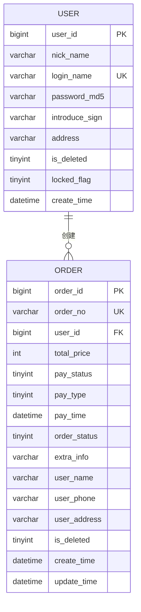
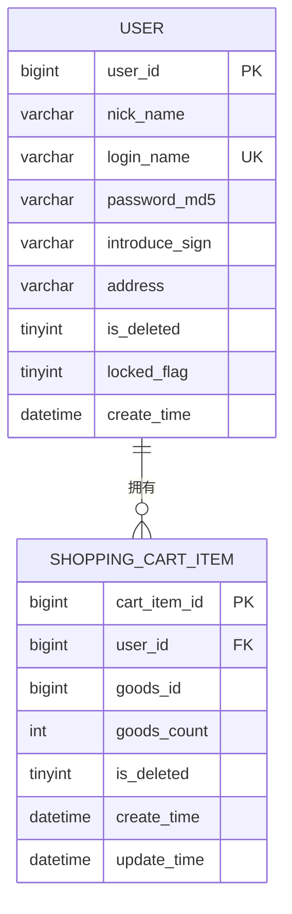
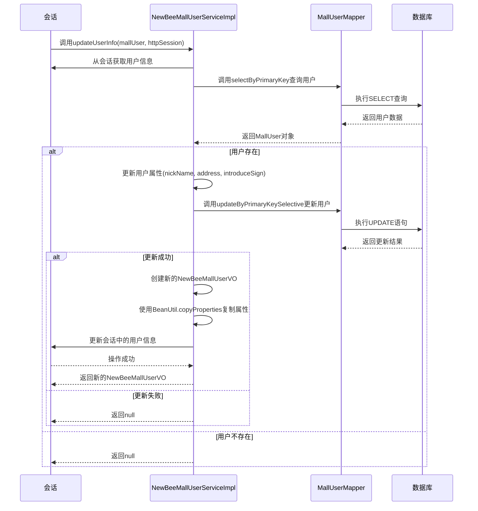

# 用户实体关联关系

<cite>
**本文档引用文件**   
- [MallUser.java](file://src/main/java/ltd/newbee/mall/entity/MallUser.java)
- [NewBeeMallOrder.java](file://src/main/java/ltd/newbee/mall/entity/NewBeeMallOrder.java)
- [NewBeeMallShoppingCartItem.java](file://src/main/java/ltd/newbee/mall/entity/NewBeeMallShoppingCartItem.java)
- [NewBeeMallUserServiceImpl.java](file://src/main/java/ltd/newbee/mall/service/impl/NewBeeMallUserServiceImpl.java)
- [MallUserMapper.xml](file://src/main/resources/mapper/MallUserMapper.xml)
- [NewBeeMallOrderMapper.xml](file://src/main/resources/mapper/NewBeeMallOrderMapper.xml)
- [NewBeeMallShoppingCartItemMapper.xml](file://src/main/resources/mapper/NewBeeMallShoppingCartItemMapper.xml)
- [BeanUtil.java](file://src/main/java/ltd/newbee/mall/util/BeanUtil.java)
- [NewBeeMallUtils.java](file://src/main/java/ltd/newbee/mall/util/NewBeeMallUtils.java)
- [NewBeeMallUserVO.java](file://src/main/java/ltd/newbee/mall/controller/vo/NewBeeMallUserVO.java)
- [newbee_mall_schema.sql](file://src/main/resources/newbee_mall_schema.sql)
</cite>

## 目录
1. [用户实体概述](#用户实体概述)
2. [用户实体与其他核心实体的关联关系](#用户实体与其他核心实体的关联关系)
3. [用户信息更新流程分析](#用户信息更新流程分析)
4. [数据一致性保障机制](#数据一致性保障机制)
5. [用户信息生命周期管理](#用户信息生命周期管理)
6. [总结](#总结)

## 用户实体概述

用户实体（MallUser）是newbee-mall系统的核心实体之一，代表了平台的注册用户。该实体通过`tb_newbee_mall_user`数据库表进行持久化存储，包含了用户的基本信息和状态属性。用户实体的主要属性包括：
- `userId`: 用户主键ID，唯一标识一个用户
- `nickName`: 用户昵称，用于在系统中显示
- `loginName`: 登录名称，通常为手机号
- `passwordMd5`: MD5加密后的密码
- `introduceSign`: 个性签名，用户自定义的个人描述
- `address`: 收货地址，用户的默认配送地址
- `isDeleted`: 注销标识，0表示正常，1表示已注销
- `lockedFlag`: 锁定标识，0表示未锁定，1表示已锁定
- `createTime`: 用户注册时间

用户实体是整个系统业务逻辑的起点，所有与用户相关的操作（如订单创建、购物车管理、个人中心操作等）都以用户实体为基础。

**Section sources**
- [MallUser.java](file://src/main/java/ltd/newbee/mall/entity/MallUser.java#L15-L125)
- [newbee_mall_schema.sql](file://src/main/resources/newbee_mall_schema.sql#L998-L1012)

## 用户实体与其他核心实体的关联关系

用户实体在newbee-mall系统中与其他核心实体存在紧密的关联关系，主要通过数据库外键约束和业务逻辑来实现。这些关联关系构成了系统的核心数据模型。

### 用户与订单的关联关系

用户实体与订单实体（NewBeeMallOrder）之间存在一对多的关联关系。一个用户可以创建多个订单，而每个订单只能属于一个用户。这种关系通过数据库外键约束实现：



**Diagram sources**
- [NewBeeMallOrder.java](file://src/main/java/ltd/newbee/mall/entity/NewBeeMallOrder.java#L15-L169)
- [newbee_mall_schema.sql](file://src/main/resources/newbee_mall_schema.sql#L862-L882)

在数据库层面，`tb_newbee_mall_order`表中的`user_id`字段是外键，引用了`tb_newbee_mall_user`表的`user_id`主键。这种设计确保了数据的完整性和一致性，防止出现孤立的订单记录。

在业务逻辑层面，当用户在商城中下单时，系统会将当前用户的`userId`作为外键值插入到订单记录中。订单实体还包含了`user_address`字段，用于存储下单时的收货地址，这通常是用户实体中`address`字段的副本，以确保即使用户后续修改了收货地址，历史订单的配送信息仍然保持不变。

### 用户与购物车的关联关系

用户实体与购物车项实体（NewBeeMallShoppingCartItem）之间也存在一对多的关联关系。一个用户可以有多个购物车项，而每个购物车项只能属于一个用户。这种关系同样通过数据库外键约束实现：



**Diagram sources**
- [NewBeeMallShoppingCartItem.java](file://src/main/java/ltd/newbee/mall/entity/NewBeeMallShoppingCartItem.java#L13-L100)
- [newbee_mall_schema.sql](file://src/main/resources/newbee_mall_schema.sql#L979-L991)

在数据库层面，`tb_newbee_mall_shopping_cart_item`表中的`user_id`字段是外键，引用了`tb_newbee_mall_user`表的`user_id`主键。购物车项实体还包含`goods_id`字段，用于关联商品实体，以及`goods_count`字段，用于记录商品数量。

这种设计模式确保了购物车数据的用户归属关系，使得系统能够准确地为每个用户维护其独立的购物车内容。当用户登录系统后，系统会根据用户的`userId`查询其所有的购物车项，并在前端界面中展示。

## 用户信息更新流程分析

用户信息更新是newbee-mall系统中的一个重要功能，主要通过`NewBeeMallUserServiceImpl`服务类的`updateUserInfo`方法实现。该方法负责处理用户昵称、收货地址和个性签名的更新操作。

### updateUserInfo方法执行流程

`updateUserInfo`方法的执行流程如下：



**Diagram sources**
- [NewBeeMallUserServiceImpl.java](file://src/main/java/ltd/newbee/mall/service/impl/NewBeeMallUserServiceImpl.java#L77-L97)

### 方法参数与返回值

`updateUserInfo`方法接收两个参数：
- `MallUser mallUser`: 包含待更新用户信息的对象，通常只包含需要更新的字段（如昵称、地址、个性签名）
- `HttpSession httpSession`: HTTP会话对象，用于获取当前登录用户的信息和更新会话状态

方法的返回值是一个`NewBeeMallUserVO`对象，如果更新成功则返回更新后的用户信息视图对象，如果更新失败则返回null。

### 业务逻辑处理

在`updateUserInfo`方法中，系统首先从HTTP会话中获取当前用户的`userId`，然后通过`MallUserMapper`的`selectByPrimaryKey`方法从数据库中查询完整的用户信息。这种设计确保了系统总是基于最新的数据库状态进行更新操作，避免了并发更新导致的数据不一致问题。

对于需要更新的字段，系统会进行空值检查和内容清理：
- 使用`StringUtils.hasText()`检查字段是否为空或仅包含空白字符
- 使用`NewBeeMallUtils.cleanString()`对用户输入进行清理，防止XSS攻击和SQL注入

**Section sources**
- [NewBeeMallUserServiceImpl.java](file://src/main/java/ltd/newbee/mall/service/impl/NewBeeMallUserServiceImpl.java#L77-L97)
- [NewBeeMallUtils.java](file://src/main/java/ltd/newbee/mall/util/NewBeeMallUtils.java#L22-L54)

## 数据一致性保障机制

为了确保用户信息更新过程中的数据一致性，newbee-mall系统采用了多层次的保障机制，涵盖了数据查询、更新和会话管理等多个方面。

### 从数据库重新查询用户信息

在更新用户信息之前，系统不会直接使用传入的`MallUser`对象进行更新，而是通过`selectByPrimaryKey`方法从数据库中重新查询完整的用户信息。这种设计模式具有以下优势：

1. **避免并发问题**：如果多个用户同时更新同一用户的信息，直接使用传入的对象可能导致数据覆盖。通过重新查询，系统总是基于最新的数据库状态进行更新。
2. **确保数据完整性**：传入的`MallUser`对象可能只包含部分字段，而重新查询可以获取完整的用户信息，确保其他字段不会被意外清空。
3. **验证用户状态**：重新查询可以验证用户是否仍然存在且未被删除或锁定。

```java
MallUser userFromDB = mallUserMapper.selectByPrimaryKey(userTemp.getUserId());
```

**Section sources**
- [NewBeeMallUserServiceImpl.java](file://src/main/java/ltd/newbee/mall/service/impl/NewBeeMallUserServiceImpl.java#L79-L80)

### 使用BeanUtil进行属性拷贝

在用户信息更新成功后，系统需要创建一个新的`NewBeeMallUserVO`对象返回给前端，并更新会话中的用户信息。为了避免手动逐个设置属性可能带来的错误，系统使用了`BeanUtil.copyProperties`方法进行属性拷贝：

```java
NewBeeMallUserVO newBeeMallUserVO = new NewBeeMallUserVO();
BeanUtil.copyProperties(userFromDB, newBeeMallUserVO);
```

`BeanUtil`类是系统提供的一个工具类，封装了Spring的`BeanUtils.copyProperties`方法，并添加了额外的功能。这种设计模式确保了属性拷贝的准确性和效率，避免了手动编码可能引入的错误。

**Section sources**
- [NewBeeMallUserServiceImpl.java](file://src/main/java/ltd/newbee/mall/service/impl/NewBeeMallUserServiceImpl.java#L91-L92)
- [BeanUtil.java](file://src/main/java/ltd/newbee/mall/util/BeanUtil.java#L14-L20)

### 更新会话中的用户信息

为了确保用户在后续操作中能够获取到最新的个人信息，系统在更新数据库成功后，会立即更新HTTP会话中的用户信息：

```java
httpSession.setAttribute(Constants.MALL_USER_SESSION_KEY, newBeeMallUserVO);
```

这种机制确保了用户信息的一致性，避免了用户在更新信息后刷新页面仍然看到旧信息的情况。会话更新是整个数据一致性保障流程的最后一步，确保了从数据库到用户界面的完整数据同步。

**Section sources**
- [NewBeeMallUserServiceImpl.java](file://src/main/java/ltd/newbee/mall/service/impl/NewBeeMallUserServiceImpl.java#L93-L94)

## 用户信息生命周期管理

用户信息的生命周期管理涵盖了从用户注册、信息更新到账户注销的全过程。newbee-mall系统通过一系列的机制确保用户信息在整个生命周期中的安全性和一致性。

### 用户注册与初始化

当新用户注册时，系统会创建一个新的`MallUser`对象，并将其持久化到数据库中。注册过程中，系统会：
- 验证登录名是否已存在
- 对密码进行MD5加密
- 设置默认的昵称（通常与登录名相同）
- 初始化用户状态（未锁定、未删除）

### 用户信息更新

用户信息更新是用户生命周期中的常见操作，主要涉及昵称、收货地址和个性签名的修改。系统通过`updateUserInfo`方法处理这些更新请求，确保更新过程的安全性和一致性。

### 用户账户状态管理

系统通过`isDeleted`和`lockedFlag`两个字段管理用户账户的状态：
- `isDeleted`: 标识用户是否已被注销。当用户注销账户时，该字段被设置为1，但用户数据不会被物理删除，以便保留历史订单等关联数据。
- `lockedFlag`: 标识用户账户是否被锁定。当检测到异常登录行为时，系统可以锁定用户账户，防止未授权访问。

### 数据持久化与关联

用户信息的生命周期与其他实体紧密关联：
- **订单历史**：即使用户注销账户，其历史订单仍然保留，订单中的`user_address`字段保存了下单时的收货地址。
- **购物车数据**：用户的购物车项与其账户关联，当用户登录时可以恢复其购物车内容。
- **会话管理**：用户信息存储在HTTP会话中，确保用户在会话期间能够访问其个人信息。

这种设计模式确保了用户信息在整个生命周期中的完整性和可用性，同时保护了用户的隐私和数据安全。

**Section sources**
- [MallUser.java](file://src/main/java/ltd/newbee/mall/entity/MallUser.java#L15-L125)
- [NewBeeMallUserServiceImpl.java](file://src/main/java/ltd/newbee/mall/service/impl/NewBeeMallUserServiceImpl.java#L77-L97)
- [newbee_mall_schema.sql](file://src/main/resources/newbee_mall_schema.sql#L998-L1012)

## 总结

newbee-mall系统的用户实体关联关系设计体现了良好的数据模型和业务逻辑分离原则。通过外键约束，用户实体与订单、购物车等核心实体建立了清晰的关联关系，确保了数据的完整性和一致性。

`updateUserInfo`方法的实现展示了系统在处理用户信息更新时的严谨性，通过从数据库重新查询用户信息、使用工具类进行属性拷贝、更新会话状态等步骤，构建了一个完整的数据一致性保障机制。

用户信息生命周期管理涵盖了从注册到注销的全过程，通过状态字段和关联数据的设计，既保证了用户体验的连续性，又确保了历史数据的完整性。这种设计模式为电商平台提供了稳定可靠的基础架构，能够有效支持复杂的业务需求。