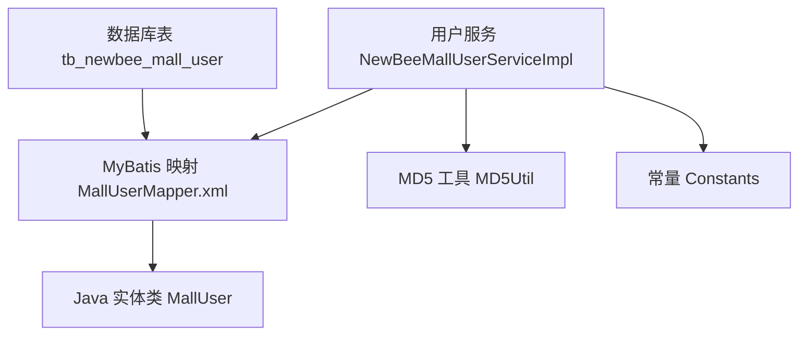
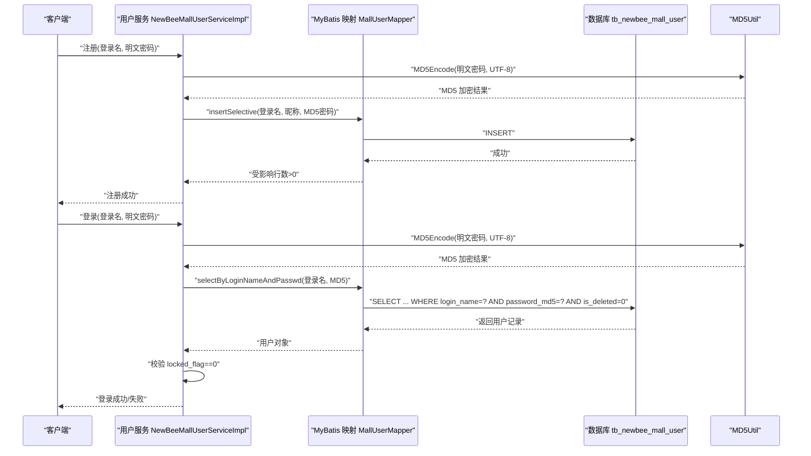
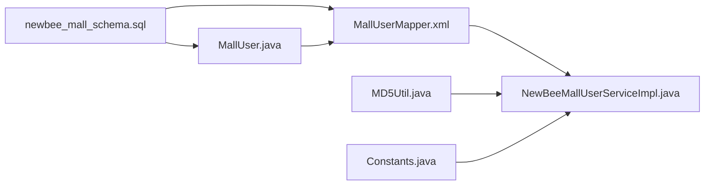

# 用户实体基础信息

<cite>
**本文引用的文件**
- [newbee_mall_schema.sql](file://src/main/resources/newbee_mall_schema.sql)
- [MallUser.java](file://src/main/java/ltd/newbee/mall/entity/MallUser.java)
- [MallUserMapper.xml](file://src/main/resources/mapper/MallUserMapper.xml)
- [NewBeeMallUserServiceImpl.java](file://src/main/java/ltd/newbee/mall/service/impl/NewBeeMallUserServiceImpl.java)
- [MD5Util.java](file://src/main/java/ltd/newbee/mall/util/MD5Util.java)
- [Constants.java](file://src/main/java/ltd/newbee/mall/common/Constants.java)
</cite>

## 目录
1. [简介](#简介)
2. [项目结构](#项目结构)
3. [核心组件](#核心组件)
4. [架构总览](#架构总览)
5. [详细组件分析](#详细组件分析)
6. [依赖分析](#依赖分析)
7. [性能考虑](#性能考虑)
8. [故障排查指南](#故障排查指南)
9. [结论](#结论)

## 简介
本文件面向 newbee-mall 系统的用户实体，基于数据库表 tb_newbee_mall_user 的结构与 Java 实体类 MallUser 的映射关系，系统化梳理字段含义、数据类型、约束与索引策略，重点说明用户主键自增、登录名唯一性、密码 MD5 加密存储等关键设计点，并给出字段级的长度限制、默认值与业务含义说明，帮助开发者与运维人员快速理解并正确使用用户实体。

## 项目结构
围绕用户实体，涉及以下关键文件：
- 数据库脚本：定义 tb_newbee_mall_user 表结构与初始数据
- 实体类：MallUser 映射数据库字段
- MyBatis 映射：MallUserMapper.xml 定义字段映射与常用查询
- 服务层：NewBeeMallUserServiceImpl 使用 MD5Util 对密码进行加密存储
- 常量：Constants 中定义会话中用户对象的键名

图表来源
- [newbee_mall_schema.sql](file://src/main/resources/newbee_mall_schema.sql#L1000-L1024)
- [MallUser.java](file://src/main/java/ltd/newbee/mall/entity/MallUser.java#L1-L125)
- [MallUserMapper.xml](file://src/main/resources/mapper/MallUserMapper.xml#L1-L184)
- [NewBeeMallUserServiceImpl.java](file://src/main/java/ltd/newbee/mall/service/impl/NewBeeMallUserServiceImpl.java#L1-L108)
- [MD5Util.java](file://src/main/java/ltd/newbee/mall/util/MD5Util.java#L1-L49)
- [Constants.java](file://src/main/java/ltd/newbee/mall/common/Constants.java#L1-L48)

章节来源
- [newbee_mall_schema.sql](file://src/main/resources/newbee_mall_schema.sql#L1000-L1024)
- [MallUser.java](file://src/main/java/ltd/newbee/mall/entity/MallUser.java#L1-L125)
- [MallUserMapper.xml](file://src/main/resources/mapper/MallUserMapper.xml#L1-L184)
- [NewBeeMallUserServiceImpl.java](file://src/main/java/ltd/newbee/mall/service/impl/NewBeeMallUserServiceImpl.java#L1-L108)
- [MD5Util.java](file://src/main/java/ltd/newbee/mall/util/MD5Util.java#L1-L49)
- [Constants.java](file://src/main/java/ltd/newbee/mall/common/Constants.java#L1-L48)

## 核心组件
- 数据库表 tb_newbee_mall_user：定义用户主键、昵称、登录名、密码、签名、地址、注销/锁定标记、创建时间等字段，主键为 user_id，采用自增策略。
- Java 实体类 MallUser：与数据库字段一一映射，包含 getter/setter 与 toString 方法，提供 JSON 序列化格式的时间字段。
- MyBatis 映射 MallUserMapper.xml：定义字段映射、常用查询（按主键、按登录名、按登录名+密码）、插入/更新、批量锁定等。
- 服务层 NewBeeMallUserServiceImpl：注册时对密码进行 MD5 加密存储；登录时校验登录名+密码且未锁定；更新用户资料时清洗输入并回写会话。
- MD5Util：提供 MD5 编码工具，用于密码加密。
- Constants：定义会话中用户对象的键名，便于统一管理。

章节来源
- [newbee_mall_schema.sql](file://src/main/resources/newbee_mall_schema.sql#L1000-L1024)
- [MallUser.java](file://src/main/java/ltd/newbee/mall/entity/MallUser.java#L1-L125)
- [MallUserMapper.xml](file://src/main/resources/mapper/MallUserMapper.xml#L1-L184)
- [NewBeeMallUserServiceImpl.java](file://src/main/java/ltd/newbee/mall/service/impl/NewBeeMallUserServiceImpl.java#L1-L108)
- [MD5Util.java](file://src/main/java/ltd/newbee/mall/util/MD5Util.java#L1-L49)
- [Constants.java](file://src/main/java/ltd/newbee/mall/common/Constants.java#L1-L48)

## 架构总览
用户实体在系统中的流转如下：
- 注册流程：前端提交登录名与明文密码，服务层调用 MD5Util 加密后存入数据库，字段 password_md5 记录加密值。
- 登录流程：前端提交登录名与明文密码，服务层先进行 MD5 加密，再通过 MyBatis 查询 login_name + password_md5，同时检查 is_deleted 与 locked_flag。
- 更新流程：服务层清洗输入内容后，通过 MyBatis 更新用户资料，并将最新用户信息写回会话。

图表来源
- [NewBeeMallUserServiceImpl.java](file://src/main/java/ltd/newbee/mall/service/impl/NewBeeMallUserServiceImpl.java#L39-L74)
- [MallUserMapper.xml](file://src/main/resources/mapper/MallUserMapper.xml#L48-L59)
- [MD5Util.java](file://src/main/java/ltd/newbee/mall/util/MD5Util.java#L30-L44)

章节来源
- [NewBeeMallUserServiceImpl.java](file://src/main/java/ltd/newbee/mall/service/impl/NewBeeMallUserServiceImpl.java#L39-L74)
- [MallUserMapper.xml](file://src/main/resources/mapper/MallUserMapper.xml#L48-L59)
- [MD5Util.java](file://src/main/java/ltd/newbee/mall/util/MD5Util.java#L30-L44)

## 详细组件分析

### 数据库表 tb_newbee_mall_user 字段级说明
- user_id
  - 类型：bigint(20)
  - 约束：NOT NULL，主键，自增
  - 默认值：无（自增）
  - 业务含义：用户唯一标识，系统内部主键
  - 索引：主键索引（PRIMARY KEY）
  - 章节来源
    - [newbee_mall_schema.sql](file://src/main/resources/newbee_mall_schema.sql#L1000-L1012)

- nick_name
  - 类型：varchar(50)
  - 约束：NOT NULL，默认空字符串
  - 默认值：''
  - 业务含义：用户昵称，用于前台展示
  - 章节来源
    - [newbee_mall_schema.sql](file://src/main/resources/newbee_mall_schema.sql#L1000-L1012)

- login_name
  - 类型：varchar(11)
  - 约束：NOT NULL，默认空字符串
  - 默认值：''
  - 业务含义：登录名，默认为手机号；系统中注册时会检查重复
  - 索引：未显式声明索引，但服务层查询使用 login_name，建议在生产环境为其建立唯一索引以保障唯一性与查询性能
  - 章节来源
    - [newbee_mall_schema.sql](file://src/main/resources/newbee_mall_schema.sql#L1000-L1012)
    - [NewBeeMallUserServiceImpl.java](file://src/main/java/ltd/newbee/mall/service/impl/NewBeeMallUserServiceImpl.java#L40-L53)

- password_md5
  - 类型：varchar(32)
  - 约束：NOT NULL，默认空字符串
  - 默认值：''
  - 业务含义：MD5 加密后的密码，登录时使用明文密码经 MD5 后匹配
  - 章节来源
    - [newbee_mall_schema.sql](file://src/main/resources/newbee_mall_schema.sql#L1000-L1012)
    - [MD5Util.java](file://src/main/java/ltd/newbee/mall/util/MD5Util.java#L30-L44)

- introduce_sign
  - 类型：varchar(100)
  - 约束：NOT NULL，默认空字符串
  - 默认值：''
  - 业务含义：个性签名/座右铭
  - 章节来源
    - [newbee_mall_schema.sql](file://src/main/resources/newbee_mall_schema.sql#L1000-L1012)

- address
  - 类型：varchar(100)
  - 约束：NOT NULL，默认空字符串
  - 默认值：''
  - 业务含义：默认收货地址
  - 章节来源
    - [newbee_mall_schema.sql](file://src/main/resources/newbee_mall_schema.sql#L1000-L1012)

- is_deleted
  - 类型：tinyint(4)
  - 约束：NOT NULL，默认0
  - 默认值：0（正常），1（注销）
  - 业务含义：软删除标记；查询/登录/删除均会过滤 is_deleted=1 的记录
  - 章节来源
    - [newbee_mall_schema.sql](file://src/main/resources/newbee_mall_schema.sql#L1000-L1012)
    - [MallUserMapper.xml](file://src/main/resources/mapper/MallUserMapper.xml#L42-L63)

- locked_flag
  - 类型：tinyint(4)
  - 约束：NOT NULL，默认0
  - 默认值：0（未锁定），1（已锁定）
  - 业务含义：账户锁定标记；登录时若 locked_flag=1 则拒绝登录
  - 章节来源
    - [newbee_mall_schema.sql](file://src/main/resources/newbee_mall_schema.sql#L1000-L1012)
    - [MallUserMapper.xml](file://src/main/resources/mapper/MallUserMapper.xml#L48-L59)
    - [NewBeeMallUserServiceImpl.java](file://src/main/java/ltd/newbee/mall/service/impl/NewBeeMallUserServiceImpl.java#L55-L74)

- create_time
  - 类型：datetime(0)
  - 约束：NOT NULL，默认当前时间
  - 默认值：CURRENT_TIMESTAMP
  - 业务含义：注册时间
  - 章节来源
    - [newbee_mall_schema.sql](file://src/main/resources/newbee_mall_schema.sql#L1000-L1012)

- 主键与索引
  - 主键：user_id（自增）
  - 建议：login_name 建立唯一索引以保证登录名唯一性与查询效率
  - 章节来源
    - [newbee_mall_schema.sql](file://src/main/resources/newbee_mall_schema.sql#L1000-L1012)
    - [MallUserMapper.xml](file://src/main/resources/mapper/MallUserMapper.xml#L48-L59)

### Java 实体类 MallUser 与数据库字段映射
- 字段映射关系（驼峰与数据库列名对应）
  - userId -> user_id
  - nickName -> nick_name
  - loginName -> login_name
  - passwordMd5 -> password_md5
  - introduceSign -> introduce_sign
  - address -> address
  - isDeleted -> is_deleted
  - lockedFlag -> locked_flag
  - createTime -> create_time
- 字段处理
  - setter 中对字符串字段执行 trim，避免前后空格影响业务
  - createTime 使用 Jackson 注解输出为 yyyy-MM-dd HH:mm:ss 格式
- 章节来源
  - [MallUser.java](file://src/main/java/ltd/newbee/mall/entity/MallUser.java#L1-L125)
  - [MallUserMapper.xml](file://src/main/resources/mapper/MallUserMapper.xml#L4-L14)

### MyBatis 映射与常用查询
- 常用查询
  - 按主键查询：selectByPrimaryKey（过滤 is_deleted=0）
  - 按登录名查询：selectByLoginName（过滤 is_deleted=0）
  - 登录匹配：selectByLoginNameAndPasswd（过滤 is_deleted=0）
  - 分页与统计：findMallUserList、getTotalMallUsers（支持 loginName 条件）
  - 删除：deleteByPrimaryKey（软删除，更新 is_deleted=1）
  - 批量锁定：lockUserBatch（批量更新 locked_flag）
- 插入/更新
  - insertSelective：按非空字段插入
  - updateByPrimaryKeySelective：按非空字段更新
- 章节来源
  - [MallUserMapper.xml](file://src/main/resources/mapper/MallUserMapper.xml#L1-L184)

### 密码加密与登录流程
- 密码加密
  - 服务层注册时使用 MD5Util.MD5Encode(明文, "UTF-8") 对密码进行 MD5 加密后入库
- 登录流程
  - 服务层登录时同样对明文密码进行 MD5 加密，然后通过 MyBatis 查询 login_name + password_md5，同时检查 is_deleted=0 与 locked_flag=0
- 章节来源
  - [NewBeeMallUserServiceImpl.java](file://src/main/java/ltd/newbee/mall/service/impl/NewBeeMallUserServiceImpl.java#L39-L74)
  - [MD5Util.java](file://src/main/java/ltd/newbee/mall/util/MD5Util.java#L30-L44)
  - [MallUserMapper.xml](file://src/main/resources/mapper/MallUserMapper.xml#L48-L59)

### 字段级详细说明与业务含义
- user_id
  - 类型：bigint
  - 约束：主键，自增
  - 业务：用户唯一标识，用于关联订单、购物车等业务表
- nick_name
  - 类型：varchar(50)
  - 默认：空字符串
  - 业务：前台展示昵称，建议长度不超过 50
- login_name
  - 类型：varchar(11)
  - 默认：空字符串
  - 业务：默认手机号，建议建立唯一索引；注册时会校验重复
- password_md5
  - 类型：varchar(32)
  - 默认：空字符串
  - 业务：MD5 加密存储，长度固定 32
- introduce_sign
  - 类型：varchar(100)
  - 默认：空字符串
  - 业务：个性签名，建议长度不超过 100
- address
  - 类型：varchar(100)
  - 默认：空字符串
  - 业务：默认收货地址，建议长度不超过 100
- is_deleted
  - 类型：tinyint
  - 默认：0（正常）
  - 业务：软删除，查询/登录/删除均过滤该字段
- locked_flag
  - 类型：tinyint
  - 默认：0（未锁定）
  - 业务：账户锁定，登录时校验
- create_time
  - 类型：datetime
  - 默认：当前时间
  - 业务：注册时间，用于排序与审计

章节来源
- [newbee_mall_schema.sql](file://src/main/resources/newbee_mall_schema.sql#L1000-L1012)
- [MallUser.java](file://src/main/java/ltd/newbee/mall/entity/MallUser.java#L1-L125)
- [MallUserMapper.xml](file://src/main/resources/mapper/MallUserMapper.xml#L1-L184)
- [NewBeeMallUserServiceImpl.java](file://src/main/java/ltd/newbee/mall/service/impl/NewBeeMallUserServiceImpl.java#L39-L74)

## 依赖分析
- 表结构依赖：tb_newbee_mall_user 的字段与约束直接影响实体类与映射文件
- 实体类依赖：MallUser 的字段与 setter 行为影响 MyBatis 映射与服务层数据清洗
- 映射依赖：MallUserMapper.xml 的字段映射与查询条件依赖表结构与业务规则
- 服务依赖：NewBeeMallUserServiceImpl 依赖 MD5Util、Mapper 与 Constants
- 工具依赖：MD5Util 提供密码加密能力
- 常量依赖：Constants 中的会话键名统一管理

图表来源
- [newbee_mall_schema.sql](file://src/main/resources/newbee_mall_schema.sql#L1000-L1024)
- [MallUser.java](file://src/main/java/ltd/newbee/mall/entity/MallUser.java#L1-L125)
- [MallUserMapper.xml](file://src/main/resources/mapper/MallUserMapper.xml#L1-L184)
- [NewBeeMallUserServiceImpl.java](file://src/main/java/ltd/newbee/mall/service/impl/NewBeeMallUserServiceImpl.java#L1-L108)
- [MD5Util.java](file://src/main/java/ltd/newbee/mall/util/MD5Util.java#L1-L49)
- [Constants.java](file://src/main/java/ltd/newbee/mall/common/Constants.java#L1-L48)

章节来源
- [newbee_mall_schema.sql](file://src/main/resources/newbee_mall_schema.sql#L1000-L1024)
- [MallUser.java](file://src/main/java/ltd/newbee/mall/entity/MallUser.java#L1-L125)
- [MallUserMapper.xml](file://src/main/resources/mapper/MallUserMapper.xml#L1-L184)
- [NewBeeMallUserServiceImpl.java](file://src/main/java/ltd/newbee/mall/service/impl/NewBeeMallUserServiceImpl.java#L1-L108)
- [MD5Util.java](file://src/main/java/ltd/newbee/mall/util/MD5Util.java#L1-L49)
- [Constants.java](file://src/main/java/ltd/newbee/mall/common/Constants.java#L1-L48)

## 性能考虑
- 登录名唯一性：建议为 login_name 建立唯一索引，避免重复登录名与提升登录查询性能
- 查询过滤：所有查询均需过滤 is_deleted=0，避免误查软删除数据
- 密码匹配：登录时对明文密码进行 MD5 加密后再匹配，建议在数据库层面也对 password_md5 建立索引以加速匹配（注意：MD5 值分布较均匀，索引效果取决于具体业务量）
- 批量操作：批量锁定/更新建议使用批量 SQL，减少往返次数
- 时间字段：create_time 为注册时间，建议在报表/统计时按该字段排序或分组

[本节为通用建议，不直接分析具体代码文件]

## 故障排查指南
- 登录失败
  - 检查是否传入明文密码并正确经过 MD5 加密
  - 检查 login_name 是否存在且 is_deleted=0
  - 检查 locked_flag 是否为 0
  - 参考路径
    - [NewBeeMallUserServiceImpl.java](file://src/main/java/ltd/newbee/mall/service/impl/NewBeeMallUserServiceImpl.java#L55-L74)
    - [MallUserMapper.xml](file://src/main/resources/mapper/MallUserMapper.xml#L48-L59)
- 注册失败
  - 检查 login_name 是否重复
  - 检查数据库是否正确写入 password_md5
  - 参考路径
    - [NewBeeMallUserServiceImpl.java](file://src/main/java/ltd/newbee/mall/service/impl/NewBeeMallUserServiceImpl.java#L40-L53)
- 软删除与锁定
  - 删除用户仅更新 is_deleted=1，不影响数据完整性
  - 锁定用户仅更新 locked_flag=1，登录时会被拒绝
  - 参考路径
    - [MallUserMapper.xml](file://src/main/resources/mapper/MallUserMapper.xml#L60-L63)
    - [MallUserMapper.xml](file://src/main/resources/mapper/MallUserMapper.xml#L177-L183)

章节来源
- [NewBeeMallUserServiceImpl.java](file://src/main/java/ltd/newbee/mall/service/impl/NewBeeMallUserServiceImpl.java#L40-L74)
- [MallUserMapper.xml](file://src/main/resources/mapper/MallUserMapper.xml#L48-L63)
- [MallUserMapper.xml](file://src/main/resources/mapper/MallUserMapper.xml#L177-L183)

## 结论
- tb_newbee_mall_user 表以 user_id 为主键，采用自增策略；login_name 默认手机号，建议建立唯一索引以保证唯一性与查询性能
- 密码采用 MD5 加密存储，登录时同样对明文密码进行 MD5 匹配，结合 is_deleted 与 locked_flag 实现安全与合规的用户管理
- MallUser 实体类与 MyBatis 映射清晰，服务层在注册与登录流程中完成密码加密与数据清洗，形成完整的用户实体生命周期
- 建议在生产环境中为 login_name 建立唯一索引，并对 password_md5 建立索引以提升登录性能