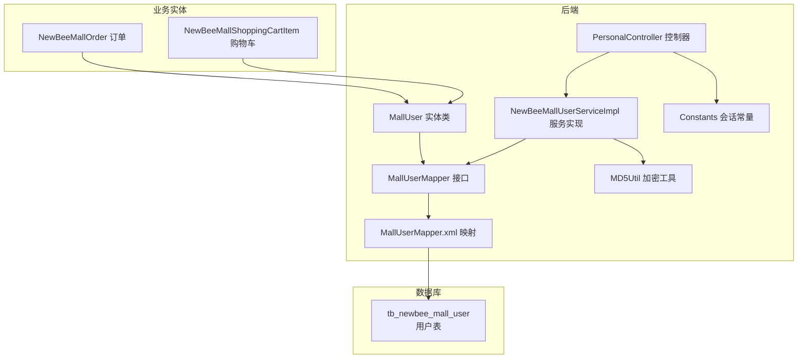
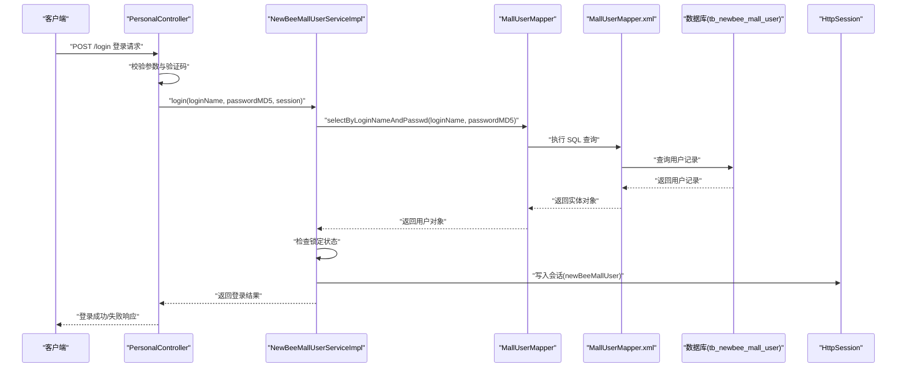
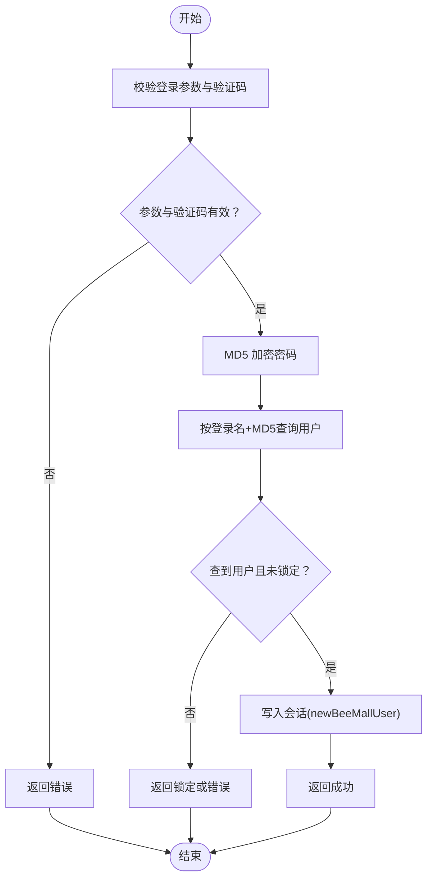
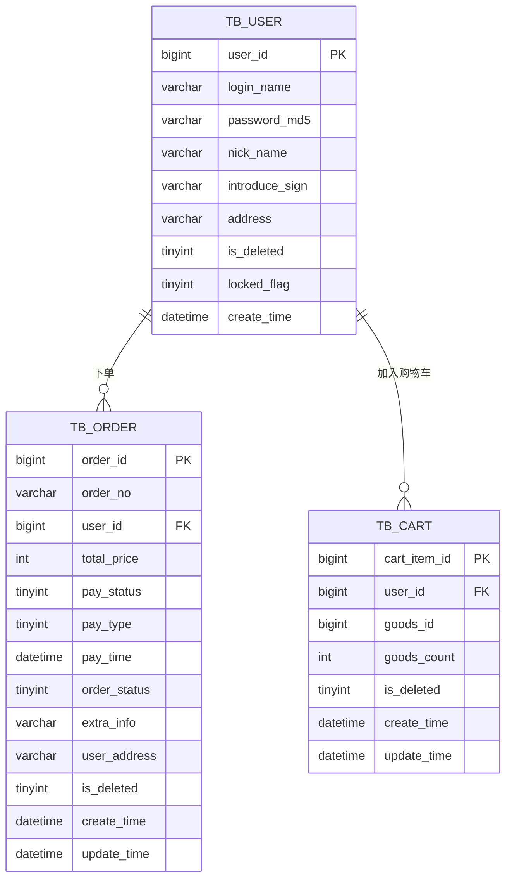
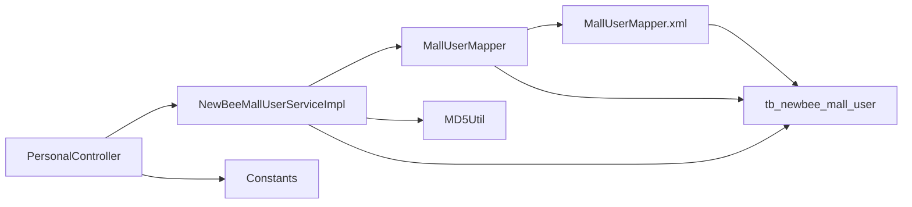

# 用户实体模型

<cite>
**本文引用的文件**
- [newbee_mall_schema.sql](file://src/main/resources/newbee_mall_schema.sql)
- [MallUser.java](file://src/main/java/ltd/newbee/mall/entity/MallUser.java)
- [MallUserMapper.java](file://src/main/java/ltd/newbee/mall/dao/MallUserMapper.java)
- [MallUserMapper.xml](file://src/main/resources/mapper/MallUserMapper.xml)
- [PersonalController.java](file://src/main/java/ltd/newbee/mall/controller/mall/PersonalController.java)
- [NewBeeMallUserServiceImpl.java](file://src/main/java/ltd/newbee/mall/service/impl/NewBeeMallUserServiceImpl.java)
- [MD5Util.java](file://src/main/java/ltd/newbee/mall/util/MD5Util.java)
- [Constants.java](file://src/main/java/ltd/newbee/mall/common/Constants.java)
- [NewBeeMallOrder.java](file://src/main/java/ltd/newbee/mall/entity/NewBeeMallOrder.java)
- [NewBeeMallShoppingCartItem.java](file://src/main/java/ltd/newbee/mall/entity/NewBeeMallShoppingCartItem.java)
</cite>

## 目录
1. [简介](#简介)
2. [项目结构](#项目结构)
3. [核心组件](#核心组件)
4. [架构总览](#架构总览)
5. [详细组件分析](#详细组件分析)
6. [依赖关系分析](#依赖关系分析)
7. [性能考量](#性能考量)
8. [故障排查指南](#故障排查指南)
9. [结论](#结论)

## 简介
本文件围绕 newbee-mall 系统的用户实体模型展开，基于数据库表 tb_newbee_mall_user 的结构设计，结合 Java 实体类 MallUser、MyBatis 映射层 MallUserMapper 与 XML 文件，系统化阐述字段语义、数据类型、约束与索引策略，并覆盖登录认证、会话管理、个人信息更新等安全机制。同时给出用户实体与订单、购物车等业务实体的关系图，帮助读者建立端到端的数据流与控制流认知。

## 项目结构
用户实体模型涉及的核心文件分布如下：
- 数据库表定义：newbee_mall_schema.sql 中的 tb_newbee_mall_user 表
- Java 实体类：MallUser
- MyBatis 映射接口与 XML：MallUserMapper 与 MallUserMapper.xml
- 控制层与服务层：PersonalController、NewBeeMallUserServiceImpl
- 工具类：MD5Util（密码加密）
- 会话常量：Constants（会话键）

图表来源
- [newbee_mall_schema.sql](file://src/main/resources/newbee_mall_schema.sql#L1000-L1024)
- [MallUser.java](file://src/main/java/ltd/newbee/mall/entity/MallUser.java#L1-L125)
- [MallUserMapper.java](file://src/main/java/ltd/newbee/mall/dao/MallUserMapper.java#L1-L39)
- [MallUserMapper.xml](file://src/main/resources/mapper/MallUserMapper.xml#L1-L184)
- [PersonalController.java](file://src/main/java/ltd/newbee/mall/controller/mall/PersonalController.java#L1-L137)
- [NewBeeMallUserServiceImpl.java](file://src/main/java/ltd/newbee/mall/service/impl/NewBeeMallUserServiceImpl.java#L1-L108)
- [MD5Util.java](file://src/main/java/ltd/newbee/mall/util/MD5Util.java#L1-L49)
- [Constants.java](file://src/main/java/ltd/newbee/mall/common/Constants.java#L1-L48)
- [NewBeeMallOrder.java](file://src/main/java/ltd/newbee/mall/entity/NewBeeMallOrder.java#L1-L169)
- [NewBeeMallShoppingCartItem.java](file://src/main/java/ltd/newbee/mall/entity/NewBeeMallShoppingCartItem.java#L1-L100)

章节来源
- [newbee_mall_schema.sql](file://src/main/resources/newbee_mall_schema.sql#L1000-L1024)
- [MallUser.java](file://src/main/java/ltd/newbee/mall/entity/MallUser.java#L1-L125)
- [MallUserMapper.java](file://src/main/java/ltd/newbee/mall/dao/MallUserMapper.java#L1-L39)
- [MallUserMapper.xml](file://src/main/resources/mapper/MallUserMapper.xml#L1-L184)
- [PersonalController.java](file://src/main/java/ltd/newbee/mall/controller/mall/PersonalController.java#L1-L137)
- [NewBeeMallUserServiceImpl.java](file://src/main/java/ltd/newbee/mall/service/impl/NewBeeMallUserServiceImpl.java#L1-L108)
- [MD5Util.java](file://src/main/java/ltd/newbee/mall/util/MD5Util.java#L1-L49)
- [Constants.java](file://src/main/java/ltd/newbee/mall/common/Constants.java#L1-L48)
- [NewBeeMallOrder.java](file://src/main/java/ltd/newbee/mall/entity/NewBeeMallOrder.java#L1-L169)
- [NewBeeMallShoppingCartItem.java](file://src/main/java/ltd/newbee/mall/entity/NewBeeMallShoppingCartItem.java#L1-L100)

## 核心组件
- 数据库表 tb_newbee_mall_user：定义用户主键、登录名、密码（MD5）、昵称、个性签名、地址、注销与锁定标识、注册时间等字段。
- Java 实体类 MallUser：与数据库字段一一对应，提供 getter/setter 与字符串表示。
- MyBatis 映射层：
  - 接口 MallUserMapper：定义按主键、按登录名、按登录名+密码查询，批量锁定、分页查询、插入/更新等方法。
  - XML 映射 MallUserMapper.xml：完成字段映射、SQL 查询与更新逻辑。
- 控制层 PersonalController：处理登录、注册、退出、个人信息更新请求，负责验证码校验与会话写入。
- 服务层 NewBeeMallUserServiceImpl：封装业务逻辑，执行登录校验、注册、更新用户信息、批量锁定等。
- 工具类 MD5Util：提供 MD5 加密工具方法，用于密码加密。
- 常量 Constants：定义会话键与验证码键，统一会话管理。

章节来源
- [newbee_mall_schema.sql](file://src/main/resources/newbee_mall_schema.sql#L1000-L1024)
- [MallUser.java](file://src/main/java/ltd/newbee/mall/entity/MallUser.java#L1-L125)
- [MallUserMapper.java](file://src/main/java/ltd/newbee/mall/dao/MallUserMapper.java#L1-L39)
- [MallUserMapper.xml](file://src/main/resources/mapper/MallUserMapper.xml#L1-L184)
- [PersonalController.java](file://src/main/java/ltd/newbee/mall/controller/mall/PersonalController.java#L1-L137)
- [NewBeeMallUserServiceImpl.java](file://src/main/java/ltd/newbee/mall/service/impl/NewBeeMallUserServiceImpl.java#L1-L108)
- [MD5Util.java](file://src/main/java/ltd/newbee/mall/util/MD5Util.java#L1-L49)
- [Constants.java](file://src/main/java/ltd/newbee/mall/common/Constants.java#L1-L48)

## 架构总览
用户实体模型在系统中的位置与交互如下：

图表来源
- [PersonalController.java](file://src/main/java/ltd/newbee/mall/controller/mall/PersonalController.java#L62-L91)
- [NewBeeMallUserServiceImpl.java](file://src/main/java/ltd/newbee/mall/service/impl/NewBeeMallUserServiceImpl.java#L55-L74)
- [MallUserMapper.java](file://src/main/java/ltd/newbee/mall/dao/MallUserMapper.java#L26-L28)
- [MallUserMapper.xml](file://src/main/resources/mapper/MallUserMapper.xml#L54-L59)
- [Constants.java](file://src/main/java/ltd/newbee/mall/common/Constants.java#L36-L38)

## 详细组件分析

### 数据库表结构与字段语义
- 表名：tb_newbee_mall_user
- 主键：user_id（bigint, 自增）
- 字段与约束：
  - user_id：主键，自增
  - nick_name：varchar(50)，NOT NULL，默认空串
  - login_name：varchar(11)，NOT NULL，默认空串（默认手机号）
  - password_md5：varchar(32)，NOT NULL，默认空串（MD5加密）
  - introduce_sign：varchar(100)，NOT NULL，默认空串
  - address：varchar(100)，NOT NULL，默认空串
  - is_deleted：tinyint(4)，NOT NULL，默认0（0-正常，1-已注销）
  - locked_flag：tinyint(4)，NOT NULL，默认0（0-未锁定，1-已锁定）
  - create_time：datetime，默认CURRENT_TIMESTAMP
- 索引策略：
  - 主键索引：PRIMARY KEY (user_id)
  - 业务常用查询建议：
    - login_name 上建立唯一索引（当前未显式创建，但接口按 login_name 查询，建议补充唯一索引以保证登录名唯一性与查询效率）
    - password_md5 作为查询条件出现在登录校验中，建议在该列建立普通索引以提升登录查询性能（注意：MD5 为固定长度，索引效果较好）
    - is_deleted=0 为软删除过滤条件，可在 login_name/password_md5 查询上联合索引(login_name, is_deleted) 或 (password_md5, is_deleted) 以提升查询效率

章节来源
- [newbee_mall_schema.sql](file://src/main/resources/newbee_mall_schema.sql#L1000-L1024)
- [MallUserMapper.xml](file://src/main/resources/mapper/MallUserMapper.xml#L48-L59)

### Java 实体类 MallUser
- 字段映射：
  - userId -> user_id
  - nickName -> nick_name
  - loginName -> login_name
  - passwordMd5 -> password_md5
  - introduceSign -> introduce_sign
  - address -> address
  - isDeleted -> is_deleted
  - lockedFlag -> locked_flag
  - createTime -> create_time
- 约束与校验：
  - setter 中对字符串字段进行 trim，避免前后空格影响比较与展示
  - createTime 使用 JSON 格式化输出，便于前端展示

章节来源
- [MallUser.java](file://src/main/java/ltd/newbee/mall/entity/MallUser.java#L1-L125)
- [MallUserMapper.xml](file://src/main/resources/mapper/MallUserMapper.xml#L4-L14)

### MyBatis 映射层
- 接口方法概览：
  - selectByPrimaryKey：按主键查询（软删除过滤 is_deleted=0）
  - selectByLoginName：按登录名查询（软删除过滤 is_deleted=0）
  - selectByLoginNameAndPasswd：按登录名+MD5密码查询（软删除过滤 is_deleted=0）
  - insert/insertSelective：插入用户（支持选择性插入）
  - updateByPrimaryKey/updateByPrimaryKeySelective：更新用户（支持选择性更新）
  - findMallUserList/getTotalMallUsers：分页查询用户列表与总数（支持 loginName 条件）
  - lockUserBatch：批量锁定用户（locked_flag 更新）
- XML 映射要点：
  - BaseResultMap 完整映射用户字段
  - Base_Column_List 定义列清单，用于查询与插入
  - 删除采用软删除：deleteByPrimaryKey 实际更新 is_deleted=1
  - 分页查询通过 where 条件拼接与 limit 实现

章节来源
- [MallUserMapper.java](file://src/main/java/ltd/newbee/mall/dao/MallUserMapper.java#L1-L39)
- [MallUserMapper.xml](file://src/main/resources/mapper/MallUserMapper.xml#L1-L184)

### 登录与会话管理
- 登录流程：
  - 控制器 PersonalController 校验登录名、密码、验证码
  - 调用服务层 NewBeeMallUserServiceImpl.login，传入 loginName 与 MD5 加密后的 password
  - 服务层通过 MallUserMapper.selectByLoginNameAndPasswd 查询用户并校验锁定状态
  - 成功后将用户 VO 写入 HttpSession（键为 Constants.MALL_USER_SESSION_KEY）
- 退出流程：
  - 控制器 PersonalController.logout 移除会话键
- 验证码：
  - 登录/注册接口均需校验验证码，验证码保存在 Session 中

图表来源
- [PersonalController.java](file://src/main/java/ltd/newbee/mall/controller/mall/PersonalController.java#L62-L91)
- [NewBeeMallUserServiceImpl.java](file://src/main/java/ltd/newbee/mall/service/impl/NewBeeMallUserServiceImpl.java#L55-L74)
- [MallUserMapper.xml](file://src/main/resources/mapper/MallUserMapper.xml#L54-L59)
- [Constants.java](file://src/main/java/ltd/newbee/mall/common/Constants.java#L36-L38)

章节来源
- [PersonalController.java](file://src/main/java/ltd/newbee/mall/controller/mall/PersonalController.java#L62-L91)
- [NewBeeMallUserServiceImpl.java](file://src/main/java/ltd/newbee/mall/service/impl/NewBeeMallUserServiceImpl.java#L55-L74)
- [MallUserMapper.xml](file://src/main/resources/mapper/MallUserMapper.xml#L54-L59)
- [Constants.java](file://src/main/java/ltd/newbee/mall/common/Constants.java#L36-L38)

### 密码加密存储（MD5）
- 加密流程：
  - 控制器 PersonalController 在登录时对明文密码进行 MD5 加密
  - 服务层 NewBeeMallUserServiceImpl.register 在注册时对明文密码进行 MD5 加密
  - 工具类 MD5Util 提供 MD5Encode 方法，返回小写十六进制字符串
- 安全建议：
  - 当前使用固定长度 MD5 存储，建议引入盐值与更高强度的哈希算法（如 bcrypt、scrypt）以抵御彩虹表与碰撞攻击
  - 对密码字段进行最小权限访问与传输加密

章节来源
- [PersonalController.java](file://src/main/java/ltd/newbee/mall/controller/mall/PersonalController.java#L82-L87)
- [NewBeeMallUserServiceImpl.java](file://src/main/java/ltd/newbee/mall/service/impl/NewBeeMallUserServiceImpl.java#L40-L53)
- [MD5Util.java](file://src/main/java/ltd/newbee/mall/util/MD5Util.java#L1-L49)

### 个人信息更新与安全机制
- 更新入口：
  - 控制器 PersonalController.post("/personal/updateInfo") 接收 MallUser 对象
  - 服务层 NewBeeMallUserServiceImpl.updateUserInfo 从会话中取出用户 ID，查询数据库，清洗并更新字段，再回写会话
- 安全机制：
  - 输入清洗：对昵称、地址、个性签名等字段进行字符串清洗，避免注入与 XSS 风险
  - 会话更新：更新成功后重新写入会话，保证前端展示一致性
  - 软删除：删除用户采用 is_deleted=1 标记，避免物理删除造成数据不可恢复

章节来源
- [PersonalController.java](file://src/main/java/ltd/newbee/mall/controller/mall/PersonalController.java#L123-L135)
- [NewBeeMallUserServiceImpl.java](file://src/main/java/ltd/newbee/mall/service/impl/NewBeeMallUserServiceImpl.java#L77-L98)
- [MallUserMapper.xml](file://src/main/resources/mapper/MallUserMapper.xml#L60-L63)

### 用户实体关系图
用户与订单、购物车的关系如下：

图表来源
- [newbee_mall_schema.sql](file://src/main/resources/newbee_mall_schema.sql#L1000-L1024)
- [NewBeeMallOrder.java](file://src/main/java/ltd/newbee/mall/entity/NewBeeMallOrder.java#L1-L169)
- [NewBeeMallShoppingCartItem.java](file://src/main/java/ltd/newbee/mall/entity/NewBeeMallShoppingCartItem.java#L1-L100)

章节来源
- [newbee_mall_schema.sql](file://src/main/resources/newbee_mall_schema.sql#L1000-L1024)
- [NewBeeMallOrder.java](file://src/main/java/ltd/newbee/mall/entity/NewBeeMallOrder.java#L1-L169)
- [NewBeeMallShoppingCartItem.java](file://src/main/java/ltd/newbee/mall/entity/NewBeeMallShoppingCartItem.java#L1-L100)

## 依赖关系分析
- 控制层依赖服务层，服务层依赖 DAO 接口，DAO 通过 MyBatis XML 映射访问数据库
- 实体类 MallUser 与数据库字段一一对应，映射由 XML 完成
- 登录流程依赖 MD5Util 进行密码加密，会话键由 Constants 统一管理
- 用户与订单、购物车通过 user_id 建立一对多关系

图表来源
- [PersonalController.java](file://src/main/java/ltd/newbee/mall/controller/mall/PersonalController.java#L1-L137)
- [NewBeeMallUserServiceImpl.java](file://src/main/java/ltd/newbee/mall/service/impl/NewBeeMallUserServiceImpl.java#L1-L108)
- [MallUserMapper.java](file://src/main/java/ltd/newbee/mall/dao/MallUserMapper.java#L1-L39)
- [MallUserMapper.xml](file://src/main/resources/mapper/MallUserMapper.xml#L1-L184)
- [MD5Util.java](file://src/main/java/ltd/newbee/mall/util/MD5Util.java#L1-L49)
- [Constants.java](file://src/main/java/ltd/newbee/mall/common/Constants.java#L1-L48)

章节来源
- [PersonalController.java](file://src/main/java/ltd/newbee/mall/controller/mall/PersonalController.java#L1-L137)
- [NewBeeMallUserServiceImpl.java](file://src/main/java/ltd/newbee/mall/service/impl/NewBeeMallUserServiceImpl.java#L1-L108)
- [MallUserMapper.java](file://src/main/java/ltd/newbee/mall/dao/MallUserMapper.java#L1-L39)
- [MallUserMapper.xml](file://src/main/resources/mapper/MallUserMapper.xml#L1-L184)
- [MD5Util.java](file://src/main/java/ltd/newbee/mall/util/MD5Util.java#L1-L49)
- [Constants.java](file://src/main/java/ltd/newbee/mall/common/Constants.java#L1-L48)

## 性能考量
- 索引优化建议：
  - 为 login_name 建立唯一索引，保障登录名唯一性与查询性能
  - 为 password_md5 建立索引，提升登录查询性能
  - 联合索引(login_name, is_deleted)或(password_md5, is_deleted)可进一步优化登录与分页查询
- 查询优化：
  - 分页查询通过 limit 实现，建议结合 where 条件与索引，避免全表扫描
  - 软删除 is_deleted=0 的过滤条件应纳入索引设计
- 缓存与会话：
  - 登录成功后将用户信息写入 Session，避免频繁数据库查询
  - 合理设置 Session 超时，平衡安全性与用户体验

[本节为通用指导，无需代码引用]

## 故障排查指南
- 登录失败：
  - 检查验证码是否正确，确认 Session 中验证码键是否存在
  - 确认 loginName 是否存在且未被锁定
  - 确认密码是否经过 MD5 加密后再提交
- 注册失败：
  - 检查 loginName 是否重复（唯一性约束）
  - 确认数据库插入是否成功
- 个人信息更新失败：
  - 检查会话中用户 ID 是否存在
  - 确认清洗后的字段是否为空或过长
- 数据一致性：
  - 删除用户采用软删除，确保 is_deleted=1 的记录不会参与登录与查询

章节来源
- [PersonalController.java](file://src/main/java/ltd/newbee/mall/controller/mall/PersonalController.java#L62-L135)
- [NewBeeMallUserServiceImpl.java](file://src/main/java/ltd/newbee/mall/service/impl/NewBeeMallUserServiceImpl.java#L40-L98)
- [MallUserMapper.xml](file://src/main/resources/mapper/MallUserMapper.xml#L48-L63)

## 结论
newbee-mall 的用户实体模型以 tb_newbee_mall_user 为核心，通过 MallUser 实体类与 MyBatis 映射层实现了完整的 CRUD 与登录认证能力。系统采用 MD5 对密码进行加密存储，并通过 Session 管理用户会话，结合软删除与输入清洗等安全措施，形成较为完善的用户生命周期管理。建议后续在索引设计、密码加密强度与会话安全方面持续优化，以提升系统性能与安全性。