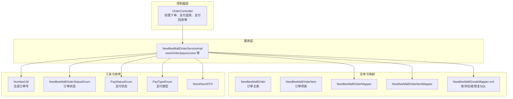
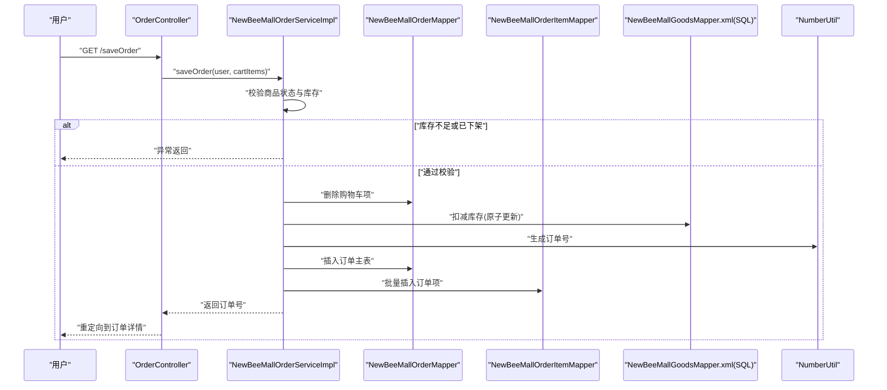
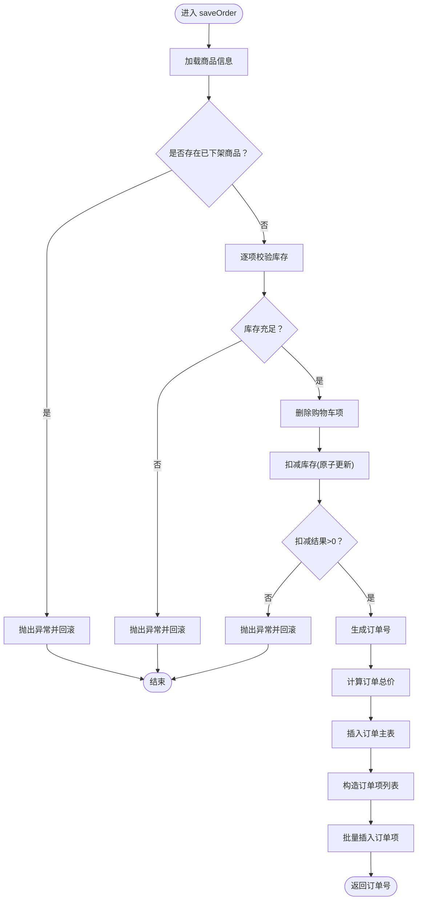
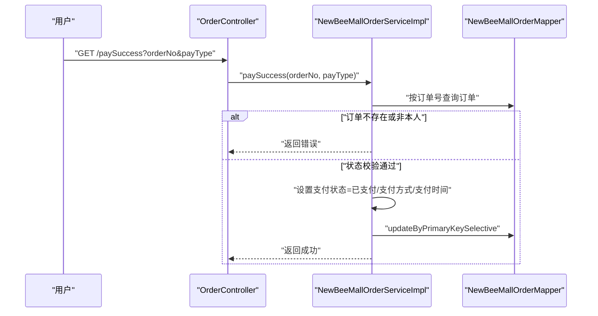
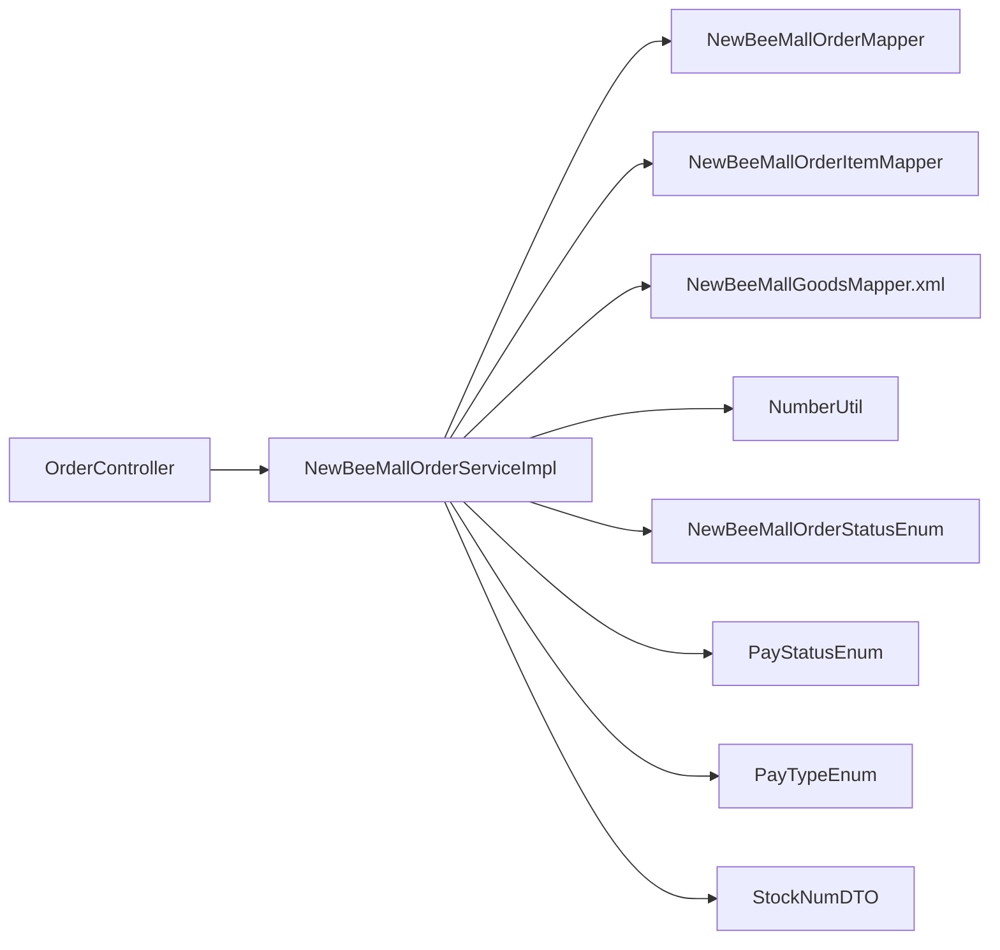

# 订单业务流程

<cite>
**本文引用的文件**
- [NewBeeMallOrderServiceImpl.java](file://src/main/java/ltd/newbee/mall/service/impl/NewBeeMallOrderServiceImpl.java)
- [NewBeeMallOrder.java](file://src/main/java/ltd/newbee/mall/entity/NewBeeMallOrder.java)
- [NewBeeMallOrderItem.java](file://src/main/java/ltd/newbee/mall/entity/NewBeeMallOrderItem.java)
- [NewBeeMallOrderMapper.java](file://src/main/java/ltd/newbee/mall/dao/NewBeeMallOrderMapper.java)
- [NewBeeMallOrderItemMapper.java](file://src/main/java/ltd/newbee/mall/dao/NewBeeMallOrderItemMapper.java)
- [NewBeeMallGoodsMapper.xml](file://src/main/resources/mapper/NewBeeMallGoodsMapper.xml)
- [OrderController.java](file://src/main/java/ltd/newbee/mall/controller/mall/OrderController.java)
- [NumberUtil.java](file://src/main/java/ltd/newbee/mall/util/NumberUtil.java)
- [NewBeeMallOrderStatusEnum.java](file://src/main/java/ltd/newbee/mall/common/NewBeeMallOrderStatusEnum.java)
- [PayStatusEnum.java](file://src/main/java/ltd/newbee/mall/common/PayStatusEnum.java)
- [PayTypeEnum.java](file://src/main/java/ltd/newbee/mall/common/PayTypeEnum.java)
- [StockNumDTO.java](file://src/main/java/ltd/newbee/mall/entity/StockNumDTO.java)
</cite>

## 目录
1. [引言](#引言)
2. [项目结构](#项目结构)
3. [核心组件](#核心组件)
4. [架构总览](#架构总览)
5. [详细组件分析](#详细组件分析)
6. [依赖关系分析](#依赖关系分析)
7. [性能考量](#性能考量)
8. [故障排查指南](#故障排查指南)
9. [结论](#结论)

## 引言
本文件围绕 newbee-mall 的订单业务流程展开，聚焦于从购物车结算到订单生成的完整链路，以及订单支付成功后的处理流程。重点基于 NewBeeMallOrderServiceImpl 类的 saveOrder 方法，梳理以下关键环节：
- 商品状态与库存校验
- 购物车项删除
- 库存扣减
- 唯一订单号生成
- 订单总价计算
- 订单主表与订单项表的持久化
- 事务管理（@Transactional）如何保障一致性
- 库存扣减失败时的回滚机制
- 支付成功后 paySuccess 方法对支付状态、支付方式与支付时间的更新，以及后续配货流程的触发条件

## 项目结构
订单相关代码主要分布在 service 层、controller 层、entity 与 dao 层，以及通用枚举与工具类中。整体采用分层架构：
- 控制器层负责接收请求、参数校验与页面跳转
- 服务层负责业务编排与事务控制
- 实体与映射层负责订单与订单项的数据模型与持久化
- 工具与枚举提供订单号生成、状态与支付类型定义



图表来源
- [OrderController.java](file://src/main/java/ltd/newbee/mall/controller/mall/OrderController.java#L66-L83)
- [NewBeeMallOrderServiceImpl.java](file://src/main/java/ltd/newbee/mall/service/impl/NewBeeMallOrderServiceImpl.java#L186-L263)
- [NewBeeMallOrderMapper.java](file://src/main/java/ltd/newbee/mall/dao/NewBeeMallOrderMapper.java#L17-L43)
- [NewBeeMallOrderItemMapper.java](file://src/main/java/ltd/newbee/mall/dao/NewBeeMallOrderItemMapper.java#L16-L52)
- [NewBeeMallGoodsMapper.xml](file://src/main/resources/mapper/NewBeeMallGoodsMapper.xml#L59-L70)
- [NumberUtil.java](file://src/main/java/ltd/newbee/mall/util/NumberUtil.java#L53-L58)
- [NewBeeMallOrderStatusEnum.java](file://src/main/java/ltd/newbee/mall/common/NewBeeMallOrderStatusEnum.java#L18-L30)
- [PayStatusEnum.java](file://src/main/java/ltd/newbee/mall/common/PayStatusEnum.java#L18-L24)
- [PayTypeEnum.java](file://src/main/java/ltd/newbee/mall/common/PayTypeEnum.java#L18-L24)
- [StockNumDTO.java](file://src/main/java/ltd/newbee/mall/entity/StockNumDTO.java#L14-L34)

章节来源
- [OrderController.java](file://src/main/java/ltd/newbee/mall/controller/mall/OrderController.java#L66-L83)
- [NewBeeMallOrderServiceImpl.java](file://src/main/java/ltd/newbee/mall/service/impl/NewBeeMallOrderServiceImpl.java#L186-L263)

## 核心组件
- NewBeeMallOrderServiceImpl：订单业务的核心实现，包含 saveOrder、paySuccess、取消/关闭/完成订单等方法；其中 saveOrder 使用 @Transactional 保证下单全流程原子性。
- NewBeeMallOrder / NewBeeMallOrderItem：订单主表与订单项表的实体模型，承载订单号、用户地址、支付状态、支付方式、支付时间、订单状态、商品名称与数量等字段。
- NewBeeMallOrderMapper / NewBeeMallOrderItemMapper：订单与订单项的持久化接口，提供插入、批量插入、按条件查询与状态变更等能力。
- NewBeeMallGoodsMapper.xml：库存扣减与恢复的 SQL 实现，支持按商品 ID 与库存数量进行原子性更新。
- OrderController：前端入口，负责从购物车取数据、调用服务层下单、支付选择与支付回调。
- NumberUtil：生成唯一订单号。
- NewBeeMallOrderStatusEnum / PayStatusEnum / PayTypeEnum：订单状态、支付状态与支付类型的枚举定义。
- StockNumDTO：库存扣减/恢复所需的 DTO。

章节来源
- [NewBeeMallOrderServiceImpl.java](file://src/main/java/ltd/newbee/mall/service/impl/NewBeeMallOrderServiceImpl.java#L186-L263)
- [NewBeeMallOrder.java](file://src/main/java/ltd/newbee/mall/entity/NewBeeMallOrder.java#L16-L169)
- [NewBeeMallOrderItem.java](file://src/main/java/ltd/newbee/mall/entity/NewBeeMallOrderItem.java#L14-L111)
- [NewBeeMallOrderMapper.java](file://src/main/java/ltd/newbee/mall/dao/NewBeeMallOrderMapper.java#L17-L43)
- [NewBeeMallOrderItemMapper.java](file://src/main/java/ltd/newbee/mall/dao/NewBeeMallOrderItemMapper.java#L16-L52)
- [NewBeeMallGoodsMapper.xml](file://src/main/resources/mapper/NewBeeMallGoodsMapper.xml#L59-L70)
- [OrderController.java](file://src/main/java/ltd/newbee/mall/controller/mall/OrderController.java#L66-L83)
- [NumberUtil.java](file://src/main/java/ltd/newbee/mall/util/NumberUtil.java#L53-L58)
- [NewBeeMallOrderStatusEnum.java](file://src/main/java/ltd/newbee/mall/common/NewBeeMallOrderStatusEnum.java#L18-L30)
- [PayStatusEnum.java](file://src/main/java/ltd/newbee/mall/common/PayStatusEnum.java#L18-L24)
- [PayTypeEnum.java](file://src/main/java/ltd/newbee/mall/common/PayTypeEnum.java#L18-L24)
- [StockNumDTO.java](file://src/main/java/ltd/newbee/mall/entity/StockNumDTO.java#L14-L34)

## 架构总览
下面以序列图展示“从购物车结算到订单生成”的端到端流程，以及“支付成功后”的状态流转。



图表来源
- [OrderController.java](file://src/main/java/ltd/newbee/mall/controller/mall/OrderController.java#L66-L83)
- [NewBeeMallOrderServiceImpl.java](file://src/main/java/ltd/newbee/mall/service/impl/NewBeeMallOrderServiceImpl.java#L186-L263)
- [NewBeeMallOrderMapper.java](file://src/main/java/ltd/newbee/mall/dao/NewBeeMallOrderMapper.java#L17-L43)
- [NewBeeMallOrderItemMapper.java](file://src/main/java/ltd/newbee/mall/dao/NewBeeMallOrderItemMapper.java#L16-L52)
- [NewBeeMallGoodsMapper.xml](file://src/main/resources/mapper/NewBeeMallGoodsMapper.xml#L59-L70)
- [NumberUtil.java](file://src/main/java/ltd/newbee/mall/util/NumberUtil.java#L53-L58)

## 详细组件分析

### 组件A：订单创建流程（saveOrder）
- 入口与职责
  - 由 OrderController 触发，从购物车获取用户选中的商品集合，调用服务层下单。
  - 服务层在 @Transactional 作用域内执行，确保下单过程的原子性。
- 关键步骤
  1) 校验商品状态与库存
     - 读取商品列表，过滤“已下架”商品，若有则抛出异常。
     - 对每件商品检查购买数量是否超过库存，超限则抛出异常。
  2) 删除购物车项
     - 批量删除购物车中被结算的商品项。
  3) 扣减商品库存
     - 将购物车项转换为 StockNumDTO 列表，调用 GoodsMapper 的 updateStockNum 执行原子扣减。
     - SQL 中包含“库存必须大于等于扣减数量”与“商品状态为上架”的条件，确保扣减安全。
  4) 生成唯一订单号
     - 使用 NumberUtil.genOrderNo 生成订单号。
  5) 计算订单总价
     - 遍历购物车项，单价×数量累加，得到总价。
  6) 保存订单主表与订单项表
     - 插入订单主表，利用 MyBatis 的自增主键回填获取 orderId。
     - 构造订单项列表，批量插入订单项表。
  7) 返回订单号
     - 成功后返回订单号，控制器据此跳转到订单详情页。
- 事务与回滚
  - saveOrder 方法标注 @Transactional，任何一步失败（如库存扣减返回小于1、插入失败、价格异常等）将触发回滚，确保数据一致性。
  - 若库存扣减失败（updateStockNum 返回小于1），服务层抛出异常，事务回滚，购物车项不会被删除，库存也不会被扣减。
- 失败路径与异常
  - 已下架商品、库存不足、购物车为空、订单总价异常、数据库写入失败等均会触发异常并回滚。



图表来源
- [NewBeeMallOrderServiceImpl.java](file://src/main/java/ltd/newbee/mall/service/impl/NewBeeMallOrderServiceImpl.java#L186-L263)
- [NewBeeMallGoodsMapper.xml](file://src/main/resources/mapper/NewBeeMallGoodsMapper.xml#L59-L70)
- [NumberUtil.java](file://src/main/java/ltd/newbee/mall/util/NumberUtil.java#L53-L58)

章节来源
- [OrderController.java](file://src/main/java/ltd/newbee/mall/controller/mall/OrderController.java#L66-L83)
- [NewBeeMallOrderServiceImpl.java](file://src/main/java/ltd/newbee/mall/service/impl/NewBeeMallOrderServiceImpl.java#L186-L263)
- [NewBeeMallGoodsMapper.xml](file://src/main/resources/mapper/NewBeeMallGoodsMapper.xml#L59-L70)
- [NumberUtil.java](file://src/main/java/ltd/newbee/mall/util/NumberUtil.java#L53-L58)

### 组件B：订单支付成功流程（paySuccess）
- 入口与职责
  - OrderController 提供 /paySuccess 接口，调用服务层 paySuccess 完成支付状态更新。
- 关键步骤
  1) 查询订单并校验权限
     - 根据订单号查询订单，校验订单归属用户。
  2) 校验订单状态
     - 仅允许“待支付”状态的订单执行支付成功更新。
  3) 更新支付状态与信息
     - 设置订单状态为“已支付”
     - 设置支付方式与支付状态为“支付成功”
     - 设置支付时间为当前时间
     - 更新时间同步更新
  4) 写入数据库
     - 通过 OrderMapper.updateByPrimaryKeySelective 更新记录。
- 后续配货流程
  - 服务层未在此处直接触发配货流程；但根据订单状态枚举，支付成功后可继续流转到“配货完成”“出库成功”“交易成功”等阶段，具体由后台管理操作或后续业务逻辑触发。



图表来源
- [OrderController.java](file://src/main/java/ltd/newbee/mall/controller/mall/OrderController.java#L147-L156)
- [NewBeeMallOrderServiceImpl.java](file://src/main/java/ltd/newbee/mall/service/impl/NewBeeMallOrderServiceImpl.java#L375-L394)
- [NewBeeMallOrderMapper.java](file://src/main/java/ltd/newbee/mall/dao/NewBeeMallOrderMapper.java#L17-L43)

章节来源
- [OrderController.java](file://src/main/java/ltd/newbee/mall/controller/mall/OrderController.java#L147-L156)
- [NewBeeMallOrderServiceImpl.java](file://src/main/java/ltd/newbee/mall/service/impl/NewBeeMallOrderServiceImpl.java#L375-L394)
- [NewBeeMallOrderStatusEnum.java](file://src/main/java/ltd/newbee/mall/common/NewBeeMallOrderStatusEnum.java#L18-L30)
- [PayStatusEnum.java](file://src/main/java/ltd/newbee/mall/common/PayStatusEnum.java#L18-L24)
- [PayTypeEnum.java](file://src/main/java/ltd/newbee/mall/common/PayTypeEnum.java#L18-L24)

### 组件C：数据模型与DAO
- 订单主表 NewBeeMallOrder
  - 字段包含订单号、用户ID、总价、支付状态、支付方式、支付时间、订单状态、用户地址、创建/更新时间等。
- 订单项表 NewBeeMallOrderItem
  - 字段包含订单项ID、订单ID、商品ID、商品名称、封面图、销售价、购买数量、创建时间等。
- DAO 接口
  - NewBeeMallOrderMapper：提供按主键/订单号查询、分页查询、状态变更（出库、关闭、配货完成）、更新等。
  - NewBeeMallOrderItemMapper：提供按订单ID/IDs查询、批量插入等。
- SQL 实现
  - NewBeeMallGoodsMapper.xml 的 updateStockNum/recoverStockNum 使用 foreach 循环对多个商品进行原子扣减/恢复，包含“库存≥扣减数量”“商品状态为上架”的条件，避免超卖与对下架商品的误扣减。

```mermaid
classDiagram
class NewBeeMallOrder {
+Long orderId
+String orderNo
+Long userId
+Integer totalPrice
+Byte payStatus
+Byte payType
+Date payTime
+Byte orderStatus
+String userAddress
+Date createTime
+Date updateTime
}
class NewBeeMallOrderItem {
+Long orderItemId
+Long orderId
+Long goodsId
+String goodsName
+String goodsCoverImg
+Integer sellingPrice
+Integer goodsCount
+Date createTime
}
class NewBeeMallOrderMapper {
+selectByOrderNo(orderNo)
+updateByPrimaryKeySelective(record)
+checkOut(orderIds)
+closeOrder(orderIds, orderStatus)
+checkDone(orderIds)
}
class NewBeeMallOrderItemMapper {
+selectByOrderId(orderId)
+selectByOrderIds(orderIds)
+insertBatch(orderItems)
}
class NewBeeMallGoodsMapper_xml {
+updateStockNum(stockNumDTOS)
+recoverStockNum(stockNumDTOS)
}
NewBeeMallOrderItem --> NewBeeMallOrder : "外键 : orderId"
NewBeeMallOrderMapper --> NewBeeMallOrder : "持久化"
NewBeeMallOrderItemMapper --> NewBeeMallOrderItem : "持久化"
NewBeeMallGoodsMapper_xml --> NewBeeMallOrderItem : "库存扣减/恢复"
```

图表来源
- [NewBeeMallOrder.java](file://src/main/java/ltd/newbee/mall/entity/NewBeeMallOrder.java#L16-L169)
- [NewBeeMallOrderItem.java](file://src/main/java/ltd/newbee/mall/entity/NewBeeMallOrderItem.java#L14-L111)
- [NewBeeMallOrderMapper.java](file://src/main/java/ltd/newbee/mall/dao/NewBeeMallOrderMapper.java#L17-L43)
- [NewBeeMallOrderItemMapper.java](file://src/main/java/ltd/newbee/mall/dao/NewBeeMallOrderItemMapper.java#L16-L52)
- [NewBeeMallGoodsMapper.xml](file://src/main/resources/mapper/NewBeeMallGoodsMapper.xml#L59-L70)

章节来源
- [NewBeeMallOrder.java](file://src/main/java/ltd/newbee/mall/entity/NewBeeMallOrder.java#L16-L169)
- [NewBeeMallOrderItem.java](file://src/main/java/ltd/newbee/mall/entity/NewBeeMallOrderItem.java#L14-L111)
- [NewBeeMallOrderMapper.java](file://src/main/java/ltd/newbee/mall/dao/NewBeeMallOrderMapper.java#L17-L43)
- [NewBeeMallOrderItemMapper.java](file://src/main/java/ltd/newbee/mall/dao/NewBeeMallOrderItemMapper.java#L16-L52)
- [NewBeeMallGoodsMapper.xml](file://src/main/resources/mapper/NewBeeMallGoodsMapper.xml#L59-L70)

## 依赖关系分析
- 控制器依赖服务层：OrderController 在下单与支付回调场景中调用 NewBeeMallOrderService。
- 服务层依赖 DAO 与工具：NewBeeMallOrderServiceImpl 依赖 NewBeeMallOrderMapper、NewBeeMallOrderItemMapper、NewBeeMallGoodsMapper.xml、NumberUtil、状态与支付枚举。
- 数据一致性依赖事务：saveOrder 使用 @Transactional，确保库存扣减、订单主表与订单项表的写入在同一个事务中，任一步失败即回滚。
- 库存安全依赖 SQL 条件：updateStockNum/recoverStockNum 包含“库存≥扣减数量”“商品状态为上架”，防止超卖与对下架商品的误操作。



图表来源
- [OrderController.java](file://src/main/java/ltd/newbee/mall/controller/mall/OrderController.java#L66-L83)
- [NewBeeMallOrderServiceImpl.java](file://src/main/java/ltd/newbee/mall/service/impl/NewBeeMallOrderServiceImpl.java#L186-L263)
- [NewBeeMallOrderMapper.java](file://src/main/java/ltd/newbee/mall/dao/NewBeeMallOrderMapper.java#L17-L43)
- [NewBeeMallOrderItemMapper.java](file://src/main/java/ltd/newbee/mall/dao/NewBeeMallOrderItemMapper.java#L16-L52)
- [NewBeeMallGoodsMapper.xml](file://src/main/resources/mapper/NewBeeMallGoodsMapper.xml#L59-L70)
- [NumberUtil.java](file://src/main/java/ltd/newbee/mall/util/NumberUtil.java#L53-L58)
- [NewBeeMallOrderStatusEnum.java](file://src/main/java/ltd/newbee/mall/common/NewBeeMallOrderStatusEnum.java#L18-L30)
- [PayStatusEnum.java](file://src/main/java/ltd/newbee/mall/common/PayStatusEnum.java#L18-L24)
- [PayTypeEnum.java](file://src/main/java/ltd/newbee/mall/common/PayTypeEnum.java#L18-L24)
- [StockNumDTO.java](file://src/main/java/ltd/newbee/mall/entity/StockNumDTO.java#L14-L34)

章节来源
- [OrderController.java](file://src/main/java/ltd/newbee/mall/controller/mall/OrderController.java#L66-L83)
- [NewBeeMallOrderServiceImpl.java](file://src/main/java/ltd/newbee/mall/service/impl/NewBeeMallOrderServiceImpl.java#L186-L263)

## 性能考量
- 批量操作
  - 购物车项删除与订单项批量插入均采用批量接口，减少多次往返数据库的开销。
- 原子扣减
  - 库存扣减使用 foreach 循环并在 SQL 中加入“库存≥扣减数量”与“商品状态为上架”的条件，避免超卖与无效更新。
- 事务范围
  - saveOrder 使用 @Transactional，将多步写入置于同一事务中，降低并发冲突导致的数据不一致风险。
- 订单号生成
  - NumberUtil.genOrderNo 基于时间戳与随机数拼接，具备高并发下的唯一性保障。

[本节为通用性能建议，不直接分析具体文件]

## 故障排查指南
- 下单失败（已下架商品）
  - 现象：下单接口返回异常。
  - 原因：saveOrder 校验发现商品状态非“上架”，抛出异常。
  - 处理：确认商品状态，修正后再试。
- 下单失败（库存不足）
  - 现象：下单接口返回异常。
  - 原因：购买数量超过库存，扣减 SQL 不满足“库存≥扣减数量”条件，返回小于1。
  - 处理：减少购买数量或补货后重试。
- 下单失败（购物车为空或数据异常）
  - 现象：下单接口返回异常。
  - 原因：购物车为空或商品ID不在数据库中。
  - 处理：检查购物车数据与商品ID有效性。
- 支付成功更新失败
  - 现象：/paySuccess 返回失败。
  - 原因：订单不存在、非本人订单、订单状态非“待支付”。
  - 处理：核对订单号、用户身份与订单状态。
- 回滚问题
  - 现象：库存扣减失败导致事务回滚。
  - 原因：扣减 SQL 条件不满足或数据库写入异常。
  - 处理：检查库存数据、商品状态与数据库连接；必要时重试或人工干预。

章节来源
- [NewBeeMallOrderServiceImpl.java](file://src/main/java/ltd/newbee/mall/service/impl/NewBeeMallOrderServiceImpl.java#L186-L263)
- [OrderController.java](file://src/main/java/ltd/newbee/mall/controller/mall/OrderController.java#L147-L156)

## 结论
newbee-mall 的订单业务通过清晰的分层设计与严格的事务控制，实现了从购物车结算到订单生成的可靠流程，并通过 SQL 条件保障库存安全。支付成功后，服务层更新订单的支付状态与时间，为后续配货与出库流程奠定基础。建议在高并发场景下关注库存扣减的原子性与事务边界，确保数据一致性与用户体验。