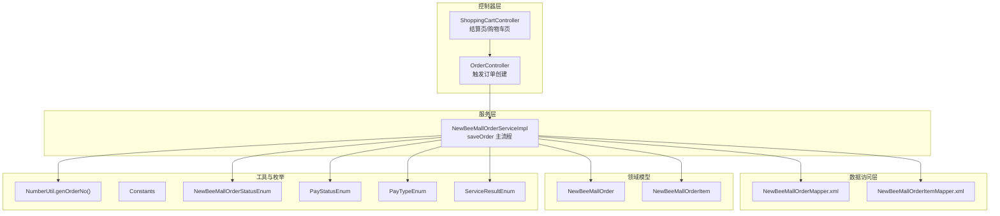
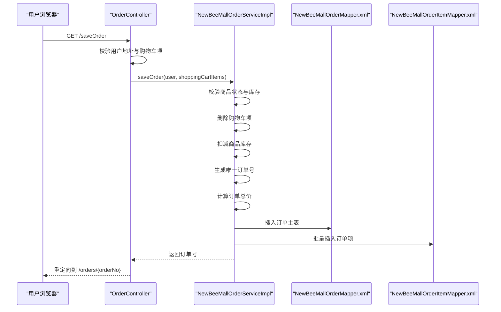
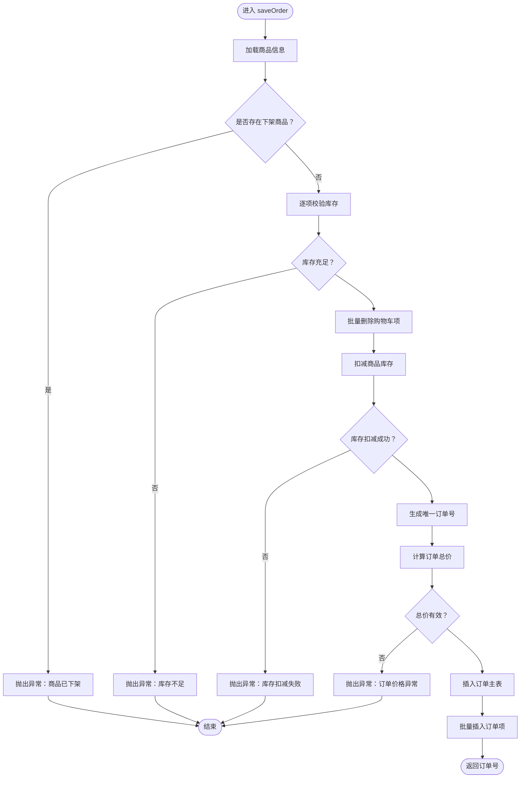
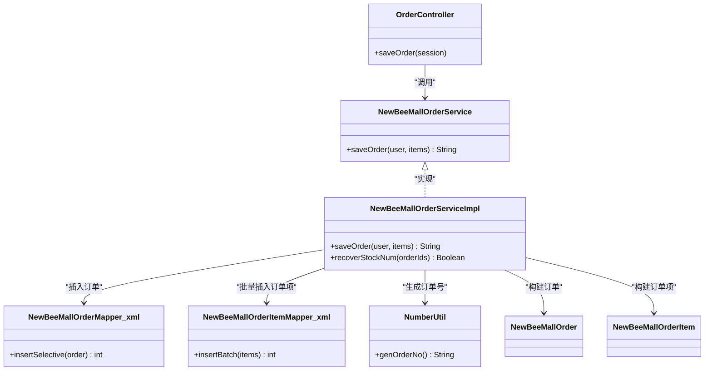

# 订单创建流程

<cite>
**本文引用的文件**
- [NewBeeMallOrderServiceImpl.java](file://src/main/java/ltd/newbee/mall/service/impl/NewBeeMallOrderServiceImpl.java)
- [OrderController.java](file://src/main/java/ltd/newbee/mall/controller/mall/OrderController.java)
- [ShoppingCartController.java](file://src/main/java/ltd/newbee/mall/controller/mall/ShoppingCartController.java)
- [NewBeeMallOrder.java](file://src/main/java/ltd/newbee/mall/entity/NewBeeMallOrder.java)
- [NewBeeMallOrderItem.java](file://src/main/java/ltd/newbee/mall/entity/NewBeeMallOrderItem.java)
- [NewBeeMallOrderService.java](file://src/main/java/ltd/newbee/mall/service/NewBeeMallOrderService.java)
- [Constants.java](file://src/main/java/ltd/newbee/mall/common/Constants.java)
- [NumberUtil.java](file://src/main/java/ltd/newbee/mall/util/NumberUtil.java)
- [NewBeeMallOrderMapper.xml](file://src/main/resources/mapper/NewBeeMallOrderMapper.xml)
- [NewBeeMallOrderItemMapper.xml](file://src/main/resources/mapper/NewBeeMallOrderItemMapper.xml)
- [NewBeeMallOrderStatusEnum.java](file://src/main/java/ltd/newbee/mall/common/NewBeeMallOrderStatusEnum.java)
- [PayStatusEnum.java](file://src/main/java/ltd/newbee/mall/common/PayStatusEnum.java)
- [PayTypeEnum.java](file://src/main/java/ltd/newbee/mall/common/PayTypeEnum.java)
- [ServiceResultEnum.java](file://src/main/java/ltd/newbee/mall/common/ServiceResultEnum.java)
</cite>

## 目录
1. [引言](#引言)
2. [项目结构](#项目结构)
3. [核心组件](#核心组件)
4. [架构总览](#架构总览)
5. [详细组件分析](#详细组件分析)
6. [依赖关系分析](#依赖关系分析)
7. [性能考量](#性能考量)
8. [故障排查指南](#故障排查指南)
9. [结论](#结论)

## 引言
本文围绕 NewBeeMall 系统“订单创建”流程展开，聚焦于从购物车结算到订单生成的完整链路。基于服务层实现类 NewBeeMallOrderServiceImpl 的 saveOrder 方法，系统在一次事务中完成以下关键步骤：
- 校验商品状态与库存
- 删除购物车项
- 扣减商品库存
- 生成唯一订单号
- 计算订单总价
- 保存订单主表与订单项表

同时，本文将解释事务注解 @Transactional 如何确保数据一致性，以及在库存扣减失败时的回滚机制；并结合 OrderController 中的相关方法，说明前端请求如何触发订单创建流程，展示参数传递与异常处理机制。

## 项目结构
与订单创建流程直接相关的模块与文件如下：
- 控制器层：OrderController（触发订单创建）、ShoppingCartController（提供结算页面）
- 服务层：NewBeeMallOrderServiceImpl（核心业务逻辑）
- 数据访问层：NewBeeMallOrderMapper.xml、NewBeeMallOrderItemMapper.xml
- 实体模型：NewBeeMallOrder、NewBeeMallOrderItem
- 工具与常量：NumberUtil（生成订单号）、Constants（常量定义）
- 枚举：NewBeeMallOrderStatusEnum、PayStatusEnum、PayTypeEnum
- 结果枚举：ServiceResultEnum（统一错误码）

图表来源
- [OrderController.java](file://src/main/java/ltd/newbee/mall/controller/mall/OrderController.java#L67-L83)
- [ShoppingCartController.java](file://src/main/java/ltd/newbee/mall/controller/mall/ShoppingCartController.java#L107-L128)
- [NewBeeMallOrderServiceImpl.java](file://src/main/java/ltd/newbee/mall/service/impl/NewBeeMallOrderServiceImpl.java#L185-L263)
- [NewBeeMallOrderMapper.xml](file://src/main/resources/mapper/NewBeeMallOrderMapper.xml#L119-L160)
- [NewBeeMallOrderItemMapper.xml](file://src/main/resources/mapper/NewBeeMallOrderItemMapper.xml#L44-L55)
- [NumberUtil.java](file://src/main/java/ltd/newbee/mall/util/NumberUtil.java#L53-L58)
- [NewBeeMallOrderStatusEnum.java](file://src/main/java/ltd/newbee/mall/common/NewBeeMallOrderStatusEnum.java#L18-L30)
- [PayStatusEnum.java](file://src/main/java/ltd/newbee/mall/common/PayStatusEnum.java#L18-L24)
- [PayTypeEnum.java](file://src/main/java/ltd/newbee/mall/common/PayTypeEnum.java#L18-L24)
- [ServiceResultEnum.java](file://src/main/java/ltd/newbee/mall/common/ServiceResultEnum.java#L17-L77)

章节来源
- [OrderController.java](file://src/main/java/ltd/newbee/mall/controller/mall/OrderController.java#L67-L83)
- [ShoppingCartController.java](file://src/main/java/ltd/newbee/mall/controller/mall/ShoppingCartController.java#L107-L128)
- [NewBeeMallOrderServiceImpl.java](file://src/main/java/ltd/newbee/mall/service/impl/NewBeeMallOrderServiceImpl.java#L185-L263)

## 核心组件
- 订单服务接口 NewBeeMallOrderService：定义 saveOrder 等订单相关能力。
- 订单服务实现 NewBeeMallOrderServiceImpl：实现 saveOrder 主流程，包含事务控制、库存校验与扣减、订单号生成、订单与订单项持久化等。
- 订单控制器 OrderController：提供 /saveOrder 接口，从会话中读取用户与购物车数据，调用服务层创建订单。
- 购物车控制器 ShoppingCartController：提供结算页 /shop-cart/settle，用于进入订单创建前的准备阶段。
- MyBatis 映射：NewBeeMallOrderMapper.xml、NewBeeMallOrderItemMapper.xml 完成订单与订单项的插入与批量插入。
- 实体模型：NewBeeMallOrder、NewBeeMallOrderItem。
- 工具与枚举：NumberUtil.genOrderNo、枚举状态与支付类型、统一结果枚举 ServiceResultEnum。

章节来源
- [NewBeeMallOrderService.java](file://src/main/java/ltd/newbee/mall/service/NewBeeMallOrderService.java#L62-L68)
- [NewBeeMallOrderServiceImpl.java](file://src/main/java/ltd/newbee/mall/service/impl/NewBeeMallOrderServiceImpl.java#L185-L263)
- [OrderController.java](file://src/main/java/ltd/newbee/mall/controller/mall/OrderController.java#L67-L83)
- [ShoppingCartController.java](file://src/main/java/ltd/newbee/mall/controller/mall/ShoppingCartController.java#L107-L128)
- [NewBeeMallOrderMapper.xml](file://src/main/resources/mapper/NewBeeMallOrderMapper.xml#L119-L160)
- [NewBeeMallOrderItemMapper.xml](file://src/main/resources/mapper/NewBeeMallOrderItemMapper.xml#L44-L55)
- [NumberUtil.java](file://src/main/java/ltd/newbee/mall/util/NumberUtil.java#L53-L58)

## 架构总览
订单创建采用典型的 MVC 分层架构：
- 控制器接收请求，组装参数（用户会话、购物车项），调用服务层。
- 服务层在单个事务内执行业务规则与数据持久化。
- 数据访问层通过 MyBatis 执行 SQL 插入订单与订单项。
- 枚举与工具类贯穿流程，保证状态一致与订单号唯一性。

图表来源
- [OrderController.java](file://src/main/java/ltd/newbee/mall/controller/mall/OrderController.java#L67-L83)
- [NewBeeMallOrderServiceImpl.java](file://src/main/java/ltd/newbee/mall/service/impl/NewBeeMallOrderServiceImpl.java#L185-L263)
- [NewBeeMallOrderMapper.xml](file://src/main/resources/mapper/NewBeeMallOrderMapper.xml#L119-L160)
- [NewBeeMallOrderItemMapper.xml](file://src/main/resources/mapper/NewBeeMallOrderItemMapper.xml#L44-L55)

## 详细组件分析

### 服务层 saveOrder 主流程
- 入参：用户会话对象 NewBeeMallUserVO、购物车项集合 NewBeeMallShoppingCartItemVO 列表。
- 关键步骤：
  1) 商品状态与库存校验：按商品 ID 查询商品，过滤下架商品；对每条购物车项检查库存是否充足。
  2) 删除购物车项：批量删除已结算的购物车项。
  3) 扣减库存：将购物车项映射为 StockNumDTO，调用商品库存更新接口扣减。
  4) 生成订单号：使用 NumberUtil.genOrderNo 生成唯一订单号。
  5) 计算订单总价：遍历购物车项，单价×数量求和，校验总价有效性。
  6) 保存订单主表：插入 NewBeeMallOrder，使用 MyBatis 的 useGeneratedKeys 回填主键。
  7) 生成订单项快照并保存：将购物车项复制为订单项实体，设置 orderId，批量插入 NewBeeMallOrderItem。
- 异常处理：任一步骤失败均抛出 NewBeeMallException，由全局异常处理捕获并返回统一错误码。

图表来源
- [NewBeeMallOrderServiceImpl.java](file://src/main/java/ltd/newbee/mall/service/impl/NewBeeMallOrderServiceImpl.java#L185-L263)
- [NumberUtil.java](file://src/main/java/ltd/newbee/mall/util/NumberUtil.java#L53-L58)
- [NewBeeMallOrderMapper.xml](file://src/main/resources/mapper/NewBeeMallOrderMapper.xml#L119-L160)
- [NewBeeMallOrderItemMapper.xml](file://src/main/resources/mapper/NewBeeMallOrderItemMapper.xml#L44-L55)

章节来源
- [NewBeeMallOrderServiceImpl.java](file://src/main/java/ltd/newbee/mall/service/impl/NewBeeMallOrderServiceImpl.java#L185-L263)

### 事务管理与回滚机制
- 事务注解：saveOrder 方法标注 @Transactional，确保整个订单创建过程处于同一数据库事务中。
- 回滚条件：当库存扣减失败、订单插入失败、订单项批量插入失败或任何前置校验失败时，抛出异常，Spring 基于默认异常策略触发回滚，保证数据一致性。
- 恢复库存：服务层提供 recoverStockNum 方法，用于在关闭/取消订单等场景恢复库存，其内部同样使用事务保障原子性。

章节来源
- [NewBeeMallOrderServiceImpl.java](file://src/main/java/ltd/newbee/mall/service/impl/NewBeeMallOrderServiceImpl.java#L185-L263)
- [NewBeeMallOrderServiceImpl.java](file://src/main/java/ltd/newbee/mall/service/impl/NewBeeMallOrderServiceImpl.java#L410-L429)

### 前端触发与参数传递
- 触发入口：GET /saveOrder，控制器从会话中读取用户信息与购物车项，校验地址与购物车非空后调用服务层 saveOrder。
- 参数来源：
  - 用户会话：Constants.MALL_USER_SESSION_KEY 存储 NewBeeMallUserVO。
  - 购物车项：NewBeeMallShoppingCartService.getMyShoppingCartItems(user.getUserId())。
- 返回与跳转：服务层返回订单号，控制器重定向到 /orders/{orderNo} 展示订单详情。

章节来源
- [OrderController.java](file://src/main/java/ltd/newbee/mall/controller/mall/OrderController.java#L67-L83)
- [Constants.java](file://src/main/java/ltd/newbee/mall/common/Constants.java#L36-L42)

### 订单与订单项模型
- NewBeeMallOrder：订单主表，包含订单号、用户 ID、总价、支付状态/类型、订单状态、地址、创建/更新时间等。
- NewBeeMallOrderItem：订单项明细，包含订单 ID、商品 ID/名称/封面、销售价、数量等。

章节来源
- [NewBeeMallOrder.java](file://src/main/java/ltd/newbee/mall/entity/NewBeeMallOrder.java#L16-L169)
- [NewBeeMallOrderItem.java](file://src/main/java/ltd/newbee/mall/entity/NewBeeMallOrderItem.java#L14-L111)

### 订单号生成与状态枚举
- 订单号生成：NumberUtil.genOrderNo 使用当前时间戳与随机数拼接生成唯一订单号。
- 订单状态：NewBeeMallOrderStatusEnum 定义待支付、已支付、配货完成、出库成功、交易成功、手动关闭、超时关闭、商家关闭等状态。
- 支付状态与类型：PayStatusEnum、PayTypeEnum 提供支付中/成功与支付方式枚举。

章节来源
- [NumberUtil.java](file://src/main/java/ltd/newbee/mall/util/NumberUtil.java#L53-L58)
- [NewBeeMallOrderStatusEnum.java](file://src/main/java/ltd/newbee/mall/common/NewBeeMallOrderStatusEnum.java#L18-L30)
- [PayStatusEnum.java](file://src/main/java/ltd/newbee/mall/common/PayStatusEnum.java#L18-L24)
- [PayTypeEnum.java](file://src/main/java/ltd/newbee/mall/common/PayTypeEnum.java#L18-L24)

## 依赖关系分析
- 控制器依赖服务层接口 NewBeeMallOrderService，服务层依赖 DAO 映射与工具类。
- 服务层内部依赖：
  - 商品库存扣减与恢复库存
  - 订单与订单项的插入
  - 订单号生成
  - 枚举与统一结果枚举
- MyBatis 映射：
  - NewBeeMallOrderMapper.xml：insertSelective（useGeneratedKeys）用于订单主表插入并回填主键。
  - NewBeeMallOrderItemMapper.xml：insertBatch 用于批量插入订单项。

图表来源
- [OrderController.java](file://src/main/java/ltd/newbee/mall/controller/mall/OrderController.java#L67-L83)
- [NewBeeMallOrderService.java](file://src/main/java/ltd/newbee/mall/service/NewBeeMallOrderService.java#L62-L68)
- [NewBeeMallOrderServiceImpl.java](file://src/main/java/ltd/newbee/mall/service/impl/NewBeeMallOrderServiceImpl.java#L185-L263)
- [NewBeeMallOrderMapper.xml](file://src/main/resources/mapper/NewBeeMallOrderMapper.xml#L119-L160)
- [NewBeeMallOrderItemMapper.xml](file://src/main/resources/mapper/NewBeeMallOrderItemMapper.xml#L44-L55)
- [NumberUtil.java](file://src/main/java/ltd/newbee/mall/util/NumberUtil.java#L53-L58)
- [NewBeeMallOrder.java](file://src/main/java/ltd/newbee/mall/entity/NewBeeMallOrder.java#L16-L169)
- [NewBeeMallOrderItem.java](file://src/main/java/ltd/newbee/mall/entity/NewBeeMallOrderItem.java#L14-L111)

## 性能考量
- 批量操作：删除购物车项与批量插入订单项采用批量接口，减少多次往返数据库的开销。
- 原子性：事务包裹整个创建流程，避免中间态数据写入导致的并发问题。
- 库存扣减：一次性扣减，避免重复扣减带来的额外查询与锁竞争。
- 订单号生成：基于时间戳与随机数，具备高并发下的唯一性保障。

## 故障排查指南
- 常见错误与定位：
  - 商品已下架：校验商品状态时触发，检查商品 sellStatus 字段。
  - 库存不足：库存校验失败或扣减失败，检查商品 stockNum 与扣减逻辑。
  - 订单价格异常：总价小于等于 0，检查购物车项单价与数量。
  - 购物车数据异常：购物车项为空或无效，检查会话与购物车服务。
  - 数据库错误：插入失败或回写主键失败，检查 MyBatis 映射与主键生成。
- 统一错误码：ServiceResultEnum 提供标准错误码，便于前端识别与提示。
- 事务回滚：任何异常都会触发回滚，确保不会出现半成品订单。

章节来源
- [ServiceResultEnum.java](file://src/main/java/ltd/newbee/mall/common/ServiceResultEnum.java#L17-L77)
- [NewBeeMallOrderServiceImpl.java](file://src/main/java/ltd/newbee/mall/service/impl/NewBeeMallOrderServiceImpl.java#L185-L263)

## 结论
NewBeeMall 的订单创建流程通过服务层 saveOrder 在单一事务中完成商品状态与库存校验、购物车清理、库存扣减、订单号生成、订单与订单项持久化等关键步骤，确保数据一致性与业务正确性。前端通过 OrderController 的 /saveOrder 接口触发流程，参数来源于会话与购物车服务，最终以订单号重定向到订单详情页。异常处理采用统一错误码与事务回滚机制，保证系统在异常情况下仍保持数据一致。