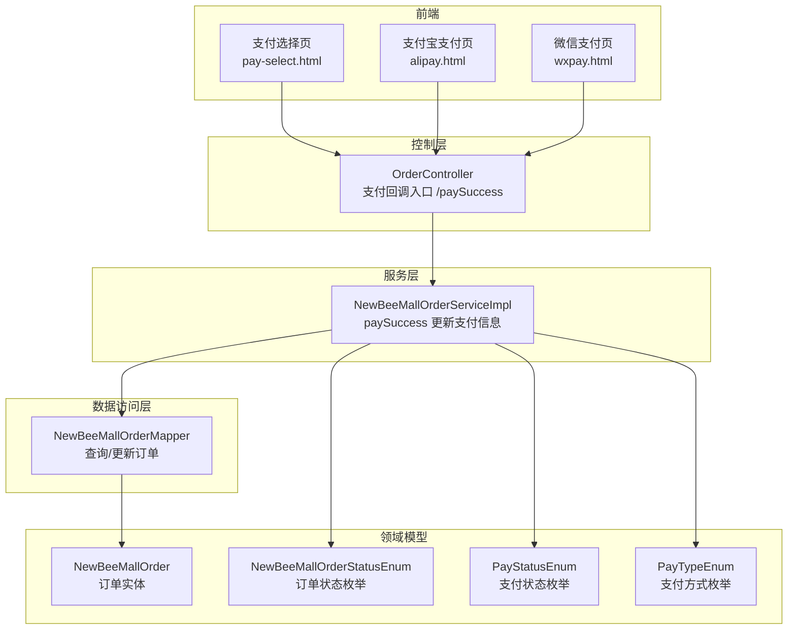
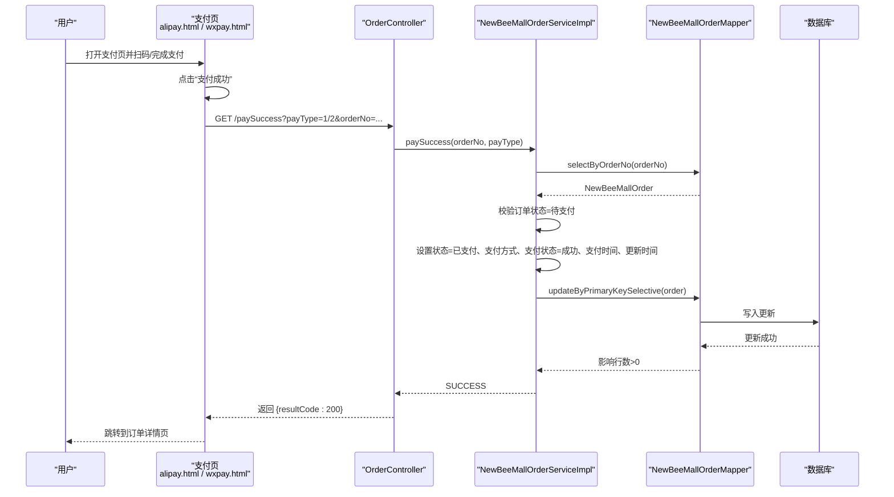
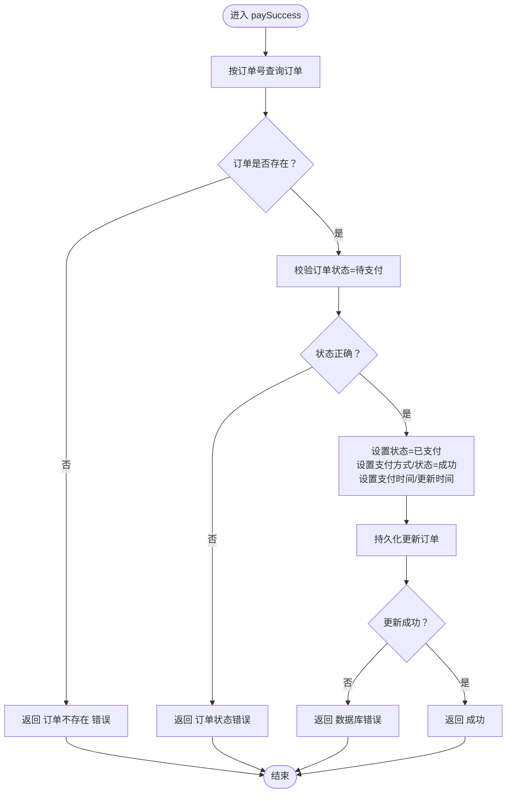
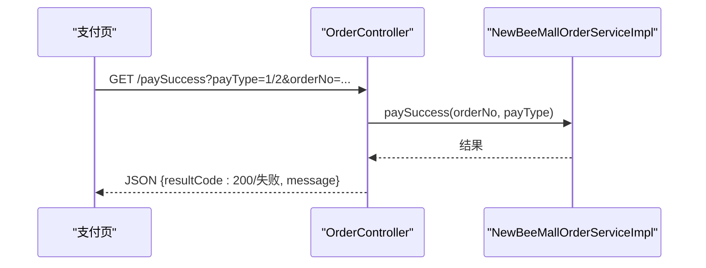
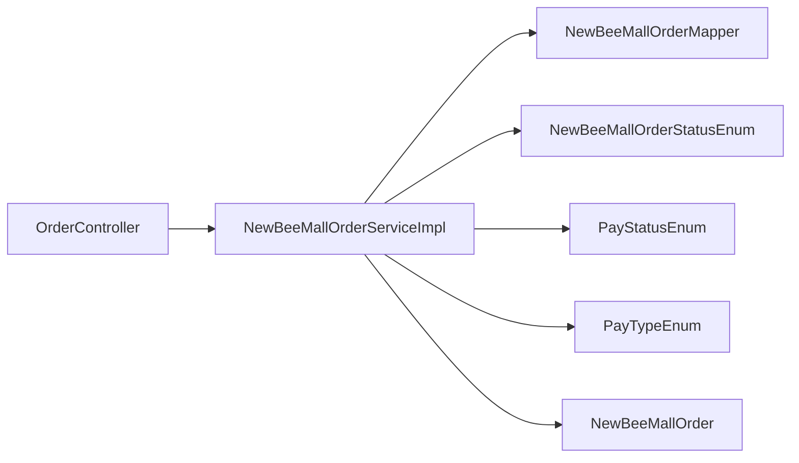

# 订单支付流程

<cite>
**本文引用的文件**
- [NewBeeMallOrderServiceImpl.java](file://src/main/java/ltd/newbee/mall/service/impl/NewBeeMallOrderServiceImpl.java)
- [OrderController.java](file://src/main/java/ltd/newbee/mall/controller/mall/OrderController.java)
- [NewBeeMallOrderStatusEnum.java](file://src/main/java/ltd/newbee/mall/common/NewBeeMallOrderStatusEnum.java)
- [PayStatusEnum.java](file://src/main/java/ltd/newbee/mall/common/PayStatusEnum.java)
- [PayTypeEnum.java](file://src/main/java/ltd/newbee/mall/common/PayTypeEnum.java)
- [NewBeeMallOrder.java](file://src/main/java/ltd/newbee/mall/entity/NewBeeMallOrder.java)
- [NewBeeMallOrderMapper.java](file://src/main/java/ltd/newbee/mall/dao/NewBeeMallOrderMapper.java)
- [pay-select.html](file://src/main/resources/templates/mall/pay-select.html)
- [alipay.html](file://src/main/resources/templates/mall/alipay.html)
- [wxpay.html](file://src/main/resources/templates/mall/wxpay.html)
</cite>

## 目录
1. [引言](#引言)
2. [项目结构](#项目结构)
3. [核心组件](#核心组件)
4. [架构总览](#架构总览)
5. [详细组件分析](#详细组件分析)
6. [依赖关系分析](#依赖关系分析)
7. [性能考量](#性能考量)
8. [故障排查指南](#故障排查指南)
9. [结论](#结论)

## 引言
本文件围绕 newbee-mall 系统的订单支付流程展开，重点基于 NewBeeMallOrderServiceImpl 类的 paySuccess 方法，阐述支付成功后如何更新订单状态为“已支付”、设置支付方式与支付时间，并更新支付状态。同时结合 OrderController 的支付回调处理，完整梳理从用户发起支付到支付回调确认、再到用户端与管理端后续操作的端到端链路。

## 项目结构
- 控制层：OrderController 负责支付页面跳转、支付回调入口与订单详情展示。
- 服务层：NewBeeMallOrderServiceImpl 实现订单业务逻辑，包括 paySuccess 更新支付相关信息。
- 数据访问层：NewBeeMallOrderMapper 提供订单查询与更新能力。
- 实体与枚举：NewBeeMallOrder 表示订单实体；NewBeeMallOrderStatusEnum、PayStatusEnum、PayTypeEnum 定义订单状态、支付状态与支付方式。
- 前端模板：pay-select.html、alipay.html、wxpay.html 提供支付页面与回调触发逻辑。

图表来源
- [OrderController.java](file://src/main/java/ltd/newbee/mall/controller/mall/OrderController.java#L147-L156)
- [NewBeeMallOrderServiceImpl.java](file://src/main/java/ltd/newbee/mall/service/impl/NewBeeMallOrderServiceImpl.java#L374-L394)
- [NewBeeMallOrderMapper.java](file://src/main/java/ltd/newbee/mall/dao/NewBeeMallOrderMapper.java#L24-L29)
- [NewBeeMallOrder.java](file://src/main/java/ltd/newbee/mall/entity/NewBeeMallOrder.java#L16-L169)
- [NewBeeMallOrderStatusEnum.java](file://src/main/java/ltd/newbee/mall/common/NewBeeMallOrderStatusEnum.java#L16-L30)
- [PayStatusEnum.java](file://src/main/java/ltd/newbee/mall/common/PayStatusEnum.java#L16-L23)
- [PayTypeEnum.java](file://src/main/java/ltd/newbee/mall/common/PayTypeEnum.java#L16-L24)

章节来源
- [OrderController.java](file://src/main/java/ltd/newbee/mall/controller/mall/OrderController.java#L147-L156)
- [NewBeeMallOrderServiceImpl.java](file://src/main/java/ltd/newbee/mall/service/impl/NewBeeMallOrderServiceImpl.java#L374-L394)
- [NewBeeMallOrderMapper.java](file://src/main/java/ltd/newbee/mall/dao/NewBeeMallOrderMapper.java#L24-L29)
- [NewBeeMallOrder.java](file://src/main/java/ltd/newbee/mall/entity/NewBeeMallOrder.java#L16-L169)
- [NewBeeMallOrderStatusEnum.java](file://src/main/java/ltd/newbee/mall/common/NewBeeMallOrderStatusEnum.java#L16-L30)
- [PayStatusEnum.java](file://src/main/java/ltd/newbee/mall/common/PayStatusEnum.java#L16-L23)
- [PayTypeEnum.java](file://src/main/java/ltd/newbee/mall/common/PayTypeEnum.java#L16-L24)

## 核心组件
- 支付回调入口：OrderController 的 /paySuccess 接口接收支付成功后的回调请求，调用服务层 paySuccess 完成订单支付信息更新。
- 支付成功处理：NewBeeMallOrderServiceImpl 的 paySuccess 方法按以下规则执行：
  - 通过订单号查询订单；
  - 校验订单状态必须为“待支付”；
  - 设置订单状态为“已支付”；
  - 设置支付方式（payType）与支付状态（payStatus）为“支付成功”；
  - 设置支付时间为当前时间；
  - 更新订单更新时间为当前时间；
  - 执行持久化更新，返回结果。
- 订单实体与状态：NewBeeMallOrder 包含支付相关字段（payStatus、payType、payTime、orderStatus），配合枚举定义确保状态与取值规范。

章节来源
- [OrderController.java](file://src/main/java/ltd/newbee/mall/controller/mall/OrderController.java#L147-L156)
- [NewBeeMallOrderServiceImpl.java](file://src/main/java/ltd/newbee/mall/service/impl/NewBeeMallOrderServiceImpl.java#L374-L394)
- [NewBeeMallOrder.java](file://src/main/java/ltd/newbee/mall/entity/NewBeeMallOrder.java#L22-L41)
- [NewBeeMallOrderStatusEnum.java](file://src/main/java/ltd/newbee/mall/common/NewBeeMallOrderStatusEnum.java#L16-L30)
- [PayStatusEnum.java](file://src/main/java/ltd/newbee/mall/common/PayStatusEnum.java#L16-L23)
- [PayTypeEnum.java](file://src/main/java/ltd/newbee/mall/common/PayTypeEnum.java#L16-L24)

## 架构总览
下面的序列图展示了从用户点击“支付成功”按钮到支付回调确认、订单状态更新与页面跳转的完整链路。

图表来源
- [alipay.html](file://src/main/resources/templates/mall/alipay.html#L77-L95)
- [wxpay.html](file://src/main/resources/templates/mall/wxpay.html#L75-L93)
- [OrderController.java](file://src/main/java/ltd/newbee/mall/controller/mall/OrderController.java#L147-L156)
- [NewBeeMallOrderServiceImpl.java](file://src/main/java/ltd/newbee/mall/service/impl/NewBeeMallOrderServiceImpl.java#L374-L394)
- [NewBeeMallOrderMapper.java](file://src/main/java/ltd/newbee/mall/dao/NewBeeMallOrderMapper.java#L24-L29)

## 详细组件分析

### 支付成功处理流程（paySuccess）
- 查询订单：通过订单号查询订单记录。
- 状态校验：仅当订单状态为“待支付”时才允许更新支付信息，避免重复支付或状态异常导致的数据不一致。
- 更新字段：
  - 订单状态：设置为“已支付”；
  - 支付方式：根据回调参数设置；
  - 支付状态：设置为“支付成功”；
  - 支付时间：设置为当前时间；
  - 更新时间：设置为当前时间。
- 持久化：调用持久层更新订单记录，返回成功或数据库错误。

图表来源
- [NewBeeMallOrderServiceImpl.java](file://src/main/java/ltd/newbee/mall/service/impl/NewBeeMallOrderServiceImpl.java#L374-L394)
- [NewBeeMallOrderMapper.java](file://src/main/java/ltd/newbee/mall/dao/NewBeeMallOrderMapper.java#L24-L29)
- [NewBeeMallOrderStatusEnum.java](file://src/main/java/ltd/newbee/mall/common/NewBeeMallOrderStatusEnum.java#L16-L30)
- [PayStatusEnum.java](file://src/main/java/ltd/newbee/mall/common/PayStatusEnum.java#L16-L23)
- [PayTypeEnum.java](file://src/main/java/ltd/newbee/mall/common/PayTypeEnum.java#L16-L24)

章节来源
- [NewBeeMallOrderServiceImpl.java](file://src/main/java/ltd/newbee/mall/service/impl/NewBeeMallOrderServiceImpl.java#L374-L394)

### 支付回调入口（OrderController）
- /paySuccess 接口：接收支付成功后的回调请求，解析订单号与支付类型，调用服务层 paySuccess 并返回统一结果。
- 前端触发：支付页（alipay.html、wxpay.html）提供“支付成功”按钮，点击后通过 AJAX 调用 /paySuccess，并在成功后跳转到订单详情页。

图表来源
- [OrderController.java](file://src/main/java/ltd/newbee/mall/controller/mall/OrderController.java#L147-L156)
- [alipay.html](file://src/main/resources/templates/mall/alipay.html#L77-L95)
- [wxpay.html](file://src/main/resources/templates/mall/wxpay.html#L75-L93)

章节来源
- [OrderController.java](file://src/main/java/ltd/newbee/mall/controller/mall/OrderController.java#L147-L156)
- [alipay.html](file://src/main/resources/templates/mall/alipay.html#L77-L95)
- [wxpay.html](file://src/main/resources/templates/mall/wxpay.html#L75-L93)

### 支付页面与支付方式选择
- 支付方式选择页：用户在支付选择页选择支付方式（如支付宝、微信支付），页面通过 JavaScript 跳转到对应支付页。
- 支付页：提供“支付成功”按钮，点击后通过 AJAX 调用 /paySuccess，携带订单号与支付类型。

章节来源
- [pay-select.html](file://src/main/resources/templates/mall/pay-select.html#L141-L170)
- [alipay.html](file://src/main/resources/templates/mall/alipay.html#L77-L95)
- [wxpay.html](file://src/main/resources/templates/mall/wxpay.html#L75-L93)

## 依赖关系分析
- 控制层依赖服务层：OrderController 仅负责参数解析与结果包装，具体业务由服务层实现。
- 服务层依赖数据访问层：paySuccess 通过 NewBeeMallOrderMapper 完成查询与更新。
- 服务层依赖领域模型与枚举：使用 NewBeeMallOrderStatusEnum、PayStatusEnum、PayTypeEnum 确保状态与取值一致性。
- 前端模板依赖控制层：模板通过 URL 参数传递 orderNo 与 payType，控制层据此调用服务层。

图表来源
- [OrderController.java](file://src/main/java/ltd/newbee/mall/controller/mall/OrderController.java#L147-L156)
- [NewBeeMallOrderServiceImpl.java](file://src/main/java/ltd/newbee/mall/service/impl/NewBeeMallOrderServiceImpl.java#L374-L394)
- [NewBeeMallOrderMapper.java](file://src/main/java/ltd/newbee/mall/dao/NewBeeMallOrderMapper.java#L24-L29)
- [NewBeeMallOrderStatusEnum.java](file://src/main/java/ltd/newbee/mall/common/NewBeeMallOrderStatusEnum.java#L16-L30)
- [PayStatusEnum.java](file://src/main/java/ltd/newbee/mall/common/PayStatusEnum.java#L16-L23)
- [PayTypeEnum.java](file://src/main/java/ltd/newbee/mall/common/PayTypeEnum.java#L16-L24)

章节来源
- [OrderController.java](file://src/main/java/ltd/newbee/mall/controller/mall/OrderController.java#L147-L156)
- [NewBeeMallOrderServiceImpl.java](file://src/main/java/ltd/newbee/mall/service/impl/NewBeeMallOrderServiceImpl.java#L374-L394)
- [NewBeeMallOrderMapper.java](file://src/main/java/ltd/newbee/mall/dao/NewBeeMallOrderMapper.java#L24-L29)

## 性能考量
- 单条订单更新：paySuccess 仅对单个订单进行查询与更新，复杂度低，性能开销小。
- 状态前置校验：在更新前严格校验订单状态，避免无效写入与回滚成本。
- 时间字段：统一使用当前时间设置支付时间与更新时间，减少额外计算。

## 故障排查指南
- 订单不存在：当订单号无效或已被删除时，返回“订单不存在”错误。检查订单号与订单状态。
- 订单状态错误：当订单状态非“待支付”时，返回“订单状态错误”。需确认用户是否已支付或订单是否被提前关闭。
- 数据库错误：当持久化更新失败时，返回“数据库错误”。检查数据库连接、事务与并发冲突。
- 支付方式与状态：确保回调传入的 payType 与前端选择一致；支付状态应为“支付成功”。

章节来源
- [NewBeeMallOrderServiceImpl.java](file://src/main/java/ltd/newbee/mall/service/impl/NewBeeMallOrderServiceImpl.java#L374-L394)

## 结论
newbee-mall 的订单支付流程通过清晰的职责分层与严格的前置校验，确保支付成功后的状态变更安全可靠。paySuccess 方法在“待支付”状态下更新订单状态、支付方式、支付状态与支付时间，并通过统一的结果返回与前端跳转形成闭环。结合 OrderController 的回调入口与支付页面，用户端与管理端均可在支付完成后获得一致的业务反馈与后续操作路径。