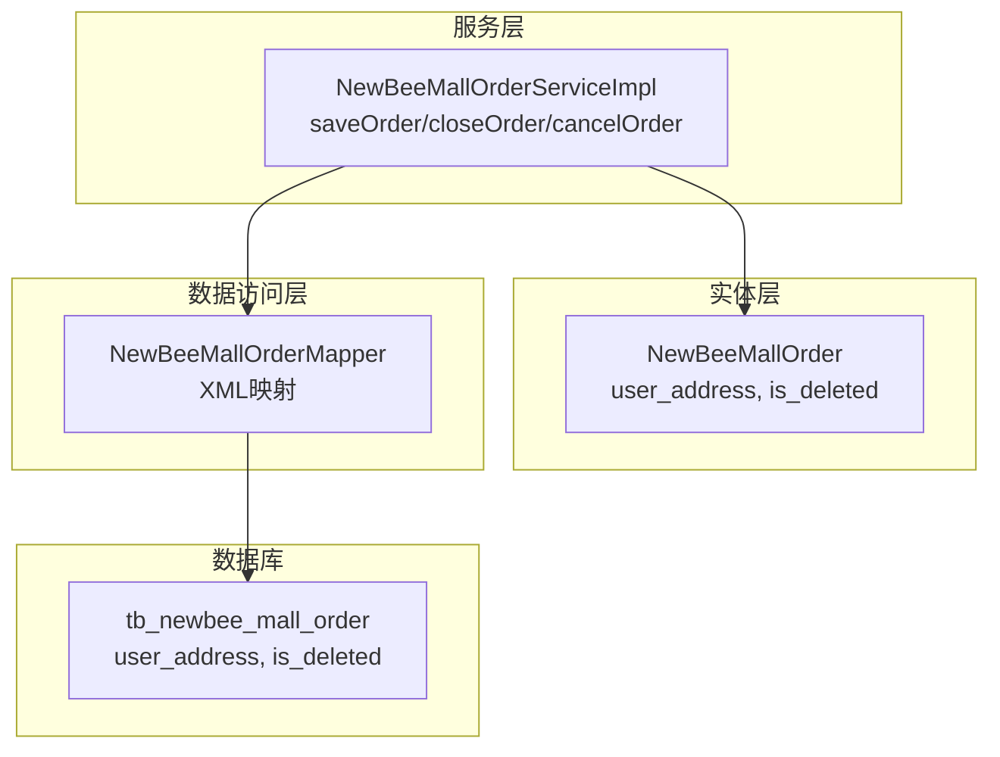
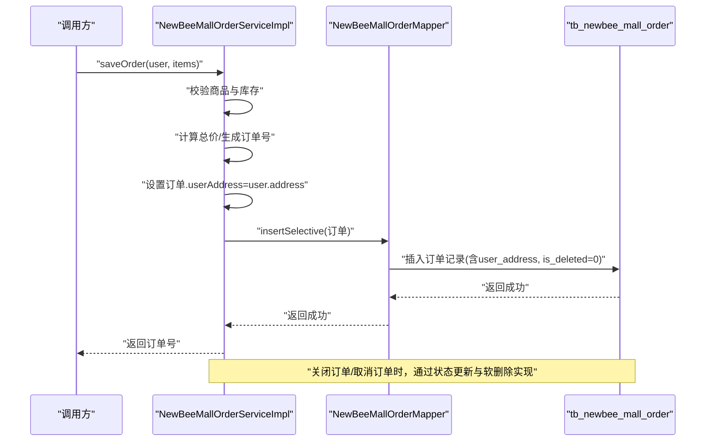
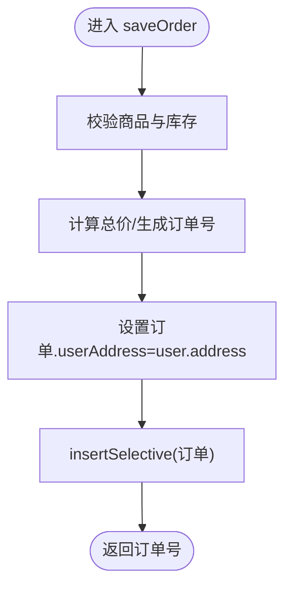
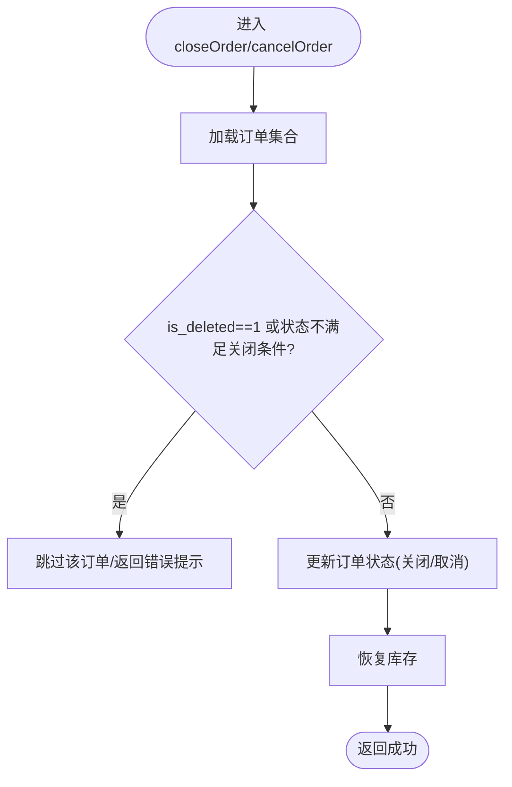
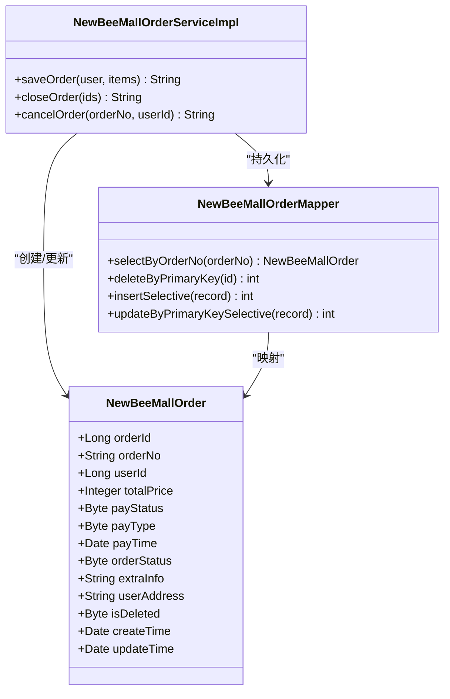

# 地址与逻辑删除字段

<cite>
**本文引用的文件**
- [NewBeeMallOrder.java](file://src/main/java/ltd/newbee/mall/entity/NewBeeMallOrder.java)
- [NewBeeMallOrderServiceImpl.java](file://src/main/java/ltd/newbee/mall/service/impl/NewBeeMallOrderServiceImpl.java)
- [NewBeeMallOrderMapper.java](file://src/main/java/ltd/newbee/mall/dao/NewBeeMallOrderMapper.java)
- [NewBeeMallOrderMapper.xml](file://src/main/resources/mapper/NewBeeMallOrderMapper.xml)
- [NewBeeMallOrderStatusEnum.java](file://src/main/java/ltd/newbee/mall/common/NewBeeMallOrderStatusEnum.java)
- [NewBeeMallUserVO.java](file://src/main/java/ltd/newbee/mall/controller/vo/NewBeeMallUserVO.java)
- [newbee_mall_schema.sql](file://src/main/resources/newbee_mall_schema.sql)
</cite>

## 目录
1. [引言](#引言)
2. [项目结构](#项目结构)
3. [核心组件](#核心组件)
4. [架构总览](#架构总览)
5. [详细组件分析](#详细组件分析)
6. [依赖关系分析](#依赖关系分析)
7. [性能考量](#性能考量)
8. [故障排查指南](#故障排查指南)
9. [结论](#结论)

## 引言
本文件聚焦于 newbee-mall 系统中订单主表的两个关键字段：收货地址 user_address 与逻辑删除 is_deleted。我们将解释：
- user_address 字段如何在订单创建时从用户上下文复制为“地址快照”，确保历史订单的收货信息稳定可追溯；
- is_deleted 字段如何通过软删除策略实现订单状态管理与数据恢复能力，包括关闭订单与取消订单流程中的使用方式。

同时，结合服务层、持久层与数据库结构，说明这些设计对业务稳定性、审计与统计的价值。

## 项目结构
围绕订单主表地址与逻辑删除的相关代码分布如下：
- 实体层：订单实体包含 user_address 与 is_deleted 字段
- 服务层：订单服务在创建订单时写入地址快照；在关闭/取消等场景中通过 is_deleted 与状态位协同控制
- 数据访问层：MyBatis 映射文件定义了查询、插入、更新与软删除的 SQL 行为
- 数据库结构：订单表包含 user_address 与 is_deleted 字段，查询与分页筛选支持按 is_deleted 过滤

图表来源
- [NewBeeMallOrder.java](file://src/main/java/ltd/newbee/mall/entity/NewBeeMallOrder.java#L1-L169)
- [NewBeeMallOrderServiceImpl.java](file://src/main/java/ltd/newbee/mall/service/impl/NewBeeMallOrderServiceImpl.java#L185-L263)
- [NewBeeMallOrderMapper.xml](file://src/main/resources/mapper/NewBeeMallOrderMapper.xml#L1-L287)
- [newbee_mall_schema.sql](file://src/main/resources/newbee_mall_schema.sql#L864-L882)

章节来源
- [NewBeeMallOrder.java](file://src/main/java/ltd/newbee/mall/entity/NewBeeMallOrder.java#L1-L169)
- [NewBeeMallOrderServiceImpl.java](file://src/main/java/ltd/newbee/mall/service/impl/NewBeeMallOrderServiceImpl.java#L185-L263)
- [NewBeeMallOrderMapper.xml](file://src/main/resources/mapper/NewBeeMallOrderMapper.xml#L1-L287)
- [newbee_mall_schema.sql](file://src/main/resources/newbee_mall_schema.sql#L864-L882)

## 核心组件
- 订单实体 NewBeeMallOrder
  - 字段 user_address：记录下单时用户的收货地址快照
  - 字段 is_deleted：逻辑删除标记，0 表示未删除，1 表示已删除（软删除）
- 订单服务 NewBeeMallOrderServiceImpl
  - saveOrder：在创建订单时将 user_address 设置为用户上下文中的地址快照
  - closeOrder/cancelOrder：在关闭/取消订单时通过状态变更与 is_deleted 协同实现软删除语义
- 订单 Mapper 与 XML
  - selectByOrderNo：查询订单时默认过滤 is_deleted=0
  - deleteByPrimaryKey：软删除实现（更新 is_deleted=1）
  - insert/insertSelective/updateByPrimaryKeySelective：持久化 user_address 与 is_deleted
- 订单状态枚举 NewBeeMallOrderStatusEnum
  - 定义了订单状态常量，配合关闭/取消流程的状态判断

章节来源
- [NewBeeMallOrder.java](file://src/main/java/ltd/newbee/mall/entity/NewBeeMallOrder.java#L33-L41)
- [NewBeeMallOrderServiceImpl.java](file://src/main/java/ltd/newbee/mall/service/impl/NewBeeMallOrderServiceImpl.java#L185-L263)
- [NewBeeMallOrderMapper.xml](file://src/main/resources/mapper/NewBeeMallOrderMapper.xml#L30-L34)
- [NewBeeMallOrderStatusEnum.java](file://src/main/java/ltd/newbee/mall/common/NewBeeMallOrderStatusEnum.java#L17-L30)

## 架构总览
下面的序列图展示了“创建订单时复制用户地址快照”的完整流程，以及“关闭订单时软删除”的流程。

图表来源
- [NewBeeMallOrderServiceImpl.java](file://src/main/java/ltd/newbee/mall/service/impl/NewBeeMallOrderServiceImpl.java#L185-L263)
- [NewBeeMallOrderMapper.xml](file://src/main/resources/mapper/NewBeeMallOrderMapper.xml#L119-L204)

章节来源
- [NewBeeMallOrderServiceImpl.java](file://src/main/java/ltd/newbee/mall/service/impl/NewBeeMallOrderServiceImpl.java#L185-L263)
- [NewBeeMallOrderMapper.xml](file://src/main/resources/mapper/NewBeeMallOrderMapper.xml#L119-L204)

## 详细组件分析

### 收货地址 user_address 的设计与实现
- 设计目标
  - 在订单创建时，将用户当前的收货地址复制到订单记录中，形成“地址快照”
  - 保证历史订单的收货信息不受后续用户地址变更影响，便于售后、物流与审计
- 实现位置
  - 服务层在 saveOrder 中从用户上下文 NewBeeMallUserVO 获取地址，并设置到订单实体的 userAddress 字段
  - MyBatis 插入时将 userAddress 写入 tb_newbee_mall_order
- 关键点
  - 地址快照仅在创建订单时写入一次，后续即使用户修改地址，历史订单仍保留当时的有效地址
  - 查询订单详情时，前端展示的是订单表中的 user_address 快照

图表来源
- [NewBeeMallOrderServiceImpl.java](file://src/main/java/ltd/newbee/mall/service/impl/NewBeeMallOrderServiceImpl.java#L185-L263)
- [NewBeeMallOrderMapper.xml](file://src/main/resources/mapper/NewBeeMallOrderMapper.xml#L119-L204)
- [NewBeeMallUserVO.java](file://src/main/java/ltd/newbee/mall/controller/vo/NewBeeMallUserVO.java#L19-L26)

章节来源
- [NewBeeMallOrderServiceImpl.java](file://src/main/java/ltd/newbee/mall/service/impl/NewBeeMallOrderServiceImpl.java#L185-L263)
- [NewBeeMallUserVO.java](file://src/main/java/ltd/newbee/mall/controller/vo/NewBeeMallUserVO.java#L19-L26)
- [NewBeeMallOrderMapper.xml](file://src/main/resources/mapper/NewBeeMallOrderMapper.xml#L119-L204)

### 逻辑删除 is_deleted 的设计与实现
- 设计目标
  - 使用 is_deleted 字段实现软删除，避免物理删除带来的数据不可恢复与统计困难
  - 通过 is_deleted=1 标记“已关闭/已删除”的订单，查询时默认过滤，后台管理可按需查看
- 实现位置
  - 删除接口 deleteByPrimaryKey 在 XML 中实现软删除（更新 is_deleted=1）
  - 查询 selectByOrderNo 默认过滤 is_deleted=0
  - 服务层 closeOrder/cancelOrder 通过状态更新与库存恢复实现“关闭”语义，is_deleted 作为辅助过滤条件参与判断
- 关键点
  - is_deleted=1 的订单在常规查询中被隐藏，但可通过筛选条件显式查看
  - 服务层在关闭/取消订单时，会先判断订单状态与 is_deleted，再执行状态更新与库存恢复

图表来源
- [NewBeeMallOrderServiceImpl.java](file://src/main/java/ltd/newbee/mall/service/impl/NewBeeMallOrderServiceImpl.java#L147-L183)
- [NewBeeMallOrderMapper.xml](file://src/main/resources/mapper/NewBeeMallOrderMapper.xml#L30-L34)
- [NewBeeMallOrderMapper.xml](file://src/main/resources/mapper/NewBeeMallOrderMapper.xml#L103-L106)

章节来源
- [NewBeeMallOrderServiceImpl.java](file://src/main/java/ltd/newbee/mall/service/impl/NewBeeMallOrderServiceImpl.java#L147-L183)
- [NewBeeMallOrderMapper.xml](file://src/main/resources/mapper/NewBeeMallOrderMapper.xml#L30-L34)
- [NewBeeMallOrderMapper.xml](file://src/main/resources/mapper/NewBeeMallOrderMapper.xml#L103-L106)

### 类关系与职责

图表来源
- [NewBeeMallOrder.java](file://src/main/java/ltd/newbee/mall/entity/NewBeeMallOrder.java#L1-L169)
- [NewBeeMallOrderServiceImpl.java](file://src/main/java/ltd/newbee/mall/service/impl/NewBeeMallOrderServiceImpl.java#L185-L263)
- [NewBeeMallOrderMapper.java](file://src/main/java/ltd/newbee/mall/dao/NewBeeMallOrderMapper.java#L1-L43)

章节来源
- [NewBeeMallOrder.java](file://src/main/java/ltd/newbee/mall/entity/NewBeeMallOrder.java#L1-L169)
- [NewBeeMallOrderServiceImpl.java](file://src/main/java/ltd/newbee/mall/service/impl/NewBeeMallOrderServiceImpl.java#L185-L263)
- [NewBeeMallOrderMapper.java](file://src/main/java/ltd/newbee/mall/dao/NewBeeMallOrderMapper.java#L1-L43)

## 依赖关系分析
- 服务层依赖
  - NewBeeMallOrderServiceImpl 依赖 NewBeeMallOrderMapper 进行持久化操作
  - NewBeeMallOrderServiceImpl 依赖 NewBeeMallOrderStatusEnum 进行状态判断
- 数据访问层依赖
  - NewBeeMallOrderMapper.xml 定义了 selectByOrderNo 默认过滤 is_deleted=0 的查询
  - deleteByPrimaryKey 实现软删除（is_deleted=1）
- 数据库层
  - tb_newbee_mall_order 包含 user_address 与 is_deleted 字段，查询与分页筛选支持按 is_deleted 过滤

图表来源
- [NewBeeMallOrderServiceImpl.java](file://src/main/java/ltd/newbee/mall/service/impl/NewBeeMallOrderServiceImpl.java#L185-L263)
- [NewBeeMallOrderMapper.xml](file://src/main/resources/mapper/NewBeeMallOrderMapper.xml#L30-L34)
- [newbee_mall_schema.sql](file://src/main/resources/newbee_mall_schema.sql#L864-L882)

章节来源
- [NewBeeMallOrderServiceImpl.java](file://src/main/java/ltd/newbee/mall/service/impl/NewBeeMallOrderServiceImpl.java#L185-L263)
- [NewBeeMallOrderMapper.xml](file://src/main/resources/mapper/NewBeeMallOrderMapper.xml#L30-L34)
- [newbee_mall_schema.sql](file://src/main/resources/newbee_mall_schema.sql#L864-L882)

## 性能考量
- 地址快照的优势
  - 减少订单查询时对用户表的关联，提升读取性能与一致性
  - 历史地址变更不影响已生成订单的展示与处理
- 软删除的优势
  - 降低物理删除带来的索引维护成本与数据丢失风险
  - 支持按 is_deleted 过滤，便于后台管理与报表统计
- 注意事项
  - 查询时默认过滤 is_deleted=0，若需要查看已关闭订单，应在查询参数中显式传入 isDeleted 条件
  - 分页与筛选条件中应合理使用 is_deleted，避免全表扫描

## 故障排查指南
- 订单查询不到
  - 检查是否传入 is_deleted 过滤条件；默认查询已过滤 is_deleted=0
  - 参考路径：[selectByOrderNo](file://src/main/resources/mapper/NewBeeMallOrderMapper.xml#L30-L34)
- 关闭/取消订单失败
  - 检查订单状态是否满足关闭/取消条件，以及是否已被标记为已关闭（is_deleted=1）
  - 参考路径：[closeOrder](file://src/main/java/ltd/newbee/mall/service/impl/NewBeeMallOrderServiceImpl.java#L147-L183)
- 地址显示异常
  - 确认 saveOrder 是否正确设置了 userAddress；确认插入时已包含 user_address 字段
  - 参考路径：[saveOrder 设置地址](file://src/main/java/ltd/newbee/mall/service/impl/NewBeeMallOrderServiceImpl.java#L223-L235)，[insertSelective](file://src/main/resources/mapper/NewBeeMallOrderMapper.xml#L119-L204)

章节来源
- [NewBeeMallOrderMapper.xml](file://src/main/resources/mapper/NewBeeMallOrderMapper.xml#L30-L34)
- [NewBeeMallOrderServiceImpl.java](file://src/main/java/ltd/newbee/mall/service/impl/NewBeeMallOrderServiceImpl.java#L147-L183)
- [NewBeeMallOrderServiceImpl.java](file://src/main/java/ltd/newbee/mall/service/impl/NewBeeMallOrderServiceImpl.java#L223-L235)
- [NewBeeMallOrderMapper.xml](file://src/main/resources/mapper/NewBeeMallOrderMapper.xml#L119-L204)

## 结论
- user_address 字段通过“地址快照”机制，确保历史订单的收货信息稳定可靠，有利于售后与审计
- is_deleted 字段采用软删除策略，既保障数据安全与可恢复性，又便于后台管理与统计
- 服务层与持久层配合，实现了从创建、关闭到查询的闭环，建议在查询与筛选中明确 is_deleted 条件，以获得预期结果