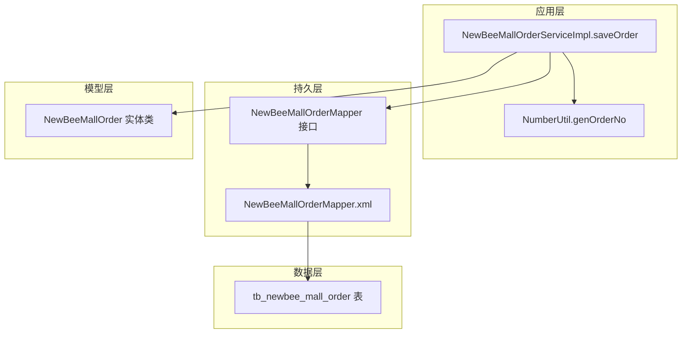
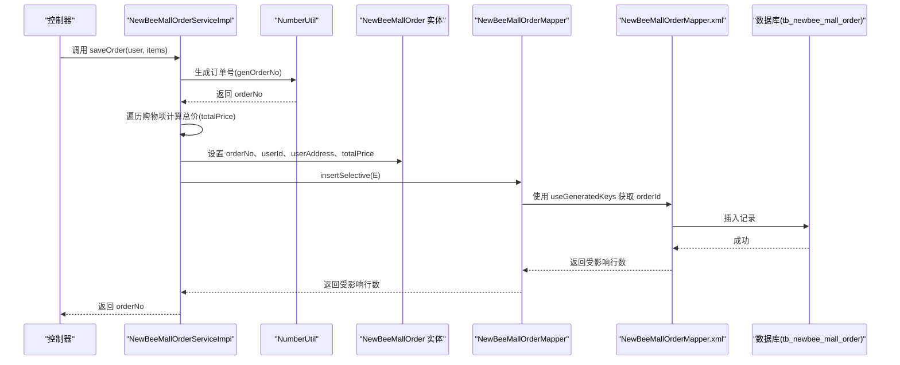
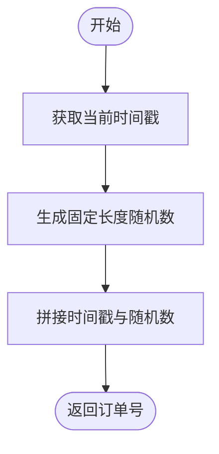
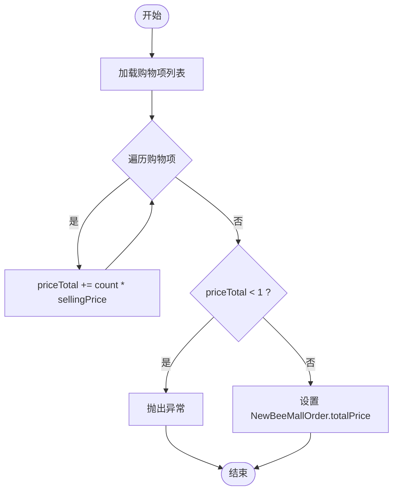
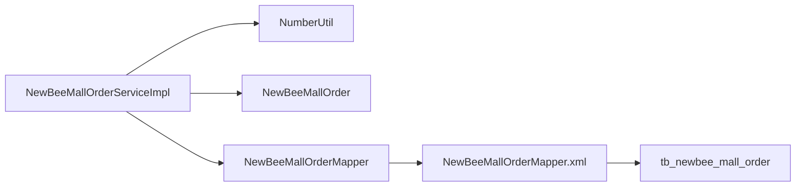

# 基础信息字段

<cite>
**本文引用的文件**
- [NewBeeMallOrder.java](file://src/main/java/ltd/newbee/mall/entity/NewBeeMallOrder.java)
- [NewBeeMallOrderServiceImpl.java](file://src/main/java/ltd/newbee/mall/service/impl/NewBeeMallOrderServiceImpl.java)
- [NumberUtil.java](file://src/main/java/ltd/newbee/mall/util/NumberUtil.java)
- [NewBeeMallOrderMapper.xml](file://src/main/resources/mapper/NewBeeMallOrderMapper.xml)
- [newbee_mall_schema.sql](file://src/main/resources/newbee_mall_schema.sql)
- [API.md](file://docs/API.md)
</cite>

## 目录
1. [引言](#引言)
2. [项目结构](#项目结构)
3. [核心组件](#核心组件)
4. [架构概览](#架构概览)
5. [详细组件分析](#详细组件分析)
6. [依赖分析](#依赖分析)
7. [性能考虑](#性能考虑)
8. [故障排查指南](#故障排查指南)
9. [结论](#结论)

## 引言
本文件聚焦于 newbee-mall 系统订单主表的基础信息字段，围绕以下关键点展开：订单号（order_no）的生成规则、用户ID（user_id）与用户表的关联关系、总价（total_price）的计算逻辑，以及这些字段在 Java 实体类 NewBeeMallOrder 中的定义、getter/setter 方法、MyBatis 映射中的使用方式。同时给出订单创建时如何设置这些字段的实际代码路径示例，帮助读者快速理解并正确使用。

## 项目结构
与订单主表基础信息相关的关键文件分布如下：
- 实体类：entity.NewBeeMallOrder
- 服务实现：service.impl.NewBeeMallOrderServiceImpl.saveOrder
- 工具类：util.NumberUtil.genOrderNo
- MyBatis 映射：mapper.NewBeeMallOrderMapper.xml
- 数据库表结构：newbee_mall_schema.sql 中的 tb_newbee_mall_order
- 接口文档：docs.API.md 中的订单对象示例

图表来源
- [NewBeeMallOrderServiceImpl.java](file://src/main/java/ltd/newbee/mall/service/impl/NewBeeMallOrderServiceImpl.java#L185-L263)
- [NumberUtil.java](file://src/main/java/ltd/newbee/mall/util/NumberUtil.java#L48-L58)
- [NewBeeMallOrderMapper.xml](file://src/main/resources/mapper/NewBeeMallOrderMapper.xml#L119-L162)
- [newbee_mall_schema.sql](file://src/main/resources/newbee_mall_schema.sql#L864-L882)

章节来源
- [NewBeeMallOrder.java](file://src/main/java/ltd/newbee/mall/entity/NewBeeMallOrder.java#L15-L169)
- [NewBeeMallOrderServiceImpl.java](file://src/main/java/ltd/newbee/mall/service/impl/NewBeeMallOrderServiceImpl.java#L185-L263)
- [NumberUtil.java](file://src/main/java/ltd/newbee/mall/util/NumberUtil.java#L48-L58)
- [NewBeeMallOrderMapper.xml](file://src/main/resources/mapper/NewBeeMallOrderMapper.xml#L119-L162)
- [newbee_mall_schema.sql](file://src/main/resources/newbee_mall_schema.sql#L864-L882)
- [API.md](file://docs/API.md#L997-L1016)

## 核心组件
- NewBeeMallOrder 实体类：定义订单主表的字段及 getter/setter 方法，包括 orderNo、userId、totalPrice 等。
- NumberUtil.genOrderNo：生成订单号的方法，用于 saveOrder 流程中。
- NewBeeMallOrderServiceImpl.saveOrder：订单创建流程的核心实现，负责校验、扣减库存、生成订单号、计算总价并写入数据库。
- NewBeeMallOrderMapper.xml：MyBatis 映射文件，定义实体与数据库列的映射关系，以及 insertSelective 等 SQL。

章节来源
- [NewBeeMallOrder.java](file://src/main/java/ltd/newbee/mall/entity/NewBeeMallOrder.java#L15-L169)
- [NumberUtil.java](file://src/main/java/ltd/newbee/mall/util/NumberUtil.java#L48-L58)
- [NewBeeMallOrderServiceImpl.java](file://src/main/java/ltd/newbee/mall/service/impl/NewBeeMallOrderServiceImpl.java#L185-L263)
- [NewBeeMallOrderMapper.xml](file://src/main/resources/mapper/NewBeeMallOrderMapper.xml#L119-L162)

## 架构概览
订单创建时的数据流如下：
- 控制器调用服务层 saveOrder
- 服务层生成订单号（NumberUtil.genOrderNo）
- 服务层遍历购物项，按数量×单价累加得到总价（totalPrice）
- 服务层将 orderNo、userId、userAddress、totalPrice 等字段填充到 NewBeeMallOrder 实体
- 通过 MyBatis 的 insertSelective 写入数据库，useGeneratedKeys 返回自增主键

图表来源
- [NewBeeMallOrderServiceImpl.java](file://src/main/java/ltd/newbee/mall/service/impl/NewBeeMallOrderServiceImpl.java#L185-L263)
- [NumberUtil.java](file://src/main/java/ltd/newbee/mall/util/NumberUtil.java#L48-L58)
- [NewBeeMallOrderMapper.xml](file://src/main/resources/mapper/NewBeeMallOrderMapper.xml#L119-L162)

## 详细组件分析

### 订单号（order_no）生成规则
- 生成方法：NumberUtil.genOrderNo
- 生成策略：基于当前时间戳拼接固定长度的随机数，确保唯一性
- 使用位置：NewBeeMallOrderServiceImpl.saveOrder 在创建订单时调用该方法生成 orderNo，并设置到 NewBeeMallOrder 实体

图表来源
- [NumberUtil.java](file://src/main/java/ltd/newbee/mall/util/NumberUtil.java#L48-L58)
- [NewBeeMallOrderServiceImpl.java](file://src/main/java/ltd/newbee/mall/service/impl/NewBeeMallOrderServiceImpl.java#L219-L234)

章节来源
- [NumberUtil.java](file://src/main/java/ltd/newbee/mall/util/NumberUtil.java#L48-L58)
- [NewBeeMallOrderServiceImpl.java](file://src/main/java/ltd/newbee/mall/service/impl/NewBeeMallOrderServiceImpl.java#L219-L234)

### 用户ID（user_id）与用户表的关联关系
- 数据库表结构：tb_newbee_mall_order 的 user_id 字段类型为 bigint，默认值为 0
- 实体类字段：NewBeeMallOrder.userId 类型为 Long
- 关联关系：user_id 与 tb_newbee_mall_user.user_id 主键形成一对多关系（一个用户可有多笔订单）

章节来源
- [newbee_mall_schema.sql](file://src/main/resources/newbee_mall_schema.sql#L864-L882)
- [NewBeeMallOrder.java](file://src/main/java/ltd/newbee/mall/entity/NewBeeMallOrder.java#L15-L169)
- [newbee_mall_schema.sql](file://src/main/resources/newbee_mall_schema.sql#L1000-L1012)

### 总价（total_price）计算逻辑
- 计算来源：NewBeeMallOrderServiceImpl.saveOrder
- 计算方式：遍历购物项，对每个购物项的数量乘以单价，累加得到 priceTotal
- 设置位置：将 priceTotal 设置到 NewBeeMallOrder.totalPrice 字段
- 校验：若 priceTotal 小于 1，则抛出异常

图表来源
- [NewBeeMallOrderServiceImpl.java](file://src/main/java/ltd/newbee/mall/service/impl/NewBeeMallOrderServiceImpl.java#L228-L234)

章节来源
- [NewBeeMallOrderServiceImpl.java](file://src/main/java/ltd/newbee/mall/service/impl/NewBeeMallOrderServiceImpl.java#L228-L234)

### Java 实体类 NewBeeMallOrder 字段定义与 getter/setter
- 字段清单（与订单主表相关）：
  - orderId：Long
  - orderNo：String
  - userId：Long
  - totalPrice：Integer
  - 其他字段：payStatus、payType、payTime、orderStatus、extraInfo、userAddress、isDeleted、createTime、updateTime
- getter/setter：每个字段均提供对应的访问器与设置器；注意 orderNo、extraInfo、userAddress 在 setter 中会进行 trim 处理

章节来源
- [NewBeeMallOrder.java](file://src/main/java/ltd/newbee/mall/entity/NewBeeMallOrder.java#L15-L169)

### MyBatis 映射中的使用方式
- 结果映射：BaseResultMap 将数据库列与实体属性一一对应
- 插入策略：insertSelective 使用 useGeneratedKeys="true"，keyProperty="orderId"，使插入后能回填主键
- 字段映射：order_no、user_id、total_price 等列与实体属性绑定

章节来源
- [NewBeeMallOrderMapper.xml](file://src/main/resources/mapper/NewBeeMallOrderMapper.xml#L4-L18)
- [NewBeeMallOrderMapper.xml](file://src/main/resources/mapper/NewBeeMallOrderMapper.xml#L119-L162)

### 订单创建时字段设置的实际代码示例（路径）
- 生成订单号：参考 [NewBeeMallOrderServiceImpl.java](file://src/main/java/ltd/newbee/mall/service/impl/NewBeeMallOrderServiceImpl.java#L219-L221)
- 设置用户ID与地址：参考 [NewBeeMallOrderServiceImpl.java](file://src/main/java/ltd/newbee/mall/service/impl/NewBeeMallOrderServiceImpl.java#L224-L227)
- 计算总价并设置：参考 [NewBeeMallOrderServiceImpl.java](file://src/main/java/ltd/newbee/mall/service/impl/NewBeeMallOrderServiceImpl.java#L228-L234)
- 插入订单并回填主键：参考 [NewBeeMallOrderMapper.xml](file://src/main/resources/mapper/NewBeeMallOrderMapper.xml#L119-L162)

章节来源
- [NewBeeMallOrderServiceImpl.java](file://src/main/java/ltd/newbee/mall/service/impl/NewBeeMallOrderServiceImpl.java#L219-L234)
- [NewBeeMallOrderMapper.xml](file://src/main/resources/mapper/NewBeeMallOrderMapper.xml#L119-L162)

## 依赖分析
- 服务层依赖工具类生成订单号
- 服务层依赖实体类承载订单数据
- 服务层通过 Mapper 接口与 MyBatis XML 映射交互
- Mapper XML 与数据库表结构保持一致

图表来源
- [NewBeeMallOrderServiceImpl.java](file://src/main/java/ltd/newbee/mall/service/impl/NewBeeMallOrderServiceImpl.java#L185-L263)
- [NumberUtil.java](file://src/main/java/ltd/newbee/mall/util/NumberUtil.java#L48-L58)
- [NewBeeMallOrderMapper.xml](file://src/main/resources/mapper/NewBeeMallOrderMapper.xml#L119-L162)
- [newbee_mall_schema.sql](file://src/main/resources/newbee_mall_schema.sql#L864-L882)

章节来源
- [NewBeeMallOrderServiceImpl.java](file://src/main/java/ltd/newbee/mall/service/impl/NewBeeMallOrderServiceImpl.java#L185-L263)
- [NumberUtil.java](file://src/main/java/ltd/newbee/mall/util/NumberUtil.java#L48-L58)
- [NewBeeMallOrderMapper.xml](file://src/main/resources/mapper/NewBeeMallOrderMapper.xml#L119-L162)
- [newbee_mall_schema.sql](file://src/main/resources/newbee_mall_schema.sql#L864-L882)

## 性能考虑
- 订单号生成：基于时间戳与固定长度随机数拼接，具备高并发下的唯一性保障
- 计算总价：遍历购物项累加，时间复杂度 O(n)，n 为购物项数量
- 插入策略：insertSelective 使用 useGeneratedKeys 回填主键，避免额外查询
- 建议：在高并发场景下，建议结合数据库索引与事务控制，确保订单号唯一性与一致性

## 故障排查指南
- 订单号重复或格式异常：检查 NumberUtil.genOrderNo 的实现与调用链
- 总价异常为 0 或负数：确认购物项数量与单价是否正确，以及计算逻辑
- 插入失败或主键未回填：检查 insertSelective 的 useGeneratedKeys 配置与数据库自增策略
- 字段映射不一致：核对 NewBeeMallOrderMapper.xml 的 BaseResultMap 与数据库列定义

章节来源
- [NumberUtil.java](file://src/main/java/ltd/newbee/mall/util/NumberUtil.java#L48-L58)
- [NewBeeMallOrderServiceImpl.java](file://src/main/java/ltd/newbee/mall/service/impl/NewBeeMallOrderServiceImpl.java#L228-L234)
- [NewBeeMallOrderMapper.xml](file://src/main/resources/mapper/NewBeeMallOrderMapper.xml#L119-L162)
- [newbee_mall_schema.sql](file://src/main/resources/newbee_mall_schema.sql#L864-L882)

## 结论
- 订单号由 NumberUtil.genOrderNo 生成，确保唯一性
- 用户ID与用户表建立外键关联，实体类与数据库字段一一对应
- 总价在 saveOrder 中按购物项数量×单价累加得出，并进行有效性校验
- MyBatis 通过 insertSelective 与 useGeneratedKeys 完成高效持久化
- 以上设计保证了订单主表基础信息的完整性与一致性，便于后续业务扩展与维护