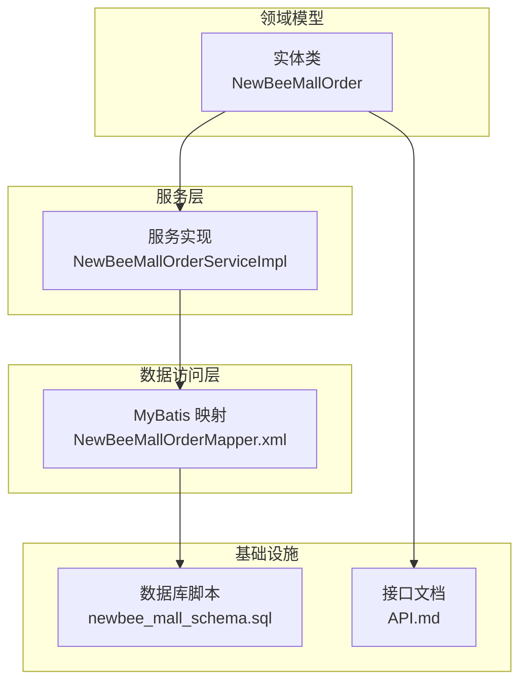
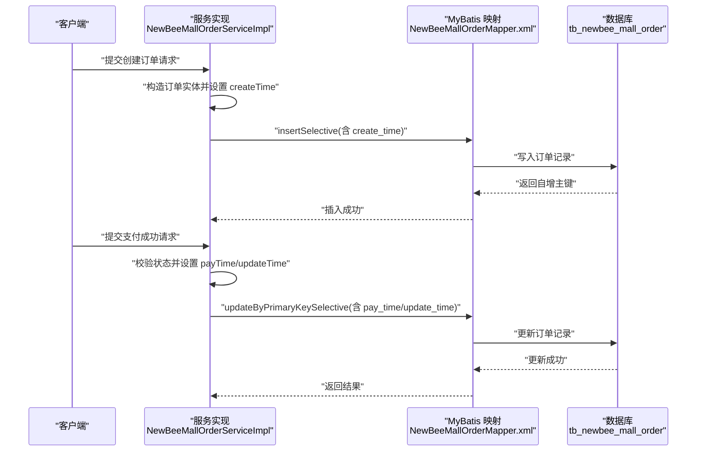
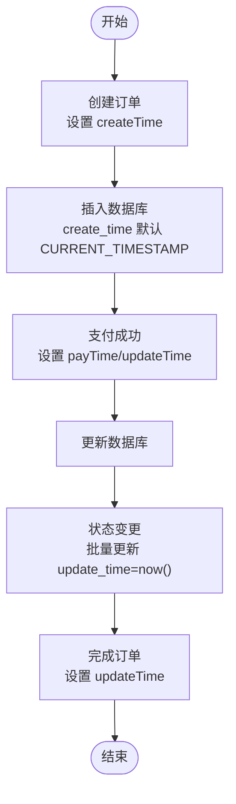
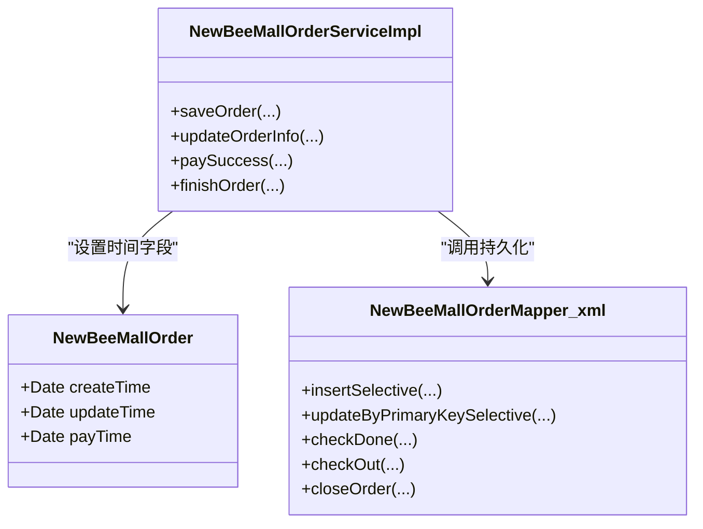

# 时间戳字段

<cite>
**本文引用的文件**
- [NewBeeMallOrder.java](file://src/main/java/ltd/newbee/mall/entity/NewBeeMallOrder.java)
- [NewBeeMallOrderServiceImpl.java](file://src/main/java/ltd/newbee/mall/service/impl/NewBeeMallOrderServiceImpl.java)
- [NewBeeMallOrderMapper.xml](file://src/main/resources/mapper/NewBeeMallOrderMapper.xml)
- [newbee_mall_schema.sql](file://src/main/resources/newbee_mall_schema.sql)
- [API.md](file://docs/API.md)
</cite>

## 目录
1. [引言](#引言)
2. [项目结构](#项目结构)
3. [核心组件](#核心组件)
4. [架构总览](#架构总览)
5. [详细组件分析](#详细组件分析)
6. [依赖关系分析](#依赖关系分析)
7. [性能考量](#性能考量)
8. [故障排查指南](#故障排查指南)
9. [结论](#结论)

## 引言
本文件聚焦于 newbee-mall 系统中订单主表的时间戳字段，系统性梳理以下内容：
- 字段定义与含义：创建时间（create_time）、更新时间（update_time）、支付时间（pay_time）
- 时区处理策略：通过 JSON 序列化注解统一输出为 GMT+8
- 数据库默认行为：create_time/update_time 的默认值为 CURRENT_TIMESTAMP
- 业务逻辑中的更新时机：在订单创建、状态变更、支付成功等关键节点更新时间戳
- 审计与状态追踪价值：如何基于时间戳进行订单生命周期审计与状态追踪

## 项目结构
围绕订单主表时间戳的关键代码与资源分布如下：
- 实体类：定义订单实体及其时间字段与 JSON 时区注解
- 服务实现：在订单创建、状态变更、支付成功等流程中设置时间戳
- MyBatis 映射：插入与更新订单时对时间字段的映射与赋值
- 数据库脚本：定义订单表字段与默认值
- 接口文档：对外暴露的订单对象包含时间字段示例

图表来源
- [NewBeeMallOrder.java](file://src/main/java/ltd/newbee/mall/entity/NewBeeMallOrder.java#L1-L169)
- [NewBeeMallOrderServiceImpl.java](file://src/main/java/ltd/newbee/mall/service/impl/NewBeeMallOrderServiceImpl.java#L185-L384)
- [NewBeeMallOrderMapper.xml](file://src/main/resources/mapper/NewBeeMallOrderMapper.xml#L130-L287)
- [newbee_mall_schema.sql](file://src/main/resources/newbee_mall_schema.sql#L860-L882)
- [API.md](file://docs/API.md#L997-L1014)

章节来源
- [NewBeeMallOrder.java](file://src/main/java/ltd/newbee/mall/entity/NewBeeMallOrder.java#L1-L169)
- [NewBeeMallOrderServiceImpl.java](file://src/main/java/ltd/newbee/mall/service/impl/NewBeeMallOrderServiceImpl.java#L185-L384)
- [NewBeeMallOrderMapper.xml](file://src/main/resources/mapper/NewBeeMallOrderMapper.xml#L130-L287)
- [newbee_mall_schema.sql](file://src/main/resources/newbee_mall_schema.sql#L860-L882)
- [API.md](file://docs/API.md#L997-L1014)

## 核心组件
- 订单实体 NewBeeMallOrder
  - 字段：createTime、updateTime、payTime
  - 注解：@JsonFormat(pattern="yyyy-MM-dd HH:mm:ss", timezone="GMT+8") 统一序列化时区
- 订单服务 NewBeeMallOrderServiceImpl
  - 创建订单：saveOrder 中设置 createTime
  - 更新订单：updateOrderInfo、finishOrder、closeOrder 等更新 updateTime
  - 支付成功：paySuccess 同步设置 payTime 与 updateTime
- MyBatis 映射 NewBeeMallOrderMapper.xml
  - insertSelective/updateByPrimaryKeySelective/updateByPrimaryKey：对 create_time/update_time/pay_time 进行映射赋值
- 数据库表 tb_newbee_mall_order
  - 字段：create_time/update_time 默认 CURRENT_TIMESTAMP；pay_time 可为空
- 接口文档 API.md
  - 订单对象示例包含 createTime/updateTime/payTime 字段

章节来源
- [NewBeeMallOrder.java](file://src/main/java/ltd/newbee/mall/entity/NewBeeMallOrder.java#L36-L45)
- [NewBeeMallOrderServiceImpl.java](file://src/main/java/ltd/newbee/mall/service/impl/NewBeeMallOrderServiceImpl.java#L185-L384)
- [NewBeeMallOrderMapper.xml](file://src/main/resources/mapper/NewBeeMallOrderMapper.xml#L130-L287)
- [newbee_mall_schema.sql](file://src/main/resources/newbee_mall_schema.sql#L860-L882)
- [API.md](file://docs/API.md#L997-L1014)

## 架构总览
订单主表时间戳在系统中的流转路径如下：

图表来源
- [NewBeeMallOrderServiceImpl.java](file://src/main/java/ltd/newbee/mall/service/impl/NewBeeMallOrderServiceImpl.java#L185-L263)
- [NewBeeMallOrderServiceImpl.java](file://src/main/java/ltd/newbee/mall/service/impl/NewBeeMallOrderServiceImpl.java#L374-L394)
- [NewBeeMallOrderMapper.xml](file://src/main/resources/mapper/NewBeeMallOrderMapper.xml#L130-L204)
- [NewBeeMallOrderMapper.xml](file://src/main/resources/mapper/NewBeeMallOrderMapper.xml#L229-L286)

## 详细组件分析

### 实体类：NewBeeMallOrder 的时间字段与注解
- 字段与类型
  - createTime：创建时间（Date）
  - updateTime：更新时间（Date）
  - payTime：支付时间（Date，可为空）
- JSON 序列化时区
  - 使用 @JsonFormat(pattern="yyyy-MM-dd HH:mm:ss", timezone="GMT+8") 统一输出为东八区时间
- 字段访问器
  - 提供 getter/setter，便于服务层与映射层读写

章节来源
- [NewBeeMallOrder.java](file://src/main/java/ltd/newbee/mall/entity/NewBeeMallOrder.java#L36-L45)
- [NewBeeMallOrder.java](file://src/main/java/ltd/newbee/mall/entity/NewBeeMallOrder.java#L131-L145)

### 数据库：tb_newbee_mall_order 的时间字段与默认值
- 字段定义
  - create_time：datetime，默认 CURRENT_TIMESTAMP
  - update_time：datetime，默认 CURRENT_TIMESTAMP
  - pay_time：datetime，允许为空
- 主键与索引
  - 主键为 order_id，便于按主键快速定位订单

章节来源
- [newbee_mall_schema.sql](file://src/main/resources/newbee_mall_schema.sql#L860-L882)

### 映射层：MyBatis 对时间字段的映射与赋值
- 插入映射 insertSelective
  - 条件插入 create_time/update_time/pay_time，避免覆盖默认值
- 更新映射 updateByPrimaryKeySelective/updateByPrimaryKey
  - 支持按需更新 pay_time/update_time/create_time
  - update_time 也可在批量状态变更时通过 SQL 设置为 now()

章节来源
- [NewBeeMallOrderMapper.xml](file://src/main/resources/mapper/NewBeeMallOrderMapper.xml#L130-L204)
- [NewBeeMallOrderMapper.xml](file://src/main/resources/mapper/NewBeeMallOrderMapper.xml#L205-L228)
- [NewBeeMallOrderMapper.xml](file://src/main/resources/mapper/NewBeeMallOrderMapper.xml#L229-L286)

### 服务层：业务逻辑中的时间戳更新时机
- 创建订单 saveOrder
  - 在插入订单前设置 createTime，随后插入数据库
- 更新订单信息 updateOrderInfo
  - 修改订单信息时设置 updateTime
- 配货完成/出库/关闭等状态变更
  - 通过批量更新语句将 update_time 设为当前时间
- 支付成功 paySuccess
  - 设置 payTime 与 updateTime，完成支付状态变更
- 完成订单 finishOrder
  - 设置 updateTime

图表来源
- [NewBeeMallOrderServiceImpl.java](file://src/main/java/ltd/newbee/mall/service/impl/NewBeeMallOrderServiceImpl.java#L185-L263)
- [NewBeeMallOrderServiceImpl.java](file://src/main/java/ltd/newbee/mall/service/impl/NewBeeMallOrderServiceImpl.java#L264-L323)
- [NewBeeMallOrderServiceImpl.java](file://src/main/java/ltd/newbee/mall/service/impl/NewBeeMallOrderServiceImpl.java#L325-L372)
- [NewBeeMallOrderServiceImpl.java](file://src/main/java/ltd/newbee/mall/service/impl/NewBeeMallOrderServiceImpl.java#L374-L394)

章节来源
- [NewBeeMallOrderServiceImpl.java](file://src/main/java/ltd/newbee/mall/service/impl/NewBeeMallOrderServiceImpl.java#L185-L263)
- [NewBeeMallOrderServiceImpl.java](file://src/main/java/ltd/newbee/mall/service/impl/NewBeeMallOrderServiceImpl.java#L264-L323)
- [NewBeeMallOrderServiceImpl.java](file://src/main/java/ltd/newbee/mall/service/impl/NewBeeMallOrderServiceImpl.java#L325-L372)
- [NewBeeMallOrderServiceImpl.java](file://src/main/java/ltd/newbee/mall/service/impl/NewBeeMallOrderServiceImpl.java#L374-L394)

### 接口文档：对外暴露的时间字段
- 订单对象示例包含 createTime/updateTime/payTime 字段，便于前端与接口调试时理解时间字段含义与格式

章节来源
- [API.md](file://docs/API.md#L997-L1014)

## 依赖关系分析
- 实体类与服务层
  - 服务层通过实体类设置时间字段，再由映射层写入数据库
- 服务层与映射层
  - insertSelective/updateByPrimaryKeySelective 负责将 createTime/updateTime/payTime 写入数据库
  - 批量状态变更通过 SQL 将 update_time 设为 now()
- 映射层与数据库
  - 字段映射与默认值协同工作，确保 create_time/update_time 的一致性

图表来源
- [NewBeeMallOrder.java](file://src/main/java/ltd/newbee/mall/entity/NewBeeMallOrder.java#L1-L169)
- [NewBeeMallOrderServiceImpl.java](file://src/main/java/ltd/newbee/mall/service/impl/NewBeeMallOrderServiceImpl.java#L185-L394)
- [NewBeeMallOrderMapper.xml](file://src/main/resources/mapper/NewBeeMallOrderMapper.xml#L130-L287)

章节来源
- [NewBeeMallOrder.java](file://src/main/java/ltd/newbee/mall/entity/NewBeeMallOrder.java#L1-L169)
- [NewBeeMallOrderServiceImpl.java](file://src/main/java/ltd/newbee/mall/service/impl/NewBeeMallOrderServiceImpl.java#L185-L394)
- [NewBeeMallOrderMapper.xml](file://src/main/resources/mapper/NewBeeMallOrderMapper.xml#L130-L287)

## 性能考量
- 默认值策略
  - create_time/update_time 使用数据库默认 CURRENT_TIMESTAMP，减少 Java 层赋值开销
- 批量更新
  - 状态变更（配货完成/出库/关闭）通过 SQL 直接设置 update_time=now()，避免逐条读取与回写
- JSON 序列化
  - @JsonFormat 固定时区，避免跨时区展示差异带来的额外转换成本

[本节为通用建议，无需特定文件引用]

## 故障排查指南
- 时间字段为空
  - pay_time 可为空，若业务期望非空，需在服务层或接口层加强校验
- 时区显示异常
  - 确认 @JsonFormat 注解已生效；检查客户端时区与展示逻辑
- 更新时间未变化
  - 确认服务层在相应流程中设置了 updateTime；检查映射层 updateByPrimaryKeySelective 是否包含 update_time
- 创建时间与数据库默认值不一致
  - 若服务层显式设置了 createTime，需确认是否与数据库默认值冲突；通常建议依赖数据库默认值以简化逻辑

章节来源
- [NewBeeMallOrder.java](file://src/main/java/ltd/newbee/mall/entity/NewBeeMallOrder.java#L36-L45)
- [NewBeeMallOrderMapper.xml](file://src/main/resources/mapper/NewBeeMallOrderMapper.xml#L229-L286)
- [newbee_mall_schema.sql](file://src/main/resources/newbee_mall_schema.sql#L860-L882)

## 结论
- 订单主表时间戳通过实体注解、数据库默认值与服务层更新三者协同，形成清晰一致的时间记录体系
- createTime 与 update_time 的默认值由数据库保障，payTime 仅在支付成功时填充
- 服务层在关键业务节点（创建、支付、状态变更、完成）设置对应时间戳，确保订单生命周期审计与状态追踪具备可靠依据
- 建议在接口层与前端统一使用 GMT+8 展示，避免跨时区展示差异