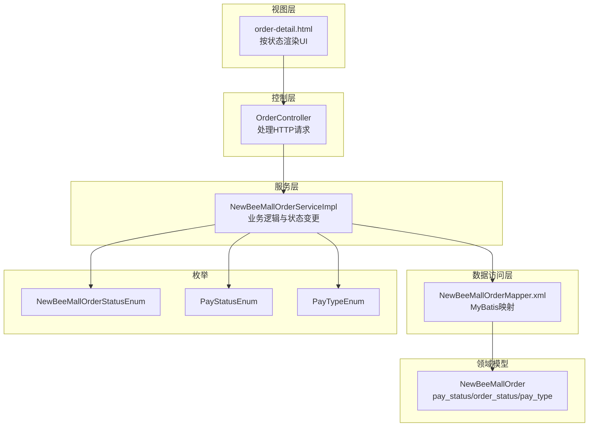
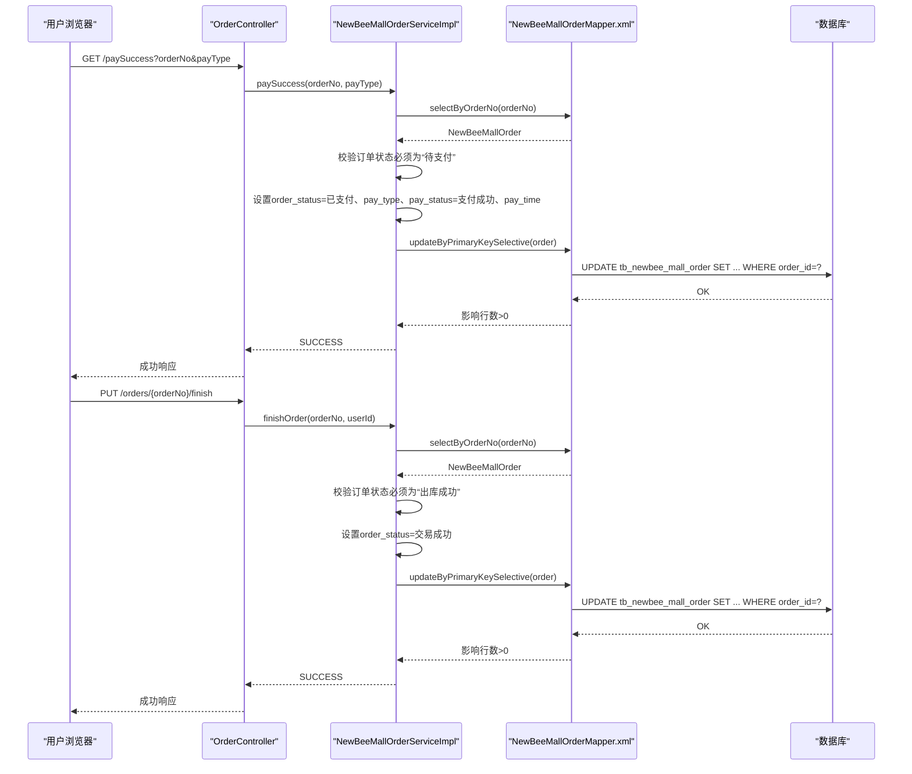
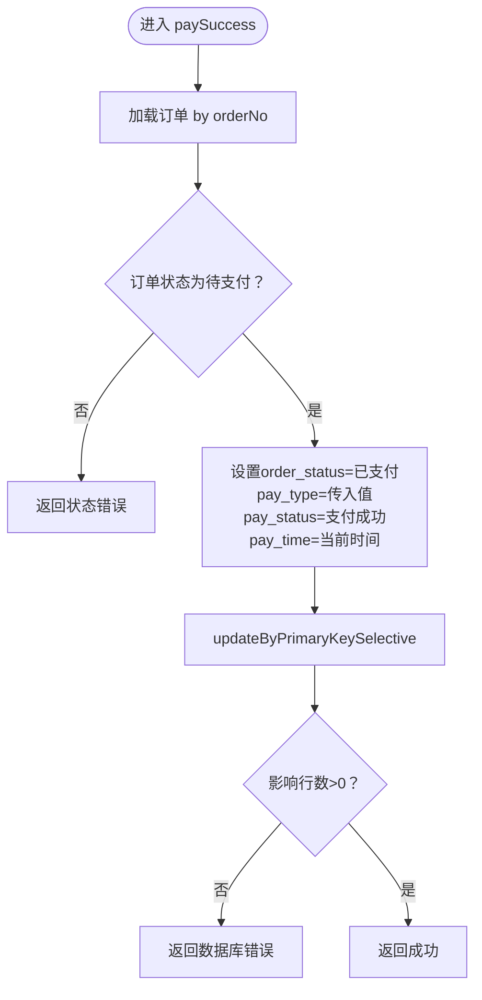
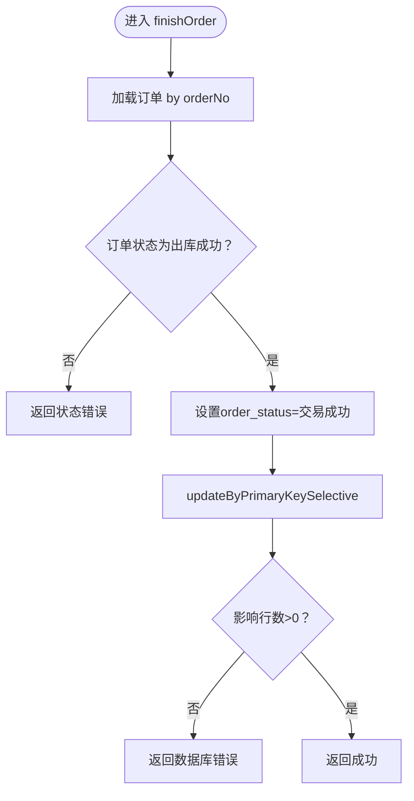
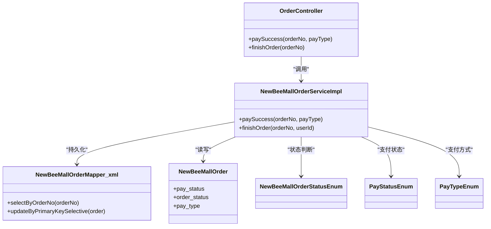

# 状态管理字段

<cite>
**本文引用的文件**
- [NewBeeMallOrderStatusEnum.java](file://src/main/java/ltd/newbee/mall/common/NewBeeMallOrderStatusEnum.java)
- [PayStatusEnum.java](file://src/main/java/ltd/newbee/mall/common/PayStatusEnum.java)
- [PayTypeEnum.java](file://src/main/java/ltd/newbee/mall/common/PayTypeEnum.java)
- [NewBeeMallOrder.java](file://src/main/java/ltd/newbee/mall/entity/NewBeeMallOrder.java)
- [NewBeeMallOrderServiceImpl.java](file://src/main/java/ltd/newbee/mall/service/impl/NewBeeMallOrderServiceImpl.java)
- [OrderController.java](file://src/main/java/ltd/newbee/mall/controller/mall/OrderController.java)
- [NewBeeMallOrderMapper.xml](file://src/main/resources/mapper/NewBeeMallOrderMapper.xml)
- [order-detail.html](file://src/main/resources/templates/mall/order-detail.html)
</cite>

## 目录
1. [引言](#引言)
2. [项目结构](#项目结构)
3. [核心组件](#核心组件)
4. [架构总览](#架构总览)
5. [详细组件分析](#详细组件分析)
6. [依赖关系分析](#依赖关系分析)
7. [性能考量](#性能考量)
8. [故障排查指南](#故障排查指南)
9. [结论](#结论)

## 引言
本文件聚焦于 newbee-mall 系统中订单主表的状态管理，围绕支付状态（pay_status）、订单状态（order_status）与支付方式（pay_type）三个关键字段展开，系统性阐述：
- 枚举值定义：订单状态、支付状态、支付方式的取值与含义
- 生命周期状态转换：从下单到支付、配货、出库、交易成功及关闭的业务规则与约束
- 控制器与服务层的调用路径：如 paySuccess、finishOrder 等方法如何驱动状态变更
- 数据持久化层映射：MyBatis 映射文件中状态字段的存储与更新策略
- 前端展示与交互：订单详情页如何根据状态渲染按钮与进度条

## 项目结构
围绕状态管理的相关代码分布如下：
- 枚举定义：common 包下的 NewBeeMallOrderStatusEnum、PayStatusEnum、PayTypeEnum
- 实体模型：entity 下的 NewBeeMallOrder，包含 pay_status、order_status、pay_type 等字段
- 服务实现：service/impl 下的 NewBeeMallOrderServiceImpl，提供 paySuccess、finishOrder 等状态变更方法
- 控制器：controller/mall 下的 OrderController，负责接收前端请求并调用服务层
- 数据访问：resources/mapper 下的 NewBeeMallOrderMapper.xml，映射状态字段到数据库
- 前端模板：templates/mall 下的 order-detail.html，依据状态渲染 UI

图表来源
- [OrderController.java](file://src/main/java/ltd/newbee/mall/controller/mall/OrderController.java#L1-L159)
- [NewBeeMallOrderServiceImpl.java](file://src/main/java/ltd/newbee/mall/service/impl/NewBeeMallOrderServiceImpl.java#L1-L429)
- [NewBeeMallOrderMapper.xml](file://src/main/resources/mapper/NewBeeMallOrderMapper.xml#L1-L287)
- [NewBeeMallOrder.java](file://src/main/java/ltd/newbee/mall/entity/NewBeeMallOrder.java#L1-L169)
- [NewBeeMallOrderStatusEnum.java](file://src/main/java/ltd/newbee/mall/common/NewBeeMallOrderStatusEnum.java#L1-L64)
- [PayStatusEnum.java](file://src/main/java/ltd/newbee/mall/common/PayStatusEnum.java#L1-L58)
- [PayTypeEnum.java](file://src/main/java/ltd/newbee/mall/common/PayTypeEnum.java#L1-L59)
- [order-detail.html](file://src/main/resources/templates/mall/order-detail.html#L38-L135)

章节来源
- [OrderController.java](file://src/main/java/ltd/newbee/mall/controller/mall/OrderController.java#L1-L159)
- [NewBeeMallOrderServiceImpl.java](file://src/main/java/ltd/newbee/mall/service/impl/NewBeeMallOrderServiceImpl.java#L1-L429)
- [NewBeeMallOrderMapper.xml](file://src/main/resources/mapper/NewBeeMallOrderMapper.xml#L1-L287)
- [NewBeeMallOrder.java](file://src/main/java/ltd/newbee/mall/entity/NewBeeMallOrder.java#L1-L169)
- [NewBeeMallOrderStatusEnum.java](file://src/main/java/ltd/newbee/mall/common/NewBeeMallOrderStatusEnum.java#L1-L64)
- [PayStatusEnum.java](file://src/main/java/ltd/newbee/mall/common/PayStatusEnum.java#L1-L58)
- [PayTypeEnum.java](file://src/main/java/ltd/newbee/mall/common/PayTypeEnum.java#L1-L59)
- [order-detail.html](file://src/main/resources/templates/mall/order-detail.html#L38-L135)

## 核心组件
- 订单状态（order_status）
  - 枚举值：待支付、已支付、配货完成、出库成功、交易成功、手动关闭、超时关闭、商家关闭
  - 字段类型：Byte（对应数据库 TINYINT）
- 支付状态（pay_status）
  - 枚举值：支付中、支付成功、支付失败
  - 字段类型：Byte（对应数据库 TINYINT）
- 支付方式（pay_type）
  - 枚举值：无、支付宝、微信支付
  - 字段类型：Byte（对应数据库 TINYINT）

章节来源
- [NewBeeMallOrderStatusEnum.java](file://src/main/java/ltd/newbee/mall/common/NewBeeMallOrderStatusEnum.java#L18-L63)
- [PayStatusEnum.java](file://src/main/java/ltd/newbee/mall/common/PayStatusEnum.java#L18-L57)
- [PayTypeEnum.java](file://src/main/java/ltd/newbee/mall/common/PayTypeEnum.java#L18-L58)
- [NewBeeMallOrder.java](file://src/main/java/ltd/newbee/mall/entity/NewBeeMallOrder.java#L24-L31)

## 架构总览
以下序列图展示了“支付成功”和“确认收货”的关键调用链路，体现状态变更的业务规则与约束。

图表来源
- [OrderController.java](file://src/main/java/ltd/newbee/mall/controller/mall/OrderController.java#L147-L156)
- [NewBeeMallOrderServiceImpl.java](file://src/main/java/ltd/newbee/mall/service/impl/NewBeeMallOrderServiceImpl.java#L351-L394)
- [NewBeeMallOrderMapper.xml](file://src/main/resources/mapper/NewBeeMallOrderMapper.xml#L205-L286)

## 详细组件分析

### 订单状态枚举与业务含义
- 待支付（0）：订单刚生成，等待用户支付
- 已支付（1）：用户完成支付，进入后续流程
- 配货完成（2）：仓库完成拣货
- 出库成功（3）：物流出库
- 交易成功（4）：用户确认收货，交易完成
- 手动关闭（-1）、超时关闭（-2）、商家关闭（-3）：订单被关闭

章节来源
- [NewBeeMallOrderStatusEnum.java](file://src/main/java/ltd/newbee/mall/common/NewBeeMallOrderStatusEnum.java#L18-L63)

### 支付状态枚举与业务含义
- 支付中（0）：第三方支付回调尚未到达，系统处于中间态
- 支付成功（1）：第三方支付回调成功，系统标记为支付成功
- 支付失败（-1）：支付异常或失败，系统标记为失败

章节来源
- [PayStatusEnum.java](file://src/main/java/ltd/newbee/mall/common/PayStatusEnum.java#L18-L57)

### 支付方式枚举与业务含义
- 无（0）：未选择支付方式或未支付
- 支付宝（1）
- 微信支付（2）

章节来源
- [PayTypeEnum.java](file://src/main/java/ltd/newbee/mall/common/PayTypeEnum.java#L18-L58)

### 订单实体与状态字段映射
- 实体字段：pay_status、order_status、pay_type
- 字段类型：Byte（对应数据库 TINYINT）
- MyBatis 映射：在 NewBeeMallOrderMapper.xml 中通过 resultMap 将数据库列映射到实体属性

章节来源
- [NewBeeMallOrder.java](file://src/main/java/ltd/newbee/mall/entity/NewBeeMallOrder.java#L24-L31)
- [NewBeeMallOrderMapper.xml](file://src/main/resources/mapper/NewBeeMallOrderMapper.xml#L1-L22)

### 支付成功流程（paySuccess）
- 入口：OrderController.paySuccess 接收参数 orderNo、payType
- 服务层校验：仅当订单状态为“待支付”时允许支付成功
- 更新内容：设置 order_status=已支付、pay_type=传入值、pay_status=支付成功、pay_time=当前时间
- 持久化：通过 updateByPrimaryKeySelective 写入数据库

图表来源
- [OrderController.java](file://src/main/java/ltd/newbee/mall/controller/mall/OrderController.java#L147-L156)
- [NewBeeMallOrderServiceImpl.java](file://src/main/java/ltd/newbee/mall/service/impl/NewBeeMallOrderServiceImpl.java#L374-L394)
- [NewBeeMallOrderMapper.xml](file://src/main/resources/mapper/NewBeeMallOrderMapper.xml#L229-L286)

章节来源
- [OrderController.java](file://src/main/java/ltd/newbee/mall/controller/mall/OrderController.java#L147-L156)
- [NewBeeMallOrderServiceImpl.java](file://src/main/java/ltd/newbee/mall/service/impl/NewBeeMallOrderServiceImpl.java#L374-L394)
- [NewBeeMallOrderMapper.xml](file://src/main/resources/mapper/NewBeeMallOrderMapper.xml#L229-L286)

### 确认收货流程（finishOrder）
- 入口：OrderController.finish 接收 orderNo、userId
- 服务层校验：仅当订单状态为“出库成功”时允许确认收货
- 更新内容：设置 order_status=交易成功
- 持久化：通过 updateByPrimaryKeySelective 写入数据库

图表来源
- [OrderController.java](file://src/main/java/ltd/newbee/mall/controller/mall/OrderController.java#L97-L107)
- [NewBeeMallOrderServiceImpl.java](file://src/main/java/ltd/newbee/mall/service/impl/NewBeeMallOrderServiceImpl.java#L351-L372)
- [NewBeeMallOrderMapper.xml](file://src/main/resources/mapper/NewBeeMallOrderMapper.xml#L229-L286)

章节来源
- [OrderController.java](file://src/main/java/ltd/newbee/mall/controller/mall/OrderController.java#L97-L107)
- [NewBeeMallOrderServiceImpl.java](file://src/main/java/ltd/newbee/mall/service/impl/NewBeeMallOrderServiceImpl.java#L351-L372)
- [NewBeeMallOrderMapper.xml](file://src/main/resources/mapper/NewBeeMallOrderMapper.xml#L229-L286)

### 状态转换的业务规则与约束
- 支付前置条件：仅“待支付”状态可执行支付成功操作
- 收货前置条件：仅“出库成功”状态可执行确认收货
- 关闭订单规则：交易成功、已关闭、已删除的订单不可再次关闭；关闭时会恢复库存
- 配货/出库规则：配货需“已支付”，出库需“配货完成”或“已支付”

章节来源
- [NewBeeMallOrderServiceImpl.java](file://src/main/java/ltd/newbee/mall/service/impl/NewBeeMallOrderServiceImpl.java#L111-L145)
- [NewBeeMallOrderServiceImpl.java](file://src/main/java/ltd/newbee/mall/service/impl/NewBeeMallOrderServiceImpl.java#L147-L183)
- [NewBeeMallOrderServiceImpl.java](file://src/main/java/ltd/newbee/mall/service/impl/NewBeeMallOrderServiceImpl.java#L351-L372)
- [NewBeeMallOrderServiceImpl.java](file://src/main/java/ltd/newbee/mall/service/impl/NewBeeMallOrderServiceImpl.java#L374-L394)

### 前端状态展示与交互
- 订单详情页根据 orderStatus 渲染不同按钮（去支付、确认收货）与进度条步骤
- 订单状态字符串由枚举映射，便于前端展示

章节来源
- [order-detail.html](file://src/main/resources/templates/mall/order-detail.html#L38-L135)
- [NewBeeMallOrderServiceImpl.java](file://src/main/java/ltd/newbee/mall/service/impl/NewBeeMallOrderServiceImpl.java#L286-L287)

## 依赖关系分析
- 控制器依赖服务层：OrderController 调用 NewBeeMallOrderService 的方法
- 服务层依赖数据访问层：NewBeeMallOrderServiceImpl 使用 NewBeeMallOrderMapper.xml 进行数据库读写
- 服务层依赖枚举：通过枚举常量进行状态判断与设置
- 实体与映射：NewBeeMallOrder 与 NewBeeMallOrderMapper.xml 的字段一一对应

图表来源
- [OrderController.java](file://src/main/java/ltd/newbee/mall/controller/mall/OrderController.java#L1-L159)
- [NewBeeMallOrderServiceImpl.java](file://src/main/java/ltd/newbee/mall/service/impl/NewBeeMallOrderServiceImpl.java#L1-L429)
- [NewBeeMallOrderMapper.xml](file://src/main/resources/mapper/NewBeeMallOrderMapper.xml#L1-L287)
- [NewBeeMallOrder.java](file://src/main/java/ltd/newbee/mall/entity/NewBeeMallOrder.java#L1-L169)
- [NewBeeMallOrderStatusEnum.java](file://src/main/java/ltd/newbee/mall/common/NewBeeMallOrderStatusEnum.java#L1-L64)
- [PayStatusEnum.java](file://src/main/java/ltd/newbee/mall/common/PayStatusEnum.java#L1-L58)
- [PayTypeEnum.java](file://src/main/java/ltd/newbee/mall/common/PayTypeEnum.java#L1-L59)

## 性能考量
- 状态查询与更新：MyBatis 映射文件对 order_status、pay_status、pay_type 提供了批量更新与条件查询能力，建议在高并发场景下结合数据库索引与事务隔离级别进行优化
- 前端渲染：订单详情页按状态渲染按钮与进度条，避免重复请求，减少不必要的网络开销
- 库存恢复：关闭订单时恢复库存涉及多步操作，应确保事务一致性，避免脏读或丢失更新

## 故障排查指南
- 支付失败或状态未更新
  - 检查控制器入口参数 orderNo、payType 是否正确传递
  - 核对服务层 paySuccess 的前置状态校验是否命中“待支付”
  - 查看持久化层 updateByPrimaryKeySelective 是否返回影响行数>0
- 确认收货失败
  - 检查订单状态是否为“出库成功”
  - 核对服务层 finishOrder 的状态校验与更新逻辑
- 关闭订单异常
  - 检查订单是否已被关闭或交易成功
  - 确认库存恢复逻辑是否执行成功

章节来源
- [OrderController.java](file://src/main/java/ltd/newbee/mall/controller/mall/OrderController.java#L97-L156)
- [NewBeeMallOrderServiceImpl.java](file://src/main/java/ltd/newbee/mall/service/impl/NewBeeMallOrderServiceImpl.java#L111-L183)
- [NewBeeMallOrderServiceImpl.java](file://src/main/java/ltd/newbee/mall/service/impl/NewBeeMallOrderServiceImpl.java#L351-L394)
- [NewBeeMallOrderMapper.xml](file://src/main/resources/mapper/NewBeeMallOrderMapper.xml#L205-L286)

## 结论
newbee-mall 的订单状态管理通过清晰的枚举定义与严格的业务前置校验，实现了从“待支付”到“交易成功”的有序流转。支付成功与确认收货两条关键路径分别受“待支付”和“出库成功”的状态约束，确保了业务流程的正确性与一致性。配合 MyBatis 的字段映射与事务控制，系统在保证功能完整性的同时具备良好的扩展性与可维护性。