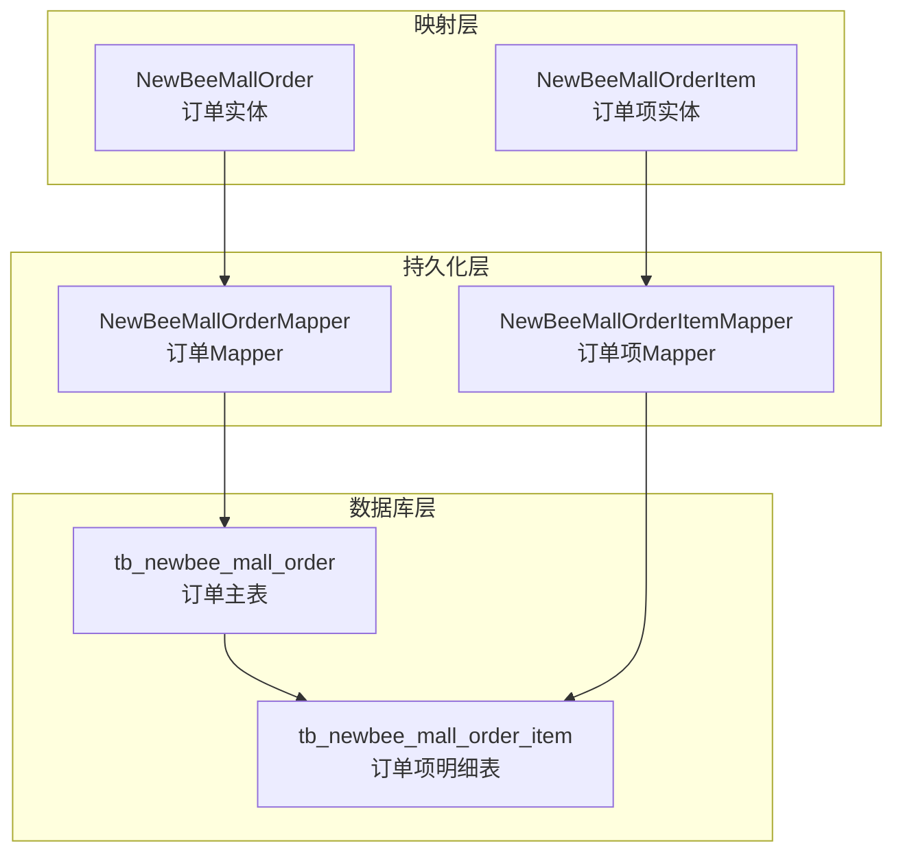
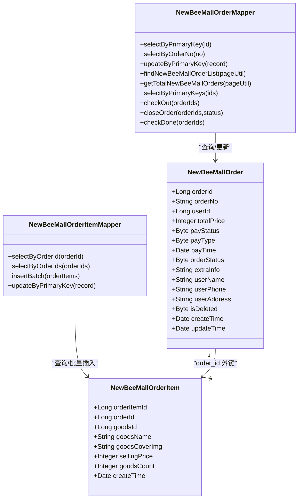
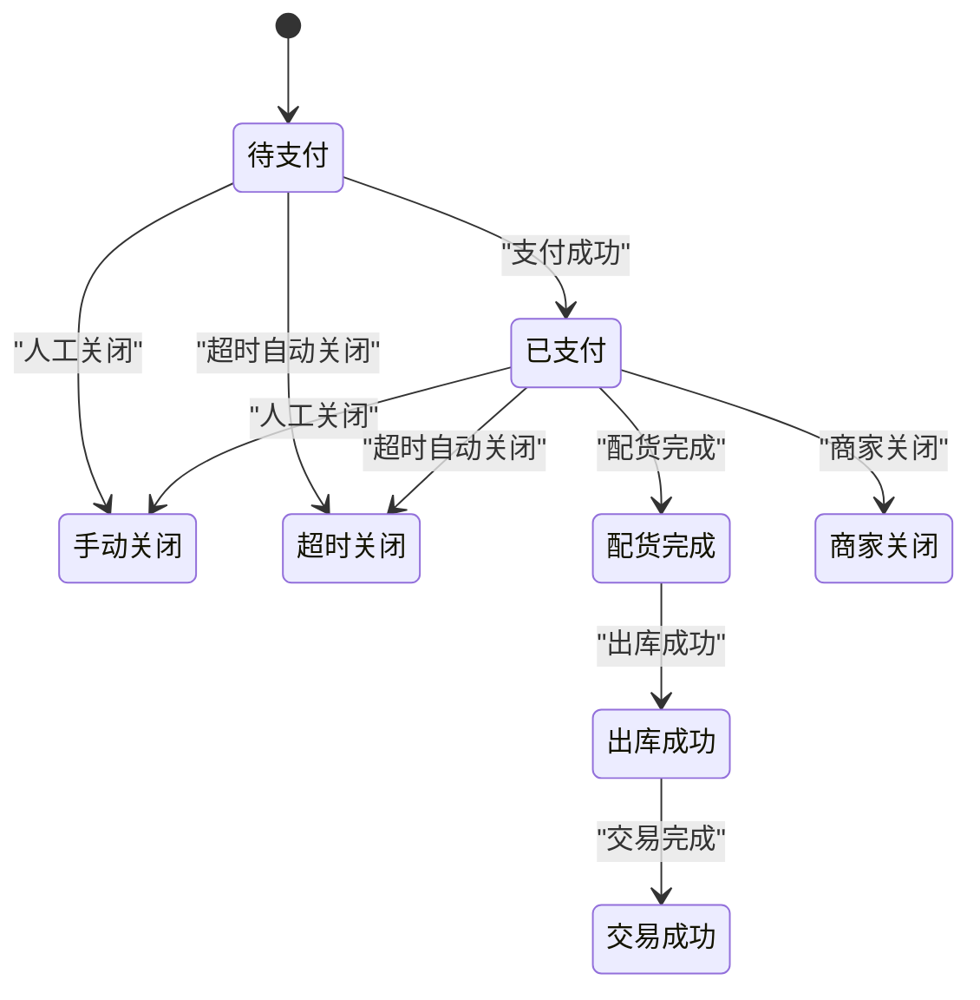
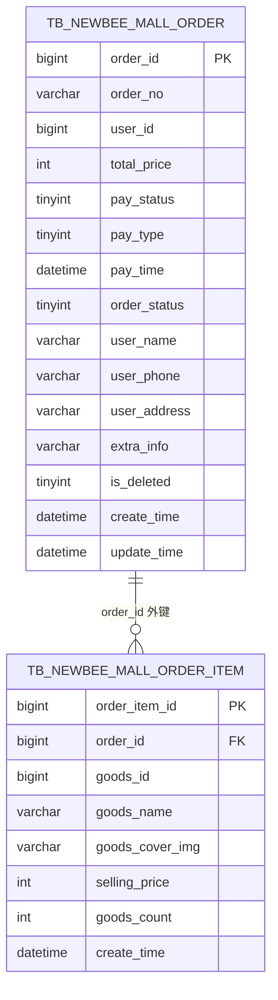
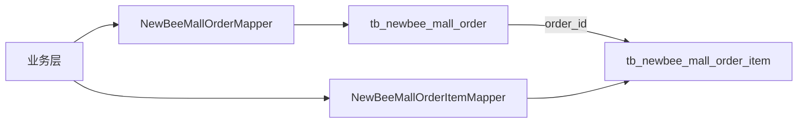

# 订单实体模型

<cite>
**本文引用的文件**
- [newbee_mall_schema.sql](file://src/main/resources/newbee_mall_schema.sql)
- [NewBeeMallOrder.java](file://src/main/java/ltd/newbee/mall/entity/NewBeeMallOrder.java)
- [NewBeeMallOrderItem.java](file://src/main/java/ltd/newbee/mall/entity/NewBeeMallOrderItem.java)
- [NewBeeMallOrderMapper.java](file://src/main/java/ltd/newbee/mall/dao/NewBeeMallOrderMapper.java)
- [NewBeeMallOrderItemMapper.java](file://src/main/java/ltd/newbee/mall/dao/NewBeeMallOrderItemMapper.java)
</cite>

## 目录
1. [引言](#引言)
2. [项目结构](#项目结构)
3. [核心组件](#核心组件)
4. [架构总览](#架构总览)
5. [详细组件分析](#详细组件分析)
6. [依赖分析](#依赖分析)
7. [性能考虑](#性能考虑)
8. [故障排查指南](#故障排查指南)
9. [结论](#结论)
10. [附录](#附录)

## 引言
本文件围绕 newbee-mall 的订单实体模型展开，基于数据库表 tb_newbee_mall_order 与 tb_newbee_mall_order_item 的结构设计，结合 Java 实体类 NewBeeMallOrder、NewBeeMallOrderItem 以及 MyBatis Mapper 接口，系统化阐述订单主表与订单项表的字段含义、主外键关系、索引策略与约束条件，解释订单状态机与支付状态管理，给出订单号生成策略与事务处理建议，并提供订单实体关系图。

## 项目结构
- 数据库层：tb_newbee_mall_order（订单主表）、tb_newbee_mall_order_item（订单项明细表）
- 映射层：NewBeeMallOrder、NewBeeMallOrderItem Java 实体类
- 持久化层：NewBeeMallOrderMapper、NewBeeMallOrderItemMapper MyBatis 接口
- 关系：订单主表与订单项表通过 order_id 建立一对多关系

图表来源
- [newbee_mall_schema.sql](file://src/main/resources/newbee_mall_schema.sql#L864-L930)
- [NewBeeMallOrder.java](file://src/main/java/ltd/newbee/mall/entity/NewBeeMallOrder.java#L1-L169)
- [NewBeeMallOrderItem.java](file://src/main/java/ltd/newbee/mall/entity/NewBeeMallOrderItem.java#L1-L111)
- [NewBeeMallOrderMapper.java](file://src/main/java/ltd/newbee/mall/dao/NewBeeMallOrderMapper.java#L1-L43)
- [NewBeeMallOrderItemMapper.java](file://src/main/java/ltd/newbee/mall/dao/NewBeeMallOrderItemMapper.java#L1-L52)

章节来源
- [newbee_mall_schema.sql](file://src/main/resources/newbee_mall_schema.sql#L864-L930)
- [NewBeeMallOrder.java](file://src/main/java/ltd/newbee/mall/entity/NewBeeMallOrder.java#L1-L169)
- [NewBeeMallOrderItem.java](file://src/main/java/ltd/newbee/mall/entity/NewBeeMallOrderItem.java#L1-L111)
- [NewBeeMallOrderMapper.java](file://src/main/java/ltd/newbee/mall/dao/NewBeeMallOrderMapper.java#L1-L43)
- [NewBeeMallOrderItemMapper.java](file://src/main/java/ltd/newbee/mall/dao/NewBeeMallOrderItemMapper.java#L1-L52)

## 核心组件
- 订单主表（tb_newbee_mall_order）
  - 主键：order_id（bigint, 自增）
  - 订单号：order_no（varchar, 唯一性建议）
  - 用户：user_id（bigint）
  - 总价：total_price（int，单位分）
  - 支付状态：pay_status（tinyint，0未支付/1成功/-1失败）
  - 支付方式：pay_type（tinyint，0无/1支付宝/2微信）
  - 支付时间：pay_time（datetime）
  - 订单状态：order_status（tinyint，0待支付/1已支付/2配货完成/3出库成功/4交易成功/-1手动关闭/-2超时关闭/-3商家关闭）
  - 收货信息：user_name、user_phone、user_address（varchar）
  - 备注：extra_info（varchar）
  - 删除标记：is_deleted（tinyint）
  - 时间戳：create_time、update_time（datetime）

- 订单项表（tb_newbee_mall_order_item）
  - 主键：order_item_id（bigint, 自增）
  - 外键：order_id（bigint，指向 tb_newbee_mall_order.order_id）
  - 商品快照：goods_id、goods_name、goods_cover_img、selling_price（int，单位分）、goods_count（int）
  - 创建时间：create_time（datetime）

章节来源
- [newbee_mall_schema.sql](file://src/main/resources/newbee_mall_schema.sql#L864-L930)

## 架构总览
订单模块遵循经典的“订单主表 + 订单项明细表”的一对多设计。订单主表记录订单全局信息（下单用户、收货信息、支付与状态流转），订单项表记录每笔订单中包含的商品明细（快照价格与数量）。MyBatis Mapper 负责将 Java 实体与数据库表进行映射，实现一对多的 ORM 查询与更新。

图表来源
- [NewBeeMallOrder.java](file://src/main/java/ltd/newbee/mall/entity/NewBeeMallOrder.java#L1-L169)
- [NewBeeMallOrderItem.java](file://src/main/java/ltd/newbee/mall/entity/NewBeeMallOrderItem.java#L1-L111)
- [NewBeeMallOrderMapper.java](file://src/main/java/ltd/newbee/mall/dao/NewBeeMallOrderMapper.java#L1-L43)
- [NewBeeMallOrderItemMapper.java](file://src/main/java/ltd/newbee/mall/dao/NewBeeMallOrderItemMapper.java#L1-L52)

## 详细组件分析

### 表结构与字段详解
- 订单主表（tb_newbee_mall_order）
  - 主键与自增：order_id（主键）
  - 唯一性建议：order_no（业务上应唯一，便于对外展示与对账）
  - 用户与收货：user_id、user_name、user_phone、user_address
  - 金额与计价：total_price（单位分，避免浮点误差）
  - 支付域：pay_status、pay_type、pay_time
  - 状态域：order_status（状态机流转）
  - 删除与审计：is_deleted、create_time、update_time

- 订单项表（tb_newbee_mall_order_item）
  - 外键：order_id → tb_newbee_mall_order.order_id
  - 商品快照：goods_id、goods_name、goods_cover_img、selling_price（单位分）、goods_count
  - 用于保证历史价格与库存一致性，避免后续商品改价影响历史订单

章节来源
- [newbee_mall_schema.sql](file://src/main/resources/newbee_mall_schema.sql#L864-L930)

### Java 实体类映射说明
- NewBeeMallOrder
  - 字段命名与数据库列名一一对应（驼峰映射）
  - 金额字段使用 Integer（单位分），避免小数精度问题
  - 时间字段使用 Date 类型，统一时区格式化输出

- NewBeeMallOrderItem
  - 订单项实体，包含下单时的商品快照信息
  - selling_price 与 goods_count 用于计算小计与总价一致性校验

章节来源
- [NewBeeMallOrder.java](file://src/main/java/ltd/newbee/mall/entity/NewBeeMallOrder.java#L1-L169)
- [NewBeeMallOrderItem.java](file://src/main/java/ltd/newbee/mall/entity/NewBeeMallOrderItem.java#L1-L111)

### MyBatis Mapper 一对多 ORM
- NewBeeMallOrderMapper
  - 提供按主键、按订单号查询，以及分页、批量状态变更（checkout/close/checkDone）等能力
  - 适合在订单列表、订单详情、订单状态管理等场景使用

- NewBeeMallOrderItemMapper
  - 提供按订单查询订单项列表、按订单集合批量查询、批量插入订单项等能力
  - 与 OrderMapper 协作，实现“订单主表 + 订单项明细表”的读写

章节来源
- [NewBeeMallOrderMapper.java](file://src/main/java/ltd/newbee/mall/dao/NewBeeMallOrderMapper.java#L1-L43)
- [NewBeeMallOrderItemMapper.java](file://src/main/java/ltd/newbee/mall/dao/NewBeeMallOrderItemMapper.java#L1-L52)

### 订单状态机与支付状态管理
- 支付状态（pay_status）
  - 0：未支付
  - 1：支付成功
  - -1：支付失败
- 订单状态（order_status）
  - 0：待支付
  - 1：已支付
  - 2：配货完成
  - 3：出库成功
  - 4：交易成功
  - -1：手动关闭
  - -2：超时关闭
  - -3：商家关闭
- 状态流转建议
  - 未支付 → 已支付（支付成功后）
  - 已支付 → 配货完成 → 出库成功 → 交易成功
  - 异常路径：手动关闭、超时关闭、商家关闭

图表来源
- [newbee_mall_schema.sql](file://src/main/resources/newbee_mall_schema.sql#L864-L930)

### 订单号生成策略
- 订单号（order_no）为 varchar 类型，建议采用“时间戳 + 随机数/序列号”的组合策略，确保全局唯一且具备一定可读性
- 建议在生成后进行唯一性校验，避免并发冲突
- 业务上可作为对外展示与对账依据

章节来源
- [newbee_mall_schema.sql](file://src/main/resources/newbee_mall_schema.sql#L864-L930)

### 事务处理机制
- 生成订单流程建议使用本地事务，确保以下原子性：
  - 插入 tb_newbee_mall_order
  - 批量插入 tb_newbee_mall_order_item
  - 更新商品库存（如涉及）
- 状态变更（如 checkout/close/checkDone）建议在事务内执行，保证状态一致性
- 支付回调与订单状态更新需幂等处理，避免重复更新

章节来源
- [NewBeeMallOrderMapper.java](file://src/main/java/ltd/newbee/mall/dao/NewBeeMallOrderMapper.java#L1-L43)
- [NewBeeMallOrderItemMapper.java](file://src/main/java/ltd/newbee/mall/dao/NewBeeMallOrderItemMapper.java#L1-L52)

### 订单实体关系图

图表来源
- [newbee_mall_schema.sql](file://src/main/resources/newbee_mall_schema.sql#L864-L930)

## 依赖分析
- 订单主表与订单项表的依赖关系
  - 订单项表通过 order_id 外键依赖订单主表
  - 一对多关系：一个订单可包含多个订单项
- Java 层依赖
  - NewBeeMallOrderMapper 依赖 tb_newbee_mall_order
  - NewBeeMallOrderItemMapper 依赖 tb_newbee_mall_order_item
  - 业务层通过 Mapper 组合实现订单读写与状态变更

图表来源
- [newbee_mall_schema.sql](file://src/main/resources/newbee_mall_schema.sql#L864-L930)
- [NewBeeMallOrderMapper.java](file://src/main/java/ltd/newbee/mall/dao/NewBeeMallOrderMapper.java#L1-L43)
- [NewBeeMallOrderItemMapper.java](file://src/main/java/ltd/newbee/mall/dao/NewBeeMallOrderItemMapper.java#L1-L52)

章节来源
- [newbee_mall_schema.sql](file://src/main/resources/newbee_mall_schema.sql#L864-L930)
- [NewBeeMallOrderMapper.java](file://src/main/java/ltd/newbee/mall/dao/NewBeeMallOrderMapper.java#L1-L43)
- [NewBeeMallOrderItemMapper.java](file://src/main/java/ltd/newbee/mall/dao/NewBeeMallOrderItemMapper.java#L1-L52)

## 性能考虑
- 索引建议
  - 订单主表：order_no（唯一索引）、user_id（普通索引）、order_status（普通索引）、create_time（普通索引）
  - 订单项表：order_id（普通索引）、goods_id（可选）
- 分页与查询
  - 使用分页参数（PageQueryUtil）限制查询范围，避免全表扫描
- 金额存储
  - 统一使用整型（分）存储金额，避免浮点误差与跨库对账问题
- 批量操作
  - 订单项批量插入（insertBatch）提升写入效率
- 缓存策略
  - 对热点订单详情与订单项列表进行缓存，降低数据库压力

[本节为通用建议，不直接分析具体文件]

## 故障排查指南
- 订单状态异常
  - 检查 pay_status 与 order_status 的联动逻辑，确认支付回调是否正确更新
  - 核对 checkout/close/checkDone 的调用参数与返回值
- 订单号重复
  - 校验订单号生成策略与唯一性校验逻辑
- 金额不一致
  - 核对 selling_price × goods_count 与 total_price 的计算一致性
- 外键约束问题
  - 确认 order_id 是否存在于 tb_newbee_mall_order 中
- 并发问题
  - 生成订单与库存扣减需在事务内完成，避免超卖与脏写

章节来源
- [NewBeeMallOrderMapper.java](file://src/main/java/ltd/newbee/mall/dao/NewBeeMallOrderMapper.java#L1-L43)
- [NewBeeMallOrderItemMapper.java](file://src/main/java/ltd/newbee/mall/dao/NewBeeMallOrderItemMapper.java#L1-L52)
- [newbee_mall_schema.sql](file://src/main/resources/newbee_mall_schema.sql#L864-L930)

## 结论
newbee-mall 的订单模型采用“订单主表 + 订单项明细表”的标准设计，通过 Java 实体与 MyBatis Mapper 实现清晰的一对多 ORM 映射。结合明确的状态机与支付状态管理、合理的金额存储与索引策略，以及事务与幂等处理建议，可支撑起从下单到完成的完整业务闭环。建议在生产环境中进一步完善订单号唯一性校验、热点数据缓存与异常监控体系，持续保障订单流程的稳定性与一致性。

## 附录
- 字段类型与单位
  - 金额：int（单位分）
  - 时间：datetime
  - 状态：tinyint（枚举语义）
- 建议的 SQL 索引
  - tb_newbee_mall_order：UNIQUE(order_no)、INDEX(user_id)、INDEX(order_status)、INDEX(create_time)
  - tb_newbee_mall_order_item：INDEX(order_id)、INDEX(goods_id)

章节来源
- [newbee_mall_schema.sql](file://src/main/resources/newbee_mall_schema.sql#L864-L930)