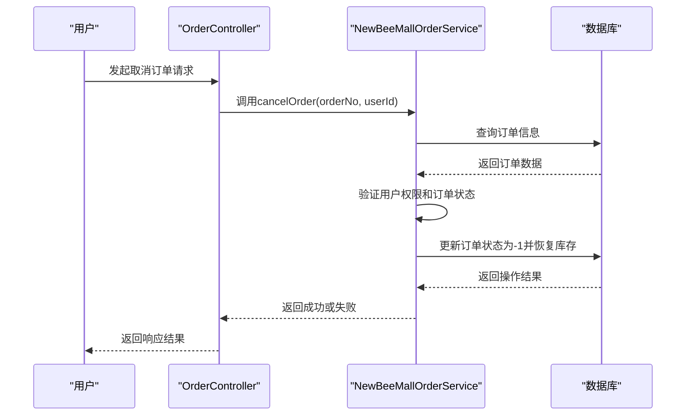
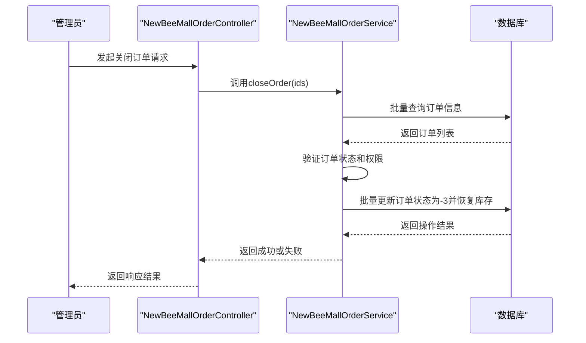
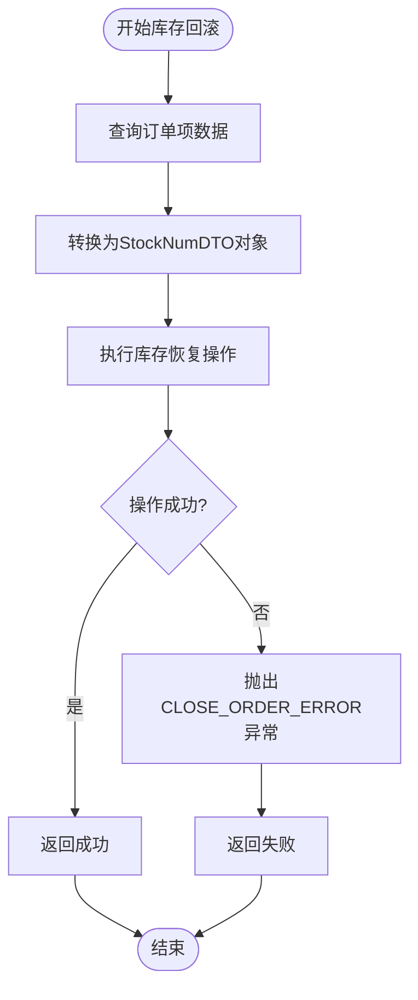
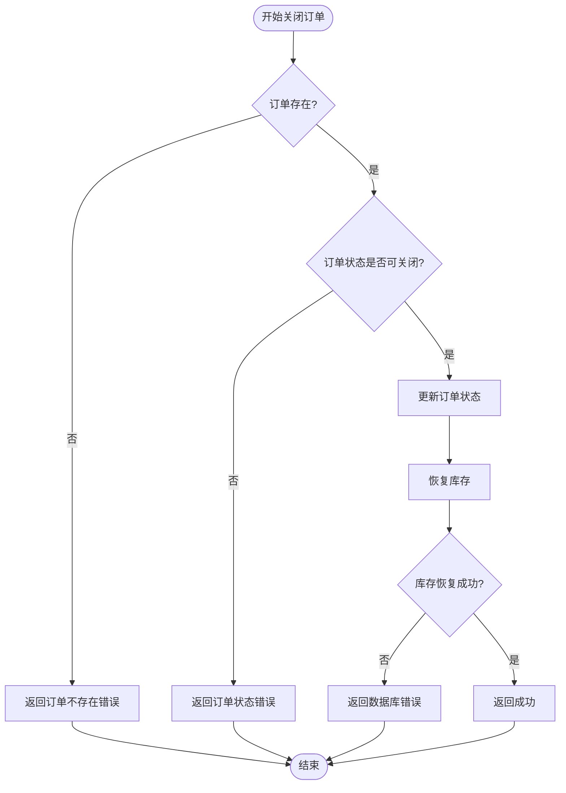
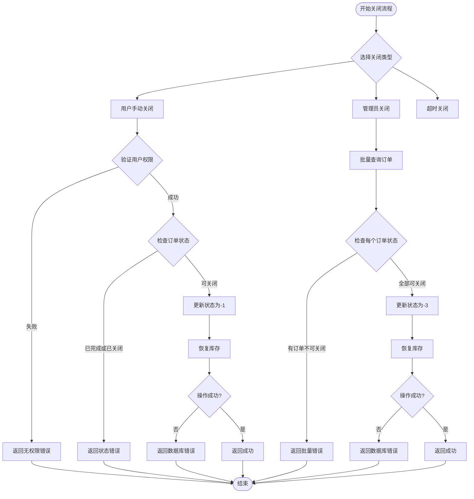

# 关闭流程

<cite>
**本文档引用文件**   
- [NewBeeMallOrderStatusEnum.java](file://src/main/java/ltd/newbee/mall/common/NewBeeMallOrderStatusEnum.java)
- [NewBeeMallOrderServiceImpl.java](file://src/main/java/ltd/newbee/mall/service/impl/NewBeeMallOrderServiceImpl.java)
- [OrderController.java](file://src/main/java/ltd/newbee/mall/controller/mall/OrderController.java)
- [NewBeeMallOrderController.java](file://src/main/java/ltd/newbee/mall/controller/admin/NewBeeMallOrderController.java)
- [NewBeeMallOrderMapper.java](file://src/main/java/ltd/newbee/mall/dao/NewBeeMallOrderMapper.java)
- [NewBeeMallOrderMapper.xml](file://src/main/resources/mapper/NewBeeMallOrderMapper.xml)
- [NewBeeMallGoodsMapper.java](file://src/main/java/ltd/newbee/mall/dao/NewBeeMallGoodsMapper.java)
</cite>

## 目录
1. [订单关闭流程概述](#订单关闭流程概述)
2. [订单状态定义](#订单状态定义)
3. [关闭方式与权限控制](#关闭方式与权限控制)
4. [库存回滚机制](#库存回滚机制)
5. [状态校验逻辑](#状态校验逻辑)
6. [关闭流程决策树](#关闭流程决策树)
7. [异常处理与补偿策略](#异常处理与补偿策略)

## 订单关闭流程概述

newbee-mall系统的订单关闭流程支持三种场景：用户手动关闭、超时自动关闭和管理员（商家）强制关闭。系统通过`NewBeeMallOrderStatusEnum`枚举定义了订单的多种状态，其中负值状态专门用于表示关闭状态。订单关闭操作不仅涉及订单状态的更新，还包括库存的恢复，确保商品库存数据的准确性。

**关闭流程概述**
- [NewBeeMallOrderStatusEnum.java](file://src/main/java/ltd/newbee/mall/common/NewBeeMallOrderStatusEnum.java#L18-L28)
- [NewBeeMallOrderServiceImpl.java](file://src/main/java/ltd/newbee/mall/service/impl/NewBeeMallOrderServiceImpl.java#L147-L183)

## 订单状态定义

系统通过`NewBeeMallOrderStatusEnum`枚举类定义了订单的完整生命周期状态，其中负值状态专门用于表示订单的关闭原因：

- **0 (待支付)**: 订单已创建，等待用户支付
- **1 (已支付)**: 用户已完成支付，等待商家配货
- **2 (配货完成)**: 商家已完成配货，等待出库
- **3 (出库成功)**: 订单已发货，等待用户确认收货
- **4 (交易成功)**: 用户已确认收货，交易完成
- **-1 (手动关闭)**: 由用户主动取消订单
- **-2 (超时关闭)**: 订单因超时未支付而被系统自动关闭
- **-3 (商家关闭)**: 由管理员或商家强制关闭订单

这些状态值在订单的整个生命周期中起着关键作用，决定了订单可以执行的操作和流转方向。

**订单状态定义**
- [NewBeeMallOrderStatusEnum.java](file://src/main/java/ltd/newbee/mall/common/NewBeeMallOrderStatusEnum.java#L18-L28)

## 关闭方式与权限控制

系统提供了三种不同的订单关闭方式，每种方式对应不同的触发条件和权限控制：

### 用户手动关闭 (cancelOrder)

用户可以在订单未支付完成前，通过前端界面主动取消订单。此操作由`OrderController`中的`cancelOrder`方法处理，该方法通过`@PutMapping("/orders/{orderNo}/cancel")`注解暴露为REST API端点。

**Diagram sources**
- [OrderController.java](file://src/main/java/ltd/newbee/mall/controller/mall/OrderController.java#L85-L95)
- [NewBeeMallOrderServiceImpl.java](file://src/main/java/ltd/newbee/mall/service/impl/NewBeeMallOrderServiceImpl.java#L327-L349)

### 管理员关闭 (closeOrder)

管理员可以在后台管理系统中批量关闭订单。此操作由`NewBeeMallOrderController`中的`closeOrder`方法处理，该方法通过`@RequestMapping(value = "/orders/close", method = RequestMethod.POST)`注解暴露为管理API端点。

**Diagram sources**
- [NewBeeMallOrderController.java](file://src/main/java/ltd/newbee/mall/controller/admin/NewBeeMallOrderController.java#L133-L145)
- [NewBeeMallOrderServiceImpl.java](file://src/main/java/ltd/newbee/mall/service/impl/NewBeeMallOrderServiceImpl.java#L147-L183)

### 超时关闭

虽然当前代码中没有直接实现超时关闭的定时任务，但系统已经为这种场景预留了状态码-2（超时关闭）。通常，超时关闭会通过一个定时任务来实现，该任务会定期扫描创建时间超过一定期限且状态仍为"待支付"的订单，并将其状态更新为-2。

**关闭方式与权限控制**
- [OrderController.java](file://src/main/java/ltd/newbee/mall/controller/mall/OrderController.java#L85-L95)
- [NewBeeMallOrderController.java](file://src/main/java/ltd/newbee/mall/controller/admin/NewBeeMallOrderController.java#L133-L145)
- [NewBeeMallOrderServiceImpl.java](file://src/main/java/ltd/newbee/mall/service/impl/NewBeeMallOrderServiceImpl.java#L147-L183)

## 库存回滚机制

订单关闭的核心业务逻辑之一是库存回滚，确保被锁定的商品库存能够及时释放，供其他用户购买。库存回滚机制主要由`NewBeeMallOrderServiceImpl`中的`recoverStockNum`方法实现。

### 实现流程

1. **查询订单项**: 根据订单ID列表，从`newBeeMallOrderItemMapper`中查询对应的订单项数据
2. **数据转换**: 将订单项数据转换为`StockNumDTO`对象列表，该对象包含了商品ID和需要恢复的数量
3. **执行库存恢复**: 调用`newBeeMallGoodsMapper`的`recoverStockNum`方法，批量更新商品库存

**Diagram sources**
- [NewBeeMallOrderServiceImpl.java](file://src/main/java/ltd/newbee/mall/service/impl/NewBeeMallOrderServiceImpl.java#L415-L428)
- [NewBeeMallGoodsMapper.java](file://src/main/java/ltd/newbee/mall/dao/NewBeeMallGoodsMapper.java#L49)

### 数据库操作

在`NewBeeMallGoodsMapper.xml`中，`recoverStockNum`方法对应的SQL语句会执行批量更新操作，将订单项中记录的商品数量加回到对应商品的库存中。

**库存回滚机制**
- [NewBeeMallOrderServiceImpl.java](file://src/main/java/ltd/newbee/mall/service/impl/NewBeeMallOrderServiceImpl.java#L415-L428)
- [NewBeeMallGoodsMapper.java](file://src/main/java/ltd/newbee/mall/dao/NewBeeMallGoodsMapper.java#L49)

## 状态校验逻辑

系统在执行订单关闭操作前，会进行严格的状态校验，防止对已完成或已关闭的订单进行重复关闭操作。

### 用户关闭校验

当用户尝试关闭订单时，系统会检查：
- 订单是否属于当前用户
- 订单状态是否为"已完成"(4)、"手动关闭"(-1)、"超时关闭"(-2)或"商家关闭"(-3)

如果订单处于上述任何一种状态，系统将返回"订单状态错误"的提示。

### 管理员关闭校验

当管理员尝试关闭订单时，系统会检查：
- 订单是否已被删除(isDeleted=1)
- 订单状态是否为"已完成"(4)或任何负值状态(<0)

如果订单处于上述任何一种状态，系统将返回相应的错误提示，阻止关闭操作。

**Diagram sources**
- [NewBeeMallOrderServiceImpl.java](file://src/main/java/ltd/newbee/mall/service/impl/NewBeeMallOrderServiceImpl.java#L335-L339)
- [NewBeeMallOrderServiceImpl.java](file://src/main/java/ltd/newbee/mall/service/impl/NewBeeMallOrderServiceImpl.java#L161-L163)

**状态校验逻辑**
- [NewBeeMallOrderServiceImpl.java](file://src/main/java/ltd/newbee/mall/service/impl/NewBeeMallOrderServiceImpl.java#L335-L339)
- [NewBeeMallOrderServiceImpl.java](file://src/main/java/ltd/newbee/mall/service/impl/NewBeeMallOrderServiceImpl.java#L161-L163)

## 关闭流程决策树

以下决策树描述了订单关闭流程的完整判断逻辑：

**Diagram sources**
- [NewBeeMallOrderServiceImpl.java](file://src/main/java/ltd/newbee/mall/service/impl/NewBeeMallOrderServiceImpl.java#L327-L349)
- [NewBeeMallOrderServiceImpl.java](file://src/main/java/ltd/newbee/mall/service/impl/NewBeeMallOrderServiceImpl.java#L147-L183)

## 异常处理与补偿策略

系统在订单关闭流程中实现了完善的异常处理机制，确保数据的一致性和用户体验。

### 主要异常类型

- **权限异常**: 当用户尝试操作不属于自己的订单时，抛出`NO_PERMISSION_ERROR`
- **状态异常**: 当尝试关闭已完成或已关闭的订单时，抛出`ORDER_STATUS_ERROR`
- **数据库异常**: 当数据库操作失败时，抛出`DB_ERROR`
- **库存异常**: 当库存恢复失败时，抛出`CLOSE_ORDER_ERROR`

### 补偿策略

由于订单关闭操作使用了`@Transactional`注解，整个操作（包括状态更新和库存恢复）在一个数据库事务中执行。这意味着如果任何一步操作失败，整个事务将回滚，确保数据的一致性。

对于库存恢复失败的情况，系统会抛出`CLOSE_ORDER_ERROR`异常，前端应捕获此异常并向用户显示友好的错误提示。由于事务的原子性，订单状态不会被更新，用户可以稍后重试关闭操作。

**异常处理与补偿策略**
- [NewBeeMallOrderServiceImpl.java](file://src/main/java/ltd/newbee/mall/service/impl/NewBeeMallOrderServiceImpl.java#L423-L424)
- [NewBeeMallOrderServiceImpl.java](file://src/main/java/ltd/newbee/mall/service/impl/NewBeeMallOrderServiceImpl.java#L59-L60)