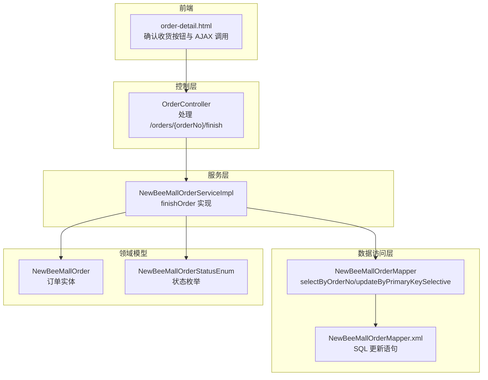
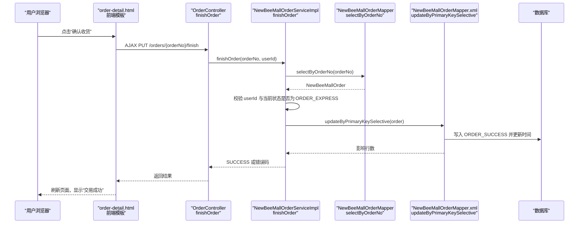
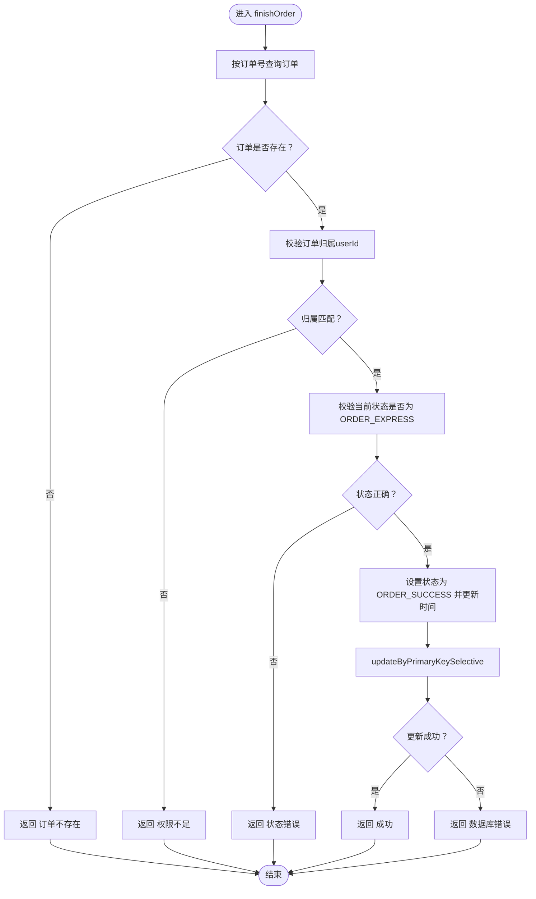
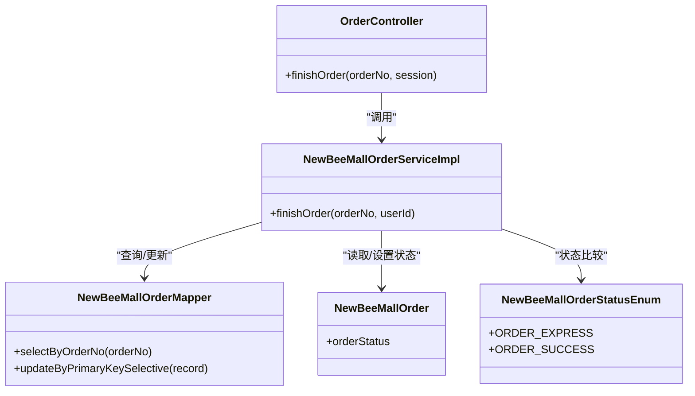

# 完成流程

<cite>
**本文引用的文件**
- [NewBeeMallOrderStatusEnum.java](file://src/main/java/ltd/newbee/mall/common/NewBeeMallOrderStatusEnum.java)
- [OrderController.java](file://src/main/java/ltd/newbee/mall/controller/mall/OrderController.java)
- [NewBeeMallOrderServiceImpl.java](file://src/main/java/ltd/newbee/mall/service/impl/NewBeeMallOrderServiceImpl.java)
- [NewBeeMallOrder.java](file://src/main/java/ltd/newbee/mall/entity/NewBeeMallOrder.java)
- [NewBeeMallOrderMapper.java](file://src/main/java/ltd/newbee/mall/dao/NewBeeMallOrderMapper.java)
- [NewBeeMallOrderMapper.xml](file://src/main/resources/mapper/NewBeeMallOrderMapper.xml)
- [order-detail.html](file://src/main/resources/templates/mall/order-detail.html)
</cite>

## 目录
1. [引言](#引言)
2. [项目结构](#项目结构)
3. [核心组件](#核心组件)
4. [架构总览](#架构总览)
5. [详细组件分析](#详细组件分析)
6. [依赖关系分析](#依赖关系分析)
7. [性能考量](#性能考量)
8. [故障排查指南](#故障排查指南)
9. [结论](#结论)

## 引言
本文聚焦于 newbee-mall 系统中“订单完成”流程，即从订单出库成功（ORDER_EXPRESS）到交易成功（ORDER_SUCCESS）的最终状态转换。依据订单状态枚举定义，状态转换路径为 ORDER_EXPRESS(3) → ORDER_SUCCESS(4)。用户在订单出库后通过前端“确认收货”按钮触发完成流程，服务端在完成身份校验与状态校验后，将订单状态更新为交易成功，并持久化到数据库。交易成功后，订单不可再进行任何操作（如取消、再次确认收货等），这是系统的重要业务约束。

## 项目结构
围绕订单完成流程的关键代码分布在以下层次：
- 控制层：处理前端请求，校验会话与参数，调用服务层。
- 服务层：实现业务逻辑，包括身份校验、状态校验与数据库更新。
- 数据访问层：提供订单查询与更新能力。
- 实体与映射：订单实体与 MyBatis 映射文件。
- 前端模板：展示订单状态与交互按钮，触发完成操作。

图表来源
- [OrderController.java](file://src/main/java/ltd/newbee/mall/controller/mall/OrderController.java#L97-L107)
- [NewBeeMallOrderServiceImpl.java](file://src/main/java/ltd/newbee/mall/service/impl/NewBeeMallOrderServiceImpl.java#L351-L372)
- [NewBeeMallOrderMapper.java](file://src/main/java/ltd/newbee/mall/dao/NewBeeMallOrderMapper.java#L26-L26)
- [NewBeeMallOrderMapper.xml](file://src/main/resources/mapper/NewBeeMallOrderMapper.xml#L229-L268)
- [NewBeeMallOrder.java](file://src/main/java/ltd/newbee/mall/entity/NewBeeMallOrder.java#L99-L105)
- [NewBeeMallOrderStatusEnum.java](file://src/main/java/ltd/newbee/mall/common/NewBeeMallOrderStatusEnum.java#L18-L28)
- [order-detail.html](file://src/main/resources/templates/mall/order-detail.html#L38-L46)

章节来源
- [OrderController.java](file://src/main/java/ltd/newbee/mall/controller/mall/OrderController.java#L97-L107)
- [NewBeeMallOrderServiceImpl.java](file://src/main/java/ltd/newbee/mall/service/impl/NewBeeMallOrderServiceImpl.java#L351-L372)
- [NewBeeMallOrderMapper.java](file://src/main/java/ltd/newbee/mall/dao/NewBeeMallOrderMapper.java#L26-L26)
- [NewBeeMallOrderMapper.xml](file://src/main/resources/mapper/NewBeeMallOrderMapper.xml#L229-L268)
- [NewBeeMallOrder.java](file://src/main/java/ltd/newbee/mall/entity/NewBeeMallOrder.java#L99-L105)
- [NewBeeMallOrderStatusEnum.java](file://src/main/java/ltd/newbee/mall/common/NewBeeMallOrderStatusEnum.java#L18-L28)
- [order-detail.html](file://src/main/resources/templates/mall/order-detail.html#L38-L46)

## 核心组件
- 订单状态枚举：定义 ORDER_EXPRESS(3) 与 ORDER_SUCCESS(4)，用于状态比较与显示。
- 控制器接口：暴露 PUT /orders/{orderNo}/finish，接收会话中的用户标识，调用服务层完成订单。
- 服务实现：完成订单时先校验订单归属（userId），再校验当前状态必须为出库状态（ORDER_EXPRESS），最后更新为交易成功（ORDER_SUCCESS）。
- 数据访问：通过 selectByOrderNo 查询订单，updateByPrimaryKeySelective 更新订单状态与更新时间。
- 前端模板：当订单状态为出库时显示“确认收货”，点击后通过 AJAX 调用后端完成接口。

章节来源
- [NewBeeMallOrderStatusEnum.java](file://src/main/java/ltd/newbee/mall/common/NewBeeMallOrderStatusEnum.java#L18-L28)
- [OrderController.java](file://src/main/java/ltd/newbee/mall/controller/mall/OrderController.java#L97-L107)
- [NewBeeMallOrderServiceImpl.java](file://src/main/java/ltd/newbee/mall/service/impl/NewBeeMallOrderServiceImpl.java#L351-L372)
- [NewBeeMallOrderMapper.java](file://src/main/java/ltd/newbee/mall/dao/NewBeeMallOrderMapper.java#L26-L26)
- [NewBeeMallOrderMapper.xml](file://src/main/resources/mapper/NewBeeMallOrderMapper.xml#L229-L268)
- [order-detail.html](file://src/main/resources/templates/mall/order-detail.html#L38-L46)

## 架构总览
下面的序列图展示了从用户点击“确认收货”到数据库更新的完整交互过程，包括身份验证与状态校验。

图表来源
- [order-detail.html](file://src/main/resources/templates/mall/order-detail.html#L262-L284)
- [OrderController.java](file://src/main/java/ltd/newbee/mall/controller/mall/OrderController.java#L97-L107)
- [NewBeeMallOrderServiceImpl.java](file://src/main/java/ltd/newbee/mall/service/impl/NewBeeMallOrderServiceImpl.java#L351-L372)
- [NewBeeMallOrderMapper.java](file://src/main/java/ltd/newbee/mall/dao/NewBeeMallOrderMapper.java#L26-L26)
- [NewBeeMallOrderMapper.xml](file://src/main/resources/mapper/NewBeeMallOrderMapper.xml#L229-L268)

## 详细组件分析

### 控制器：OrderController.finishOrder
- 入口：PUT /orders/{orderNo}/finish
- 行为：从会话中取出用户标识，调用服务层 finishOrder；根据返回结果生成统一响应。
- 关键点：仅在订单状态为 ORDER_EXPRESS 时允许完成；否则返回状态错误。

章节来源
- [OrderController.java](file://src/main/java/ltd/newbee/mall/controller/mall/OrderController.java#L97-L107)

### 服务层：NewBeeMallOrderServiceImpl.finishOrder
- 查询订单：通过订单号查询订单实体。
- 身份验证：校验订单所属用户是否与当前登录用户一致。
- 状态校验：仅当订单状态为 ORDER_EXPRESS(3) 时才允许更新为 ORDER_SUCCESS(4)。
- 更新持久化：设置订单状态为 ORDER_SUCCESS(4)，更新时间，写回数据库。
- 错误处理：权限不足、状态不符、数据库异常均返回相应错误码。

图表来源
- [NewBeeMallOrderServiceImpl.java](file://src/main/java/ltd/newbee/mall/service/impl/NewBeeMallOrderServiceImpl.java#L351-L372)
- [NewBeeMallOrderStatusEnum.java](file://src/main/java/ltd/newbee/mall/common/NewBeeMallOrderStatusEnum.java#L18-L28)
- [NewBeeMallOrderMapper.xml](file://src/main/resources/mapper/NewBeeMallOrderMapper.xml#L229-L268)

章节来源
- [NewBeeMallOrderServiceImpl.java](file://src/main/java/ltd/newbee/mall/service/impl/NewBeeMallOrderServiceImpl.java#L351-L372)

### 数据访问层：NewBeeMallOrderMapper 与 XML
- selectByOrderNo：按订单号查询未删除的订单记录。
- updateByPrimaryKeySelective：按需更新订单字段，包括 order_status 与 update_time。
- SQL 映射：将 Java 层设置的状态值写入数据库表字段。

章节来源
- [NewBeeMallOrderMapper.java](file://src/main/java/ltd/newbee/mall/dao/NewBeeMallOrderMapper.java#L26-L26)
- [NewBeeMallOrderMapper.xml](file://src/main/resources/mapper/NewBeeMallOrderMapper.xml#L229-L268)

### 前端交互：order-detail.html
- 当订单状态为 ORDER_EXPRESS(3) 时，显示“确认收货”按钮。
- 点击后通过 AJAX 发起 PUT 请求到 /orders/{orderNo}/finish。
- 成功后刷新页面，状态显示为“交易成功”。

章节来源
- [order-detail.html](file://src/main/resources/templates/mall/order-detail.html#L38-L46)
- [order-detail.html](file://src/main/resources/templates/mall/order-detail.html#L262-L284)

### 订单实体：NewBeeMallOrder
- 字段包含 orderStatus，用于持久化订单状态。
- 服务层通过 setter 设置新状态并写回数据库。

章节来源
- [NewBeeMallOrder.java](file://src/main/java/ltd/newbee/mall/entity/NewBeeMallOrder.java#L99-L105)

## 依赖关系分析
- 控制器依赖服务层接口，服务层依赖数据访问层接口与实体。
- 服务层依赖状态枚举进行状态比较。
- 前端模板依赖控制器提供的接口路径与会话中的用户标识。

图表来源
- [OrderController.java](file://src/main/java/ltd/newbee/mall/controller/mall/OrderController.java#L97-L107)
- [NewBeeMallOrderServiceImpl.java](file://src/main/java/ltd/newbee/mall/service/impl/NewBeeMallOrderServiceImpl.java#L351-L372)
- [NewBeeMallOrderMapper.java](file://src/main/java/ltd/newbee/mall/dao/NewBeeMallOrderMapper.java#L26-L26)
- [NewBeeMallOrder.java](file://src/main/java/ltd/newbee/mall/entity/NewBeeMallOrder.java#L99-L105)
- [NewBeeMallOrderStatusEnum.java](file://src/main/java/ltd/newbee/mall/common/NewBeeMallOrderStatusEnum.java#L18-L28)

## 性能考量
- 接口幂等性：完成订单接口应具备幂等特性，避免重复调用导致状态异常。可在服务层增加幂等键与状态缓存校验。
- 批量操作：若未来扩展批量完成订单，建议在服务层聚合校验后再一次性更新，减少数据库往返。
- 前端体验：完成成功后立即刷新页面可确保状态同步，但也可考虑局部更新 DOM 以减少全页刷新开销。

## 故障排查指南
- 权限错误：当订单归属校验失败时，返回权限不足。请检查会话是否正确、传入的 userId 是否匹配。
- 状态错误：当订单状态不是 ORDER_EXPRESS(3) 时，返回状态错误。请确认订单是否已出库。
- 数据库错误：当更新失败时，返回数据库错误。请检查数据库连接、事务与唯一索引约束。
- 订单不存在：当按订单号查询不到记录时，返回订单不存在。请确认订单号是否正确。

章节来源
- [NewBeeMallOrderServiceImpl.java](file://src/main/java/ltd/newbee/mall/service/impl/NewBeeMallOrderServiceImpl.java#L351-L372)

## 结论
newbee-mall 的订单完成流程严格遵循 ORDER_EXPRESS(3) → ORDER_SUCCESS(4) 的状态转换路径。前端在订单出库后显示“确认收货”按钮，用户点击后通过 AJAX 调用后端接口；后端在完成用户身份校验与状态校验后，将订单状态更新为交易成功并持久化。交易成功后，订单不可再进行任何操作，体现了系统的业务一致性与安全性。建议在生产环境中进一步完善幂等性与错误重试策略，以提升用户体验与系统稳定性。