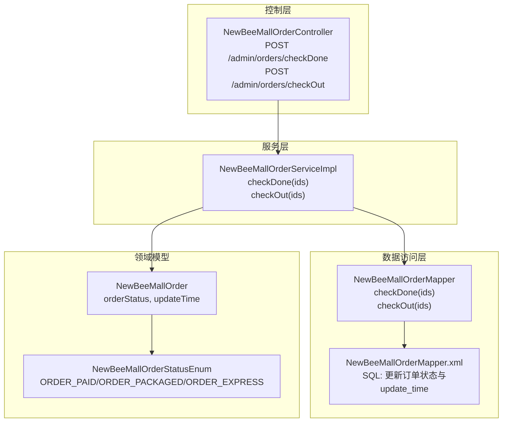
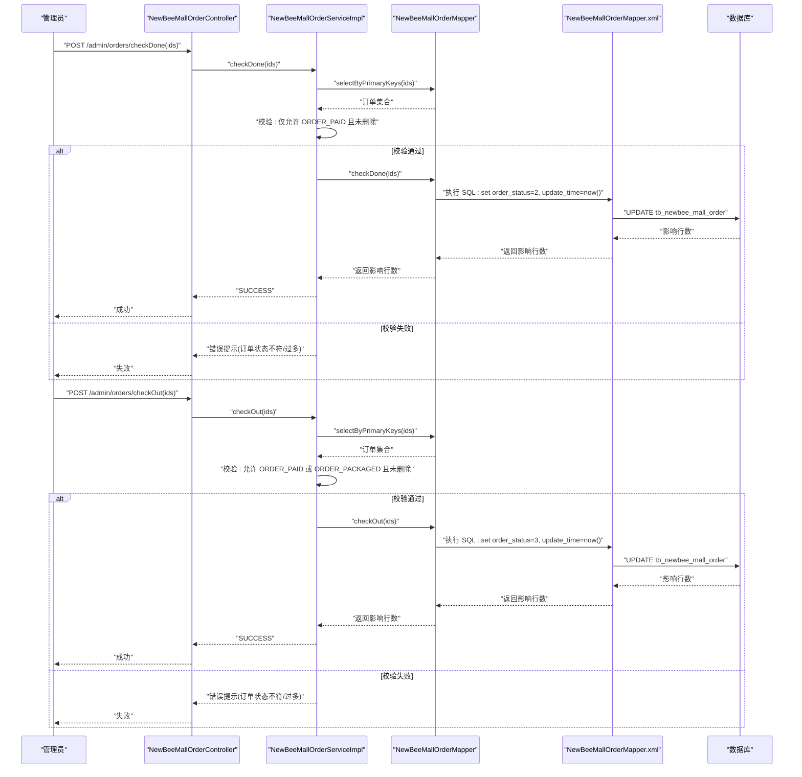
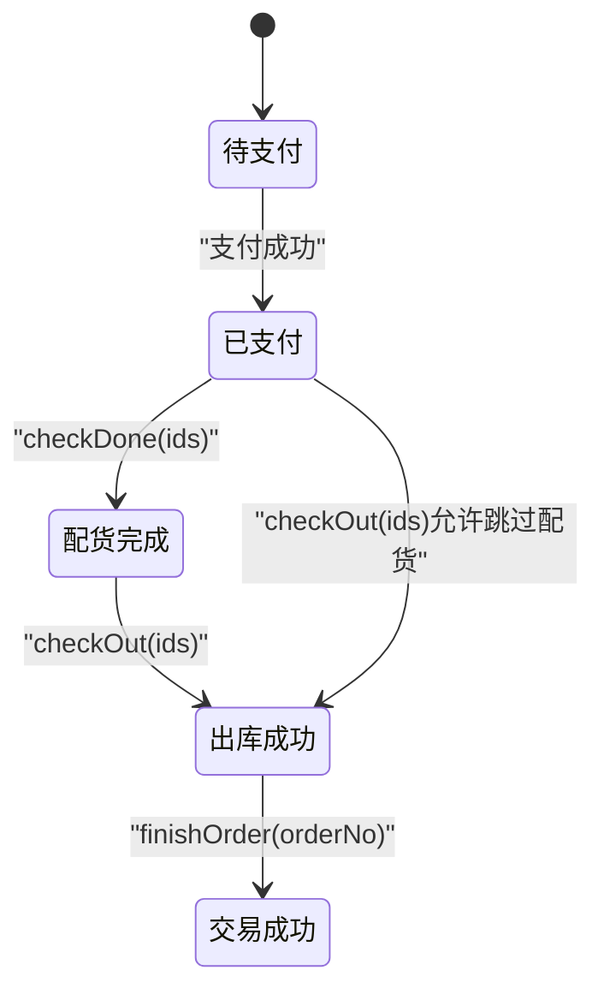
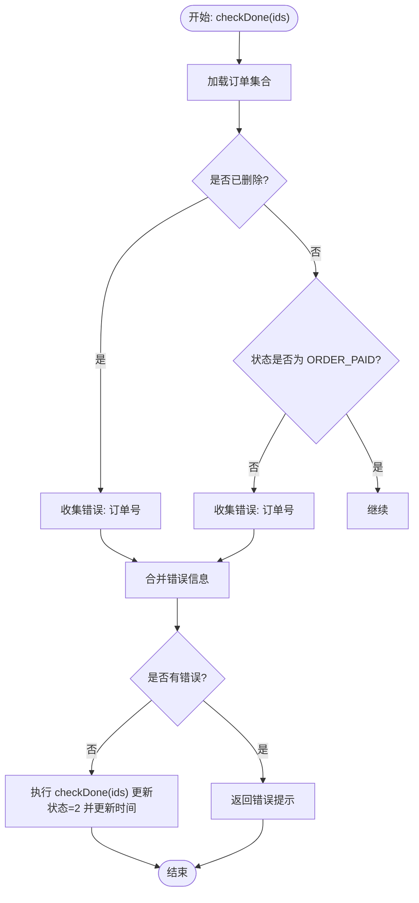
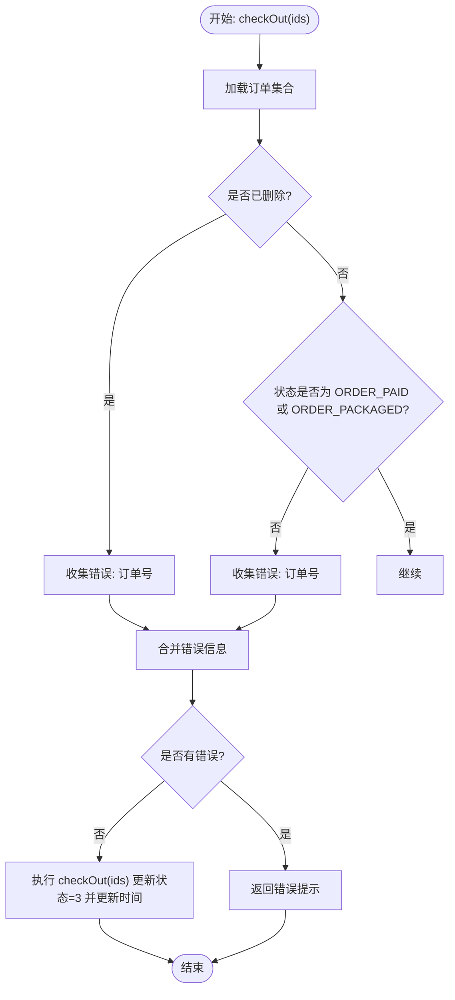
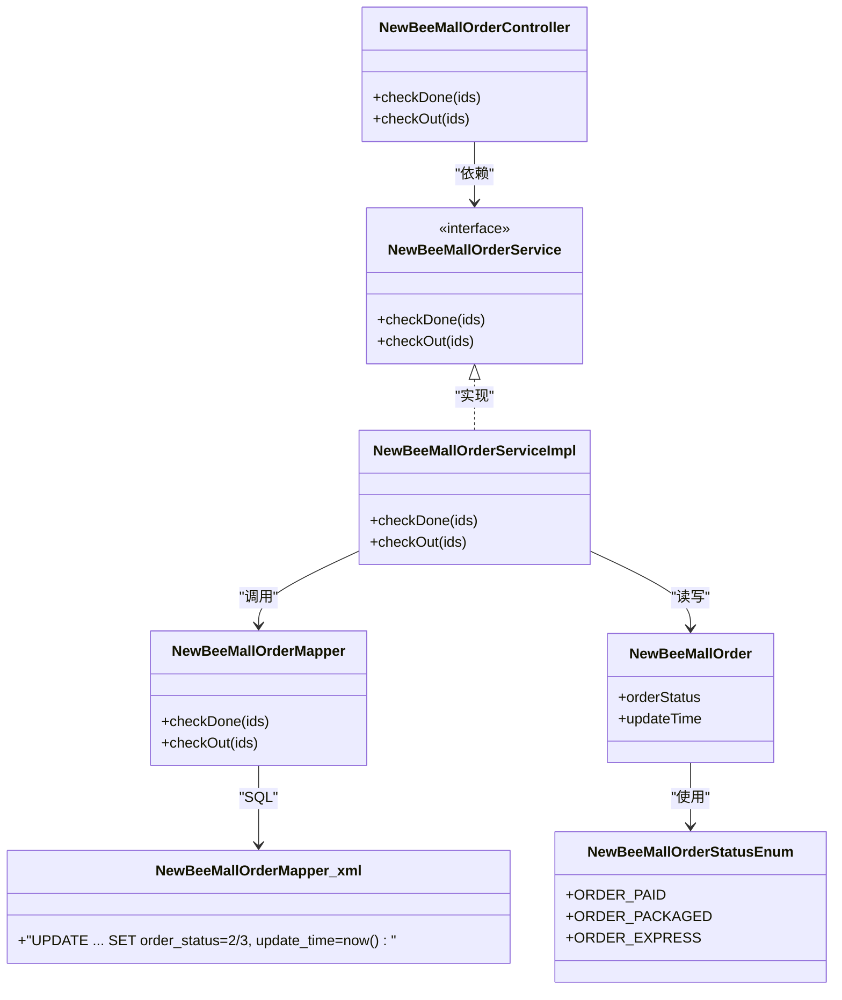

# 履约流程

<cite>
**本文引用的文件**
- [NewBeeMallOrderStatusEnum.java](file://src/main/java/ltd/newbee/mall/common/NewBeeMallOrderStatusEnum.java)
- [NewBeeMallOrderServiceImpl.java](file://src/main/java/ltd/newbee/mall/service/impl/NewBeeMallOrderServiceImpl.java)
- [NewBeeMallOrderController.java](file://src/main/java/ltd/newbee/mall/controller/admin/NewBeeMallOrderController.java)
- [NewBeeMallOrder.java](file://src/main/java/ltd/newbee/mall/entity/NewBeeMallOrder.java)
- [NewBeeMallOrderMapper.java](file://src/main/java/ltd/newbee/mall/dao/NewBeeMallOrderMapper.java)
- [NewBeeMallOrderMapper.xml](file://src/main/resources/mapper/NewBeeMallOrderMapper.xml)
- [ServiceResultEnum.java](file://src/main/java/ltd/newbee/mall/common/ServiceResultEnum.java)
- [PayStatusEnum.java](file://src/main/java/ltd/newbee/mall/common/PayStatusEnum.java)
- [PayTypeEnum.java](file://src/main/java/ltd/newbee/mall/common/PayTypeEnum.java)
</cite>

## 目录
1. [引言](#引言)
2. [项目结构](#项目结构)
3. [核心组件](#核心组件)
4. [架构总览](#架构总览)
5. [详细组件分析](#详细组件分析)
6. [依赖关系分析](#依赖关系分析)
7. [性能考量](#性能考量)
8. [故障排查指南](#故障排查指南)
9. [结论](#结论)

## 引言
本文围绕 newbee-mall 的“履约流程”，系统性梳理从“已支付”到“出库完成”的后台管理操作路径，重点覆盖以下目标：
- 基于订单状态枚举定义，明确 ORDER_PAID(1)→ORDER_PACKAGED(2)→ORDER_EXPRESS(3) 的状态流转。
- 解析后台管理员通过 checkDone 和 checkOut 方法对订单进行配货与出库的业务逻辑与校验规则。
- 结合服务层实现，说明批量操作的事务控制、状态前置校验、错误提示策略，以及数据更新（如 updateTime）机制。
- 提供履约流程状态机图与关键调用序列图，帮助读者快速掌握端到端处理链路。

## 项目结构
与履约流程直接相关的模块与文件如下：
- 控制器层：Admin 订单控制器负责接收批量操作请求并转发给服务层。
- 服务层：订单服务实现负责状态校验、批量更新与事务控制。
- 数据访问层：订单 Mapper 定义批量更新 SQL，映射文件实现具体 SQL。
- 实体与枚举：订单实体包含状态与时间字段；状态/支付类型枚举提供语义化常量。

图表来源
- [NewBeeMallOrderController.java](file://src/main/java/ltd/newbee/mall/controller/admin/NewBeeMallOrderController.java#L96-L128)
- [NewBeeMallOrderServiceImpl.java](file://src/main/java/ltd/newbee/mall/service/impl/NewBeeMallOrderServiceImpl.java#L75-L145)
- [NewBeeMallOrderMapper.java](file://src/main/java/ltd/newbee/mall/dao/NewBeeMallOrderMapper.java#L36-L42)
- [NewBeeMallOrderMapper.xml](file://src/main/resources/mapper/NewBeeMallOrderMapper.xml#L205-L220)
- [NewBeeMallOrder.java](file://src/main/java/ltd/newbee/mall/entity/NewBeeMallOrder.java#L99-L145)
- [NewBeeMallOrderStatusEnum.java](file://src/main/java/ltd/newbee/mall/common/NewBeeMallOrderStatusEnum.java#L18-L28)

章节来源
- [NewBeeMallOrderController.java](file://src/main/java/ltd/newbee/mall/controller/admin/NewBeeMallOrderController.java#L96-L128)
- [NewBeeMallOrderServiceImpl.java](file://src/main/java/ltd/newbee/mall/service/impl/NewBeeMallOrderServiceImpl.java#L75-L145)
- [NewBeeMallOrderMapper.xml](file://src/main/resources/mapper/NewBeeMallOrderMapper.xml#L205-L220)

## 核心组件
- 订单状态枚举：提供 ORDER_PAID(1)、ORDER_PACKAGED(2)、ORDER_EXPRESS(3) 等状态常量，用于服务层与前端展示。
- 订单实体：包含 orderStatus、updateTime 等字段，支撑状态变更与时间戳更新。
- 订单服务实现：提供 checkDone 与 checkOut 的批量状态变更逻辑，含前置校验与事务控制。
- 订单 Mapper 与 XML：提供批量更新 SQL，分别将订单状态置为配货完成与出库完成，并更新 updateTime。

章节来源
- [NewBeeMallOrderStatusEnum.java](file://src/main/java/ltd/newbee/mall/common/NewBeeMallOrderStatusEnum.java#L18-L28)
- [NewBeeMallOrder.java](file://src/main/java/ltd/newbee/mall/entity/NewBeeMallOrder.java#L99-L145)
- [NewBeeMallOrderServiceImpl.java](file://src/main/java/ltd/newbee/mall/service/impl/NewBeeMallOrderServiceImpl.java#L75-L145)
- [NewBeeMallOrderMapper.xml](file://src/main/resources/mapper/NewBeeMallOrderMapper.xml#L205-L220)

## 架构总览
履约流程由“后台管理接口 → 服务层校验与事务 → 数据层批量更新”构成，状态变更严格遵循 ORDER_PAID → ORDER_PACKAGED → ORDER_EXPRESS 的顺序。

图表来源
- [NewBeeMallOrderController.java](file://src/main/java/ltd/newbee/mall/controller/admin/NewBeeMallOrderController.java#L96-L128)
- [NewBeeMallOrderServiceImpl.java](file://src/main/java/ltd/newbee/mall/service/impl/NewBeeMallOrderServiceImpl.java#L75-L145)
- [NewBeeMallOrderMapper.java](file://src/main/java/ltd/newbee/mall/dao/NewBeeMallOrderMapper.java#L36-L42)
- [NewBeeMallOrderMapper.xml](file://src/main/resources/mapper/NewBeeMallOrderMapper.xml#L205-L220)

## 详细组件分析

### 状态机与流转规则
- 状态定义：ORDER_PAID(1)、ORDER_PACKAGED(2)、ORDER_EXPRESS(3)。
- 流转方向：仅允许从前一状态向后一状态推进，即 ORDER_PAID → ORDER_PACKAGED → ORDER_EXPRESS。
- 触发条件：
  - 配货完成：仅当订单处于 ORDER_PAID 且未删除。
  - 出库完成：允许 ORDER_PAID 或 ORDER_PACKAGED 且未删除。
- 错误提示：当批量中存在不符合条件的订单时，服务层会拼接错误信息返回，避免部分失败。

图表来源
- [NewBeeMallOrderStatusEnum.java](file://src/main/java/ltd/newbee/mall/common/NewBeeMallOrderStatusEnum.java#L18-L28)
- [NewBeeMallOrderServiceImpl.java](file://src/main/java/ltd/newbee/mall/service/impl/NewBeeMallOrderServiceImpl.java#L75-L145)

章节来源
- [NewBeeMallOrderStatusEnum.java](file://src/main/java/ltd/newbee/mall/common/NewBeeMallOrderStatusEnum.java#L18-L28)
- [NewBeeMallOrderServiceImpl.java](file://src/main/java/ltd/newbee/mall/service/impl/NewBeeMallOrderServiceImpl.java#L75-L145)

### 配货完成（checkDone）
- 输入：批量订单 ID 数组。
- 查询与校验：
  - 读取订单集合，过滤已删除订单。
  - 仅允许 ORDER_PAID 的订单进入下一步。
- 执行更新：
  - 调用 checkDone(ids)，将订单状态置为 ORDER_PACKAGED(2)，并更新 updateTime。
- 错误处理：
  - 若存在非 ORDER_PAID 或已删除的订单，返回拼接的错误信息，提示“订单的状态不是支付成功无法执行出库操作”。
  - 若批量过大导致提示长度受限，返回“你选择了太多状态不是支付成功的订单，无法执行配货完成操作”。

图表来源
- [NewBeeMallOrderServiceImpl.java](file://src/main/java/ltd/newbee/mall/service/impl/NewBeeMallOrderServiceImpl.java#L75-L109)
- [NewBeeMallOrderMapper.xml](file://src/main/resources/mapper/NewBeeMallOrderMapper.xml#L205-L212)

章节来源
- [NewBeeMallOrderServiceImpl.java](file://src/main/java/ltd/newbee/mall/service/impl/NewBeeMallOrderServiceImpl.java#L75-L109)
- [NewBeeMallOrderMapper.xml](file://src/main/resources/mapper/NewBeeMallOrderMapper.xml#L205-L212)

### 出库完成（checkOut）
- 输入：批量订单 ID 数组。
- 查询与校验：
  - 读取订单集合，过滤已删除订单。
  - 仅允许 ORDER_PAID 或 ORDER_PACKAGED 的订单进入下一步。
- 执行更新：
  - 调用 checkOut(ids)，将订单状态置为 ORDER_EXPRESS(3)，并更新 updateTime。
- 错误处理：
  - 若存在非 ORDER_PAID 且非 ORDER_PACKAGED 或已删除的订单，返回拼接的错误信息，提示“订单的状态不是支付成功或配货完成无法执行出库操作”。
  - 若批量过大导致提示长度受限，返回“你选择了太多状态不是支付成功或配货完成的订单，无法执行出库操作”。

图表来源
- [NewBeeMallOrderServiceImpl.java](file://src/main/java/ltd/newbee/mall/service/impl/NewBeeMallOrderServiceImpl.java#L111-L145)
- [NewBeeMallOrderMapper.xml](file://src/main/resources/mapper/NewBeeMallOrderMapper.xml#L213-L219)

章节来源
- [NewBeeMallOrderServiceImpl.java](file://src/main/java/ltd/newbee/mall/service/impl/NewBeeMallOrderServiceImpl.java#L111-L145)
- [NewBeeMallOrderMapper.xml](file://src/main/resources/mapper/NewBeeMallOrderMapper.xml#L213-L219)

### 接口与控制器交互
- 配货完成接口：POST /admin/orders/checkDone，接收 Long[] ids，调用服务层 checkDone。
- 出库完成接口：POST /admin/orders/checkOut，接收 Long[] ids，调用服务层 checkOut。
- 参数校验：ids 非空，否则返回参数异常。
- 返回结果：统一包装为 Result，SUCCESS 或 FAIL，FAIL 时携带服务层返回的错误信息。

章节来源
- [NewBeeMallOrderController.java](file://src/main/java/ltd/newbee/mall/controller/admin/NewBeeMallOrderController.java#L96-L128)

### 事务控制与批量更新
- 事务注解：checkDone 与 checkOut 使用 @Transactional，确保批量更新在单事务内执行，保证一致性。
- 批量更新 SQL：Mapper.xml 中分别提供 checkDone 与 checkOut 的批量更新语句，按订单 ID 列表更新状态与 updateTime。
- 影响行数：服务层根据返回的影响行数判断成功与否，若小于 1 则返回数据库错误。

章节来源
- [NewBeeMallOrderServiceImpl.java](file://src/main/java/ltd/newbee/mall/service/impl/NewBeeMallOrderServiceImpl.java#L75-L145)
- [NewBeeMallOrderMapper.xml](file://src/main/resources/mapper/NewBeeMallOrderMapper.xml#L205-L219)

### 数据更新与错误提示
- 数据更新：
  - 状态变更：ORDER_PAID → ORDER_PACKAGED → ORDER_EXPRESS。
  - 时间戳：每次状态变更均更新 updateTime。
- 错误提示：
  - 服务层返回字符串错误信息，包含订单号与原因，便于定位问题。
  - 统一错误枚举：ServiceResultEnum 提供通用错误码与文案，如“订单状态异常”、“数据库错误”等。

章节来源
- [NewBeeMallOrderServiceImpl.java](file://src/main/java/ltd/newbee/mall/service/impl/NewBeeMallOrderServiceImpl.java#L75-L145)
- [ServiceResultEnum.java](file://src/main/java/ltd/newbee/mall/common/ServiceResultEnum.java#L54-L77)

## 依赖关系分析
- 控制器依赖服务层接口，服务层依赖 Mapper 接口与 XML 映射。
- 服务层依赖状态枚举与支付/支付状态枚举，用于状态判断与展示。
- 实体层承载状态与时间戳字段，驱动状态机与更新。

图表来源
- [NewBeeMallOrderController.java](file://src/main/java/ltd/newbee/mall/controller/admin/NewBeeMallOrderController.java#L96-L128)
- [NewBeeMallOrderService.java](file://src/main/java/ltd/newbee/mall/service/NewBeeMallOrderService.java#L38-L52)
- [NewBeeMallOrderServiceImpl.java](file://src/main/java/ltd/newbee/mall/service/impl/NewBeeMallOrderServiceImpl.java#L75-L145)
- [NewBeeMallOrderMapper.java](file://src/main/java/ltd/newbee/mall/dao/NewBeeMallOrderMapper.java#L36-L42)
- [NewBeeMallOrderMapper.xml](file://src/main/resources/mapper/NewBeeMallOrderMapper.xml#L205-L219)
- [NewBeeMallOrder.java](file://src/main/java/ltd/newbee/mall/entity/NewBeeMallOrder.java#L99-L145)
- [NewBeeMallOrderStatusEnum.java](file://src/main/java/ltd/newbee/mall/common/NewBeeMallOrderStatusEnum.java#L18-L28)

## 性能考量
- 批量更新效率：Mapper.xml 使用 foreach 批量更新，减少网络往返与事务开销。
- 事务边界：checkDone 与 checkOut 在同一事务内执行，避免中间态数据不一致。
- 查询优化：selectByPrimaryKeys 一次性拉取所需订单，避免多次往返。
- 错误早返回：在循环阶段尽早收集错误并短路，减少无效数据库操作。

[本节为通用指导，无需列出章节来源]

## 故障排查指南
- “订单的状态不是支付成功无法执行配货完成操作”
  - 可能原因：所选订单中存在非 ORDER_PAID 或已删除订单。
  - 处理建议：筛选仅包含 ORDER_PAID 且未删除的订单再提交。
- “订单的状态不是支付成功或配货完成无法执行出库操作”
  - 可能原因：所选订单中存在既非 ORDER_PAID 也非 ORDER_PACKAGED 的订单。
  - 处理建议：先执行配货完成，再执行出库完成；或仅选择 ORDER_PAID 的订单直接出库。
- “你选择了太多状态不是支付成功或配货完成的订单，无法执行出库操作”
  - 可能原因：批量过大导致提示长度受限。
  - 处理建议：分批提交，减少单次批量大小。
- “数据库错误”
  - 可能原因：批量更新影响行数小于 1。
  - 处理建议：检查订单是否存在、是否被删除、是否被并发修改；重试或回滚后重试。

章节来源
- [NewBeeMallOrderServiceImpl.java](file://src/main/java/ltd/newbee/mall/service/impl/NewBeeMallOrderServiceImpl.java#L75-L145)
- [ServiceResultEnum.java](file://src/main/java/ltd/newbee/mall/common/ServiceResultEnum.java#L54-L77)

## 结论
newbee-mall 的履约流程以“状态机”为核心，通过后台管理接口与服务层校验，实现了从“已支付”到“配货完成”再到“出库完成”的有序流转。checkDone 与 checkOut 的批量操作在事务内执行，具备严格的前置校验与清晰的错误提示，确保业务一致性与可运维性。建议在实际使用中：
- 优先按状态筛选订单，减少批量中的无效订单。
- 分批提交，避免提示过长与事务超时。
- 关注 updateTime 的更新，便于审计与追踪。