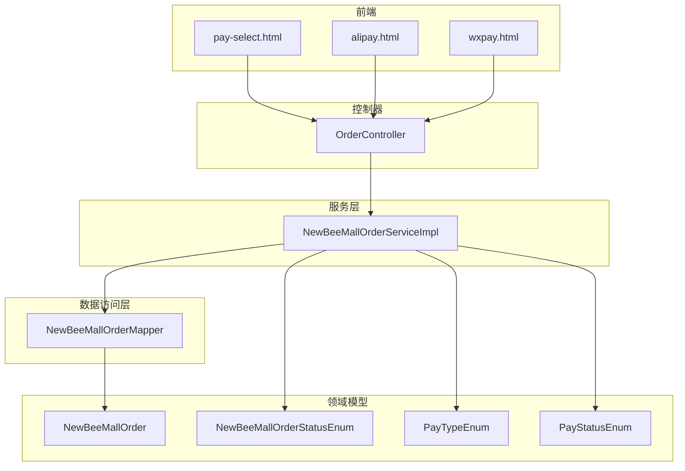
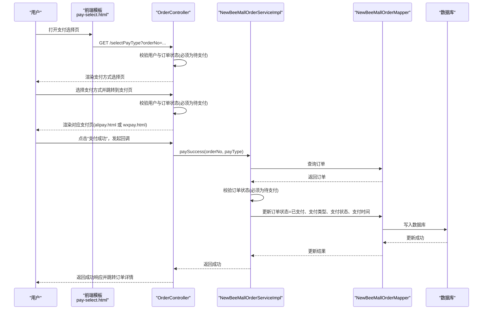
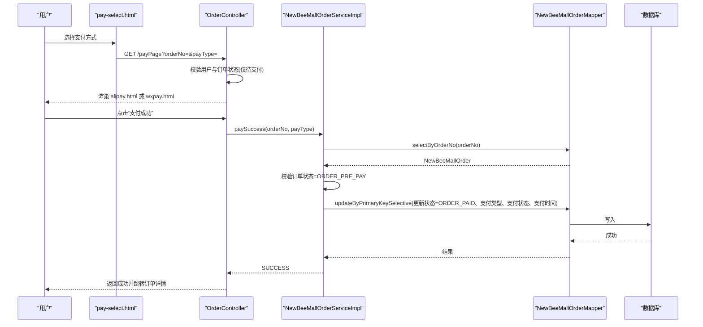
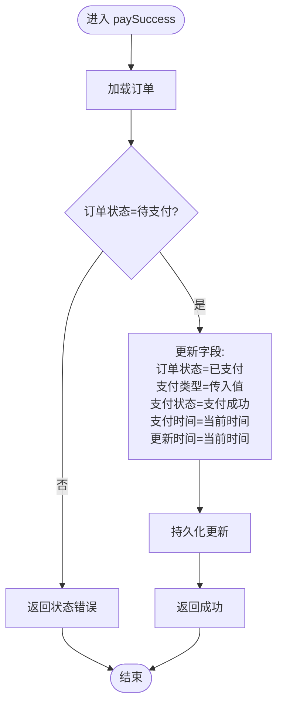
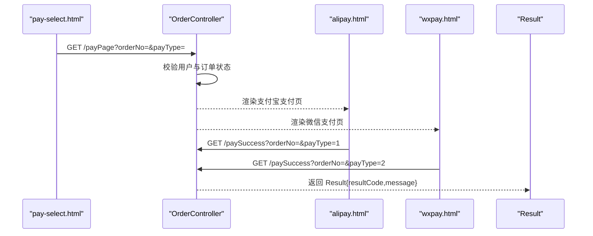
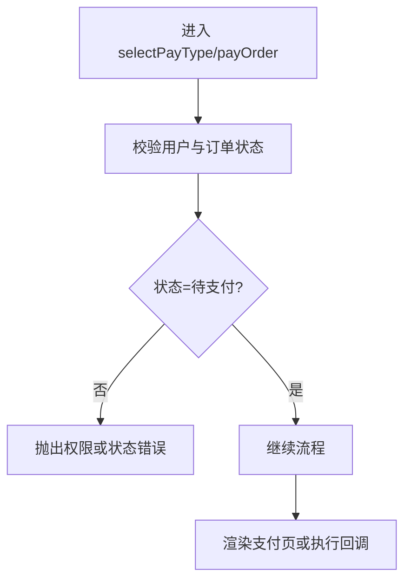
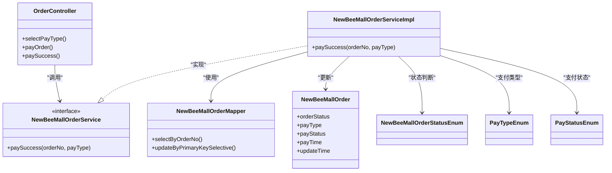

# 支付流程

<cite>
**本文引用的文件**
- [OrderController.java](file://src/main/java/ltd/newbee/mall/controller/mall/OrderController.java)
- [NewBeeMallOrderServiceImpl.java](file://src/main/java/ltd/newbee/mall/service/impl/NewBeeMallOrderServiceImpl.java)
- [NewBeeMallOrderService.java](file://src/main/java/ltd/newbee/mall/service/NewBeeMallOrderService.java)
- [NewBeeMallOrder.java](file://src/main/java/ltd/newbee/mall/entity/NewBeeMallOrder.java)
- [NewBeeMallOrderStatusEnum.java](file://src/main/java/ltd/newbee/mall/common/NewBeeMallOrderStatusEnum.java)
- [PayTypeEnum.java](file://src/main/java/ltd/newbee/mall/common/PayTypeEnum.java)
- [PayStatusEnum.java](file://src/main/java/ltd/newbee/mall/common/PayStatusEnum.java)
- [NewBeeMallOrderMapper.java](file://src/main/java/ltd/newbee/mall/dao/NewBeeMallOrderMapper.java)
- [pay-select.html](file://src/main/resources/templates/mall/pay-select.html)
- [alipay.html](file://src/main/resources/templates/mall/alipay.html)
- [wxpay.html](file://src/main/resources/templates/mall/wxpay.html)
- [Result.java](file://src/main/java/ltd/newbee/mall/util/Result.java)
- [NewBeeMallException.java](file://src/main/java/ltd/newbee/mall/common/NewBeeMallException.java)
</cite>

## 目录
1. [简介](#简介)
2. [项目结构与入口](#项目结构与入口)
3. [核心组件](#核心组件)
4. [架构总览](#架构总览)
5. [详细组件分析](#详细组件分析)
6. [依赖关系分析](#依赖关系分析)
7. [性能与并发特性](#性能与并发特性)
8. [故障排查指南](#故障排查指南)
9. [结论](#结论)

## 简介
本文档围绕 NewBeeMall 的支付流程展开，聚焦用户从“选择支付方式”到“支付成功”的完整链路。基于订单状态枚举 NewBeeMallOrderStatusEnum 中的 ORDER_PRE_PAY(0) 到 ORDER_PAID(1)，说明在“待支付”状态下用户可选择支付宝或微信支付；结合 OrderController 的 selectPayType、payOrder 接口，解释前端页面跳转逻辑；并通过 paySuccess 接口调用 NewBeeMallOrderServiceImpl 的 paySuccess 方法实现状态更新。文档包含支付流程时序图，展示 Controller→Service→DAO 的数据流转，以及支付成功后订单状态、支付类型、支付时间等字段的更新逻辑；同时说明异常处理机制，如非待支付状态订单无法进行支付。

## 项目结构与入口
- 控制器：OrderController 提供订单相关页面与接口，包括选择支付方式、进入支付页面、支付结果回调。
- 服务层：NewBeeMallOrderServiceImpl 实现业务逻辑，负责订单状态变更与持久化。
- 数据访问层：NewBeeMallOrderMapper 负责订单表的读写。
- 前端模板：pay-select.html、alipay.html、wxpay.html 定义支付页面与交互。
- 枚举与实体：NewBeeMallOrderStatusEnum、PayTypeEnum、PayStatusEnum、NewBeeMallOrder 定义状态与字段。

图表来源
- [OrderController.java](file://src/main/java/ltd/newbee/mall/controller/mall/OrderController.java#L109-L156)
- [NewBeeMallOrderServiceImpl.java](file://src/main/java/ltd/newbee/mall/service/impl/NewBeeMallOrderServiceImpl.java#L374-L394)
- [NewBeeMallOrderMapper.java](file://src/main/java/ltd/newbee/mall/dao/NewBeeMallOrderMapper.java#L17-L43)
- [NewBeeMallOrder.java](file://src/main/java/ltd/newbee/mall/entity/NewBeeMallOrder.java#L16-L169)
- [NewBeeMallOrderStatusEnum.java](file://src/main/java/ltd/newbee/mall/common/NewBeeMallOrderStatusEnum.java#L18-L30)
- [PayTypeEnum.java](file://src/main/java/ltd/newbee/mall/common/PayTypeEnum.java#L18-L24)
- [PayStatusEnum.java](file://src/main/java/ltd/newbee/mall/common/PayStatusEnum.java#L18-L23)

章节来源
- [OrderController.java](file://src/main/java/ltd/newbee/mall/controller/mall/OrderController.java#L109-L156)
- [NewBeeMallOrderServiceImpl.java](file://src/main/java/ltd/newbee/mall/service/impl/NewBeeMallOrderServiceImpl.java#L374-L394)
- [NewBeeMallOrderMapper.java](file://src/main/java/ltd/newbee/mall/dao/NewBeeMallOrderMapper.java#L17-L43)
- [NewBeeMallOrder.java](file://src/main/java/ltd/newbee/mall/entity/NewBeeMallOrder.java#L16-L169)
- [NewBeeMallOrderStatusEnum.java](file://src/main/java/ltd/newbee/mall/common/NewBeeMallOrderStatusEnum.java#L18-L30)
- [PayTypeEnum.java](file://src/main/java/ltd/newbee/mall/common/PayTypeEnum.java#L18-L24)
- [PayStatusEnum.java](file://src/main/java/ltd/newbee/mall/common/PayStatusEnum.java#L18-L23)

## 核心组件
- 订单状态枚举：定义 ORDER_PRE_PAY(0)、ORDER_PAID(1) 等状态常量，用于状态判断与显示。
- 支付类型枚举：定义支付方式（如支付宝、微信支付），用于记录订单支付渠道。
- 支付状态枚举：定义支付中、支付成功等状态，用于记录支付阶段。
- 订单实体：包含订单号、用户ID、应付金额、支付状态、支付类型、支付时间、订单状态等字段。
- 控制器：提供 selectPayType、payOrder、paySuccess 接口，负责页面跳转与结果回调。
- 服务实现：实现 paySuccess 方法，校验订单状态并更新支付相关信息。
- DAO 接口：提供订单查询与更新能力。

章节来源
- [NewBeeMallOrderStatusEnum.java](file://src/main/java/ltd/newbee/mall/common/NewBeeMallOrderStatusEnum.java#L18-L30)
- [PayTypeEnum.java](file://src/main/java/ltd/newbee/mall/common/PayTypeEnum.java#L18-L24)
- [PayStatusEnum.java](file://src/main/java/ltd/newbee/mall/common/PayStatusEnum.java#L18-L23)
- [NewBeeMallOrder.java](file://src/main/java/ltd/newbee/mall/entity/NewBeeMallOrder.java#L16-L169)
- [OrderController.java](file://src/main/java/ltd/newbee/mall/controller/mall/OrderController.java#L109-L156)
- [NewBeeMallOrderServiceImpl.java](file://src/main/java/ltd/newbee/mall/service/impl/NewBeeMallOrderServiceImpl.java#L374-L394)
- [NewBeeMallOrderMapper.java](file://src/main/java/ltd/newbee/mall/dao/NewBeeMallOrderMapper.java#L17-L43)

## 架构总览
支付流程采用经典的 MVC 分层：
- 视图层：前端模板负责展示支付页面与交互。
- 控制器层：接收请求，校验权限与状态，决定页面跳转或结果回调。
- 服务层：执行业务逻辑，更新订单状态与支付信息。
- 数据访问层：与数据库交互，读取与更新订单记录。

图表来源
- [OrderController.java](file://src/main/java/ltd/newbee/mall/controller/mall/OrderController.java#L109-L156)
- [NewBeeMallOrderServiceImpl.java](file://src/main/java/ltd/newbee/mall/service/impl/NewBeeMallOrderServiceImpl.java#L374-L394)
- [NewBeeMallOrderMapper.java](file://src/main/java/ltd/newbee/mall/dao/NewBeeMallOrderMapper.java#L17-L43)
- [pay-select.html](file://src/main/resources/templates/mall/pay-select.html#L159-L168)
- [alipay.html](file://src/main/resources/templates/mall/alipay.html#L78-L95)
- [wxpay.html](file://src/main/resources/templates/mall/wxpay.html#L76-L93)

## 详细组件分析

### 支付流程时序图（Controller→Service→DAO）

图表来源
- [OrderController.java](file://src/main/java/ltd/newbee/mall/controller/mall/OrderController.java#L126-L156)
- [NewBeeMallOrderServiceImpl.java](file://src/main/java/ltd/newbee/mall/service/impl/NewBeeMallOrderServiceImpl.java#L374-L394)
- [NewBeeMallOrderMapper.java](file://src/main/java/ltd/newbee/mall/dao/NewBeeMallOrderMapper.java#L26-L29)
- [alipay.html](file://src/main/resources/templates/mall/alipay.html#L78-L95)
- [wxpay.html](file://src/main/resources/templates/mall/wxpay.html#L76-L93)

章节来源
- [OrderController.java](file://src/main/java/ltd/newbee/mall/controller/mall/OrderController.java#L109-L156)
- [NewBeeMallOrderServiceImpl.java](file://src/main/java/ltd/newbee/mall/service/impl/NewBeeMallOrderServiceImpl.java#L374-L394)
- [NewBeeMallOrderMapper.java](file://src/main/java/ltd/newbee/mall/dao/NewBeeMallOrderMapper.java#L17-L43)

### 支付成功后的字段更新逻辑
- 订单状态：从 ORDER_PRE_PAY(0) 更新为 ORDER_PAID(1)
- 支付类型：根据前端传入的 payType 设置为支付宝或微信支付
- 支付状态：设置为支付成功
- 支付时间：设置为当前时间
- 更新时间：同步更新

图表来源
- [NewBeeMallOrderServiceImpl.java](file://src/main/java/ltd/newbee/mall/service/impl/NewBeeMallOrderServiceImpl.java#L374-L394)
- [NewBeeMallOrder.java](file://src/main/java/ltd/newbee/mall/entity/NewBeeMallOrder.java#L16-L169)
- [NewBeeMallOrderStatusEnum.java](file://src/main/java/ltd/newbee/mall/common/NewBeeMallOrderStatusEnum.java#L18-L30)
- [PayTypeEnum.java](file://src/main/java/ltd/newbee/mall/common/PayTypeEnum.java#L18-L24)
- [PayStatusEnum.java](file://src/main/java/ltd/newbee/mall/common/PayStatusEnum.java#L18-L23)

章节来源
- [NewBeeMallOrderServiceImpl.java](file://src/main/java/ltd/newbee/mall/service/impl/NewBeeMallOrderServiceImpl.java#L374-L394)
- [NewBeeMallOrder.java](file://src/main/java/ltd/newbee/mall/entity/NewBeeMallOrder.java#L16-L169)

### 前端页面跳转逻辑
- 选择支付方式：用户在 pay-select.html 中选择支付方式，点击后通过 JavaScript 跳转到 /payPage，并附带 orderNo 与 payType。
- 支付页面：根据 payType 渲染 alipay.html 或 wxpay.html。
- 支付成功回调：用户点击“支付成功”按钮后，调用 /paySuccess 接口，成功后跳转到订单详情页。

图表来源
- [pay-select.html](file://src/main/resources/templates/mall/pay-select.html#L159-L168)
- [alipay.html](file://src/main/resources/templates/mall/alipay.html#L78-L95)
- [wxpay.html](file://src/main/resources/templates/mall/wxpay.html#L76-L93)
- [OrderController.java](file://src/main/java/ltd/newbee/mall/controller/mall/OrderController.java#L126-L156)
- [Result.java](file://src/main/java/ltd/newbee/mall/util/Result.java#L1-L58)

章节来源
- [pay-select.html](file://src/main/resources/templates/mall/pay-select.html#L159-L168)
- [alipay.html](file://src/main/resources/templates/mall/alipay.html#L78-L95)
- [wxpay.html](file://src/main/resources/templates/mall/wxpay.html#L76-L93)
- [OrderController.java](file://src/main/java/ltd/newbee/mall/controller/mall/OrderController.java#L126-L156)
- [Result.java](file://src/main/java/ltd/newbee/mall/util/Result.java#L1-L58)

### 异常处理机制
- 非待支付状态订单无法支付：当订单状态不是 ORDER_PRE_PAY(0) 时，服务层返回状态错误。
- 用户权限校验：控制器在选择支付方式与进入支付页时，均会校验当前登录用户与订单所属用户是否一致。
- 前端错误提示：支付成功回调失败时，弹窗提示错误信息。
- 异常抛出：框架层提供统一异常抛出工具，便于集中处理。

图表来源
- [OrderController.java](file://src/main/java/ltd/newbee/mall/controller/mall/OrderController.java#L109-L156)
- [NewBeeMallOrderServiceImpl.java](file://src/main/java/ltd/newbee/mall/service/impl/NewBeeMallOrderServiceImpl.java#L374-L394)
- [NewBeeMallException.java](file://src/main/java/ltd/newbee/mall/common/NewBeeMallException.java#L1-L30)

章节来源
- [OrderController.java](file://src/main/java/ltd/newbee/mall/controller/mall/OrderController.java#L109-L156)
- [NewBeeMallOrderServiceImpl.java](file://src/main/java/ltd/newbee/mall/service/impl/NewBeeMallOrderServiceImpl.java#L374-L394)
- [NewBeeMallException.java](file://src/main/java/ltd/newbee/mall/common/NewBeeMallException.java#L1-L30)

## 依赖关系分析
- 控制器依赖服务接口与 VO/实体类，负责参数校验与页面渲染。
- 服务实现依赖 DAO 接口与枚举，负责业务规则与事务控制。
- DAO 接口依赖 MyBatis 映射文件，负责 SQL 执行。
- 前端模板依赖控制器提供的参数与静态资源。

图表来源
- [OrderController.java](file://src/main/java/ltd/newbee/mall/controller/mall/OrderController.java#L109-L156)
- [NewBeeMallOrderService.java](file://src/main/java/ltd/newbee/mall/service/NewBeeMallOrderService.java#L1-L118)
- [NewBeeMallOrderServiceImpl.java](file://src/main/java/ltd/newbee/mall/service/impl/NewBeeMallOrderServiceImpl.java#L374-L394)
- [NewBeeMallOrderMapper.java](file://src/main/java/ltd/newbee/mall/dao/NewBeeMallOrderMapper.java#L17-L43)
- [NewBeeMallOrder.java](file://src/main/java/ltd/newbee/mall/entity/NewBeeMallOrder.java#L16-L169)
- [NewBeeMallOrderStatusEnum.java](file://src/main/java/ltd/newbee/mall/common/NewBeeMallOrderStatusEnum.java#L18-L30)
- [PayTypeEnum.java](file://src/main/java/ltd/newbee/mall/common/PayTypeEnum.java#L18-L24)
- [PayStatusEnum.java](file://src/main/java/ltd/newbee/mall/common/PayStatusEnum.java#L18-L23)

章节来源
- [OrderController.java](file://src/main/java/ltd/newbee/mall/controller/mall/OrderController.java#L109-L156)
- [NewBeeMallOrderService.java](file://src/main/java/ltd/newbee/mall/service/NewBeeMallOrderService.java#L1-L118)
- [NewBeeMallOrderServiceImpl.java](file://src/main/java/ltd/newbee/mall/service/impl/NewBeeMallOrderServiceImpl.java#L374-L394)
- [NewBeeMallOrderMapper.java](file://src/main/java/ltd/newbee/mall/dao/NewBeeMallOrderMapper.java#L17-L43)
- [NewBeeMallOrder.java](file://src/main/java/ltd/newbee/mall/entity/NewBeeMallOrder.java#L16-L169)
- [NewBeeMallOrderStatusEnum.java](file://src/main/java/ltd/newbee/mall/common/NewBeeMallOrderStatusEnum.java#L18-L30)
- [PayTypeEnum.java](file://src/main/java/ltd/newbee/mall/common/PayTypeEnum.java#L18-L24)
- [PayStatusEnum.java](file://src/main/java/ltd/newbee/mall/common/PayStatusEnum.java#L18-L23)

## 性能与并发特性
- 事务性更新：服务层在 paySuccess 中对订单进行更新，保证状态一致性。
- 并发控制：当前实现未显式加锁，建议在高并发场景下考虑乐观锁或分布式锁，避免重复支付。
- 数据库层面：DAO 层通过主键更新，命中索引，更新成本较低。
- 前端幂等：回调接口应具备幂等性，避免重复提交导致状态异常。

[本节为通用建议，不直接分析具体文件]

## 故障排查指南
- 支付失败或状态未更新
  - 检查订单状态是否仍为待支付
  - 检查 payType 是否正确传递
  - 查看服务层返回结果与数据库更新日志
- 权限错误
  - 确认当前登录用户与订单所属用户一致
- 页面跳转异常
  - 检查 /payPage 参数 orderNo 与 payType 是否正确
  - 确认 /paySuccess 回调 URL 与前端脚本一致

章节来源
- [OrderController.java](file://src/main/java/ltd/newbee/mall/controller/mall/OrderController.java#L109-L156)
- [NewBeeMallOrderServiceImpl.java](file://src/main/java/ltd/newbee/mall/service/impl/NewBeeMallOrderServiceImpl.java#L374-L394)
- [alipay.html](file://src/main/resources/templates/mall/alipay.html#L78-L95)
- [wxpay.html](file://src/main/resources/templates/mall/wxpay.html#L76-L93)

## 结论
NewBeeMall 的支付流程清晰地遵循“待支付→已支付”的状态转换，通过控制器的权限与状态校验、服务层的幂等更新与 DAO 的持久化，实现了从用户选择支付方式到支付成功的闭环。前端模板负责直观的交互与回调触发，服务层确保业务规则与数据一致性。建议在生产环境中进一步增强并发控制与回调幂等性，以提升稳定性与用户体验。