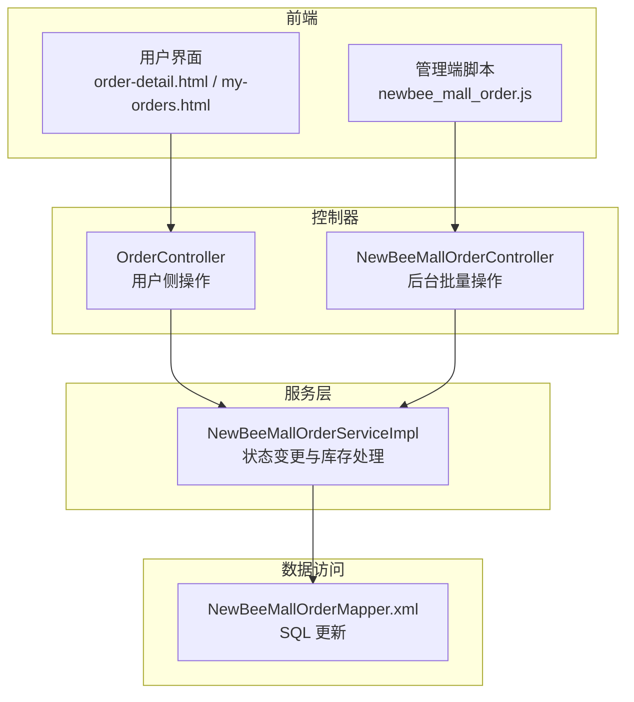
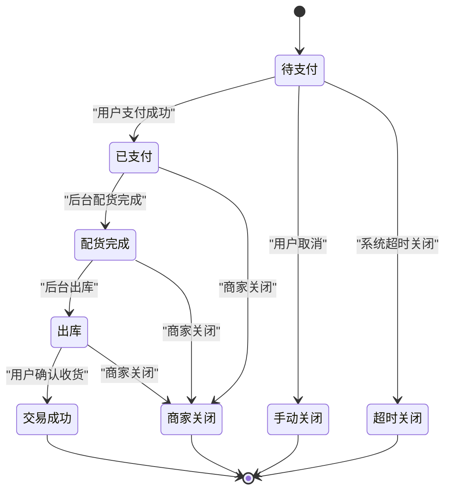
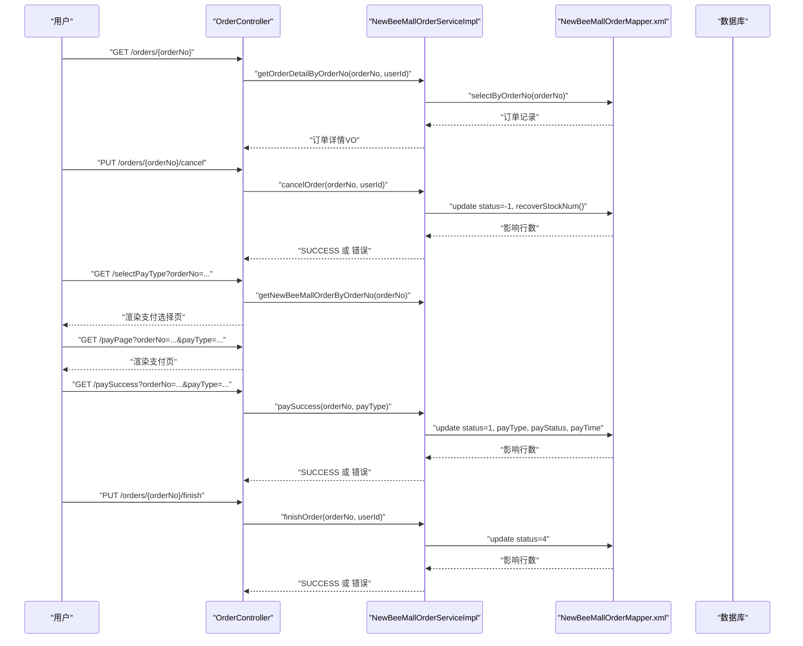
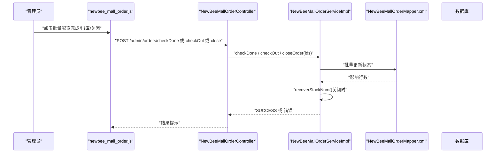
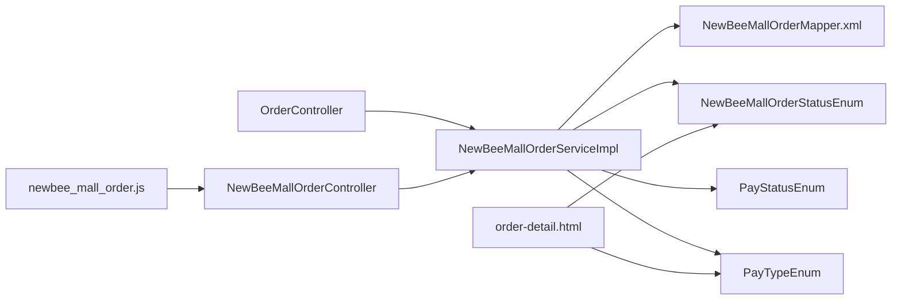

# 订单状态流转

<cite>
**本文引用的文件**
- [NewBeeMallOrderStatusEnum.java](file://src/main/java/ltd/newbee/mall/common/NewBeeMallOrderStatusEnum.java)
- [PayStatusEnum.java](file://src/main/java/ltd/newbee/mall/common/PayStatusEnum.java)
- [PayTypeEnum.java](file://src/main/java/ltd/newbee/mall/common/PayTypeEnum.java)
- [NewBeeMallOrderServiceImpl.java](file://src/main/java/ltd/newbee/mall/service/impl/NewBeeMallOrderServiceImpl.java)
- [NewBeeMallOrderController.java](file://src/main/java/ltd/newbee/mall/controller/admin/NewBeeMallOrderController.java)
- [OrderController.java](file://src/main/java/ltd/newbee/mall/controller/mall/OrderController.java)
- [NewBeeMallOrderMapper.xml](file://src/main/resources/mapper/NewBeeMallOrderMapper.xml)
- [order-detail.html](file://src/main/resources/templates/mall/order-detail.html)
- [my-orders.html](file://src/main/resources/templates/mall/my-orders.html)
- [newbee_mall_order.js](file://src/main/resources/static/admin/dist/js/newbee_mall_order.js)
</cite>

## 目录
1. [引言](#引言)
2. [项目结构](#项目结构)
3. [核心组件](#核心组件)
4. [架构总览](#架构总览)
5. [详细组件分析](#详细组件分析)
6. [依赖关系分析](#依赖关系分析)
7. [性能考量](#性能考量)
8. [故障排查指南](#故障排查指南)
9. [结论](#结论)

## 引言
本文件围绕 newbee-mall 系统的订单状态流转展开，基于 NewBeeMallOrderStatusEnum 枚举定义的订单状态码，结合 NewBeeMallOrderServiceImpl 服务层的关键方法（如 checkDone、checkOut、finishOrder、closeOrder、paySuccess、cancelOrder），系统性梳理从“创建订单”到“交易成功”的完整生命周期。同时，通过前端模板与管理员脚本，说明用户与系统在不同阶段的操作如何驱动状态变化，并明确各状态转换时的数据更新逻辑与库存处理机制。

## 项目结构
与订单状态流转直接相关的核心模块与文件如下：
- 状态定义：NewBeeMallOrderStatusEnum（订单状态码）
- 支付状态与类型：PayStatusEnum、PayTypeEnum（支付状态与支付方式）
- 服务实现：NewBeeMallOrderServiceImpl（订单状态变更与库存恢复）
- 控制器：
  - 商城端：OrderController（用户侧支付、确认收货、取消订单）
  - 后台管理：NewBeeMallOrderController（批量配货完成、出库、关闭）
- 数据访问：NewBeeMallOrderMapper.xml（SQL 更新语句）
- 前端模板：order-detail.html、my-orders.html（状态展示与交互）
- 管理端脚本：newbee_mall_order.js（批量操作按钮与校验）

图表来源
- [OrderController.java](file://src/main/java/ltd/newbee/mall/controller/mall/OrderController.java#L85-L107)
- [NewBeeMallOrderController.java](file://src/main/java/ltd/newbee/mall/controller/admin/NewBeeMallOrderController.java#L96-L145)
- [NewBeeMallOrderServiceImpl.java](file://src/main/java/ltd/newbee/mall/service/impl/NewBeeMallOrderServiceImpl.java#L75-L183)
- [NewBeeMallOrderMapper.xml](file://src/main/resources/mapper/NewBeeMallOrderMapper.xml#L205-L228)
- [order-detail.html](file://src/main/resources/templates/mall/order-detail.html#L33-L46)
- [my-orders.html](file://src/main/resources/templates/mall/my-orders.html#L39-L56)
- [newbee_mall_order.js](file://src/main/resources/static/admin/dist/js/newbee_mall_order.js#L220-L325)

章节来源
- [OrderController.java](file://src/main/java/ltd/newbee/mall/controller/mall/OrderController.java#L85-L107)
- [NewBeeMallOrderController.java](file://src/main/java/ltd/newbee/mall/controller/admin/NewBeeMallOrderController.java#L96-L145)
- [NewBeeMallOrderServiceImpl.java](file://src/main/java/ltd/newbee/mall/service/impl/NewBeeMallOrderServiceImpl.java#L75-L183)
- [NewBeeMallOrderMapper.xml](file://src/main/resources/mapper/NewBeeMallOrderMapper.xml#L205-L228)
- [order-detail.html](file://src/main/resources/templates/mall/order-detail.html#L33-L46)
- [my-orders.html](file://src/main/resources/templates/mall/my-orders.html#L39-L56)
- [newbee_mall_order.js](file://src/main/resources/static/admin/dist/js/newbee_mall_order.js#L220-L325)

## 核心组件
- 订单状态枚举 NewBeeMallOrderStatusEnum
  - 待支付(0)、已支付(1)、配货完成(2)、出库(3)、交易成功(4)
  - 关闭状态：手动关闭(-1)、超时关闭(-2)、商家关闭(-3)
- 支付状态与类型
  - 支付状态：支付中(0)、支付成功(1)、支付失败(-1)
  - 支付方式：无(0)、支付宝(1)、微信支付(2)
- 服务层关键方法
  - 用户侧：cancelOrder、finishOrder、paySuccess
  - 后台批量：checkDone、checkOut、closeOrder
- 数据访问层 SQL
  - checkDone、checkOut、closeOrder 的状态更新语句

章节来源
- [NewBeeMallOrderStatusEnum.java](file://src/main/java/ltd/newbee/mall/common/NewBeeMallOrderStatusEnum.java#L16-L28)
- [PayStatusEnum.java](file://src/main/java/ltd/newbee/mall/common/PayStatusEnum.java#L16-L23)
- [PayTypeEnum.java](file://src/main/java/ltd/newbee/mall/common/PayTypeEnum.java#L16-L24)
- [NewBeeMallOrderServiceImpl.java](file://src/main/java/ltd/newbee/mall/service/impl/NewBeeMallOrderServiceImpl.java#L75-L183)
- [NewBeeMallOrderMapper.xml](file://src/main/resources/mapper/NewBeeMallOrderMapper.xml#L205-L228)

## 架构总览
订单状态流转由“用户操作 + 系统操作”共同驱动，贯穿“创建订单 → 支付 → 配货 → 出库 → 确认收货 → 交易成功”，以及“手动关闭/超时关闭/商家关闭”的异常路径。

图表来源
- [NewBeeMallOrderStatusEnum.java](file://src/main/java/ltd/newbee/mall/common/NewBeeMallOrderStatusEnum.java#L16-L28)
- [OrderController.java](file://src/main/java/ltd/newbee/mall/controller/mall/OrderController.java#L85-L107)
- [NewBeeMallOrderServiceImpl.java](file://src/main/java/ltd/newbee/mall/service/impl/NewBeeMallOrderServiceImpl.java#L147-L183)

## 详细组件分析

### 订单状态与含义
- 待支付(0)：订单已创建但尚未支付
- 已支付(1)：用户完成支付，等待配货
- 配货完成(2)：仓库拣货完成，等待出库
- 出库(3)：物流出库，等待用户确认收货
- 交易成功(4)：用户确认收货，交易完成
- 关闭状态：
  - 手动关闭(-1)：用户主动取消
  - 超时关闭(-2)：系统超时自动关闭
  - 商家关闭(-3)：商家原因关闭

章节来源
- [NewBeeMallOrderStatusEnum.java](file://src/main/java/ltd/newbee/mall/common/NewBeeMallOrderStatusEnum.java#L16-L28)

### 用户操作与触发条件
- 去支付（待支付→已支付）
  - 触发：用户点击“去支付”，进入支付页面并完成支付
  - 服务方法：paySuccess
  - 数据更新：订单状态置为已支付，写入支付方式、支付状态、支付时间
- 确认收货（出库→交易成功）
  - 触发：用户在订单详情点击“确认收货”
  - 服务方法：finishOrder
  - 数据更新：订单状态置为交易成功
- 取消订单（待支付→手动关闭）
  - 触发：用户在订单详情点击“取消订单”
  - 服务方法：cancelOrder
  - 数据更新：订单状态置为手动关闭，同时恢复库存

章节来源
- [OrderController.java](file://src/main/java/ltd/newbee/mall/controller/mall/OrderController.java#L85-L107)
- [NewBeeMallOrderServiceImpl.java](file://src/main/java/ltd/newbee/mall/service/impl/NewBeeMallOrderServiceImpl.java#L326-L372)
- [NewBeeMallOrderServiceImpl.java](file://src/main/java/ltd/newbee/mall/service/impl/NewBeeMallOrderServiceImpl.java#L374-L394)
- [order-detail.html](file://src/main/resources/templates/mall/order-detail.html#L33-L46)

### 系统操作与触发条件
- 配货完成（已支付→配货完成）
  - 触发：后台管理员批量执行“配货完成”
  - 控制器：/admin/orders/checkDone
  - 服务方法：checkDone
  - 数据更新：订单状态置为配货完成，更新时间
- 出库（配货完成→出库）
  - 触发：后台管理员批量执行“出库”
  - 控制器：/admin/orders/checkOut
  - 服务方法：checkOut
  - 数据更新：订单状态置为出库，更新时间
- 关闭订单（已支付/配货完成/出库→商家关闭）
  - 触发：后台管理员批量执行“关闭订单”
  - 控制器：/admin/orders/close
  - 服务方法：closeOrder
  - 数据更新：订单状态置为商家关闭，同时恢复库存

章节来源
- [NewBeeMallOrderController.java](file://src/main/java/ltd/newbee/mall/controller/admin/NewBeeMallOrderController.java#L96-L145)
- [NewBeeMallOrderServiceImpl.java](file://src/main/java/ltd/newbee/mall/service/impl/NewBeeMallOrderServiceImpl.java#L75-L145)
- [NewBeeMallOrderServiceImpl.java](file://src/main/java/ltd/newbee/mall/service/impl/NewBeeMallOrderServiceImpl.java#L147-L183)
- [newbee_mall_order.js](file://src/main/resources/static/admin/dist/js/newbee_mall_order.js#L220-L325)

### 状态转换流程与数据更新逻辑
以下序列图展示了用户与系统操作如何驱动状态变化及数据更新。

图表来源
- [OrderController.java](file://src/main/java/ltd/newbee/mall/controller/mall/OrderController.java#L85-L156)
- [NewBeeMallOrderServiceImpl.java](file://src/main/java/ltd/newbee/mall/service/impl/NewBeeMallOrderServiceImpl.java#L326-L394)
- [NewBeeMallOrderMapper.xml](file://src/main/resources/mapper/NewBeeMallOrderMapper.xml#L229-L286)

章节来源
- [OrderController.java](file://src/main/java/ltd/newbee/mall/controller/mall/OrderController.java#L85-L156)
- [NewBeeMallOrderServiceImpl.java](file://src/main/java/ltd/newbee/mall/service/impl/NewBeeMallOrderServiceImpl.java#L326-L394)
- [NewBeeMallOrderMapper.xml](file://src/main/resources/mapper/NewBeeMallOrderMapper.xml#L229-L286)

### 后台批量操作流程
后台管理员批量操作时，前端脚本会先做状态校验，再调用后端接口，最终由服务层执行状态更新与库存恢复。

图表来源
- [newbee_mall_order.js](file://src/main/resources/static/admin/dist/js/newbee_mall_order.js#L220-L325)
- [NewBeeMallOrderController.java](file://src/main/java/ltd/newbee/mall/controller/admin/NewBeeMallOrderController.java#L96-L145)
- [NewBeeMallOrderServiceImpl.java](file://src/main/java/ltd/newbee/mall/service/impl/NewBeeMallOrderServiceImpl.java#L75-L183)
- [NewBeeMallOrderMapper.xml](file://src/main/resources/mapper/NewBeeMallOrderMapper.xml#L205-L228)

章节来源
- [newbee_mall_order.js](file://src/main/resources/static/admin/dist/js/newbee_mall_order.js#L220-L325)
- [NewBeeMallOrderController.java](file://src/main/java/ltd/newbee/mall/controller/admin/NewBeeMallOrderController.java#L96-L145)
- [NewBeeMallOrderServiceImpl.java](file://src/main/java/ltd/newbee/mall/service/impl/NewBeeMallOrderServiceImpl.java#L75-L183)
- [NewBeeMallOrderMapper.xml](file://src/main/resources/mapper/NewBeeMallOrderMapper.xml#L205-L228)

### 库存处理机制
- 取消订单与商家关闭：服务层 recoverStockNum 会根据订单项统计商品 ID 与数量，调用商品 Mapper 恢复库存
- 支付成功：服务层在生成订单时已扣减库存；若后续关闭或取消，则恢复库存
- 配货完成与出库：不涉及库存增减，仅状态推进

章节来源
- [NewBeeMallOrderServiceImpl.java](file://src/main/java/ltd/newbee/mall/service/impl/NewBeeMallOrderServiceImpl.java#L410-L429)
- [NewBeeMallOrderServiceImpl.java](file://src/main/java/ltd/newbee/mall/service/impl/NewBeeMallOrderServiceImpl.java#L147-L183)

### 前端状态展示与交互
- 订单详情页根据 orderStatus 渲染不同按钮与进度条
  - 待支付：显示“去支付”
  - 出库：显示“确认收货”
  - 其他状态：显示相应文案与进度节点
- 我的订单页按 orderStatus 分类展示状态样式

章节来源
- [order-detail.html](file://src/main/resources/templates/mall/order-detail.html#L33-L46)
- [order-detail.html](file://src/main/resources/templates/mall/order-detail.html#L53-L135)
- [my-orders.html](file://src/main/resources/templates/mall/my-orders.html#L39-L56)

## 依赖关系分析
- 控制器依赖服务层：用户侧与后台控制器均调用服务层方法
- 服务层依赖数据访问层：通过 MyBatis 映射文件执行 SQL 更新
- 前端模板依赖状态枚举与支付枚举：用于展示中文状态与支付方式
- 管理端脚本依赖控制器接口：发起批量操作请求

图表来源
- [OrderController.java](file://src/main/java/ltd/newbee/mall/controller/mall/OrderController.java#L85-L156)
- [NewBeeMallOrderController.java](file://src/main/java/ltd/newbee/mall/controller/admin/NewBeeMallOrderController.java#L96-L145)
- [NewBeeMallOrderServiceImpl.java](file://src/main/java/ltd/newbee/mall/service/impl/NewBeeMallOrderServiceImpl.java#L75-L183)
- [NewBeeMallOrderMapper.xml](file://src/main/resources/mapper/NewBeeMallOrderMapper.xml#L205-L228)
- [NewBeeMallOrderStatusEnum.java](file://src/main/java/ltd/newbee/mall/common/NewBeeMallOrderStatusEnum.java#L16-L28)
- [PayStatusEnum.java](file://src/main/java/ltd/newbee/mall/common/PayStatusEnum.java#L16-L23)
- [PayTypeEnum.java](file://src/main/java/ltd/newbee/mall/common/PayTypeEnum.java#L16-L24)
- [order-detail.html](file://src/main/resources/templates/mall/order-detail.html#L53-L135)
- [newbee_mall_order.js](file://src/main/resources/static/admin/dist/js/newbee_mall_order.js#L220-L325)

章节来源
- [OrderController.java](file://src/main/java/ltd/newbee/mall/controller/mall/OrderController.java#L85-L156)
- [NewBeeMallOrderController.java](file://src/main/java/ltd/newbee/mall/controller/admin/NewBeeMallOrderController.java#L96-L145)
- [NewBeeMallOrderServiceImpl.java](file://src/main/java/ltd/newbee/mall/service/impl/NewBeeMallOrderServiceImpl.java#L75-L183)
- [NewBeeMallOrderMapper.xml](file://src/main/resources/mapper/NewBeeMallOrderMapper.xml#L205-L228)
- [NewBeeMallOrderStatusEnum.java](file://src/main/java/ltd/newbee/mall/common/NewBeeMallOrderStatusEnum.java#L16-L28)
- [PayStatusEnum.java](file://src/main/java/ltd/newbee/mall/common/PayStatusEnum.java#L16-L23)
- [PayTypeEnum.java](file://src/main/java/ltd/newbee/mall/common/PayTypeEnum.java#L16-L24)
- [order-detail.html](file://src/main/resources/templates/mall/order-detail.html#L53-L135)
- [newbee_mall_order.js](file://src/main/resources/static/admin/dist/js/newbee_mall_order.js#L220-L325)

## 性能考量
- 批量操作：checkDone、checkOut、closeOrder 使用 MyBatis foreach 批量更新，减少网络往返与事务开销
- 状态前置校验：服务层在批量更新前进行状态校验，避免无效更新
- 库存恢复：recoverStockNum 一次性读取订单项并批量恢复，降低多次 IO
- 建议：对订单状态查询与分页场景，确保数据库索引覆盖 order_status、user_id、order_no 等字段

## 故障排查指南
- 支付失败或状态不符
  - 现象：支付后状态未变或返回错误
  - 排查：确认 OrderController 中对状态的前置校验，以及 NewBeeMallOrderServiceImpl.paySuccess 的状态更新
- 确认收货失败
  - 现象：状态非出库导致无法确认收货
  - 排查：确认 OrderController.finishOrder 的状态校验与 NewBeeMallOrderServiceImpl.finishOrder 的状态更新
- 取消订单失败
  - 现象：状态为交易成功或已关闭时无法取消
  - 排查：确认 NewBeeMallOrderServiceImpl.cancelOrder 的状态限制与 recoverStockNum 是否成功
- 后台批量操作失败
  - 现象：提示“订单状态不符合”或“无法执行操作”
  - 排查：参考 newbee_mall_order.js 的前端校验与 NewBeeMallOrderServiceImpl.checkDone/checkOut/closeOrder 的服务端校验
- 库存未恢复
  - 现象：关闭或取消后库存未回退
  - 排查：确认 recoverStockNum 的订单项读取与商品库存恢复 SQL 是否执行成功

章节来源
- [OrderController.java](file://src/main/java/ltd/newbee/mall/controller/mall/OrderController.java#L85-L107)
- [NewBeeMallOrderServiceImpl.java](file://src/main/java/ltd/newbee/mall/service/impl/NewBeeMallOrderServiceImpl.java#L326-L394)
- [NewBeeMallOrderServiceImpl.java](file://src/main/java/ltd/newbee/mall/service/impl/NewBeeMallOrderServiceImpl.java#L75-L183)
- [newbee_mall_order.js](file://src/main/resources/static/admin/dist/js/newbee_mall_order.js#L220-L325)

## 结论
newbee-mall 的订单状态流转清晰地体现了“用户驱动 + 系统驱动”的双通道模式。通过 NewBeeMallOrderStatusEnum 定义的状态码与 NewBeeMallOrderServiceImpl 的状态变更方法，系统实现了从创建到完成的全链路闭环。前端模板与管理端脚本提供了直观的交互入口，配合服务层的前置校验与库存恢复机制，保障了业务正确性与用户体验。建议在生产环境中持续完善超时关闭策略与监控告警，以进一步提升系统的稳定性与可维护性。