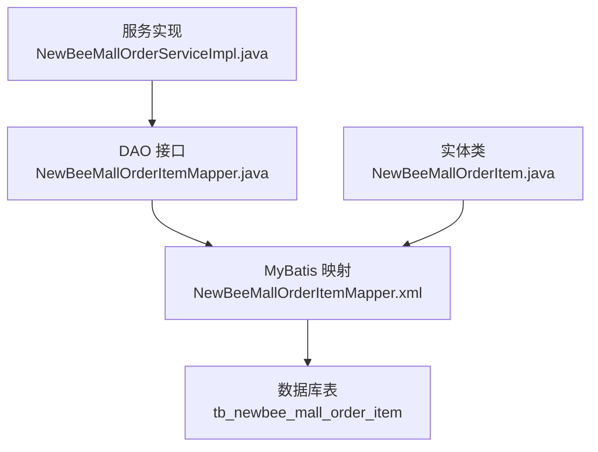
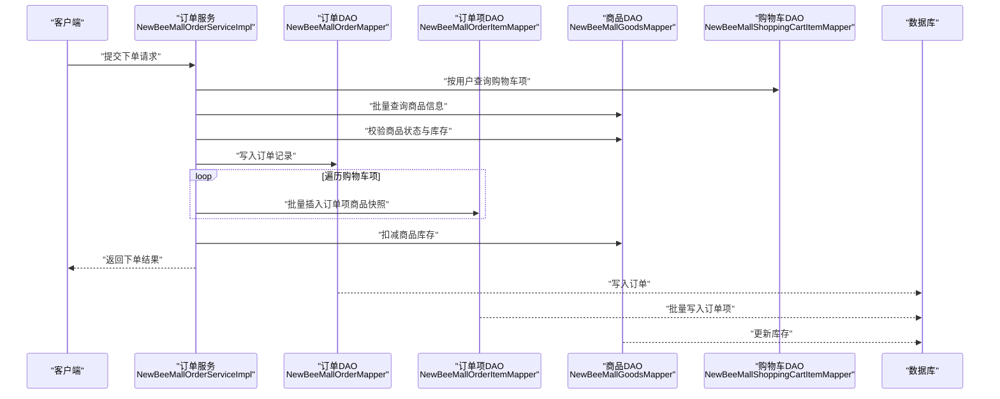
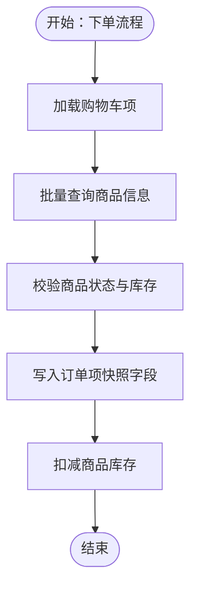
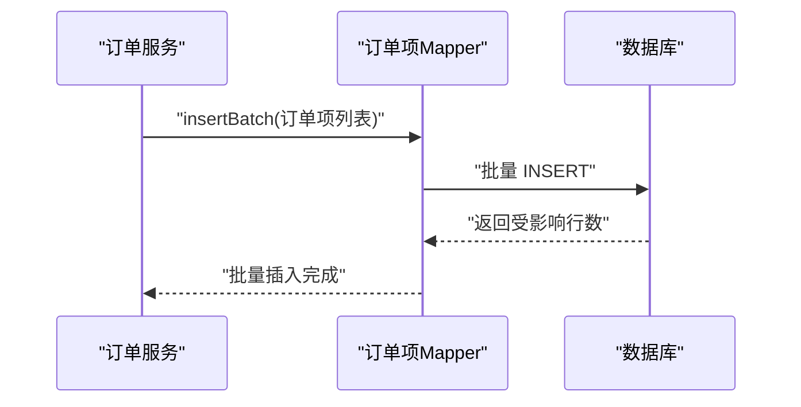
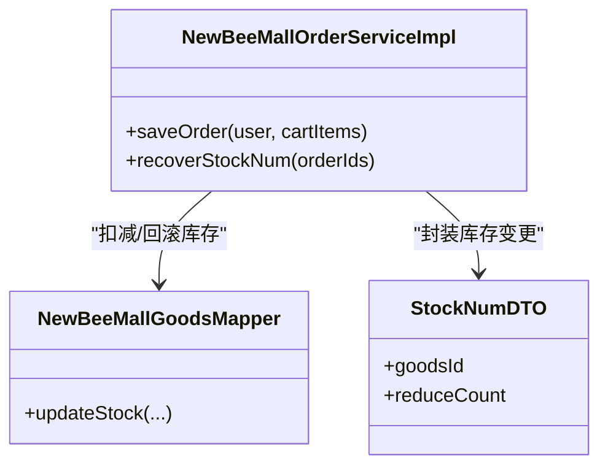
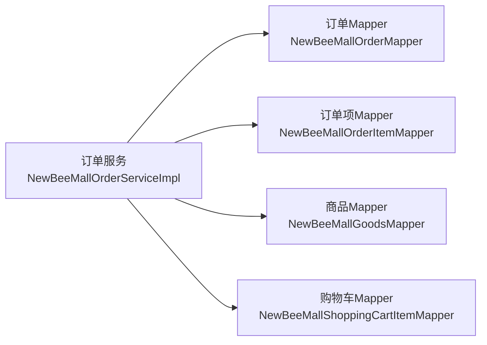

# 订单项表

<cite>
**本文档引用的文件**
- [NewBeeMallOrderItem.java](file://src/main/java/ltd/newbee/mall/entity/NewBeeMallOrderItem.java)
- [NewBeeMallOrderItemMapper.java](file://src/main/java/ltd/newbee/mall/dao/NewBeeMallOrderItemMapper.java)
- [NewBeeMallOrderItemMapper.xml](file://src/main/resources/mapper/NewBeeMallOrderItemMapper.xml)
- [newbee_mall_schema.sql](file://src/main/resources/newbee_mall_schema.sql)
- [NewBeeMallOrderServiceImpl.java](file://src/main/java/ltd/newbee/mall/service/impl/NewBeeMallOrderServiceImpl.java)
- [NewBeeMallGoodsMapper.java](file://src/main/java/ltd/newbee/mall/dao/NewBeeMallGoodsMapper.java)
- [NewBeeMallShoppingCartItemMapper.java](file://src/main/java/ltd/newbee/mall/dao/NewBeeMallShoppingCartItemMapper.java)
- [NewBeeMallOrderMapper.java](file://src/main/java/ltd/newbee/mall/dao/NewBeeMallOrderMapper.java)
- [StockNumDTO.java](file://src/main/java/ltd/newbee/mall/entity/StockNumDTO.java)
</cite>

## 目录
1. [引言](#引言)
2. [项目结构](#项目结构)
3. [核心组件](#核心组件)
4. [架构总览](#架构总览)
5. [详细组件分析](#详细组件分析)
6. [依赖分析](#依赖分析)
7. [性能考虑](#性能考虑)
8. [故障排查指南](#故障排查指南)
9. [结论](#结论)
10. [附录](#附录)

## 引言
本文件围绕 newbee-mall 系统中的订单项表 tb_newbee_mall_order_item，系统化梳理其数据库表结构、Java 实体类映射、MyBatis ORM 接口与 XML 映射、批量插入操作、订单快照机制（商品信息快照）以及与库存管理的关联关系。目标是帮助开发者快速理解订单项数据模型、掌握一对多的 ORM 使用方式，并在业务流程中正确应用快照与库存联动。

## 项目结构
- 数据库层：tb_newbee_mall_order_item 表定义位于数据库初始化脚本中
- 映射层：MyBatis Mapper 接口与 XML 映射文件
- 实体层：Java 实体类 NewBeeMallOrderItem
- 服务层：订单服务在下单时生成订单项并执行库存扣减与回滚逻辑

图表来源
- [newbee_mall_schema.sql](file://src/main/resources/newbee_mall_schema.sql#L912-L930)
- [NewBeeMallOrderItemMapper.xml](file://src/main/resources/mapper/NewBeeMallOrderItemMapper.xml#L1-L157)
- [NewBeeMallOrderItemMapper.java](file://src/main/java/ltd/newbee/mall/dao/NewBeeMallOrderItemMapper.java#L1-L52)
- [NewBeeMallOrderItem.java](file://src/main/java/ltd/newbee/mall/entity/NewBeeMallOrderItem.java#L1-L111)
- [NewBeeMallOrderServiceImpl.java](file://src/main/java/ltd/newbee/mall/service/impl/NewBeeMallOrderServiceImpl.java#L185-L260)

章节来源
- [newbee_mall_schema.sql](file://src/main/resources/newbee_mall_schema.sql#L912-L930)
- [NewBeeMallOrderItemMapper.xml](file://src/main/resources/mapper/NewBeeMallOrderItemMapper.xml#L1-L157)
- [NewBeeMallOrderItemMapper.java](file://src/main/java/ltd/newbee/mall/dao/NewBeeMallOrderItemMapper.java#L1-L52)
- [NewBeeMallOrderItem.java](file://src/main/java/ltd/newbee/mall/entity/NewBeeMallOrderItem.java#L1-L111)
- [NewBeeMallOrderServiceImpl.java](file://src/main/java/ltd/newbee/mall/service/impl/NewBeeMallOrderServiceImpl.java#L185-L260)

## 核心组件
- 数据库表：tb_newbee_mall_order_item
  - 字段与约束详见“表结构定义”
- Java 实体类：NewBeeMallOrderItem
  - 字段与 getter/setter 详见“实体类映射”
- MyBatis 映射：NewBeeMallOrderItemMapper 接口与 XML
  - 查询、插入、批量插入、更新、删除等操作详见“ORM 映射与接口”

章节来源
- [newbee_mall_schema.sql](file://src/main/resources/newbee_mall_schema.sql#L912-L930)
- [NewBeeMallOrderItem.java](file://src/main/java/ltd/newbee/mall/entity/NewBeeMallOrderItem.java#L1-L111)
- [NewBeeMallOrderItemMapper.java](file://src/main/java/ltd/newbee/mall/dao/NewBeeMallOrderItemMapper.java#L1-L52)
- [NewBeeMallOrderItemMapper.xml](file://src/main/resources/mapper/NewBeeMallOrderItemMapper.xml#L1-L157)

## 架构总览
订单项表在系统中的位置如下：

图表来源
- [NewBeeMallOrderServiceImpl.java](file://src/main/java/ltd/newbee/mall/service/impl/NewBeeMallOrderServiceImpl.java#L185-L260)
- [NewBeeMallOrderItemMapper.java](file://src/main/java/ltd/newbee/mall/dao/NewBeeMallOrderItemMapper.java#L1-L52)
- [NewBeeMallOrderItemMapper.xml](file://src/main/resources/mapper/NewBeeMallOrderItemMapper.xml#L1-L157)
- [NewBeeMallGoodsMapper.java](file://src/main/java/ltd/newbee/mall/dao/NewBeeMallGoodsMapper.java)
- [NewBeeMallShoppingCartItemMapper.java](file://src/main/java/ltd/newbee/mall/dao/NewBeeMallShoppingCartItemMapper.java)
- [NewBeeMallOrderMapper.java](file://src/main/java/ltd/newbee/mall/dao/NewBeeMallOrderMapper.java)

## 详细组件分析

### 表结构定义（tb_newbee_mall_order_item）
- 主键：order_item_id（自增）
- 外键/关联：order_id（订单主键）、goods_id（商品主键）
- 快照字段：goods_name、goods_cover_img、selling_price、goods_count
- 时间字段：create_time
- 约束与默认值：
  - order_id、goods_id 默认 0
  - goods_name、goods_cover_img 默认空字符串
  - selling_price、goods_count 默认 1
  - create_time 默认当前时间

章节来源
- [newbee_mall_schema.sql](file://src/main/resources/newbee_mall_schema.sql#L912-L930)

### 实体类映射（NewBeeMallOrderItem）
- 字段与类型对应数据库列，驼峰命名映射到下划线命名
- 关键字段说明：
  - orderItemId：订单项主键
  - orderId：订单主键
  - goodsId：商品主键
  - goodsName：下单时的商品名称（快照）
  - goodsCoverImg：下单时的商品封面图（快照）
  - sellingPrice：下单时的单价（快照）
  - goodsCount：购买数量（快照）
  - createTime：创建时间

章节来源
- [NewBeeMallOrderItem.java](file://src/main/java/ltd/newbee/mall/entity/NewBeeMallOrderItem.java#L1-L111)

### ORM 映射与接口（NewBeeMallOrderItemMapper）
- 接口能力概览：
  - 单条查询：selectByPrimaryKey
  - 条件查询：selectByOrderId、selectByOrderIds
  - 插入：insert、insertSelective
  - 更新：updateByPrimaryKey、updateByPrimaryKeySelective
  - 删除：deleteByPrimaryKey
  - 批量插入：insertBatch
- XML 映射要点：
  - ResultMap 将列与实体属性映射
  - Base_Column_List 定义列清单
  - selectByOrderIds 使用 <foreach> 实现 IN 查询
  - insertBatch 使用 <foreach> 实现批量插入

章节来源
- [NewBeeMallOrderItemMapper.java](file://src/main/java/ltd/newbee/mall/dao/NewBeeMallOrderItemMapper.java#L1-L52)
- [NewBeeMallOrderItemMapper.xml](file://src/main/resources/mapper/NewBeeMallOrderItemMapper.xml#L1-L157)

### 订单项与商品的快照机制
- 快照目的：记录下单时刻的商品名称、封面图、单价与数量，避免后续商品信息变更影响历史订单
- 快照字段：goods_name、goods_cover_img、selling_price、goods_count
- 生成时机：下单时从商品表读取并写入订单项表

图表来源
- [NewBeeMallOrderServiceImpl.java](file://src/main/java/ltd/newbee/mall/service/impl/NewBeeMallOrderServiceImpl.java#L185-L260)
- [NewBeeMallOrderItemMapper.xml](file://src/main/resources/mapper/NewBeeMallOrderItemMapper.xml#L44-L55)

章节来源
- [NewBeeMallOrderServiceImpl.java](file://src/main/java/ltd/newbee/mall/service/impl/NewBeeMallOrderServiceImpl.java#L185-L260)
- [NewBeeMallOrderItemMapper.xml](file://src/main/resources/mapper/NewBeeMallOrderItemMapper.xml#L44-L55)

### 批量插入操作
- 接口：insertBatch(List<NewBeeMallOrderItem>)
- XML 实现：使用 <foreach> 遍历订单项集合，一次性写入多条记录
- 适用场景：下单时将购物车项批量落库为订单项

图表来源
- [NewBeeMallOrderItemMapper.java](file://src/main/java/ltd/newbee/mall/dao/NewBeeMallOrderItemMapper.java#L41-L52)
- [NewBeeMallOrderItemMapper.xml](file://src/main/resources/mapper/NewBeeMallOrderItemMapper.xml#L44-L55)

章节来源
- [NewBeeMallOrderItemMapper.java](file://src/main/java/ltd/newbee/mall/dao/NewBeeMallOrderItemMapper.java#L41-L52)
- [NewBeeMallOrderItemMapper.xml](file://src/main/resources/mapper/NewBeeMallOrderItemMapper.xml#L44-L55)

### 与库存管理的关联
- 库存扣减：下单成功后按订单项的 goods_id 与 goods_count 扣减商品库存
- 库存回滚：订单关闭或超时取消时，按订单项回退库存
- DTO 支持：StockNumDTO 作为库存变更的数据载体

图表来源
- [NewBeeMallOrderServiceImpl.java](file://src/main/java/ltd/newbee/mall/service/impl/NewBeeMallOrderServiceImpl.java#L185-L260)
- [NewBeeMallGoodsMapper.java](file://src/main/java/ltd/newbee/mall/dao/NewBeeMallGoodsMapper.java)
- [StockNumDTO.java](file://src/main/java/ltd/newbee/mall/entity/StockNumDTO.java)

章节来源
- [NewBeeMallOrderServiceImpl.java](file://src/main/java/ltd/newbee/mall/service/impl/NewBeeMallOrderServiceImpl.java#L185-L260)
- [StockNumDTO.java](file://src/main/java/ltd/newbee/mall/entity/StockNumDTO.java)

## 依赖分析
- 组件耦合
  - 服务层依赖 DAO 层（订单、订单项、商品、购物车）
  - 订单项表与订单表为一对多关系（一个订单包含多个订单项）
  - 订单项表与商品表为弱引用（仅保存快照，不强制外键约束）
- 外部依赖
  - MyBatis 框架负责 SQL 与实体映射
  - Spring 事务管理保障下单流程一致性

图表来源
- [NewBeeMallOrderServiceImpl.java](file://src/main/java/ltd/newbee/mall/service/impl/NewBeeMallOrderServiceImpl.java#L185-L260)
- [NewBeeMallOrderMapper.java](file://src/main/java/ltd/newbee/mall/dao/NewBeeMallOrderMapper.java)
- [NewBeeMallOrderItemMapper.java](file://src/main/java/ltd/newbee/mall/dao/NewBeeMallOrderItemMapper.java)
- [NewBeeMallGoodsMapper.java](file://src/main/java/ltd/newbee/mall/dao/NewBeeMallGoodsMapper.java)
- [NewBeeMallShoppingCartItemMapper.java](file://src/main/java/ltd/newbee/mall/dao/NewBeeMallShoppingCartItemMapper.java)

章节来源
- [NewBeeMallOrderServiceImpl.java](file://src/main/java/ltd/newbee/mall/service/impl/NewBeeMallOrderServiceImpl.java#L185-L260)
- [NewBeeMallOrderMapper.java](file://src/main/java/ltd/newbee/mall/dao/NewBeeMallOrderMapper.java)
- [NewBeeMallOrderItemMapper.java](file://src/main/java/ltd/newbee/mall/dao/NewBeeMallOrderItemMapper.java)
- [NewBeeMallGoodsMapper.java](file://src/main/java/ltd/newbee/mall/dao/NewBeeMallGoodsMapper.java)
- [NewBeeMallShoppingCartItemMapper.java](file://src/main/java/ltd/newbee/mall/dao/NewBeeMallShoppingCartItemMapper.java)

## 性能考虑
- 批量插入：使用 insertBatch 一次性写入多条订单项，减少往返次数
- 查询优化：selectByOrderIds 使用 IN 查询，建议在 order_id 上建立索引
- 快照冗余：将商品名称、封面图、单价快照写入订单项，避免历史查询时的关联查询开销
- 事务边界：下单流程在服务层统一开启事务，确保订单、订单项与库存的一致性

## 故障排查指南
- 批量插入失败
  - 检查传入的订单项列表是否为空
  - 核对 XML 中的列名与实体属性是否一致
- 快照不一致
  - 确认下单时从商品表读取的字段是否正确
  - 核对实体类字段命名与数据库列名映射
- 库存扣减异常
  - 检查库存扣减逻辑是否覆盖所有订单项
  - 订单关闭或取消时确认库存回滚是否执行

章节来源
- [NewBeeMallOrderItemMapper.xml](file://src/main/resources/mapper/NewBeeMallOrderItemMapper.xml#L44-L55)
- [NewBeeMallOrderServiceImpl.java](file://src/main/java/ltd/newbee/mall/service/impl/NewBeeMallOrderServiceImpl.java#L185-L260)

## 结论
tb_newbee_mall_order_item 通过快照机制将下单时刻的商品信息固化到订单项中，结合 MyBatis 的批量插入与服务层的事务控制，实现了高效、稳定的订单落库与库存联动。理解表结构、实体映射与接口方法，有助于在扩展订单功能时保持数据一致性与性能平衡。

## 附录
- 表字段对照与约束摘要
  - order_item_id：主键，自增
  - order_id：订单主键，非负整数
  - goods_id：商品主键，非负整数
  - goods_name：商品名称（快照），字符串
  - goods_cover_img：商品封面图（快照），字符串
  - selling_price：下单时单价（快照），整型
  - goods_count：购买数量（快照），整型
  - create_time：创建时间，默认当前时间

章节来源
- [newbee_mall_schema.sql](file://src/main/resources/newbee_mall_schema.sql#L912-L930)