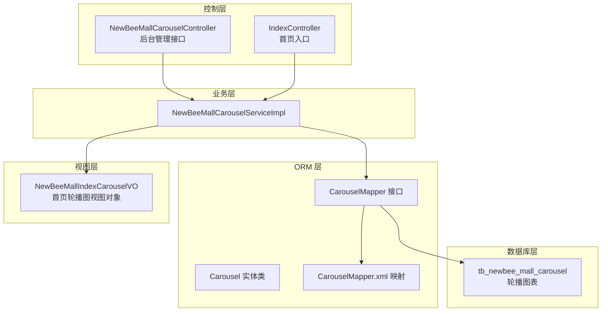
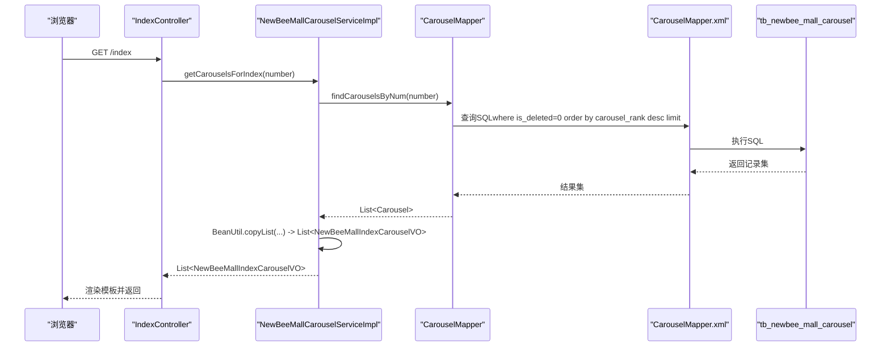
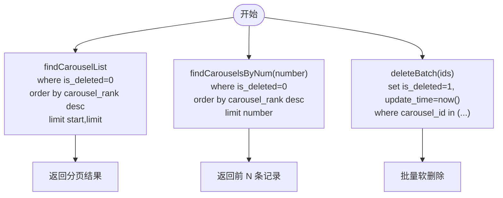
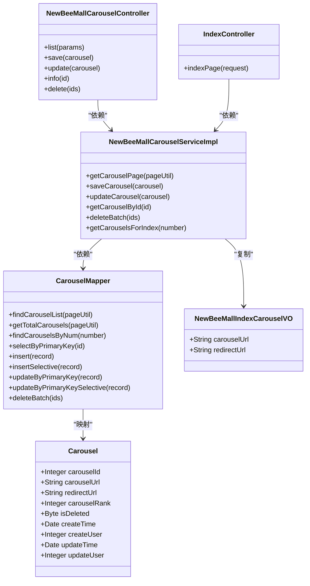
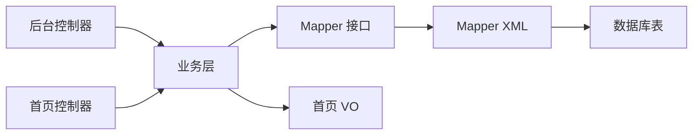

# 轮播图实体模型

<cite>
**本文引用的文件列表**
- [newbee_mall_schema.sql](file://src/main/resources/newbee_mall_schema.sql)
- [Carousel.java](file://src/main/java/ltd/newbee/mall/entity/Carousel.java)
- [CarouselMapper.java](file://src/main/java/ltd/newbee/mall/dao/CarouselMapper.java)
- [CarouselMapper.xml](file://src/main/resources/mapper/CarouselMapper.xml)
- [NewBeeMallCarouselServiceImpl.java](file://src/main/java/ltd/newbee/mall/service/impl/NewBeeMallCarouselServiceImpl.java)
- [NewBeeMallCarouselController.java](file://src/main/java/ltd/newbee/mall/controller/admin/NewBeeMallCarouselController.java)
- [IndexController.java](file://src/main/java/ltd/newbee/mall/controller/mall/IndexController.java)
- [NewBeeMallIndexCarouselVO.java](file://src/main/java/ltd/newbee/mall/controller/vo/NewBeeMallIndexCarouselVO.java)
</cite>

## 目录
1. [简介](#简介)
2. [项目结构](#项目结构)
3. [核心组件](#核心组件)
4. [架构总览](#架构总览)
5. [详细组件分析](#详细组件分析)
6. [依赖关系分析](#依赖关系分析)
7. [性能考量](#性能考量)
8. [故障排查指南](#故障排查指南)
9. [结论](#结论)
10. [附录](#附录)

## 简介
本文件围绕 newbee-mall 系统中的轮播图实体模型展开，基于数据库表 tb_newbee_mall_carousel 的结构，结合 Java 实体类 Carousel 与其 MyBatis 映射文件，系统化阐述字段语义、数据类型、约束与索引策略，并说明排序机制、软删除实现以及在首页的展示流程。同时给出实体关系图，帮助读者快速把握轮播图在系统中的定位与职责边界。

## 项目结构
轮播图相关代码分布于以下层次：
- 数据库层：tb_newbee_mall_carousel 表定义
- ORM 层：Carousel 实体类与 CarouselMapper 接口及 XML 映射
- 业务层：NewBeeMallCarouselServiceImpl 提供首页轮播图查询与管理能力
- 控制层：Admin 端提供增删改查接口；前台首页通过 IndexController 调用服务获取轮播图并渲染

图表来源
- [newbee_mall_schema.sql](file://src/main/resources/newbee_mall_schema.sql#L1-L120)
- [Carousel.java](file://src/main/java/ltd/newbee/mall/entity/Carousel.java#L1-L126)
- [CarouselMapper.java](file://src/main/java/ltd/newbee/mall/dao/CarouselMapper.java#L1-L37)
- [CarouselMapper.xml](file://src/main/resources/mapper/CarouselMapper.xml#L1-L171)
- [NewBeeMallCarouselServiceImpl.java](file://src/main/java/ltd/newbee/mall/service/impl/NewBeeMallCarouselServiceImpl.java#L1-L89)
- [NewBeeMallCarouselController.java](file://src/main/java/ltd/newbee/mall/controller/admin/NewBeeMallCarouselController.java#L1-L126)
- [IndexController.java](file://src/main/java/ltd/newbee/mall/controller/mall/IndexController.java#L1-L58)
- [NewBeeMallIndexCarouselVO.java](file://src/main/java/ltd/newbee/mall/controller/vo/NewBeeMallIndexCarouselVO.java#L1-L38)

章节来源
- [newbee_mall_schema.sql](file://src/main/resources/newbee_mall_schema.sql#L1-L120)
- [Carousel.java](file://src/main/java/ltd/newbee/mall/entity/Carousel.java#L1-L126)
- [CarouselMapper.java](file://src/main/java/ltd/newbee/mall/dao/CarouselMapper.java#L1-L37)
- [CarouselMapper.xml](file://src/main/resources/mapper/CarouselMapper.xml#L1-L171)
- [NewBeeMallCarouselServiceImpl.java](file://src/main/java/ltd/newbee/mall/service/impl/NewBeeMallCarouselServiceImpl.java#L1-L89)
- [NewBeeMallCarouselController.java](file://src/main/java/ltd/newbee/mall/controller/admin/NewBeeMallCarouselController.java#L1-L126)
- [IndexController.java](file://src/main/java/ltd/newbee/mall/controller/mall/IndexController.java#L1-L58)
- [NewBeeMallIndexCarouselVO.java](file://src/main/java/ltd/newbee/mall/controller/vo/NewBeeMallIndexCarouselVO.java#L1-L38)

## 核心组件
- 数据库表：tb_newbee_mall_carousel
  - 主键：carousel_id
  - 字段：carousel_url、redirect_url、carousel_rank、is_deleted、create_time、create_user、update_time、update_user
- 实体类：Carousel
  - 字段与数据库表一一对应，包含时间格式化注解与基本 setter/getter
- 映射层：CarouselMapper 接口 + CarouselMapper.xml
  - 提供分页查询、总数统计、按主键查询、批量插入/更新、按数量查询、批量软删除等
- 业务层：NewBeeMallCarouselServiceImpl
  - 提供后台管理的分页、保存、更新、删除；提供首页轮播图查询（返回 VO）
- 控制层：
  - 后台管理：NewBeeMallCarouselController 提供列表、新增、修改、详情、批量删除接口
  - 前台首页：IndexController 调用服务获取首页轮播图并渲染模板

章节来源
- [newbee_mall_schema.sql](file://src/main/resources/newbee_mall_schema.sql#L1-L120)
- [Carousel.java](file://src/main/java/ltd/newbee/mall/entity/Carousel.java#L1-L126)
- [CarouselMapper.java](file://src/main/java/ltd/newbee/mall/dao/CarouselMapper.java#L1-L37)
- [CarouselMapper.xml](file://src/main/resources/mapper/CarouselMapper.xml#L1-L171)
- [NewBeeMallCarouselServiceImpl.java](file://src/main/java/ltd/newbee/mall/service/impl/NewBeeMallCarouselServiceImpl.java#L1-L89)
- [NewBeeMallCarouselController.java](file://src/main/java/ltd/newbee/mall/controller/admin/NewBeeMallCarouselController.java#L1-L126)
- [IndexController.java](file://src/main/java/ltd/newbee/mall/controller/mall/IndexController.java#L1-L58)
- [NewBeeMallIndexCarouselVO.java](file://src/main/java/ltd/newbee/mall/controller/vo/NewBeeMallIndexCarouselVO.java#L1-L38)

## 架构总览
轮播图在系统中的职责边界清晰：数据库表承载数据存储与排序规则；实体类与映射文件完成 ORM；业务层封装查询与管理；控制层暴露接口并驱动页面渲染。首页仅消费 VO，不直接依赖实体，保证前后端分离与职责单一。

图表来源
- [IndexController.java](file://src/main/java/ltd/newbee/mall/controller/mall/IndexController.java#L1-L58)
- [NewBeeMallCarouselServiceImpl.java](file://src/main/java/ltd/newbee/mall/service/impl/NewBeeMallCarouselServiceImpl.java#L1-L89)
- [CarouselMapper.java](file://src/main/java/ltd/newbee/mall/dao/CarouselMapper.java#L1-L37)
- [CarouselMapper.xml](file://src/main/resources/mapper/CarouselMapper.xml#L1-L171)
- [newbee_mall_schema.sql](file://src/main/resources/newbee_mall_schema.sql#L1-L120)

## 详细组件分析

### 数据库表结构与字段语义
- 表名：tb_newbee_mall_carousel
- 主键：carousel_id（自增整数）
- 字段与含义：
  - carousel_id：轮播图主键
  - carousel_url：轮播图图片 URL
  - redirect_url：点击后跳转地址，默认值为特定字符串，表示“不跳转”
  - carousel_rank：排序值，数值越大越靠前
  - is_deleted：软删除标识，0 未删除，1 已删除
  - create_time：创建时间，默认当前时间
  - create_user：创建者 ID
  - update_time：修改时间，默认当前时间
  - update_user：修改者 ID
- 约束与索引：
  - 主键：PRIMARY KEY (carousel_id)
  - 排序与过滤：查询默认按 carousel_rank 降序；软删除过滤 is_deleted=0
  - 无显式二级索引，但排序与过滤组合可通过主键高效定位

章节来源
- [newbee_mall_schema.sql](file://src/main/resources/newbee_mall_schema.sql#L1-L120)

### Java 实体类 Carousel 映射
- 字段与类型：
  - carouselId：Integer
  - carouselUrl：String
  - redirectUrl：String
  - carouselRank：Integer
  - isDeleted：Byte
  - createTime/updateTime：Date（JSON 格式化）
  - createUser/updateUser：Integer
- 设计要点：
  - 字段命名遵循驼峰与数据库列名映射约定
  - 时间字段使用 JSON 格式化注解，便于前端序列化
  - setter 中对字符串字段执行 trim，避免空格影响

章节来源
- [Carousel.java](file://src/main/java/ltd/newbee/mall/entity/Carousel.java#L1-L126)

### MyBatis 映射与 SQL 行为
- 结果映射 BaseResultMap：将数据库列映射到 Carousel 实体
- 常用查询：
  - findCarouselList：按分页查询，where is_deleted=0，order by carousel_rank desc
  - getTotalCarousels：统计未删除记录数
  - findCarouselsByNum：按数量限制查询，where is_deleted=0，order by carousel_rank desc
  - selectByPrimaryKey：按主键查询
  - insert/insertSelective：插入全部或按非空字段插入
  - updateByPrimaryKey/updateByPrimaryKeySelective：更新全部或按非空字段更新
  - deleteBatch：批量软删除（设置 is_deleted=1，同时更新时间）

图表来源
- [CarouselMapper.xml](file://src/main/resources/mapper/CarouselMapper.xml#L1-L171)

章节来源
- [CarouselMapper.java](file://src/main/java/ltd/newbee/mall/dao/CarouselMapper.java#L1-L37)
- [CarouselMapper.xml](file://src/main/resources/mapper/CarouselMapper.xml#L1-L171)

### 业务层与控制层协作
- 业务层 NewBeeMallCarouselServiceImpl：
  - 分页查询：调用 Mapper 的分页与总数查询，封装 PageResult
  - 新增/修改：insertSelective/updateByPrimaryKeySelective，维护时间与用户字段
  - 批量删除：deleteBatch 返回布尔结果
  - 首页轮播图：findCarouselsByNum(number) 后通过 BeanUtil 复制为 VO 列表
- 控制层：
  - 后台管理：提供列表、保存、更新、详情、批量删除接口，参数校验与返回统一
  - 前台首页：IndexController 调用服务获取轮播图列表，注入模板变量并渲染

图表来源
- [Carousel.java](file://src/main/java/ltd/newbee/mall/entity/Carousel.java#L1-L126)
- [CarouselMapper.java](file://src/main/java/ltd/newbee/mall/dao/CarouselMapper.java#L1-L37)
- [NewBeeMallCarouselServiceImpl.java](file://src/main/java/ltd/newbee/mall/service/impl/NewBeeMallCarouselServiceImpl.java#L1-L89)
- [NewBeeMallCarouselController.java](file://src/main/java/ltd/newbee/mall/controller/admin/NewBeeMallCarouselController.java#L1-L126)
- [IndexController.java](file://src/main/java/ltd/newbee/mall/controller/mall/IndexController.java#L1-L58)
- [NewBeeMallIndexCarouselVO.java](file://src/main/java/ltd/newbee/mall/controller/vo/NewBeeMallIndexCarouselVO.java#L1-L38)

章节来源
- [NewBeeMallCarouselServiceImpl.java](file://src/main/java/ltd/newbee/mall/service/impl/NewBeeMallCarouselServiceImpl.java#L1-L89)
- [NewBeeMallCarouselController.java](file://src/main/java/ltd/newbee/mall/controller/admin/NewBeeMallCarouselController.java#L1-L126)
- [IndexController.java](file://src/main/java/ltd/newbee/mall/controller/mall/IndexController.java#L1-L58)
- [NewBeeMallIndexCarouselVO.java](file://src/main/java/ltd/newbee/mall/controller/vo/NewBeeMallIndexCarouselVO.java#L1-L38)

### 首页展示逻辑与 VO 映射
- 首页入口 IndexController 调用服务获取轮播图列表，数量由常量控制
- 服务层将 Carousel 列表复制为 NewBeeMallIndexCarouselVO 列表，仅暴露 carouselUrl 与 redirectUrl
- 模板渲染时使用该 VO 列表，实现前后端数据解耦

章节来源
- [IndexController.java](file://src/main/java/ltd/newbee/mall/controller/mall/IndexController.java#L1-L58)
- [NewBeeMallCarouselServiceImpl.java](file://src/main/java/ltd/newbee/mall/service/impl/NewBeeMallCarouselServiceImpl.java#L1-L89)
- [NewBeeMallIndexCarouselVO.java](file://src/main/java/ltd/newbee/mall/controller/vo/NewBeeMallIndexCarouselVO.java#L1-L38)

## 依赖关系分析
- 组件内聚与耦合：
  - Carousel 实体与数据库表强绑定，映射清晰
  - Mapper 与 XML 解耦，便于扩展 SQL
  - 业务层聚合 Mapper，屏蔽分页与复制细节
  - 控制层仅负责参数校验与返回，职责单一
- 外部依赖：
  - MyBatis 提供 ORM 能力
  - Spring MVC 提供控制器与模板渲染
- 潜在循环依赖：
  - 未发现循环依赖，各层单向依赖

图表来源
- [NewBeeMallCarouselController.java](file://src/main/java/ltd/newbee/mall/controller/admin/NewBeeMallCarouselController.java#L1-L126)
- [IndexController.java](file://src/main/java/ltd/newbee/mall/controller/mall/IndexController.java#L1-L58)
- [NewBeeMallCarouselServiceImpl.java](file://src/main/java/ltd/newbee/mall/service/impl/NewBeeMallCarouselServiceImpl.java#L1-L89)
- [CarouselMapper.java](file://src/main/java/ltd/newbee/mall/dao/CarouselMapper.java#L1-L37)
- [CarouselMapper.xml](file://src/main/resources/mapper/CarouselMapper.xml#L1-L171)
- [newbee_mall_schema.sql](file://src/main/resources/newbee_mall_schema.sql#L1-L120)

章节来源
- [NewBeeMallCarouselController.java](file://src/main/java/ltd/newbee/mall/controller/admin/NewBeeMallCarouselController.java#L1-L126)
- [IndexController.java](file://src/main/java/ltd/newbee/mall/controller/mall/IndexController.java#L1-L58)
- [NewBeeMallCarouselServiceImpl.java](file://src/main/java/ltd/newbee/mall/service/impl/NewBeeMallCarouselServiceImpl.java#L1-L89)
- [CarouselMapper.java](file://src/main/java/ltd/newbee/mall/dao/CarouselMapper.java#L1-L37)
- [CarouselMapper.xml](file://src/main/resources/mapper/CarouselMapper.xml#L1-L171)
- [newbee_mall_schema.sql](file://src/main/resources/newbee_mall_schema.sql#L1-L120)

## 性能考量
- 排序与过滤：
  - 查询默认按 carousel_rank 降序，且只取未删除记录，适合首页展示
  - 若数据量增大，建议在 carousel_rank 上建立索引以提升排序效率
- 分页：
  - findCarouselList 使用 limit 分页，注意 start 与 limit 的边界与上限控制
- 软删除：
  - deleteBatch 采用 is_deleted=1 的软删除，避免物理删除带来的数据丢失风险
- 序列化：
  - 时间字段使用 JSON 格式化，注意时区与前端解析一致性

[本节为通用性能建议，无需具体文件引用]

## 故障排查指南
- 常见问题与定位：
  - 查询不到轮播图：确认 is_deleted=0 条件是否生效；检查 carousel_rank 是否合理
  - 排序异常：确认数据库中 carousel_rank 是否正确；检查 SQL 是否按降序排列
  - 更新失败：检查 updateByPrimaryKeySelective 是否传入必要字段；确认主键存在
  - 批量删除无效：确认 deleteBatch 的 ids 是否为空；检查 is_deleted 是否被更新
- 日志与断点：
  - 在业务层与 Mapper 层添加关键日志，输出 SQL 与参数
  - 前端渲染问题：核对 VO 字段与模板变量是否一致

章节来源
- [CarouselMapper.xml](file://src/main/resources/mapper/CarouselMapper.xml#L1-L171)
- [NewBeeMallCarouselServiceImpl.java](file://src/main/java/ltd/newbee/mall/service/impl/NewBeeMallCarouselServiceImpl.java#L1-L89)
- [NewBeeMallCarouselController.java](file://src/main/java/ltd/newbee/mall/controller/admin/NewBeeMallCarouselController.java#L1-L126)

## 结论
轮播图实体模型在 newbee-mall 中实现了清晰的职责划分：数据库表承担数据与排序规则，实体类与映射文件完成 ORM，业务层封装查询与管理，控制层暴露接口并驱动页面渲染。通过软删除与排序字段，系统既保证了首页展示的灵活性，又具备良好的数据治理能力。建议后续根据数据规模考虑在 carousel_rank 上增加索引以优化排序性能。

[本节为总结性内容，无需具体文件引用]

## 附录
- 字段对照表（数据库列名 ↔ Java 字段名）
  - carousel_id ↔ carouselId
  - carousel_url ↔ carouselUrl
  - redirect_url ↔ redirectUrl
  - carousel_rank ↔ carouselRank
  - is_deleted ↔ isDeleted
  - create_time ↔ createTime
  - create_user ↔ createUser
  - update_time ↔ updateTime
  - update_user ↔ updateUser

章节来源
- [newbee_mall_schema.sql](file://src/main/resources/newbee_mall_schema.sql#L1-L120)
- [Carousel.java](file://src/main/java/ltd/newbee/mall/entity/Carousel.java#L1-L126)