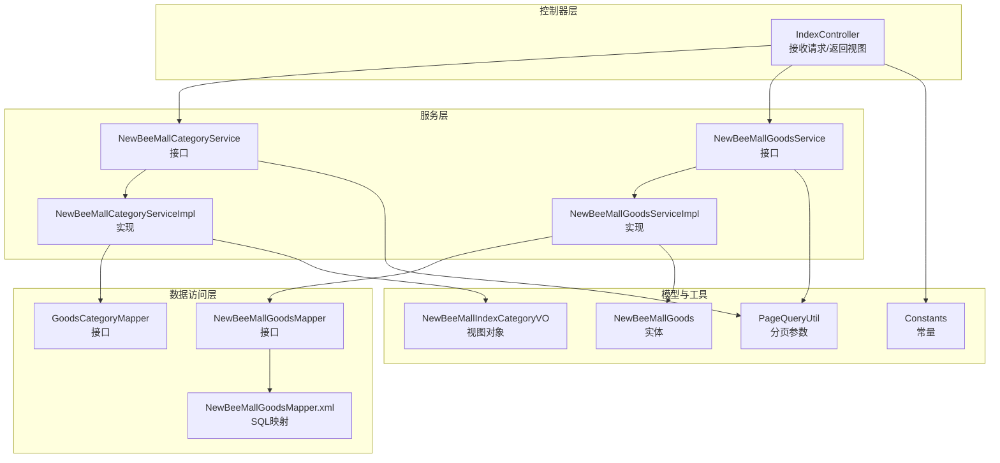
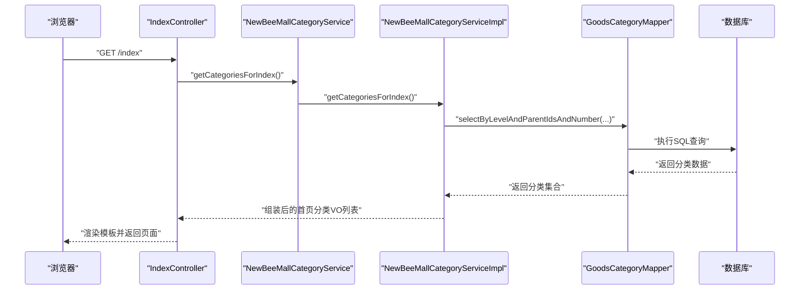
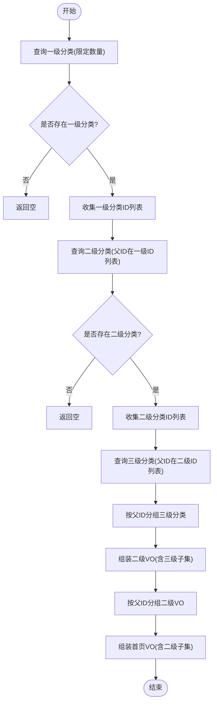
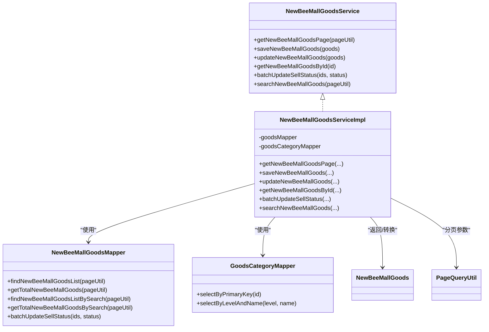
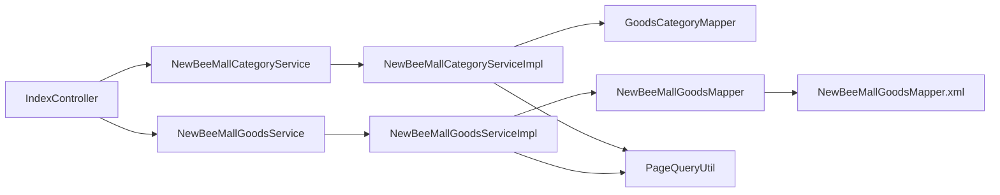

# MVC分层架构

<cite>
**本文引用的文件**
- [IndexController.java](file://src/main/java/ltd/newbee/mall/controller/mall/IndexController.java)
- [NewBeeMallCategoryService.java](file://src/main/java/ltd/newbee/mall/service/NewBeeMallCategoryService.java)
- [NewBeeMallCategoryServiceImpl.java](file://src/main/java/ltd/newbee/mall/service/impl/NewBeeMallCategoryServiceImpl.java)
- [GoodsCategoryMapper.java](file://src/main/java/ltd/newbee/mall/dao/GoodsCategoryMapper.java)
- [NewBeeMallIndexCategoryVO.java](file://src/main/java/ltd/newbee/mall/controller/vo/NewBeeMallIndexCategoryVO.java)
- [Constants.java](file://src/main/java/ltd/newbee/mall/common/Constants.java)
- [NewBeeMallGoodsService.java](file://src/main/java/ltd/newbee/mall/service/NewBeeMallGoodsService.java)
- [NewBeeMallGoodsServiceImpl.java](file://src/main/java/ltd/newbee/mall/service/impl/NewBeeMallGoodsServiceImpl.java)
- [NewBeeMallGoodsMapper.java](file://src/main/java/ltd/newbee/mall/dao/NewBeeMallGoodsMapper.java)
- [NewBeeMallGoodsMapper.xml](file://src/main/resources/mapper/NewBeeMallGoodsMapper.xml)
- [NewBeeMallGoods.java](file://src/main/java/ltd/newbee/mall/entity/NewBeeMallGoods.java)
- [PageQueryUtil.java](file://src/main/java/ltd/newbee/mall/util/PageQueryUtil.java)
- [pom.xml](file://pom.xml)
</cite>

## 目录
1. [引言](#引言)
2. [项目结构](#项目结构)
3. [核心组件](#核心组件)
4. [架构总览](#架构总览)
5. [详细组件分析](#详细组件分析)
6. [依赖分析](#依赖分析)
7. [性能考量](#性能考量)
8. [故障排查指南](#故障排查指南)
9. [结论](#结论)

## 引言
本文件围绕 newbee-mall 的 MVC 分层架构进行深入剖析，重点说明控制器（Controller）如何接收前端请求并调用服务层（Service），服务层如何封装核心业务逻辑并协调数据访问层（DAO），以及 DAO 层如何通过 MyBatis 与数据库交互。以首页商品展示功能为例，追踪从 IndexController 接收请求，调用 NewBeeMallCategoryService 获取分类数据，再到 GoodsCategoryMapper 执行 SQL 查询的完整调用链；同时补充首页轮播图与首页配置商品的调用路径，解释各层之间的依赖关系和职责边界，阐述该分层架构如何提升代码的可维护性和可测试性，并讨论其在实际开发中的优势与潜在挑战。

## 项目结构
newbee-mall 采用典型的 Spring Boot + MyBatis 分层组织方式：
- 控制器层：位于 controller 包，负责接收 HTTP 请求、组装响应视图或数据。
- 服务层：位于 service 包及其实现包，封装业务规则与流程编排。
- 数据访问层：位于 dao 包，定义 Mapper 接口；SQL 映射位于 resources/mapper 下的 XML 文件。
- 实体与工具：entity 定义持久化实体，util 提供分页、结果封装等通用工具。
- 配置与常量：common 定义常量与枚举，config 提供 WebMvc 配置。

图表来源
- [IndexController.java](file://src/main/java/ltd/newbee/mall/controller/mall/IndexController.java#L1-L58)
- [NewBeeMallCategoryService.java](file://src/main/java/ltd/newbee/mall/service/NewBeeMallCategoryService.java#L1-L60)
- [NewBeeMallCategoryServiceImpl.java](file://src/main/java/ltd/newbee/mall/service/impl/NewBeeMallCategoryServiceImpl.java#L1-L168)
- [GoodsCategoryMapper.java](file://src/main/java/ltd/newbee/mall/dao/GoodsCategoryMapper.java#L1-L39)
- [NewBeeMallGoodsService.java](file://src/main/java/ltd/newbee/mall/service/NewBeeMallGoodsService.java#L1-L74)
- [NewBeeMallGoodsServiceImpl.java](file://src/main/java/ltd/newbee/mall/service/impl/NewBeeMallGoodsServiceImpl.java#L1-L139)
- [NewBeeMallGoodsMapper.java](file://src/main/java/ltd/newbee/mall/dao/NewBeeMallGoodsMapper.java#L1-L53)
- [NewBeeMallGoodsMapper.xml](file://src/main/resources/mapper/NewBeeMallGoodsMapper.xml#L1-L391)
- [NewBeeMallIndexCategoryVO.java](file://src/main/java/ltd/newbee/mall/controller/vo/NewBeeMallIndexCategoryVO.java#L1-L59)
- [NewBeeMallGoods.java](file://src/main/java/ltd/newbee/mall/entity/NewBeeMallGoods.java#L1-L202)
- [PageQueryUtil.java](file://src/main/java/ltd/newbee/mall/util/PageQueryUtil.java#L1-L56)
- [Constants.java](file://src/main/java/ltd/newbee/mall/common/Constants.java#L1-L48)

章节来源
- [pom.xml](file://pom.xml#L1-L83)

## 核心组件
- 控制器层（IndexController）
  - 负责接收 GET /index、/、/index.html 请求，组装首页所需数据（分类、轮播、热销、新品、推荐），并将数据写入请求域后返回模板视图。
  - 关键调用点：调用 CategoryService 获取分类树、调用 CarouselService 获取轮播、调用 IndexConfigService 获取配置商品。
- 服务层（CategoryService/Impl）
  - 封装首页分类树构建逻辑：按层级拉取一级、二级、三级分类，组装为 VO 结构，供控制器渲染。
  - 关键调用点：调用 GoodsCategoryMapper 执行多表查询与聚合。
- 服务层（GoodsService/Impl）
  - 封装商品相关业务：分页查询、保存/更新、搜索、批量上下架等。
  - 关键调用点：调用 NewBeeMallGoodsMapper 执行 SQL。
- 数据访问层（Mapper 接口 + XML）
  - Mapper 接口定义方法签名；XML 中编写 SQL 语句，使用 MyBatis ResultMap 映射实体。
  - 关键调用点：提供分页查询、条件查询、批量操作等 SQL。

章节来源
- [IndexController.java](file://src/main/java/ltd/newbee/mall/controller/mall/IndexController.java#L1-L58)
- [NewBeeMallCategoryService.java](file://src/main/java/ltd/newbee/mall/service/NewBeeMallCategoryService.java#L1-L60)
- [NewBeeMallCategoryServiceImpl.java](file://src/main/java/ltd/newbee/mall/service/impl/NewBeeMallCategoryServiceImpl.java#L1-L168)
- [GoodsCategoryMapper.java](file://src/main/java/ltd/newbee/mall/dao/GoodsCategoryMapper.java#L1-L39)
- [NewBeeMallGoodsService.java](file://src/main/java/ltd/newbee/mall/service/NewBeeMallGoodsService.java#L1-L74)
- [NewBeeMallGoodsServiceImpl.java](file://src/main/java/ltd/newbee/mall/service/impl/NewBeeMallGoodsServiceImpl.java#L1-L139)
- [NewBeeMallGoodsMapper.java](file://src/main/java/ltd/newbee/mall/dao/NewBeeMallGoodsMapper.java#L1-L53)
- [NewBeeMallGoodsMapper.xml](file://src/main/resources/mapper/NewBeeMallGoodsMapper.xml#L1-L391)

## 架构总览
下面以“首页商品展示”为主线，绘制从控制器到服务再到 DAO 的完整调用链路。

图表来源
- [IndexController.java](file://src/main/java/ltd/newbee/mall/controller/mall/IndexController.java#L1-L58)
- [NewBeeMallCategoryService.java](file://src/main/java/ltd/newbee/mall/service/NewBeeMallCategoryService.java#L1-L60)
- [NewBeeMallCategoryServiceImpl.java](file://src/main/java/ltd/newbee/mall/service/impl/NewBeeMallCategoryServiceImpl.java#L1-L168)
- [GoodsCategoryMapper.java](file://src/main/java/ltd/newbee/mall/dao/GoodsCategoryMapper.java#L1-L39)

## 详细组件分析

### 控制器层：IndexController
- 职责
  - 接收首页请求，调用多个服务获取首页所需数据（分类、轮播、配置商品等），将数据放入请求域并返回视图。
- 关键点
  - 使用注解注入多个服务，分别负责分类、轮播、配置商品。
  - 通过常量控制首页展示数量。
- 典型调用链
  - getCategoriesForIndex -> CategoryServiceImpl -> GoodsCategoryMapper
  - getCarouselsForIndex -> CarouselServiceImpl -> CarouselMapper
  - getConfigGoodsesForIndex -> IndexConfigServiceImpl -> IndexConfigMapper -> NewBeeMallGoodsMapper

章节来源
- [IndexController.java](file://src/main/java/ltd/newbee/mall/controller/mall/IndexController.java#L1-L58)
- [Constants.java](file://src/main/java/ltd/newbee/mall/common/Constants.java#L1-L48)

### 服务层：分类服务（CategoryService/Impl）
- 职责
  - 封装首页分类树构建：按层级拉取一级、二级、三级分类，组装为 VO 结构。
- 处理逻辑
  - 先查一级分类（限定数量），再查对应二级分类，再查对应三级分类，最后按父 ID 分组组装为二级 VO 列表，再将二级 VO 列表按一级父 ID 分组组装为首页 VO。
- 关键 Mapper 方法
  - selectByLevelAndParentIdsAndNumber：按层级与父 ID 列表查询分类，支持限制数量。
- 性能与复杂度
  - 多次查询与分组聚合，时间复杂度与分类层级深度和数量相关；可通过缓存优化。

图表来源
- [NewBeeMallCategoryServiceImpl.java](file://src/main/java/ltd/newbee/mall/service/impl/NewBeeMallCategoryServiceImpl.java#L1-L168)
- [GoodsCategoryMapper.java](file://src/main/java/ltd/newbee/mall/dao/GoodsCategoryMapper.java#L1-L39)
- [NewBeeMallIndexCategoryVO.java](file://src/main/java/ltd/newbee/mall/controller/vo/NewBeeMallIndexCategoryVO.java#L1-L59)

章节来源
- [NewBeeMallCategoryService.java](file://src/main/java/ltd/newbee/mall/service/NewBeeMallCategoryService.java#L1-L60)
- [NewBeeMallCategoryServiceImpl.java](file://src/main/java/ltd/newbee/mall/service/impl/NewBeeMallCategoryServiceImpl.java#L1-L168)
- [GoodsCategoryMapper.java](file://src/main/java/ltd/newbee/mall/dao/GoodsCategoryMapper.java#L1-L39)
- [NewBeeMallIndexCategoryVO.java](file://src/main/java/ltd/newbee/mall/controller/vo/NewBeeMallIndexCategoryVO.java#L1-L59)

### 服务层：商品服务（GoodsService/Impl）
- 职责
  - 封装商品相关业务：分页查询、保存/更新、搜索、批量上下架等。
- 关键点
  - 在保存/更新时校验分类层级是否为三级，避免非法分类。
  - 使用 PageQueryUtil 计算分页起始位置与页码。
  - 使用 BeanUtil 进行实体与 VO 的转换。
- 典型调用链
  - getNewBeeMallGoodsPage -> NewBeeMallGoodsMapper.findNewBeeMallGoodsList / getTotalNewBeeMallGoods
  - searchNewBeeMallGoods -> NewBeeMallGoodsMapper.findNewBeeMallGoodsListBySearch / getTotalNewBeeMallGoodsBySearch

图表来源
- [NewBeeMallGoodsService.java](file://src/main/java/ltd/newbee/mall/service/NewBeeMallGoodsService.java#L1-L74)
- [NewBeeMallGoodsServiceImpl.java](file://src/main/java/ltd/newbee/mall/service/impl/NewBeeMallGoodsServiceImpl.java#L1-L139)
- [NewBeeMallGoodsMapper.java](file://src/main/java/ltd/newbee/mall/dao/NewBeeMallGoodsMapper.java#L1-L53)
- [GoodsCategoryMapper.java](file://src/main/java/ltd/newbee/mall/dao/GoodsCategoryMapper.java#L1-L39)
- [NewBeeMallGoods.java](file://src/main/java/ltd/newbee/mall/entity/NewBeeMallGoods.java#L1-L202)
- [PageQueryUtil.java](file://src/main/java/ltd/newbee/mall/util/PageQueryUtil.java#L1-L56)

章节来源
- [NewBeeMallGoodsService.java](file://src/main/java/ltd/newbee/mall/service/NewBeeMallGoodsService.java#L1-L74)
- [NewBeeMallGoodsServiceImpl.java](file://src/main/java/ltd/newbee/mall/service/impl/NewBeeMallGoodsServiceImpl.java#L1-L139)
- [NewBeeMallGoodsMapper.java](file://src/main/java/ltd/newbee/mall/dao/NewBeeMallGoodsMapper.java#L1-L53)
- [NewBeeMallGoodsMapper.xml](file://src/main/resources/mapper/NewBeeMallGoodsMapper.xml#L1-L391)
- [PageQueryUtil.java](file://src/main/java/ltd/newbee/mall/util/PageQueryUtil.java#L1-L56)

### 数据访问层：MyBatis 映射
- GoodsCategoryMapper
  - 提供按层级与父 ID 列表查询分类的方法，支持限制数量。
- NewBeeMallGoodsMapper
  - 提供分页查询、条件查询、批量插入、库存更新、批量上下架等方法。
  - XML 中通过 ResultMap 映射实体，支持 BLOB 字段。
- PageQueryUtil
  - 将 page、limit 转换为 SQL 的 start 参数，便于分页查询。

章节来源
- [GoodsCategoryMapper.java](file://src/main/java/ltd/newbee/mall/dao/GoodsCategoryMapper.java#L1-L39)
- [NewBeeMallGoodsMapper.java](file://src/main/java/ltd/newbee/mall/dao/NewBeeMallGoodsMapper.java#L1-L53)
- [NewBeeMallGoodsMapper.xml](file://src/main/resources/mapper/NewBeeMallGoodsMapper.xml#L1-L391)
- [PageQueryUtil.java](file://src/main/java/ltd/newbee/mall/util/PageQueryUtil.java#L1-L56)

## 依赖分析
- 控制器依赖服务接口，服务实现依赖 Mapper 接口，Mapper 依赖 MyBatis XML 映射。
- 服务层内部存在跨 Mapper 的协作（如商品服务在保存/更新时需要先校验分类）。
- 分页参数通过 PageQueryUtil 统一传递，降低重复计算。

图表来源
- [IndexController.java](file://src/main/java/ltd/newbee/mall/controller/mall/IndexController.java#L1-L58)
- [NewBeeMallCategoryService.java](file://src/main/java/ltd/newbee/mall/service/NewBeeMallCategoryService.java#L1-L60)
- [NewBeeMallCategoryServiceImpl.java](file://src/main/java/ltd/newbee/mall/service/impl/NewBeeMallCategoryServiceImpl.java#L1-L168)
- [NewBeeMallGoodsService.java](file://src/main/java/ltd/newbee/mall/service/NewBeeMallGoodsService.java#L1-L74)
- [NewBeeMallGoodsServiceImpl.java](file://src/main/java/ltd/newbee/mall/service/impl/NewBeeMallGoodsServiceImpl.java#L1-L139)
- [GoodsCategoryMapper.java](file://src/main/java/ltd/newbee/mall/dao/GoodsCategoryMapper.java#L1-L39)
- [NewBeeMallGoodsMapper.java](file://src/main/java/ltd/newbee/mall/dao/NewBeeMallGoodsMapper.java#L1-L53)
- [NewBeeMallGoodsMapper.xml](file://src/main/resources/mapper/NewBeeMallGoodsMapper.xml#L1-L391)
- [PageQueryUtil.java](file://src/main/java/ltd/newbee/mall/util/PageQueryUtil.java#L1-L56)

## 性能考量
- 分页查询
  - 通过 PageQueryUtil 计算 start，避免一次性加载大量数据。
  - Mapper 提供带 where 条件的分页查询与总数统计，减少不必要的全表扫描。
- 条件查询
  - XML 中使用动态 where 与 if 标签，仅拼接有效条件，降低 SQL 复杂度。
- 批量操作
  - 提供批量插入与库存更新，减少多次往返数据库的开销。
- 缓存建议
  - 首页分类树可引入缓存，降低多次查询与分组聚合成本。
  - 热门商品、轮播图等静态数据可缓存，缩短响应时间。

## 故障排查指南
- 控制器层
  - 若分类为空，控制器会抛出异常提示“分类数据不完善”，需检查分类服务是否正确返回数据。
- 服务层
  - 保存/更新商品时，若分类层级非三级或名称冲突，会返回相应错误码；应检查分类数据与唯一性约束。
- DAO 层
  - 分页查询无结果时，需确认 PageQueryUtil 的 page/limit 是否合理，以及 SQL 条件是否匹配数据。
  - 批量上下架失败时，检查传入的 ID 列表与状态值。

章节来源
- [IndexController.java](file://src/main/java/ltd/newbee/mall/controller/mall/IndexController.java#L1-L58)
- [NewBeeMallGoodsServiceImpl.java](file://src/main/java/ltd/newbee/mall/service/impl/NewBeeMallGoodsServiceImpl.java#L1-L139)
- [NewBeeMallGoodsMapper.xml](file://src/main/resources/mapper/NewBeeMallGoodsMapper.xml#L1-L391)

## 结论
newbee-mall 的 MVC 分层架构清晰地划分了职责边界：控制器负责请求接入与视图渲染，服务层封装业务规则与流程编排，DAO 层专注数据访问与 SQL 映射。以首页商品展示为例，从 IndexController 到 CategoryService/Impl 再到 GoodsCategoryMapper 的调用链体现了良好的分层与解耦。该架构提升了代码的可维护性与可测试性，便于单元测试与集成测试的开展。在实际开发中，建议进一步引入缓存、事务管理与统一异常处理，以增强性能与稳定性。