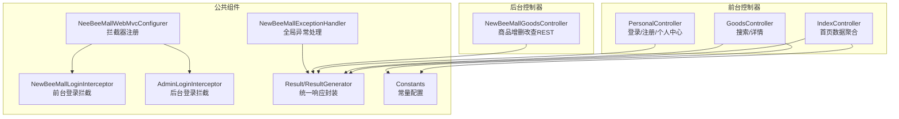
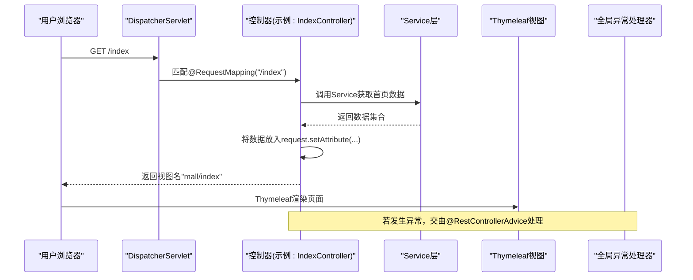
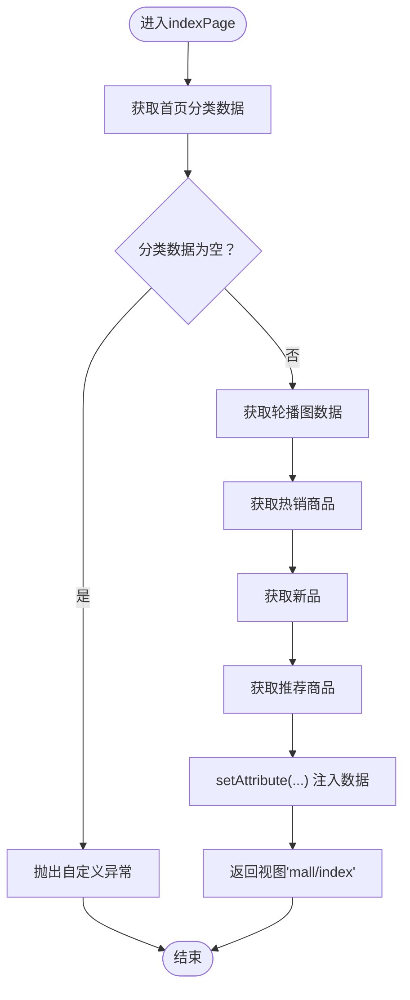
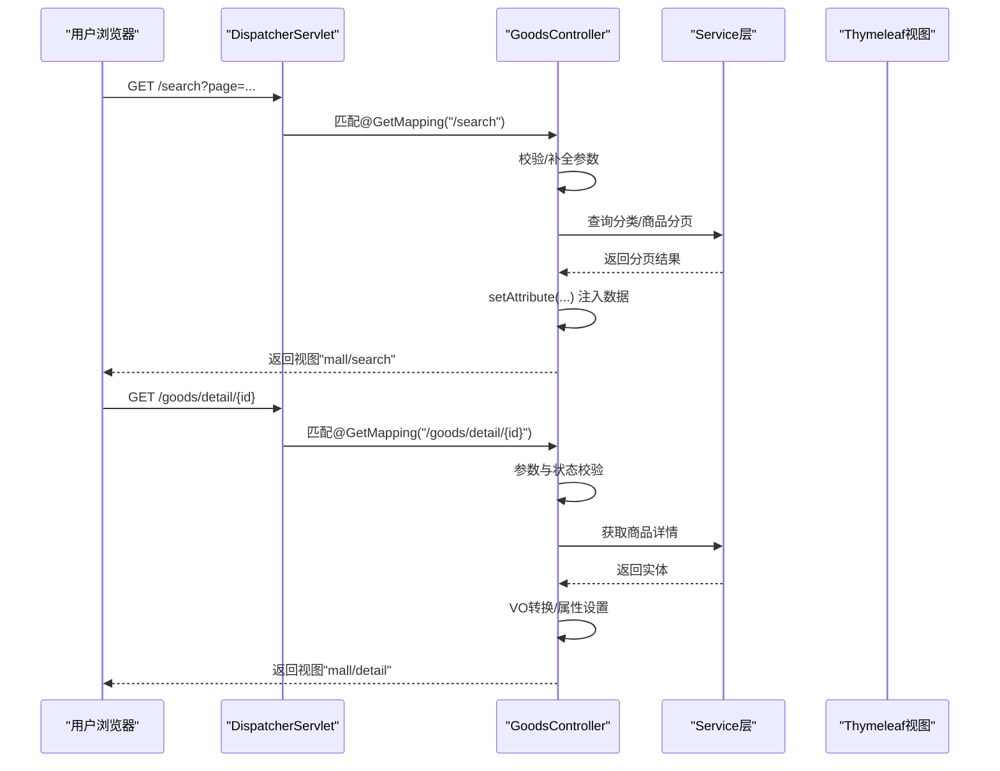
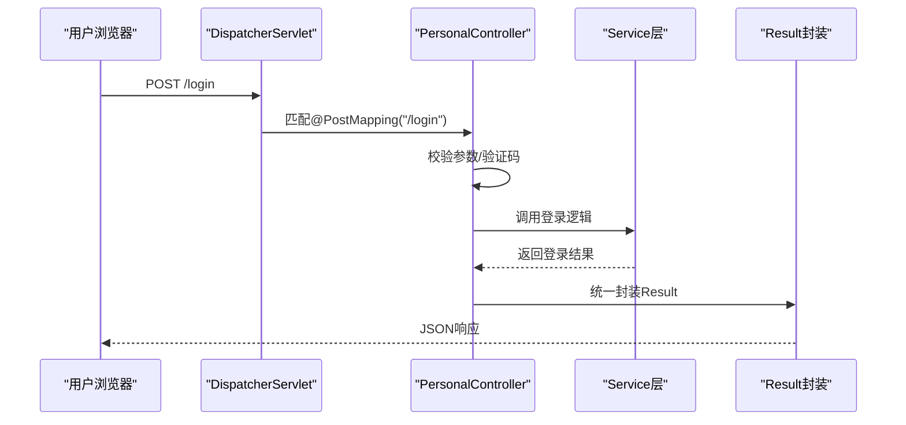
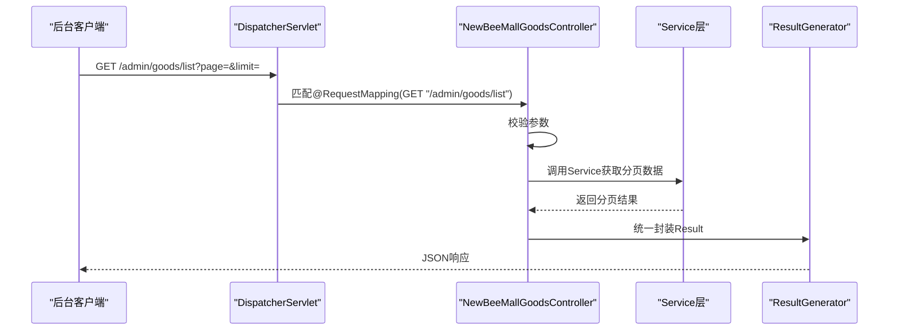
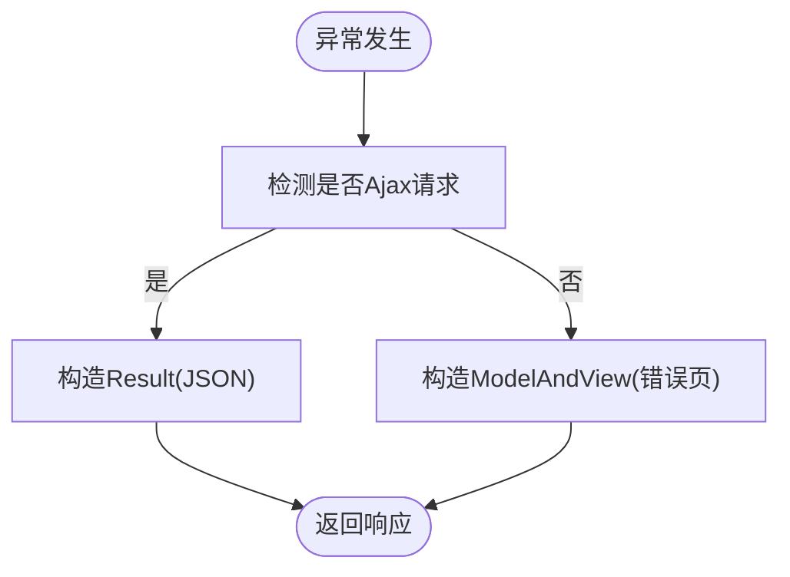
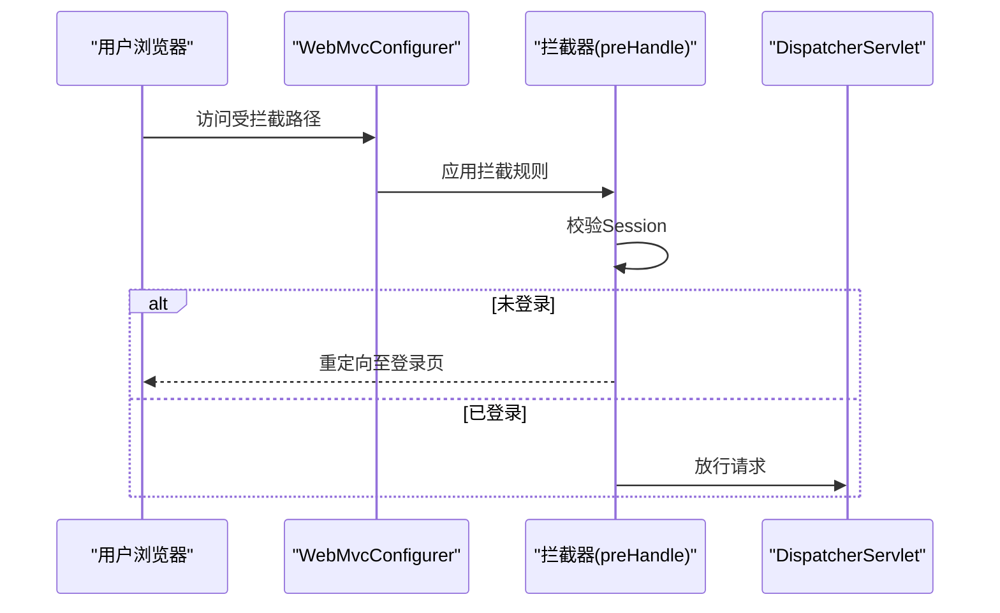
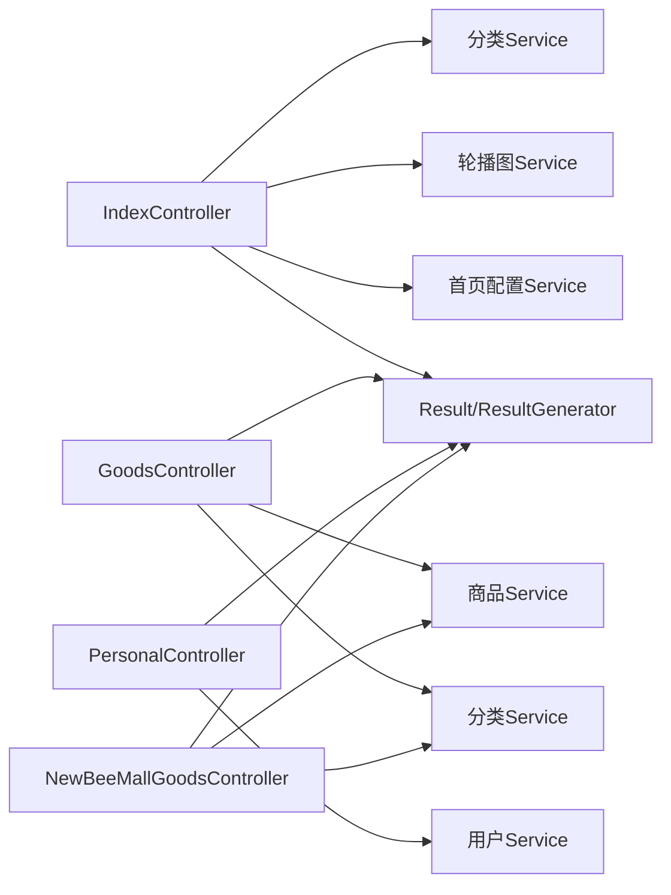

# 控制器层（Controller）

<cite>
**本文引用的文件**
- [IndexController.java](file://src/main/java/ltd/newbee/mall/controller/mall/IndexController.java)
- [NewBeeMallGoodsController.java](file://src/main/java/ltd/newbee/mall/controller/admin/NewBeeMallGoodsController.java)
- [GoodsController.java](file://src/main/java/ltd/newbee/mall/controller/mall/GoodsController.java)
- [PersonalController.java](file://src/main/java/ltd/newbee/mall/controller/mall/PersonalController.java)
- [NewBeeMallExceptionHandler.java](file://src/main/java/ltd/newbee/mall/controller/common/NewBeeMallExceptionHandler.java)
- [NeeBeeMallWebMvcConfigurer.java](file://src/main/java/ltd/newbee/mall/config/NeeBeeMallWebMvcConfigurer.java)
- [NewBeeMallLoginInterceptor.java](file://src/main/java/ltd/newbee/mall/interceptor/NewBeeMallLoginInterceptor.java)
- [AdminLoginInterceptor.java](file://src/main/java/ltd/newbee/mall/interceptor/AdminLoginInterceptor.java)
- [Result.java](file://src/main/java/ltd/newbee/mall/util/Result.java)
- [ResultGenerator.java](file://src/main/java/ltd/newbee/mall/util/ResultGenerator.java)
- [Constants.java](file://src/main/java/ltd/newbee/mall/common/Constants.java)
- [NewBeeMallIndexCategoryVO.java](file://src/main/java/ltd/newbee/mall/controller/vo/NewBeeMallIndexCategoryVO.java)
</cite>

## 目录
1. [引言](#引言)
2. [项目结构](#项目结构)
3. [核心组件](#核心组件)
4. [架构总览](#架构总览)
5. [详细组件分析](#详细组件分析)
6. [依赖关系分析](#依赖关系分析)
7. [性能考量](#性能考量)
8. [故障排查指南](#故障排查指南)
9. [结论](#结论)

## 引言
本章节聚焦于newbee-mall的控制器层（Controller）设计与实现，系统性阐述以下要点：
- 使用@RequestMapping及其衍生注解（如@GetMapping、@PostMapping、@RequestBody、@RequestParam、@PathVariable）进行HTTP请求映射与参数绑定。
- 在控制器中完成请求校验、参数绑定、调用Service层、结果封装与视图跳转或JSON响应。
- 以IndexController的indexPage方法为例，说明如何聚合轮播图、分类、热销商品等数据并通过HttpServletRequest.setAttribute()传递给Thymeleaf视图模板。
- 分析后台商品管理控制器NewBeeMallGoodsController如何实现商品的增删改查RESTful接口，并统一返回Result封装对象。
- 解释控制器层的职责边界：请求校验、参数绑定、调用服务、结果封装与视图跳转。
- 结合代码说明异常处理机制（通过NewBeeMallExceptionHandler统一捕获）和拦截器（如NewBeeMallLoginInterceptor、AdminLoginInterceptor）在Controller中的应用。

## 项目结构
控制器层位于包路径ltd.newbee.mall.controller下，分为前台（mall）与后台（admin）两部分：
- 前台控制器：IndexController、GoodsController、PersonalController等，负责用户端页面渲染与交互。
- 后台控制器：NewBeeMallGoodsController等，负责后台管理界面与RESTful接口。
- 公共异常处理：NewBeeMallExceptionHandler提供全局异常处理。
- 拦截器配置：NeeBeeMallWebMvcConfigurer集中注册拦截器；拦截器包括用户登录拦截（NewBeeMallLoginInterceptor）、后台登录拦截（AdminLoginInterceptor）等。

图表来源
- [IndexController.java](file://src/main/java/ltd/newbee/mall/controller/mall/IndexController.java#L1-L58)
- [GoodsController.java](file://src/main/java/ltd/newbee/mall/controller/mall/GoodsController.java#L1-L91)
- [PersonalController.java](file://src/main/java/ltd/newbee/mall/controller/mall/PersonalController.java#L1-L137)
- [NewBeeMallGoodsController.java](file://src/main/java/ltd/newbee/mall/controller/admin/NewBeeMallGoodsController.java#L1-L228)
- [NewBeeMallExceptionHandler.java](file://src/main/java/ltd/newbee/mall/controller/common/NewBeeMallExceptionHandler.java#L1-L56)
- [NeeBeeMallWebMvcConfigurer.java](file://src/main/java/ltd/newbee/mall/config/NeeBeeMallWebMvcConfigurer.java#L1-L67)
- [NewBeeMallLoginInterceptor.java](file://src/main/java/ltd/newbee/mall/interceptor/NewBeeMallLoginInterceptor.java#L1-L49)
- [AdminLoginInterceptor.java](file://src/main/java/ltd/newbee/mall/interceptor/AdminLoginInterceptor.java#L1-L51)
- [Result.java](file://src/main/java/ltd/newbee/mall/util/Result.java#L1-L58)
- [ResultGenerator.java](file://src/main/java/ltd/newbee/mall/util/ResultGenerator.java#L1-L59)
- [Constants.java](file://src/main/java/ltd/newbee/mall/common/Constants.java#L1-L48)

章节来源
- [IndexController.java](file://src/main/java/ltd/newbee/mall/controller/mall/IndexController.java#L1-L58)
- [NewBeeMallGoodsController.java](file://src/main/java/ltd/newbee/mall/controller/admin/NewBeeMallGoodsController.java#L1-L228)
- [NeeBeeMallWebMvcConfigurer.java](file://src/main/java/ltd/newbee/mall/config/NeeBeeMallWebMvcConfigurer.java#L1-L67)

## 核心组件
- IndexController：首页数据聚合，使用@GetMapping映射“/index”、“/”、“/index.html”，从Service层获取分类、轮播图、热销/新品/推荐商品，通过request.setAttribute()向Thymeleaf模板传递数据，返回视图名称“mall/index”。
- GoodsController：搜索页与商品详情页，使用@GetMapping映射“/search”、“/goods/detail/{goodsId}”，对参数进行校验与默认值填充，调用Service层查询并封装到request域，返回相应视图。
- PersonalController：登录、注册、退出、个人信息更新等，使用@GetMapping与@PostMapping映射多处路径，对参数进行校验，调用Service层并统一返回Result。
- NewBeeMallGoodsController：后台商品管理REST接口，使用@RequestMapping与衍生注解映射“/admin/goods”系列路径，支持列表、新增、修改、详情、批量修改销售状态等，统一返回Result封装对象。
- NewBeeMallExceptionHandler：@RestControllerAdvice全局异常处理，区分Ajax与非Ajax请求，返回Result或错误视图。
- NeeBeeMallWebMvcConfigurer：注册拦截器，分别对后台、前台、购物车数量等场景进行拦截。
- 拦截器：NewBeeMallLoginInterceptor与AdminLoginInterceptor分别在预处理阶段校验会话状态，未登录时重定向至登录页。
- 统一响应：Result与ResultGenerator提供统一的响应结构与便捷构造方法。

章节来源
- [IndexController.java](file://src/main/java/ltd/newbee/mall/controller/mall/IndexController.java#L1-L58)
- [GoodsController.java](file://src/main/java/ltd/newbee/mall/controller/mall/GoodsController.java#L1-L91)
- [PersonalController.java](file://src/main/java/ltd/newbee/mall/controller/mall/PersonalController.java#L1-L137)
- [NewBeeMallGoodsController.java](file://src/main/java/ltd/newbee/mall/controller/admin/NewBeeMallGoodsController.java#L1-L228)
- [NewBeeMallExceptionHandler.java](file://src/main/java/ltd/newbee/mall/controller/common/NewBeeMallExceptionHandler.java#L1-L56)
- [NeeBeeMallWebMvcConfigurer.java](file://src/main/java/ltd/newbee/mall/config/NeeBeeMallWebMvcConfigurer.java#L1-L67)
- [NewBeeMallLoginInterceptor.java](file://src/main/java/ltd/newbee/mall/interceptor/NewBeeMallLoginInterceptor.java#L1-L49)
- [AdminLoginInterceptor.java](file://src/main/java/ltd/newbee/mall/interceptor/AdminLoginInterceptor.java#L1-L51)
- [Result.java](file://src/main/java/ltd/newbee/mall/util/Result.java#L1-L58)
- [ResultGenerator.java](file://src/main/java/ltd/newbee/mall/util/ResultGenerator.java#L1-L59)

## 架构总览
控制器层遵循Spring MVC典型分层：请求经由DispatcherServlet进入，按@Controller注解与@RequestMapping映射定位具体方法，完成参数绑定后调用Service层业务逻辑，随后根据返回类型决定视图渲染或JSON响应。异常统一由@RestControllerAdvice处理，拦截器在preHandle阶段进行权限校验。

图表来源
- [IndexController.java](file://src/main/java/ltd/newbee/mall/controller/mall/IndexController.java#L1-L58)
- [NewBeeMallExceptionHandler.java](file://src/main/java/ltd/newbee/mall/controller/common/NewBeeMallExceptionHandler.java#L1-L56)

## 详细组件分析

### IndexController：首页数据聚合
- 映射方式：使用@GetMapping映射多个路径，覆盖常见首页访问入口。
- 参数绑定：无外部参数，直接使用HttpServletRequest注入。
- 业务流程：
  - 调用分类Service获取首页分类数据，若为空则抛出自定义异常。
  - 调用轮播图Service与首页配置Service分别获取轮播图与热销/新品/推荐商品。
  - 通过request.setAttribute()将各类数据放入请求域，供Thymeleaf模板使用。
  - 返回视图名称“mall/index”。
- 关键点：职责清晰，仅负责聚合数据与视图跳转；异常通过自定义异常类触发统一处理。

图表来源
- [IndexController.java](file://src/main/java/ltd/newbee/mall/controller/mall/IndexController.java#L1-L58)
- [Constants.java](file://src/main/java/ltd/newbee/mall/common/Constants.java#L1-L48)
- [NewBeeMallIndexCategoryVO.java](file://src/main/java/ltd/newbee/mall/controller/vo/NewBeeMallIndexCategoryVO.java#L1-L59)

章节来源
- [IndexController.java](file://src/main/java/ltd/newbee/mall/controller/mall/IndexController.java#L1-L58)
- [Constants.java](file://src/main/java/ltd/newbee/mall/common/Constants.java#L1-L48)
- [NewBeeMallIndexCategoryVO.java](file://src/main/java/ltd/newbee/mall/controller/vo/NewBeeMallIndexCategoryVO.java#L1-L59)

### GoodsController：搜索与详情
- 搜索页：
  - 映射：@GetMapping({"/search", "/search.html})。
  - 参数绑定：@RequestParam Map<String,Object> params，自动绑定查询参数。
  - 校验与默认值：若缺少page则默认为1，限制每页条数为常量配置。
  - 数据封装：根据分类参数封装SearchPageCategoryVO；关键字做空格过滤；仅查询上架状态商品；最终将分页结果放入request域。
  - 视图：返回“mall/search”。
- 商品详情：
  - 映射：@GetMapping("/goods/detail/{goodsId}")。
  - 参数绑定：@PathVariable提取路径变量。
  - 校验：参数合法性与商品上下架状态校验，不合法或已下架抛出自定义异常。
  - 数据转换：将实体复制到VO，拆分轮播图字符串为数组，注入request域。
  - 视图：返回“mall/detail”。

图表来源
- [GoodsController.java](file://src/main/java/ltd/newbee/mall/controller/mall/GoodsController.java#L1-L91)
- [Constants.java](file://src/main/java/ltd/newbee/mall/common/Constants.java#L1-L48)

章节来源
- [GoodsController.java](file://src/main/java/ltd/newbee/mall/controller/mall/GoodsController.java#L1-L91)
- [Constants.java](file://src/main/java/ltd/newbee/mall/common/Constants.java#L1-L48)

### PersonalController：登录/注册/退出/信息更新
- 登录：
  - 映射：@PostMapping("/login")。
  - 参数绑定：@RequestParam绑定用户名、验证码、密码。
  - 校验：用户名、密码、验证码非空校验；从Session中取出验证码并校验；调用Service执行登录。
  - 结果：成功返回统一成功Result，失败返回对应错误Result。
- 注册：
  - 映射：@PostMapping("/register")。
  - 参数绑定：同登录，校验验证码后调用Service注册。
- 退出：
  - 映射：@GetMapping("/logout")，移除Session中的用户标识并返回登录页。
- 个人信息更新：
  - 映射：@PostMapping("/personal/updateInfo")，@RequestBody绑定用户信息，调用Service并返回Result。

图表来源
- [PersonalController.java](file://src/main/java/ltd/newbee/mall/controller/mall/PersonalController.java#L1-L137)
- [ResultGenerator.java](file://src/main/java/ltd/newbee/mall/util/ResultGenerator.java#L1-L59)

章节来源
- [PersonalController.java](file://src/main/java/ltd/newbee/mall/controller/mall/PersonalController.java#L1-L137)
- [ResultGenerator.java](file://src/main/java/ltd/newbee/mall/util/ResultGenerator.java#L1-L59)

### NewBeeMallGoodsController：后台商品管理REST接口
- 页面跳转：
  - GET /admin/goods：设置path并返回后台商品管理页面。
  - GET /admin/goods/edit：返回编辑页面，构建分类三级联动所需数据。
  - GET /admin/goods/edit/{goodsId}：根据ID加载商品并构建分类联动数据。
- 列表：
  - GET /admin/goods/list：@RequestParam接收分页参数，校验缺失则返回失败Result；否则封装PageQueryUtil并调用Service获取分页数据，统一返回Result。
- 新增：
  - POST /admin/goods/save：@RequestBody接收NewBeeMallGoods对象，进行字段完整性校验，调用Service保存，返回Result。
- 修改：
  - POST /admin/goods/update：@RequestBody接收NewBeeMallGoods对象，进行字段完整性校验，调用Service更新，返回Result。
- 详情：
  - GET /admin/goods/info/{id}：@PathVariable提取ID，调用Service获取商品，统一返回Result。
- 批量修改销售状态：
  - PUT /admin/goods/status/{sellStatus}：@RequestBody接收ID数组，@PathVariable接收状态值，校验参数与状态范围，调用Service批量更新，返回Result。

图表来源
- [NewBeeMallGoodsController.java](file://src/main/java/ltd/newbee/mall/controller/admin/NewBeeMallGoodsController.java#L1-L228)
- [ResultGenerator.java](file://src/main/java/ltd/newbee/mall/util/ResultGenerator.java#L1-L59)

章节来源
- [NewBeeMallGoodsController.java](file://src/main/java/ltd/newbee/mall/controller/admin/NewBeeMallGoodsController.java#L1-L228)
- [ResultGenerator.java](file://src/main/java/ltd/newbee/mall/util/ResultGenerator.java#L1-L59)

### 异常处理机制：NewBeeMallExceptionHandler
- 注解：@RestControllerAdvice，作用于所有控制器。
- 处理逻辑：
  - 捕获Exception.class，区分是否为自定义异常，设置消息。
  - 识别Ajax请求（通过Content-Type、Accept、X-Requested-With头部判断），返回Result JSON；否则返回错误视图模板。
- 影响范围：所有控制器抛出的异常均可被该处理器统一捕获并格式化输出。

图表来源
- [NewBeeMallExceptionHandler.java](file://src/main/java/ltd/newbee/mall/controller/common/NewBeeMallExceptionHandler.java#L1-L56)

章节来源
- [NewBeeMallExceptionHandler.java](file://src/main/java/ltd/newbee/mall/controller/common/NewBeeMallExceptionHandler.java#L1-L56)

### 拦截器：登录拦截与资源处理
- NeeBeeMallWebMvcConfigurer：
  - 注册AdminLoginInterceptor：拦截/admin/**，排除登录页与静态资源，强制后台登录。
  - 注册NewBeeMallLoginInterceptor：拦截前台特定路径（如订单、购物车、个人中心等），排除登录/注册/登出，强制前台登录。
  - 注册资源处理器：映射上传图片等静态资源路径。
- NewBeeMallLoginInterceptor：preHandle校验Session中用户标识，未登录重定向至登录页。
- AdminLoginInterceptor：preHandle校验后台登录Session，未登录重定向至后台登录页。

图表来源
- [NeeBeeMallWebMvcConfigurer.java](file://src/main/java/ltd/newbee/mall/config/NeeBeeMallWebMvcConfigurer.java#L1-L67)
- [NewBeeMallLoginInterceptor.java](file://src/main/java/ltd/newbee/mall/interceptor/NewBeeMallLoginInterceptor.java#L1-L49)
- [AdminLoginInterceptor.java](file://src/main/java/ltd/newbee/mall/interceptor/AdminLoginInterceptor.java#L1-L51)

章节来源
- [NeeBeeMallWebMvcConfigurer.java](file://src/main/java/ltd/newbee/mall/config/NeeBeeMallWebMvcConfigurer.java#L1-L67)
- [NewBeeMallLoginInterceptor.java](file://src/main/java/ltd/newbee/mall/interceptor/NewBeeMallLoginInterceptor.java#L1-L49)
- [AdminLoginInterceptor.java](file://src/main/java/ltd/newbee/mall/interceptor/AdminLoginInterceptor.java#L1-L51)

## 依赖关系分析
- 控制器与Service：
  - IndexController依赖分类、轮播图、首页配置Service。
  - GoodsController依赖商品与分类Service。
  - PersonalController依赖用户Service。
  - NewBeeMallGoodsController依赖商品与分类Service。
- 统一响应：
  - 所有控制器均通过Result/ResultGenerator进行结果封装，保持前后端一致的响应格式。
- 异常处理：
  - 全局异常处理器对所有控制器生效，避免重复try-catch与样板代码。
- 拦截器：
  - 前台与后台拦截器分别在preHandle阶段校验登录状态，减少控制器内的重复校验逻辑。

图表来源
- [IndexController.java](file://src/main/java/ltd/newbee/mall/controller/mall/IndexController.java#L1-L58)
- [GoodsController.java](file://src/main/java/ltd/newbee/mall/controller/mall/GoodsController.java#L1-L91)
- [PersonalController.java](file://src/main/java/ltd/newbee/mall/controller/mall/PersonalController.java#L1-L137)
- [NewBeeMallGoodsController.java](file://src/main/java/ltd/newbee/mall/controller/admin/NewBeeMallGoodsController.java#L1-L228)
- [ResultGenerator.java](file://src/main/java/ltd/newbee/mall/util/ResultGenerator.java#L1-L59)

章节来源
- [IndexController.java](file://src/main/java/ltd/newbee/mall/controller/mall/IndexController.java#L1-L58)
- [GoodsController.java](file://src/main/java/ltd/newbee/mall/controller/mall/GoodsController.java#L1-L91)
- [PersonalController.java](file://src/main/java/ltd/newbee/mall/controller/mall/PersonalController.java#L1-L137)
- [NewBeeMallGoodsController.java](file://src/main/java/ltd/newbee/mall/controller/admin/NewBeeMallGoodsController.java#L1-L228)
- [ResultGenerator.java](file://src/main/java/ltd/newbee/mall/util/ResultGenerator.java#L1-L59)

## 性能考量
- 参数校验前置：在控制器层尽早校验参数与业务状态，可减少无效调用与后续处理开销。
- 视图渲染：首页与搜索页通过request.setAttribute()传递数据，避免复杂计算在模板中进行，提升渲染效率。
- 统一响应：Result封装减少序列化差异带来的额外处理成本。
- 拦截器：在preHandle阶段完成登录校验，避免控制器内重复逻辑，降低分支判断与异常开销。

## 故障排查指南
- Ajax与非Ajax响应差异：
  - 若接口返回错误但期望JSON，请检查请求头（Content-Type/ Accept/X-Requested-With）是否符合Ajax识别规则。
- 登录拦截导致重定向：
  - 访问/admin/**或前台受保护路径时未登录会被重定向，确认Session中是否存在登录标识。
- 参数异常：
  - 列表接口需提供page与limit参数；登录/注册接口需提供用户名、密码、验证码；未满足条件将返回失败Result。
- 自定义异常：
  - 控制器内部抛出的自定义异常会被全局异常处理器捕获并统一返回，注意查看消息内容定位问题。

章节来源
- [NewBeeMallExceptionHandler.java](file://src/main/java/ltd/newbee/mall/controller/common/NewBeeMallExceptionHandler.java#L1-L56)
- [NeeBeeMallWebMvcConfigurer.java](file://src/main/java/ltd/newbee/mall/config/NeeBeeMallWebMvcConfigurer.java#L1-L67)
- [NewBeeMallLoginInterceptor.java](file://src/main/java/ltd/newbee/mall/interceptor/NewBeeMallLoginInterceptor.java#L1-L49)
- [AdminLoginInterceptor.java](file://src/main/java/ltd/newbee/mall/interceptor/AdminLoginInterceptor.java#L1-L51)

## 结论
newbee-mall的控制器层设计体现了清晰的职责边界与良好的工程实践：
- 使用@RequestMapping及其衍生注解实现明确的请求映射与参数绑定。
- 在控制器内完成请求校验、参数处理与视图/响应选择，调用Service层完成业务处理。
- 通过Result/ResultGenerator统一响应格式，配合全局异常处理器与拦截器，形成一致、可维护的控制层架构。
- 以IndexController与NewBeeMallGoodsController为例，展示了页面渲染与RESTful接口的典型实现模式，便于扩展与复用。