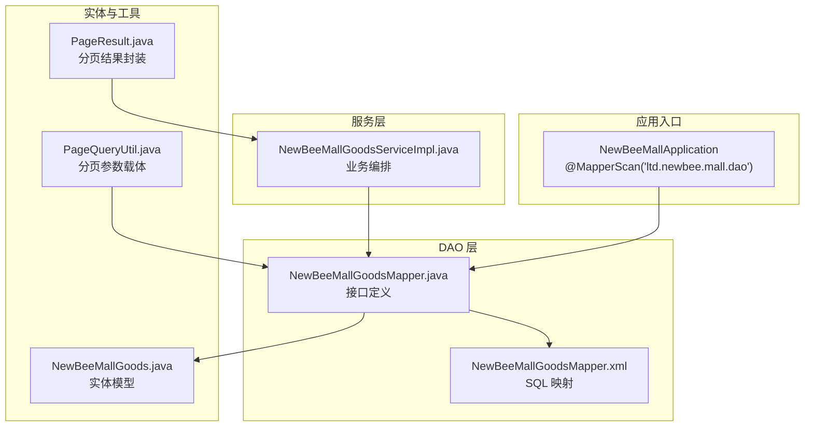
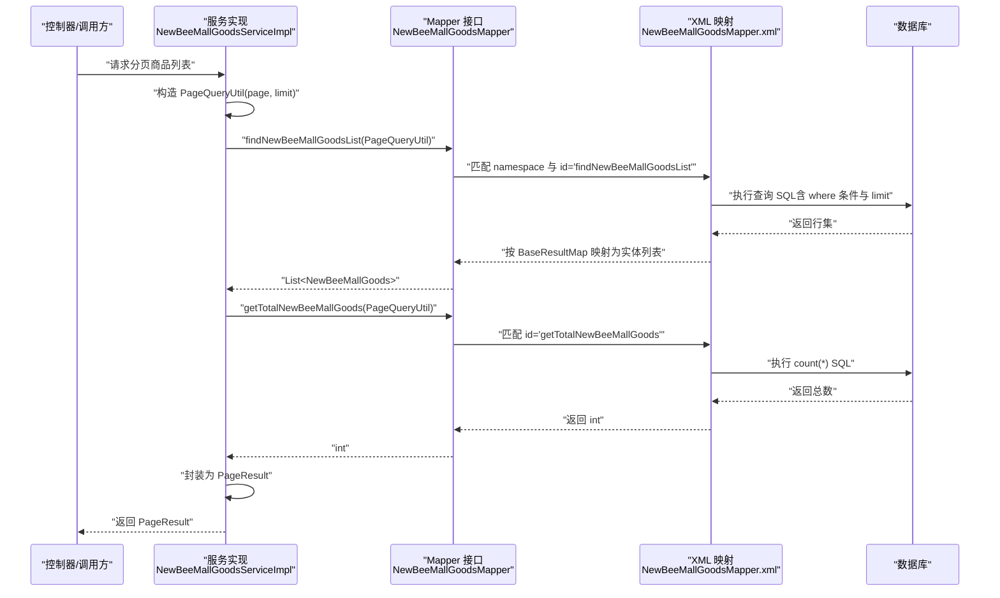
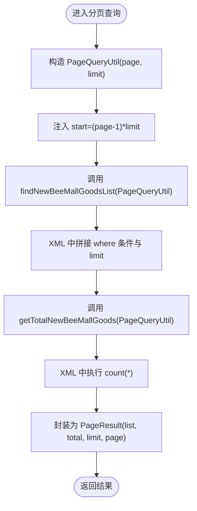
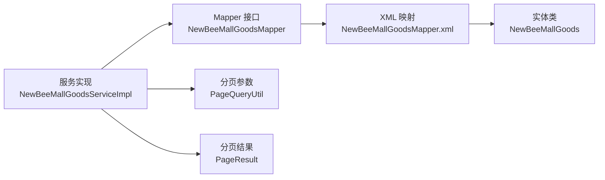

# 数据访问层（DAO）

<cite>
**本文引用的文件**
- [NewBeeMallApplication.java](file://src/main/java/ltd/newbee/mall/NewBeeMallApplication.java)
- [NewBeeMallGoodsMapper.java](file://src/main/java/ltd/newbee/mall/dao/NewBeeMallGoodsMapper.java)
- [NewBeeMallGoodsMapper.xml](file://src/main/resources/mapper/NewBeeMallGoodsMapper.xml)
- [PageQueryUtil.java](file://src/main/java/ltd/newbee/mall/util/PageQueryUtil.java)
- [PageResult.java](file://src/main/java/ltd/newbee/mall/util/PageResult.java)
- [NewBeeMallGoods.java](file://src/main/java/ltd/newbee/mall/entity/NewBeeMallGoods.java)
- [NewBeeMallGoodsServiceImpl.java](file://src/main/java/ltd/newbee/mall/service/impl/NewBeeMallGoodsServiceImpl.java)
</cite>

## 目录
1. [引言](#引言)
2. [项目结构](#项目结构)
3. [核心组件](#核心组件)
4. [架构总览](#架构总览)
5. [详细组件分析](#详细组件分析)
6. [依赖关系分析](#依赖关系分析)
7. [性能考量](#性能考量)
8. [故障排查指南](#故障排查指南)
9. [结论](#结论)

## 引言
本章节系统化讲解 newbee-mall 的数据访问层（DAO）实现，围绕 MyBatis 框架展开，重点说明：
- Mapper 接口与 XML 映射文件的协作机制；
- 以 NewBeeMallGoodsMapper 为例，解析接口方法与 XML 中 <select>/<update>/<delete>/<insert> 标签的对应关系；
- @Param 注解在多参数传递中的作用；
- PageQueryUtil 作为分页查询参数载体的设计；
- DAO 层职责：定义数据操作接口、编写高效 SQL、处理数据库连接与结果映射；
- 结合 @MapperScan 注解说明 Spring Boot 如何自动扫描并注册 Mapper 接口；
- MyBatis 的优势（SQL 灵活可控）与潜在风险（SQL 注入防范）。

## 项目结构
newbee-mall 的 DAO 层采用典型的 MyBatis 分层组织方式：
- 接口层：位于 dao 包，定义数据访问契约；
- 映射层：位于 resources/mapper，以 XML 文件描述 SQL 与结果映射；
- 实体层：位于 entity 包，承载数据库表结构；
- 工具层：util 包提供分页参数与结果封装等通用能力；
- 应用入口：通过 @MapperScan 扫描并注册所有 Mapper 接口。

图表来源
- [NewBeeMallApplication.java](file://src/main/java/ltd/newbee/mall/NewBeeMallApplication.java#L21-L21)
- [NewBeeMallGoodsMapper.java](file://src/main/java/ltd/newbee/mall/dao/NewBeeMallGoodsMapper.java#L18-L53)
- [NewBeeMallGoodsMapper.xml](file://src/main/resources/mapper/NewBeeMallGoodsMapper.xml#L1-L20)
- [NewBeeMallGoods.java](file://src/main/java/ltd/newbee/mall/entity/NewBeeMallGoods.java#L1-L50)
- [PageQueryUtil.java](file://src/main/java/ltd/newbee/mall/util/PageQueryUtil.java#L14-L29)
- [PageResult.java](file://src/main/java/ltd/newbee/mall/util/PageResult.java#L14-L41)
- [NewBeeMallGoodsServiceImpl.java](file://src/main/java/ltd/newbee/mall/service/impl/NewBeeMallGoodsServiceImpl.java#L40-L46)

章节来源
- [NewBeeMallApplication.java](file://src/main/java/ltd/newbee/mall/NewBeeMallApplication.java#L21-L21)
- [NewBeeMallGoodsMapper.java](file://src/main/java/ltd/newbee/mall/dao/NewBeeMallGoodsMapper.java#L18-L53)
- [NewBeeMallGoodsMapper.xml](file://src/main/resources/mapper/NewBeeMallGoodsMapper.xml#L1-L20)
- [PageQueryUtil.java](file://src/main/java/ltd/newbee/mall/util/PageQueryUtil.java#L14-L29)
- [PageResult.java](file://src/main/java/ltd/newbee/mall/util/PageResult.java#L14-L41)
- [NewBeeMallGoods.java](file://src/main/java/ltd/newbee/mall/entity/NewBeeMallGoods.java#L1-L50)
- [NewBeeMallGoodsServiceImpl.java](file://src/main/java/ltd/newbee/mall/service/impl/NewBeeMallGoodsServiceImpl.java#L40-L46)

## 核心组件
- Mapper 接口：定义 CRUD 与查询方法，如 findNewBeeMallGoodsList、getTotalNewBeeMallGoods、selectByPrimaryKeys、batchInsert、updateStockNum、recoverStockNum、batchUpdateSellStatus 等。
- XML 映射：通过 namespace 关联接口，使用 <select>/<update>/<delete>/<insert> 定义 SQL，并通过 <resultMap> 完成 Java 对象与数据库列的映射。
- 实体类：NewBeeMallGoods 描述商品表字段，支持基础字段与 BLOB 字段映射。
- 分页参数：PageQueryUtil 将 page、limit 转换为 SQL 的 start、limit，并提供查询条件键值。
- 分页结果：PageResult 封装列表、总数、页码与总页数。
- 应用入口：@MapperScan("ltd.newbee.mall.dao") 自动注册所有 Mapper 接口。

章节来源
- [NewBeeMallGoodsMapper.java](file://src/main/java/ltd/newbee/mall/dao/NewBeeMallGoodsMapper.java#L18-L53)
- [NewBeeMallGoodsMapper.xml](file://src/main/resources/mapper/NewBeeMallGoodsMapper.xml#L1-L20)
- [NewBeeMallGoods.java](file://src/main/java/ltd/newbee/mall/entity/NewBeeMallGoods.java#L1-L50)
- [PageQueryUtil.java](file://src/main/java/ltd/newbee/mall/util/PageQueryUtil.java#L14-L29)
- [PageResult.java](file://src/main/java/ltd/newbee/mall/util/PageResult.java#L14-L41)
- [NewBeeMallApplication.java](file://src/main/java/ltd/newbee/mall/NewBeeMallApplication.java#L21-L21)

## 架构总览
DAO 层在 newbee-mall 中承担“数据访问契约 + SQL 实现”的双重职责。Spring Boot 启动时通过 @MapperScan 扫描并注册 Mapper 接口；服务层通过 @Autowired 注入 Mapper，完成业务编排与结果封装。

图表来源
- [NewBeeMallGoodsServiceImpl.java](file://src/main/java/ltd/newbee/mall/service/impl/NewBeeMallGoodsServiceImpl.java#L40-L46)
- [NewBeeMallGoodsMapper.java](file://src/main/java/ltd/newbee/mall/dao/NewBeeMallGoodsMapper.java#L35-L38)
- [NewBeeMallGoodsMapper.xml](file://src/main/resources/mapper/NewBeeMallGoodsMapper.xml#L78-L100)
- [PageQueryUtil.java](file://src/main/java/ltd/newbee/mall/util/PageQueryUtil.java#L14-L29)
- [PageResult.java](file://src/main/java/ltd/newbee/mall/util/PageResult.java#L14-L41)

## 详细组件分析

### Mapper 接口与 XML 的对应关系
- 命名空间与关联：XML 的 namespace 必须与 Mapper 接口全限定名一致，MyBatis 通过该标识将接口方法与 SQL 绑定。
- 方法与 SQL 标签：接口方法名与 XML 中的 id 对应；例如：
  - findNewBeeMallGoodsList 对应 id="findNewBeeMallGoodsList" 的 <select>；
  - getTotalNewBeeMallGoods 对应 id="getTotalNewBeeMallGoods" 的 <select>；
  - selectByPrimaryKeys 对应 id="selectByPrimaryKeys" 的 <select>；
  - batchInsert 对应 id="batchInsert" 的 <insert>；
  - updateStockNum/recoverStockNum 对应 id="updateStockNum"/"recoverStockNum" 的 <update>；
  - batchUpdateSellStatus 对应 id="batchUpdateSellStatus" 的 <update>。
- 结果映射：
  - BaseResultMap：映射商品表的基础字段；
  - ResultMapWithBLOBs：扩展映射 goods_detail_content 等 BLOB 字段；
  - selectByPrimaryKey/selectByCategoryIdAndName 使用带 BLOB 的映射，确保详情内容可读取。

章节来源
- [NewBeeMallGoodsMapper.xml](file://src/main/resources/mapper/NewBeeMallGoodsMapper.xml#L1-L24)
- [NewBeeMallGoodsMapper.xml](file://src/main/resources/mapper/NewBeeMallGoodsMapper.xml#L43-L50)
- [NewBeeMallGoodsMapper.xml](file://src/main/resources/mapper/NewBeeMallGoodsMapper.xml#L51-L58)
- [NewBeeMallGoodsMapper.xml](file://src/main/resources/mapper/NewBeeMallGoodsMapper.xml#L78-L100)
- [NewBeeMallGoodsMapper.xml](file://src/main/resources/mapper/NewBeeMallGoodsMapper.xml#L138-L151)
- [NewBeeMallGoodsMapper.xml](file://src/main/resources/mapper/NewBeeMallGoodsMapper.xml#L153-L166)
- [NewBeeMallGoodsMapper.xml](file://src/main/resources/mapper/NewBeeMallGoodsMapper.xml#L33-L42)
- [NewBeeMallGoodsMapper.xml](file://src/main/resources/mapper/NewBeeMallGoodsMapper.xml#L59-L70)
- [NewBeeMallGoodsMapper.xml](file://src/main/resources/mapper/NewBeeMallGoodsMapper.xml#L71-L77)

### @Param 注解与多参数传递
- 多参数场景：如 batchUpdateSellStatus(Long[] orderIds, int sellStatus)，接口方法包含多个参数；
- 参数绑定：XML 中通过 collection/item/open/close 等属性处理数组/集合参数，避免直接使用 @Param 也能正确传参；
- 多参数命名：当接口方法存在多个基本类型参数时，建议使用 @Param 为每个参数命名，便于 XML 中通过名称引用，提升可读性与维护性；
- 示例参考：selectByCategoryIdAndName 使用 @Param("goodsName")/@Param("goodsCategoryId")，在 XML 中以 #{goodsName}/#{goodsCategoryId} 访问。

章节来源
- [NewBeeMallGoodsMapper.java](file://src/main/java/ltd/newbee/mall/dao/NewBeeMallGoodsMapper.java#L27-L27)
- [NewBeeMallGoodsMapper.java](file://src/main/java/ltd/newbee/mall/dao/NewBeeMallGoodsMapper.java#L51-L51)
- [NewBeeMallGoodsMapper.xml](file://src/main/resources/mapper/NewBeeMallGoodsMapper.xml#L71-L77)

### PageQueryUtil 作为分页参数载体
- 设计要点：
  - 从请求参数中提取 page、limit；
  - 计算并注入 start（起始偏移量），供 SQL 的 limit 子句使用；
  - 保持 page、limit 原样，便于上层封装 PageResult；
- SQL 集成：
  - 查询列表：在 XML 中通过 <if test="start!=null and limit!=null"> 添加 limit #{start},#{limit}；
  - 统计总数：在 XML 中对 where 条件进行 count(*) 统计；
- 服务层使用：
  - 先调用列表查询，再调用总数统计，最后封装为 PageResult 返回。

图表来源
- [PageQueryUtil.java](file://src/main/java/ltd/newbee/mall/util/PageQueryUtil.java#L14-L29)
- [NewBeeMallGoodsMapper.xml](file://src/main/resources/mapper/NewBeeMallGoodsMapper.xml#L78-L100)
- [NewBeeMallGoodsMapper.xml](file://src/main/resources/mapper/NewBeeMallGoodsMapper.xml#L167-L183)
- [NewBeeMallGoodsServiceImpl.java](file://src/main/java/ltd/newbee/mall/service/impl/NewBeeMallGoodsServiceImpl.java#L40-L46)
- [PageResult.java](file://src/main/java/ltd/newbee/mall/util/PageResult.java#L14-L41)

章节来源
- [PageQueryUtil.java](file://src/main/java/ltd/newbee/mall/util/PageQueryUtil.java#L14-L29)
- [NewBeeMallGoodsMapper.xml](file://src/main/resources/mapper/NewBeeMallGoodsMapper.xml#L78-L100)
- [NewBeeMallGoodsMapper.xml](file://src/main/resources/mapper/NewBeeMallGoodsMapper.xml#L167-L183)
- [NewBeeMallGoodsServiceImpl.java](file://src/main/java/ltd/newbee/mall/service/impl/NewBeeMallGoodsServiceImpl.java#L40-L46)
- [PageResult.java](file://src/main/java/ltd/newbee/mall/util/PageResult.java#L14-L41)

### DAO 层职责与实现要点
- 定义数据操作接口：在 Mapper 接口中声明 CRUD 与查询方法，明确输入输出；
- 编写高效 SQL：利用 XML 中的动态 SQL（<where>/<if>/<choose>/<foreach>）组合条件，减少冗余 SQL；
- 处理数据库连接与结果映射：由 MyBatis 自动管理连接与事务；通过 <resultMap> 完成 Java 类型与数据库列的映射；
- 返回值设计：
  - 列表查询：返回 List<实体>；
  - 单条查询：返回实体对象；
  - 统计查询：返回 int；
  - 更新/批量更新：返回影响行数；
- 与服务层协作：服务层负责业务编排与结果封装（如 PageResult），DAO 层专注数据访问。

章节来源
- [NewBeeMallGoodsMapper.java](file://src/main/java/ltd/newbee/mall/dao/NewBeeMallGoodsMapper.java#L18-L53)
- [NewBeeMallGoodsMapper.xml](file://src/main/resources/mapper/NewBeeMallGoodsMapper.xml#L78-L100)
- [NewBeeMallGoodsMapper.xml](file://src/main/resources/mapper/NewBeeMallGoodsMapper.xml#L138-L151)
- [NewBeeMallGoodsServiceImpl.java](file://src/main/java/ltd/newbee/mall/service/impl/NewBeeMallGoodsServiceImpl.java#L40-L46)
- [PageResult.java](file://src/main/java/ltd/newbee/mall/util/PageResult.java#L14-L41)

### Spring Boot 与 @MapperScan 的集成
- 应用入口：在启动类上使用 @MapperScan("ltd.newbee.mall.dao")，指示 MyBatis 扫描指定包下的 Mapper 接口；
- 自动注册：启动时 MyBatis 会为每个 Mapper 接口生成代理对象，使服务层可直接通过 @Autowired 注入；
- 无 XML 配置：通过注解即可完成扫描与注册，简化配置。

章节来源
- [NewBeeMallApplication.java](file://src/main/java/ltd/newbee/mall/NewBeeMallApplication.java#L21-L21)

### 以 NewBeeMallGoodsMapper 为例的接口与 XML 对应关系图

```mermaid
classDiagram
class NewBeeMallGoodsMapper {
+deleteByPrimaryKey(goodsId)
+insert(record)
+insertSelective(record)
+selectByPrimaryKey(goodsId)
+selectByCategoryIdAndName(goodsName, goodsCategoryId)
+updateByPrimaryKeySelective(record)
+updateByPrimaryKeyWithBLOBs(record)
+updateByPrimaryKey(record)
+findNewBeeMallGoodsList(pageUtil)
+getTotalNewBeeMallGoods(pageUtil)
+selectByPrimaryKeys(goodsIds)
+findNewBeeMallGoodsListBySearch(pageUtil)
+getTotalNewBeeMallGoodsBySearch(pageUtil)
+batchInsert(newBeeMallGoodsList)
+updateStockNum(stockNumDTOS)
+recoverStockNum(stockNumDTOS)
+batchUpdateSellStatus(orderIds, sellStatus)
}
class NewBeeMallGoodsMapper_xml {
<<XML>>
+namespace="ltd.newbee.mall.dao.NewBeeMallGoodsMapper"
+<select id="findNewBeeMallGoodsList">
+<select id="getTotalNewBeeMallGoods">
+<select id="selectByPrimaryKeys">
+<select id="findNewBeeMallGoodsListBySearch">
+<select id="getTotalNewBeeMallGoodsBySearch">
+<select id="selectByPrimaryKey">
+<select id="selectByCategoryIdAndName">
+<insert id="batchInsert">
+<update id="updateStockNum">
+<update id="recoverStockNum">
+<update id="batchUpdateSellStatus">
}
NewBeeMallGoodsMapper <.. NewBeeMallGoodsMapper_xml : "通过 namespace/id 对应"
```

图表来源
- [NewBeeMallGoodsMapper.java](file://src/main/java/ltd/newbee/mall/dao/NewBeeMallGoodsMapper.java#L18-L53)
- [NewBeeMallGoodsMapper.xml](file://src/main/resources/mapper/NewBeeMallGoodsMapper.xml#L1-L20)
- [NewBeeMallGoodsMapper.xml](file://src/main/resources/mapper/NewBeeMallGoodsMapper.xml#L78-L100)
- [NewBeeMallGoodsMapper.xml](file://src/main/resources/mapper/NewBeeMallGoodsMapper.xml#L138-L151)
- [NewBeeMallGoodsMapper.xml](file://src/main/resources/mapper/NewBeeMallGoodsMapper.xml#L153-L166)
- [NewBeeMallGoodsMapper.xml](file://src/main/resources/mapper/NewBeeMallGoodsMapper.xml#L33-L42)
- [NewBeeMallGoodsMapper.xml](file://src/main/resources/mapper/NewBeeMallGoodsMapper.xml#L59-L70)
- [NewBeeMallGoodsMapper.xml](file://src/main/resources/mapper/NewBeeMallGoodsMapper.xml#L71-L77)

## 依赖关系分析
- 组件耦合：
  - 服务层依赖 Mapper 接口，Mapper 接口依赖 XML 映射；
  - 实体类被 XML 的 resultMap 引用；
  - PageQueryUtil 作为跨层参数载体，贯穿服务层与 XML；
  - PageResult 仅在服务层使用，DAO 层不直接依赖。
- 外部依赖：
  - MyBatis 提供 ORM 与 SQL 映射能力；
  - Spring Boot 通过 @MapperScan 自动注册 Mapper；
  - Spring 容器管理 Bean 生命周期与依赖注入。

图表来源
- [NewBeeMallGoodsServiceImpl.java](file://src/main/java/ltd/newbee/mall/service/impl/NewBeeMallGoodsServiceImpl.java#L40-L46)
- [NewBeeMallGoodsMapper.java](file://src/main/java/ltd/newbee/mall/dao/NewBeeMallGoodsMapper.java#L18-L53)
- [NewBeeMallGoodsMapper.xml](file://src/main/resources/mapper/NewBeeMallGoodsMapper.xml#L1-L20)
- [NewBeeMallGoods.java](file://src/main/java/ltd/newbee/mall/entity/NewBeeMallGoods.java#L1-L50)
- [PageQueryUtil.java](file://src/main/java/ltd/newbee/mall/util/PageQueryUtil.java#L14-L29)
- [PageResult.java](file://src/main/java/ltd/newbee/mall/util/PageResult.java#L14-L41)

章节来源
- [NewBeeMallGoodsServiceImpl.java](file://src/main/java/ltd/newbee/mall/service/impl/NewBeeMallGoodsServiceImpl.java#L40-L46)
- [NewBeeMallGoodsMapper.java](file://src/main/java/ltd/newbee/mall/dao/NewBeeMallGoodsMapper.java#L18-L53)
- [NewBeeMallGoodsMapper.xml](file://src/main/resources/mapper/NewBeeMallGoodsMapper.xml#L1-L20)
- [NewBeeMallGoods.java](file://src/main/java/ltd/newbee/mall/entity/NewBeeMallGoods.java#L1-L50)
- [PageQueryUtil.java](file://src/main/java/ltd/newbee/mall/util/PageQueryUtil.java#L14-L29)
- [PageResult.java](file://src/main/java/ltd/newbee/mall/util/PageResult.java#L14-L41)

## 性能考量
- 动态 SQL 的选择性：通过 <where>/<if> 组合条件，避免不必要的全表扫描；合理使用索引列参与 where 条件；
- 分页优化：start 与 limit 的计算要与数据库索引配合，优先使用覆盖索引；避免在大数据量下使用高 offset 的分页；
- 批量操作：XML 中使用 <foreach> 进行批量插入/更新，减少网络往返与事务开销；
- 结果映射：尽量使用基础字段映射（BaseResultMap）而非 BLOB 字段映射，除非确实需要详情内容；
- SQL 注入防护：MyBatis 使用预编译参数绑定，避免字符串拼接；仍需注意动态 SQL 的安全边界，确保输入校验与参数过滤。

## 故障排查指南
- SQL 未生效或参数未绑定：
  - 检查 XML namespace 是否与接口全限定名一致；
  - 检查 id 与接口方法名是否匹配；
  - 多参数场景确认是否使用 @Param 或集合/数组参数的 collection/item 写法；
- 分页结果异常：
  - 确认 PageQueryUtil 正确注入 start、limit；
  - 确认 XML 中的 <if test="start!=null and limit!=null"> 条件；
  - 确认 getTotalXXX 与列表查询使用相同的 where 条件；
- 结果映射错误：
  - 检查 BaseResultMap 与 ResultMapWithBLOBs 的字段映射；
  - 确保 BLOB 字段仅在需要时使用带 BLOB 的映射；
- 连接与事务问题：
  - 确认 @MapperScan 已启用；
  - 确认服务层通过 @Autowired 注入 Mapper；
  - 检查数据库连接配置与权限。

章节来源
- [NewBeeMallGoodsMapper.xml](file://src/main/resources/mapper/NewBeeMallGoodsMapper.xml#L1-L24)
- [NewBeeMallGoodsMapper.xml](file://src/main/resources/mapper/NewBeeMallGoodsMapper.xml#L78-L100)
- [NewBeeMallGoodsMapper.xml](file://src/main/resources/mapper/NewBeeMallGoodsMapper.xml#L138-L151)
- [NewBeeMallGoodsMapper.xml](file://src/main/resources/mapper/NewBeeMallGoodsMapper.xml#L153-L166)
- [NewBeeMallGoodsMapper.xml](file://src/main/resources/mapper/NewBeeMallGoodsMapper.xml#L33-L42)
- [NewBeeMallGoodsMapper.xml](file://src/main/resources/mapper/NewBeeMallGoodsMapper.xml#L59-L70)
- [NewBeeMallGoodsMapper.xml](file://src/main/resources/mapper/NewBeeMallGoodsMapper.xml#L71-L77)
- [NewBeeMallApplication.java](file://src/main/java/ltd/newbee/mall/NewBeeMallApplication.java#L21-L21)
- [PageQueryUtil.java](file://src/main/java/ltd/newbee/mall/util/PageQueryUtil.java#L14-L29)

## 结论
newbee-mall 的 DAO 层以 MyBatis 为核心，通过 Mapper 接口与 XML 映射文件紧密协作，实现了清晰的职责分离与高效的 SQL 执行。PageQueryUtil 将分页参数标准化，DAO 层专注于数据访问契约与 SQL 实现；@MapperScan 简化了 Mapper 的注册流程。在享受 MyBatis SQL 灵活性的同时，应重视动态 SQL 的安全性与索引优化，确保系统在高并发场景下的稳定性与性能。