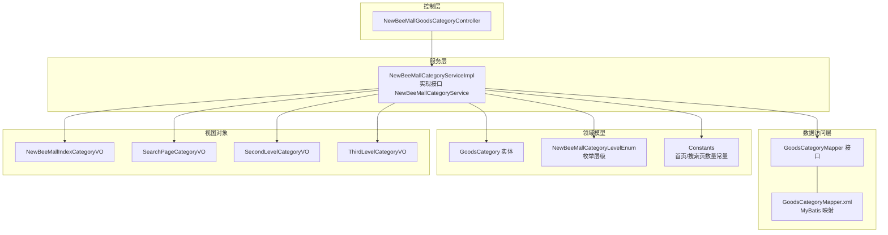
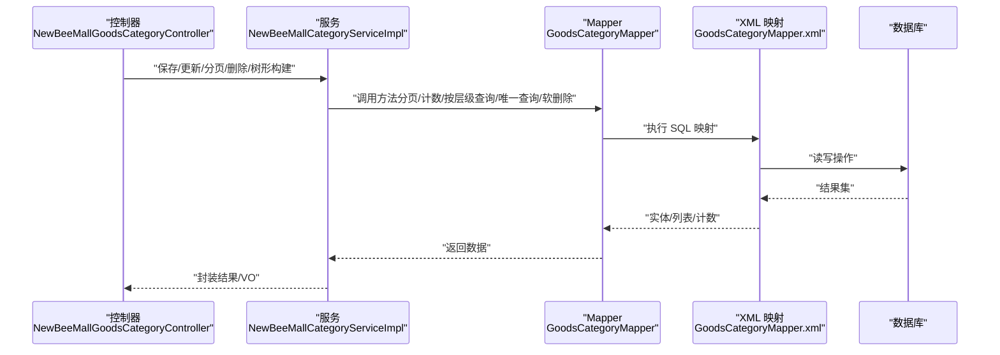
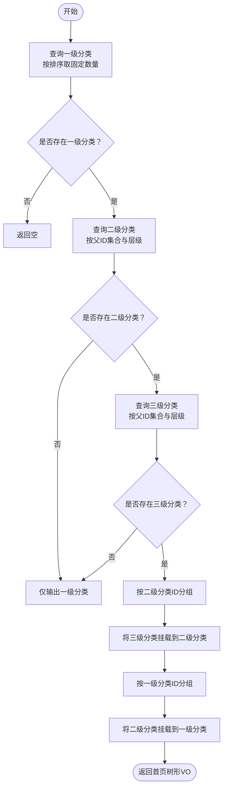
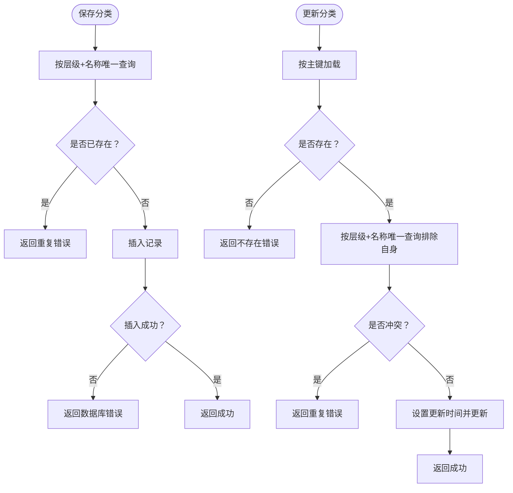
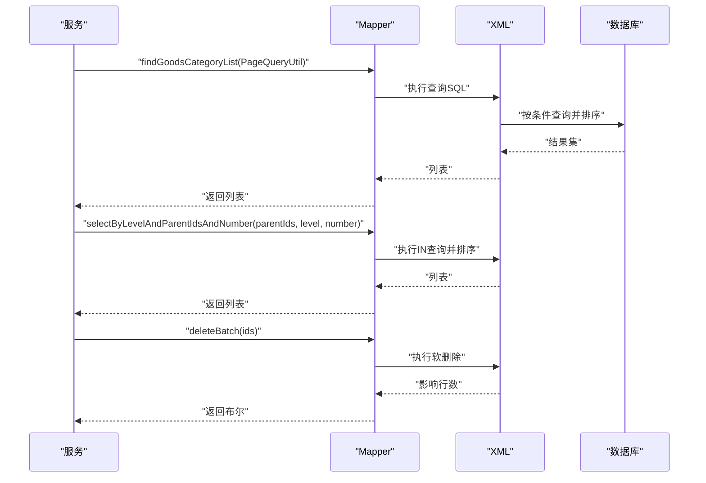
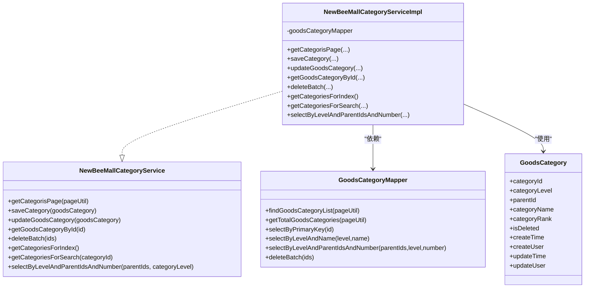

# 商品分类服务（NewBeeMallCategoryService）

<cite>
**本文引用的文件**
- [NewBeeMallCategoryService.java](file://src/main/java/ltd/newbee/mall/service/NewBeeMallCategoryService.java)
- [NewBeeMallCategoryServiceImpl.java](file://src/main/java/ltd/newbee/mall/service/impl/NewBeeMallCategoryServiceImpl.java)
- [GoodsCategoryMapper.java](file://src/main/java/ltd/newbee/mall/dao/GoodsCategoryMapper.java)
- [GoodsCategoryMapper.xml](file://src/main/resources/mapper/GoodsCategoryMapper.xml)
- [GoodsCategory.java](file://src/main/java/ltd/newbee/mall/entity/GoodsCategory.java)
- [NewBeeMallCategoryLevelEnum.java](file://src/main/java/ltd/newbee/mall/common/NewBeeMallCategoryLevelEnum.java)
- [Constants.java](file://src/main/java/ltd/newbee/mall/common/Constants.java)
- [NewBeeMallIndexCategoryVO.java](file://src/main/java/ltd/newbee/mall/controller/vo/NewBeeMallIndexCategoryVO.java)
- [SearchPageCategoryVO.java](file://src/main/java/ltd/newbee/mall/controller/vo/SearchPageCategoryVO.java)
- [SecondLevelCategoryVO.java](file://src/main/java/ltd/newbee/mall/controller/vo/SecondLevelCategoryVO.java)
- [ThirdLevelCategoryVO.java](file://src/main/java/ltd/newbee/mall/controller/vo/ThirdLevelCategoryVO.java)
- [NewBeeMallGoodsCategoryController.java](file://src/main/java/ltd/newbee/mall/controller/admin/NewBeeMallGoodsCategoryController.java)
</cite>

## 目录
1. [简介](#简介)
2. [项目结构](#项目结构)
3. [核心组件](#核心组件)
4. [架构总览](#架构总览)
5. [详细组件分析](#详细组件分析)
6. [依赖关系分析](#依赖关系分析)
7. [性能考量](#性能考量)
8. [故障排查指南](#故障排查指南)
9. [结论](#结论)

## 简介
本文件围绕 NewBeeMallCategoryService 在商品分类管理中的职责进行系统化说明，重点覆盖：
- 分类树形结构维护与层级管理（一级、二级、三级）
- 排序字段的使用与展示控制
- 递归查询构建前端所需树状菜单的流程
- 新增/修改时的名称唯一性与层级合法性校验
- 调用 GoodsCategoryMapper 完成数据操作的完整链路
- 删除策略（软删除与非叶子节点限制）
- 该服务在商品导航与搜索中的基础支撑作用

## 项目结构
围绕分类服务的关键文件组织如下：
- 接口与实现：service.NewBeeMallCategoryService 与其实现 NewBeeMallCategoryServiceImpl
- 数据访问：dao.GoodsCategoryMapper 与 MyBatis 映射文件 GoodsCategoryMapper.xml
- 实体模型：entity.GoodsCategory
- 枚举与常量：common.NewBeeMallCategoryLevelEnum、common.Constants
- 视图对象：controller.vo.NewBeeMallIndexCategoryVO、SearchPageCategoryVO、SecondLevelCategoryVO、ThirdLevelCategoryVO
- 控制器：controller.admin.NewBeeMallGoodsCategoryController

图表来源
- [NewBeeMallCategoryServiceImpl.java](file://src/main/java/ltd/newbee/mall/service/impl/NewBeeMallCategoryServiceImpl.java#L1-L168)
- [GoodsCategoryMapper.java](file://src/main/java/ltd/newbee/mall/dao/GoodsCategoryMapper.java#L1-L39)
- [GoodsCategoryMapper.xml](file://src/main/resources/mapper/GoodsCategoryMapper.xml#L1-L212)
- [GoodsCategory.java](file://src/main/java/ltd/newbee/mall/entity/GoodsCategory.java#L1-L137)
- [NewBeeMallCategoryLevelEnum.java](file://src/main/java/ltd/newbee/mall/common/NewBeeMallCategoryLevelEnum.java#L1-L59)
- [Constants.java](file://src/main/java/ltd/newbee/mall/common/Constants.java#L1-L48)
- [NewBeeMallIndexCategoryVO.java](file://src/main/java/ltd/newbee/mall/controller/vo/NewBeeMallIndexCategoryVO.java#L1-L59)
- [SearchPageCategoryVO.java](file://src/main/java/ltd/newbee/mall/controller/vo/SearchPageCategoryVO.java#L1-L71)
- [SecondLevelCategoryVO.java](file://src/main/java/ltd/newbee/mall/controller/vo/SecondLevelCategoryVO.java#L1-L69)
- [ThirdLevelCategoryVO.java](file://src/main/java/ltd/newbee/mall/controller/vo/ThirdLevelCategoryVO.java#L1-L48)
- [NewBeeMallGoodsCategoryController.java](file://src/main/java/ltd/newbee/mall/controller/admin/NewBeeMallGoodsCategoryController.java#L1-L173)

章节来源
- [NewBeeMallCategoryService.java](file://src/main/java/ltd/newbee/mall/service/NewBeeMallCategoryService.java#L1-L60)
- [NewBeeMallCategoryServiceImpl.java](file://src/main/java/ltd/newbee/mall/service/impl/NewBeeMallCategoryServiceImpl.java#L1-L168)
- [GoodsCategoryMapper.java](file://src/main/java/ltd/newbee/mall/dao/GoodsCategoryMapper.java#L1-L39)
- [GoodsCategoryMapper.xml](file://src/main/resources/mapper/GoodsCategoryMapper.xml#L1-L212)
- [GoodsCategory.java](file://src/main/java/ltd/newbee/mall/entity/GoodsCategory.java#L1-L137)
- [NewBeeMallCategoryLevelEnum.java](file://src/main/java/ltd/newbee/mall/common/NewBeeMallCategoryLevelEnum.java#L1-L59)
- [Constants.java](file://src/main/java/ltd/newbee/mall/common/Constants.java#L1-L48)
- [NewBeeMallIndexCategoryVO.java](file://src/main/java/ltd/newbee/mall/controller/vo/NewBeeMallIndexCategoryVO.java#L1-L59)
- [SearchPageCategoryVO.java](file://src/main/java/ltd/newbee/mall/controller/vo/SearchPageCategoryVO.java#L1-L71)
- [SecondLevelCategoryVO.java](file://src/main/java/ltd/newbee/mall/controller/vo/SecondLevelCategoryVO.java#L1-L69)
- [ThirdLevelCategoryVO.java](file://src/main/java/ltd/newbee/mall/controller/vo/ThirdLevelCategoryVO.java#L1-L48)
- [NewBeeMallGoodsCategoryController.java](file://src/main/java/ltd/newbee/mall/controller/admin/NewBeeMallGoodsCategoryController.java#L1-L173)

## 核心组件
- 接口定义：提供后台分页、保存、更新、批量删除、按层级查询、首页与搜索页分类数据等能力
- 实现类：封装业务逻辑，协调 Mapper 完成数据操作；负责树形构建、层级合法性与唯一性校验
- Mapper 接口与映射：提供分页、计数、按层级与父ID集合查询、按名称与层级唯一查询、软删除等
- 实体与枚举：GoodsCategory 描述分类字段；NewBeeMallCategoryLevelEnum 定义层级常量
- 视图对象：首页与搜索页 VO，承载树形菜单与上下文分类信息
- 控制器：Admin 端分类管理入口，参数校验与结果封装

章节来源
- [NewBeeMallCategoryService.java](file://src/main/java/ltd/newbee/mall/service/NewBeeMallCategoryService.java#L1-L60)
- [NewBeeMallCategoryServiceImpl.java](file://src/main/java/ltd/newbee/mall/service/impl/NewBeeMallCategoryServiceImpl.java#L1-L168)
- [GoodsCategoryMapper.java](file://src/main/java/ltd/newbee/mall/dao/GoodsCategoryMapper.java#L1-L39)
- [GoodsCategoryMapper.xml](file://src/main/resources/mapper/GoodsCategoryMapper.xml#L1-L212)
- [GoodsCategory.java](file://src/main/java/ltd/newbee/mall/entity/GoodsCategory.java#L1-L137)
- [NewBeeMallCategoryLevelEnum.java](file://src/main/java/ltd/newbee/mall/common/NewBeeMallCategoryLevelEnum.java#L1-L59)
- [NewBeeMallIndexCategoryVO.java](file://src/main/java/ltd/newbee/mall/controller/vo/NewBeeMallIndexCategoryVO.java#L1-L59)
- [SearchPageCategoryVO.java](file://src/main/java/ltd/newbee/mall/controller/vo/SearchPageCategoryVO.java#L1-L71)
- [SecondLevelCategoryVO.java](file://src/main/java/ltd/newbee/mall/controller/vo/SecondLevelCategoryVO.java#L1-L69)
- [ThirdLevelCategoryVO.java](file://src/main/java/ltd/newbee/mall/controller/vo/ThirdLevelCategoryVO.java#L1-L48)
- [NewBeeMallGoodsCategoryController.java](file://src/main/java/ltd/newbee/mall/controller/admin/NewBeeMallGoodsCategoryController.java#L1-L173)

## 架构总览
服务层通过 GoodsCategoryMapper 访问数据库，结合枚举与常量实现层级与排序控制，最终输出面向前端的树形结构 VO。

图表来源
- [NewBeeMallGoodsCategoryController.java](file://src/main/java/ltd/newbee/mall/controller/admin/NewBeeMallGoodsCategoryController.java#L1-L173)
- [NewBeeMallCategoryServiceImpl.java](file://src/main/java/ltd/newbee/mall/service/impl/NewBeeMallCategoryServiceImpl.java#L1-L168)
- [GoodsCategoryMapper.java](file://src/main/java/ltd/newbee/mall/dao/GoodsCategoryMapper.java#L1-L39)
- [GoodsCategoryMapper.xml](file://src/main/resources/mapper/GoodsCategoryMapper.xml#L1-L212)

## 详细组件分析

### 1) 树形结构维护与层级管理
- 层级枚举：通过 NewBeeMallCategoryLevelEnum 提供 LEVEL_ONE/LEVEL_TWO/LEVEL_THREE 的层级标识，确保业务层与数据层一致
- 层级字段：GoodsCategory 的 categoryLevel 字段用于区分一级/二级/三级
- 父子关系：GoodsCategory 的 parentId 字段建立父子层级关系
- 排序字段：categoryRank 作为排序依据，SQL 中按降序排列，保证展示顺序稳定
- 常量控制：首页与搜索页的分类数量由 Constants 控制，避免一次性加载过多数据

章节来源
- [NewBeeMallCategoryLevelEnum.java](file://src/main/java/ltd/newbee/mall/common/NewBeeMallCategoryLevelEnum.java#L1-L59)
- [GoodsCategory.java](file://src/main/java/ltd/newbee/mall/entity/GoodsCategory.java#L1-L137)
- [Constants.java](file://src/main/java/ltd/newbee/mall/common/Constants.java#L1-L48)
- [GoodsCategoryMapper.xml](file://src/main/resources/mapper/GoodsCategoryMapper.xml#L20-L77)

### 2) 递归查询与树形菜单构建
服务层通过多步查询与分组聚合，构建首页与搜索页所需的树形菜单：
- 首页树形菜单（首页调用）：
  - 先查一级分类（限定数量），再查对应二级分类，再查对应三级分类
  - 使用 Map 按 parentId 分组，将三级分类挂载到对应的二级分类下
  - 再将二级分类挂载到对应的一级分类下，形成三层树形结构
- 搜索页树形菜单（搜索页调用）：
  - 从当前三级分类向上回溯到二级分类，再拉取二级分类下的全部三级分类
  - 输出当前三级分类名、二级分类名与三级分类列表

图表来源
- [NewBeeMallCategoryServiceImpl.java](file://src/main/java/ltd/newbee/mall/service/impl/NewBeeMallCategoryServiceImpl.java#L91-L142)
- [GoodsCategoryMapper.xml](file://src/main/resources/mapper/GoodsCategoryMapper.xml#L63-L77)
- [Constants.java](file://src/main/java/ltd/newbee/mall/common/Constants.java#L24-L26)

章节来源
- [NewBeeMallCategoryServiceImpl.java](file://src/main/java/ltd/newbee/mall/service/impl/NewBeeMallCategoryServiceImpl.java#L91-L161)
- [GoodsCategoryMapper.xml](file://src/main/resources/mapper/GoodsCategoryMapper.xml#L63-L77)
- [NewBeeMallIndexCategoryVO.java](file://src/main/java/ltd/newbee/mall/controller/vo/NewBeeMallIndexCategoryVO.java#L1-L59)
- [SecondLevelCategoryVO.java](file://src/main/java/ltd/newbee/mall/controller/vo/SecondLevelCategoryVO.java#L1-L69)
- [ThirdLevelCategoryVO.java](file://src/main/java/ltd/newbee/mall/controller/vo/ThirdLevelCategoryVO.java#L1-L48)

### 3) 新增与修改的校验逻辑
- 新增校验：
  - 名称唯一性：按层级与名称唯一查询，若存在则返回重复错误
  - 参数完整性：控制器侧对关键参数进行校验（层级、父ID、名称、排序）
- 修改校验：
  - 存在性：先按主键查询，不存在则返回不存在错误
  - 名称唯一性：若同名且不同主键则拒绝修改
  - 更新时间：统一设置更新时间

图表来源
- [NewBeeMallCategoryServiceImpl.java](file://src/main/java/ltd/newbee/mall/service/impl/NewBeeMallCategoryServiceImpl.java#L47-L75)
- [GoodsCategoryMapper.xml](file://src/main/resources/mapper/GoodsCategoryMapper.xml#L56-L62)
- [NewBeeMallGoodsCategoryController.java](file://src/main/java/ltd/newbee/mall/controller/admin/NewBeeMallGoodsCategoryController.java#L101-L141)

章节来源
- [NewBeeMallCategoryServiceImpl.java](file://src/main/java/ltd/newbee/mall/service/impl/NewBeeMallCategoryServiceImpl.java#L47-L75)
- [GoodsCategoryMapper.xml](file://src/main/resources/mapper/GoodsCategoryMapper.xml#L56-L62)
- [NewBeeMallGoodsCategoryController.java](file://src/main/java/ltd/newbee/mall/controller/admin/NewBeeMallGoodsCategoryController.java#L101-L141)

### 4) 数据操作流程（服务层调用 Mapper）
- 分页与计数：findGoodsCategoryList 与 getTotalGoodsCategories 支持按层级与父ID过滤，排序按 categoryRank 降序
- 查询与唯一性：selectByPrimaryKey、selectByLevelAndName
- 批量查询：selectByLevelAndParentIdsAndNumber 支持传入父ID集合与层级，可限制数量
- 删除策略：deleteBatch 采用软删除（更新 is_deleted=1），不直接物理删除

图表来源
- [NewBeeMallCategoryServiceImpl.java](file://src/main/java/ltd/newbee/mall/service/impl/NewBeeMallCategoryServiceImpl.java#L39-L45)
- [GoodsCategoryMapper.java](file://src/main/java/ltd/newbee/mall/dao/GoodsCategoryMapper.java#L1-L39)
- [GoodsCategoryMapper.xml](file://src/main/resources/mapper/GoodsCategoryMapper.xml#L20-L77)

章节来源
- [NewBeeMallCategoryServiceImpl.java](file://src/main/java/ltd/newbee/mall/service/impl/NewBeeMallCategoryServiceImpl.java#L39-L45)
- [GoodsCategoryMapper.java](file://src/main/java/ltd/newbee/mall/dao/GoodsCategoryMapper.java#L1-L39)
- [GoodsCategoryMapper.xml](file://src/main/resources/mapper/GoodsCategoryMapper.xml#L20-L77)

### 5) 删除策略与非叶子节点限制
- 当前实现：deleteBatch 采用软删除（is_deleted=1），不支持物理删除
- 非叶子节点限制：服务层未显式校验“是否叶子节点”，控制器也未做前置检查
- 建议：在删除前应校验是否存在子节点，若存在则拒绝删除，避免破坏树形结构完整性

章节来源
- [GoodsCategoryMapper.xml](file://src/main/resources/mapper/GoodsCategoryMapper.xml#L82-L88)
- [NewBeeMallGoodsCategoryController.java](file://src/main/java/ltd/newbee/mall/controller/admin/NewBeeMallGoodsCategoryController.java#L156-L170)
- [NewBeeMallCategoryServiceImpl.java](file://src/main/java/ltd/newbee/mall/service/impl/NewBeeMallCategoryServiceImpl.java#L82-L89)

### 6) 在商品导航与搜索中的基础支撑
- 导航支撑：首页树形菜单为用户浏览提供清晰的三级导航路径，提升查找效率
- 搜索支撑：搜索页树形菜单帮助用户快速定位当前三级分类所属的二级分类与同级三级分类，优化搜索体验
- 性能影响：通过 Constants 控制数量，避免一次性加载过多数据；排序字段减少前端排序成本

章节来源
- [NewBeeMallCategoryServiceImpl.java](file://src/main/java/ltd/newbee/mall/service/impl/NewBeeMallCategoryServiceImpl.java#L91-L161)
- [Constants.java](file://src/main/java/ltd/newbee/mall/common/Constants.java#L24-L26)
- [GoodsCategoryMapper.xml](file://src/main/resources/mapper/GoodsCategoryMapper.xml#L30-L36)

## 依赖关系分析
- 服务层依赖 Mapper 接口与枚举、常量、VO 类
- Mapper 依赖 XML 映射文件
- 控制器依赖服务层与结果封装工具
- 实体模型贯穿各层，是数据一致性保障

图表来源
- [NewBeeMallCategoryService.java](file://src/main/java/ltd/newbee/mall/service/NewBeeMallCategoryService.java#L1-L60)
- [NewBeeMallCategoryServiceImpl.java](file://src/main/java/ltd/newbee/mall/service/impl/NewBeeMallCategoryServiceImpl.java#L1-L168)
- [GoodsCategoryMapper.java](file://src/main/java/ltd/newbee/mall/dao/GoodsCategoryMapper.java#L1-L39)
- [GoodsCategory.java](file://src/main/java/ltd/newbee/mall/entity/GoodsCategory.java#L1-L137)

章节来源
- [NewBeeMallCategoryService.java](file://src/main/java/ltd/newbee/mall/service/NewBeeMallCategoryService.java#L1-L60)
- [NewBeeMallCategoryServiceImpl.java](file://src/main/java/ltd/newbee/mall/service/impl/NewBeeMallCategoryServiceImpl.java#L1-L168)
- [GoodsCategoryMapper.java](file://src/main/java/ltd/newbee/mall/dao/GoodsCategoryMapper.java#L1-L39)
- [GoodsCategory.java](file://src/main/java/ltd/newbee/mall/entity/GoodsCategory.java#L1-L137)

## 性能考量
- 排序与索引：SQL 已按 categoryRank 降序排序，建议在数据库层面为 category_level、parent_id、is_deleted 建立复合索引以提升分页与过滤性能
- 数量控制：通过 Constants 控制首页与搜索页的分类数量，避免一次性加载过多数据
- 查询粒度：selectByLevelAndParentIdsAndNumber 支持 number>0 时限制返回数量，减少不必要的数据传输
- 软删除：采用 is_deleted 字段软删除，便于审计与恢复，但需定期清理历史数据

章节来源
- [GoodsCategoryMapper.xml](file://src/main/resources/mapper/GoodsCategoryMapper.xml#L30-L36)
- [Constants.java](file://src/main/java/ltd/newbee/mall/common/Constants.java#L24-L26)

## 故障排查指南
- 新增失败：检查名称唯一性校验与参数完整性；查看返回的错误码
- 更新失败：确认主键存在性与名称唯一性冲突；检查更新时间是否正确设置
- 树形菜单为空：确认是否存在对应层级的分类数据；检查 is_deleted 是否被误置
- 删除失败：确认是否为叶子节点；当前实现为软删除，需检查 is_deleted 字段

章节来源
- [NewBeeMallCategoryServiceImpl.java](file://src/main/java/ltd/newbee/mall/service/impl/NewBeeMallCategoryServiceImpl.java#L47-L75)
- [GoodsCategoryMapper.xml](file://src/main/resources/mapper/GoodsCategoryMapper.xml#L56-L62)
- [NewBeeMallGoodsCategoryController.java](file://src/main/java/ltd/newbee/mall/controller/admin/NewBeeMallGoodsCategoryController.java#L156-L170)

## 结论
NewBeeMallCategoryService 通过清晰的层级枚举、排序字段与分组聚合，实现了稳定的树形结构维护与前端导航支撑。服务层在新增/修改时执行必要的唯一性与存在性校验，并通过 GoodsCategoryMapper 完成数据操作。当前删除策略采用软删除，建议在删除前增加非叶子节点校验以保证树形结构完整性。整体设计简洁、职责明确，为商品导航与搜索提供了可靠的基础。