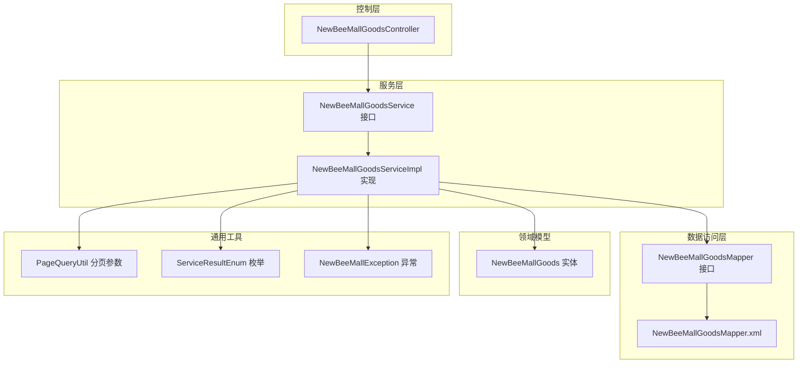
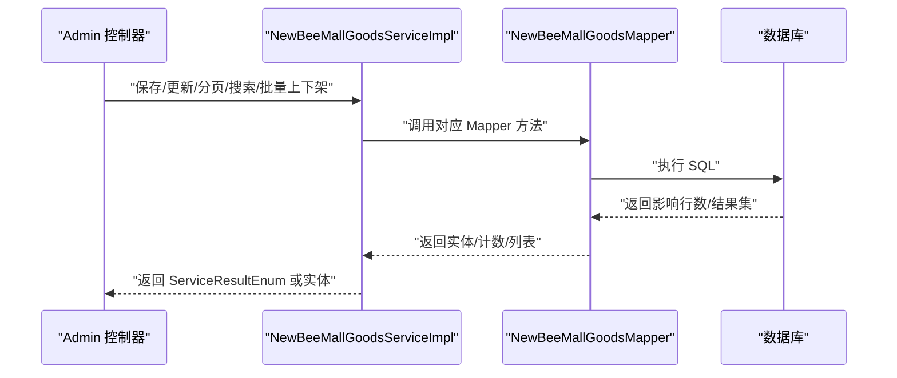
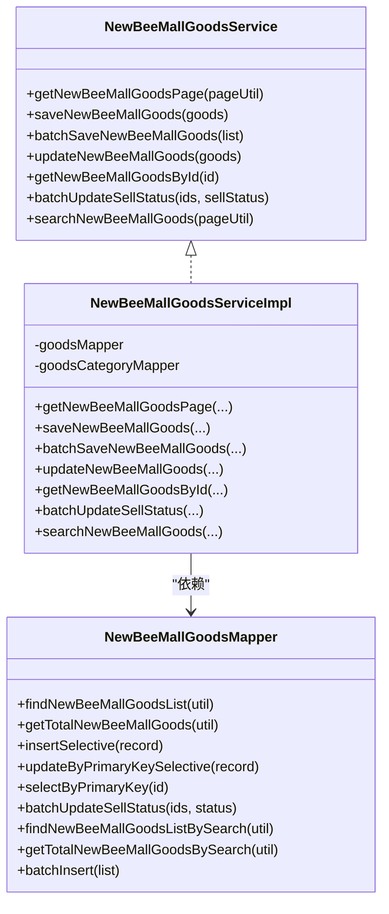
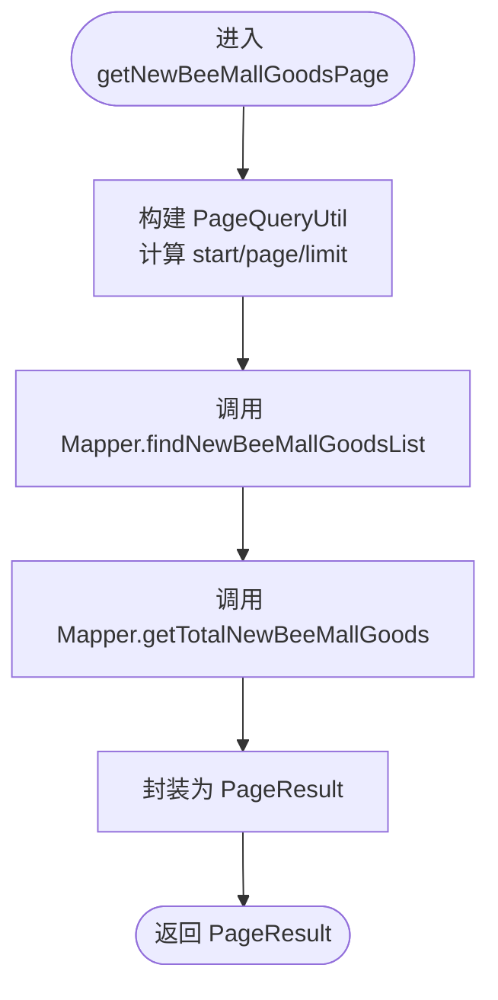
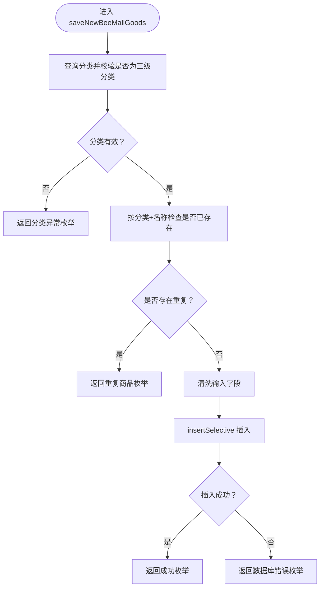
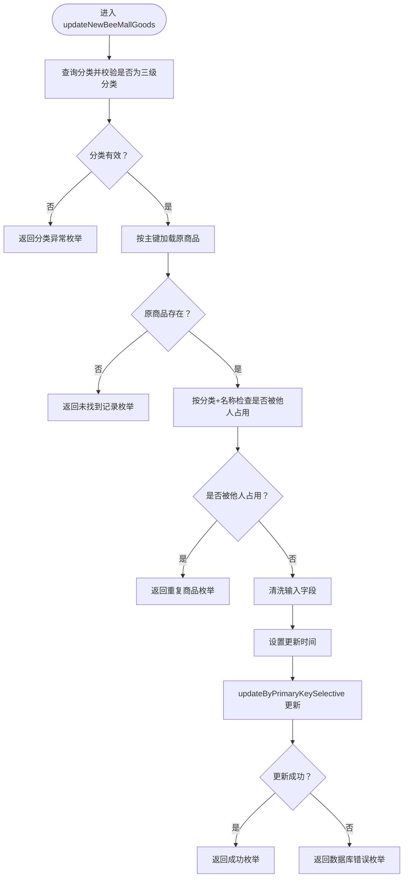
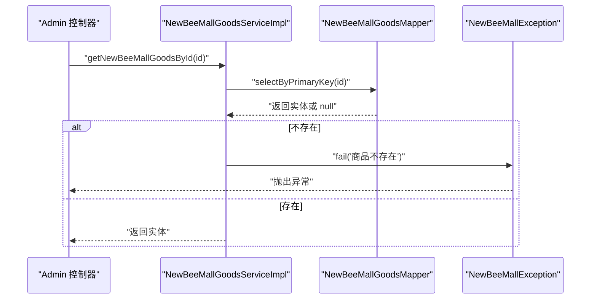
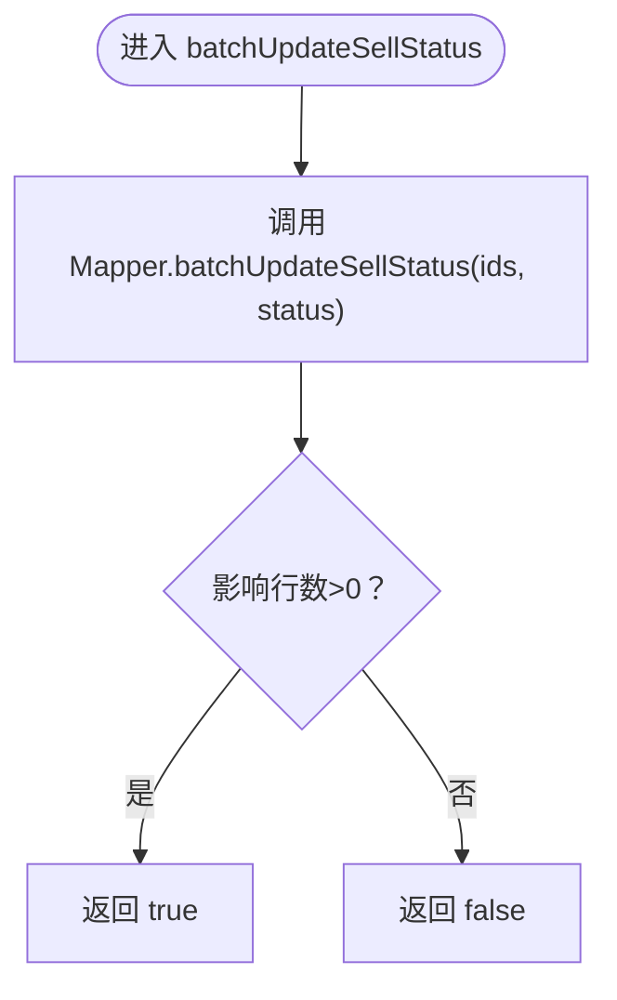
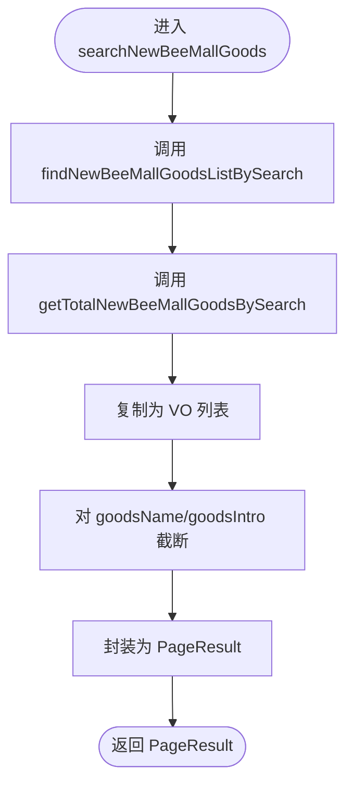
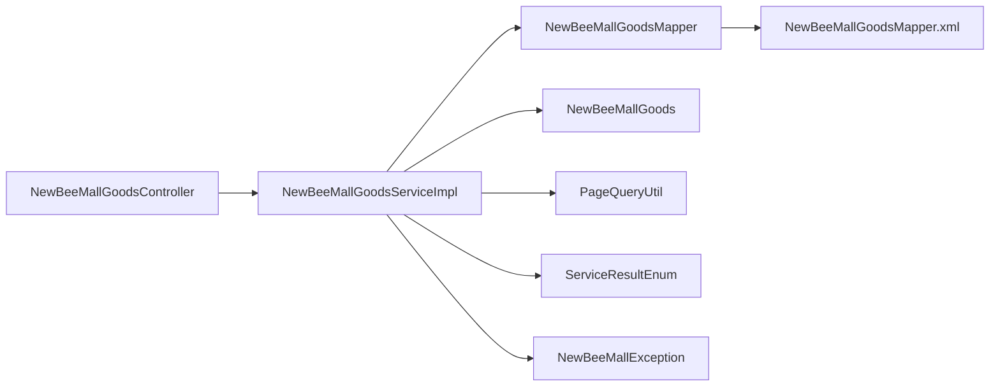

# 商品服务（NewBeeMallGoodsService）

<cite>
**本文引用的文件**
- [NewBeeMallGoodsService.java](file://src/main/java/ltd/newbee/mall/service/NewBeeMallGoodsService.java)
- [NewBeeMallGoodsServiceImpl.java](file://src/main/java/ltd/newbee/mall/service/impl/NewBeeMallGoodsServiceImpl.java)
- [NewBeeMallGoodsMapper.java](file://src/main/java/ltd/newbee/mall/dao/NewBeeMallGoodsMapper.java)
- [NewBeeMallGoodsMapper.xml](file://src/main/resources/mapper/NewBeeMallGoodsMapper.xml)
- [NewBeeMallGoods.java](file://src/main/java/ltd/newbee/mall/entity/NewBeeMallGoods.java)
- [PageQueryUtil.java](file://src/main/java/ltd/newbee/mall/util/PageQueryUtil.java)
- [ServiceResultEnum.java](file://src/main/java/ltd/newbee/mall/common/ServiceResultEnum.java)
- [NewBeeMallException.java](file://src/main/java/ltd/newbee/mall/common/NewBeeMallException.java)
- [NewBeeMallGoodsController.java](file://src/main/java/ltd/newbee/mall/controller/admin/NewBeeMallGoodsController.java)
- [NewBeeMallOrderServiceImpl.java](file://src/main/java/ltd/newbee/mall/service/impl/NewBeeMallOrderServiceImpl.java)
- [DEVELOPMENT.md](file://docs/DEVELOPMENT.md)
</cite>

## 目录
1. [简介](#简介)
2. [项目结构](#项目结构)
3. [核心组件](#核心组件)
4. [架构总览](#架构总览)
5. [详细组件分析](#详细组件分析)
6. [依赖关系分析](#依赖关系分析)
7. [性能考量](#性能考量)
8. [故障排查指南](#故障排查指南)
9. [结论](#结论)

## 简介
本文件围绕 NewBeeMallGoodsService 接口及其实现 NewBeeMallGoodsServiceImpl 展开，系统性解析其在商品管理中的核心职责：后台商品分页查询、新增、批量新增、修改、按 ID 查询、批量上下架状态变更、前台商品搜索等关键业务方法。重点阐述服务层如何通过 NewBeeMallGoodsMapper 与数据库交互，执行数据持久化；如何在新增/修改时进行业务规则校验（如三级分类校验、商品名称唯一性检查）；以及如何通过异常机制（NewBeeMallException）统一抛出业务异常，配合 Controller 返回标准化结果。

同时，结合仓库开发规范文档，明确服务层应承担“事务控制”职责，尽管当前实现未直接展示 @Transactional 注解，但可据此理解服务层在复杂业务场景下的事务边界设计思路。

## 项目结构
- 接口与实现：service.NewBeeMallGoodsService 与 service.impl.NewBeeMallGoodsServiceImpl
- 数据访问：dao.NewBeeMallGoodsMapper 与 resources/mapper/NewBeeMallGoodsMapper.xml
- 实体模型：entity.NewBeeMallGoods
- 工具与常量：util.PageQueryUtil、common.ServiceResultEnum、common.NewBeeMallException
- 控制器：controller.admin.NewBeeMallGoodsController
- 开发规范：docs/DEVELOPMENT.md 中对分层与事务控制的说明

图表来源
- [NewBeeMallGoodsController.java](file://src/main/java/ltd/newbee/mall/controller/admin/NewBeeMallGoodsController.java#L1-L228)
- [NewBeeMallGoodsService.java](file://src/main/java/ltd/newbee/mall/service/NewBeeMallGoodsService.java#L1-L74)
- [NewBeeMallGoodsServiceImpl.java](file://src/main/java/ltd/newbee/mall/service/impl/NewBeeMallGoodsServiceImpl.java#L1-L139)
- [NewBeeMallGoodsMapper.java](file://src/main/java/ltd/newbee/mall/dao/NewBeeMallGoodsMapper.java#L1-L53)
- [NewBeeMallGoodsMapper.xml](file://src/main/resources/mapper/NewBeeMallGoodsMapper.xml#L1-L391)
- [NewBeeMallGoods.java](file://src/main/java/ltd/newbee/mall/entity/NewBeeMallGoods.java#L1-L202)
- [PageQueryUtil.java](file://src/main/java/ltd/newbee/mall/util/PageQueryUtil.java#L1-L56)
- [ServiceResultEnum.java](file://src/main/java/ltd/newbee/mall/common/ServiceResultEnum.java#L1-L91)
- [NewBeeMallException.java](file://src/main/java/ltd/newbee/mall/common/NewBeeMallException.java#L1-L30)

章节来源
- [NewBeeMallGoodsService.java](file://src/main/java/ltd/newbee/mall/service/NewBeeMallGoodsService.java#L1-L74)
- [NewBeeMallGoodsServiceImpl.java](file://src/main/java/ltd/newbee/mall/service/impl/NewBeeMallGoodsServiceImpl.java#L1-L139)
- [NewBeeMallGoodsMapper.java](file://src/main/java/ltd/newbee/mall/dao/NewBeeMallGoodsMapper.java#L1-L53)
- [NewBeeMallGoodsMapper.xml](file://src/main/resources/mapper/NewBeeMallGoodsMapper.xml#L1-L391)
- [NewBeeMallGoods.java](file://src/main/java/ltd/newbee/mall/entity/NewBeeMallGoods.java#L1-L202)
- [PageQueryUtil.java](file://src/main/java/ltd/newbee/mall/util/PageQueryUtil.java#L1-L56)
- [ServiceResultEnum.java](file://src/main/java/ltd/newbee/mall/common/ServiceResultEnum.java#L1-L91)
- [NewBeeMallException.java](file://src/main/java/ltd/newbee/mall/common/NewBeeMallException.java#L1-L30)
- [NewBeeMallGoodsController.java](file://src/main/java/ltd/newbee/mall/controller/admin/NewBeeMallGoodsController.java#L1-L228)
- [DEVELOPMENT.md](file://docs/DEVELOPMENT.md#L290-L370)

## 核心组件
- 接口定义：提供后台分页、新增、批量新增、修改、按 ID 查询、批量上下架、搜索等方法契约
- 实现类：封装业务规则校验、调用 Mapper 执行持久化、返回统一结果枚举
- Mapper 接口与 XML：定义 CRUD 与统计查询方法，并映射 SQL
- 实体类：承载商品字段与时间戳等属性
- 工具与常量：分页参数封装、业务结果枚举、业务异常类型
- 控制器：接收请求、参数校验、调用服务、返回 Result

章节来源
- [NewBeeMallGoodsService.java](file://src/main/java/ltd/newbee/mall/service/NewBeeMallGoodsService.java#L1-L74)
- [NewBeeMallGoodsServiceImpl.java](file://src/main/java/ltd/newbee/mall/service/impl/NewBeeMallGoodsServiceImpl.java#L1-L139)
- [NewBeeMallGoodsMapper.java](file://src/main/java/ltd/newbee/mall/dao/NewBeeMallGoodsMapper.java#L1-L53)
- [NewBeeMallGoodsMapper.xml](file://src/main/resources/mapper/NewBeeMallGoodsMapper.xml#L1-L391)
- [NewBeeMallGoods.java](file://src/main/java/ltd/newbee/mall/entity/NewBeeMallGoods.java#L1-L202)
- [PageQueryUtil.java](file://src/main/java/ltd/newbee/mall/util/PageQueryUtil.java#L1-L56)
- [ServiceResultEnum.java](file://src/main/java/ltd/newbee/mall/common/ServiceResultEnum.java#L1-L91)
- [NewBeeMallException.java](file://src/main/java/ltd/newbee/mall/common/NewBeeMallException.java#L1-L30)
- [NewBeeMallGoodsController.java](file://src/main/java/ltd/newbee/mall/controller/admin/NewBeeMallGoodsController.java#L1-L228)

## 架构总览
服务层位于 Controller 与 Mapper 之间，承担业务编排与校验职责。控制器负责参数接收与校验，服务层负责业务规则与数据持久化，Mapper 负责与数据库交互。

图表来源
- [NewBeeMallGoodsController.java](file://src/main/java/ltd/newbee/mall/controller/admin/NewBeeMallGoodsController.java#L132-L228)
- [NewBeeMallGoodsServiceImpl.java](file://src/main/java/ltd/newbee/mall/service/impl/NewBeeMallGoodsServiceImpl.java#L41-L139)
- [NewBeeMallGoodsMapper.java](file://src/main/java/ltd/newbee/mall/dao/NewBeeMallGoodsMapper.java#L1-L53)
- [NewBeeMallGoodsMapper.xml](file://src/main/resources/mapper/NewBeeMallGoodsMapper.xml#L1-L391)

## 详细组件分析

### 接口与实现类关系

图表来源
- [NewBeeMallGoodsService.java](file://src/main/java/ltd/newbee/mall/service/NewBeeMallGoodsService.java#L1-L74)
- [NewBeeMallGoodsServiceImpl.java](file://src/main/java/ltd/newbee/mall/service/impl/NewBeeMallGoodsServiceImpl.java#L1-L139)
- [NewBeeMallGoodsMapper.java](file://src/main/java/ltd/newbee/mall/dao/NewBeeMallGoodsMapper.java#L1-L53)

章节来源
- [NewBeeMallGoodsService.java](file://src/main/java/ltd/newbee/mall/service/NewBeeMallGoodsService.java#L1-L74)
- [NewBeeMallGoodsServiceImpl.java](file://src/main/java/ltd/newbee/mall/service/impl/NewBeeMallGoodsServiceImpl.java#L1-L139)
- [NewBeeMallGoodsMapper.java](file://src/main/java/ltd/newbee/mall/dao/NewBeeMallGoodsMapper.java#L1-L53)

### 商品分页查询（后台）
- 方法：getNewBeeMallGoodsPage
- 流程要点：
  - 通过 PageQueryUtil 计算分页起始位置与限制
  - 调用 Mapper 的 findNewBeeMallGoodsList 与 getTotalNewBeeMallGoods 获取列表与总数
  - 封装为 PageResult 返回
- 关键 SQL：基于 goods_name、goods_sell_status、创建时间区间等条件过滤，按主键降序分页

图表来源
- [NewBeeMallGoodsServiceImpl.java](file://src/main/java/ltd/newbee/mall/service/impl/NewBeeMallGoodsServiceImpl.java#L41-L46)
- [NewBeeMallGoodsMapper.xml](file://src/main/resources/mapper/NewBeeMallGoodsMapper.xml#L78-L100)
- [NewBeeMallGoodsMapper.xml](file://src/main/resources/mapper/NewBeeMallGoodsMapper.xml#L167-L183)
- [PageQueryUtil.java](file://src/main/java/ltd/newbee/mall/util/PageQueryUtil.java#L1-L56)

章节来源
- [NewBeeMallGoodsServiceImpl.java](file://src/main/java/ltd/newbee/mall/service/impl/NewBeeMallGoodsServiceImpl.java#L41-L46)
- [NewBeeMallGoodsMapper.xml](file://src/main/resources/mapper/NewBeeMallGoodsMapper.xml#L78-L100)
- [NewBeeMallGoodsMapper.xml](file://src/main/resources/mapper/NewBeeMallGoodsMapper.xml#L167-L183)
- [PageQueryUtil.java](file://src/main/java/ltd/newbee/mall/util/PageQueryUtil.java#L1-L56)

### 新增商品
- 方法：saveNewBeeMallGoods
- 业务规则校验：
  - 三级分类校验：仅允许三级分类的商品
  - 唯一性校验：同分类下商品名称不可重复
  - 输入清洗：对名称、简介、标签进行字符串清理
- 数据持久化：insertSelective 成功后返回成功结果，否则返回数据库错误
- 异常处理：分类异常、重复商品、数据库错误分别返回对应枚举值

图表来源
- [NewBeeMallGoodsServiceImpl.java](file://src/main/java/ltd/newbee/mall/service/impl/NewBeeMallGoodsServiceImpl.java#L49-L65)
- [NewBeeMallGoodsMapper.java](file://src/main/java/ltd/newbee/mall/dao/NewBeeMallGoodsMapper.java#L27-L28)
- [NewBeeMallGoodsMapper.xml](file://src/main/resources/mapper/NewBeeMallGoodsMapper.xml#L202-L304)
- [ServiceResultEnum.java](file://src/main/java/ltd/newbee/mall/common/ServiceResultEnum.java#L1-L91)

章节来源
- [NewBeeMallGoodsServiceImpl.java](file://src/main/java/ltd/newbee/mall/service/impl/NewBeeMallGoodsServiceImpl.java#L49-L65)
- [NewBeeMallGoodsMapper.java](file://src/main/java/ltd/newbee/mall/dao/NewBeeMallGoodsMapper.java#L27-L28)
- [NewBeeMallGoodsMapper.xml](file://src/main/resources/mapper/NewBeeMallGoodsMapper.xml#L202-L304)
- [ServiceResultEnum.java](file://src/main/java/ltd/newbee/mall/common/ServiceResultEnum.java#L1-L91)

### 修改商品
- 方法：updateNewBeeMallGoods
- 业务规则校验：
  - 三级分类校验
  - 存在性校验：原商品必须存在
  - 唯一性校验：同分类下其他商品不可与新名称重复
  - 更新时间设置：自动更新更新时间
- 数据持久化：updateByPrimaryKeySelective 成功后返回成功结果，否则返回数据库错误

图表来源
- [NewBeeMallGoodsServiceImpl.java](file://src/main/java/ltd/newbee/mall/service/impl/NewBeeMallGoodsServiceImpl.java#L74-L98)
- [NewBeeMallGoodsMapper.java](file://src/main/java/ltd/newbee/mall/dao/NewBeeMallGoodsMapper.java#L25-L28)
- [NewBeeMallGoodsMapper.xml](file://src/main/resources/mapper/NewBeeMallGoodsMapper.xml#L305-L355)
- [ServiceResultEnum.java](file://src/main/java/ltd/newbee/mall/common/ServiceResultEnum.java#L1-L91)

章节来源
- [NewBeeMallGoodsServiceImpl.java](file://src/main/java/ltd/newbee/mall/service/impl/NewBeeMallGoodsServiceImpl.java#L74-L98)
- [NewBeeMallGoodsMapper.java](file://src/main/java/ltd/newbee/mall/dao/NewBeeMallGoodsMapper.java#L25-L28)
- [NewBeeMallGoodsMapper.xml](file://src/main/resources/mapper/NewBeeMallGoodsMapper.xml#L305-L355)
- [ServiceResultEnum.java](file://src/main/java/ltd/newbee/mall/common/ServiceResultEnum.java#L1-L91)

### 按 ID 查询商品
- 方法：getNewBeeMallGoodsById
- 行为：查询商品，不存在时通过 NewBeeMallException.fail 抛出业务异常，由全局异常处理器统一处理

图表来源
- [NewBeeMallGoodsServiceImpl.java](file://src/main/java/ltd/newbee/mall/service/impl/NewBeeMallGoodsServiceImpl.java#L100-L107)
- [NewBeeMallGoodsMapper.java](file://src/main/java/ltd/newbee/mall/dao/NewBeeMallGoodsMapper.java#L25-L25)
- [NewBeeMallException.java](file://src/main/java/ltd/newbee/mall/common/NewBeeMallException.java#L1-L30)

章节来源
- [NewBeeMallGoodsServiceImpl.java](file://src/main/java/ltd/newbee/mall/service/impl/NewBeeMallGoodsServiceImpl.java#L100-L107)
- [NewBeeMallGoodsMapper.java](file://src/main/java/ltd/newbee/mall/dao/NewBeeMallGoodsMapper.java#L25-L25)
- [NewBeeMallException.java](file://src/main/java/ltd/newbee/mall/common/NewBeeMallException.java#L1-L30)

### 批量上下架状态变更
- 方法：batchUpdateSellStatus
- 行为：调用 Mapper 的 batchUpdateSellStatus 执行批量更新，返回布尔结果

图表来源
- [NewBeeMallGoodsServiceImpl.java](file://src/main/java/ltd/newbee/mall/service/impl/NewBeeMallGoodsServiceImpl.java#L109-L112)
- [NewBeeMallGoodsMapper.java](file://src/main/java/ltd/newbee/mall/dao/NewBeeMallGoodsMapper.java#L51-L51)
- [NewBeeMallGoodsMapper.xml](file://src/main/resources/mapper/NewBeeMallGoodsMapper.xml#L71-L77)

章节来源
- [NewBeeMallGoodsServiceImpl.java](file://src/main/java/ltd/newbee/mall/service/impl/NewBeeMallGoodsServiceImpl.java#L109-L112)
- [NewBeeMallGoodsMapper.java](file://src/main/java/ltd/newbee/mall/dao/NewBeeMallGoodsMapper.java#L51-L51)
- [NewBeeMallGoodsMapper.xml](file://src/main/resources/mapper/NewBeeMallGoodsMapper.xml#L71-L77)

### 商品搜索（前台）
- 方法：searchNewBeeMallGoods
- 行为：
  - 调用 findNewBeeMallGoodsListBySearch 与 getTotalNewBeeMallGoodsBySearch 获取搜索结果与总数
  - 将实体列表转换为 VO 列表，并对标题与简介进行截断处理
  - 封装为 PageResult 返回

图表来源
- [NewBeeMallGoodsServiceImpl.java](file://src/main/java/ltd/newbee/mall/service/impl/NewBeeMallGoodsServiceImpl.java#L114-L137)
- [NewBeeMallGoodsMapper.xml](file://src/main/resources/mapper/NewBeeMallGoodsMapper.xml#L102-L136)
- [NewBeeMallGoodsMapper.xml](file://src/main/resources/mapper/NewBeeMallGoodsMapper.xml#L138-L151)

章节来源
- [NewBeeMallGoodsServiceImpl.java](file://src/main/java/ltd/newbee/mall/service/impl/NewBeeMallGoodsServiceImpl.java#L114-L137)
- [NewBeeMallGoodsMapper.xml](file://src/main/resources/mapper/NewBeeMallGoodsMapper.xml#L102-L136)
- [NewBeeMallGoodsMapper.xml](file://src/main/resources/mapper/NewBeeMallGoodsMapper.xml#L138-L151)

### 控制器对接与结果返回
- 控制器负责参数校验与调用服务层方法
- 服务层返回 ServiceResultEnum 或实体，控制器统一包装为 Result 并返回

章节来源
- [NewBeeMallGoodsController.java](file://src/main/java/ltd/newbee/mall/controller/admin/NewBeeMallGoodsController.java#L132-L228)
- [ServiceResultEnum.java](file://src/main/java/ltd/newbee/mall/common/ServiceResultEnum.java#L1-L91)

## 依赖关系分析
- 服务层依赖 Mapper 接口与 XML 映射，实现 CRUD 与统计查询
- 服务层依赖实体类承载数据
- 服务层依赖分页工具 PageQueryUtil 提供分页参数
- 服务层依赖 ServiceResultEnum 统一返回结果
- 服务层依赖 NewBeeMallException 在特定场景抛出业务异常
- 控制器依赖服务层暴露的方法契约

图表来源
- [NewBeeMallGoodsController.java](file://src/main/java/ltd/newbee/mall/controller/admin/NewBeeMallGoodsController.java#L1-L228)
- [NewBeeMallGoodsServiceImpl.java](file://src/main/java/ltd/newbee/mall/service/impl/NewBeeMallGoodsServiceImpl.java#L1-L139)
- [NewBeeMallGoodsMapper.java](file://src/main/java/ltd/newbee/mall/dao/NewBeeMallGoodsMapper.java#L1-L53)
- [NewBeeMallGoodsMapper.xml](file://src/main/resources/mapper/NewBeeMallGoodsMapper.xml#L1-L391)
- [NewBeeMallGoods.java](file://src/main/java/ltd/newbee/mall/entity/NewBeeMallGoods.java#L1-L202)
- [PageQueryUtil.java](file://src/main/java/ltd/newbee/mall/util/PageQueryUtil.java#L1-L56)
- [ServiceResultEnum.java](file://src/main/java/ltd/newbee/mall/common/ServiceResultEnum.java#L1-L91)
- [NewBeeMallException.java](file://src/main/java/ltd/newbee/mall/common/NewBeeMallException.java#L1-L30)

章节来源
- [NewBeeMallGoodsController.java](file://src/main/java/ltd/newbee/mall/controller/admin/NewBeeMallGoodsController.java#L1-L228)
- [NewBeeMallGoodsServiceImpl.java](file://src/main/java/ltd/newbee/mall/service/impl/NewBeeMallGoodsServiceImpl.java#L1-L139)
- [NewBeeMallGoodsMapper.java](file://src/main/java/ltd/newbee/mall/dao/NewBeeMallGoodsMapper.java#L1-L53)
- [NewBeeMallGoodsMapper.xml](file://src/main/resources/mapper/NewBeeMallGoodsMapper.xml#L1-L391)
- [NewBeeMallGoods.java](file://src/main/java/ltd/newbee/mall/entity/NewBeeMallGoods.java#L1-L202)
- [PageQueryUtil.java](file://src/main/java/ltd/newbee/mall/util/PageQueryUtil.java#L1-L56)
- [ServiceResultEnum.java](file://src/main/java/ltd/newbee/mall/common/ServiceResultEnum.java#L1-L91)
- [NewBeeMallException.java](file://src/main/java/ltd/newbee/mall/common/NewBeeMallException.java#L1-L30)

## 性能考量
- 分页查询：通过 PageQueryUtil 计算 start，避免一次性加载全量数据，降低内存压力
- 条件过滤：SQL 中使用 where 条件与排序，建议在 goods_name、goods_sell_status、create_time 等字段建立索引以提升查询效率
- 批量插入：batchInsert 支持批量写入，减少网络往返次数
- 字段选择：XML 中定义了 Base_Column_List 与 Blob_Column_List，按需选择列可减少传输与解析成本
- 结果截断：搜索结果对标题与简介进行截断，避免前端渲染过多文本

章节来源
- [NewBeeMallGoodsMapper.xml](file://src/main/resources/mapper/NewBeeMallGoodsMapper.xml#L24-L31)
- [NewBeeMallGoodsMapper.xml](file://src/main/resources/mapper/NewBeeMallGoodsMapper.xml#L33-L42)
- [NewBeeMallGoodsServiceImpl.java](file://src/main/java/ltd/newbee/mall/service/impl/NewBeeMallGoodsServiceImpl.java#L114-L137)
- [PageQueryUtil.java](file://src/main/java/ltd/newbee/mall/util/PageQueryUtil.java#L1-L56)

## 故障排查指南
- 分类异常：当商品分类不存在或非三级分类时，服务层返回“分类数据异常”，请检查分类层级与商品分类字段
- 重复商品：同分类下商品名称重复会返回“已存在相同的商品信息”，请调整商品名称或分类
- 数据不存在：按 ID 查询时若商品不存在，服务层抛出业务异常，由全局异常处理器统一处理
- 数据库错误：插入或更新失败返回“database error”，请检查数据库连接、字段约束与触发器
- 上下架状态异常：批量修改状态时若状态非法，控制器返回参数异常，请确认状态值

章节来源
- [ServiceResultEnum.java](file://src/main/java/ltd/newbee/mall/common/ServiceResultEnum.java#L1-L91)
- [NewBeeMallGoodsServiceImpl.java](file://src/main/java/ltd/newbee/mall/service/impl/NewBeeMallGoodsServiceImpl.java#L49-L65)
- [NewBeeMallGoodsServiceImpl.java](file://src/main/java/ltd/newbee/mall/service/impl/NewBeeMallGoodsServiceImpl.java#L74-L98)
- [NewBeeMallGoodsServiceImpl.java](file://src/main/java/ltd/newbee/mall/service/impl/NewBeeMallGoodsServiceImpl.java#L100-L107)
- [NewBeeMallException.java](file://src/main/java/ltd/newbee/mall/common/NewBeeMallException.java#L1-L30)
- [NewBeeMallGoodsController.java](file://src/main/java/ltd/newbee/mall/controller/admin/NewBeeMallGoodsController.java#L132-L228)

## 结论
NewBeeMallGoodsService 与 NewBeeMallGoodsServiceImpl 在商品管理中承担了关键的业务职责：通过清晰的接口契约与严格的业务规则校验（三级分类、名称唯一性），结合 MyBatis 的高效数据访问，实现了商品的新增、修改、分页查询、批量上下架与搜索等核心能力。服务层通过统一的结果枚举与异常机制，为控制器提供了稳定、可维护的调用接口。结合开发规范文档，服务层应承担事务控制职责，在复杂业务场景下可引入 @Transactional 注解以确保数据一致性。