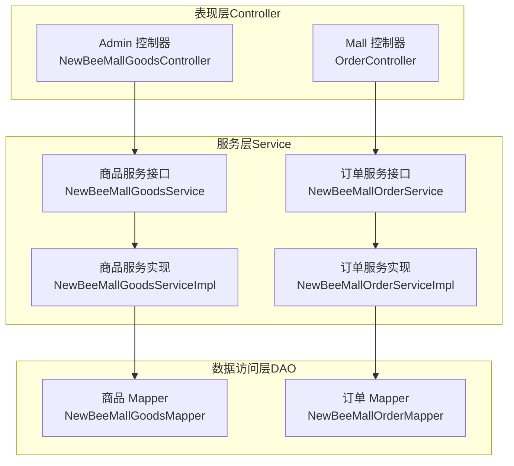
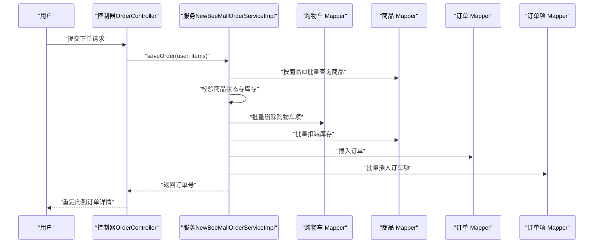
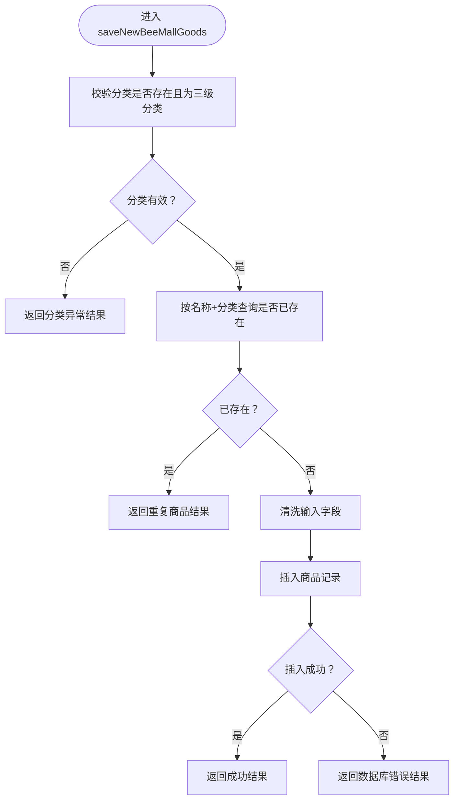
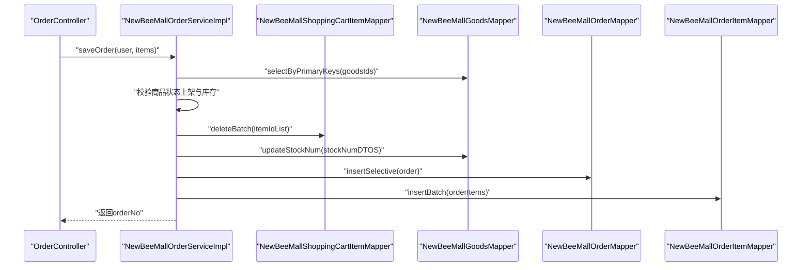
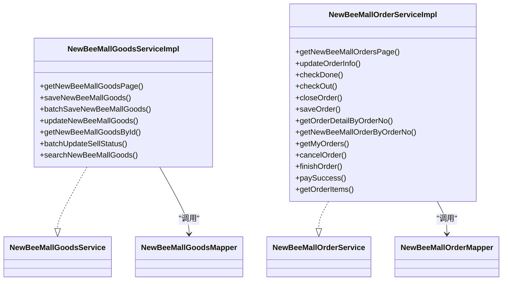
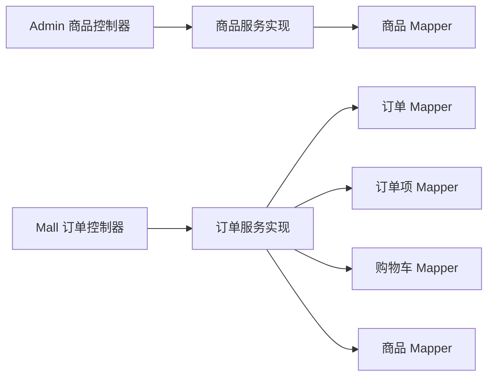

# 服务层（Service）

<cite>
**本文引用的文件**
- [NewBeeMallGoodsService.java](file://src/main/java/ltd/newbee/mall/service/NewBeeMallGoodsService.java)
- [NewBeeMallGoodsServiceImpl.java](file://src/main/java/ltd/newbee/mall/service/impl/NewBeeMallGoodsServiceImpl.java)
- [NewBeeMallOrderService.java](file://src/main/java/ltd/newbee/mall/service/NewBeeMallOrderService.java)
- [NewBeeMallOrderServiceImpl.java](file://src/main/java/ltd/newbee/mall/service/impl/NewBeeMallOrderServiceImpl.java)
- [NewBeeMallGoodsMapper.java](file://src/main/java/ltd/newbee/mall/dao/NewBeeMallGoodsMapper.java)
- [NewBeeMallOrderMapper.java](file://src/main/java/ltd/newbee/mall/dao/NewBeeMallOrderMapper.java)
- [Constants.java](file://src/main/java/ltd/newbee/mall/common/Constants.java)
- [ServiceResultEnum.java](file://src/main/java/ltd/newbee/mall/common/ServiceResultEnum.java)
- [NewBeeMallGoodsController.java](file://src/main/java/ltd/newbee/mall/controller/admin/NewBeeMallGoodsController.java)
- [OrderController.java](file://src/main/java/ltd/newbee/mall/controller/mall/OrderController.java)
- [DEVELOPMENT.md](file://docs/DEVELOPMENT.md)
</cite>

## 目录
1. [引言](#引言)
2. [项目结构](#项目结构)
3. [核心组件](#核心组件)
4. [架构总览](#架构总览)
5. [详细组件分析](#详细组件分析)
6. [依赖关系分析](#依赖关系分析)
7. [性能考量](#性能考量)
8. [故障排查指南](#故障排查指南)
9. [结论](#结论)

## 引言
本文件围绕 newbee-mall 的服务层（Service）展开，系统阐述 Service 接口与实现类（Impl）的分离设计、@Service 注解的使用方式、参数合法性校验与业务规则判断、事务管理（@Transactional）的应用、以及服务层在 MVC 架构中的核心作用。重点以 NewBeeMallGoodsServiceImpl 和 NewBeeMallOrderServiceImpl 为例，解析商品分页查询、新增、修改、上下架，以及订单创建（库存扣减、订单项生成、订单持久化）等关键业务流程，说明服务层如何协调多个 DAO 操作、保证数据一致性，并讨论服务层的可测试性优势（可通过 Mock DAO 进行单元测试）。

## 项目结构
newbee-mall 采用经典的三层架构：Controller（控制器）、Service（服务）、DAO（数据访问）。Service 层位于中间层，承担业务逻辑编排、参数校验、业务规则判断、事务控制与多 DAO 协作职责；DAO 层仅负责数据库 CRUD；Controller 层只负责请求接收与响应。

图表来源
- [NewBeeMallGoodsController.java](file://src/main/java/ltd/newbee/mall/controller/admin/NewBeeMallGoodsController.java#L1-L200)
- [OrderController.java](file://src/main/java/ltd/newbee/mall/controller/mall/OrderController.java#L1-L159)
- [NewBeeMallGoodsService.java](file://src/main/java/ltd/newbee/mall/service/NewBeeMallGoodsService.java#L1-L74)
- [NewBeeMallGoodsServiceImpl.java](file://src/main/java/ltd/newbee/mall/service/impl/NewBeeMallGoodsServiceImpl.java#L1-L139)
- [NewBeeMallOrderService.java](file://src/main/java/ltd/newbee/mall/service/NewBeeMallOrderService.java#L1-L118)
- [NewBeeMallOrderServiceImpl.java](file://src/main/java/ltd/newbee/mall/service/impl/NewBeeMallOrderServiceImpl.java#L1-L429)
- [NewBeeMallGoodsMapper.java](file://src/main/java/ltd/newbee/mall/dao/NewBeeMallGoodsMapper.java#L1-L53)
- [NewBeeMallOrderMapper.java](file://src/main/java/ltd/newbee/mall/dao/NewBeeMallOrderMapper.java#L1-L43)

章节来源
- [DEVELOPMENT.md](file://docs/DEVELOPMENT.md#L297-L370)

## 核心组件
- 接口与实现分离：Service 接口定义业务契约，实现类提供具体逻辑，便于替换与扩展。
- 注入与装配：通过 @Service 标识实现类，由 Spring 容器注入；Controller 通过 @Resource 或 @Autowired 注入 Service。
- 事务边界：复杂业务流程（如订单创建）使用 @Transactional 在服务层开启事务，确保原子性。
- DAO 协作：服务层协调多个 Mapper 完成跨实体的数据一致性（如订单创建时的库存扣减、订单项生成、购物车清理）。

章节来源
- [NewBeeMallGoodsService.java](file://src/main/java/ltd/newbee/mall/service/NewBeeMallGoodsService.java#L1-L74)
- [NewBeeMallGoodsServiceImpl.java](file://src/main/java/ltd/newbee/mall/service/impl/NewBeeMallGoodsServiceImpl.java#L1-L139)
- [NewBeeMallOrderService.java](file://src/main/java/ltd/newbee/mall/service/NewBeeMallOrderService.java#L1-L118)
- [NewBeeMallOrderServiceImpl.java](file://src/main/java/ltd/newbee/mall/service/impl/NewBeeMallOrderServiceImpl.java#L1-L429)

## 架构总览
服务层在 MVC 中的核心定位：
- Controller 层：只负责参数校验、组装请求、调用 Service 并返回结果。
- Service 层：封装业务规则、参数校验、跨 DAO 协作、事务控制、异常转换为统一结果枚举。
- DAO 层：专注数据库访问，不包含业务逻辑。

图表来源
- [OrderController.java](file://src/main/java/ltd/newbee/mall/controller/mall/OrderController.java#L66-L83)
- [NewBeeMallOrderServiceImpl.java](file://src/main/java/ltd/newbee/mall/service/impl/NewBeeMallOrderServiceImpl.java#L185-L263)
- [NewBeeMallGoodsMapper.java](file://src/main/java/ltd/newbee/mall/dao/NewBeeMallGoodsMapper.java#L1-L53)
- [NewBeeMallOrderMapper.java](file://src/main/java/ltd/newbee/mall/dao/NewBeeMallOrderMapper.java#L1-L43)

## 详细组件分析

### 商品服务（NewBeeMallGoodsService 与 NewBeeMallGoodsServiceImpl）
- 分页查询：通过 PageQueryUtil 查询商品列表与总数，封装为 PageResult 返回。
- 新增商品：校验分类层级（必须为三级分类）、校验同名商品、清洗输入、持久化。
- 批量新增：对集合判空后批量插入。
- 修改商品：校验分类层级、校验是否存在、校验同名冲突、清洗输入、更新时间。
- 上下架：批量更新销售状态。
- 搜索：基于关键词分页查询，映射 VO 并截断超长文本。

图表来源
- [NewBeeMallGoodsServiceImpl.java](file://src/main/java/ltd/newbee/mall/service/impl/NewBeeMallGoodsServiceImpl.java#L48-L65)
- [NewBeeMallGoodsMapper.java](file://src/main/java/ltd/newbee/mall/dao/NewBeeMallGoodsMapper.java#L1-L53)
- [ServiceResultEnum.java](file://src/main/java/ltd/newbee/mall/common/ServiceResultEnum.java#L1-L91)

章节来源
- [NewBeeMallGoodsService.java](file://src/main/java/ltd/newbee/mall/service/NewBeeMallGoodsService.java#L1-L74)
- [NewBeeMallGoodsServiceImpl.java](file://src/main/java/ltd/newbee/mall/service/impl/NewBeeMallGoodsServiceImpl.java#L1-L139)
- [NewBeeMallGoodsController.java](file://src/main/java/ltd/newbee/mall/controller/admin/NewBeeMallGoodsController.java#L132-L197)

### 订单服务（NewBeeMallOrderService 与 NewBeeMallOrderServiceImpl）
- 订单分页、我的订单列表、订单详情、订单项查询。
- 订单状态变更：配货完成、出库、关闭、手动取消、确认收货、支付成功。
- 订单创建（saveOrder）：校验商品状态与库存、批量删除购物车项、批量扣减库存、生成订单号、插入订单、批量生成订单项、返回订单号。
- 事务管理：使用 @Transactional 包裹复杂流程，确保要么全部成功，要么回滚。
- 跨实体协作：订单、订单项、购物车、商品四实体协同，保证数据一致性。

图表来源
- [OrderController.java](file://src/main/java/ltd/newbee/mall/controller/mall/OrderController.java#L66-L83)
- [NewBeeMallOrderServiceImpl.java](file://src/main/java/ltd/newbee/mall/service/impl/NewBeeMallOrderServiceImpl.java#L185-L263)
- [NewBeeMallGoodsMapper.java](file://src/main/java/ltd/newbee/mall/dao/NewBeeMallGoodsMapper.java#L1-L53)
- [NewBeeMallOrderMapper.java](file://src/main/java/ltd/newbee/mall/dao/NewBeeMallOrderMapper.java#L1-L43)

章节来源
- [NewBeeMallOrderService.java](file://src/main/java/ltd/newbee/mall/service/NewBeeMallOrderService.java#L1-L118)
- [NewBeeMallOrderServiceImpl.java](file://src/main/java/ltd/newbee/mall/service/impl/NewBeeMallOrderServiceImpl.java#L1-L429)
- [OrderController.java](file://src/main/java/ltd/newbee/mall/controller/mall/OrderController.java#L1-L159)

### 服务层与 DAO 的关系
- 商品服务：依赖 NewBeeMallGoodsMapper 完成商品的分页、新增、修改、上下架、搜索等。
- 订单服务：依赖 NewBeeMallOrderMapper、NewBeeMallOrderItemMapper、NewBeeMallShoppingCartItemMapper、NewBeeMallGoodsMapper 完成订单创建、状态变更、详情查询、订单项查询等。

图表来源
- [NewBeeMallGoodsService.java](file://src/main/java/ltd/newbee/mall/service/NewBeeMallGoodsService.java#L1-L74)
- [NewBeeMallGoodsServiceImpl.java](file://src/main/java/ltd/newbee/mall/service/impl/NewBeeMallGoodsServiceImpl.java#L1-L139)
- [NewBeeMallOrderService.java](file://src/main/java/ltd/newbee/mall/service/NewBeeMallOrderService.java#L1-L118)
- [NewBeeMallOrderServiceImpl.java](file://src/main/java/ltd/newbee/mall/service/impl/NewBeeMallOrderServiceImpl.java#L1-L429)
- [NewBeeMallGoodsMapper.java](file://src/main/java/ltd/newbee/mall/dao/NewBeeMallGoodsMapper.java#L1-L53)
- [NewBeeMallOrderMapper.java](file://src/main/java/ltd/newbee/mall/dao/NewBeeMallOrderMapper.java#L1-L43)

## 依赖关系分析
- 控制器依赖服务：Admin 商品控制器与 Mall 订单控制器分别注入对应服务，调用服务方法处理业务。
- 服务依赖 DAO：商品与订单服务实现类注入各自的 Mapper，完成数据持久化。
- 统一结果与异常：服务层使用 ServiceResultEnum 返回统一结果，遇到非法状态或数据异常抛出 NewBeeMallException，由全局异常处理统一返回。

图表来源
- [NewBeeMallGoodsController.java](file://src/main/java/ltd/newbee/mall/controller/admin/NewBeeMallGoodsController.java#L1-L200)
- [OrderController.java](file://src/main/java/ltd/newbee/mall/controller/mall/OrderController.java#L1-L159)
- [NewBeeMallGoodsServiceImpl.java](file://src/main/java/ltd/newbee/mall/service/impl/NewBeeMallGoodsServiceImpl.java#L1-L139)
- [NewBeeMallOrderServiceImpl.java](file://src/main/java/ltd/newbee/mall/service/impl/NewBeeMallOrderServiceImpl.java#L1-L429)

章节来源
- [NewBeeMallGoodsController.java](file://src/main/java/ltd/newbee/mall/controller/admin/NewBeeMallGoodsController.java#L132-L197)
- [OrderController.java](file://src/main/java/ltd/newbee/mall/controller/mall/OrderController.java#L66-L107)
- [ServiceResultEnum.java](file://src/main/java/ltd/newbee/mall/common/ServiceResultEnum.java#L1-L91)

## 性能考量
- 分页查询：通过 PageQueryUtil 控制 limit 与 page，避免一次性加载大量数据。
- 批量操作：批量插入商品、批量扣减库存、批量删除购物车项，减少多次往返数据库。
- 数据转换：使用 BeanUtil 进行实体与 VO 的复制，注意在大批量场景下避免不必要的拷贝。
- 事务范围：将订单创建等复杂流程置于同一事务中，降低锁竞争与并发风险。
- 缓存与索引：建议在高频查询字段（如商品名称、订单号、用户 ID）建立索引，提升查询效率。

## 故障排查指南
- 参数校验失败：控制器侧对必填字段进行校验，若为空则直接返回错误结果。
- 业务规则异常：如商品分类无效、商品重复、库存不足、订单状态不符等，服务层返回对应 ServiceResultEnum 提示。
- 数据一致性问题：订单创建失败或部分步骤失败时，@Transactional 会回滚，需检查各 Mapper 的返回值与异常日志。
- 权限校验：订单详情与支付页面会对用户身份与订单状态进行校验，不满足条件返回无权限或状态异常。

章节来源
- [NewBeeMallGoodsController.java](file://src/main/java/ltd/newbee/mall/controller/admin/NewBeeMallGoodsController.java#L148-L197)
- [OrderController.java](file://src/main/java/ltd/newbee/mall/controller/mall/OrderController.java#L44-L83)
- [NewBeeMallOrderServiceImpl.java](file://src/main/java/ltd/newbee/mall/service/impl/NewBeeMallOrderServiceImpl.java#L185-L263)
- [ServiceResultEnum.java](file://src/main/java/ltd/newbee/mall/common/ServiceResultEnum.java#L1-L91)

## 结论
newbee-mall 的服务层通过清晰的接口与实现分离、严格的参数与业务规则校验、合理的事务边界与多 DAO 协作，有效保障了业务流程的正确性与数据一致性。商品与订单两大核心模块充分体现了服务层在 MVC 架构中的承上启下作用：向上承接控制器的调用，向下协调多个 DAO 的数据操作，同时提供统一的结果与异常处理机制。结合 @Service 与 @Transactional 的使用，服务层具备良好的可测试性与可维护性，便于后续扩展与演进。